# 035：通过强化学习进行程序化内容生成（论文详解）🎮

## 概述
在本节课中，我们将学习一篇名为《PCGRL：通过强化学习进行程序化内容生成》的论文。这篇论文探讨了如何将强化学习应用于训练能够自动设计游戏关卡的智能体。我们将了解如何将关卡设计问题构建为一个强化学习任务，并分析其核心概念与实现方法。

---

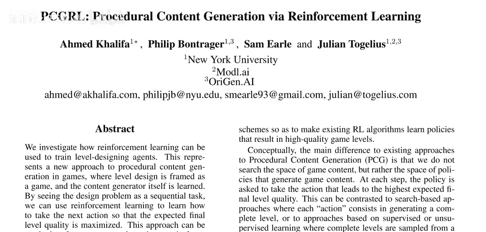

## 问题背景
你是否想过电子游戏的关卡是如何制作的？这篇论文探讨了这个问题。论文展示了一个通过强化学习训练的智能体，它学会了以多种方式生成电子游戏关卡。

该研究在几个游戏中进行了实现：
*   **迷宫游戏**：目标是生成最长的迷宫。
*   **塞尔达传说改编游戏**：玩家需要拿到钥匙才能打开门。
*   **推箱子游戏**：玩家需要将所有箱子推到绿色方格上以完成谜题。

所有这些关卡生成任务都是通过强化学习完成的。

## 论文简介
我们将要解读的论文是 Ahmed Khalifa、Philip Bontraer、Sam Earle 和 Julian Togelius 撰写的《PCGRL：通过强化学习进行程序化内容生成》。这篇论文非常有趣，它展示了如何将一个实际问题构建为强化学习问题并加以解决。论文思路清晰，篇幅不长，并且代码开源，便于自行研究。

论文指出：“我们研究了如何使用强化学习来训练关卡设计智能体。”通常，强化学习被用于训练玩游戏的智能体，而本文则用它来训练设计关卡的智能体。我们并非直接设计关卡，而是设计一个能够设计关卡的智能体。这样做的好处是，一旦智能体训练完成，它就有可能生成多种不同的关卡。

这代表了一种游戏程序化内容生成的新方法，它将关卡设计本身构建为一个游戏。通过将设计问题视为一个序列任务，我们可以使用强化学习来学习如何采取下一个动作，以最大化最终关卡的预期质量。这种方法适用于训练样本极少或没有样本的情况，并且训练好的生成器运行速度非常快。

## 强化学习框架构建
以上是问题的基本设定。接下来，我们将介绍实现这一目标需要完成的步骤。这篇论文在几个方面做得很好。

首先，必须将问题构建为强化学习任务。强化学习的基本框架很简单：存在一个智能体与环境的划分。

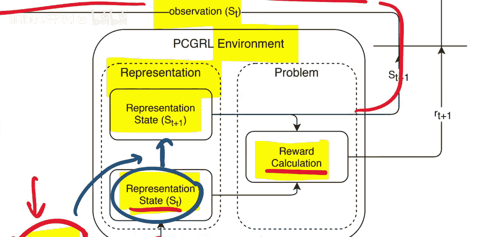

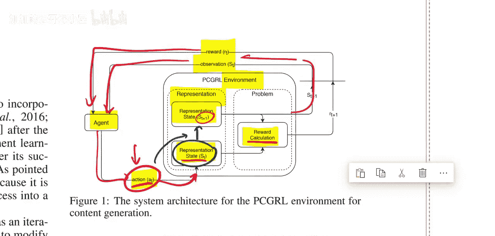

在每个时间步：
1.  环境向智能体发送一个**观察**。
2.  智能体根据观察输出一个**动作**。
3.  环境根据该动作，更新内部状态，并计算出下一个观察和该动作带来的**奖励**。

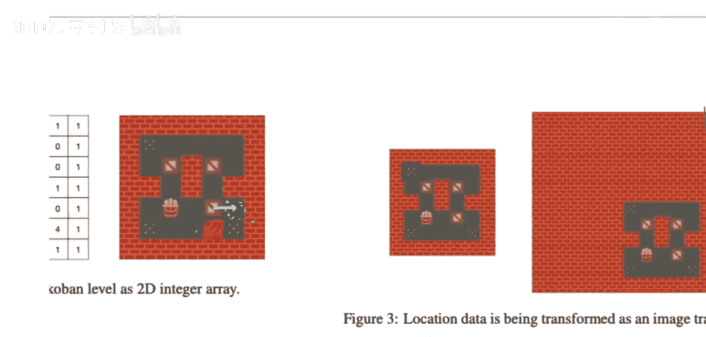

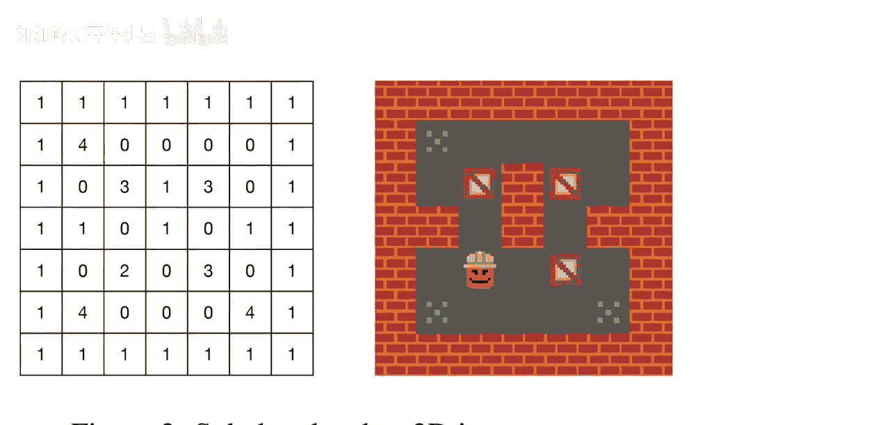

因此，智能体在每个步骤会收到上一个动作的奖励和当前环境的观察，然后输出下一个动作。

对于环境设计者来说，需要决定以下几点：
*   **观察空间**：如何表示观察？
*   **状态转移**：给定一个动作，如何将上一个状态转换为下一个状态？
*   **奖励计算**：如何计算奖励？
*   **动作空间**：智能体可以执行哪些动作？

一旦定义了这些要素，就可以将其接入标准的强化学习算法进行求解。这正是标准化表示带来的便利。

## 观察空间与动作空间
### 观察空间
本论文处理的所有游戏都基于一个**网格世界**框架。关卡被划分为一个网格，这自然对应一个二维矩阵。

矩阵中的每个位置都有一个数字，代表该格子的**瓷砖类型**。例如：
*   `1` 代表墙
*   `0` 代表空地
*   `3` 代表箱子
*   `2` 代表玩家

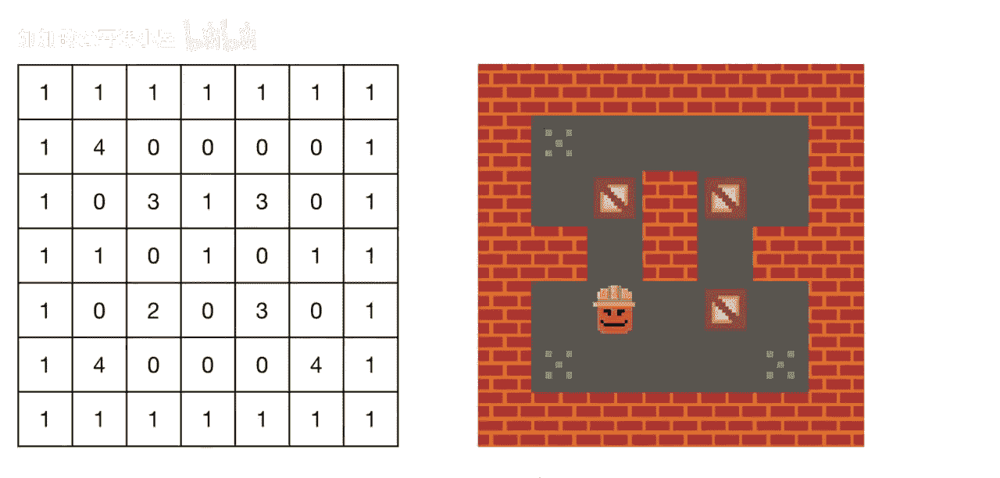

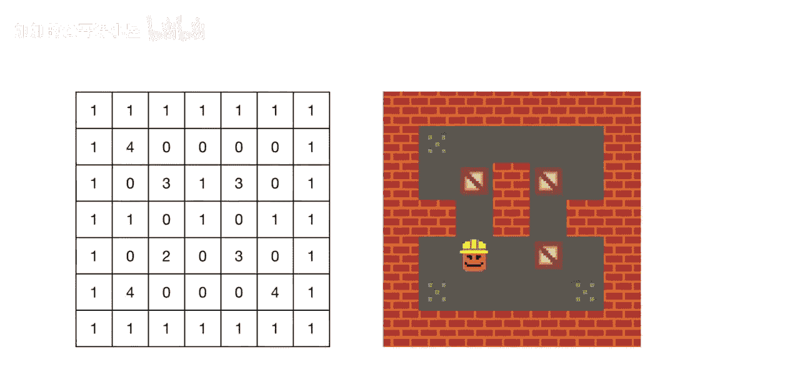

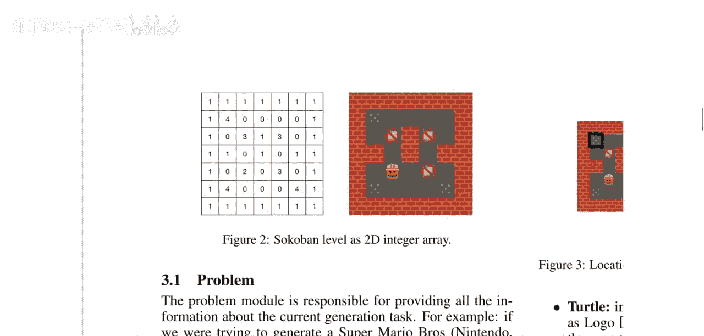

因此，观察空间就是这个代表关卡布局的二维矩阵。

### 动作空间
那么，智能体在每个步骤能做什么呢？论文中，智能体可以**改变其中一个格子**的瓷砖类型。例如，当前格子是一面墙，智能体可以选择保持原样，或者将其改为其他类型（例如改为玩家`2`）。当然，如果改为玩家，可能会导致关卡中出现两个玩家，从而生成无效的关卡。强化学习智能体的最终目标是学会生成既有效又高质量的关卡。

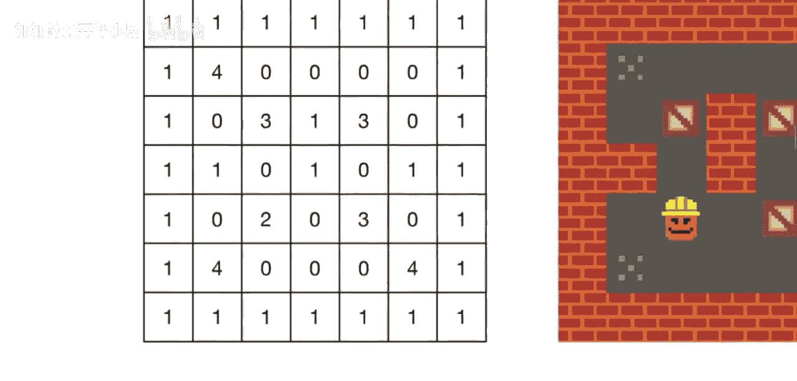

因此，在每个步骤，智能体可以改变一个格子，目标是随着时间的推移，让关卡变得越来越好。

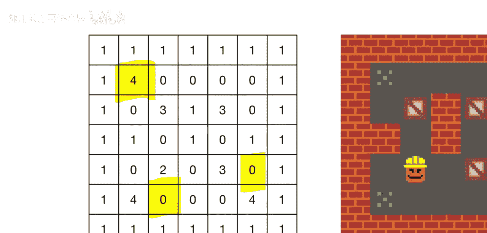

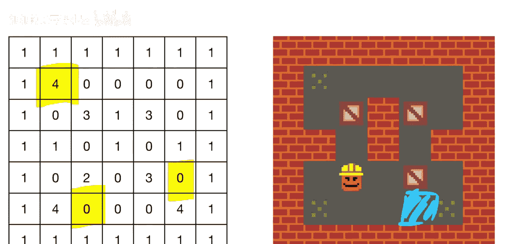

## 瓷砖选择策略
一个关键问题是：**如何选择要改变的格子？** 论文定义了三种不同的策略，让智能体决定改变哪个格子。

### 1. 狭窄型策略
在这种策略下，由**环境**随机选择下一个可以改变的格子。环境会告诉智能体：“现在你可以改变这个格子（如果你想）。” 然后下一步再随机选择另一个格子。

这种方式对智能体来说是有问题的，因为它无法预测下一个能改变哪个格子，因此无法进行长远规划，只能做出非常局部、贪婪的决策。例如，智能体可能想移动一个箱子使其更难被推到目标点，它需要先删除原位置的箱子，然后等待环境随机选中目标位置来放置箱子。如果目标位置在回合结束前始终未被选中，关卡就可能一直处于无效状态。因此，智能体被迫首先贪婪地确保关卡有效，然后才能以局部的方式尝试增加趣味性。

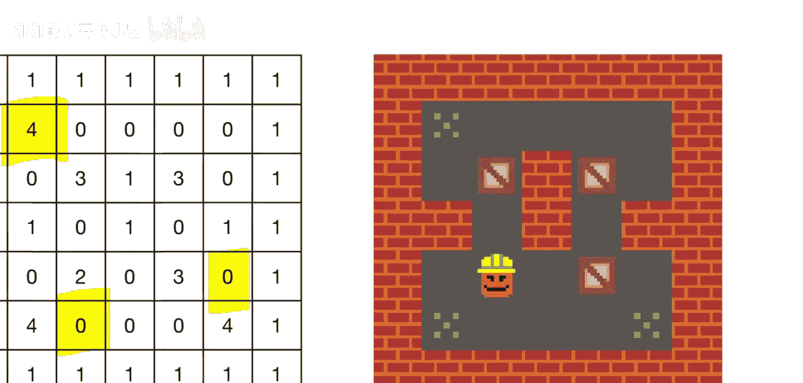

### 2. 海龟型策略
这种策略借鉴了“海龟绘图”的概念。智能体控制一个“海龟”（光标），它从一个起始方格开始。在每个步骤，智能体不仅可以决定是否改变当前格子的类型，还可以决定如何将“海龟”移动到下一个方格（上、下、左、右）。

这样，智能体就可以沿着路径连续操作，例如建造一堵长墙。这赋予了智能体更强的规划能力，因为它可以自主控制探索和修改的顺序。

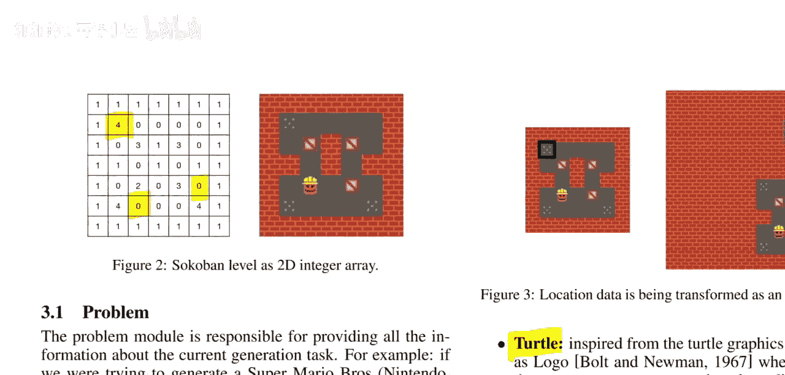

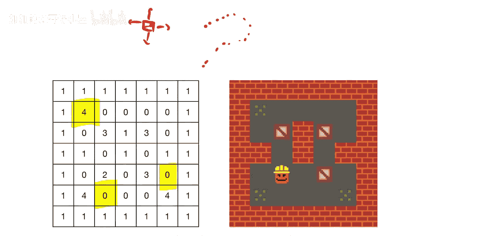

### 3. 宽泛型策略
在宽泛型策略中，智能体拥有最大的自由度：它可以在**每个步骤直接选择关卡中的任何一个格子**进行修改。这为智能体提供了最强的全局规划能力，但同时也大大增加了动作空间的复杂度。

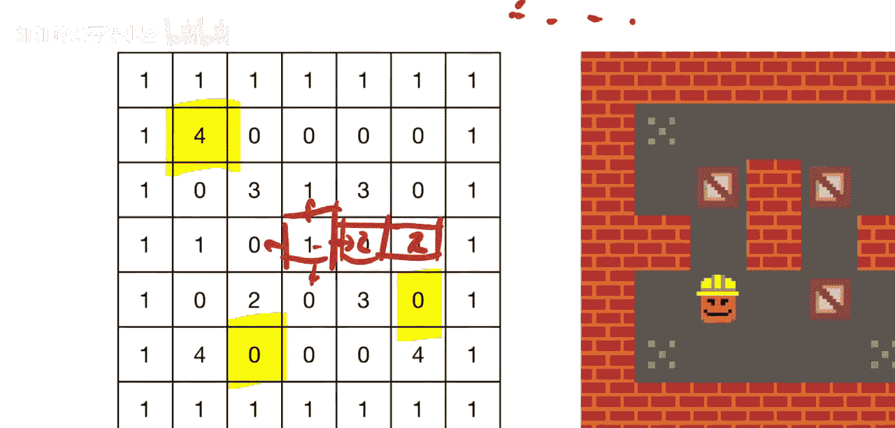

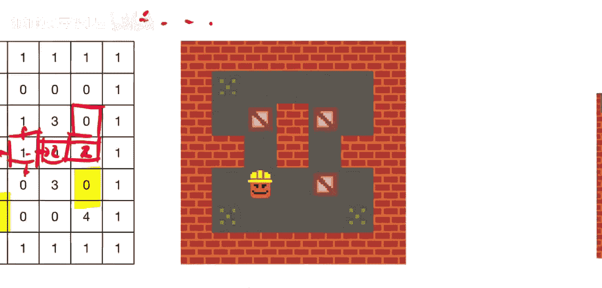

## 总结
本节课我们一起学习了《PCGRL：通过强化学习进行程序化内容生成》这篇论文。我们了解到，可以将游戏关卡生成问题构建为一个强化学习环境，其中观察空间是代表关卡布局的网格矩阵，动作空间是修改特定格子的瓷砖类型。论文探讨了三种不同的瓷砖选择策略（狭窄型、海龟型、宽泛型），它们在不同程度上影响了智能体的规划能力。通过这种方式，我们可以训练出能够自动生成多样、有效且有趣游戏关卡的智能体。