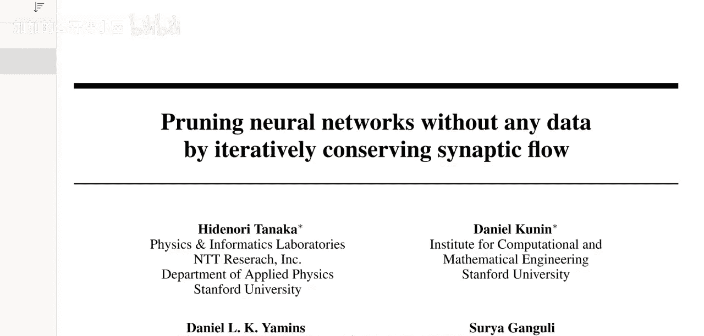
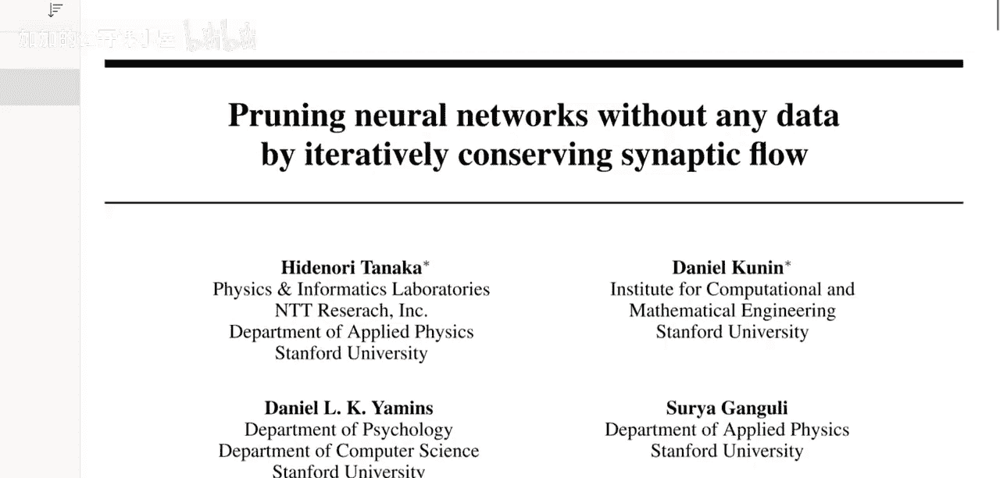
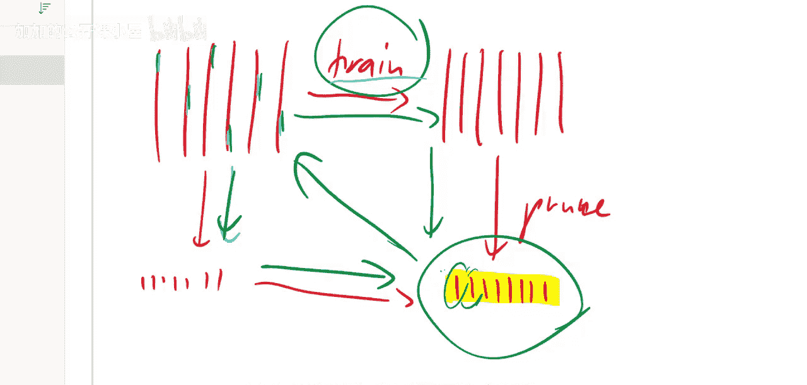
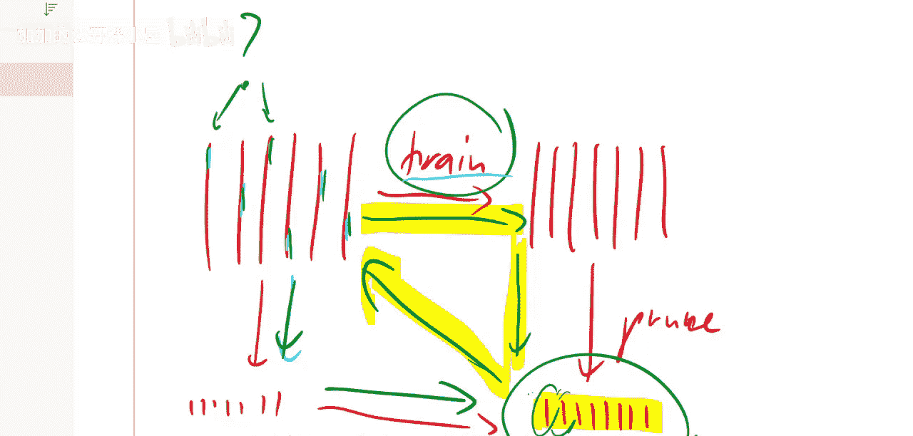
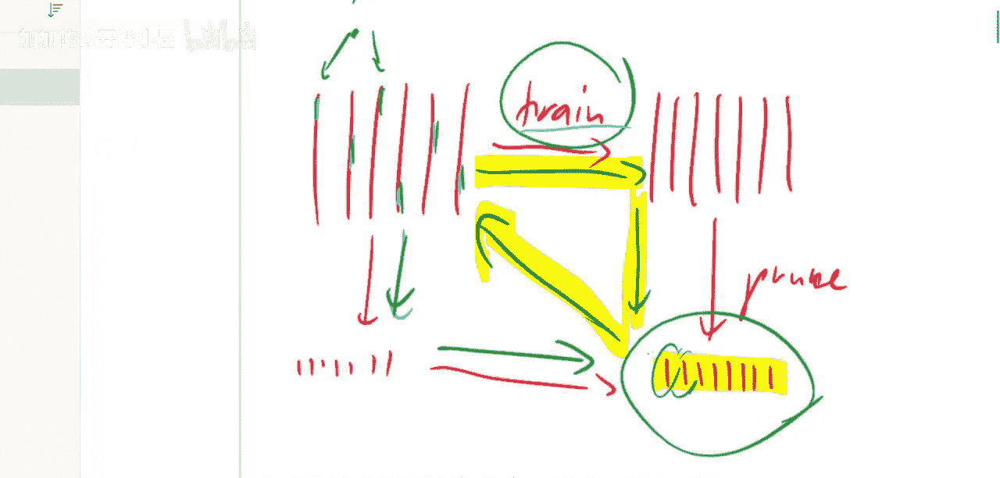
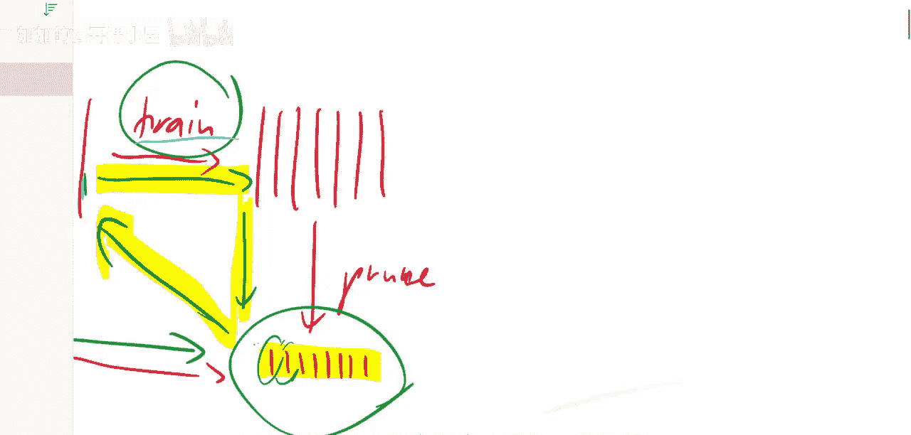
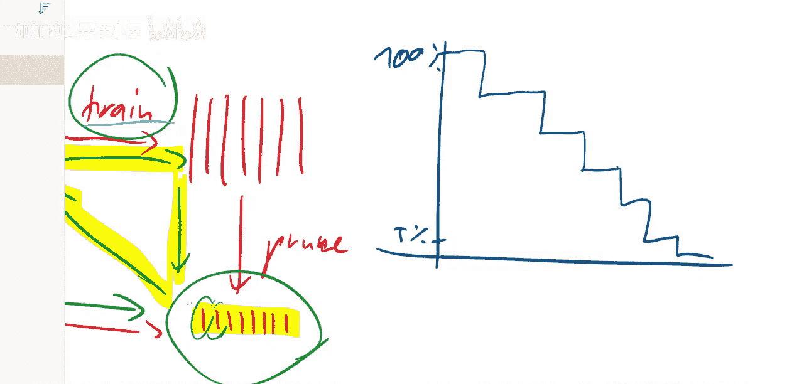
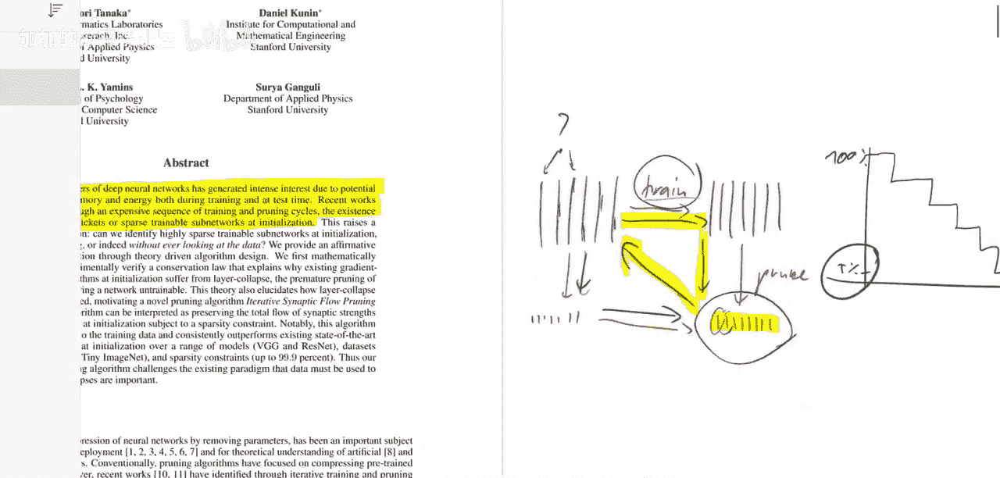
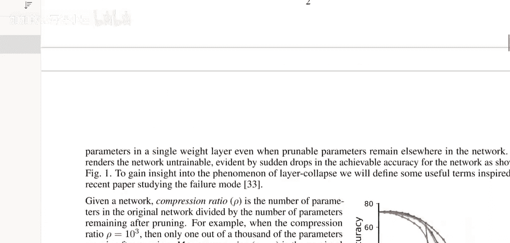

# 037：通过迭代守恒突触流实现无需数据的神经网络剪枝 🧠✂️

在本节课中，我们将学习一篇名为《SynFlow：通过迭代守恒突触流实现无需数据的神经网络剪枝》的论文。我们将探讨如何在不使用任何训练数据的情况下，在神经网络训练初期就对其进行剪枝，并理解其核心算法如何避免“层塌陷”问题。

## 概述





这篇论文的核心目标，是在不依赖任何数据的情况下，对未经训练的神经网络进行剪枝。它借鉴了“彩票假设”的思想，但提出了一种无需先训练完整网络就能识别重要连接的方法。其关键在于避免“层塌陷”现象，并通过守恒一个称为“突触流”的量来实现高效剪枝。

## 背景：神经网络剪枝的两种方式

上一节我们介绍了论文的目标，本节中我们来看看神经网络剪枝的两种主要范式，以理解本文工作的出发点。

神经网络由许多层的神经元和连接（权重）构成。剪枝的目标是得到一个更小但性能良好的网络。传统方法通常遵循“先训练，后剪枝”的流程：

1.  **训练大型网络**：首先完整训练一个大型神经网络，使其达到良好性能。
2.  **剪枝大型网络**：移除网络中不重要的连接（权重），得到一个稀疏的子网络。

这种方法的好处在于：
*   **减少存储**：稀疏网络体积更小，便于传输和部署。
*   **提升速度**：更少的权重意味着更少的计算量，推理速度更快。这对于移动设备等资源受限的环境尤其有用。

然而，“彩票假设”论文揭示了一种新的可能性：“先剪枝，后训练”。该研究发现，在训练初期就存在一个可训练的稀疏子网络（即“中奖彩票”）。传统方法需要先完整训练再剪枝，只是为了找出哪些连接是重要的。“彩票假设”表明，**如果我们能提前知道哪些连接重要**，就可以在训练开始前直接剪枝，然后训练这个稀疏网络，其效果甚至可以更好。

但“彩票假设”方法仍需要一个完整的训练周期来识别重要连接。本文则进一步追问：**我们能否设计一种剪枝算法，在训练初期、且完全不看任何数据的情况下，就找出重要的连接？**

## 核心问题：层塌陷

上一节我们了解了“先剪枝后训练”的潜力与挑战，本节中我们来看看阻碍实现这一目标的核心障碍——“层塌陷”。

“层塌陷”是指剪枝算法错误地移除了神经网络中某一层的全部连接。这会导致信息流在该层中断，网络无法进行有效训练。论文指出，现有许多剪枝算法无法达到很高的剪枝比例（即压缩率），正是因为它们会过早地引发层塌陷。

## 理论基础：突触显著性的守恒

那么，为什么会产生层塌陷呢？上一节我们定义了问题，本节中我们来探讨其背后的理论原因——突触显著性的守恒。

论文首先提出了一个指导性原则：“最大临界压缩公理”。接着，它分析了一类基于梯度的剪枝评分标准，称为“突触显著性”。论文的关键论证之一是：**在神经网络的每个隐藏层，突触显著性的总和是守恒的**。



这意味着，如果你根据显著性分数剪枝，并且某一层的显著性分数普遍较低，那么为了达到目标剪枝比例，你可能不得不剪掉该层的大部分甚至全部连接，从而导致层塌陷。**突触显著性的守恒特性，是导致层塌陷现象的内在原因。**



## 解决方案：迭代剪枝

既然我们知道了层塌陷的成因，那么如何避免它呢？上一节的理论分析指向了解决方案，本节中我们来看看具体的实践方法——迭代剪枝。

论文指出，解决层塌陷的一个有效方法是采用**迭代剪枝**，而非一次性剪枝。这借鉴了“彩票假设”中常用的“迭代幅度剪枝”策略：不是直接从100%的权重剪枝到5%，而是分多个阶段进行（例如，先到90%，再到80%，依此类推）。

这种迭代过程可以避免因一次性剪枝过多而触发层塌陷。论文进一步证明：**一个使用迭代方式、并基于正突触显著性分数的剪枝算法，能够完全避免层塌陷，并满足最大临界压缩公理。**

## 提出的算法：SynFlow（突触流剪枝）



基于以上分析，论文最终提出了自己的算法。上一节我们明确了迭代是关键，本节中我们来看看论文如何将这些理念整合成一个无需数据的具体算法——SynFlow。

SynFlow算法整合了所有关键思想：
1.  **无需数据**：它不依赖于任何输入数据来计算显著性。
2.  **基于突触流**：它定义并使用一种特殊的、恒为正的“突触流”分数作为剪枝依据。
3.  **迭代执行**：通过多次迭代逐步剪枝，避免层塌陷。







以下是该算法核心思想的简化表述：

```
# 概念性伪代码，展示SynFlow核心循环
while 未达到目标稀疏度:
    # 1. 计算突触流显著性分数
    scores = synflow_score(network)
    # 2. 根据分数排序，移除分数最低的一部分权重
    prune_lowest_scores(network, scores, small_percentage)
    # 3. 进入下一轮迭代
```

通过这种方式，SynFlow能够在神经网络初始化后、任何训练开始前，就识别并保留重要的连接子集，从而实现高压缩率的无损剪枝。

## 总结




本节课我们一起学习了《SynFlow：通过迭代守恒突触流实现无需数据的神经网络剪枝》这篇论文。我们首先回顾了神经网络剪枝的两种范式，并指出了“先剪枝后训练”的难点。接着，我们深入探讨了“层塌陷”问题及其根源——突触显著性的守恒特性。然后，我们了解到**迭代剪枝**是避免层塌陷的有效手段。最后，论文提出的**SynFlow算法**综合运用了这些见解，通过迭代地评估和保留“突触流”，实现了完全不依赖训练数据的高效神经网络初始化剪枝。这项研究为在资源受限环境下部署轻量级模型提供了新的有力工具。