# 039：重新审视真正的无监督图像到图像转换（TUNIT）📚

在本节课中，我们将学习一篇名为《重新审视真正的无监督图像到图像转换》的论文。该论文由Kongjue Ba、Yong J. Choi、Yong Jg. Zia、Jg Yu和Xongzg Shiim共同完成。我们将探讨如何在没有人工标注的情况下，实现图像到图像的风格转换。

---

## 概述

图像到图像翻译的目标是，将一张源图像转换到另一个视觉“域”（例如，不同的风格或类别），同时保留源图像的核心内容（如物体的姿态、结构）。传统方法需要成对的图像数据或至少是域级别的标签。本论文提出了一种**真正无监督**的方法，它通过联合学习**图像聚类**和**图像翻译**，完全摆脱了对任何人工标注的依赖。

---

## 图像到图像翻译的演进历程

上一节我们介绍了图像到图像翻译的基本概念。本节中，我们来看看这项技术的历史发展脉络，以理解TUNIT论文所解决的问题背景。

以下是图像到图像翻译方法演进的三个阶段：

1.  **一对一监督翻译**：需要精确配对的图像。例如，一张鞋的草图必须对应一张真实的鞋照片。模型学习从源域（草图）到目标域（照片）的精确映射。
2.  **域级别监督翻译**：不需要一一对应的图像，但需要知道每张图像属于哪个“域”（例如，“猫品种A”或“猫品种B”）。模型学习在已知的域之间进行转换。
3.  **完全无监督翻译（本文方法）**：数据集只是一堆未标记的图像`X`。我们假设其中存在潜在的风格域，但不知道具体是什么，也不需要对图像进行任何分类。模型的目标是**同时发现这些域**并**学习域间的转换**。

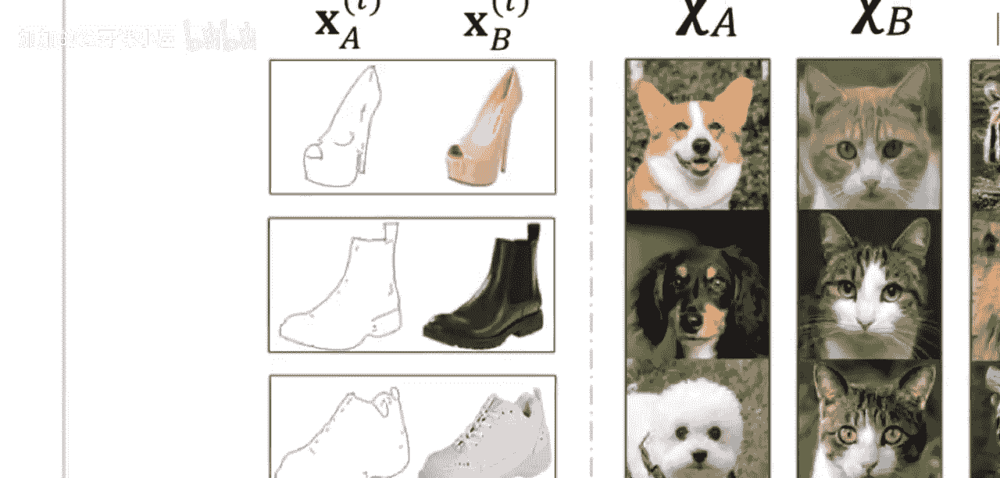

论文指出，如果先进行聚类（发现域），再进行翻译，效果不佳。而**联合学习**这两个任务，能让它们相互促进，得到更好的结果。

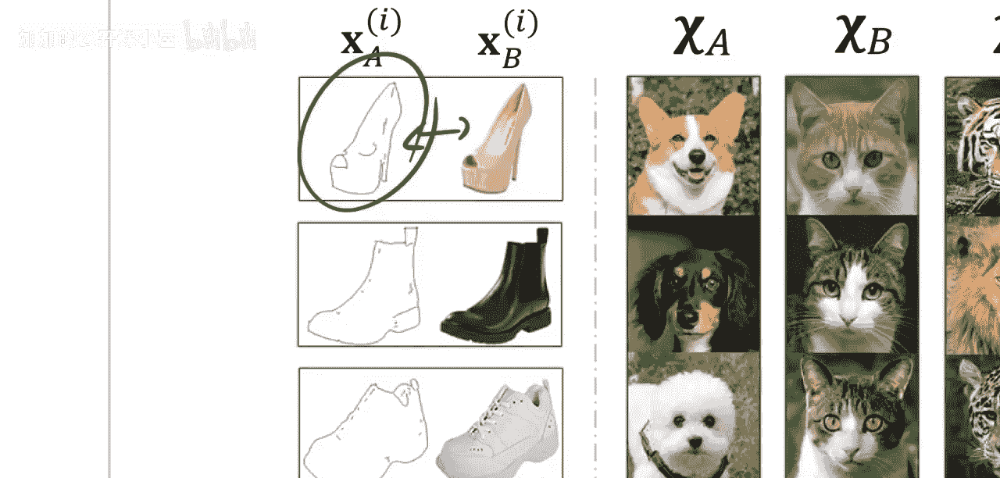

---

## TUNIT模型架构

了解了问题背景后，现在我们深入探讨TUNIT提出的解决方案。其模型主要由三个核心部分组成，它们协同工作以实现无监督的图像翻译。

以下是模型的三个核心组件：

*   **引导网络**：这是一个编码器，其核心作用是**为输入图像分配一个伪标签**（即，预测它属于哪个潜在的风格域）。它替代了传统方法中需要人工提供的域标签。
*   **生成器**：这是一个条件生成器。它接收**源图像**和**目标域标签**（由引导网络从另一张图像中提取），然后生成一张融合了源图像内容和目标域风格的新图像。
*   **判别器**：这是一个**条件判别器**。它接收一张图像和一个域标签，然后判断该图像是“该域下的真实图像”还是“由生成器生成的假图像”。判别器为每个潜在的域都配备了一个分类头。

---

## 引导网络：生成伪标签

上一节我们介绍了模型的整体架构。本节中，我们重点看看引导网络是如何在无监督情况下为图像“创造”标签的。

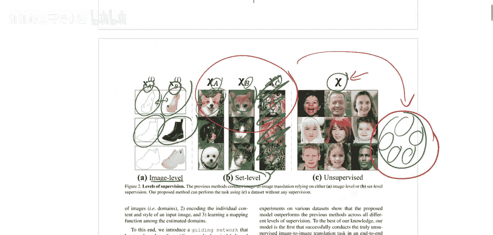

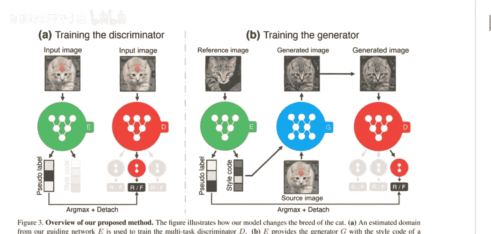

引导网络`G`的目标是将图像映射到一个离散的标签空间（假设有`K`个域）。其训练不依赖于真实标签，而是通过以下**自监督聚类**机制实现：

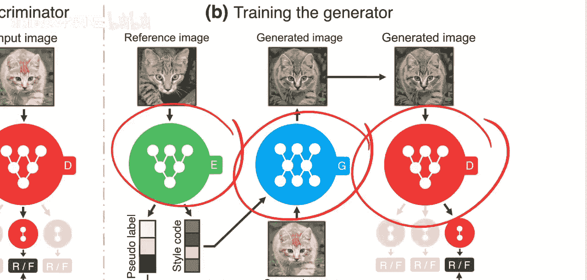

1.  对同一张图像`x`应用两次不同的数据增强（如裁剪、颜色抖动），得到两个视图`v1`和`v2`。
2.  引导网络分别处理这两个视图，得到两个预测分布`P1`和`P2`。
3.  训练目标是让这两个视图的预测**保持一致**。这通过最小化它们之间的**对称交叉熵损失**来实现：

    `L_guidance = H(P1, P2) + H(P2, P1)`

    其中`H`是交叉熵。这鼓励网络对同一图像的不同增强版本产生相同的域预测，从而学习到稳定的视觉概念（即风格域）。

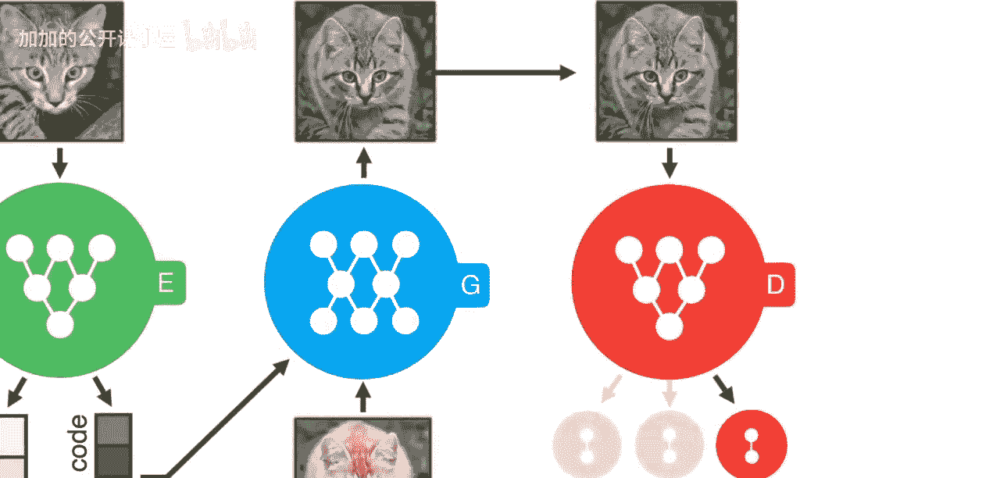

---

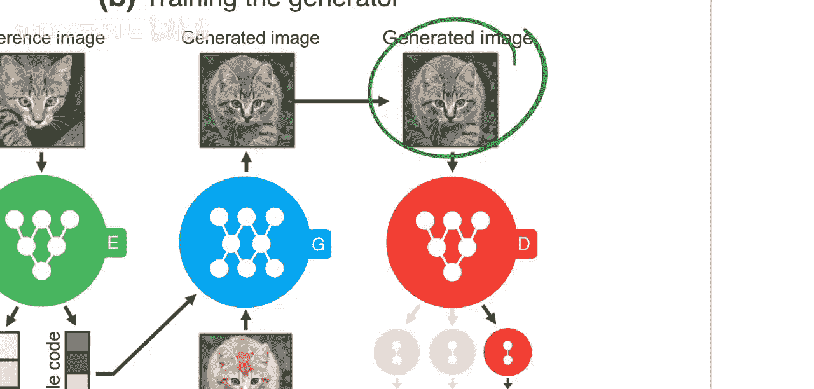

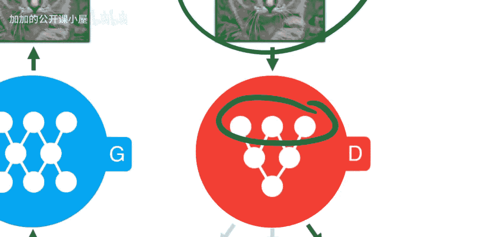

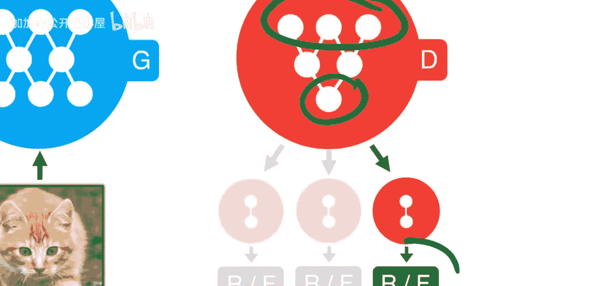

## 生成器与判别器：实现图像翻译

在引导网络为图像分配了伪标签后，生成器和判别器就可以利用这些标签进行对抗训练，从而实现图像翻译。

以下是生成器和判别器的工作流程：

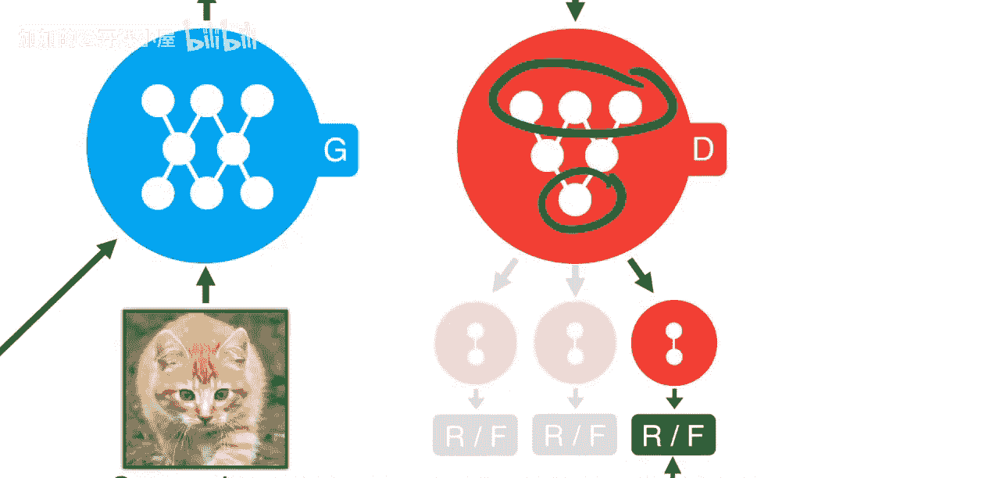

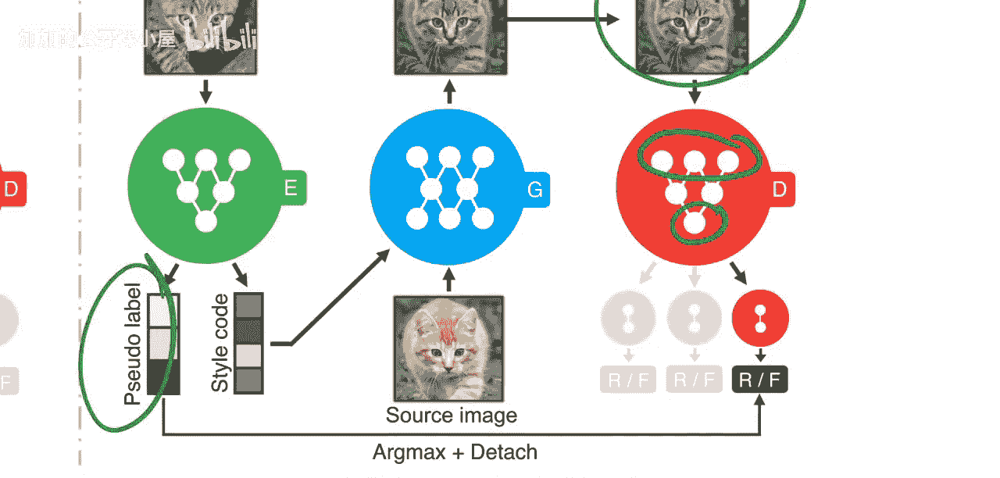

*   **生成器**：接收一个源图像`x_s`和一个目标域标签`c_t`（通常从另一张目标风格图像`x_t`通过引导网络获得）。生成器的任务是产生图像`x_s->t`，它应具备`x_s`的内容和`c_t`域的风格。其损失函数包括：
    *   **对抗损失**：欺骗判别器，让判别器认为`x_s->t`是域`c_t`下的真实图像。
    *   **重构损失**：如果尝试将图像转换回它自己的域（即`c_t`取源图像自身的标签），生成的图像应尽可能接近原图。这有助于保留内容信息。
    *   **循环一致性损失**：将`x_s->t`再转换回源域`c_s`，应该能得到与原始`x_s`相似的图像。
*   **判别器**：是一个多任务网络。对于输入图像`x`和域标签`c`，它有两个任务：
    1.  **域分类**：预测图像`x`属于哪个域（`K`类分类）。
    2.  **真伪判别**：在指定的域`c`下，判断图像`x`是真实的还是生成的（二分类）。

    判别器通过最小化域分类误差和最大化真伪判别能力来训练。

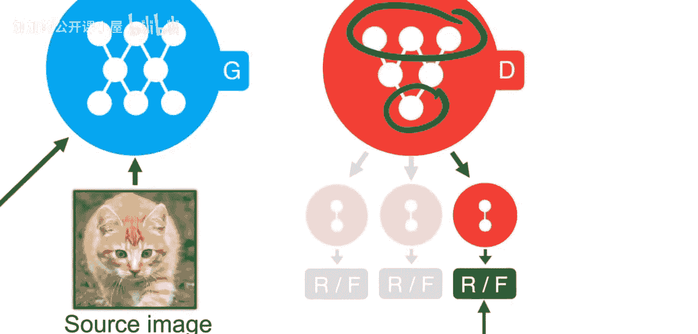

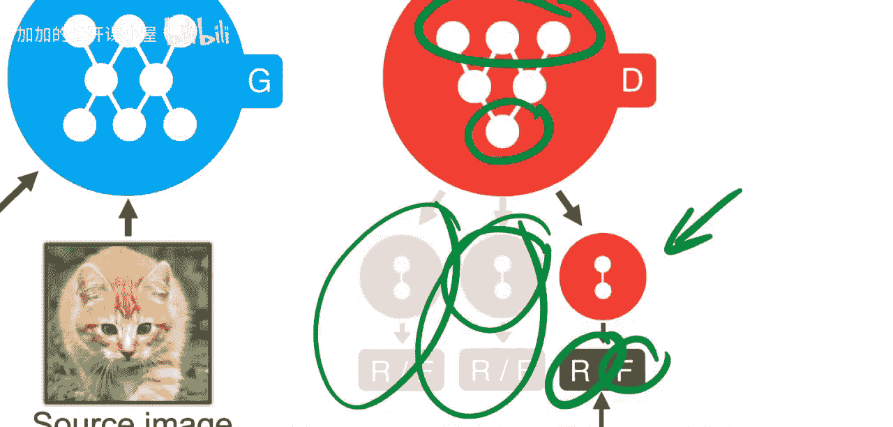

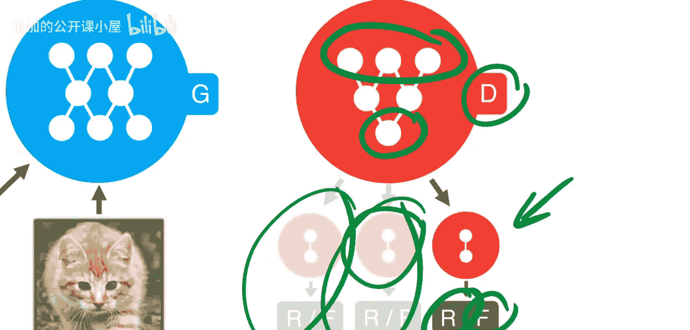

---

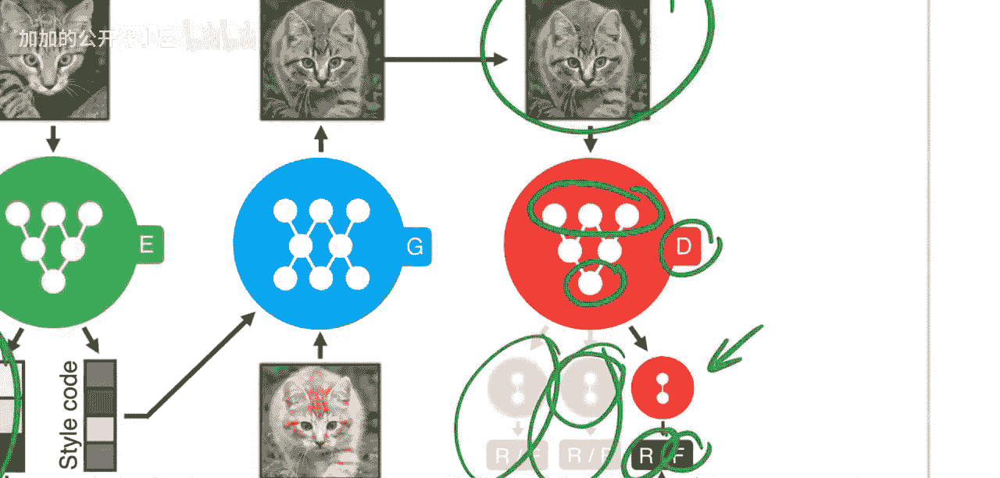

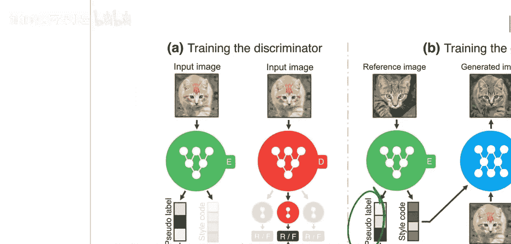

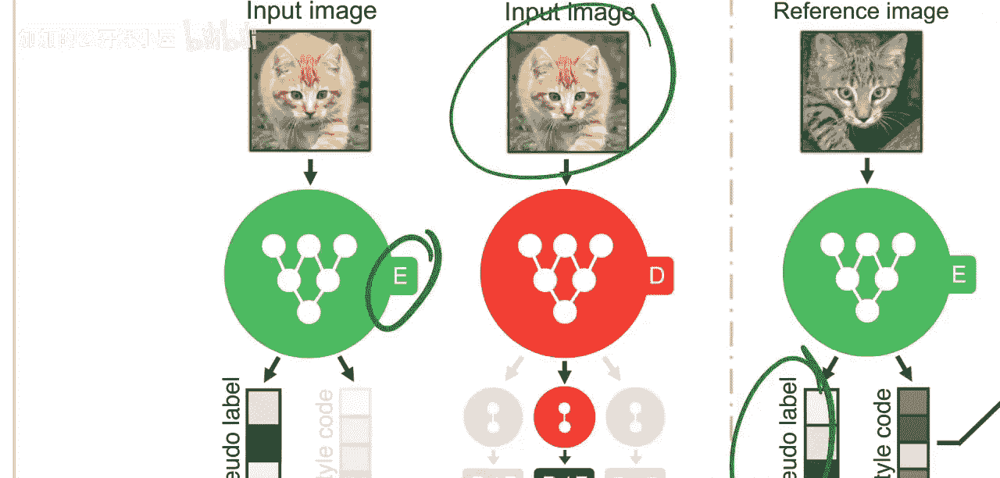

## 总结

本节课中，我们一起学习了TUNIT这篇关于无监督图像到图像翻译的论文。

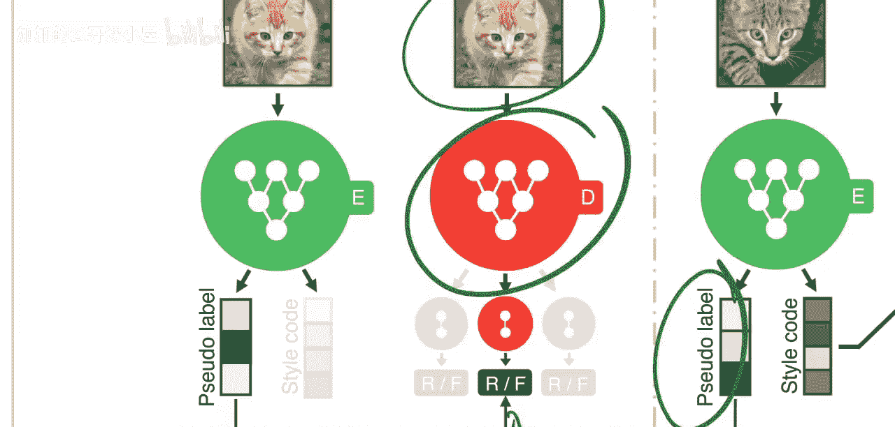

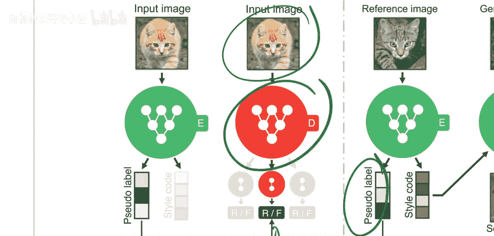

我们回顾了图像翻译从全监督到无监督的发展历程。TUNIT的核心贡献在于，它通过一个**引导网络**进行自监督聚类，为图像生成伪域标签，从而完全摆脱了对人工标注的依赖。然后，它利用这些伪标签，通过一个包含**条件生成器**和**多任务判别器**的GAN框架，**联合学习**域发现和图像翻译两个任务。这种联合学习的方式使得两个任务相互促进，最终在没有任何真实标签的情况下，实现了高质量的图像风格转换。