# 041：基于像素的生成式预训练（论文解读）

在本节课中，我们将学习OpenAI团队提出的“图像GPT”模型。该模型的核心思想是将图像生成任务转化为类似语言建模的问题，通过逐个预测像素来生成或补全图像，并探索这种生成式预训练方法在图像分类任务上的迁移效果。

## 概述

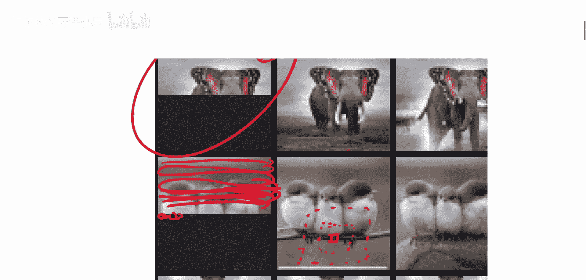

OpenAI团队发布了一个能够生成图像而非文本的新模型。该模型能够根据给定的半张图像，预测并生成被遮盖的另一半，效果令人印象深刻。其特殊之处在于，模型以逐个像素（pixel by pixel）的方式进行预测，类似于语言模型处理文本序列。模型本身对像素间的空间关系没有先验知识，需要从数据中自行学习，这与专门为捕捉局部空间关系而设计的卷积神经网络（CNN）形成对比。

## 模型核心思想：像素序列化

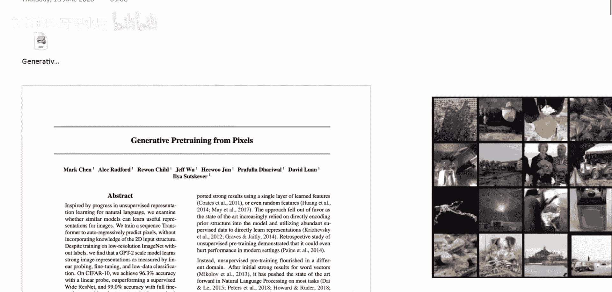

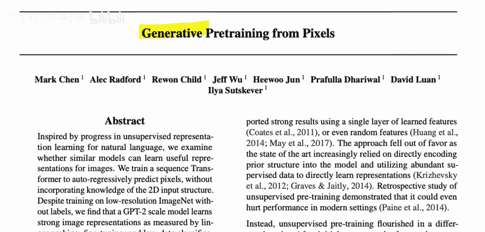

上一节我们介绍了模型的基本目标，本节中我们来看看它是如何处理图像的。由于Transformer模型原本是为文本序列设计的，因此需要将图像转换为序列形式。

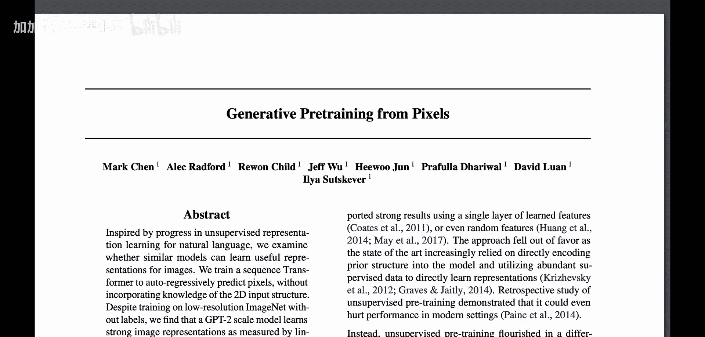

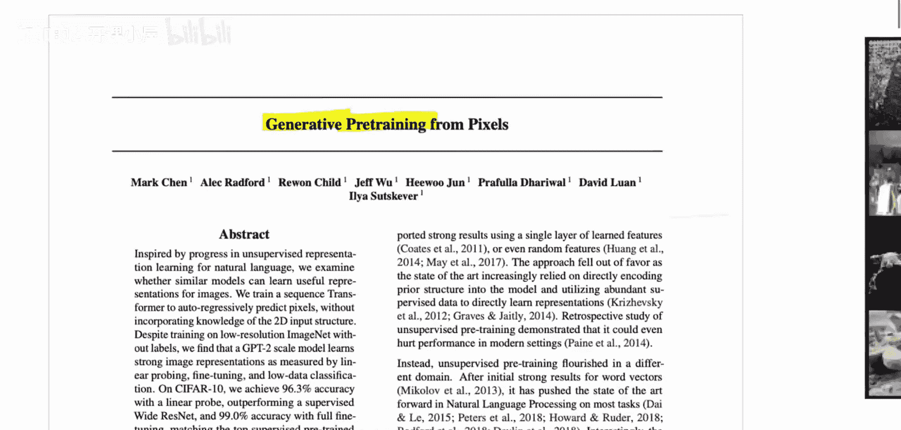

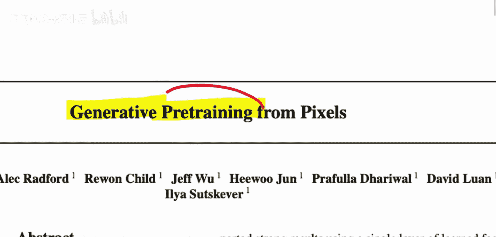

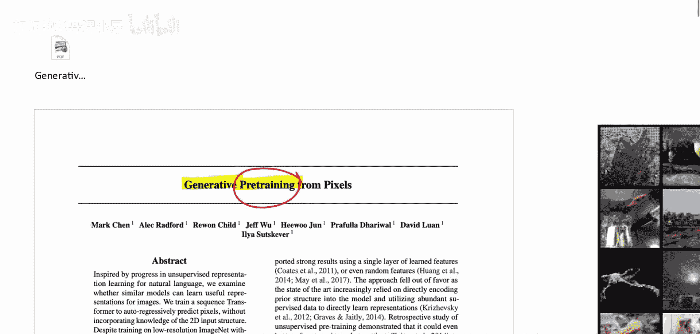

以下是图像序列化的主要步骤：
1.  **图像下采样**：原始图像（如224x224像素）过大，计算成本过高。因此，首先将图像下采样为更小的尺寸，例如32x32或64x64。
2.  **像素展开**：将二维图像按行（从左到右，从上到下）展开成一个一维的像素序列。
3.  **颜色空间简化**：将每个像素的RGB三个颜色通道值，通过一个自定义的编码方式，映射为一个单一的索引值。这大大减少了序列的长度和模型的复杂度。

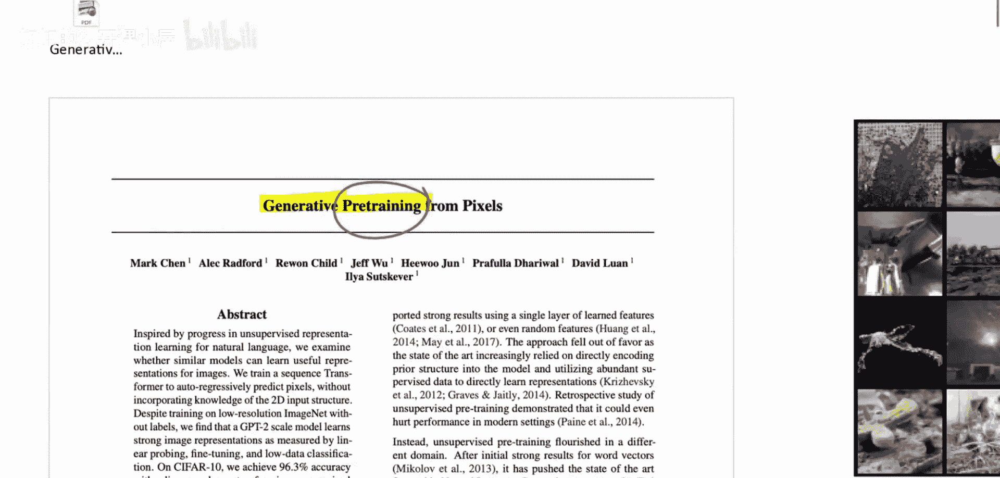

经过以上处理，一张图像最终被表示为一个长度为 `图像高度 * 图像宽度` 的序列，例如 `32 * 32 = 1024`。

## 预训练任务：自回归生成

在将图像转化为序列后，模型如何进行预训练呢？其预训练任务与GPT-2等语言模型类似，采用自回归生成方式。

模型的目标是预测序列中的下一个像素。给定一个像素序列的前N个元素，模型需要预测第N+1个像素是什么。在训练过程中，模型会学习到图像中像素之间的依赖关系和统计规律。这种训练方式不需要任何人工标注的标签，属于无监督学习。

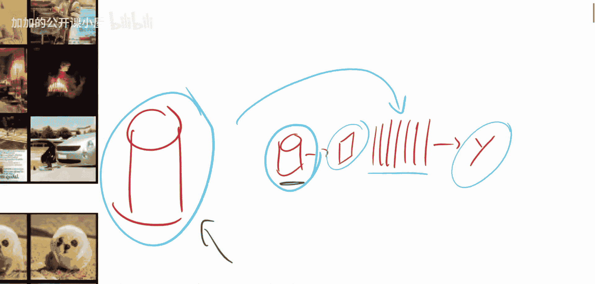

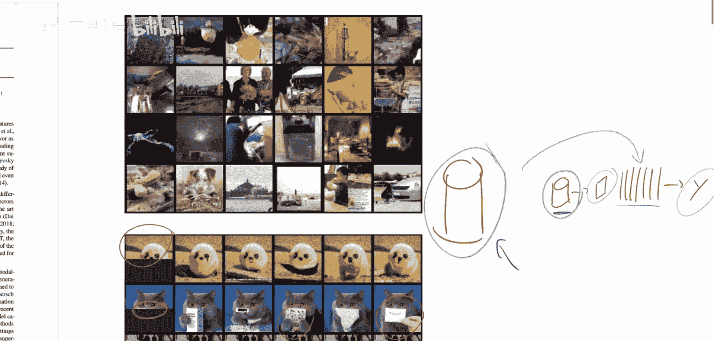

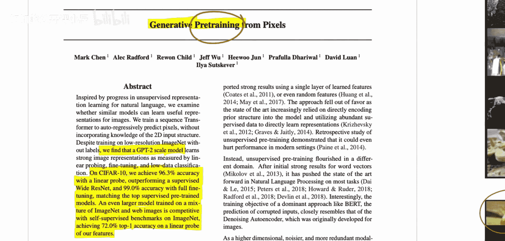

## 微调与应用：图像分类

预训练完成后，模型学到了通用的图像特征表示。接下来，我们可以将这些知识迁移到具体的下游任务上，例如图像分类。

论文的核心贡献在于探索了生成式预训练在图像领域的有效性。具体做法是：
1.  在一个大规模图像数据集（如ImageNet）上进行生成式预训练。
2.  将预训练好的模型，在一个较小的有标签数据集（如CIFAR-10）上进行微调，用于图像分类任务。

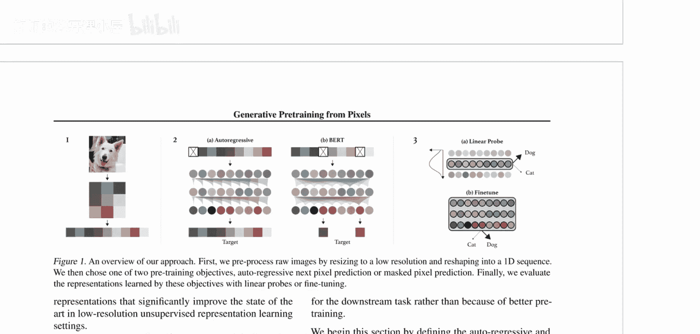

实验结果表明，经过生成式预训练再微调的模型，在CIFAR-10上达到了96.3%的准确率（线性探测），甚至超过了有监督训练的Wide ResNet模型。这证明了生成式预训练可以作为图像领域一种有效的自监督学习方法。

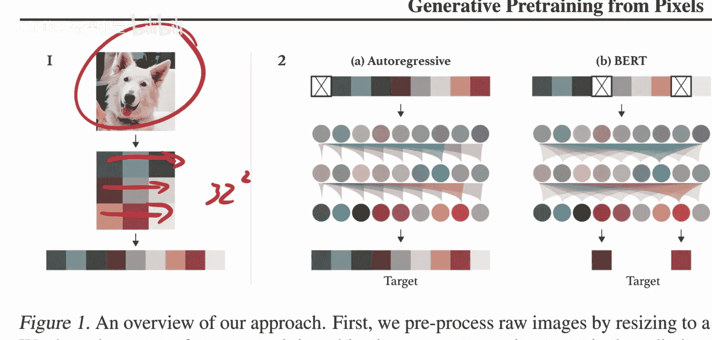

## 总结

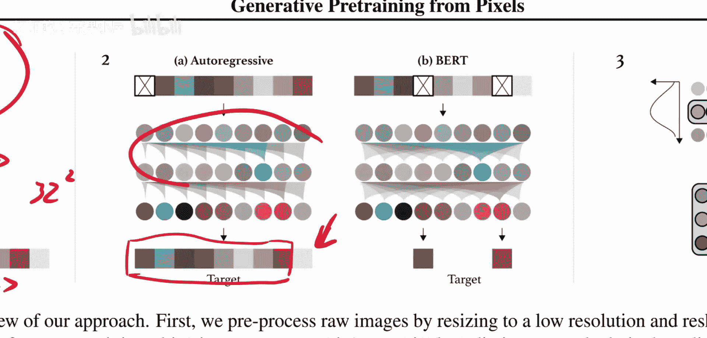

本节课中我们一起学习了图像GPT模型。该模型创新地将Transformer架构应用于图像生成，通过将图像视为像素序列并进行自回归预训练，学习到了强大的图像特征表示。随后，通过在下游分类任务上微调，证明了这种生成式预训练策略在视觉任务上具有与当前主流自监督方法相竞争的潜力。这为视觉模型的预训练开辟了一条新的、受自然语言处理领域启发的道路。