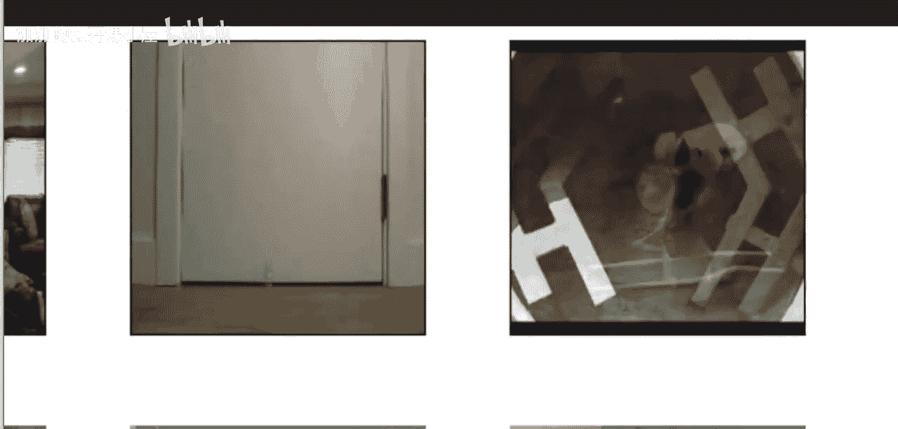
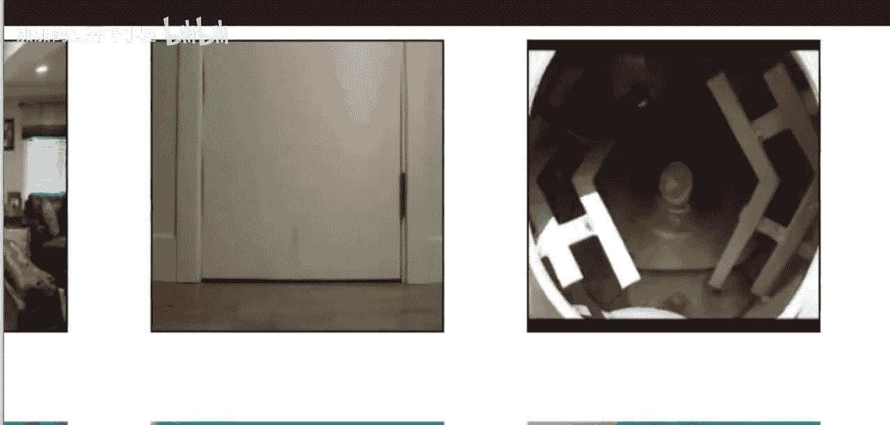
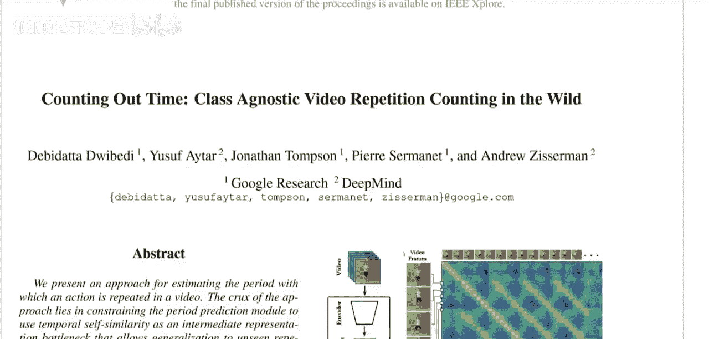
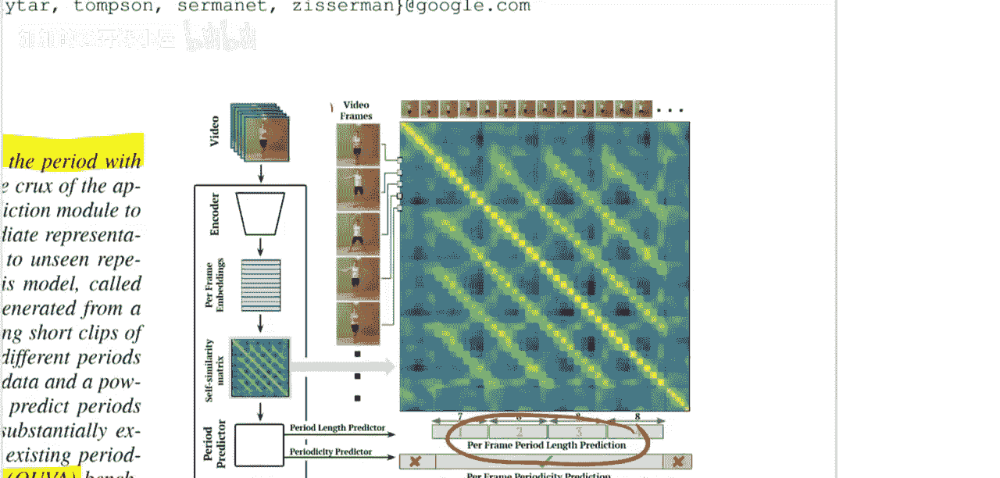
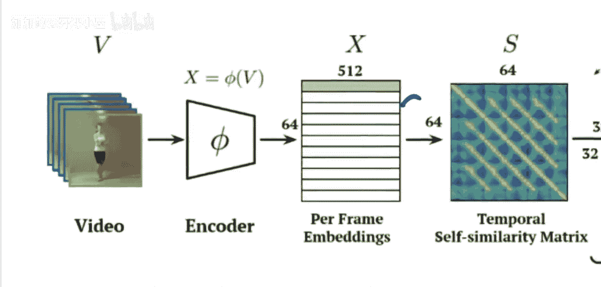
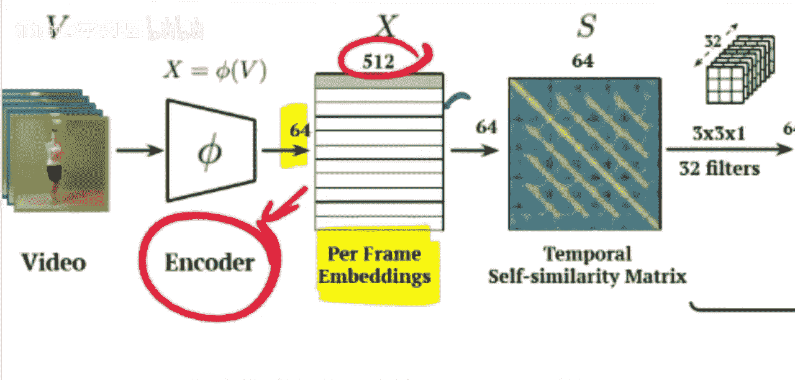
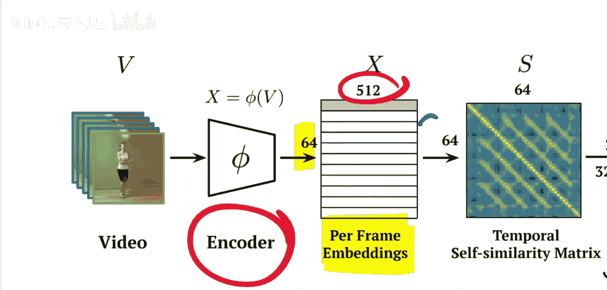
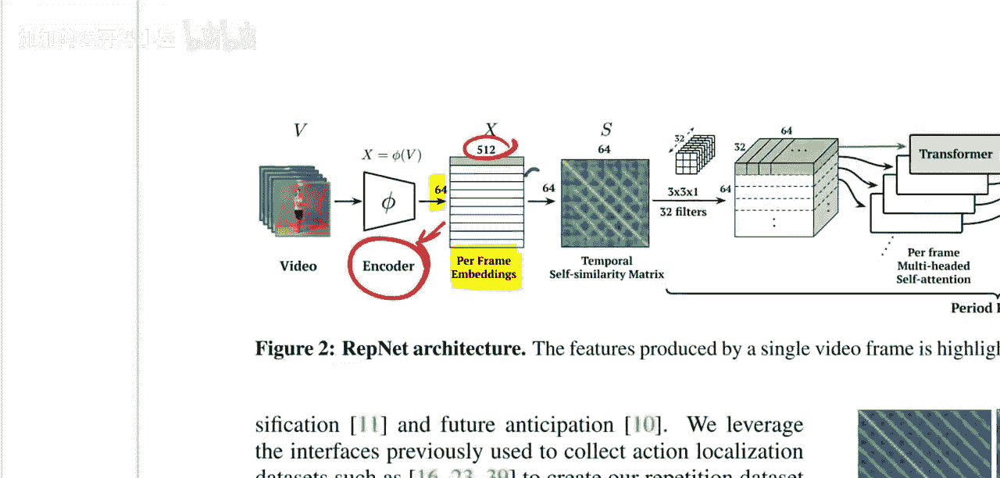
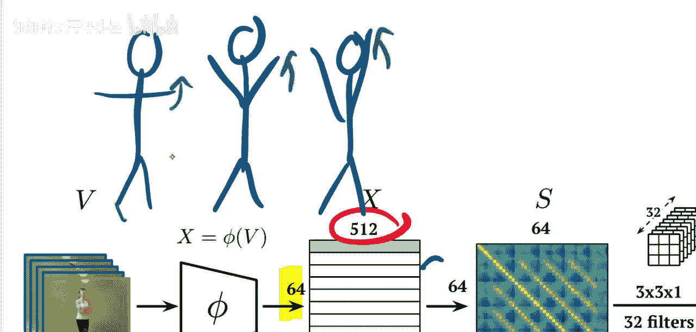
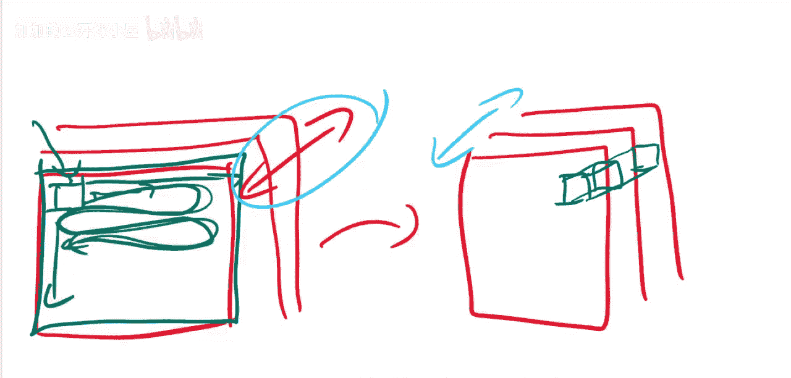

# 044：计算视频中的重复次数

在本节课中，我们将要学习一篇名为《Counting Out Time: Class Agnostic Video Repetition Counting in the Wild》的论文。这篇论文由谷歌研究院和DeepMind的研究人员提出，旨在解决一个有趣的问题：如何让AI自动检测视频中是否有重复动作，并精确计算出该动作重复了多少次。我们将从问题定义、解决方案、模型架构到数据集构建，系统地解析这篇论文。

## 问题定义与挑战 🎯






上一节我们介绍了课程目标，本节中我们来看看论文要解决的具体问题。论文的目标是构建一个能够检测视频中重复动作并计算其重复次数的AI系统。

以下是几个示例视频中存在的挑战：
*   左侧视频中，人物以相当规律的节奏做开合跳。
*   中间视频中，网球弹跳的速度越来越快。
*   右侧视频中，在重复的铲水泥动作开始前，有一段简短的介绍性片段。


从这些例子中，我们可以看到任务的难点不仅在于识别动作本身，还在于重复动作的**模式、长度和外观都可能发生变化**。这篇论文利用下图底部所示的**时序自相似矩阵**来解决这个问题，我们接下来将探讨其实现原理。

## 方法概述 🚀

上一节我们明确了任务挑战，本节中我们来看看论文提出的整体解决方案。论文提出了一种估计视频中动作重复周期的方法。实际上，这个问题是多方面的。




如上图右侧所示，模型的期望输出在底部。具体来说，模型需要完成以下三个任务：
1.  **逐帧周期性预测**：对于视频的每一帧，判断该帧是否属于一个正在发生的重复动作。例如，在视频的开头和结尾可能没有重复动作，而中间部分有。
2.  **逐帧周期长度预测**：对于属于重复动作的每一帧，预测该重复动作的周期长度。这个长度在视频中可能发生变化，因此需要逐帧预测。
3.  **重复次数计数**：在获得逐帧的周期长度后，即可计算出动作的重复总次数。

此外，论文解决的第三个关键问题是**缺乏足够的数据集**来训练此类模型。现有的数据集（如QUVA）规模很小（约100个样本），主要用于测试，且多样性和挑战性不足。为此，作者构建了一个名为 **`Countix`** 的新数据集，其规模是现有数据集的90倍，更能捕捉真实世界视频中重复计数的挑战，并包含了训练集和测试集划分。

## 模型架构详解 🏗️

上一节我们了解了论文要解决的三个核心问题和其贡献的数据集，本节中我们深入探讨其核心模型架构。这篇论文是深度学习范式下一个非常出色的例子：尽管我们通常倾向于直接用神经网络解决问题，但它展示了通过巧妙设计网络架构，依然能针对特定任务取得卓越性能。



上图（论文中的图2）展示了模型的详细架构。让我们从输出开始理解，以便明确目标。

### 输出与损失函数

对于输入视频（论文中长度为64帧），模型需要对每一帧产生两个输出：
*   **周期长度**：一个数值，在模型中通过分类任务的形式预测（即分到不同的“桶”里）。
*   **周期性**：一个二元变量（0或1），表示该帧是否有重复动作发生。

模型的损失函数就是通过比较这些预测值与真实标签计算得出的，整个网络通过反向传播该损失进行端到端训练。


```
# 输出维度示意
# 假设视频有 T 帧
period_length_prediction = model(video)  # 形状: [T, num_period_bins]
periodicity_prediction = model(video)    # 形状: [T, 2] (经过softmax后表示概率)
loss = combine(period_length_prediction, periodicity_prediction, ground_truth_labels)
```

### 编码器：从视频帧到特征嵌入

明确了输出目标后，让我们回到架构的起点。视频首先通过一个**编码器**，为每一帧生成一个特征嵌入向量。目标是获得64个长度为512的向量，每个向量都编码了对应帧的信息。



编码器由三部分组成：

**1. 卷积特征提取器**
这部分使用 **ResNet-50** 架构。它独立处理每一帧，是一个标准的图像特征提取器，从单张图像中提取视觉特征。

**2. 3D卷积层**
然而，仅处理单帧会丢失时间信息。例如，一个做开合跳的动作，单看某一帧的手臂位置（如下图），无法判断手臂是在向上还是向下运动。







因此，编码器的第二步是引入一个**3D卷积层**。它在提取单帧特征后，将这些特征在时间维度上堆叠，并进行3D卷积操作，从而将局部时间信息整合到每一帧的特征中。

**2D卷积 vs 3D卷积**：
*   **2D卷积**：滤波器在图像的**宽度**和**高度**两个维度上滑动。
*   **3D卷积**：滤波器在**宽度**、**高度**和**时间（帧序列）** 三个维度上滑动。这使得模型能够捕捉相邻帧之间的运动模式。


*（示意图：2D卷积在单帧的空间维度操作）*



*（示意图：3D卷积在空间和时间维度上同时操作）*

**3. 自相似矩阵构建**
这是模型最核心、最巧妙的部分。在获得包含时空信息的逐帧嵌入后，模型计算一个 **`T x T`** 的时序自相似矩阵。这个矩阵的每个元素 `S(i, j)` 代表第 `i` 帧和第 `j` 帧嵌入向量之间的相似度（例如，使用余弦相似度）。


```
# 伪代码：构建自相似矩阵
# embeddings 形状: [T, D]， T是帧数，D是嵌入维度
similarity_matrix = torch.zeros(T, T)
for i in range(T):
    for j in range(T):
        similarity_matrix[i, j] = cosine_similarity(embeddings[i], embeddings[j])
```

对于一个完美的周期性动作，其自相似矩阵会呈现出明显的**对角线条纹图案**，条纹的间隔就对应着动作的周期。这种结构化的表示将复杂的视频内容转换成了一个更能揭示重复模式的二维矩阵。

### 解码器：从矩阵到预测

最后，构建好的自相似矩阵被送入一个**解码器**（另一个神经网络，在论文图中未完全展开）。解码器的任务是从这个矩阵中解读出我们最终需要的两个逐帧预测：周期长度和是否具有周期性。由于自相似矩阵已经将周期信息编码在其结构中，解码器可以更有效地学习到这些模式。

## 总结 📝

本节课中我们一起学习了RepNet这篇论文。我们了解到该论文旨在解决**无类别视频重复计数**这一挑战性任务，其核心贡献包括：
1.  **明确了三个子任务**：逐帧周期性判断、逐帧周期长度预测以及总重复次数计算。
2.  **提出了一个巧妙的架构**：通过**编码器（ResNet-50 + 3D Conv）** 提取帧特征，构建**时序自相似矩阵**来显式地表征重复模式，最后通过**解码器**输出预测。
3.  **创建了大规模数据集Countix**：解决了该领域数据稀缺的问题，为模型训练和评估提供了坚实基础。


RepNet展示了如何将领域知识（周期性导致自相似矩阵出现条纹）与深度学习框架相结合，设计出高效且可解释的模型，是视频理解领域一个非常经典的工作。