# 045：如何高效阅读学术论文

在本节课中，我们将跟随Yannic Kilcher的讲解，学习一种系统性的学术论文阅读方法。我们将以Facebook的DETR论文为例，拆解从标题到结论的完整阅读流程，帮助你快速抓住论文的核心贡献与创新点。

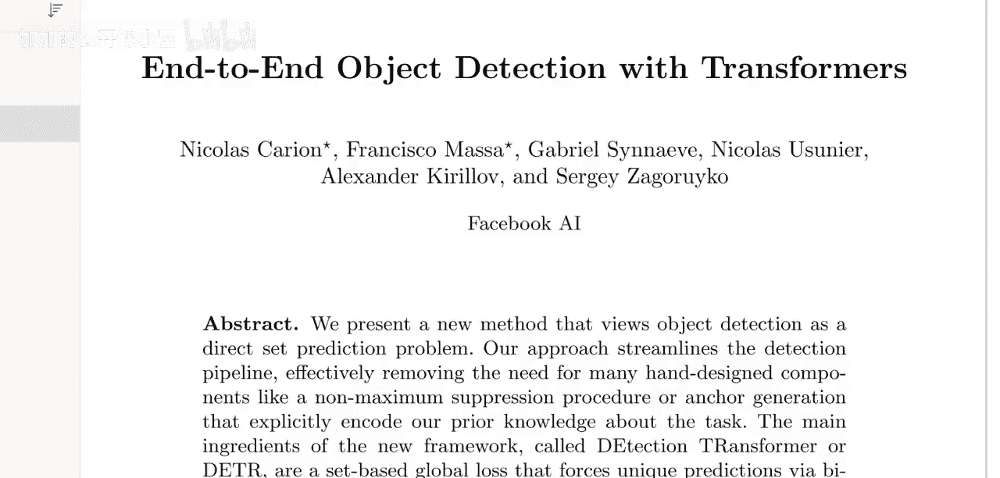

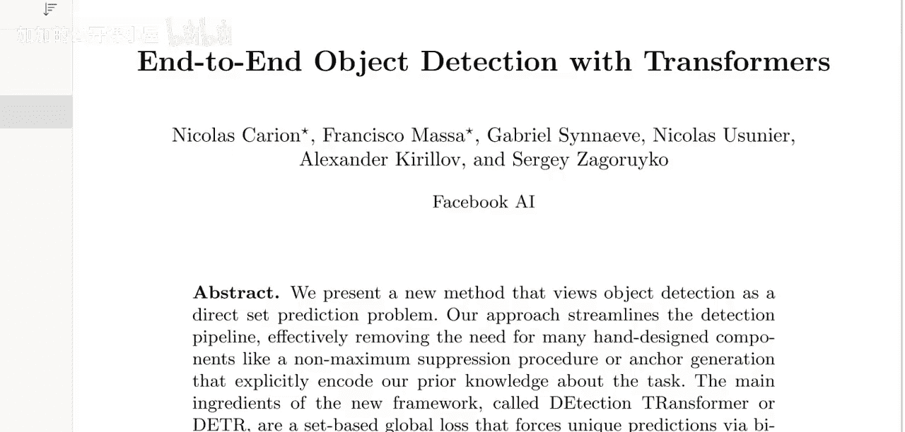

---

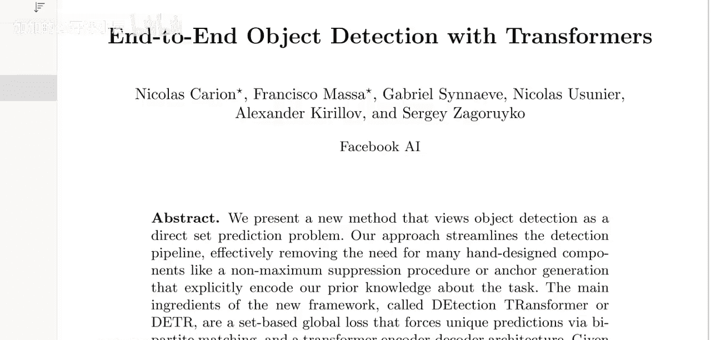

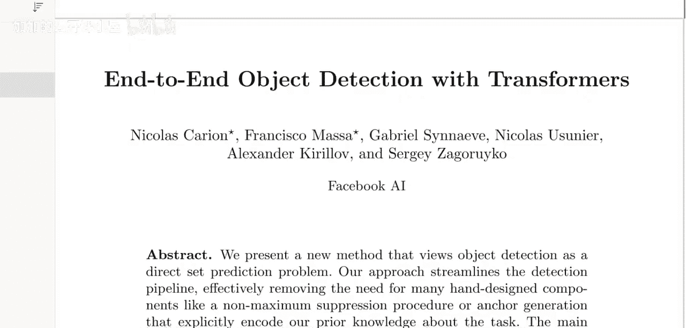

## 第1节：从标题开始，建立初步假设

阅读论文的第一步是仔细审视标题。标题通常包含了论文最核心的信息。

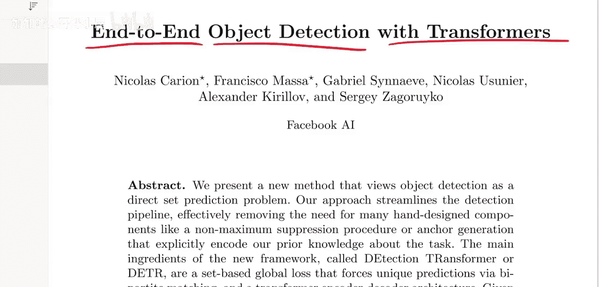

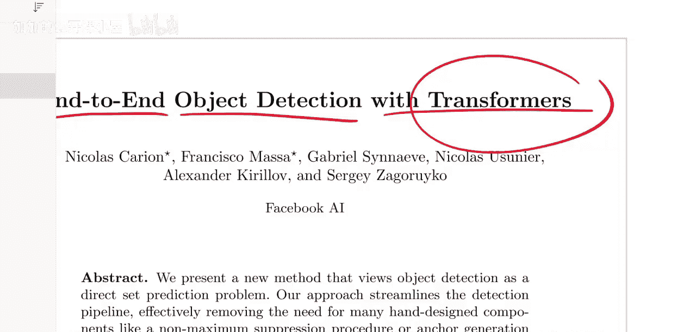

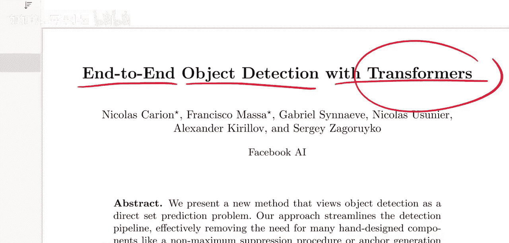

以DETR论文的标题 **“End-to-End Object Detection with Transformers”** 为例，我们可以进行如下分析：

*   **“Transformers”**：我们知道Transformer是自然语言处理领域的经典模型。这暗示了论文可能将NLP领域的模型应用到了新领域。
*   **“Object Detection”**：这是计算机视觉的核心任务。结合前一点，我们立刻能察觉到论文的**跨领域创新点**——将NLP模型用于视觉任务。
*   **“End-to-End”**：在深度学习领域，端到端训练已很常见。作者特意将其放入标题，暗示**“端到端”** 可能是本文相对于传统目标检测方法的一个关键**新颖之处**。

通过标题，我们迅速形成了两个初步假设：这篇论文的重要性可能在于 **1）将Transformer应用于目标检测**，以及 **2）实现了一个端到端的检测流程**。带着这些假设进入正文，阅读会更有目的性。

---

## 第2节：理性看待作者与机构信息

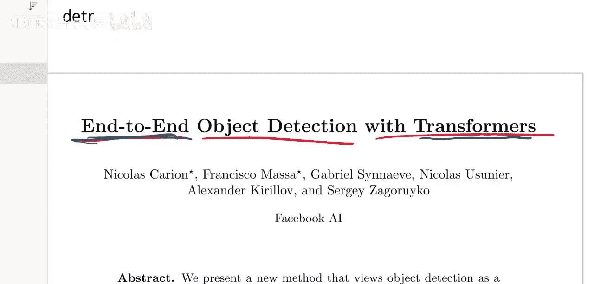

接下来，我们会看到作者名单和所属机构。对此，应保持理性态度：

*   **作者名气**：知名作者（如Yoshua Bengio）的名字可能会吸引更多关注，但这**不等于**论文质量一定更高。大实验室的论文数量众多，质量也有差异。更应关注**第一作者**以往的工作，这更能预示当前研究的风格与深度。
*   **机构声望**：来自知名机构（如Facebook AI Research, Google AI）的论文通常会获得更多媒体曝光和学术审查。这带来双重影响：
    *   **积极面**：更大的压力可能促使实验设计更严谨，结果更可靠。
    *   **注意点**：无论如何，都应对论文中的实验证据保持**批判性态度**。我们的默认立场应是“怀疑实验结果”，直到论文本身用充分的证据说服我们。

核心是：不要让作者或机构的光环影响你对论文内容本身的独立判断。将其视为背景信息，而非质量担保。

---

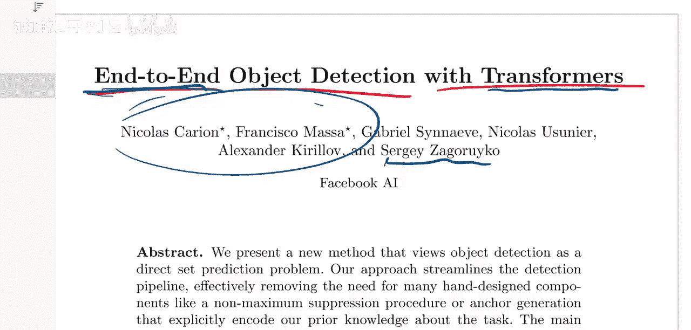

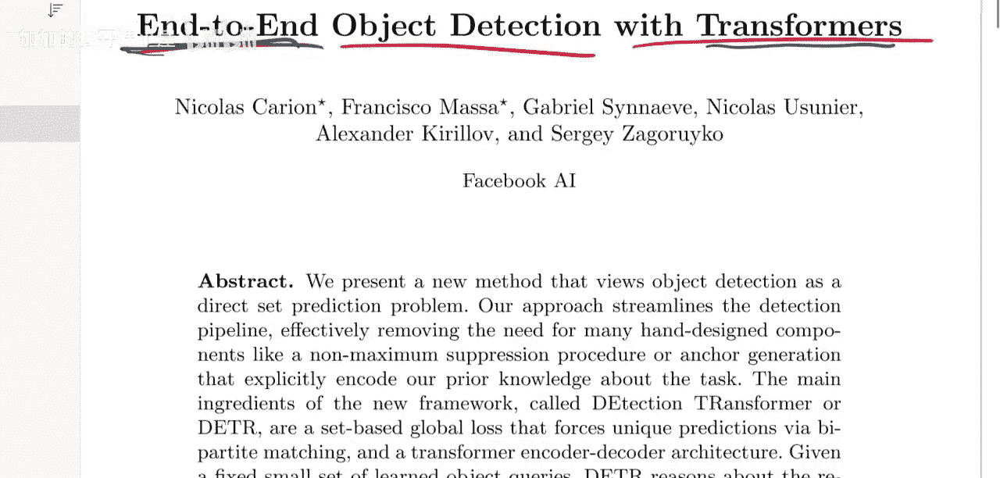

## 第3节：解析摘要，抓住核心贡献

摘要是论文的浓缩精华。我们的目标是从中提取出**一至两个**最核心的新贡献。

以下是DETR摘要的分析过程：

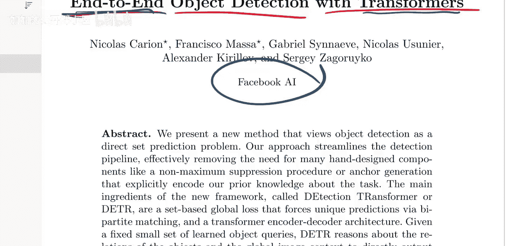

1.  **核心问题**：摘要开篇指出，本文提出了一种将目标检测视为 **“直接集合预测问题”** 的新方法。
2.  **主要优势**：它**简化了检测流程**，消除了对许多手工设计组件（如非极大值抑制，NMS）的需求。这立刻让我们明白，论文的卖点可能不是“性能大幅提升”，而是 **“架构更简洁、优雅”**。
3.  **关键技术**：摘要随后点明了两个关键组件：
    *   一个基于集合的全局损失函数，通过**二分图匹配**强制进行唯一预测。
    *   一个Transformer编码器-解码器架构。

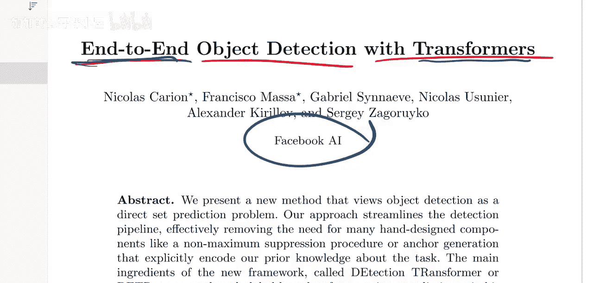

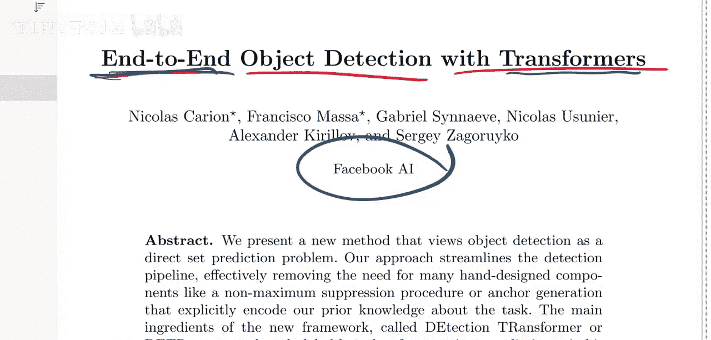

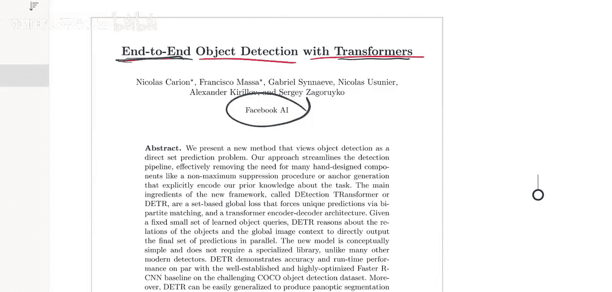

此时，即使不完全理解“二分图匹配”等技术细节，我们也已经抓住了论文的骨架：**它用Transformer和一种新的匹配损失，构建了一个无需NMS的端到端目标检测器**。这就是我们需要在正文中重点弄明白的“核心新事物”。

---

## 总结

本节课我们一起学习了学术论文阅读的初始三步法：

1.  **精读标题**：拆解关键词，形成关于论文创新点的初步假设。
2.  **客观评估作者与机构**：将其视为背景信息，避免光环效应，始终保持对实验证据的批判性思维。
3.  **深挖摘要**：识别并提炼出论文最核心的一至两个贡献，为后续深入阅读正文确立明确目标。

掌握这些步骤，能帮助你在纷繁复杂的论文信息中快速定位重点，从而进行更高效、深入的阅读。