# 046：从具有归纳偏见的深度学习中发现符号模型 🧠

在本节课中，我们将学习一篇名为《从具有归纳偏见的深度学习中发现符号模型》的论文。该论文提出了一种新颖的方法，旨在从物理系统的观测数据中自动推导出控制其行为的符号方程（例如牛顿的万有引力定律）。我们将分步解析其核心思想：首先使用图神经网络对数据进行数值拟合，然后通过符号回归从训练好的网络中解析出可解释的数学公式。

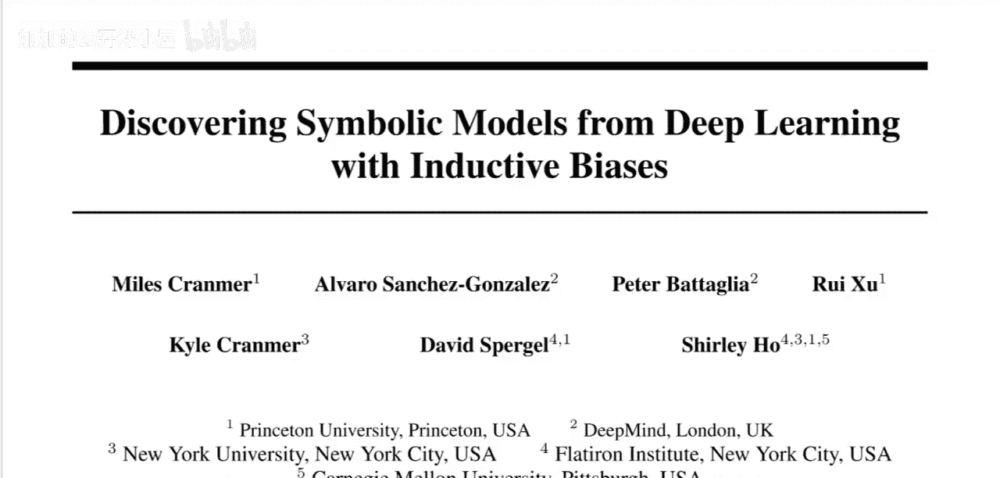

---

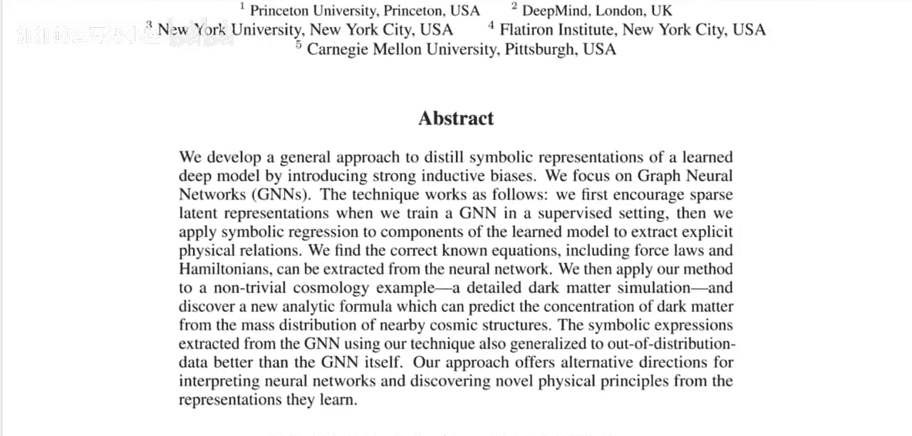

## 1. 研究背景与目标 🎯

上一节我们介绍了课程概述，本节中我们来看看该论文要解决的具体问题。

在许多物理系统中（例如行星运动、分子相互作用），其行为由潜在的数学方程控制。传统上，科学家通过观察和推理来发现这些方程（如牛顿发现万有引力定律）。该论文的目标是尝试用人工智能系统自动化这一“发现方程”的过程。

具体而言，研究者拥有一个物理系统的观测数据集。例如，一个模拟的三体系统，我们记录下每个时间步各个物体的位置、速度等信息。我们的目标是，仅从这个数据集中，自动找出像 **F = G * (m1 * m2) / r^2** 这样描述物体间相互作用力的符号方程。

---

## 2. 传统方法的局限性 ⚠️

在介绍新方法之前，有必要了解传统符号回归方法的局限性。

传统符号回归方法大致流程如下：
1.  定义一个包含基本元素的集合，例如变量（质量、位置）、常数、运算符（+、-、×、÷）和函数（平方、指数）。
2.  系统通过搜索（如随机生成、进化算法）组合这些元素，生成候选方程。
3.  评估每个候选方程对数据集的拟合程度。
4.  选择拟合最好的方程。

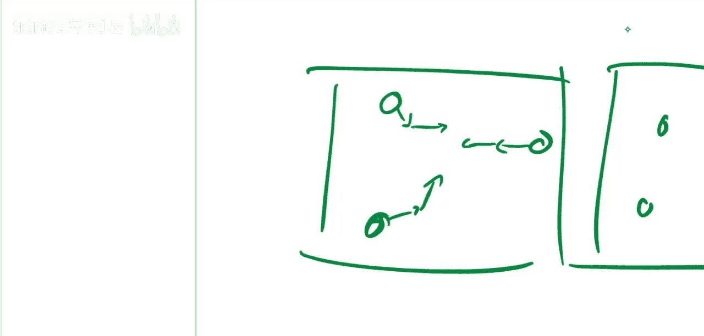

然而，当搜索空间稍大时，这种方法就会面临组合爆炸问题，搜索效率极低，难以发现复杂的正确方程。

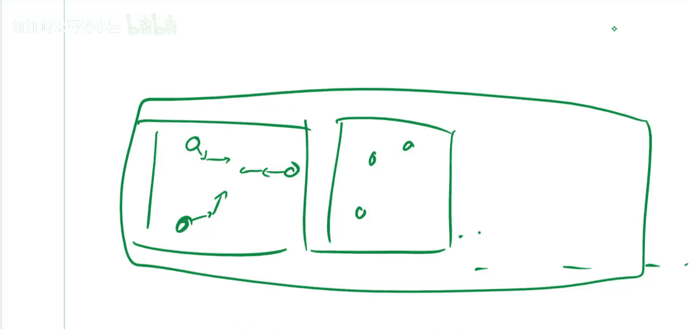

---

## 3. 论文的核心思路：两步法 🔄

上一节我们看到了传统方法的瓶颈，本节中我们来看看本文提出的创新性解决方案。

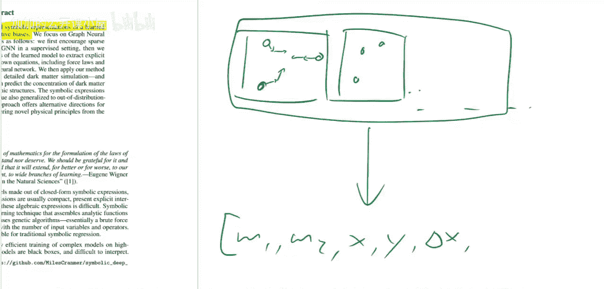

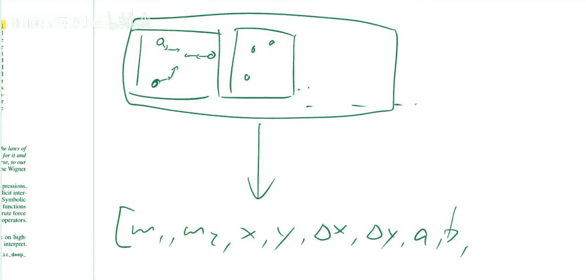

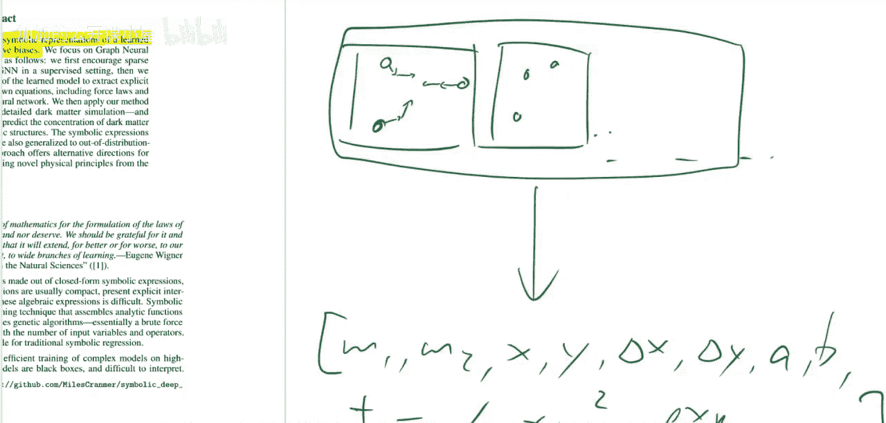

本文的核心是引入一个中间步骤，将问题分解为两个更易处理的阶段：

**第一步：数值回归**
使用**图神经网络**来学习并拟合物理系统的观测数据。图神经网络擅长处理对象（节点）及其关系（边）构成的数据，非常适合物理系统。训练后，网络可以像黑盒一样，输入系统当前状态，数值化地预测下一时刻的状态（例如加速度）。

**第二步：符号解析**
从训练好的图神经网络中，解析出符号方程。关键在于，通过精心设计图神经网络的架构（引入“归纳偏见”），使其内部计算结构与真实的物理相互作用过程高度一致。这使得从网络权重中提取人类可读的方程，变得比直接从原始数据中搜索方程**容易得多**。

---

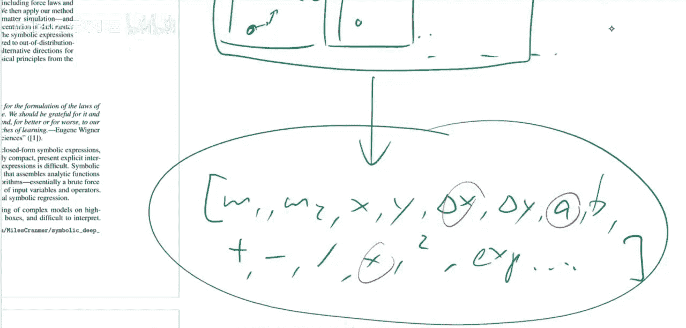

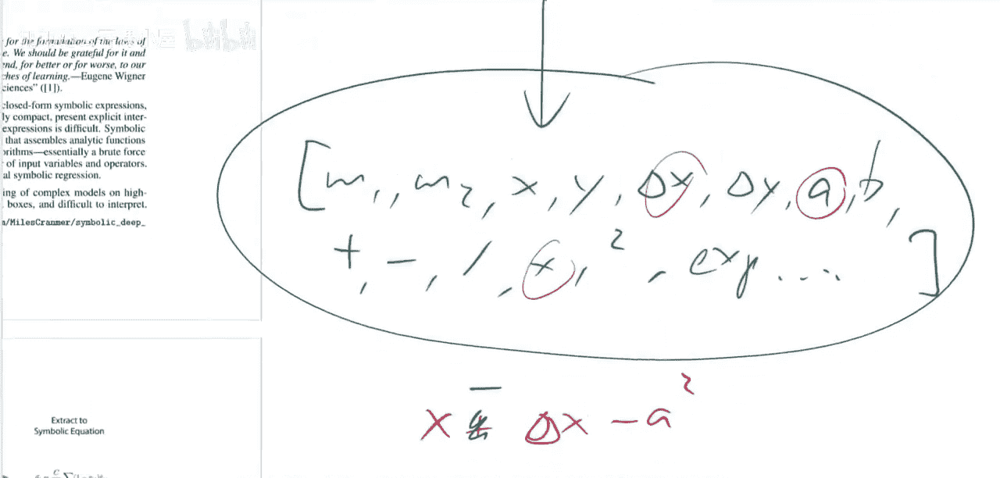

## 4. 关键技术：图神经网络 🕸️

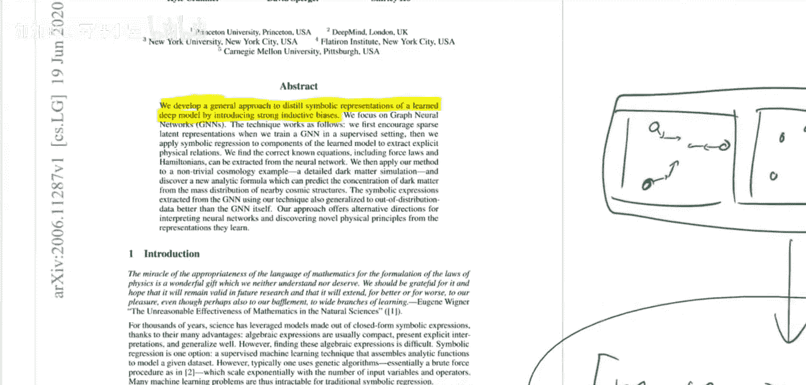

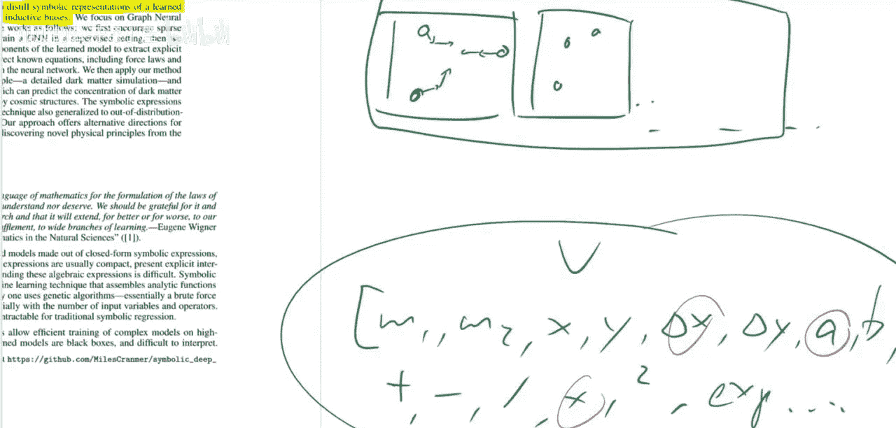

我们已经了解了整体流程，现在深入看看第一步中使用的关键工具——图神经网络。

图神经网络是专门处理图结构数据的神经网络。在本文的物理系统建模中：
*   **节点**可以代表物理实体（如星球、原子），其属性包括质量、位置、速度等。
*   **边**代表实体间的相互作用（如引力、弹力）。
*   网络通过消息传递机制，让节点根据其邻居的信息更新自身状态，从而模拟整个系统的动力学。

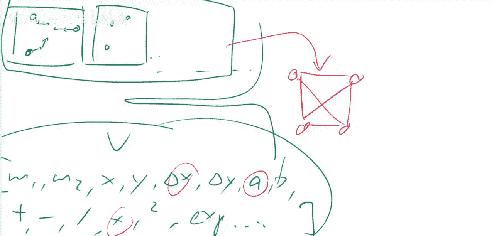

本文采用了一种称为“交互网络”或“图网络”的特定图神经网络架构。这种架构显式地分离了“对象属性更新”和“相互作用效应计算”，这与物理世界“物体因受力而改变运动状态”的直觉相符，即为网络注入了强大的“归纳偏见”。

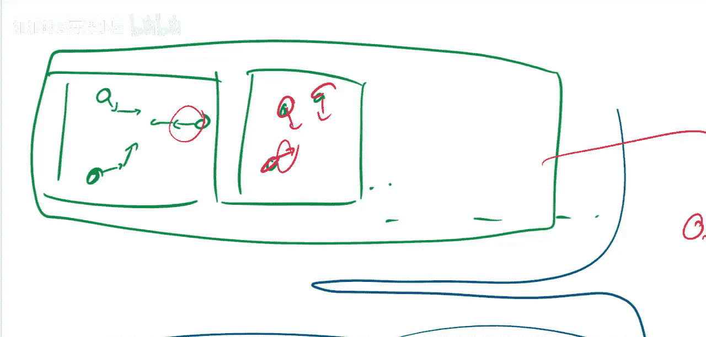

---

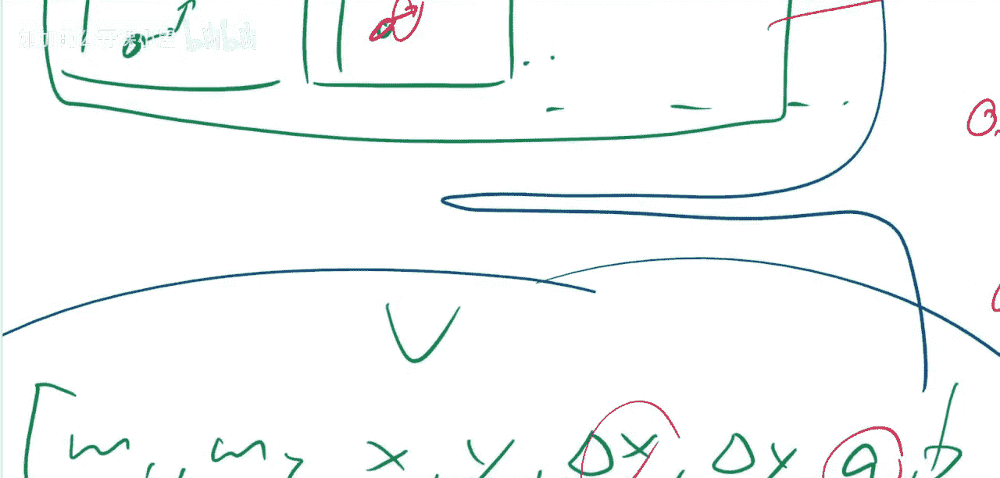

## 5. 方法优势与成果 ✨

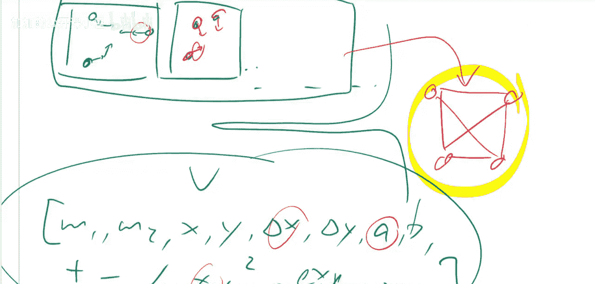

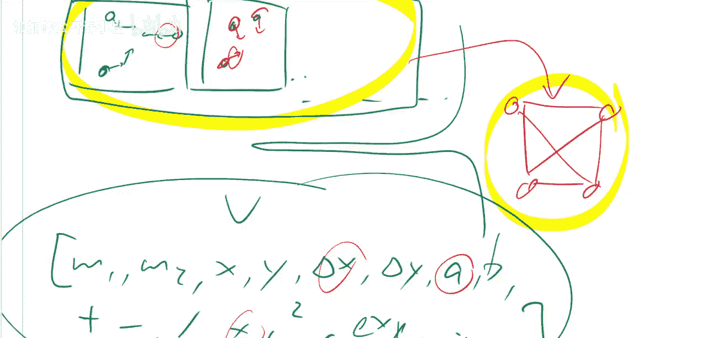

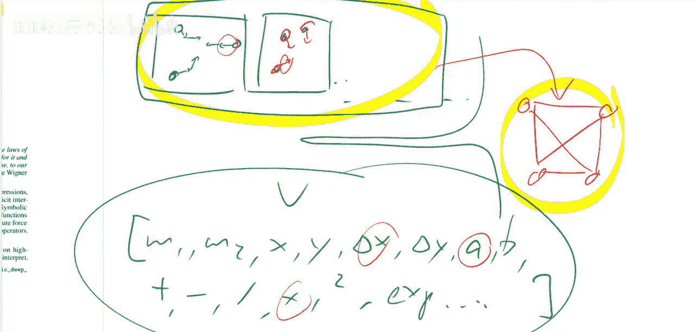

让我们总结一下这种两步法相比传统直接符号回归的优势。

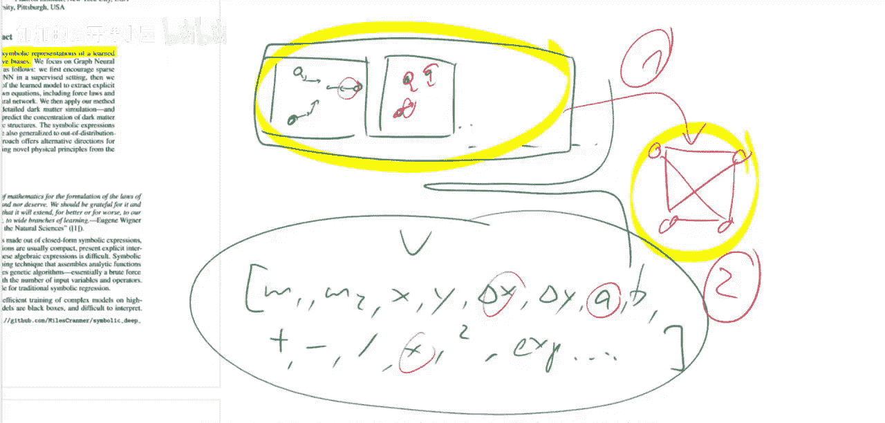

以下是该方法的主要优势：
*   **缩小搜索空间**：图神经网络先学习了数据的底层规律，符号回归只需解释这个相对规律且结构化的“黑盒”，而非杂乱无章的原始数据。
*   **利用归纳偏见**：网络架构强制学习了“物体”和“相互作用”的分离，使得最终解析出的方程很可能具有类似的物理意义明确的分解形式。
*   **实践成功**：研究者用该方法成功地从数据中重新发现了已知的物理定律（如万有引力定律、胡克定律）。更引人注目的是，他们在一个宇宙学模拟数据集中，发现了一个**新的、先前未知的**关于暗物质密度场的符号方程。

---

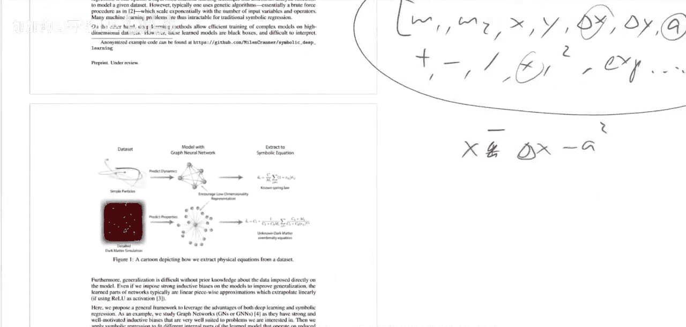

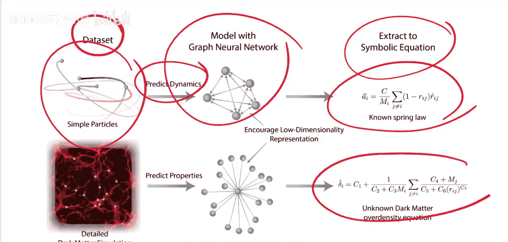

## 6. 总结 📝

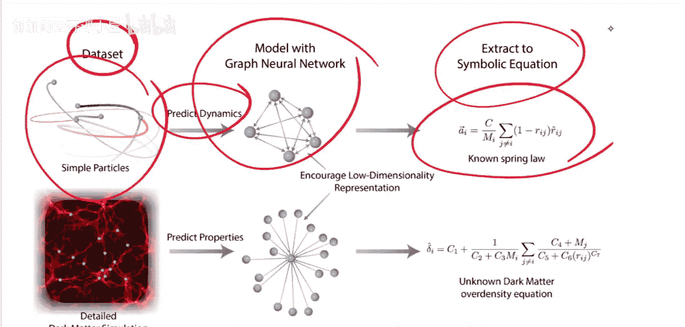

本节课中我们一起学习了论文《从具有归纳偏见的深度学习中发现符号模型》的核心内容。

我们了解到，通过结合**图神经网络**的数值拟合能力和**符号回归**的可解释性搜索，可以有效地从复杂系统数据中自动发现潜在的符号方程。其关键在于，利用图神经网络为符号回归阶段提供一个结构良好、富含物理意义的“中间表示”，从而克服了传统方法搜索空间过大的难题。这项工作为科学发现自动化提供了一个强有力的新工具。