# 047：直接反馈对齐算法详解 🧠

在本节课中，我们将学习一篇名为《直接反馈对齐可扩展至现代深度学习任务与架构》的论文。该论文提出用一种名为“直接反馈对齐”的算法替代深度学习架构中的反向传播算法。直接反馈对齐算法被认为更具生物合理性。虽然该算法已存在一段时间，但此前尚未被证明能适用于现代大型深度学习架构，并在现代深度学习任务上达到与反向传播相当的性能。据本文作者理解，这篇论文首次证明了直接反馈对齐算法能够做到这一点。因此，这主要是一篇工程与应用性质的论文。

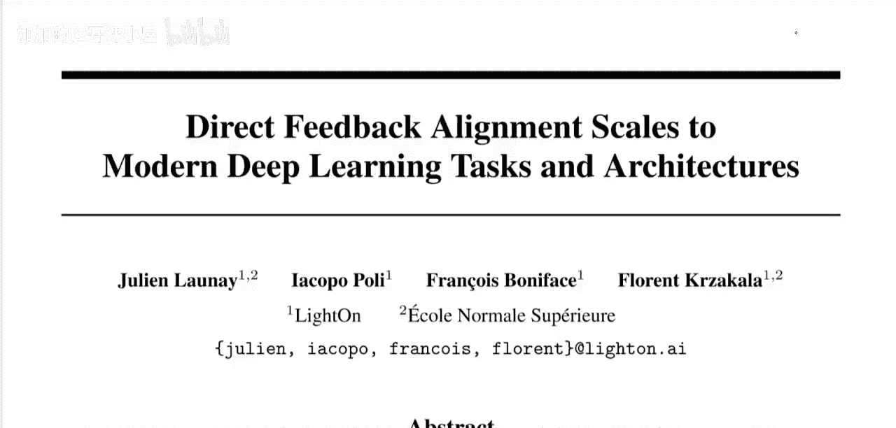

我们将重点探讨直接反馈对齐算法本身。虽然论文中的实证发现令人印象深刻且工程实现良好，但其结论可以概括为：该算法有效，虽尚未完全达到反向传播的性能，但已展现出有希望的发展方向。

---

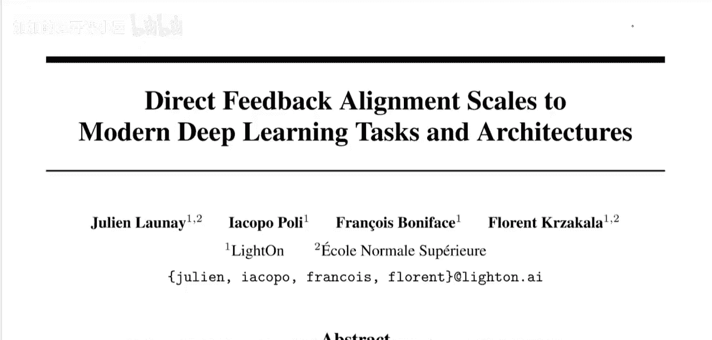

## 论文摘要与问题背景

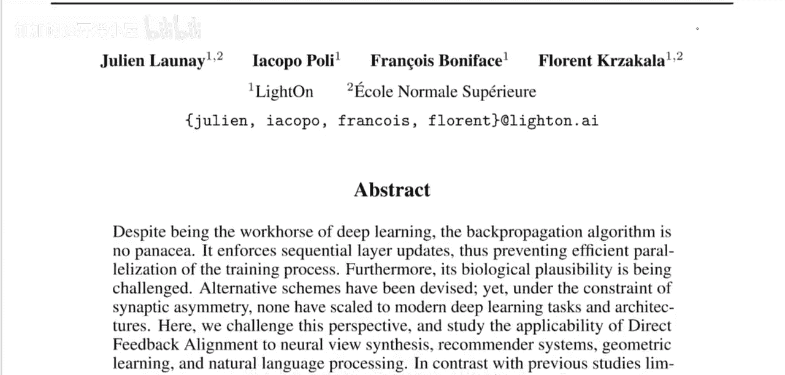

尽管反向传播算法是深度学习的核心工具，但它并非万能。该算法强制进行顺序的层更新，从而阻碍了训练过程的高效并行化。此外，其生物合理性也受到质疑。虽然人们已经设计出一些替代方案，但在“突触不对称性”的约束下，尚无方案能扩展到现代深度学习任务和架构。

本文挑战了这一观点，并研究了将直接反馈对齐算法应用于神经视图合成、推荐系统、几何学习和自然语言处理的可行性。与之前局限于计算机视觉任务的研究不同，我们的研究结果表明，直接反馈对齐算法能够成功训练多种最先进的深度学习架构，且性能接近经过精细调优的反向传播。与普遍认知相悖的是，我们的工作证明，即使在没有“权重传输”的情况下，也能应对具有挑战性的任务。

这个摘要包含了许多需要解读的信息。

首先，反向传播存在什么问题？摘要中指出了两个主要问题：
1.  它阻碍了训练过程的高效并行化。
2.  它缺乏生物合理性。

---

## 反向传播算法回顾

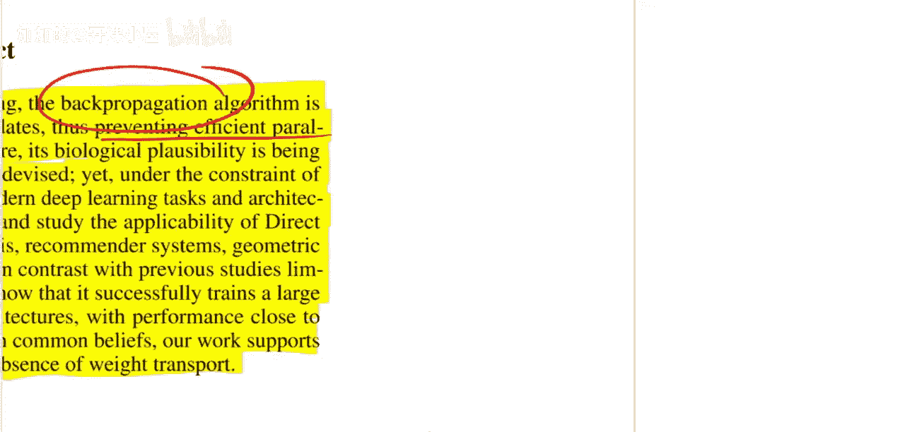

上一节我们提到了反向传播的问题，本节我们来具体看看它的工作原理。我相信大家都了解基本的反向传播过程。

神经网络由一系列层组成。输入数据逐层传递，最终得到输出 `Y_hat`（例如，分类器认为输入 `x` 所属的类别）。在数据中，我们有真实的标签 `Y`，将其与网络输出 `Y_hat` 进行比较，可以计算出一个损失函数 `L`。

反向传播算法的核心问题是：**如何调整神经网络各层的参数，以使损失 `L` 最小化？** 为此，可以使用反向传播算法。这意味着可以获取损失 `L`，并将其沿着网络层反向传播，以逐层更新参数。

摘要中指出的第一个问题（虽然相对次要）是它的**顺序性**。为了更新某一层，必须先完成其后所有层的反向传播。因此，这是一个顺序任务，需要再次沿层反向传播。而更高效的方式是能够并行更新所有层。

但更大的问题是反向传播**缺乏生物合理性**。我们知道，在真实的神经元中，信号通过树突（输入）和轴突（输出）仅沿一个方向传递。我们尚未在大脑的真实神经元中发现一种反馈机制，能够允许信息以类似反向传播的方式反向流动。大脑中确实存在反向流动的信息，但据信其速度太慢，无法类比为反向传播算法。具体来说，如果每一层都由一个权重矩阵 `W` 表征，反向传播会使用该权重矩阵的转置 `W^T` 来进行反向传播。这些反向箭头使用权重矩阵的转置来传递关于“需要如何改变以最小化损失”的信息。我们不知道有任何生物机制与此转置操作类似。这种转置操作类似于层的逆运算，被称为“权重传输”。权重传输意味着可以使用权重的转置将信息从下一层带回当前层。在生物学中，我们不存在这种现象。在直接反馈对齐算法中，我们同样避免了这种现象。

---

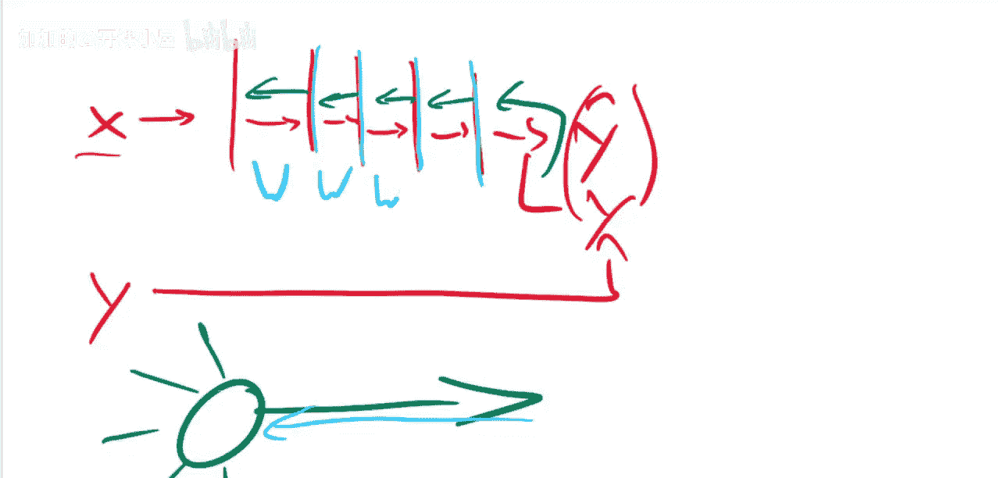

## 直接反馈对齐算法原理

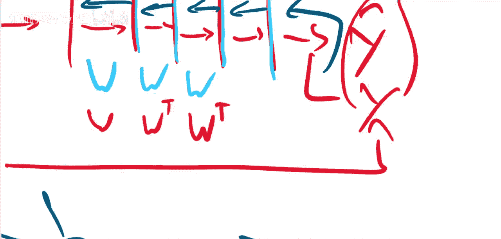

上一节我们分析了反向传播的局限性，本节我们来看看解决方案——直接反馈对齐算法。直接反馈对齐算法更具生物合理性，因为它以某种方式获取损失 `L`，并将其**全局地、直接地**分配给所有层，如下图所示。它这样做既不需要权重矩阵的转置，也不需要顺序的更新步骤。因此，摘要中提出的两个问题都能由此得到解决。

摘要中提到，与之前局限于计算机视觉任务的研究不同，本文作者将算法应用于神经视图合成、推荐系统、几何学习和自然语言处理。这些都是相当多样化的任务，也将应用于相当多样化的架构。例如，在几何学习中，他们使用了图神经网络。在图神经网络中，通常存在连接顶点和边并计算其属性的全连接层，这正是使用直接反馈对齐算法的好机会，因为该算法能在全连接层上发挥作用。

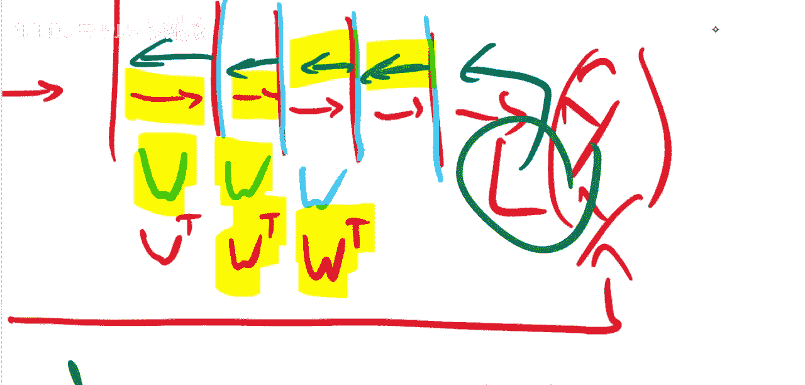

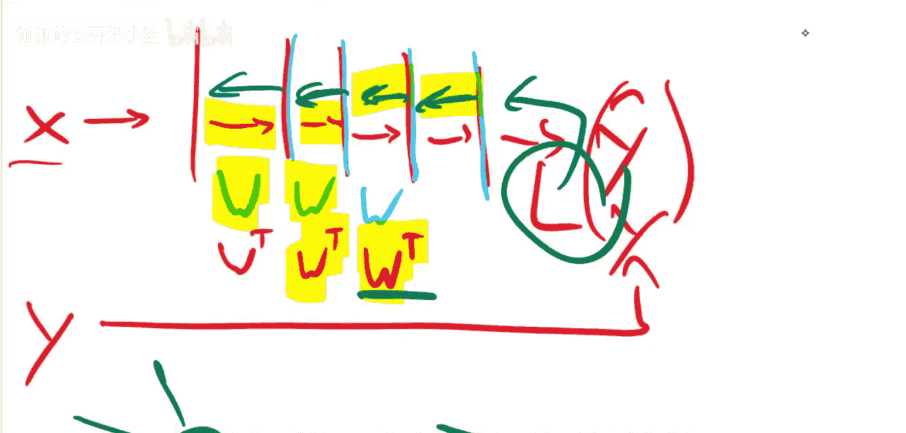

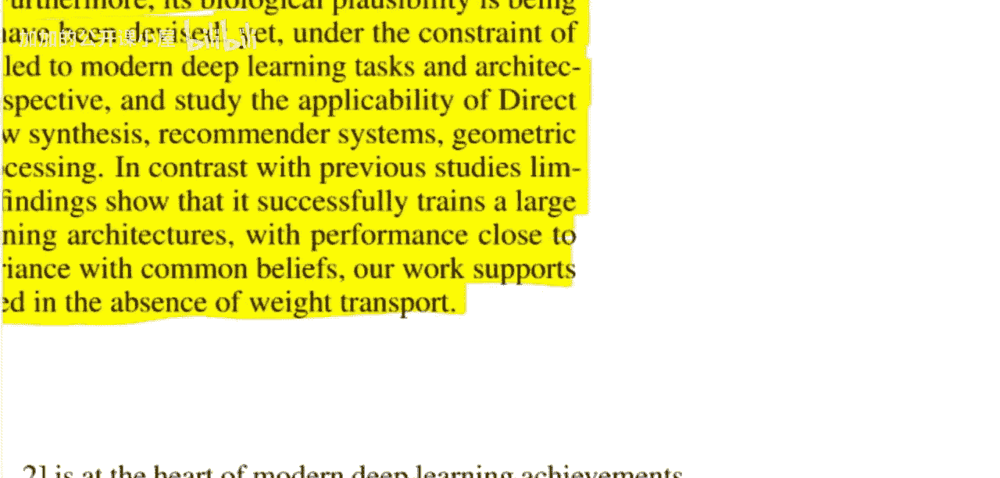

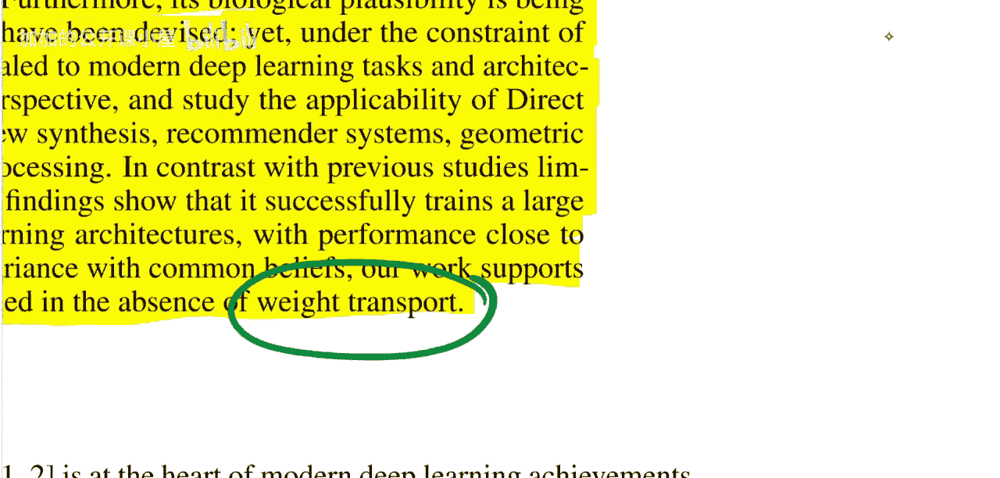

以下是直接反馈对齐算法的核心思想：

在反向传播中，误差信号通过权重矩阵的转置逐层反向传播：
`δ_l = (W_{l+1}^T * δ_{l+1}) ⊙ f'(z_l)`

在直接反馈对齐中，误差信号不通过前向权重矩阵反向传播，而是通过一个固定的、随机初始化的反馈矩阵 `B_l` 直接传递到每一层：
`δ_l = (B_l * e) ⊙ f'(z_l)`
其中 `e` 是最终的输出误差。

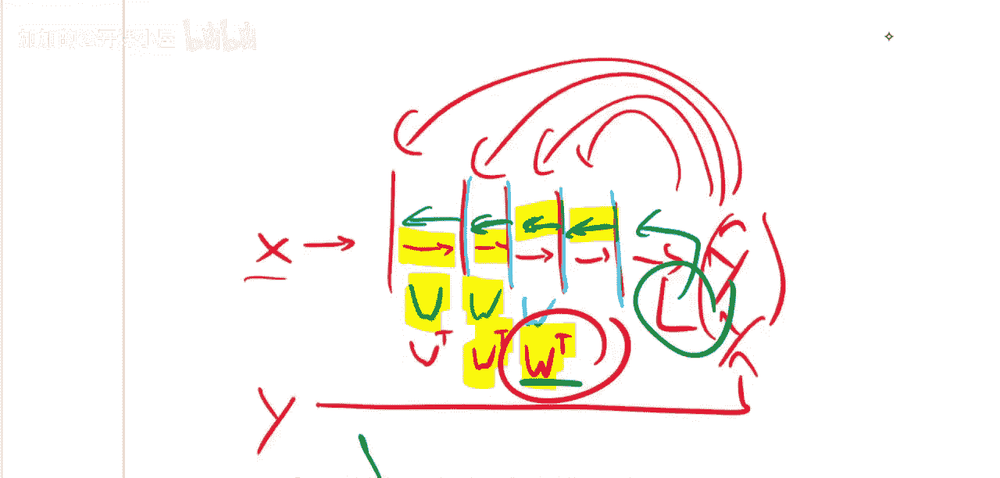

**关键区别**：`B_l` 是随机生成并保持固定的，它不依赖于前向权重 `W_l`，从而避免了“权重传输”问题。

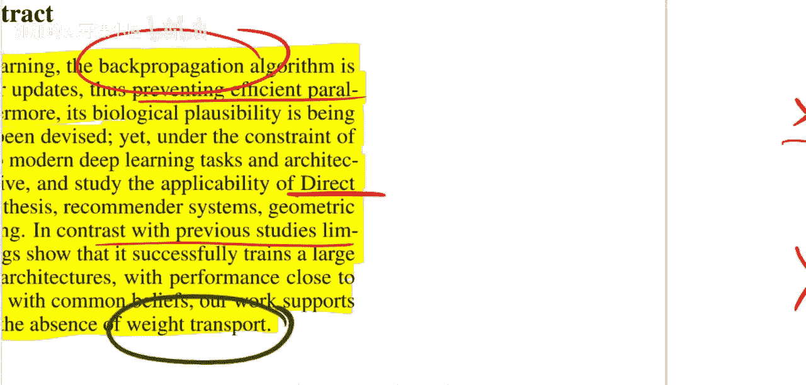

---

## 算法应用范围与实验设置

那么，为什么之前的应用局限于计算机视觉呢？据本文作者理解，直接反馈对齐算法目前似乎只能应用于线性层（即形式为 `Wx + b` 后接非线性激活函数的层）。尽管卷积神经网络可以写成带有约束的线性层，但根据论文解读，直接反馈对齐可能仅适用于全连接层或类似全连接层的结构。

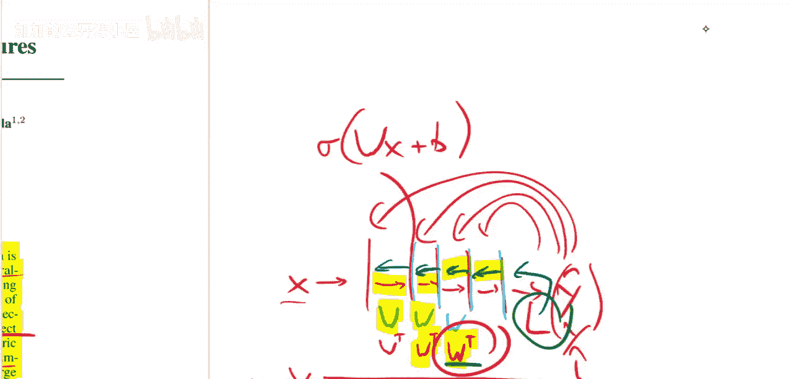

因此，在他们的实验中，他们将采用Transformer等大型架构，并将其中的全连接层部分的参数更新替换为直接反馈对齐更新。需要说明的是，他们并非替换层本身，而是替换这些层的反向传播更新部分。同时，在无法用直接反馈对齐替换更新的地方（例如，某些非全连接层或过于复杂的层），他们仍然会使用反向传播。例如，他们通常不会更新嵌入层等参数。

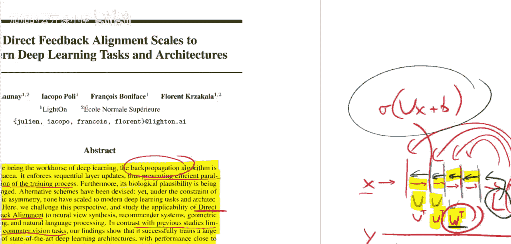

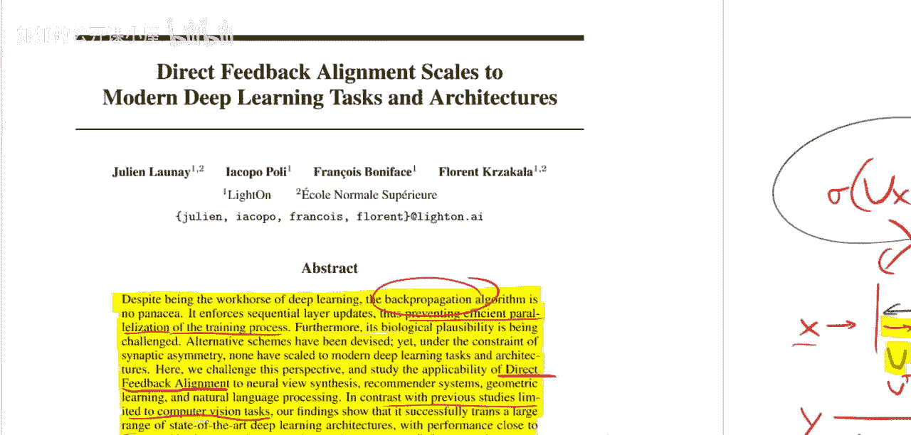

他们寻找的是那些仍然采用全连接层的最先进任务和架构，因为在这些地方，他们的算法才能大放异彩。

---

## 总结

本节课我们一起学习了《直接反馈对齐可扩展至现代深度学习任务与架构》这篇论文。我们探讨了反向传播算法在并行化和生物合理性方面的局限，并深入介绍了直接反馈对齐算法作为替代方案的核心原理。该算法通过固定的随机反馈路径将误差信号直接传递到网络各层，避免了权重传输问题，从而更具生物合理性，并有望实现更高效的并行训练。论文通过将其应用于多种现代深度学习任务和架构，初步证明了该算法的有效性和扩展潜力。虽然其性能尚未完全匹敌精细调优的反向传播，但为未来更生物合理、更高效的训练算法开辟了有希望的方向。