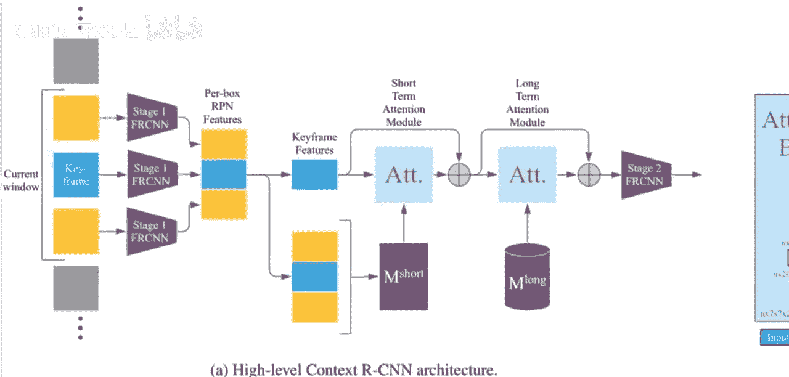
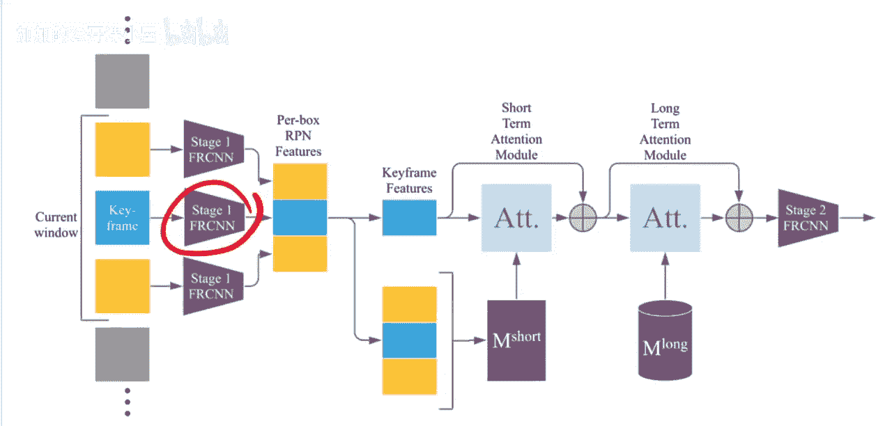
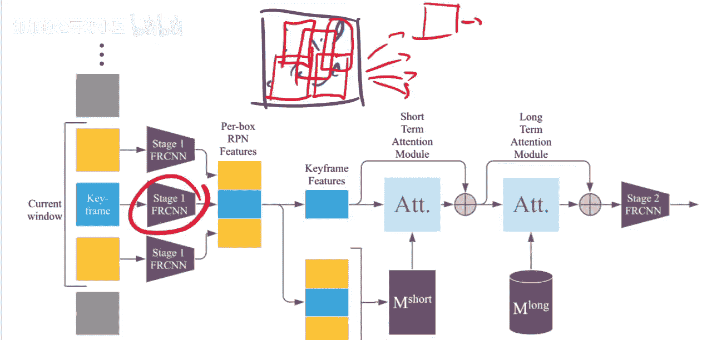
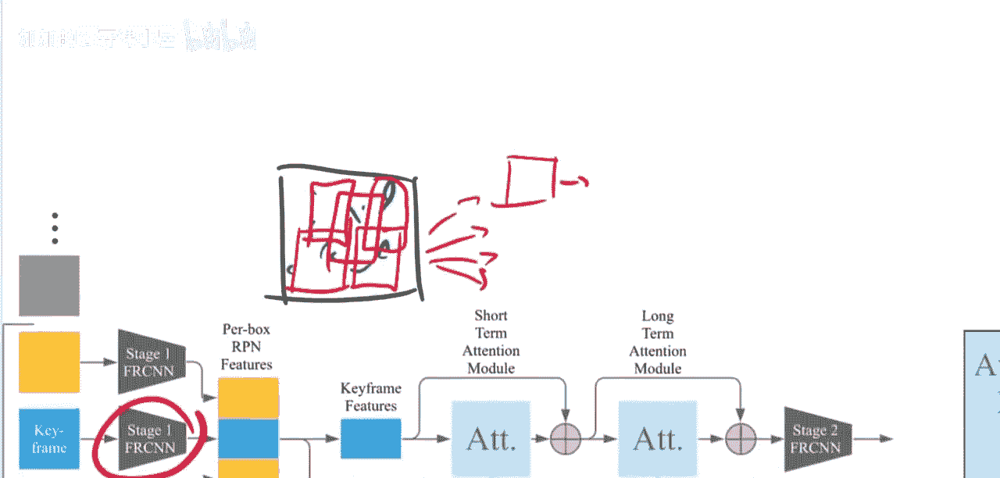
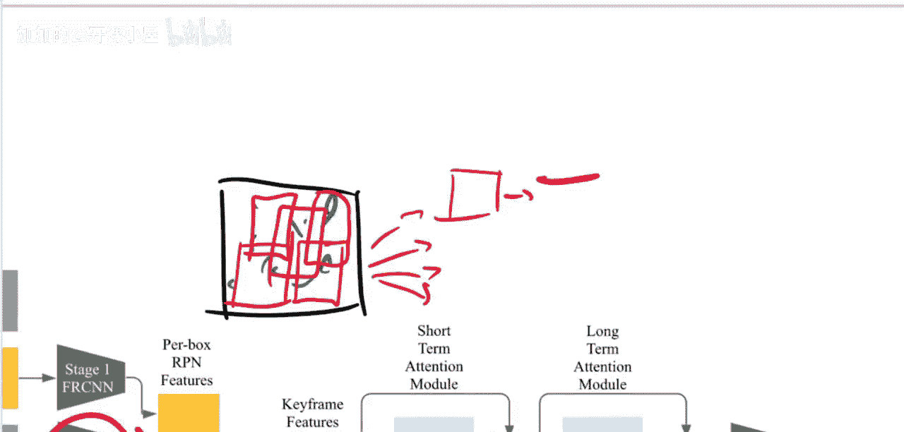
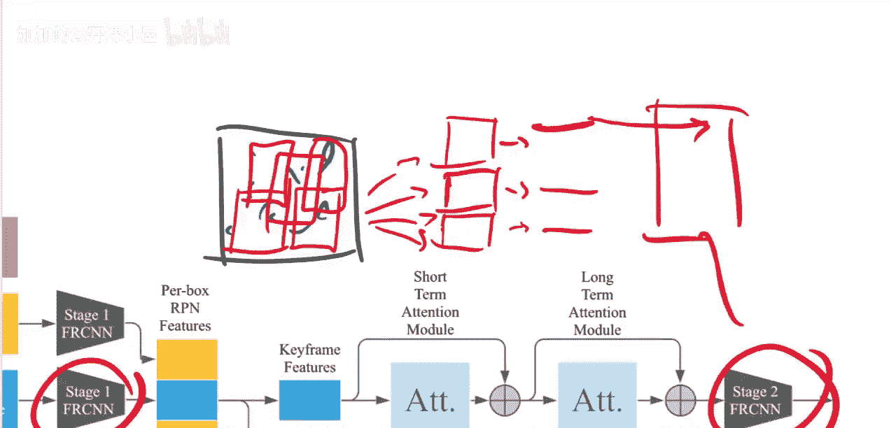
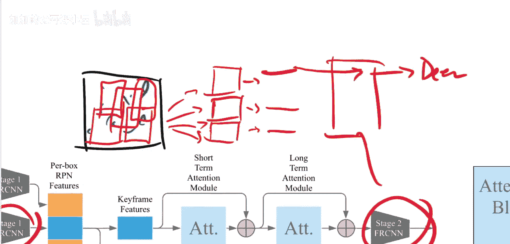
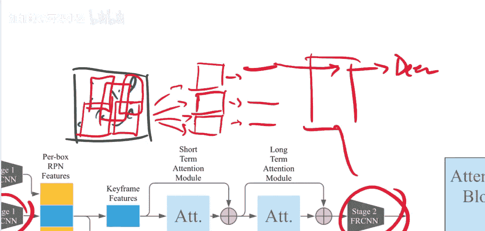
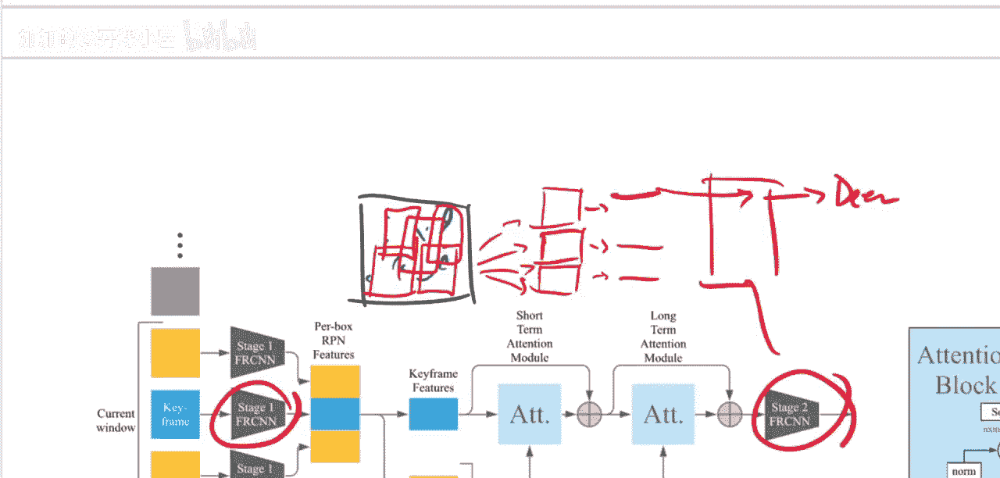
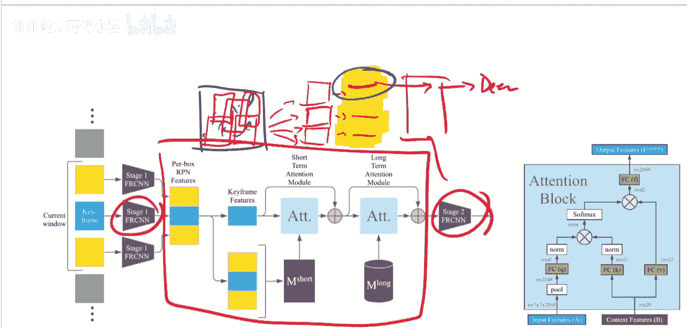

# 048：基于单摄像头长期时序上下文的目标检测（论文解读）📄

在本节课中，我们将要学习一篇名为《上下文R-CNN：基于单摄像头长期时序上下文的目标检测》的论文。这篇论文由Sarah Beri、Guang Hongwu、Vivek Grthd、Ronnie Votel和Jonathan Huang共同完成。我们将探讨其核心思想、方法架构以及它如何提升在固定摄像头场景下的目标检测性能。

## 概述 🎯

从高层次来看，这篇论文致力于解决在**固定位置长时间运行**的摄像头（例如野生动物陷阱相机或交通监控摄像头）中的目标检测问题。它提出了一种方法，通过**整合摄像头过去拍摄的图像数据**来辅助当前帧的检测。该方法通过一个在**历史数据记忆库**上运行的**注意力机制**来实现。我们将详细解析其工作原理和效果。

## 问题定义与背景 🔍

上一节我们介绍了论文的总体目标，本节中我们来看看它要解决的具体问题。

论文首先描述了问题：我们希望在图像中进行**目标检测**。目标检测的任务是，给定一张图像，模型需要识别出图像中有什么物体以及它们的位置。例如，在一张图像中，可能需要绘制一个边界框并标注“这是一只鹿”；在另一张图像中，可能需要标注出公交车、卡车、汽车等多个物体。图像中可能包含多个、单个、不同类别的物体，也可能没有物体。

这就是目标检测。已有许多相关论文，特别是**R-CNN**系列模型。本文将要扩展的正是这个模型。具体来说，我们将基于**Faster R-CNN**模型进行构建。Faster R-CNN是一个用于在**单张图像**中检测边界框的模型。

但现在我们考虑一种情况：我们有一个**长时间记录图像的摄像头**。例如，野生动物陷阱相机可能持续工作数月。充分利用这些数据并不容易，因为除了数据量巨大之外，它们通常还有**运动触发机制**。这意味着可能长时间没有动静，然后有动物进入陷阱，在10秒内每秒产生一张图像，接着又可能一两天没有图像，然后因为另一只动物进入又产生一批图像。因此，存在**采样频率不规则**和**帧间间隔差异极大**的问题。

所有这些特性使得这类数据不太适合使用**时序卷积**或**LSTM**等模型，因为它们不太擅长处理此类数据。虽然LSTM有能处理不规则序列的变体，但在处理**超长上下文**和**不规则采样频率**时效果并不理想。

## 核心思想：利用时序上下文 🤔

那么，如何利用过去的信息呢？其核心思想是：如果我们有当前帧（例如下图），并希望检测其中的物体，我们应该能够**动态地**从同一摄像头拍摄的其他帧（例如下图中标记的其他帧）中提取信息。

为什么这会有所帮助呢？请看以下示例：
*   **物体重现**：例如，下图中的公交车可能在多条图像中都出现，因为它有固定路线。为了分类当前帧中的物体是否是公交车，参考过去在同一位置看起来像公交车的图像会提供有力证据。
*   **背景物体识别**：有时单帧检测器会因光线等原因混淆，将某个背景物体误判为汽车。但如果参考其他帧，模型可能识别出那不是汽车，并将这个证据传递到当前帧，帮助纠正错误。
*   **动物识别**：动物常有固定活动路线。在一段连续拍摄中，同一只动物可能出现在多帧中。如果它在当前帧被部分遮挡，但在另一帧中清晰可见，这有助于做出更准确的预测。此外，动物常成群出现，如果看到周围有其他鹿，那么某个区域是鹿的概率也会大大增加。

这与简单地增加独立同分布的训练数据不同。我们真正考虑的是这些图像**来自同一位置、拍摄同一场景的同一个摄像头**这一事实。

## 方法架构 🏗️

上一节我们探讨了利用时序上下文的动机，本节中我们来看看实现这一目标的具体架构。

我们将构建一个**注意力机制**，使其能够动态地“回顾”过去（以及少量“展望”未来，但主要是回顾）同一摄像头拍摄的其他图像。该机制将学习如何从一个**记忆库**中检索和利用这些其他图像的信息。

如上图所示，我们仍然需要进行目标检测。因此，我们的方法是“改造”一个现有的目标检测器。我们将要改造的是 **Faster R-CNN** 这个单帧目标检测器。

Faster R-CNN 是一个两阶段检测器：
1.  **第一阶段（区域提议网络 - RPN）**：输入一张图像，该阶段负责提取**感兴趣区域**。它会在图像中找出可能包含物体的区域（即边界框提议），并为每个提议区域提取**特征向量**。我们可以将每个区域的特征表示为一个向量。
    
    
    
    
2.  **第二阶段（检测头）**：该阶段接收第一阶段每个感兴趣区域对应的特征向量，并对其进行**分类**（例如，判断它是“鹿”、“公交车”还是“汽车”）和**边界框精修**。
    
    
    

本文提出的 **上下文R-CNN 系统** 被插入到这两个阶段之间。

我们仍然使用第一阶段和第二阶段，但在这两者之间，我们加入了一个新模块来“增强”这些特征向量，使得第二阶段的分类器能更容易地进行分类。具体来说，我们将通过**整合来自同一摄像头其他帧的信息**来增强这些原本只来自当前帧的特征。

我们通过两种不同的方式来整合信息：

## 总结 📝

本节课中我们一起学习了《上下文R-CNN》这篇论文。我们了解到，针对固定摄像头长期拍摄的场景，传统的单帧目标检测器存在局限。该论文创新性地提出在Faster R-CNN的两阶段之间插入一个**基于注意力机制的时序上下文模块**。该模块能够动态地从存储过去帧信息的**记忆库**中检索相关信息，并用以增强当前帧中每个候选区域的特征，从而提升目标检测的准确性，特别是在处理物体重现、背景混淆和动物群体识别等挑战时。这种方法充分利用了固定摄像头场景下数据的内在关联性，而非简单增加训练数据。