# 049：面向图像集合的生成模型（论文详解）

在本节课中，我们将学习一种名为“集合分布网络”的生成模型。该模型由苹果公司的研究人员提出，其核心目标是生成**图像集合**，而非单张图像。我们将探讨其工作原理、核心组件以及它如何从像素中分离出共享的集合特征（如物体的3D结构或人物身份）和变化的视图特征。

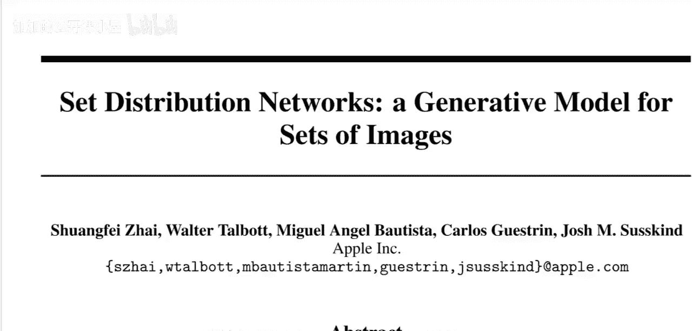

---

## 概述：什么是图像集合生成？

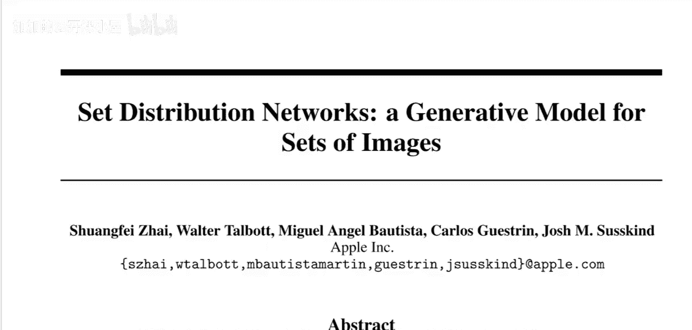

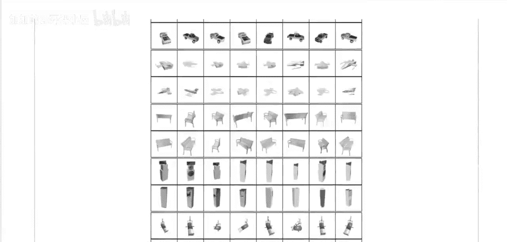

上一节我们介绍了集合分布网络的目标。本节中，我们来看看“图像集合”的具体含义。

在传统的图像生成任务中，模型通常生成单张独立的图片。然而，现实世界中许多数据天然以**集合**形式存在。例如：
*   同一个物体的不同角度照片（如一辆车的多视角图）。
*   同一个人的不同照片（不同表情、光照、姿态）。

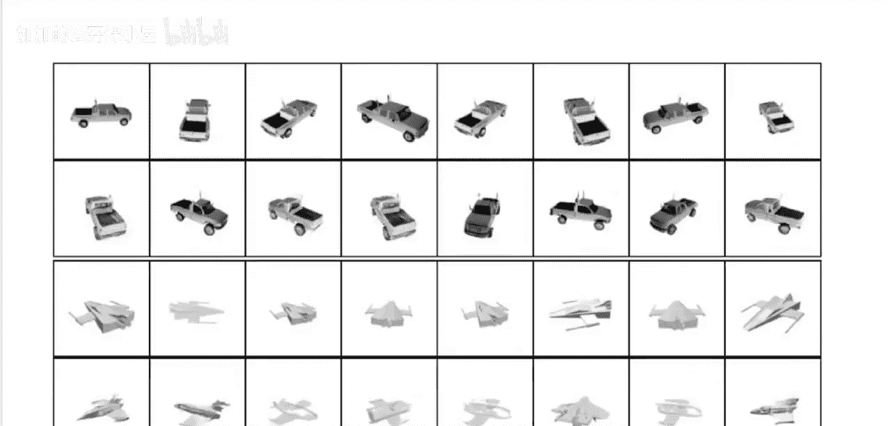

集合分布网络的目标，就是学习生成这样的**集合**。它需要理解集合中所有图像共享的**共同属性**（例如，物体的3D形状或人物身份），同时能够生成该共同属性下的**不同变体**（例如，不同的观察视角）。

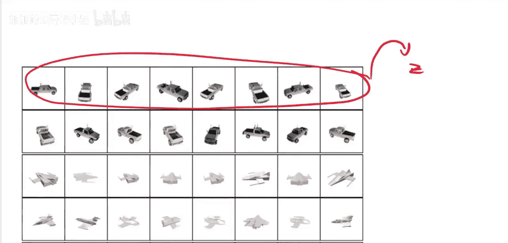

与类别条件生成对抗网络不同，该模型不依赖于预先定义的、固定数量的类别标签。它旨在学习一个更通用的“集合”概念，从而能够泛化到训练中从未见过的全新集合。

---

## 核心架构：三大组件

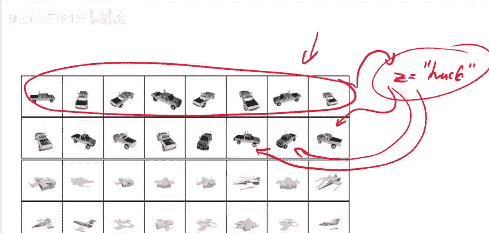

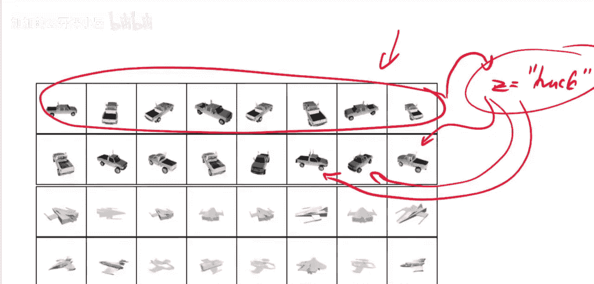

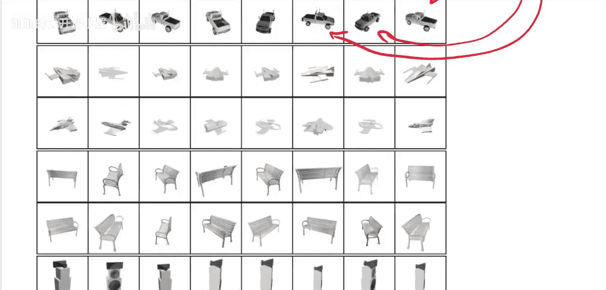

为了达成上述目标，论文构建了一个包含三个核心组件的模型架构。上一节我们明确了任务，本节中我们来看看实现这一目标的三个关键模块。

以下是模型包含的三个主要部分：

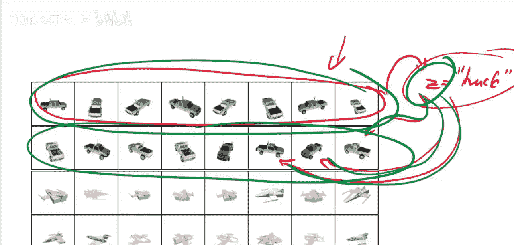

1.  **编码器**：负责将一个输入图像集合编码成一个低维的**集合表示** `z`。这个 `z` 应该捕获整个集合的共享本质。
2.  **生成器**：接收集合表示 `z` 和一个随机噪声变量 `ε`，生成一个新的图像集合。`ε` 用于控制集合内图像的多样性。
3.  **判别器**：用于区分模型生成的图像集合和真实的图像集合，驱动生成器产生更逼真的结果。

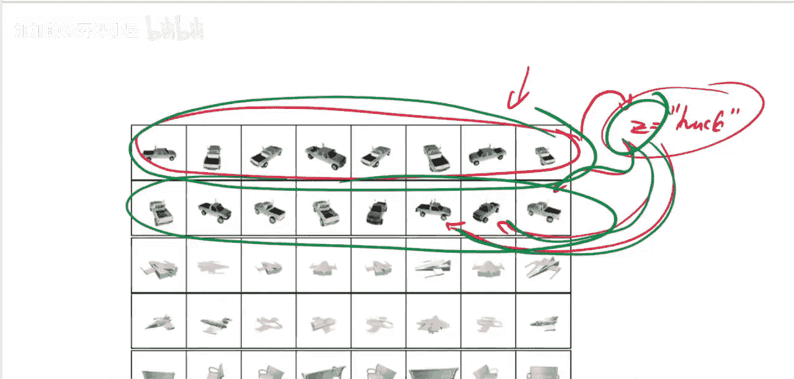

整个训练过程围绕如何让编码器提取有意义的 `z`，以及让生成器基于 `z` 生成高质量、多样化的集合。

---

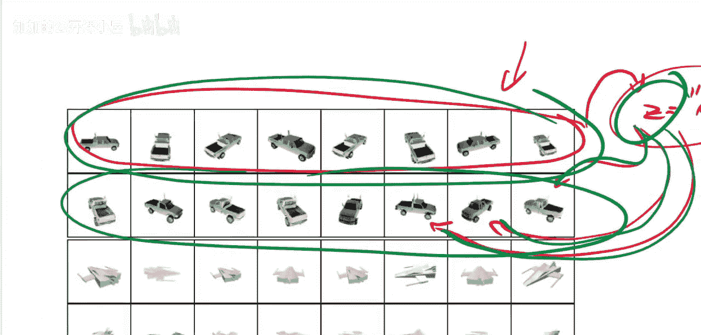

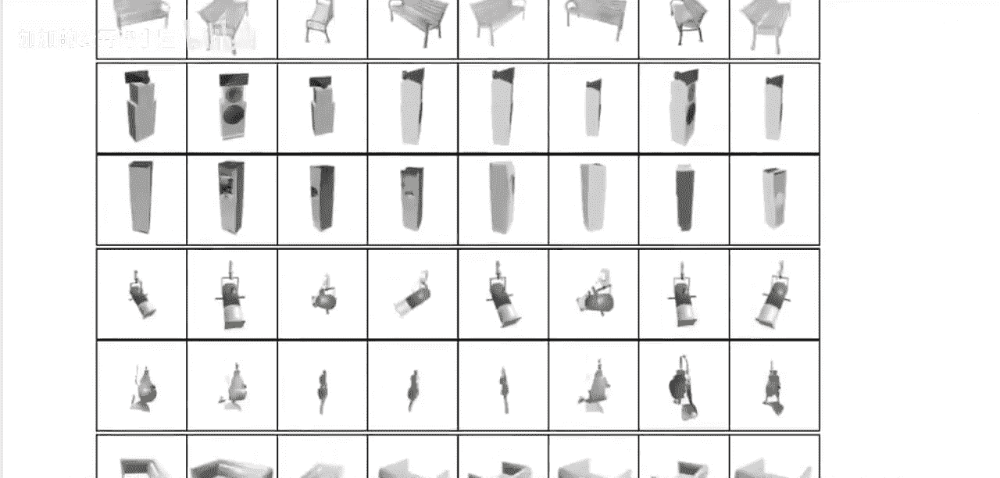

## 编码器设计：如何表示一个集合？

上一节我们介绍了模型的三大组件，本节中我们深入探讨第一个关键部分：编码器。它的核心挑战是如何将**无序**且**大小可变**的图像集合，转化为一个固定的表示。

编码器的输入是一个图像集合 `X = {x_1, x_2, ..., x_n}`。它需要输出一个集合表示 `z`。`z` 必须满足两个关键属性：
*   **排列不变性**：无论集合中图像的顺序如何，`z` 应该相同。
*   **对集合大小有一定鲁棒性**：虽然更多图像能提供更多信息，但 `z` 应主要反映集合的“身份”。

为了实现这一点，编码器采用以下流程：

1.  **单图像编码**：首先，使用一个卷积神经网络分别处理集合中的每一张图像 `x_i`，为每张图像得到一个特征嵌入 `h_i`。
    ```python
    h_i = CNN_Encoder(x_i)  # 对每张图像独立编码
    ```
2.  **池化与二值化**：然后，对所有图像的嵌入 `{h_i}` 进行**平均池化**操作，得到一个聚合后的向量。
    ```python
    h_pool = (1/n) * sum(h_i for i in 1..n)  # 平均池化，实现排列不变性
    ```
    接着，论文可能通过一个“二值化”或量化步骤，将 `h_pool` 进一步处理为离散或更紧凑的集合表示 `z`。这一步有助于学习到更结构化的潜在空间。

通过这种方式，编码器能够从任意大小和顺序的图像集合中，提取出一个代表其整体共享特性的固定维度的 `z`。

---

## 生成与训练目标

上一节我们了解了编码器如何获得集合表示 `z`，本节中我们来看看生成器如何利用 `z`，以及整个模型是如何被训练的。

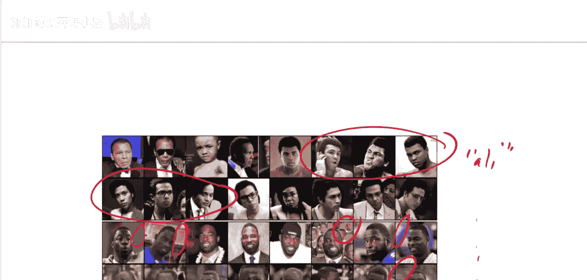

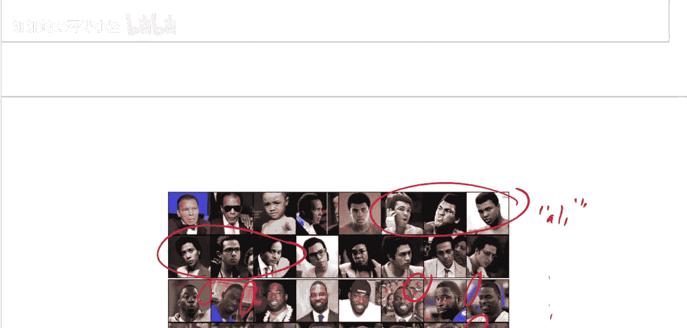

生成器接收两个输入：编码器产生的集合表示 `z`，以及一个随机噪声 `ε`。`ε` 用于在生成过程中引入随机性，以确保同一个 `z` 能生成不同的、多样化的图像集合 `X'`。
```python
X‘ = Generator(z, ε)  # 生成一个新的图像集合
```
模型的训练目标是一个复合目标，主要包含两部分：

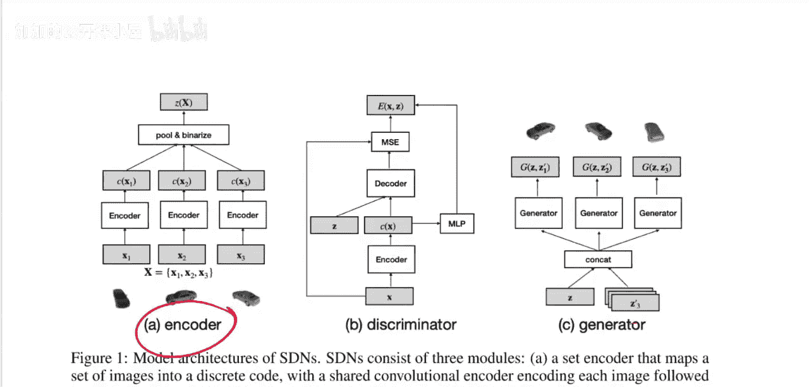

1.  **重建目标**：鼓励模型能够较好地重建输入集合。即，给定一个真实集合 `X`，编码得到 `z` 后，生成的新集合 `X‘` 应该与 `X` 在整体上相似（例如，通过集合间的距离度量）。
2.  **对抗目标**：引入判别器，确保生成的图像集合 `X‘` 看起来与真实数据中的图像集合一样真实、合理。这遵循了生成对抗网络的基本思想。

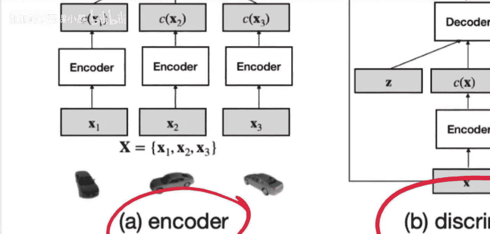

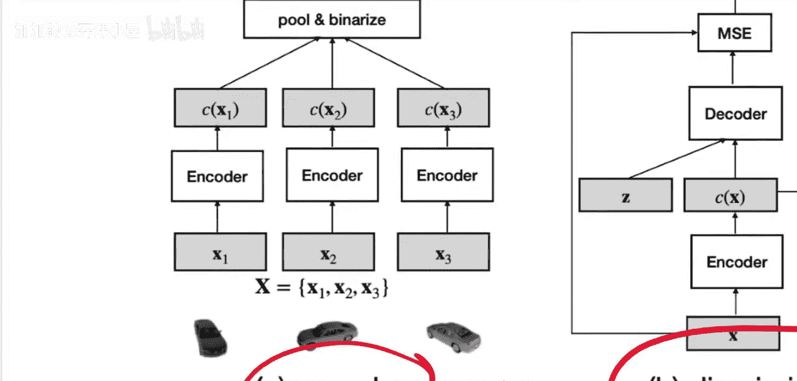

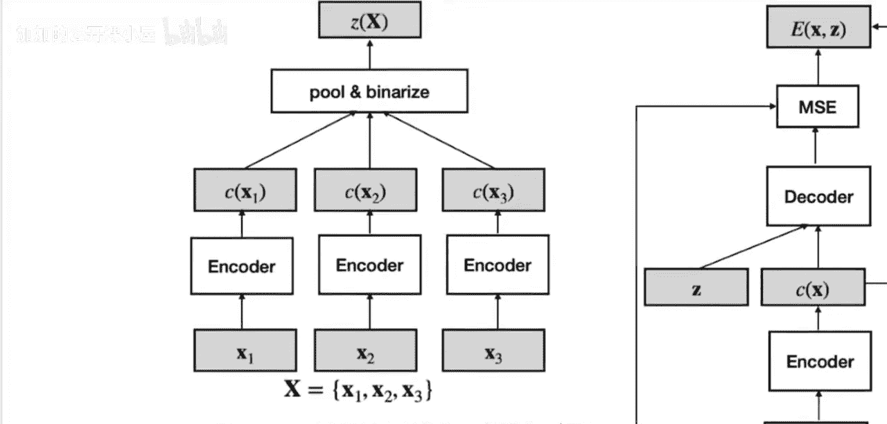

最终，模型通过优化这些目标的组合，学会从像素中分解出“集合身份”和“集合内变化”，从而能够生成连贯且多样的图像集合。

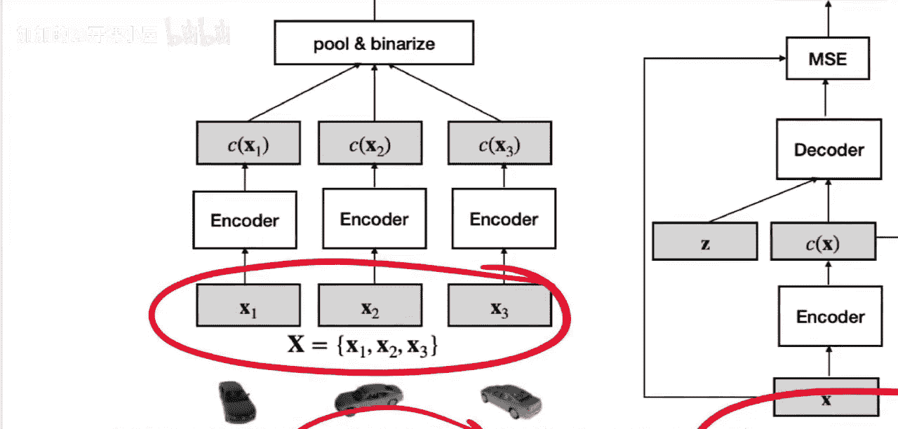

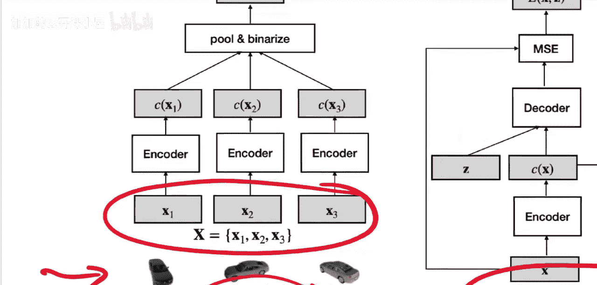

---

## 总结

本节课中我们一起学习了集合分布网络。我们首先明确了其生成**图像集合**的核心目标，并与传统的单图像生成模型进行了区分。接着，我们剖析了其三大核心组件：**编码器**、**生成器**和**判别器**。我们重点探讨了编码器如何通过**单图像编码**后接**池化**操作，来实现对无序、大小可变集合的有效表示。最后，我们了解了模型通过结合**重建目标**和**对抗目标**进行训练，最终学会捕捉集合的共享特性并生成多样化的成员。

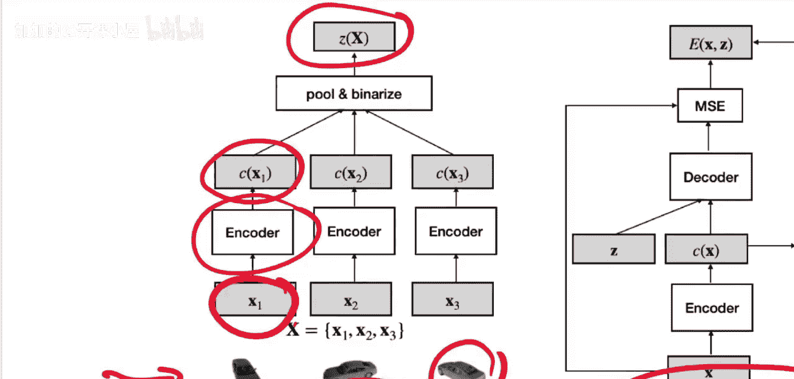

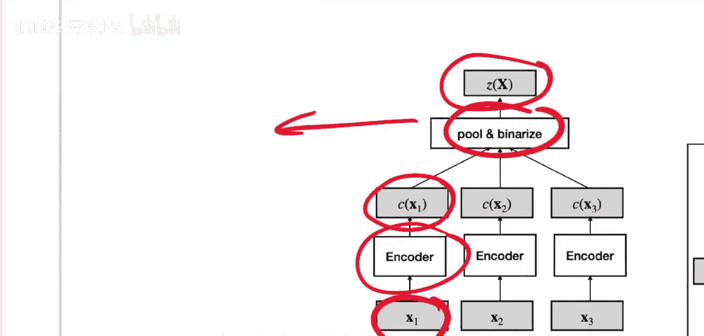

该模型的核心贡献在于提供了一种无需明确类别标签、即可对集合结构进行建模和生成的框架，在需要理解物体多视角或身份多形态的任务上具有潜力。