# 051：通过微调实现自适应稀疏性（论文解读）🚀

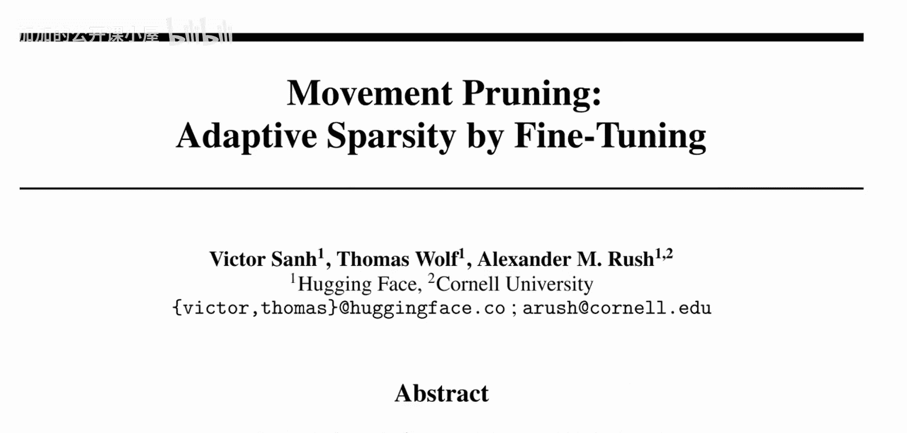

在本节课中，我们将学习一篇由Hugging Face和康奈尔大学的研究者Victor Sanh、Thomas Wolf和Alexander M. Rush发表的论文。该论文提出了一种名为“运动剪枝”的新方法，用于在迁移学习场景中对模型进行剪枝。我们将探讨为何传统的幅度剪枝在迁移学习中效果不佳，以及运动剪枝如何通过观察权重在微调过程中的“运动”来更有效地识别重要连接。

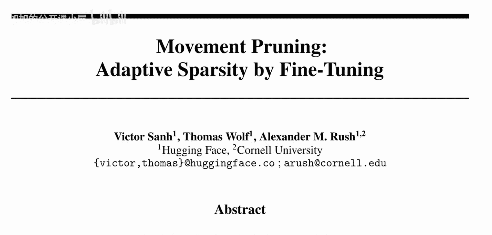

## 传统剪枝方法：幅度剪枝

上一节我们介绍了模型剪枝的基本概念。本节中，我们来看看最常用的剪枝策略——幅度剪枝。

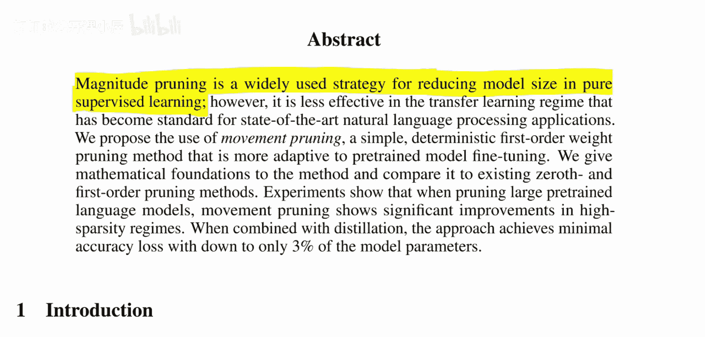

神经网络由许多神经元和它们之间的连接（即权重）构成。在训练完成后，我们希望删除部分权重以减小模型体积，同时尽可能保持模型性能。这个过程称为模型剪枝。

幅度剪枝的核心思想是：**权重的绝对值大小**决定了其重要性。具体操作如下：

1.  观察网络中所有权重的数值分布。
2.  认为绝对值较小的权重对网络输出的贡献较小，可能不那么重要。
3.  按照权重的绝对值大小进行排序。
4.  逐步删除绝对值最小的权重，直到模型达到目标大小。

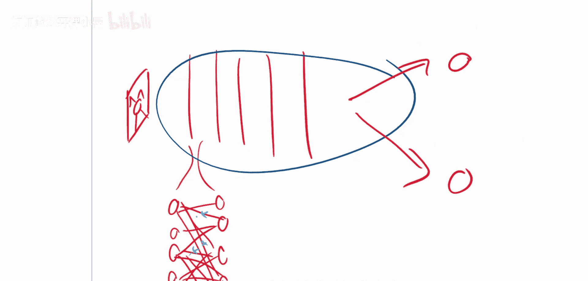

用公式表示，对于一个权重 `w`，其重要性评分 `I_magnitude` 为：
`I_magnitude = |w|`

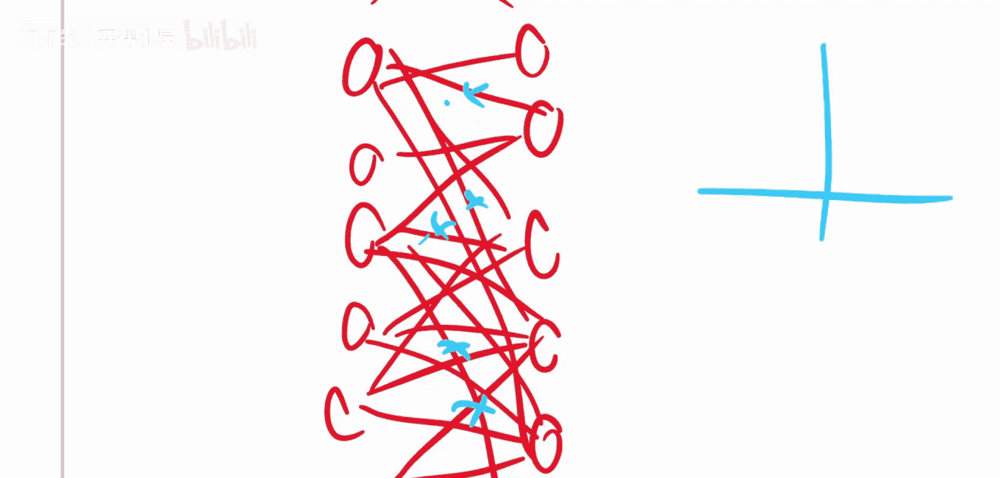

然而，这种方法存在一个问题：它假设权重的大小直接等同于其在当前任务中的重要性。这在标准的监督学习中是有效的，但在迁移学习场景中可能不再适用。

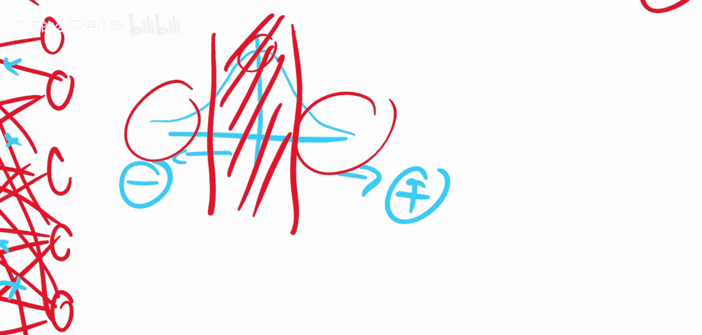

## 迁移学习中的挑战

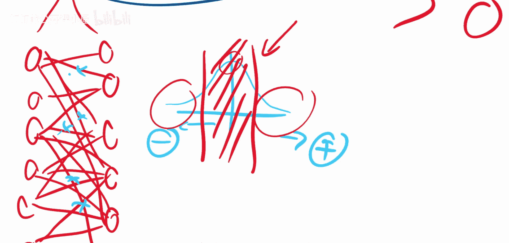

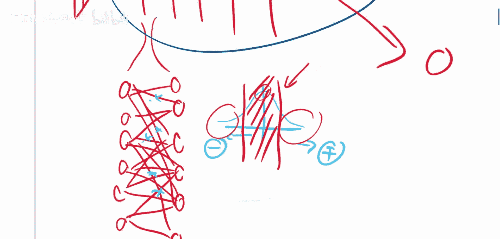

上一节我们介绍了幅度剪枝，本节中我们来看看它在迁移学习任务中面临的问题。

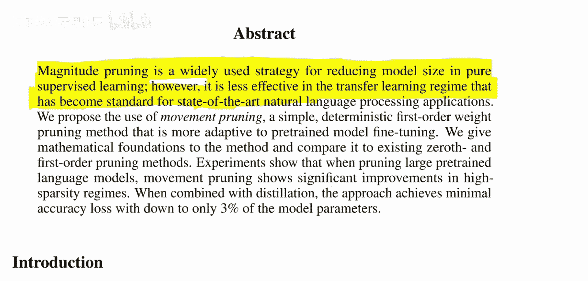

迁移学习是现代自然语言处理（NLP）等领域的标准流程。其典型步骤是：
1.  在一个大型通用数据集（如文本语料库）上预训练一个大型模型（如BERT）。
2.  在一个较小的特定任务数据集（如情感分析数据）上对这个预训练模型进行微调。

在微调阶段，模型权重会从预训练值开始进行调整，以适应新任务。

幅度剪枝在迁移学习中的问题在于：**它根据预训练任务的权重幅度来判断重要性，而不是根据目标任务**。一个权重可能在预训练任务中很重要（因此幅度大），但在目标任务中无关紧要；反之，一个在预训练中不重要的权重（幅度小），可能在微调过程中变得至关重要。

因此，直接使用预训练模型的权重幅度进行剪枝，可能会错误地保留对目标任务无用的权重，而剪掉有用的权重，导致模型性能下降。

## 运动剪枝的核心思想

既然幅度剪枝在迁移学习中效果不佳，那么应该如何判断权重的重要性呢？本节将介绍论文提出的解决方案——运动剪枝。

运动剪枝的核心洞见是：**权重在微调（迁移学习）过程中的变化量，比其初始绝对值更能反映其对目标任务的重要性。**

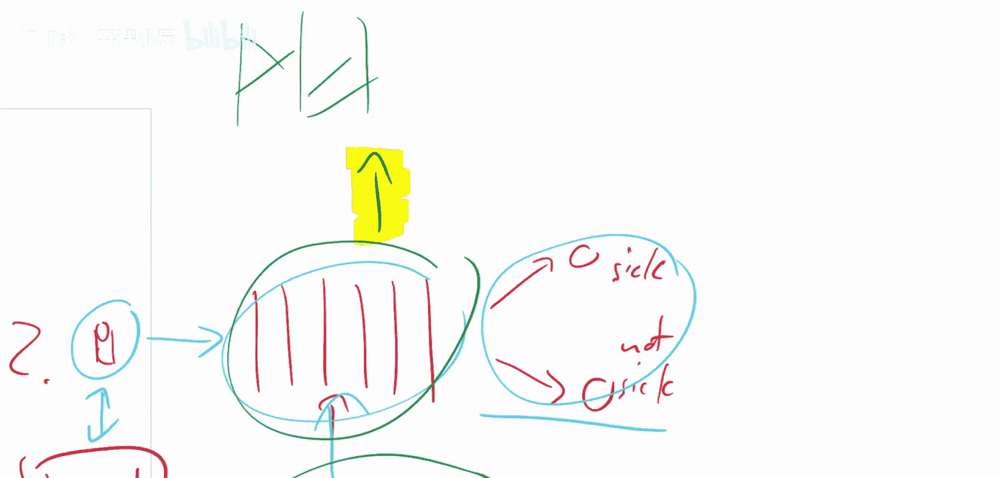

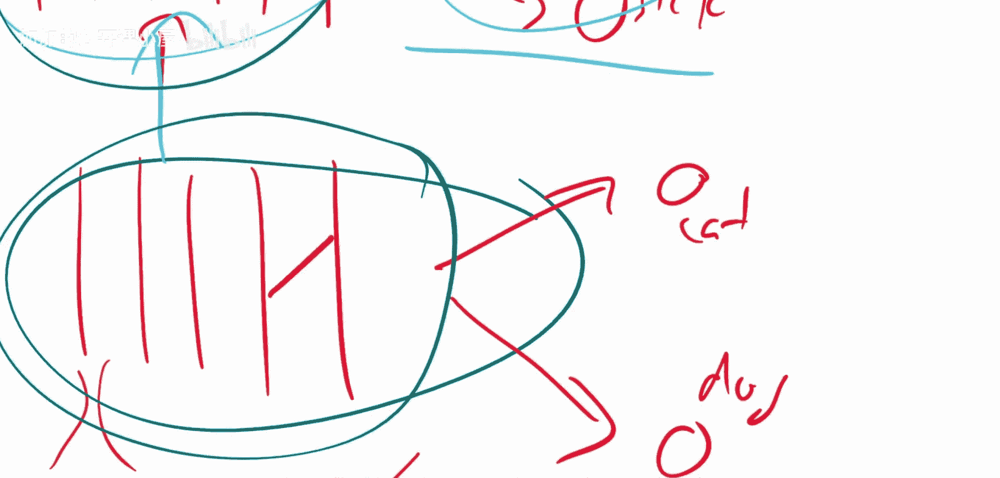

具体来说：
*   如果一个权重在微调过程中**显著地远离零值**（无论是正向还是负向移动），说明这个权重正在被调整以适应新任务，因此它对目标任务很重要。
*   如果一个权重在微调过程中**移动很小或趋向于零**，说明它对目标任务的影响不大，可以被安全地剪枝。

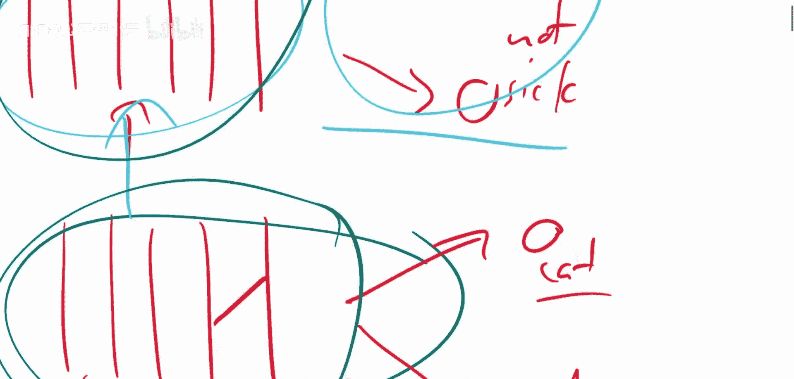

运动剪枝的重要性评分 `I_movement` 可以表示为权重在微调前后的变化：
`I_movement = |w_final - w_initial|`
其中，`w_initial` 是预训练后的权重，`w_final` 是微调后的权重。

这种方法直接衡量了权重对于**目标任务**的适应性，从而能够更准确地在迁移学习后对模型进行稀疏化。

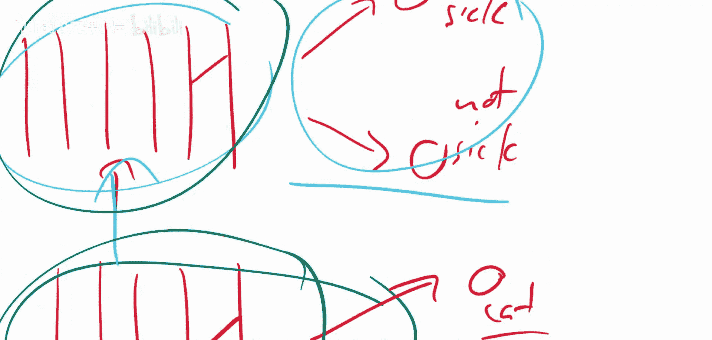

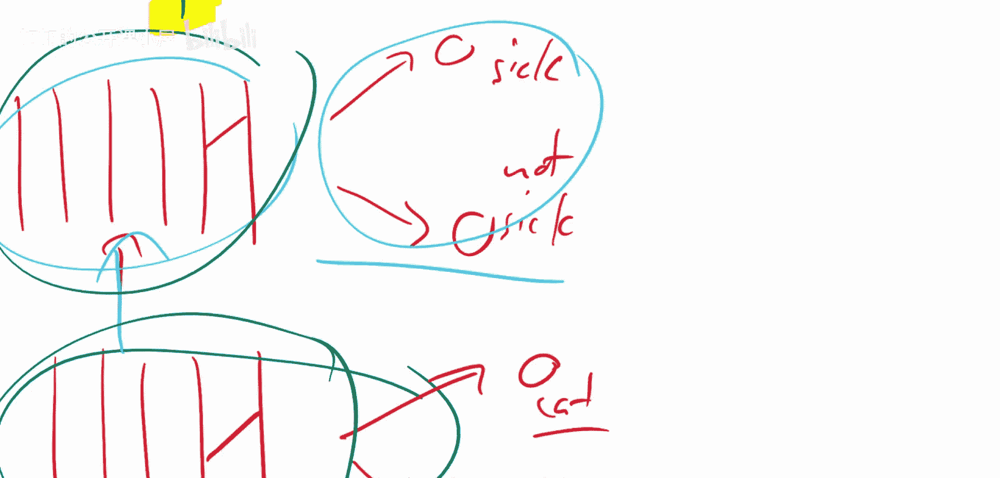

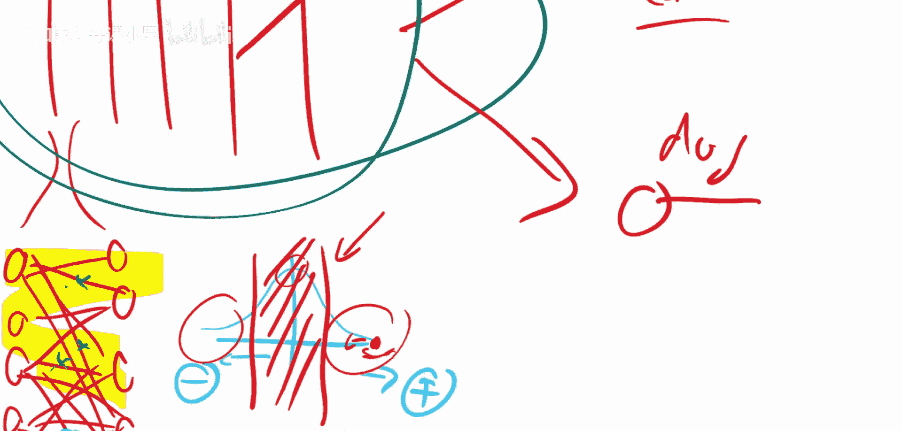

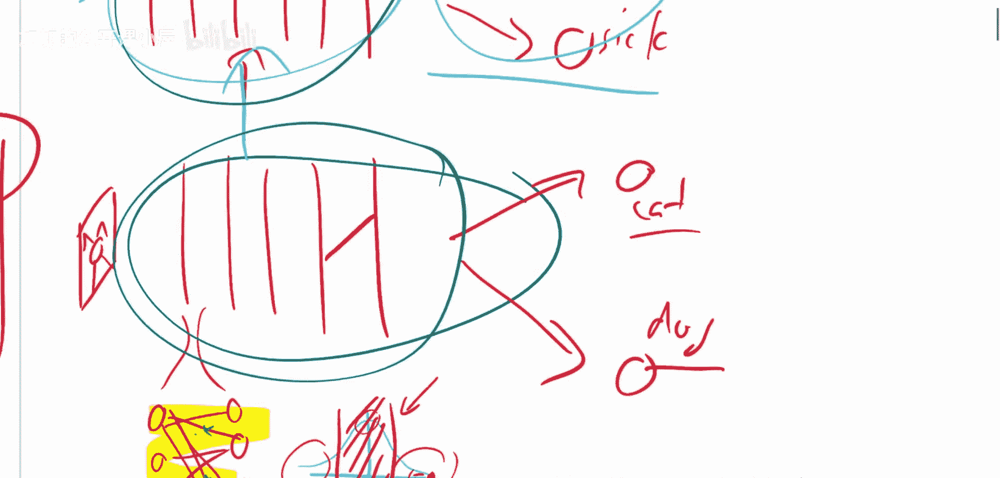

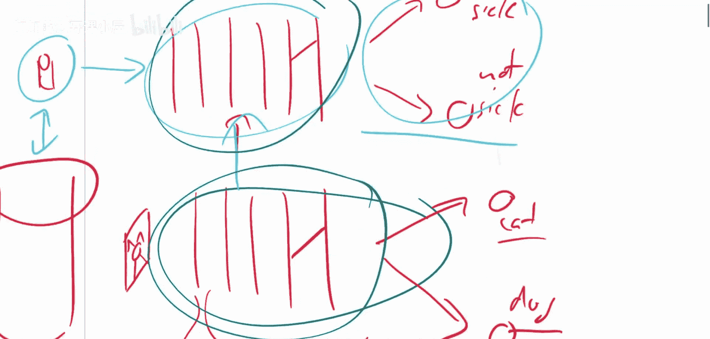

## 总结

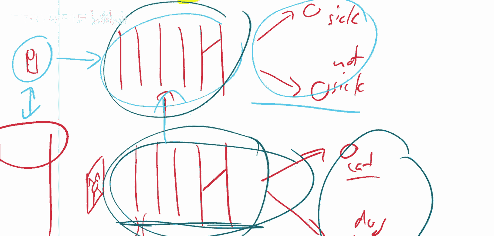

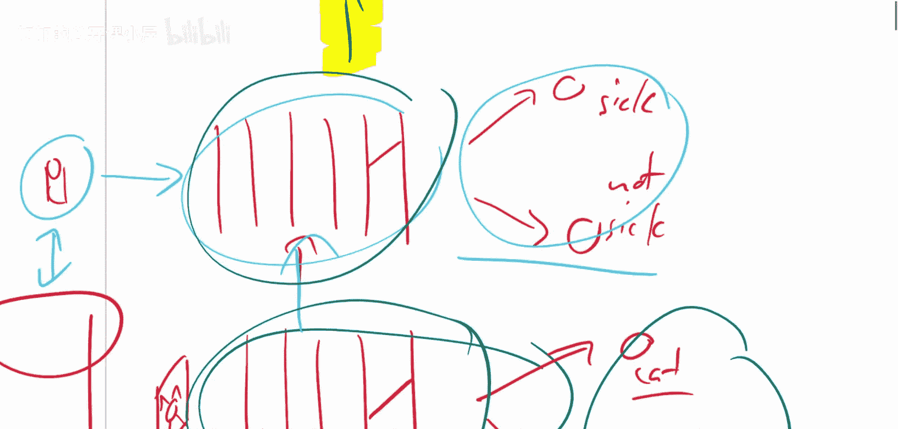

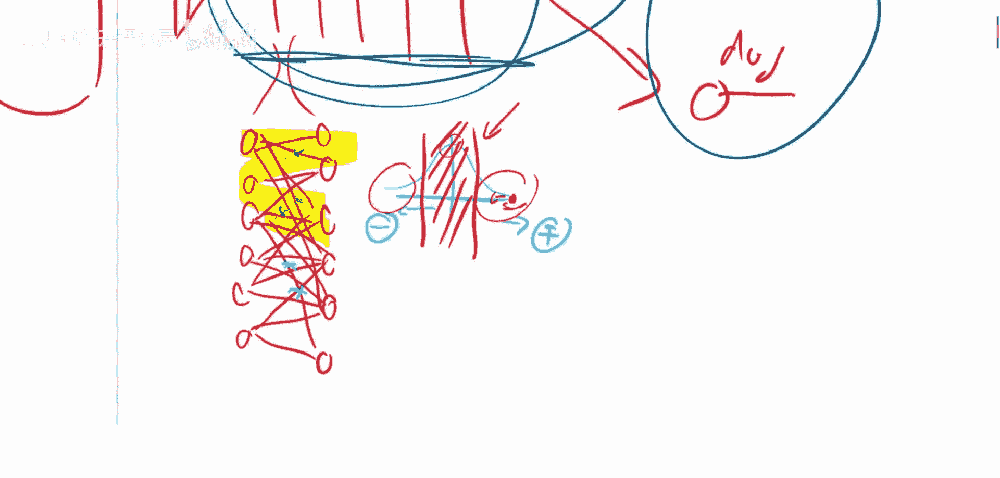

本节课中我们一起学习了“运动剪枝”这篇论文。
*   我们首先回顾了传统的**幅度剪枝**方法，它根据权重的绝对值大小决定剪枝对象。
*   接着，我们分析了在**迁移学习**场景中，幅度剪枝会失效的原因：它依据的是预训练任务的重要性，而非目标任务。
*   最后，我们介绍了论文提出的**运动剪枝**方法。该方法通过观察权重在微调过程中的变化（“运动”）来判断其重要性，变化大的权重被保留，变化小的被剪枝。这种方法能更好地适应迁移学习后的模型稀疏化需求，尤其是在模型需要极度压缩（高稀疏度）的情况下，能比幅度剪枝取得更好的性能。

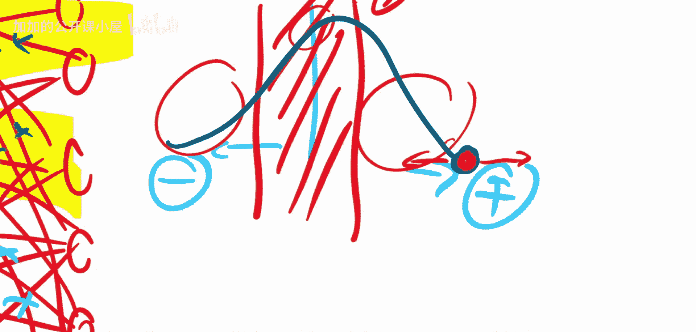

运动剪枝为在预训练-微调范式下高效地获得小型、高性能模型提供了一种新颖且有效的思路。