# 053：利用条件计算与自动分片技术扩展巨型模型（论文解读）🚀

## 概述

在本节课中，我们将要学习谷歌提出的GShard框架。这个框架旨在解决训练超大规模神经网络（如6000亿参数模型）时遇到的计算和内存挑战。我们将重点探讨其两大核心技术：**条件计算**与**自动分片**，并了解它们如何使训练如此庞大的模型成为可能。

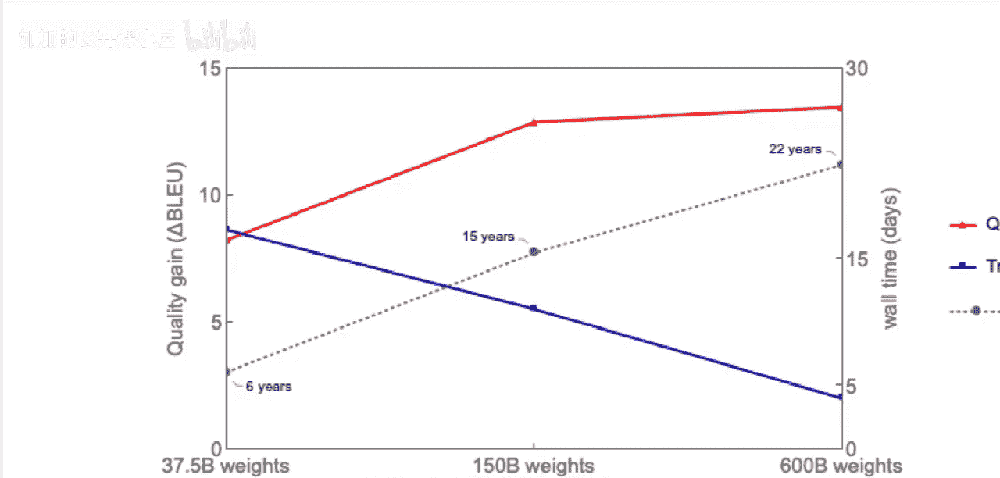

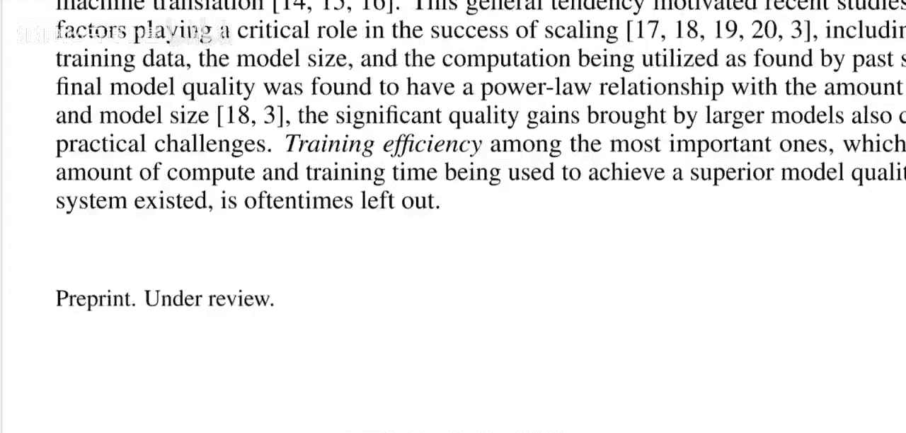

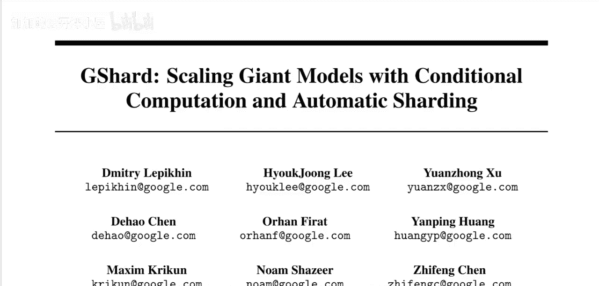

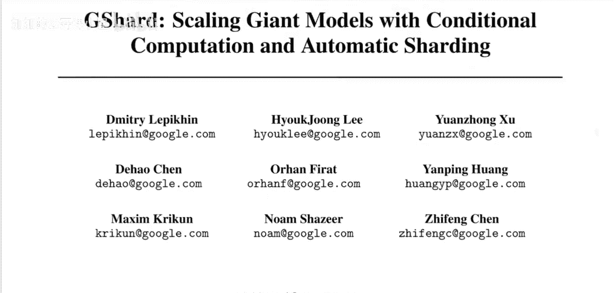

---

## 模型规模竞赛的背景

OpenAI曾发布了一个拥有1750亿参数的模型。这个规模在当时看来已经非常庞大。

然而，谷歌的研究更进一步，他们训练了一个包含**6000亿**个浮点参数的模型。这相当于6000亿个需要存储和计算的数字。

各大公司之间似乎在展开一场模型规模的竞赛。谷歌仿佛在说：“GPT-3？我瞧不上你那小小的1750亿参数。”

言归正传，我们今天要解读的论文，正是关于谷歌如何构建这个6000亿参数模型的。论文标题是《GShard: Scaling Giant Models with Conditional Computation and Automatic Sharding》，作者是谷歌的Dmitri Lepikhin等人。

这篇论文主要讲述了他们构建这个6000亿参数模型的故事。实际上，他们曾尝试构建一个万亿参数的模型，但最终未能成功训练。这一切都依赖于一个名为**GShard**的系统。

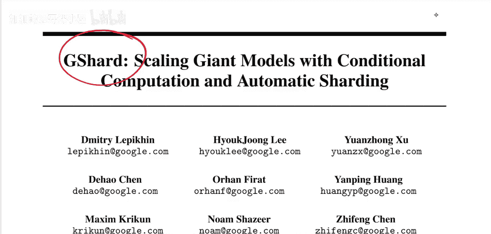

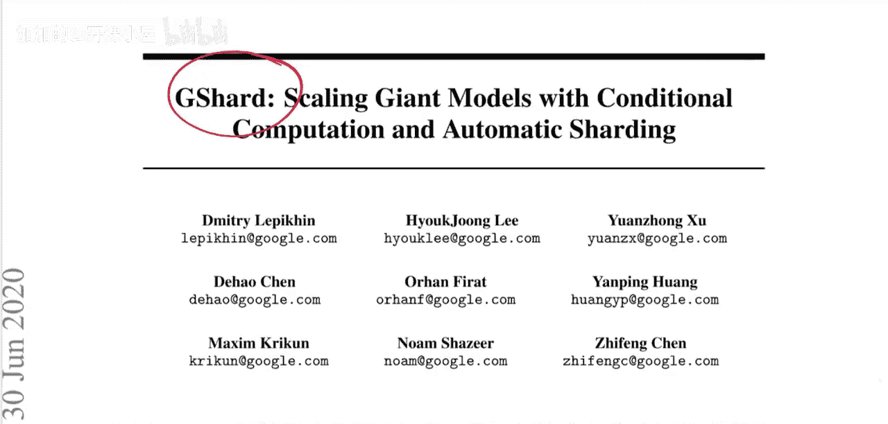

虽然目前可能尚未公开GShard的代码，但论文详细描述了这个用于训练巨型模型的系统。如果你看过我之前关于GPT-3（OpenAI的1750亿参数模型）的视频，你会发现那篇论文主要展示模型能做什么。而GShard这篇论文则截然不同，它重点在于**如何**构建模型。

OpenAI的方法主要是将一切做得更大。而谷歌的论文指出，要做得更大，需要在模型构建上使用一些技巧。他们开发了完整的框架来构建这些巨型模型，论文主要描述的就是这个框架。论文中用于展示的机器翻译任务，几乎像是一个附带演示。

因此，这是一篇**工程导向**的论文，而非纯粹的机器学习研究论文。当然，其机器学习结果也令人印象深刻。

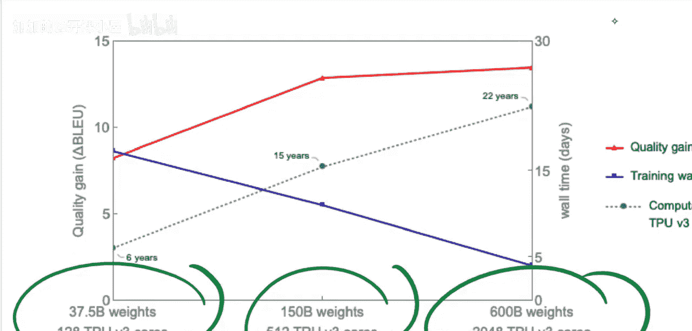

从结果图表中可以看到，随着参数从370亿、1500亿增加到6000亿，模型在机器翻译任务上的BLEU分数（一种质量评估指标）相对于之前的基线模型有显著提升。他们仅在2048个TPU上训练了四天，并强调这种效率非常高。

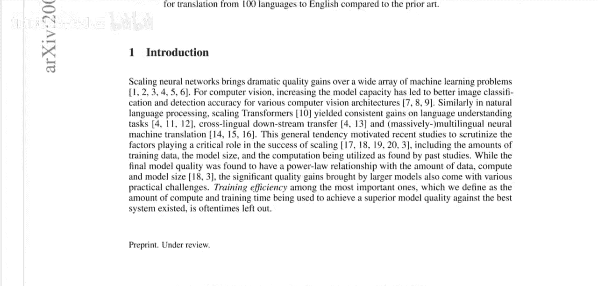

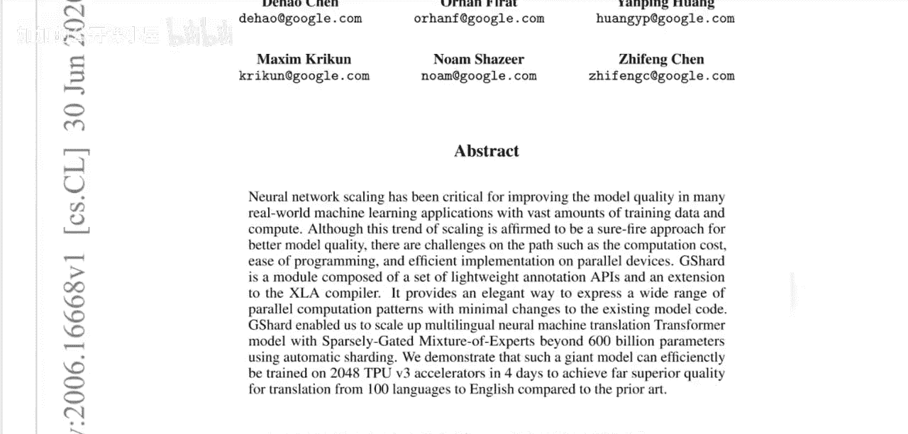

---

## 论文核心思想与结果趋势

现在，让我们深入论文的核心思想。首先看看他们的实验结果所揭示的趋势。

在自然语言处理领域，自Transformer架构发明以来，一个明确的趋势是：模型越大、数据越多、计算力越强，性能通常就越好。这个趋势在GShard的实验中依然成立。

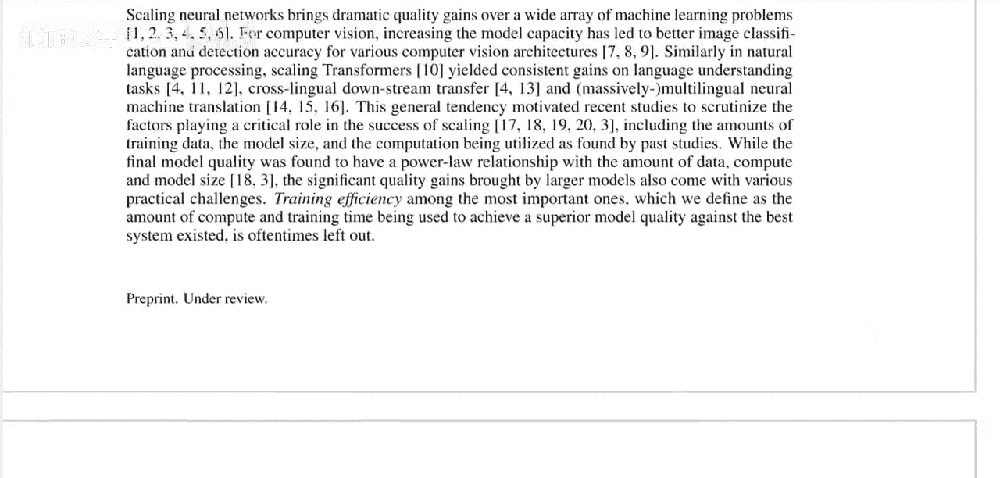

随着模型参数数量的增加，BLEU分数获得了非常大的提升。不过，这种提升似乎遵循对数缩放规律，即需要不断翻倍参数数量才能获得持续的收益增长。

与此同时，一个关键发现是：**训练所需的时间在下降，计算成本呈线性增长，而非预期的二次方增长**。这正是GShard与OpenAI等传统缩放方法的**核心区别**。

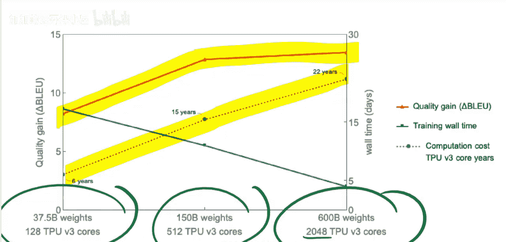

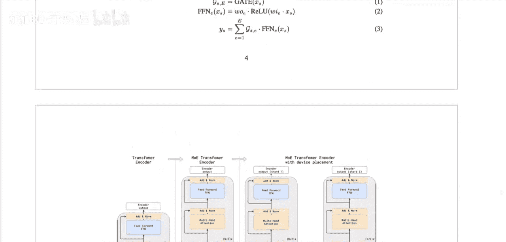

---

## 传统Transformer架构回顾

为了更好地理解GShard的创新，我们先回顾一下传统的Transformer架构。

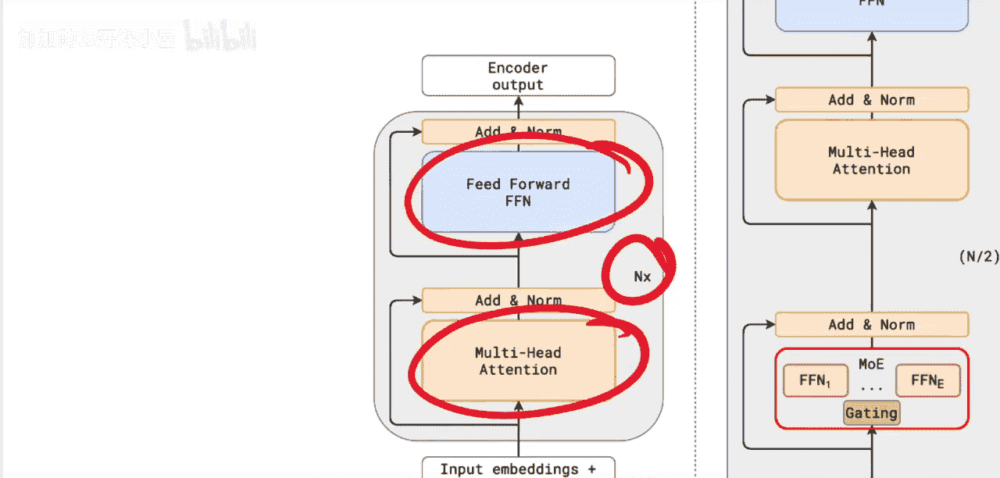

一个标准的Transformer编码器-解码器结构包含多个相同的层（Block）。每个层通常包含一个**注意力层**和一个**前馈网络层**。

*   **注意力层**：处理输入序列（例如一句话中的多个词元/token）。它通过一种称为“注意力”的机制，决定序列中不同位置之间的信息如何流动和交互。你可以将其想象成一个路由网络，将信息从一个词元传递到另一个相关的词元。
*   **前馈网络层**：在注意力层之后，每个词元的表示会独立地通过一个前馈神经网络进行变换。**关键点在于**：在传统Transformer中，同一层内所有词元使用的是**完全相同**的前馈网络。

通常，当我们谈论“扩展”Transformer时，主要关注两个方面：
1.  **增加层数（深度）**：堆叠更多的Transformer层。
2.  **扩展注意力机制**：主要是增加模型能处理的上下文长度（例如从512个词元增加到2048个）。由于注意力计算具有二次复杂度，这部分的扩展成本很高。

---

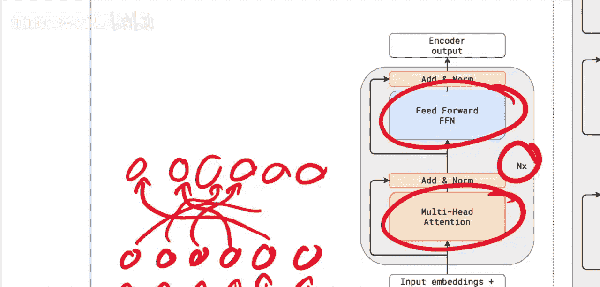

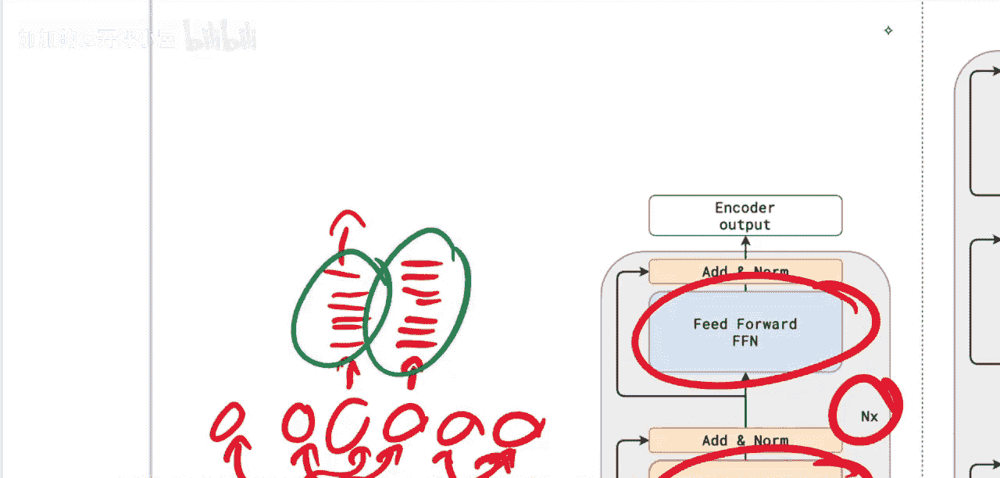

## GShard的创新：缩放前馈层与混合专家系统

GShard采用了一种不同的扩展策略。

他们**没有**显著增加模型的层数（最大模型为36层，远少于GPT-3的约96层），也**没有**大幅扩展上下文长度（采用1024，小于GPT-3的2048）。

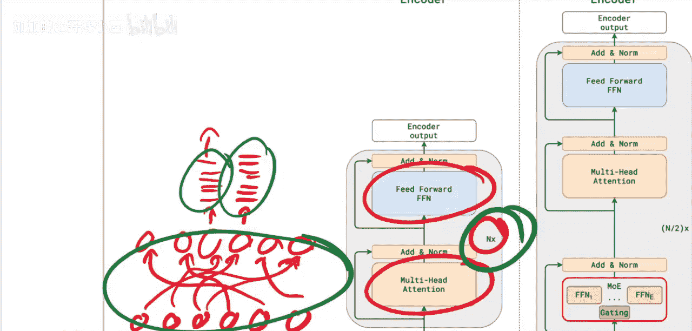

相反，他们选择**扩展前馈网络层**。这听起来可能有些反直觉。

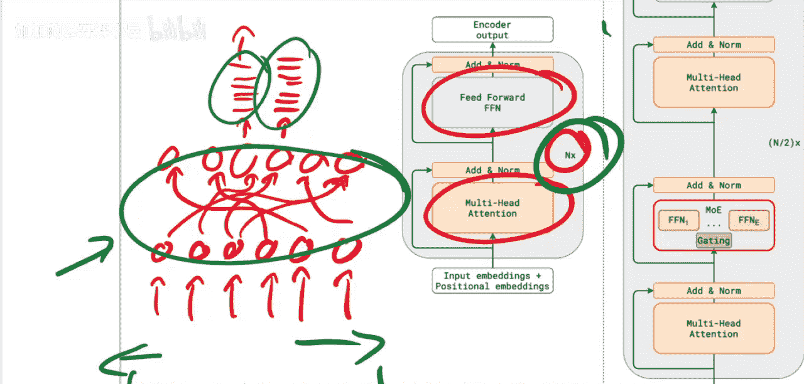

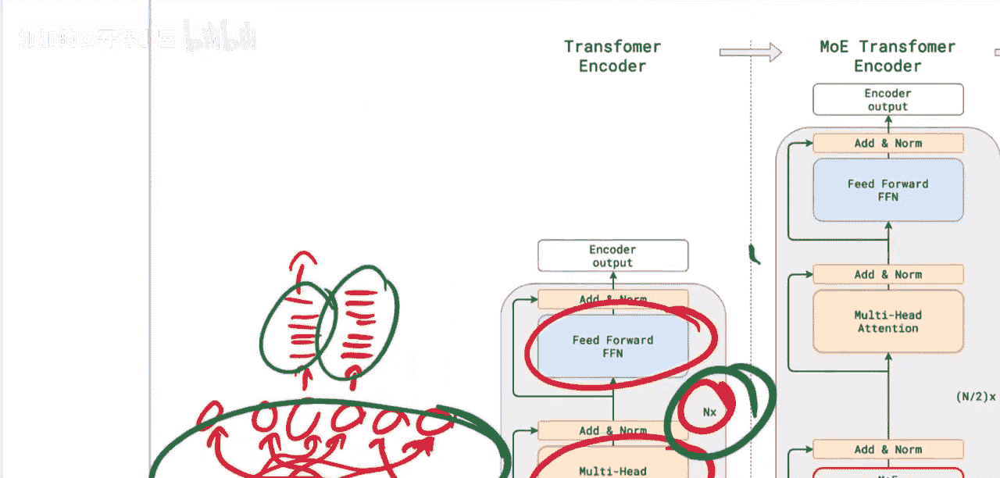

他们的想法是：为什么每层只用一个前馈网络呢？我们可以使用**许多个**不同的前馈网络。

在GShard中，每个这样的前馈网络被称为一个**专家**。于是，在注意力机制之后，他们引入了**第二个路由机制**。这个路由机制会动态地决定：对于当前层的每个输入词元，应该将其发送给哪个（或哪几个）专家进行处理。

其背后的逻辑是：输入序列中的不同词元或不同部分，可能需要不同类型的变换。这些不同的“专家”可以专门学习处理特定类型的特征或模式。

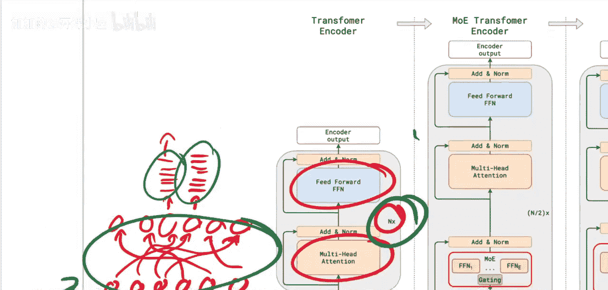

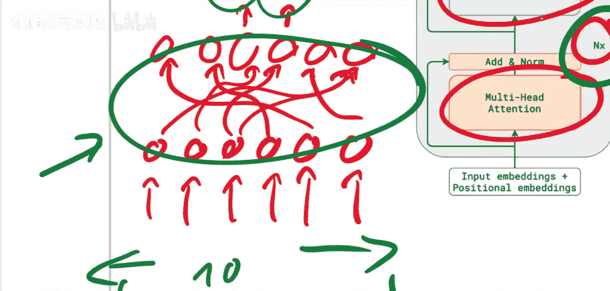

在他们的具体任务——**多语言机器翻译**中，这个设计显得尤为合理。模型需要处理从多种语言（如法语、德语等）到英语的翻译。不同的“专家”可以潜在地专门处理不同语言的语法结构或词汇特征，从而实现更高效和强大的多任务学习。

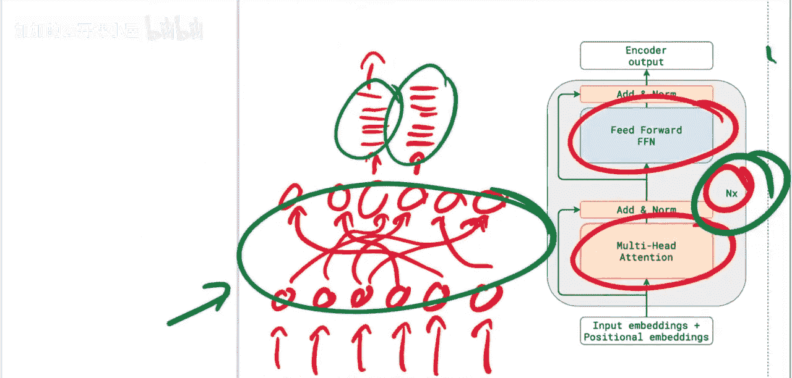

---

## 总结

本节课我们一起学习了谷歌GShard框架的核心思想。我们了解到：

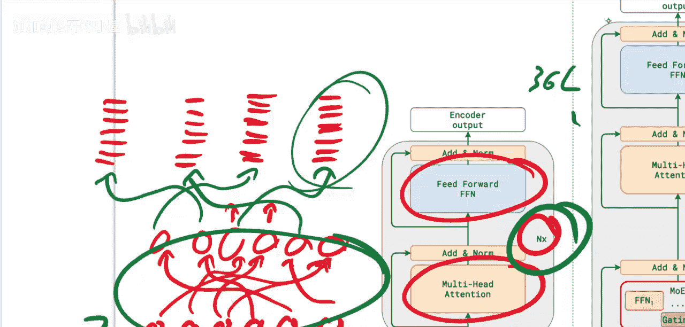

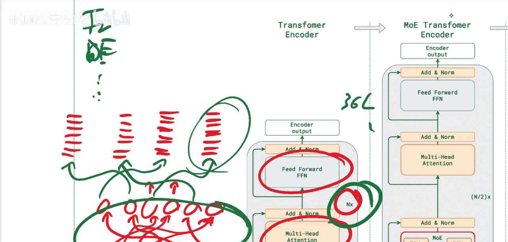

1.  GShard旨在通过**条件计算**（使用混合专家系统，动态路由词元）和**自动分片**（将模型参数智能地分布到大量计算设备上）来高效训练参数规模高达数千亿的巨型模型。
2.  与传统方法主要增加Transformer深度或注意力上下文不同，GShard通过**横向扩展前馈网络层为多个专家**来实现模型容量的增长。
3.  这种方法使得计算成本能够实现**线性增长**，而非二次方增长，从而在可控的计算资源和时间内训练出性能卓越的超大规模模型。
4.  论文以多语言机器翻译任务作为案例，展示了该框架的有效性，其6000亿参数模型在性能上取得了显著提升。

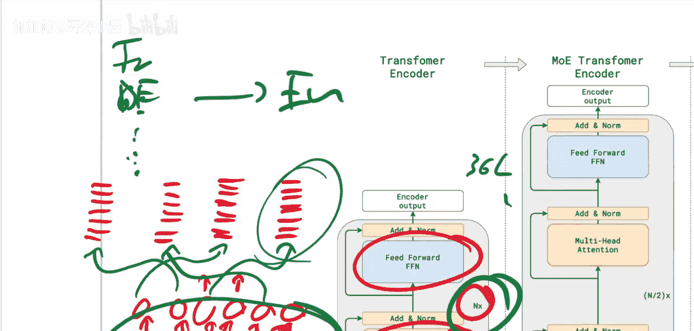

GShard代表了大模型训练基础设施发展的重要一步，为未来探索更大规模的模型提供了可行的工程路径。