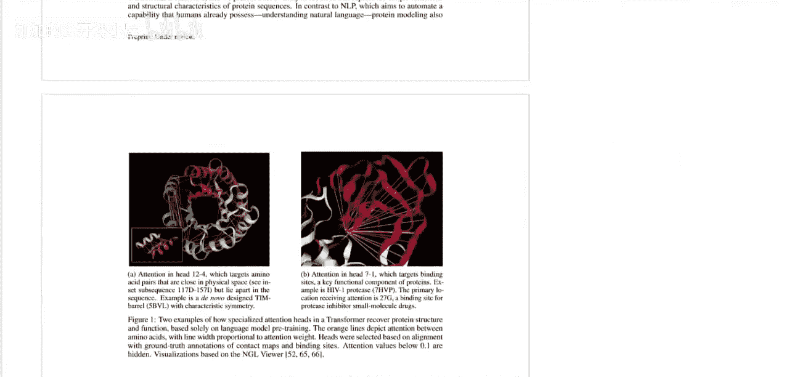
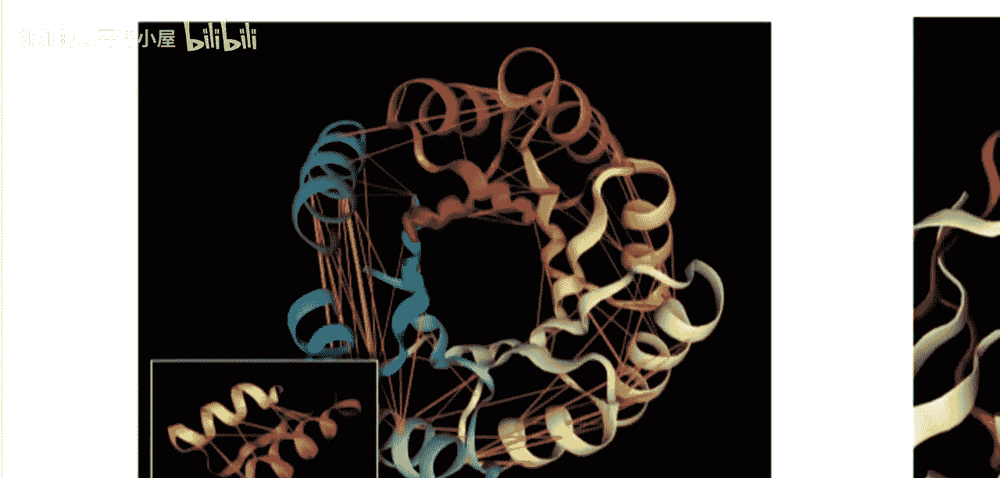
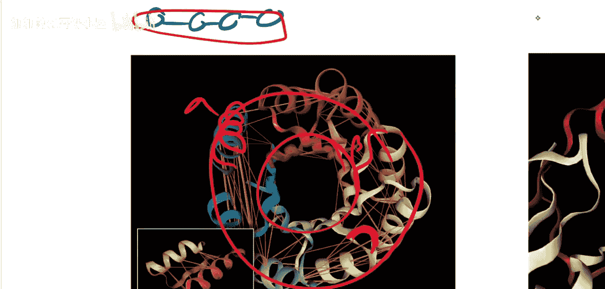

# 054：解读蛋白质语言模型中的注意力机制

在本节课中，我们将学习一篇名为《BERTology遇见生物学：解读蛋白质语言模型中的注意力机制》的研究论文。这篇论文探讨了如何通过分析在蛋白质序列上训练的BERT模型，来解读其中蕴含的生物学高阶信息。

## 生物学背景速览

上一节我们介绍了论文的研究目标，本节中我们来看看理解论文所需的生物学基础知识。

在每一个细胞中，都存在一种称为DNA的物质。DNA编码了生物体的所有功能，而这些功能通常通过蛋白质来实现。因此，DNA本质上是所有蛋白质的构建蓝图。

蛋白质的合成过程分为两个主要步骤：
1.  **转录**：以DNA为模板合成RNA。RNA是DNA的单链副本。
2.  **翻译**：将RNA翻译成蛋白质。最终产物是由氨基酸组成的链。

蛋白质是由氨基酸组成的链。共有20种不同的氨基酸，它们在链中的排列顺序决定了蛋白质的功能。蛋白质的三维空间结构对其功能至关重要。不同的氨基酸具有不同的化学性质，当蛋白质链在细胞中合成后，它会根据这些化学相互作用折叠成特定的三维形状。这个形状直接关系到蛋白质的功能，例如，有些蛋白质像剪刀一样，其形状恰好能切割其他蛋白质。

DNA的突变有时会导致蛋白质中氨基酸的改变。如果这种改变不影响蛋白质的关键形状，功能可能不变；但如果改变了决定形状的关键氨基酸，蛋白质就可能失去功能。因此，分析蛋白质序列和结构本身，与分析DNA序列同等重要。

## 论文研究方法

了解了生物学背景后，本节我们来看看这篇论文具体做了什么。

这篇论文研究了一个在蛋白质数据上训练的模型。一个蛋白质可以简单地看作是一个氨基酸序列，而每个氨基酸都有其名称或缩写。因此，一个蛋白质序列就像一串文本。

我们可以在这个“文本”上训练一个语言模型。语言模型的任务是预测序列中的下一个元素。具体到本文，研究者使用了BERT模型。BERT进行的是掩码语言建模：输入序列时，随机遮盖一些氨基酸，然后要求模型根据上下文来预测被遮盖的部分。

以下是BERT掩码语言建模的核心公式表示：
`预测 = BERT(序列[掩码位置])`

在自然语言处理中，通过这种训练，BERT能够学习语言的内部规律。这个思路被迁移到了生物学领域：研究者希望，一个在氨基酸序列上训练的BERT模型能够学习到“蛋白质的语言”，即氨基酸序列的规律。最终目标是：**仅给定蛋白质的氨基酸序列，能否推断出其重要的三维结构？** 通常，预测三维结构需要进行复杂的分子模拟。而本文的独特之处在于，BERT模型从未被直接训练去预测三维结构，它只学习预测序列本身。研究者想探究的是，在这种训练目标下，模型是否自发地学到了关于三维结构的信息。

## 蛋白质的结构层次

为了评估模型学到了什么，我们需要理解蛋白质的结构层次。本节我们来具体看看。

蛋白质的结构通常分为几个层次：
*   **一级结构**：即氨基酸的线性序列。
*   **二级结构**：序列中某些片段形成的局部规则结构，常见的有α螺旋和β折叠。
*   **三级结构**：整条氨基酸链折叠后形成的整体三维形状。

对于预测蛋白质功能而言，三级结构至关重要。论文的研究重点，就是探究BERT模型的注意力机制是否编码了关于这些二级和三级结构的信息。

## 总结

本节课中，我们一起学习了《BERTology遇见生物学》这篇论文的核心内容。我们了解到，研究者将用于自然语言的BERT模型应用于蛋白质氨基酸序列，并试图通过分析模型的内部注意力机制，来发现其中是否编码了蛋白质高阶结构的信息。这项工作展示了将先进的自然语言处理技术用于解读生物序列数据的潜力，为未来的交叉学科研究提供了有趣的思路。