# 057：叠加中的超级掩码（论文详解）🚀

## 概述

在本节课中，我们将要学习一篇名为《SupSup：叠加中的超级掩码》的论文。这篇论文由Mitchell Wortsman、Vivek Ramanujan等人撰写，它主要解决了一个在机器学习中被称为“灾难性遗忘”的难题。具体来说，它探讨了如何让一个模型能够连续学习成千上万个不同的任务，而不会忘记之前学过的内容。为了实现这个目标，论文引入并利用了“超级掩码”这一核心概念。

## 什么是灾难性遗忘？🤔

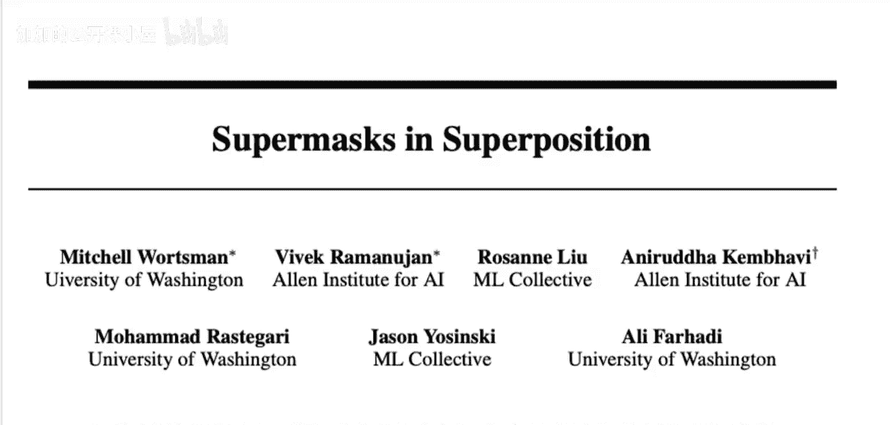

上一节我们介绍了论文要解决的核心问题。本节中我们来看看什么是“灾难性遗忘”。

想象一下，你有一个神经网络模型。你先让它学习第一个任务，比如识别CIFAR-10数据集中的图像。模型学得很好。接着，你又想让它学习第二个任务，比如识别MNIST手写数字。你可能会想，直接在这个已经学会CIFAR-10的模型上继续训练MNIST不就行了吗？理论上，我们希望最终的模型能同时做好这两个任务。

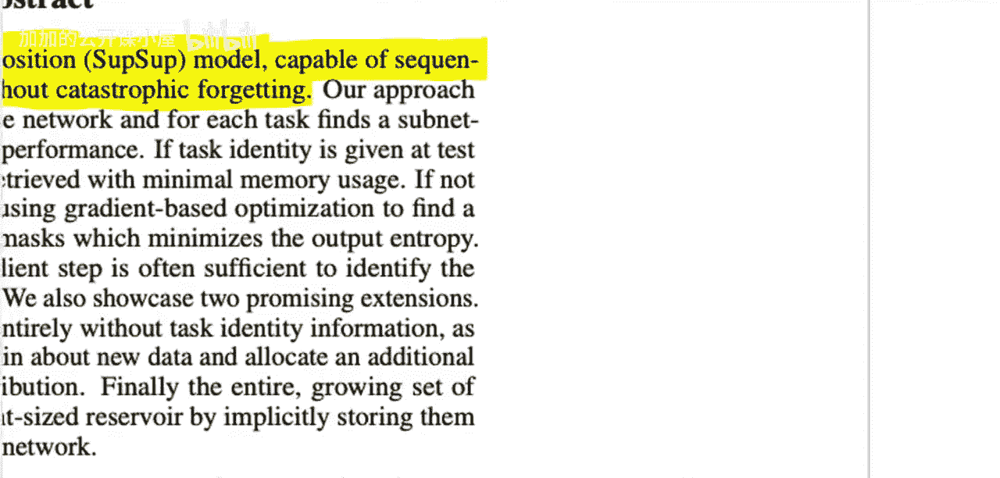

但问题来了。当你开始训练MNIST时，模型为了适应新任务，会调整其内部的参数（权重）。这个调整过程往往会严重破坏模型对旧任务（CIFAR-10）的记忆能力，导致它在旧任务上的性能急剧下降。这就是“灾难性遗忘”。

你可能会问，为什么不把所有任务的数据混在一起同时训练呢？这是一个有效的问题。在某些场景下确实可以这样做。但论文设定的场景是“顺序学习”，即任务一个接一个地到来，我们无法总是保存所有旧数据并重新训练。这在“终身学习”领域非常重要，我们希望系统能像人类一样，持续整合新经验，同时不遗忘旧知识。

## 传统解决方案与超级掩码思路💡

了解了灾难性遗忘的挑战后，我们自然会思考解决方案。一个最直接的想法是：为每个任务单独训练一个模型并保存下来。在测试时，如果我们知道输入图像属于哪个任务，就调用对应的模型。这确实能避免遗忘。

但这种方法有两个主要缺点：
1.  **存储成本高**：每个模型都很大，保存成千上万个模型需要巨大的存储空间。
2.  **浪费潜力**：不同任务（如CIFAR-10和ImageNet都是自然图像）可能共享一些底层特征。单独训练模型无法利用这种共性，可能达不到最佳性能。

那么，有没有一种方法既能保留“为每个任务准备独立方案”的优点，又能克服上述缺点呢？这就是“超级掩码”思路的用武之地。

## 深入理解超级掩码🎭

上一节我们提到了超级掩码是解决方案的关键。本节中我们来详细看看它是什么。

超级掩码的概念源于“彩票假设”相关的研究。这些研究发现了一个有趣的现象：对于一个**随机初始化**的神经网络（其权重是随机设定的固定值，尚未经过任何训练），存在一种特定的二进制掩码，当应用这个掩码后，网络在某个任务上的表现会**显著优于随机猜测**。

什么是掩码？想象你的神经网络是一张由许多神经元和连接（权重）构成的复杂电路图。掩码就像是一组开关，对应着每一条连接。开关只有两种状态：打开（值为1）或关闭（值为0）。

*   如果一条连接的掩码值为1，那么该连接保持其原始的随机权重，信号可以通过。
*   如果一条连接的掩码值为0，那么无论原始权重是多少，该连接的有效权重都被置为0，信号无法通过。

**公式描述**：对于网络中的第 `i` 个权重 `w_i`，应用掩码 `m_i ∈ {0, 1}` 后，有效的权重变为 `w_i‘ = m_i * w_i`。

所以，超级掩码的本质是：**不改变网络任何原始的随机权重，仅仅通过选择性地“关闭”或“打开”某些连接，就能让这个随机网络具备解决特定任务的能力。** 这就像在一大堆随机元器件中，找到一种特定的连接方式，让它变成一台能用的收音机。

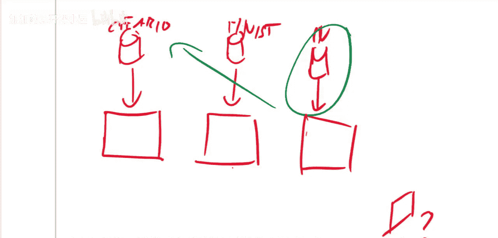

为什么这可能？一个直观的解释是：如果任务相对简单（如MNIST），而神经网络规模足够大（过度参数化），那么在巨量的随机权重组合中，很可能就隐藏着一些能凑巧解决该任务的“子网络”。寻找超级掩码的过程，就是把这个“幸运的子网络”筛选出来。

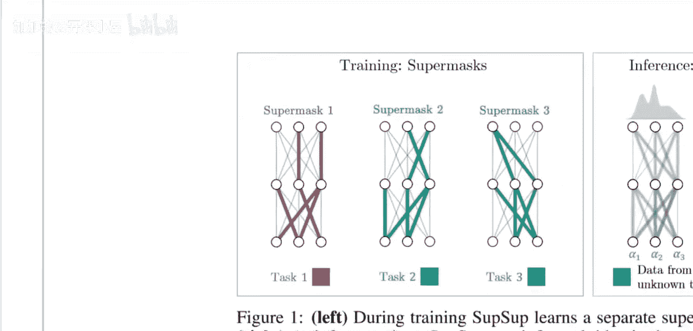

## SupSup模型的核心机制⚙️

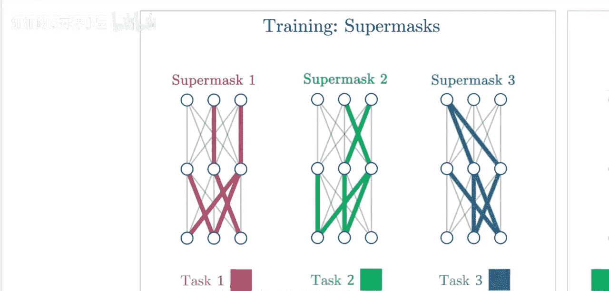

现在，我们将灾难性遗忘问题和超级掩码结合起来，看看SupSup模型是如何工作的。

SupSup模型采用了一个固定不变的、随机初始化的“基网络”。这个基网络的权重一旦初始化就永不更新。

对于每一个需要顺序学习的新任务，模型并不去训练（更新）这个基网络的权重，而是**为该任务寻找一个专属的超级掩码**。

**流程如下**：
1.  遇到任务A（如CIFAR-10），在固定的基网络上，通过优化算法找到一个超级掩码M_A，使得 `基网络 * M_A` 在任务A上表现良好。
2.  保存掩码M_A。基网络权重保持不变。
3.  遇到任务B（如MNIST），在**同一个**固定基网络上，寻找一个新的超级掩码M_B，使得 `基网络 * M_B` 在任务B上表现良好。
4.  保存掩码M_B。基网络权重依然保持不变。
5.  以此类推，学习成千上万个任务。

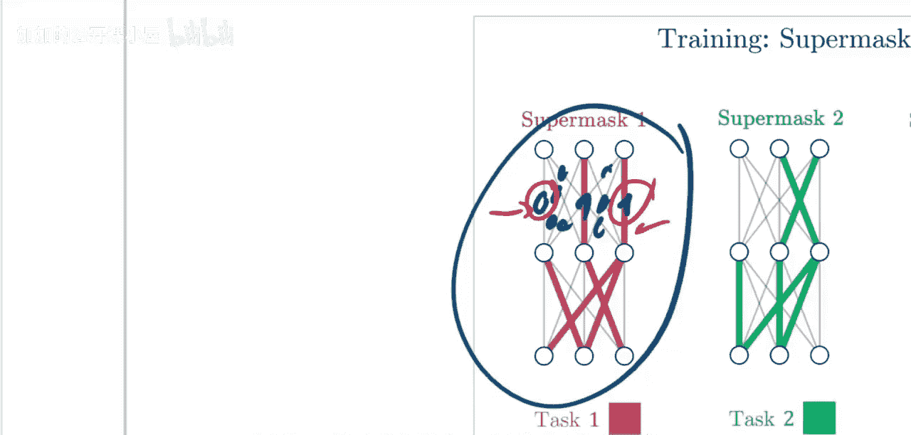

**代码描述（概念性）**：
```python
# 初始化一个永不训练的随机基网络
base_network = RandomlyInitializedNetwork()
base_network.requires_grad_(False) # 固定权重，不计算梯度

# 为每个任务学习一个掩码
task_masks = {}
for task in [task_A, task_B, task_C, ...]:
    mask = SuperMask(base_network.size()) # 初始化一个可训练的掩码
    # 优化目标：最小化任务损失，但只更新掩码参数，不更新base_network权重
    optimize(mask, loss_function(base_network, mask, task.data))
    task_masks[task.name] = mask
```

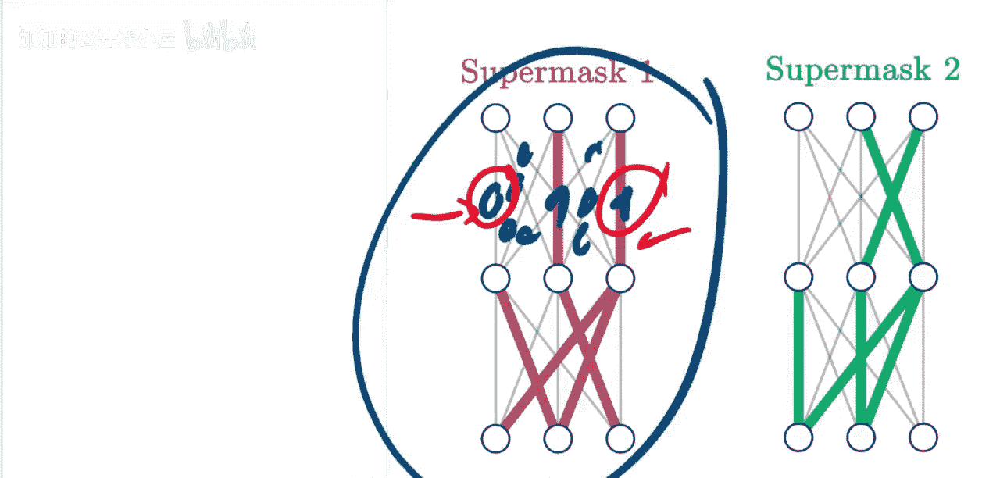

这样做的好处是：
*   **解决遗忘**：每个任务的“知识”被编码在独立的掩码中，互不干扰。学习新任务时，旧任务的掩码不会被修改。
*   **高效存储**：只需要存储一个大的基网络和许多相对较小的二进制掩码，比存储多个完整模型更节省空间。
*   **共享特征**：所有任务共享同一个基网络。虽然基网络是随机的，但不同任务找到的掩码可能会激活一些共同的、有用的连接，这隐含地实现了特征共享。

## 推理与任务识别🔍

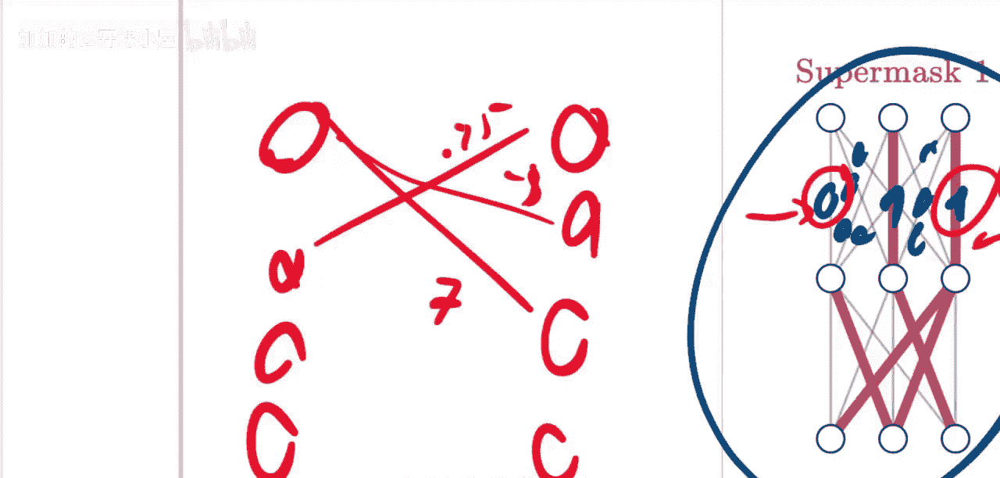

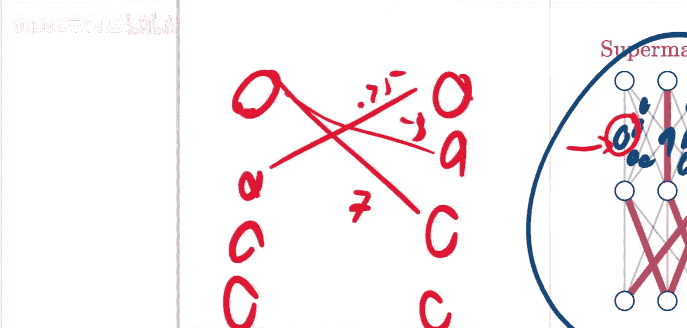

模型训练好了，如何在推理时使用呢？这涉及到任务识别。

在测试时，输入一张图片，我们可能知道它属于哪个任务（例如，用户告诉你这是MNIST图片），也可能不知道。论文处理了这两种情况：

1.  **任务已知**：这是简单情况。直接取出对应任务的超级掩码，应用到基网络上，进行前向传播即可得到预测结果。
    `output = base_network(input_image) * mask_task_k`

2.  **任务未知**：这是更具挑战性也更现实的场景。模型需要自己判断输入来自哪个任务。SupSup采用的方法是：**用每一个任务的掩码都对输入进行一次前向传播，然后看哪个掩码产生的预测置信度最高**。置信度可以用预测概率的熵或最高类别的概率来衡量。选择置信度最高的那个任务对应的掩码，作为本次推理使用的掩码。

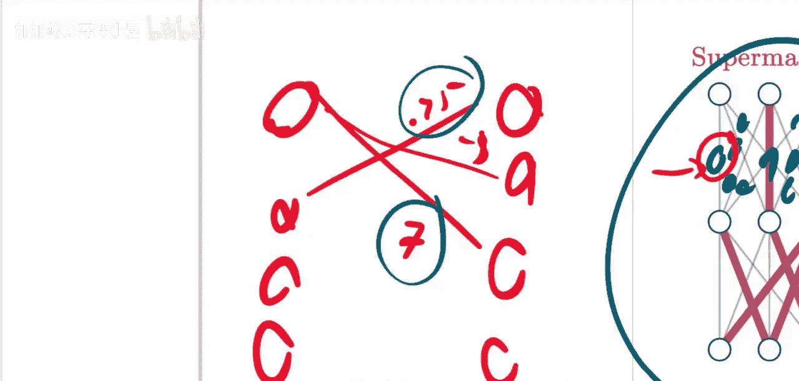

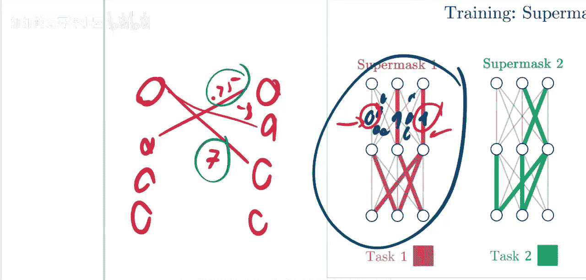

这种方法使得SupSup模型即使在不知道任务归属的情况下，也能自动选择正确的“子网络”进行处理，实现了真正的持续学习。

## 总结

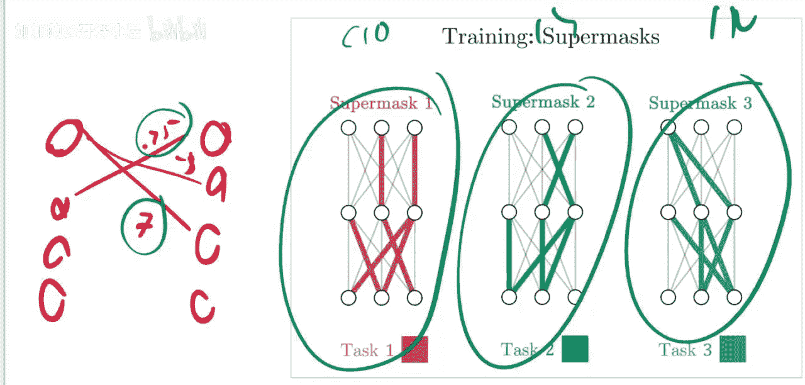

本节课中我们一起学习了SupSup模型如何利用“超级掩码”来解决持续学习中的灾难性遗忘问题。我们首先了解了什么是灾难性遗忘及其挑战。然后，我们探讨了超级掩码的起源和概念，即通过二进制开关在随机网络上筛选出能执行特定任务的子网络。SupSup模型的核心在于固定一个随机初始化的基网络，为每个顺序到来的任务学习一个独立的超级掩码，从而将知识分别存储。最后，我们还了解了模型在推理时，无论是任务已知还是未知，都能有效工作的方法。这篇论文为终身学习提供了一个新颖而高效的思路。