# 059：从自编码器到变分自编码器 🧠

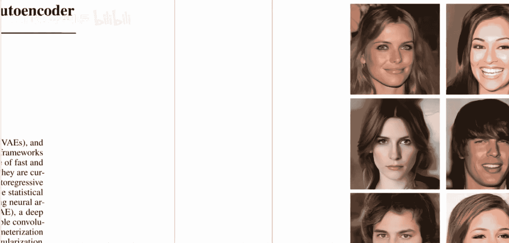

在本节课中，我们将要学习生成模型的基础知识，特别是变分自编码器（VAE）的核心概念。我们将从传统的自编码器开始，逐步理解VAE如何通过引入概率框架来改进它。

## 自编码器基础

自编码器是一种无监督学习模型，目标是学习数据的压缩表示。它由两部分组成：编码器和解码器。

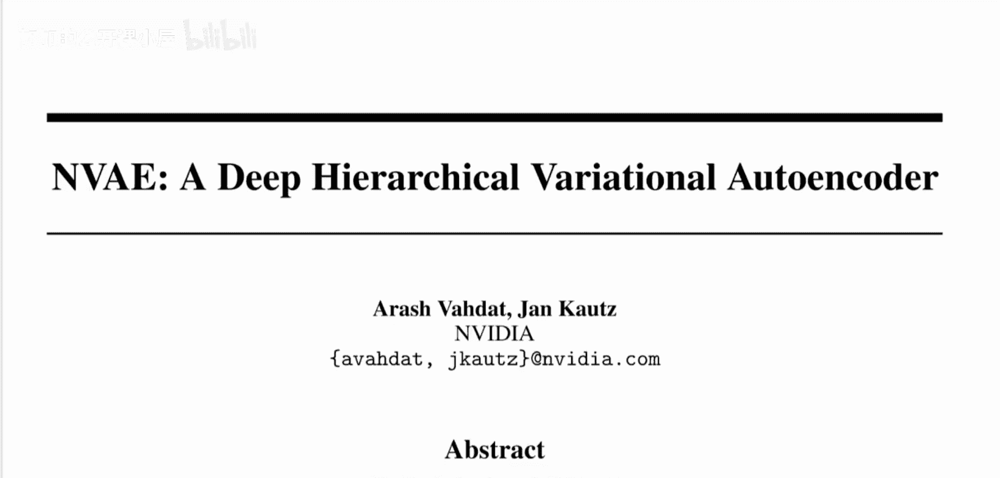

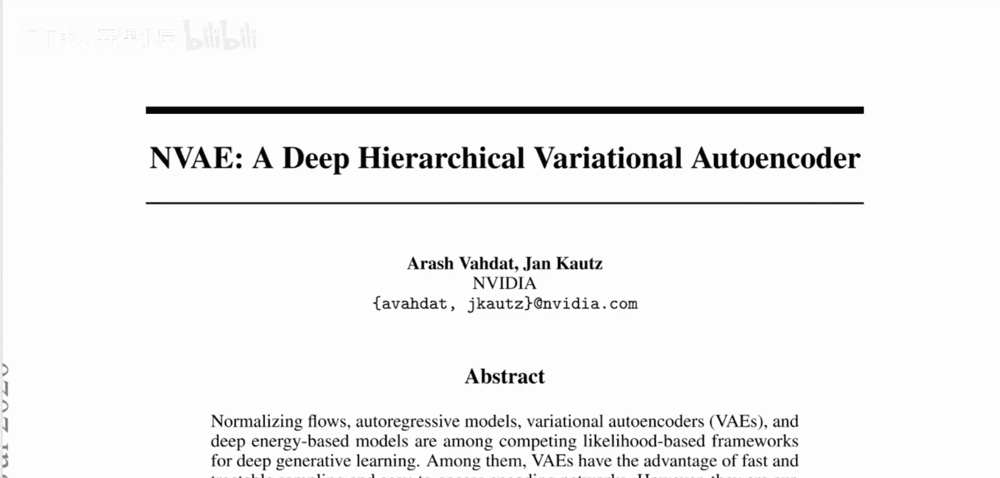

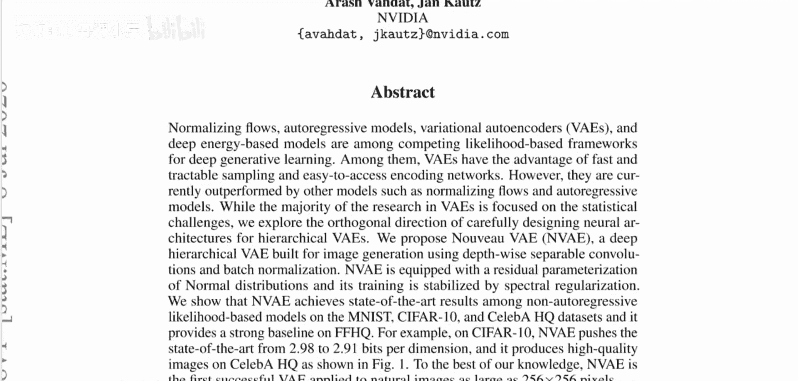

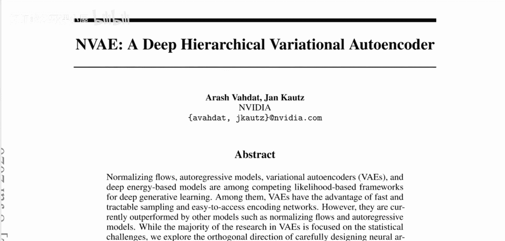

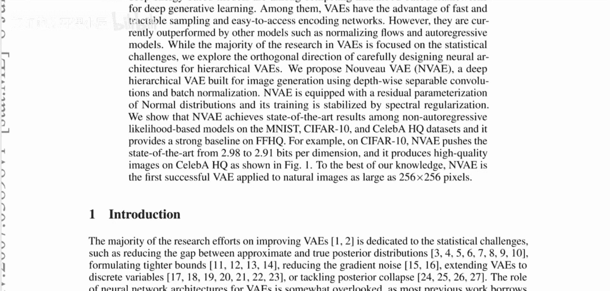

编码器将输入数据（例如一张图像）映射到一个低维的“潜在空间”表示。解码器则尝试从这个潜在表示中重建出原始输入。训练目标是使重建输出与原始输入尽可能相似，这个差异被称为**重建损失**。

**公式**：对于一个输入图像 `x`，编码器 `E` 输出潜在编码 `z`，解码器 `D` 输出重建图像 `x'`。目标是：
`minimize ||x - D(E(x))||^2`

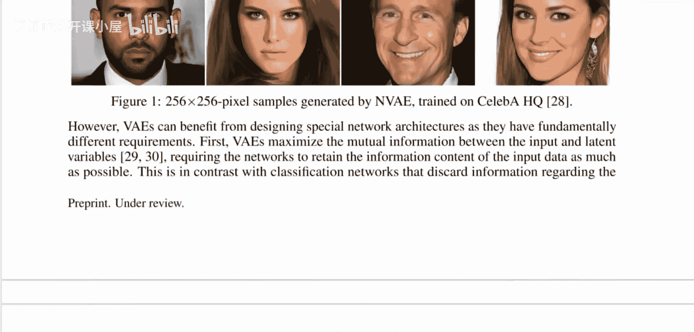

## 变分自编码器的引入

上一节我们介绍了自编码器，本节中我们来看看它的概率版本——变分自编码器。

变分自编码器（VAE）的核心思想是为潜在空间引入一个概率分布。编码器不再直接输出一个确定的潜在编码 `z`，而是输出一个概率分布的参数。通常，我们假设这个分布是高斯分布，因此编码器输出均值 `μ` 和标准差 `σ`。

**公式**：编码器输出 `μ` 和 `σ`，定义了潜在变量的分布：`q(z|x) = N(z; μ, σ^2I)`。然后，我们从该分布中采样一个样本 `z`：`z ~ N(μ, σ^2I)`。解码器接收这个样本 `z`，并尝试重建输入。

## VAE的训练目标与挑战

VAE的训练目标包含两部分：重建损失和正则化项。

1.  **重建损失**：与自编码器相同，衡量重建图像与原始图像的差异。
2.  **KL散度正则化**：鼓励编码器输出的分布 `q(z|x)` 接近一个预先设定的先验分布（通常是标准正态分布 `N(0, I)`）。这防止了编码器“作弊”——例如，将方差设得极小，退化成普通的自编码器。

**公式**：VAE的总损失函数是：
`L = E_{z~q(z|x)}[log p(x|z)] - β * KL(q(z|x) || p(z))`
其中，`p(z) = N(0, I)` 是先验分布，`β` 是平衡两项的系数。

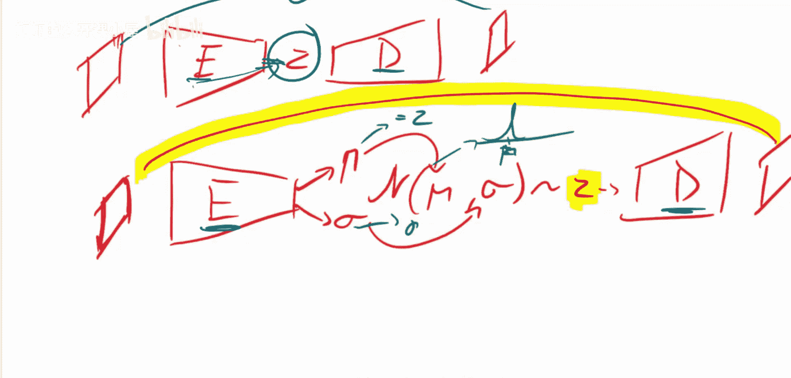

然而，传统的VAE存在一个普遍问题：生成图像往往比较模糊。一个解释是，为了最小化来自同一分布的不同样本 `z` 的重建损失（如L2损失），模型倾向于输出所有可能重建图像的“平均”，从而导致模糊。

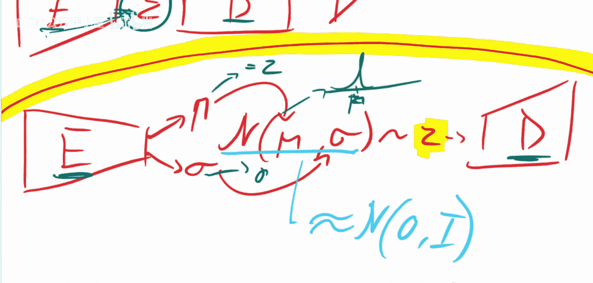

## 深度分层VAE：解决模糊问题的关键 🔄

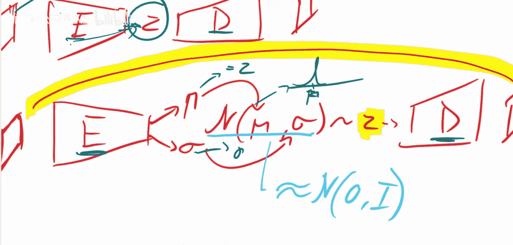

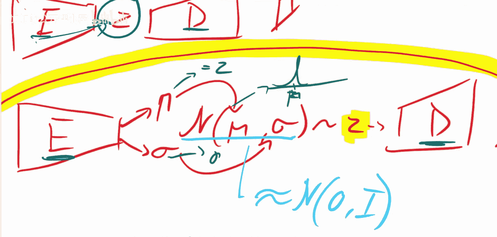

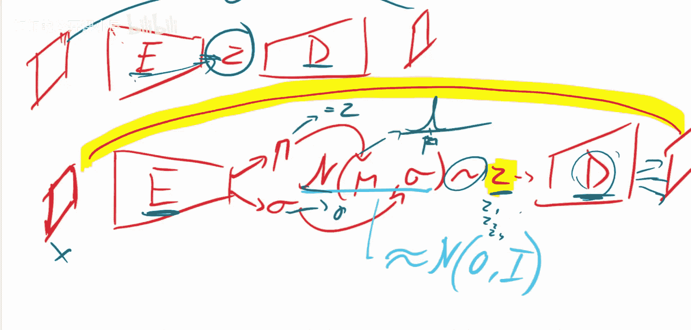

为了解决传统VAE生成图像模糊的问题，NVAE论文采用了深度分层结构。

这种结构类似于渐进式生成网络。生成过程（解码器）是分层的：我们从最顶层的潜在变量 `z_L` 开始，它是一个简单的分布（如高斯噪声）。然后，我们逐步“细化”这个表示。

以下是其工作原理的简化流程：

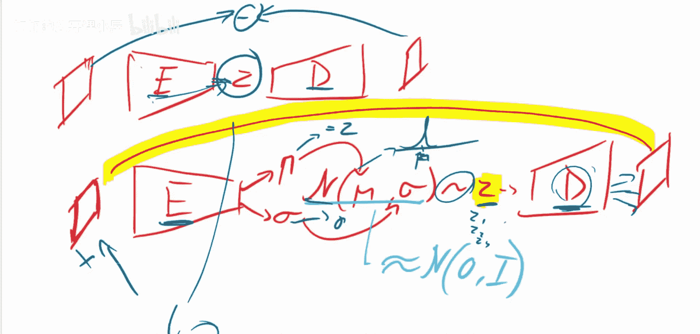

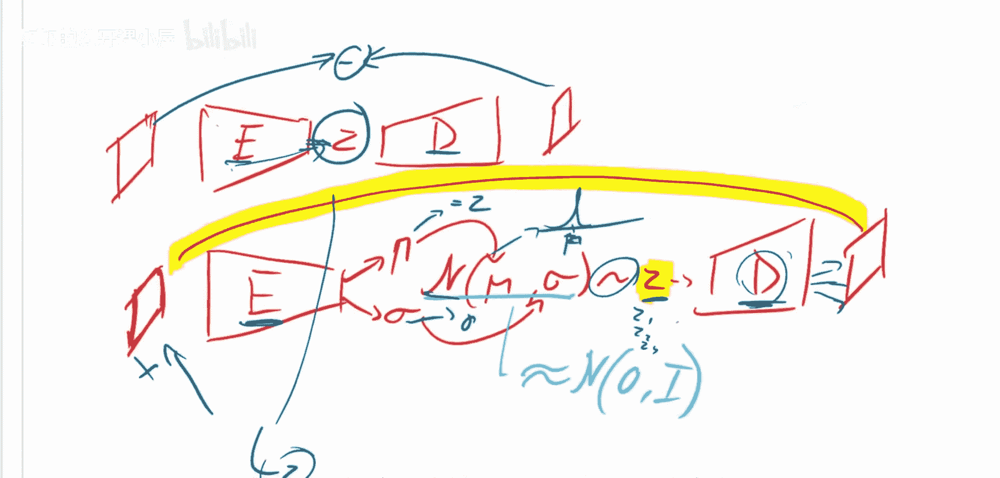

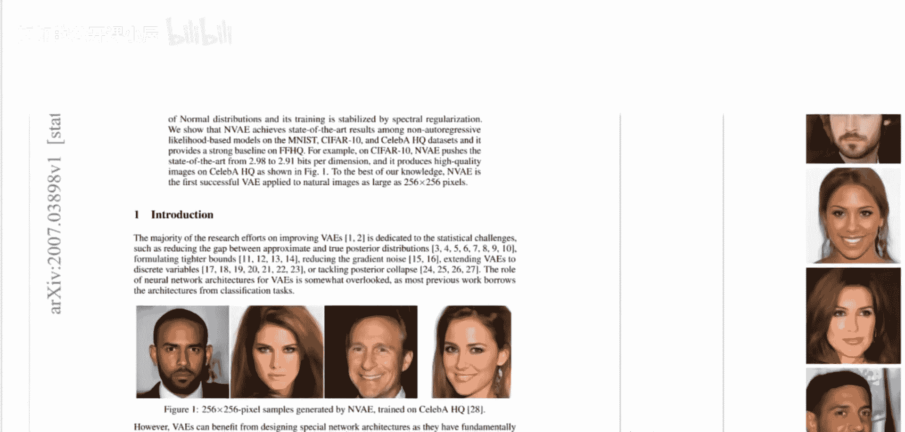

1.  采样顶层噪声 `z_L`。
2.  通过一个神经网络块，将 `z_L` 上采样并转换为下一层所需的参数，同时生成该层的潜在变量 `z_{L-1}`。
3.  重复此过程，每一层都接收来自上一层的信号，并生成更精细、分辨率更高的表示，同时采样该层自己的潜在变量。
4.  最终，最后一层输出生成的高分辨率图像。

这种分层设计允许模型在不同尺度上捕获数据的层次化结构，从整体轮廓到局部细节，从而能够生成更清晰、更逼真的图像。它有效地将复杂的生成任务分解为一系列更简单的子任务。

## 总结

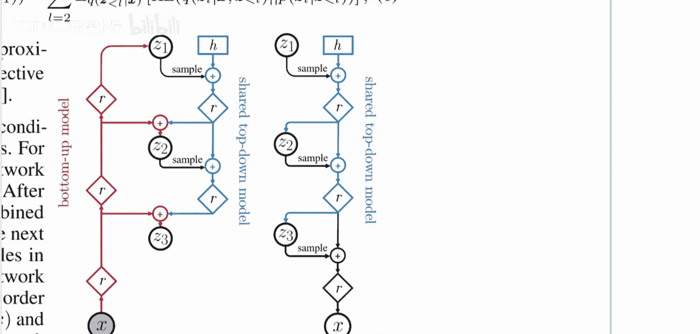

本节课中我们一起学习了变分自编码器（VAE）的核心原理。我们从基础的自编码器出发，理解了VAE如何通过引入潜在变量的概率分布（输出 `μ` 和 `σ`）以及KL散度正则化，构建一个概率生成模型。我们也探讨了传统VAE生成图像模糊的潜在原因。最后，我们介绍了NVAE论文的核心创新——深度分层VAE结构，它通过多尺度、渐进式的生成过程，显著提升了生成图像的质量和清晰度，展示了将现有技术巧妙结合所能带来的强大效果。