# 061：从损失景观的视角解析（论文解读）

在本节课中，我们将学习一篇名为《深度集成：从损失景观的视角解析》的论文。这篇论文由 Stanisla Fort、Huyihu 和 Balaji Lakshmiar Rayanan 撰写，旨在从损失景观的角度解释深度集成模型的工作原理。我们将探讨深度集成如何通过捕捉解空间中的不同模式来提升模型的准确性、不确定性和分布外鲁棒性，并将其与贝叶斯神经网络等方法进行比较。

## 1：引言与背景

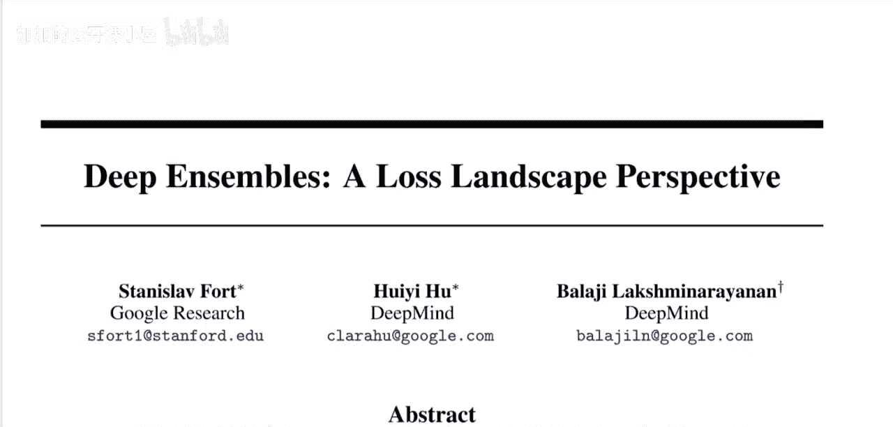

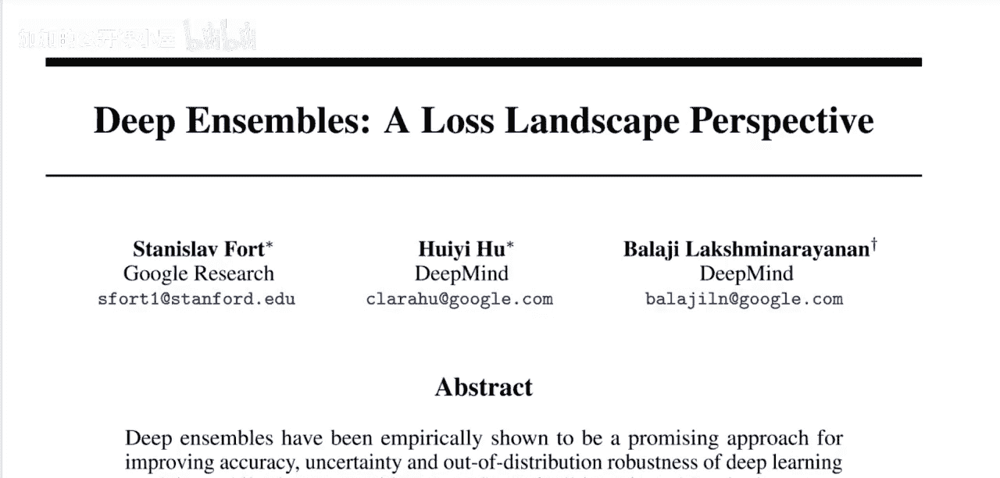

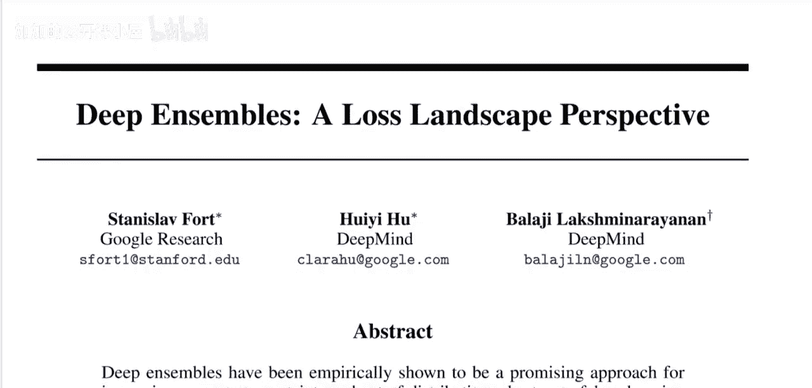

上一节我们介绍了本节课的主题。本节中，我们来看看论文的研究背景和动机。

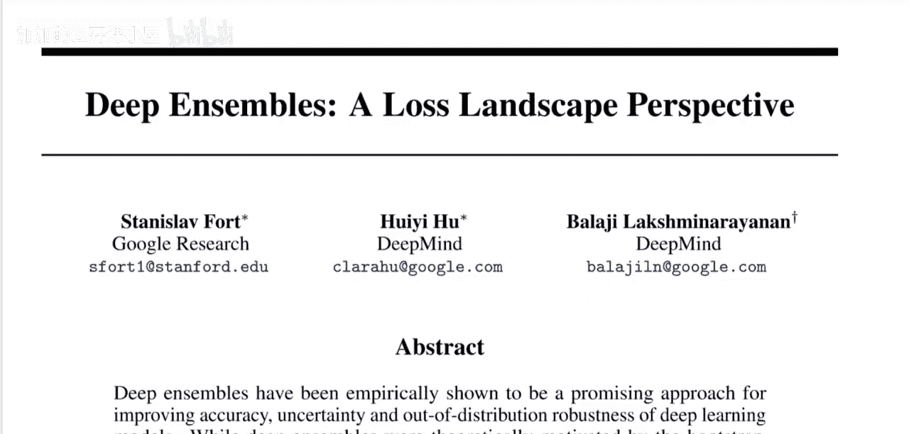

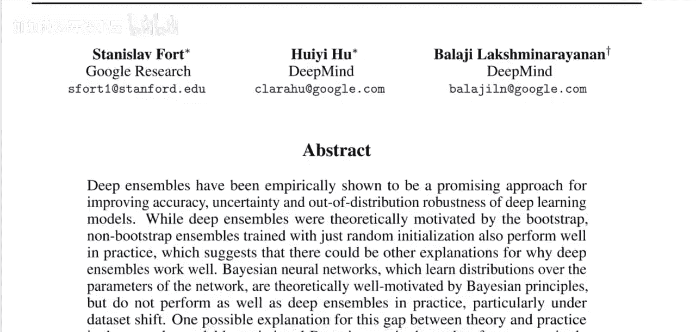

深度集成方法在经验上已被证明是提升深度学习模型准确性、不确定性和分布外鲁棒性的有效途径。那么，什么是深度集成呢？在分类任务中，我们有一个数据集，其中每个数据点包含特征 `X` 和标签 `Y`。我们的目标是构建一个模型 `f`，使得 `f(X) ≈ Y`。

一个深度神经网络就是这样一个函数 `f`，它由许多层组成，并通过参数（权重）进行参数化。而深度集成，则是训练多个这样的深度神经网络。在预测时，我们将数据点输入到所有网络成员中，然后通过某种方式（如取平均值或众数）聚合它们的预测结果。这种方法通常能获得比单一模型更好的性能。

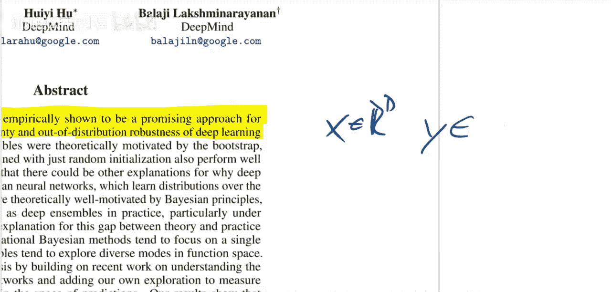

## 2：损失景观与解空间

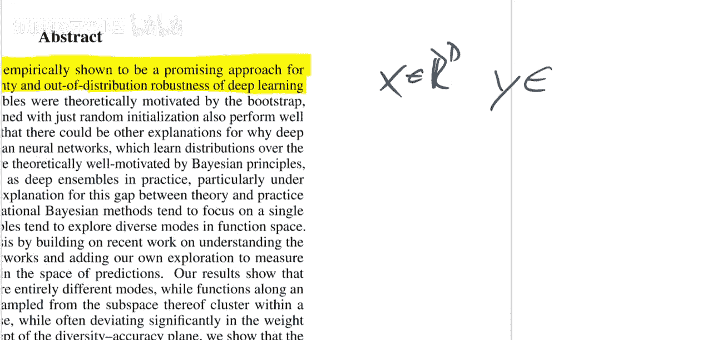

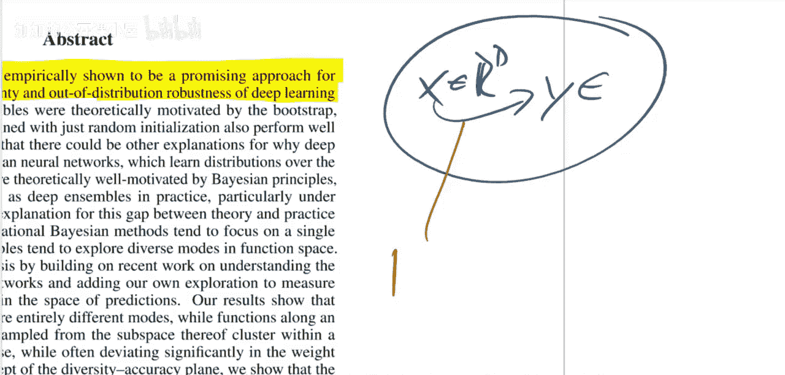

上一节我们介绍了深度集成的基本概念。本节中，我们来深入理解论文的核心视角——损失景观。

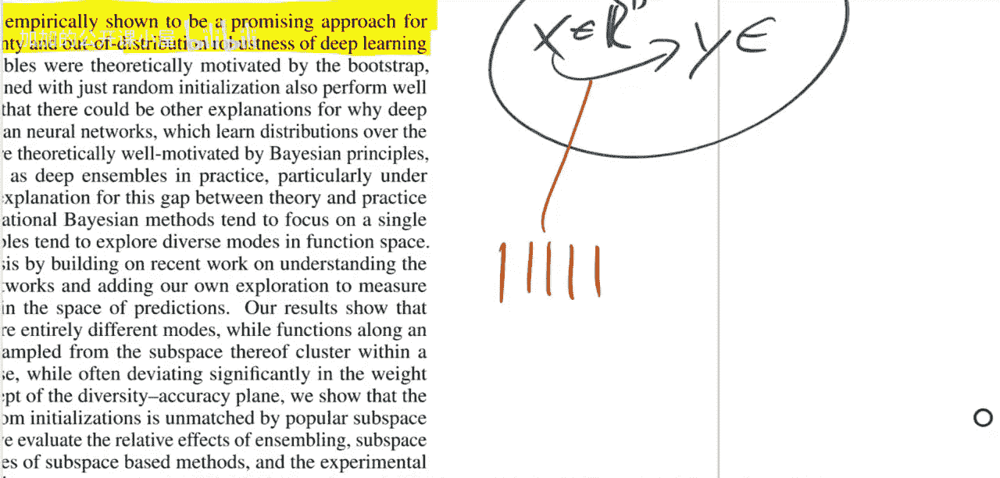

为了解释深度集成为何有效，论文引入了“损失景观”和“解空间”的概念。我们可以将神经网络的权重空间想象成一个坐标轴。在这个空间中，每个点代表一组特定的权重参数，对应一个可能的“解”（即一个训练好的模型）。

训练过程可以看作是在这个空间中寻找一个点，使得模型在训练集上的准确率最高（损失最低）。通常，我们通过梯度下降等方法优化一个网络，最终会收敛到某个局部最优点。然而，神经网络的损失景观非常复杂，存在许多性能相近的局部最优解（即不同的“模式”）。

## 3：单一模型、贝叶斯方法与深度集成的对比

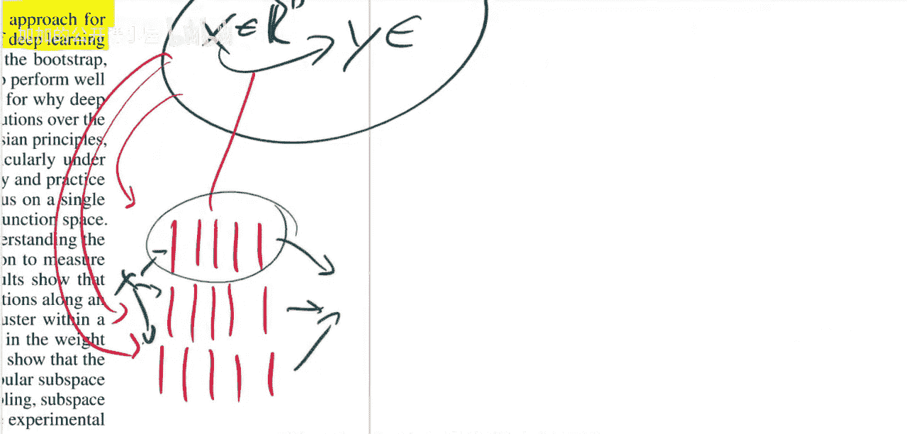

上一节我们了解了损失景观中存在多个模式。本节中，我们对比分析单一模型、贝叶斯近似方法和深度集成在捕捉这些模式上的差异。

以下是三种主要方法的对比：

*   **单一模型（最大后验估计）**：这种方法只优化一个神经网络，直到达到最佳训练准确率。它最终会收敛到损失景观中的某一个局部最优点（模式）。虽然这个点可能在训练集上表现很好，但其泛化能力（在验证集上的表现）可能并非最优，并且它完全忽略了其他可能的优质解。

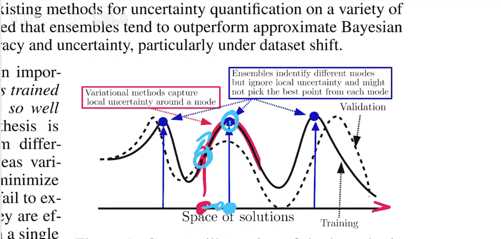

*   **贝叶斯神经网络**：这类方法试图捕捉整个解空间的概率分布，而不仅仅是单个点。理论上，这能提供更丰富的不确定性信息。然而，在实践中，由于计算复杂性，通常需要对后验分布进行近似（例如，使用多元高斯分布）。论文指出，这种近似往往只能准确地捕捉**一个**主要模式及其周围的曲率信息，但无法发现或表征分布中其他离散的、性能优异的模式。

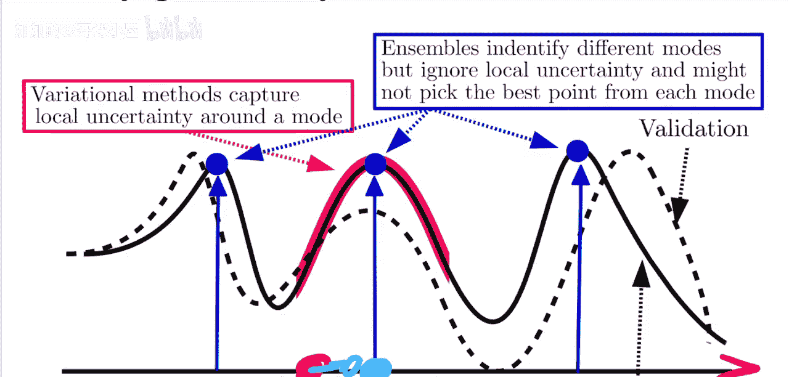

*   **深度集成**：论文的核心假设是，深度集成通过一个简单的机制有效地解决了上述问题。由于集成中的每个成员都从随机的初始权重开始进行优化，它们很可能会收敛到损失景观中**不同的**局部最优点。因此，深度集成能够自然地覆盖多个不同的模式。

## 4：论文的核心假设与验证

上一节我们对比了不同方法。本节中，我们聚焦于论文提出的核心假设及其验证方式。

论文的核心假设是：深度集成性能优异的关键在于，其成员通过不同的随机初始化，最终收敛到了解空间中不同的、功能各异的模式。这比贝叶斯方法只能近似一个模式（尽管近似得很精确）能更好地表征整个解空间的多样性。

为了验证这一假设，论文设计了一系列巧妙的实验。这些实验旨在展示：
1.  集成成员确实收敛到了权重空间中的不同区域。
2.  这些不同的权重区域对应着函数空间中的不同模式（即它们学到的函数表示存在本质差异）。
3.  这种对多模式的覆盖是提升模型鲁棒性和不确定性的主要原因。

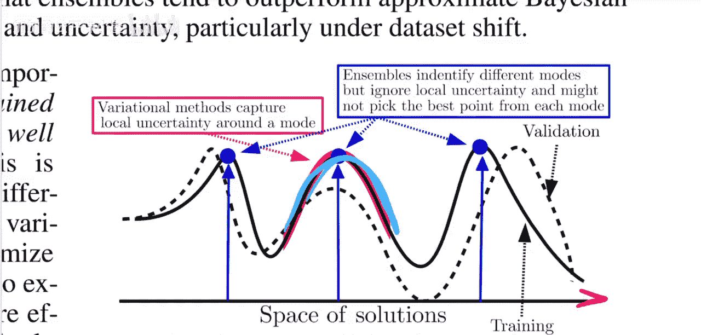

## 5：总结与意义

在本节课中，我们一起学习了《深度集成：从损失景观的视角解析》这篇论文。

我们首先回顾了深度集成的基本概念。然后，从损失景观的角度出发，理解了神经网络解空间中存在多个性能相近的局部最优模式。通过对比单一模型、贝叶斯近似和深度集成，我们发现深度集成通过其成员的随机初始化和独立优化，能够有效地捕捉到多个不同的模式，从而在整体上获得更好的泛化性能、不确定性估计和分布外鲁棒性。

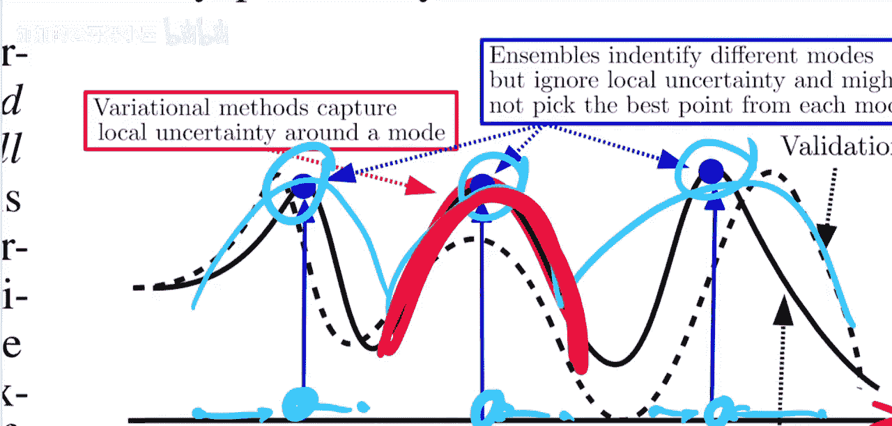

这篇论文的意义在于，它提供了一种解释性研究视角，帮助我们理解复杂模型内部的工作机制，而不仅仅是追求更高的性能指标。这种类型的研究对于推动深度学习理论发展具有重要意义。