# 062：论文解读

在本节课中，我们将学习一篇开创性的论文《Playing Atari with Deep Reinforcement Learning》。这篇论文首次将深度神经网络与强化学习成功结合，直接从高维像素输入中学习控制策略，开启了深度强化学习的新纪元。

## 论文背景与贡献

上一节我们介绍了论文的划时代意义。本节中，我们来看看论文摘要中具体阐述了哪些核心贡献。

论文摘要指出：“我们提出了第一个成功利用强化学习，直接从高维感官输入中学习控制策略的深度学习模型。该模型是一个卷积神经网络，使用Q学习的一个变体进行训练，其输入是原始像素，输出是估计未来奖励的价值函数。我们将该方法应用于街机学习环境中的7款雅达利2600游戏，无需调整架构或学习算法。我们发现，它在其中6款游戏上超越了所有先前方法，并在其中3款上超越了人类专家。”

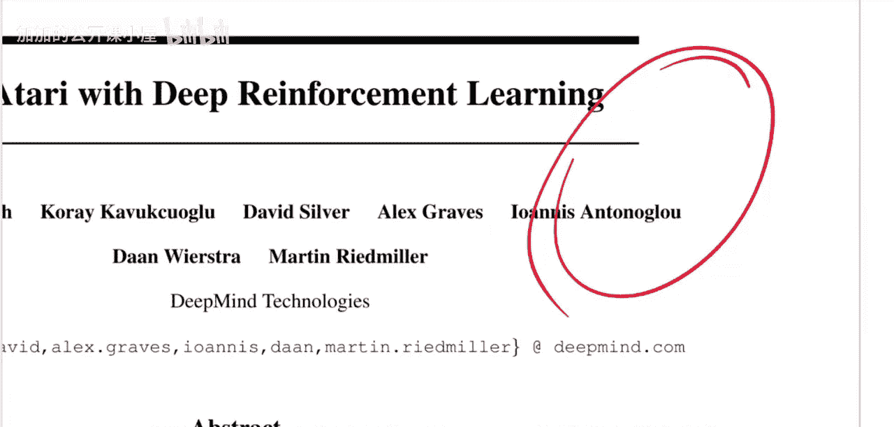

这段摘要信息量很大。首先，它明确了这是首个结合深度学习与强化学习、直接从像素学习策略的模型。其次，它强调了方法的通用性——**相同的模型架构和超参数**被应用于多款不同的游戏，无需针对每款游戏进行专门调整。

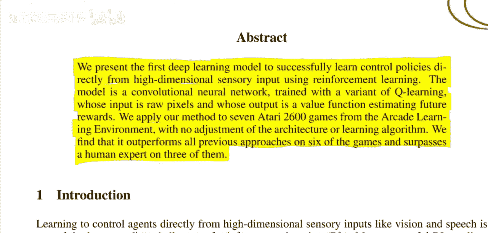

## 任务与环境：雅达利游戏

了解了论文的总体贡献后，我们来看看它所解决的具体问题：玩雅达利游戏。

雅达利2600游戏是经典的视频游戏。在街机学习环境中，智能体（Agent）的目标是通过操作手柄（包括方向移动和一个按钮，共约18个离散动作）来玩游戏，并最大化游戏得分（奖励）。

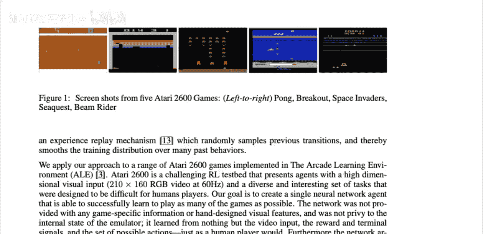

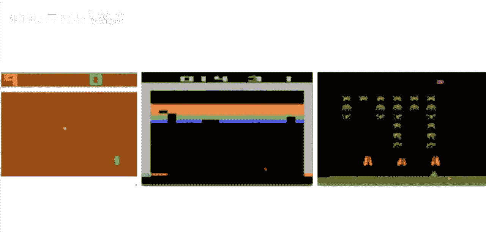

以下是任务的基本框架：
*   **环境**： 提供游戏画面（**观察**，即原始像素图像）。
*   **智能体**： 根据观察选择**动作**（如向左、向右、开火等）。
*   **奖励**： 环境根据智能体的动作和游戏规则反馈**奖励**（如击中砖块得分、失去生命扣分）。

这个过程会持续多个时间步，直到游戏结束（一个**回合**结束）。强化学习的核心挑战之一是**信用分配问题**：在可能长达数百步、奖励稀疏（并非每一步都有奖励）的回合中，如何确定哪些动作对最终获得的高分做出了贡献。这篇论文的突破在于，它证明了深度神经网络能够直接从像素中学习特征，并解决这个信用分配问题。

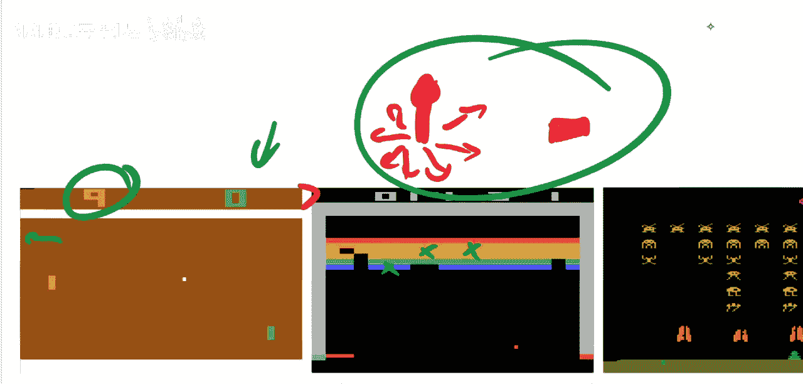

## 核心方法：深度Q网络

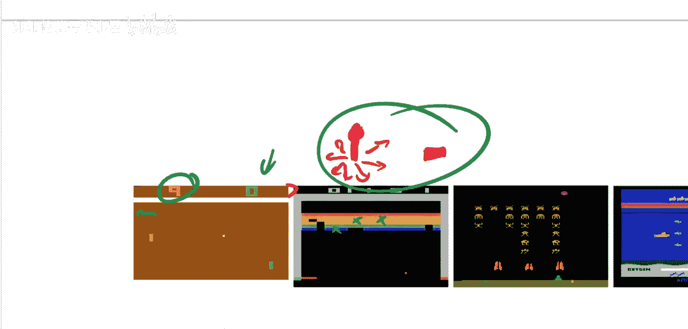

上一节我们明确了任务和挑战。本节中，我们来深入看看论文提出的解决方案：深度Q网络。

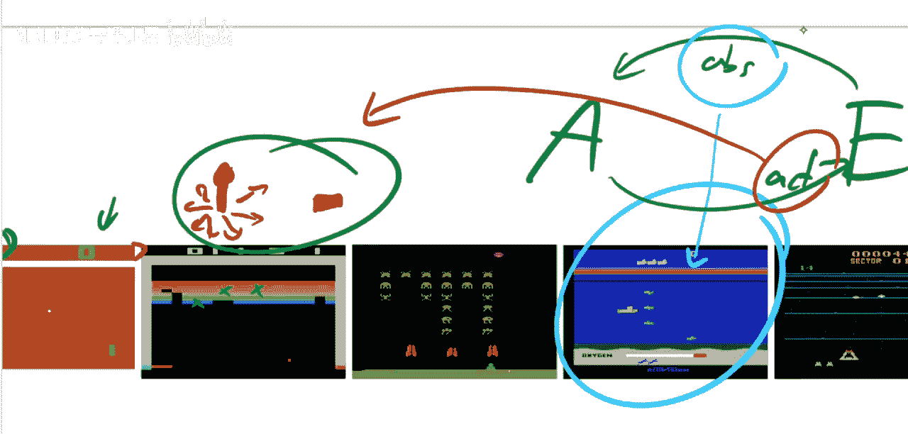

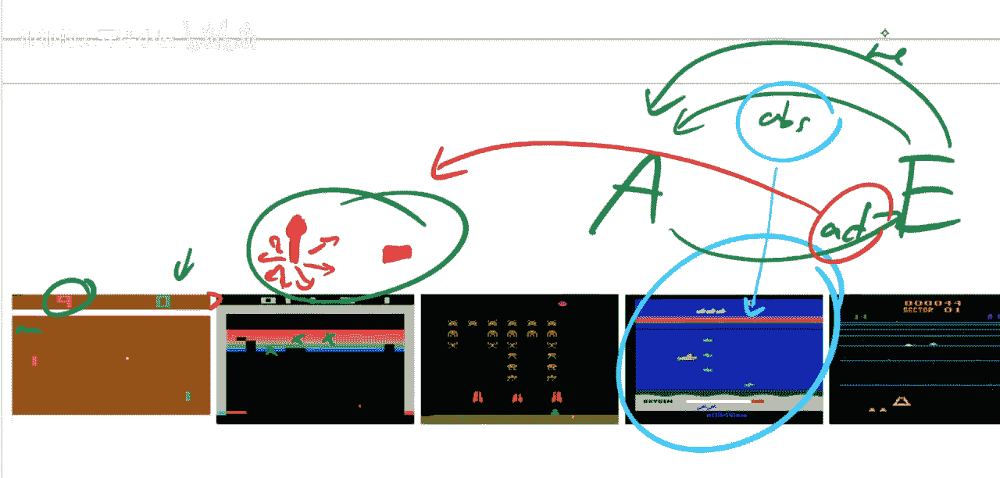

论文的核心是使用一个**卷积神经网络**来近似**Q函数**。Q学习是一种经典的强化学习算法。Q函数 `Q(s, a)` 表示在状态 `s` 下采取动作 `a` 后，所能获得的**预期累积未来奖励**。智能体的目标就是学习一个最优的Q函数，从而在任何状态下都能选择价值最高的动作。

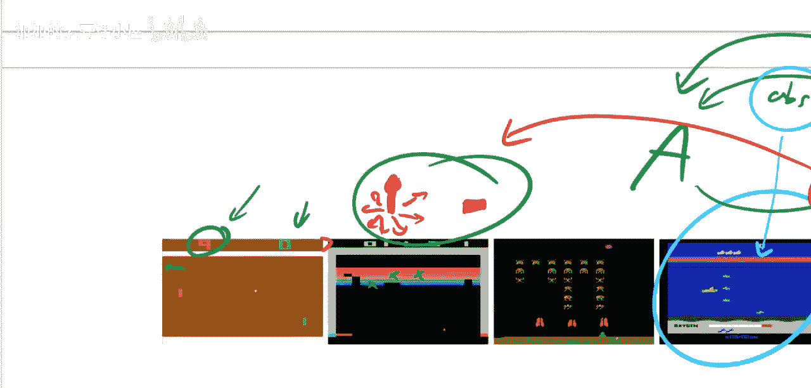

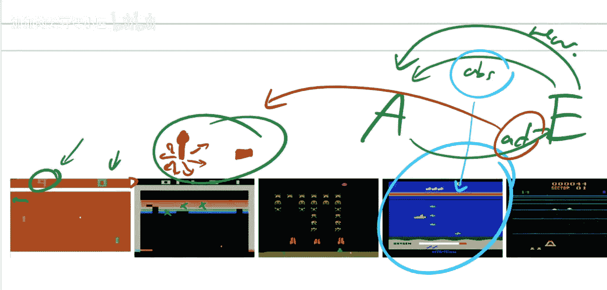

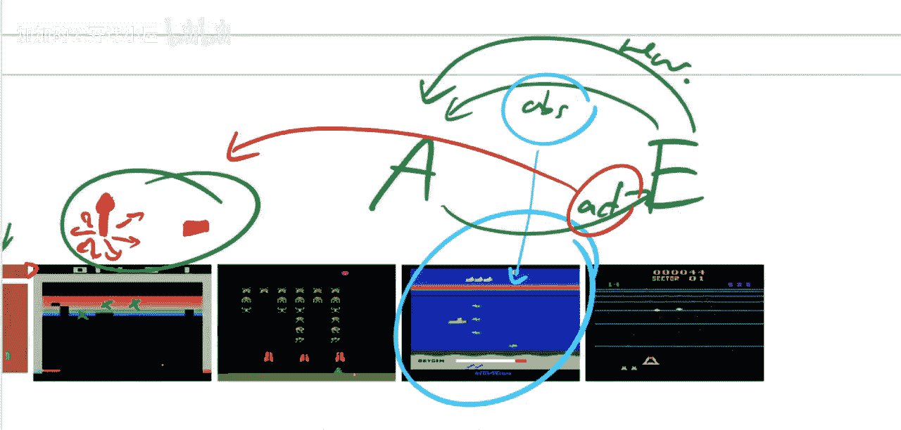

传统Q学习使用表格来记录每个状态-动作对的Q值，但这无法处理像图像这样高维连续的状态空间。本文的关键创新在于，用深度神经网络作为函数逼近器来估计Q值：`Q(s, a; θ) ≈ Q*(s, a)`，其中 `θ` 是神经网络的参数。

以下是模型输入输出的具体设计：
*   **输入**： 为了捕捉动态信息（如物体的速度），模型将最近4帧游戏画面堆叠起来作为输入状态 `s`。
*   **网络架构**： 一个卷积神经网络，用于从原始像素中提取特征。
*   **输出**： 网络为每个可能的动作 `a` 输出一个Q值，代表在该状态下选择该动作的预期价值。

智能体根据网络输出的Q值来选择动作（例如，使用ε-贪心策略：以大概率选择Q值最高的动作，以小概率随机探索）。

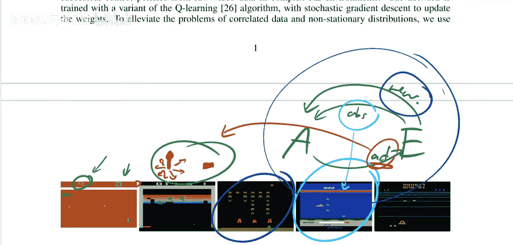

## 训练技巧与创新

仅仅将CNN与Q学习结合并不足以成功训练。论文作者引入了几个关键技巧来稳定训练过程，这些技巧后来成为深度强化学习的标准组件。

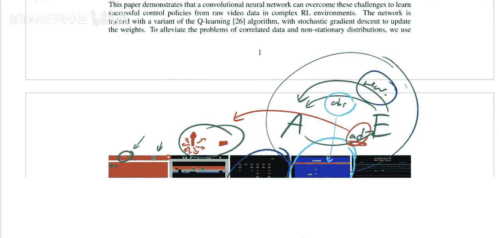

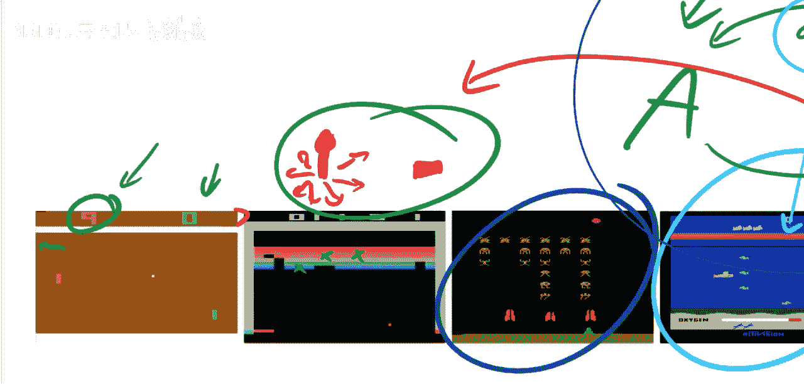

以下是稳定深度Q网络训练的核心创新：
1.  **经验回放**： 智能体将每一步的经历 `(s_t, a_t, r_t, s_{t+1})` 存储在一个**回放缓冲区**中。训练时，随机从缓冲区中采样小批量的经历，用于更新网络。这打破了数据间的时序相关性，使数据分布更平稳，极大地提高了学习效率。
2.  **目标网络**： 使用一个独立的、参数更新较慢的**目标网络**来计算Q学习更新中的目标值。这解决了在追逐一个移动目标时（因为目标值也依赖于正在被更新的网络参数）可能带来的训练不稳定问题。目标网络的参数 `θ-` 定期从在线网络 `θ` 复制。

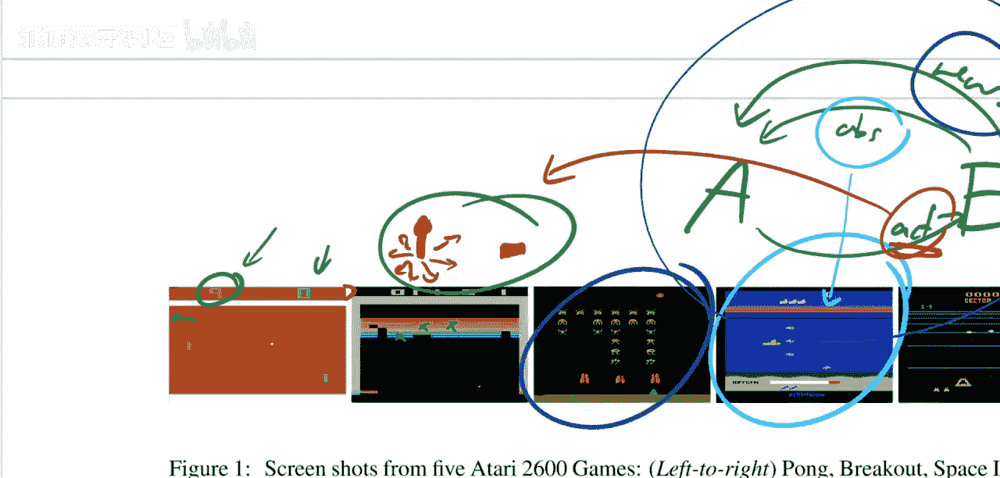

基于以上组件的Q值更新**损失函数**可以表示为：
`L(θ) = E_{(s,a,r,s')~D} [(r + γ * max_{a'} Q(s', a'; θ-) - Q(s, a; θ))^2]`
其中，`D` 是经验回放缓冲区，`γ` 是折扣因子，`θ-` 是目标网络的参数。

## 实验结果与意义

现在，我们来看看这个简单而强大的方法取得了怎样的效果。

论文在7款雅达利游戏上测试了深度Q网络。结果显示，在6款游戏上，它的表现超越了所有当时最先进的传统方法（这些方法通常依赖人工设计的特征）。更令人印象深刻的是，在3款游戏（《打砖块》、《乒乓》、《拳击》）上，智能体的得分甚至超过了专业人类测试者。

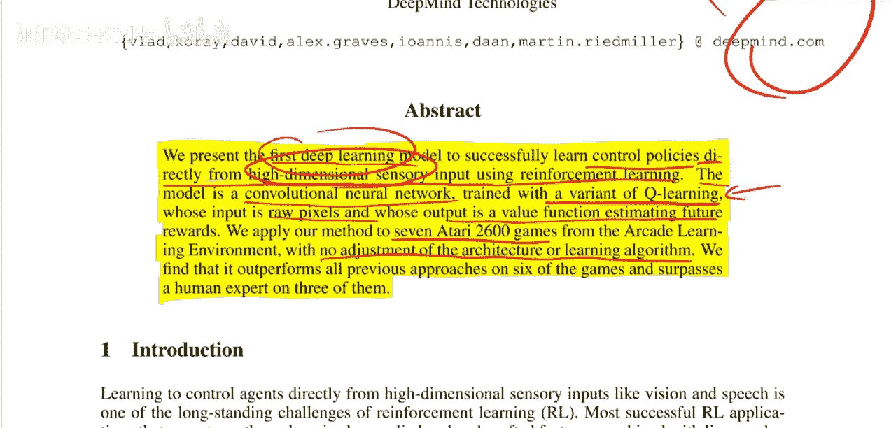

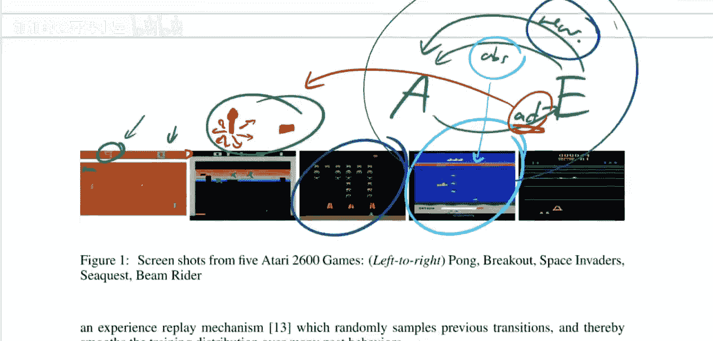

这一成功证明了深度神经网络具备从原始感官数据中自动学习有效特征表示的能力，并且可以与强化学习框架结合，解决复杂的决策问题。方法的通用性（一套超参数应对多款游戏）也暗示了深度强化学习作为一种通用学习机制的潜力。

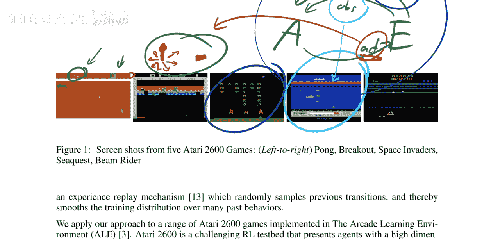

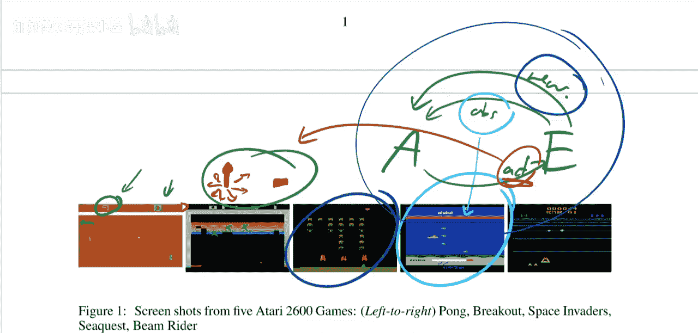

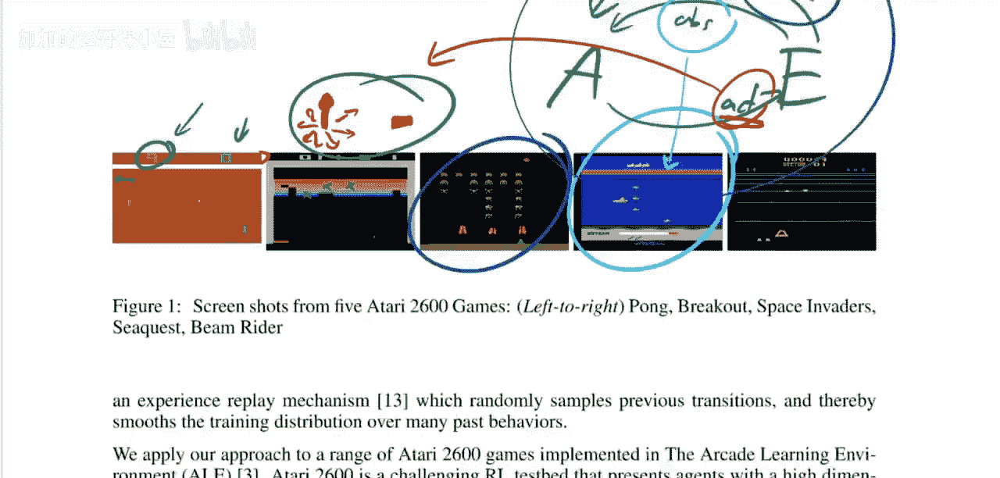

## 总结与展望

本节课中，我们一起学习了深度强化学习领域的奠基之作《Playing Atari with Deep Reinforcement Learning》。

我们回顾了论文如何将卷积神经网络与Q学习结合，提出了深度Q网络，并通过**经验回放**和**目标网络**等关键技巧解决了训练稳定性问题。该方法首次实现了直接从像素输入学习游戏策略，并在多个雅达利游戏上取得了超越传统方法和人类水平的成绩。

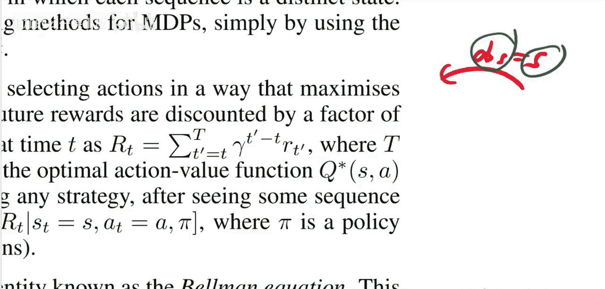

这篇论文的意义远不止于玩电子游戏。它标志着深度强化学习时代的开端，为后续从机器人控制到AlphaGo等一系列突破性研究铺平了道路。尽管后续研究提出了更多改进和更复杂的架构（如策略梯度方法、Actor-Critic框架等），但DQN的核心思想至今仍是深度强化学习入门和理解的基础。正如视频作者所言，强化学习的故事，由此才刚刚开始。