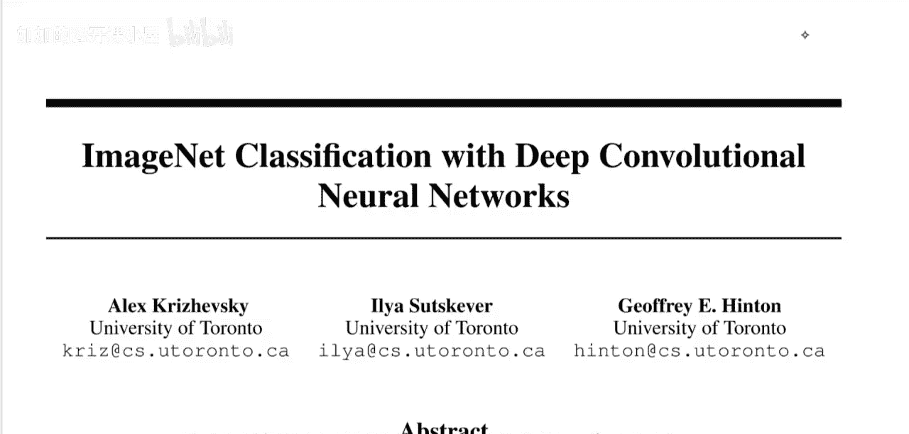
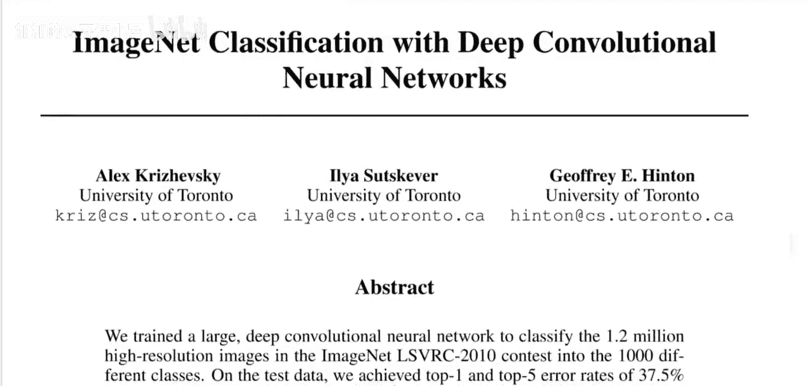
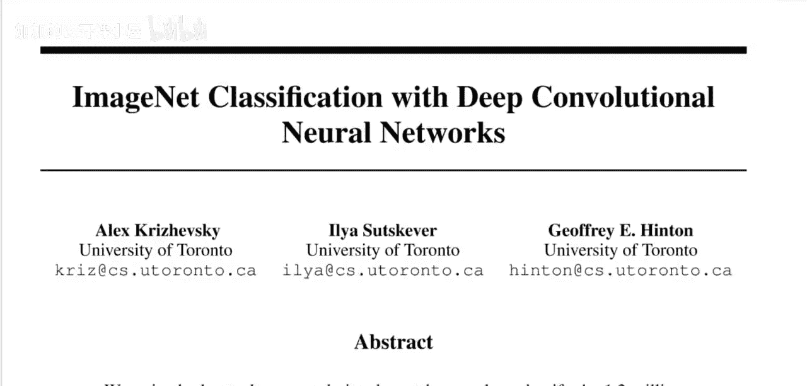
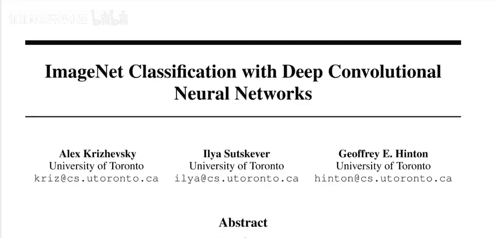

# 063：使用深度卷积神经网络进行ImageNet分类（论文详解）

## 概述





在本节课中，我们将学习一篇开创性的论文——《使用深度卷积神经网络进行ImageNet分类》，即著名的AlexNet。这篇论文在2012年ImageNet竞赛中以巨大优势获胜，并被认为是深度学习革命的重要起点。我们将解析论文的核心思想、网络架构设计以及当时为解决关键问题（如过拟合）所采用的技术。

---





## 论文背景与核心论点

上一节我们概述了本课程的目标。本节中，我们来看看这篇论文诞生的背景及其核心论点。

论文指出，当时的物体识别方法主要依赖于机器学习。为了提升性能，需要更大的数据集、更强大的模型以及更好的防止过拟合技术。然而，在AlexNet之前，像CIFAR-10这样的小型数据集（数万张32x32像素图像）是主流，而真实场景中的物体识别需要处理更大的图像和更复杂的变化。

ImageNet数据集应运而生，它包含超过1500万张高分辨率图像，涵盖22000多个类别。我们通常讨论的ImageNet竞赛实际上只使用了其子集（约1000个类别，120万张图像）。论文认为，要从数百万张图像中学习识别数千个物体，需要一个具有强大学习能力的模型。

但即使数据量如此庞大，物体识别任务的复杂性也意味着数据本身仍不足以完全定义问题。因此，模型还需要融入大量的**先验知识**来弥补数据的不足。卷积神经网络（CNN）正是这样一类模型。其能力可以通过调整深度和宽度来控制，并且它基于两个关于图像本质的强假设：**统计特性的平稳性**和**像素依赖的局部性**。这使得CNN非常适合计算机视觉任务，尽管在当时这一点并不像今天这样显而易见。

---

## 挑战与解决方案：GPU与过拟合

上一节我们介绍了CNN作为强大先验模型的优势。本节中我们来看看论文当时面临的主要挑战及解决方案。

尽管CNN具有吸引人的特性和相对高效的局部架构，但将其应用于大规模高分辨率图像的计算成本在当时是令人望而却步的。幸运的是，**GPU**的出现与高度优化的二维卷积实现，使得训练大型CNN成为可能。同时，ImageNet等大数据集提供了足够的标注样本，有助于在没有严重过拟合的情况下训练此类模型。

在当时，过拟合是机器学习研究者最关心的问题之一。论文中采用了许多技术来防止过拟合，例如**数据增强**。虽然当时将其主要目的解释为防止过拟合，但如今我们理解，数据增强可能更多地起到了**平滑决策函数**、提升模型泛化能力的作用。这反映了从经典机器学习（如SVM）视角到深度学习视角的转变。

论文的一个主要贡献正是展示了如何将CNN训练与GPU计算相结合，这极大地加速了训练过程，使得训练大型神经网络成为现实。

---

## 网络架构与关键技术细节

上一节我们讨论了利用GPU解决计算瓶颈和过拟合问题。本节中，我们将深入AlexNet的具体架构和关键技术。

以下是AlexNet架构的核心组成部分与设计要点：

1.  **输入与预处理**：网络输入为224x224的RGB图像。论文进行了**数据标准化**处理。
2.  **卷积层**：网络包含5个卷积层。部分卷积层后接有**最大池化**层进行下采样。论文使用了**ReLU**作为激活函数，这比传统的tanh或sigmoid函数训练速度更快。
3.  **全连接层**：在卷积层之后是3个全连接层。最后一个全连接层的输出通过**softmax**函数产生1000个类别的概率分布。
4.  **局部响应归一化**：在某些层后使用了LRN，旨在模仿生物神经系统的侧抑制机制，以增强模型的泛化能力。其公式近似为：
    `b_{x,y}^i = a_{x,y}^i / (k + α * Σ_{j=max(0, i-n/2)}^{min(N-1, i+n/2)} (a_{x,y}^j)^2)^β`
    其中`a`是激活值，`b`是归一化后的输出，`N`是该层的总通道数，`n`是局部归一化范围，`k, α, β`是超参数。
5.  **重叠池化**：论文采用了步长小于池化窗口大小的池化操作，这有助于提升模型性能并减少过拟合。
6.  **Dropout**：在前两个全连接层中使用了Dropout技术，随机丢弃一部分神经元，这是防止过拟合非常有效的手段。在代码中通常实现为：
    ```python
    # 训练阶段
    mask = (torch.rand(x.shape) > dropout_rate).float()
    x = x * mask / (1 - dropout_rate) # 缩放保持期望值
    # 测试阶段
    # x = x (不使用dropout)
    ```

---

## 总结

本节课中我们一起学习了AlexNet这篇深度学习领域的里程碑论文。我们回顾了其历史背景，理解了论文关于**大数据需要大模型**，同时模型需要**强先验知识**的核心论点。我们分析了当时面临的**计算成本**和**过拟合**挑战，以及通过**GPU加速**、**ReLU激活函数**、**数据增强**、**Dropout**等关键技术如何克服这些挑战。最后，我们详细解析了AlexNet的网络架构，包括其卷积层、池化策略和归一化技术。这篇论文不仅赢得了竞赛，更重要的是为后续的深度学习研究奠定了坚实的基础，其许多设计思想至今仍影响着计算机视觉模型的发展。