# 064：引言与核心思想 🎯

在本节课中，我们将一起学习生成对抗网络的奠基性论文。我们将从论文的背景和核心思想入手，理解这个开创性框架的基本原理。

生成对抗网络是Ian Goodfellow等人在2014年提出的一个用于估计生成模型的新框架。该论文开启了一个至今仍在蓬勃发展的研究方向，对深度学习领域产生了深远影响。

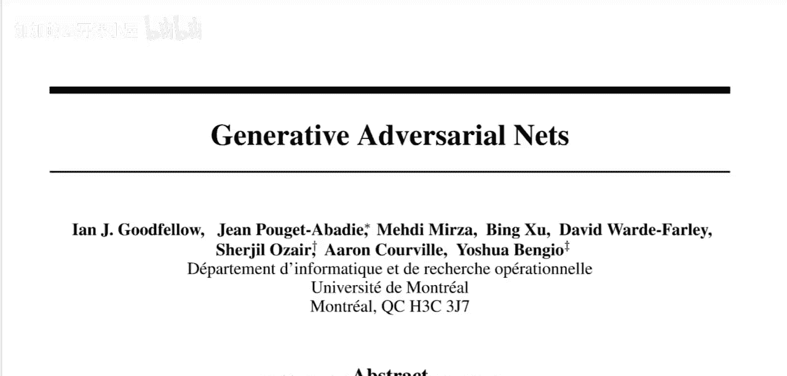

上一节我们介绍了论文的背景和影响力，本节中我们来看看论文摘要部分阐述的核心思想。

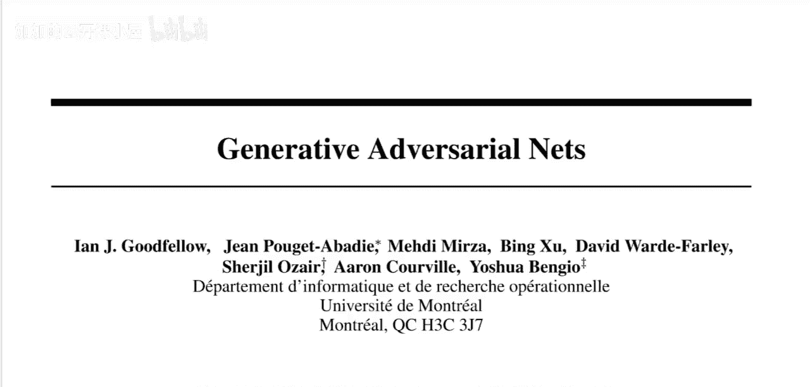

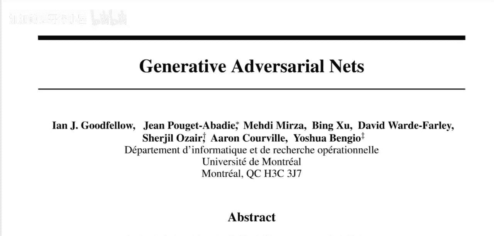

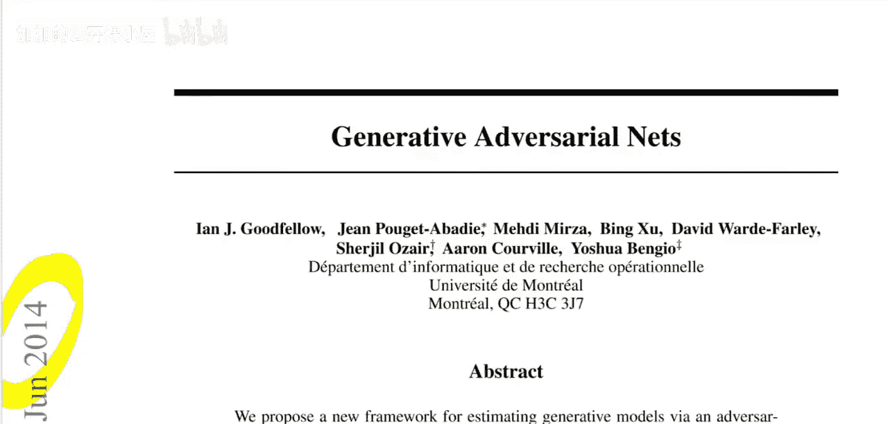

论文摘要指出，他们通过一个对抗过程来估计生成模型。该过程同时训练两个模型：一个生成模型G用于捕捉数据分布，以及一个判别模型D用于估计样本来自训练数据而非G的概率。这是一种在当时具有创新性的思路。

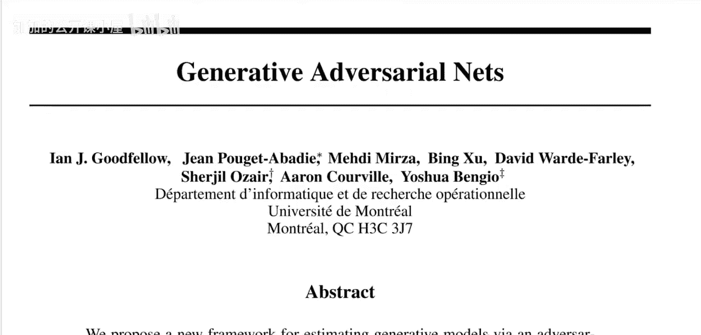

以下是摘要中强调的几个关键点：
*   该框架对应一个**两人零和博弈**。
*   在任意函数G和D的空间中，存在一个唯一解，其中G能恢复训练数据分布，且D处处等于1/2。
*   当G和D由多层感知器定义时，整个系统可以通过反向传播进行训练。
*   该方法在训练或生成样本时，**不需要任何马尔可夫链或展开的近似推理网络**，这使其比当时的其他生成模型方法更简单。

---

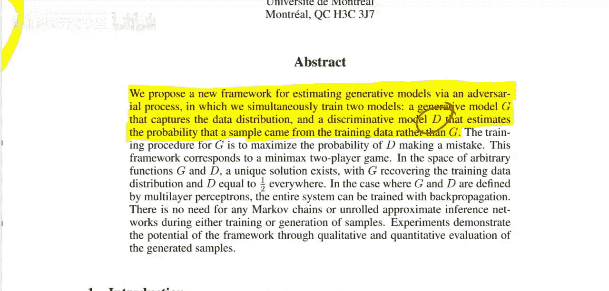

# 生成对抗网络精讲：2：与传统方法的对比 🤔

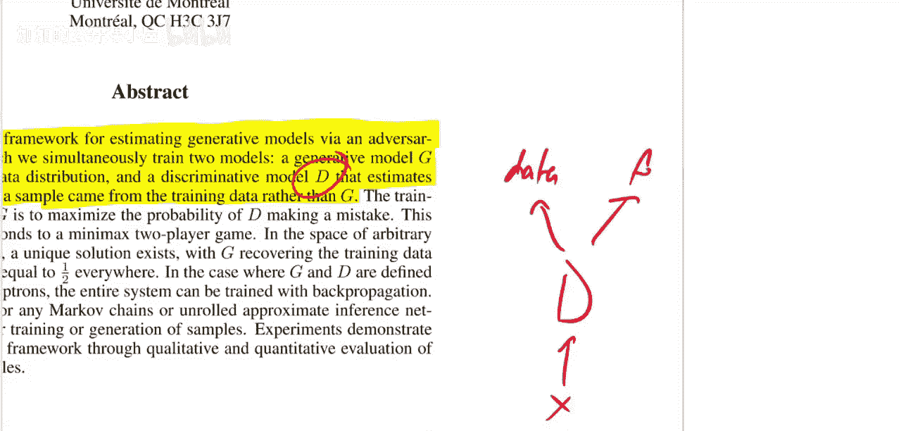

上一节我们了解了GAN的基本框架是一个生成器与判别器的对抗游戏。本节中，我们来探讨这一思想为何在当时是新颖的，以及它与传统生成模型方法的根本区别。

在GAN提出之前，图像生成领域并没有一个能产生高质量结果的满意方法。诸如深度信念网络等方法都存在各自的问题。当时，研究者们已经知道如何构建非常出色的图像分类器（例如自AlexNet以来），但生成模型的发展却相对滞后。

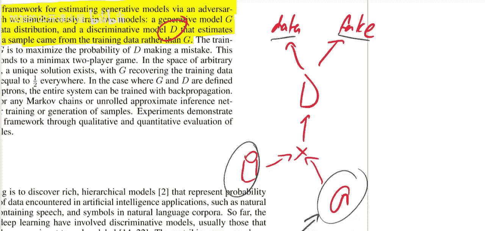

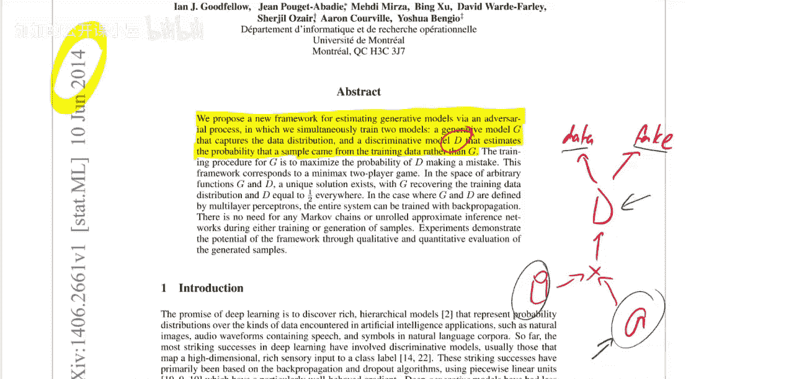

GAN的核心洞见在于：与其直接学习如何构建一个好的生成器，不如利用我们已知的、强大的判别模型（分类器）的能力来训练生成器。这是一种思维范式的转变。

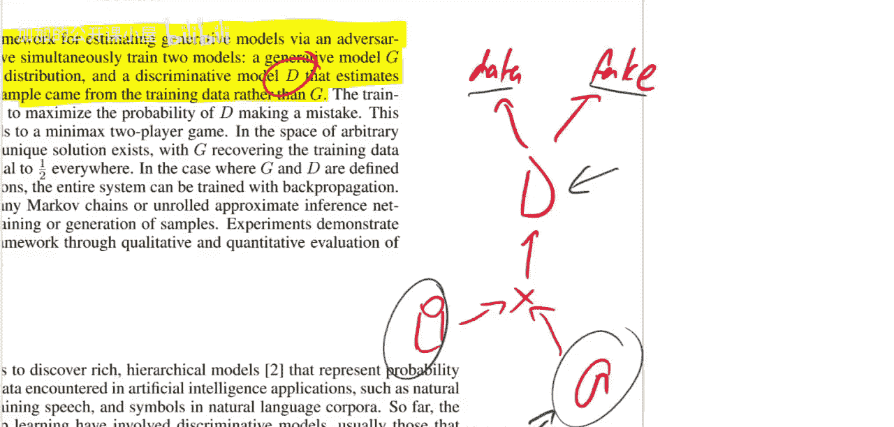

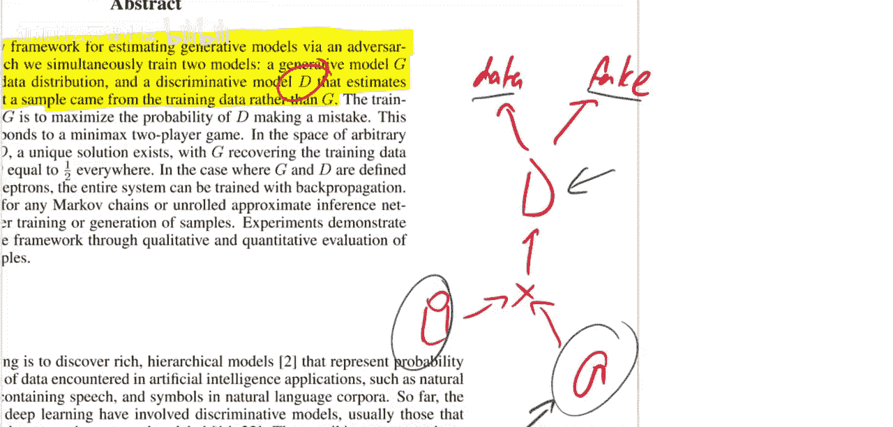

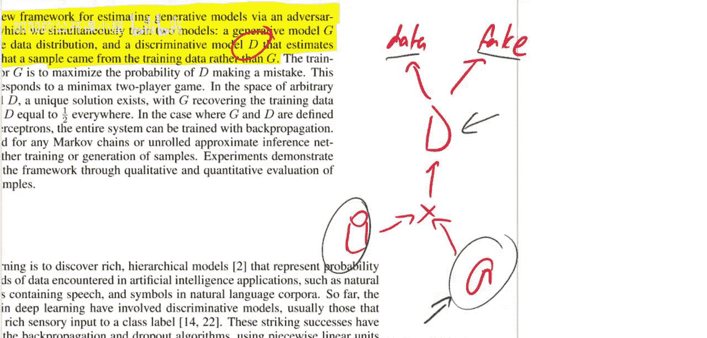

在传统的自编码器中，模型通过最小化输入与重构输出之间的差异来直接学习数据。生成过程通常依赖于在瓶颈处采样，并可能涉及复杂的推理过程。而GAN的哲学是，生成器的任务不再是直接匹配任何数据点，而是生成能够“欺骗”判别器、让其误以为是真实数据的样本。

以下是这种区别的直观对比：
*   **传统方法（如自编码器）**：数据 → 编码 → 解码 → 与原始数据比较损失 → 更新模型。生成器**直接**受到数据信号的监督。
*   **GAN方法**：噪声 → 生成器 → 生成样本 → 判别器判断真伪 → 误差通过判别器**反向传播**至生成器。生成器受到的是来自判别器的、间接的、“对抗性”的监督。

这种间接的对抗训练机制，是GAN成功的关键，也是其创新性所在。论文花费相当篇幅从理论层面论证这种方法是严谨有效的，旨在说服当时可能持怀疑态度的读者。

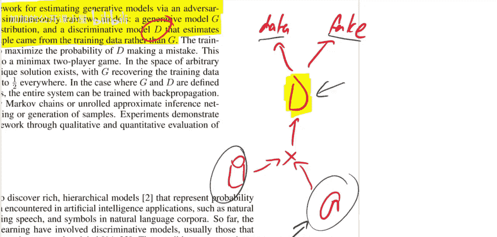

---

# 生成对抗网络精讲：3：价值函数与训练目标 ⚖️

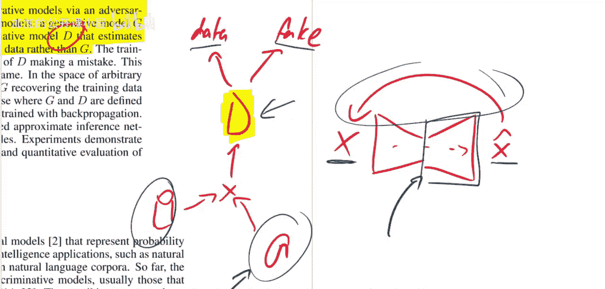

上一节我们理解了GAN通过对抗机制进行间接训练的核心思想。本节中，我们具体来看驱动这个对抗游戏的价值函数，即损失函数。

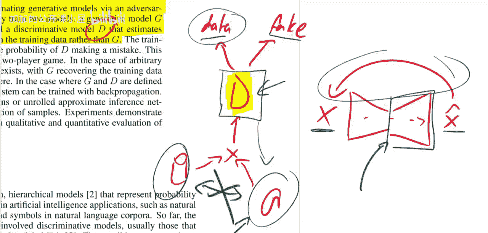

论文明确指出，生成器G和判别器D在进行一个两人极小极大博弈，其价值函数V(G, D)定义如下：

**公式：**
`min_G max_D V(D, G) = E_(x~p_data(x))[log D(x)] + E_(z~p_z(z))[log(1 - D(G(z)))]`

让我们来分解这个公式：
*   `D(x)`：判别器估计样本x来自真实数据分布的概率。
*   `G(z)`：生成器将先验噪声变量z（例如从均匀或正态分布中采样）映射到数据空间，生成一个样本。
*   `E_(x~p_data(x))[log D(x)]`：这是判别器关于真实数据的期望损失。判别器D希望**最大化**这个值，即尽可能将真实样本判为“真”（D(x)接近1）。
*   `E_(z~p_z(z))[log(1 - D(G(z)))]`：这是判别器关于生成数据的期望损失。对于生成样本G(z)，判别器希望**最大化**这个值，即尽可能将其判为“假”（D(G(z))接近0）。相反，生成器G希望**最小化**这个值，即希望判别器将生成样本误判为“真”（D(G(z))接近1）。

因此，这个公式定义了一个对抗目标：
*   **判别器D的目标**：**最大化**V(D, G)，即最大化区分真实与生成样本的能力。
*   **生成器G的目标**：**最小化**V(D, G)，即最小化判别器做出正确判断的能力（等价于最大化判别器犯错的概率）。

训练过程就是在交替优化这两个目标：先固定G，训练D以更好地区分；再固定D，训练G以更好地欺骗D。这种动态平衡最终驱使生成器产生足以乱真的样本，而判别器则无法有效区分，其判断准确率理论上会趋近于50%（即随机猜测）。

---

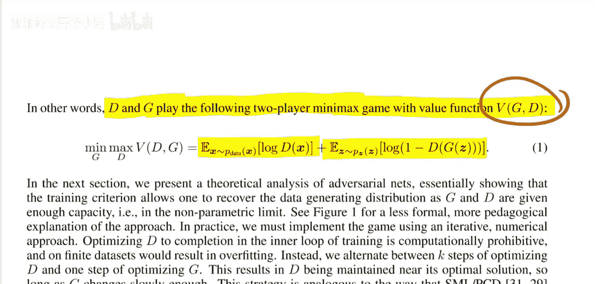

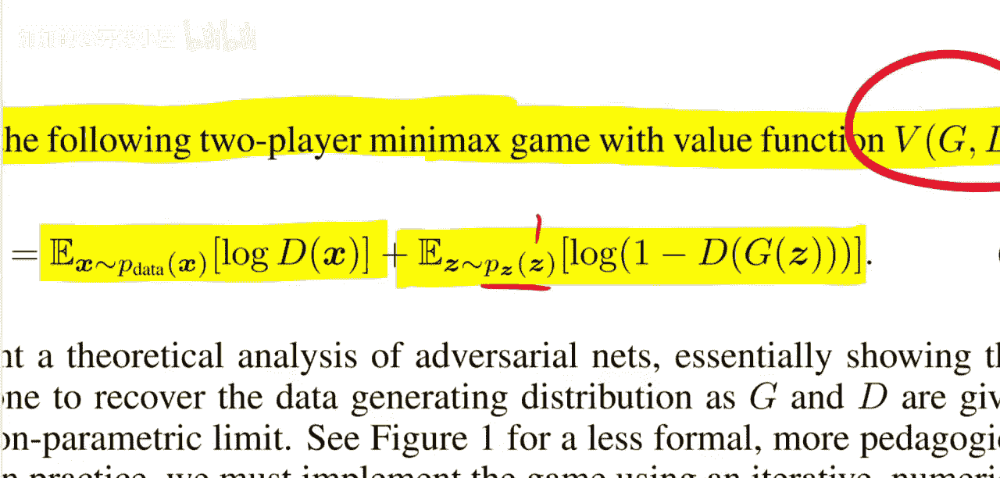

本节课中我们一起学习了生成对抗网络奠基论文的核心内容。我们首先回顾了其历史背景与影响力，然后深入探讨了其利用判别器间接训练生成器的创新思想，并与传统方法进行了对比。最后，我们解析了驱动整个对抗训练过程的极小极大价值函数，明确了生成器与判别器的优化目标。这篇论文不仅提出了一个强大的框架，其严谨的理论阐述也为后续研究奠定了坚实基础。