# 066：用于图像识别的深度残差学习（ResNet）🚀

在本节课中，我们将学习一篇深度学习领域的里程碑式论文——《用于图像识别的深度残差学习》（Deep Residual Learning for Image Recognition）。这篇由何恺明等人于2015年发表的论文，不仅彻底改变了图像识别领域，其提出的残差连接思想也成为了现代神经网络架构（包括Transformer）中无处不在的核心组件。我们将探讨当时研究者面临的“网络深度增加，性能反而下降”的难题，并详细解析残差网络（ResNet）是如何巧妙地解决这一问题的。

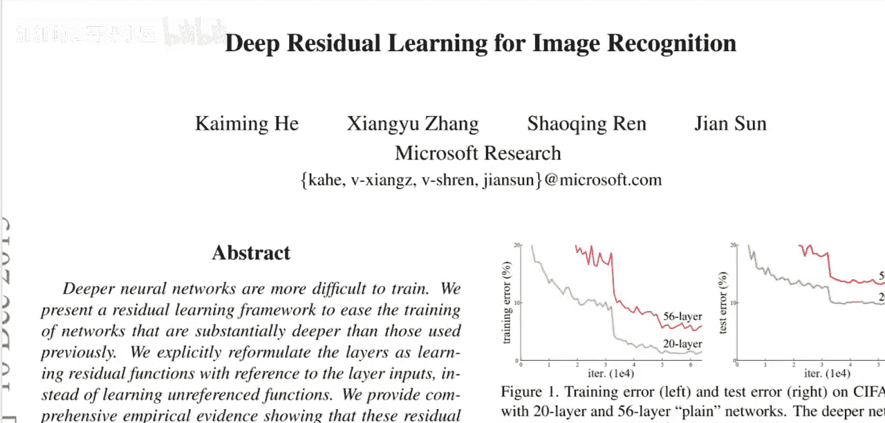

## 背景与问题：深度网络的优化困境 🔍

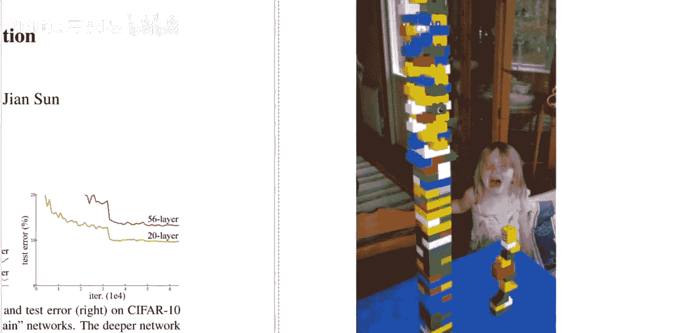

上一节我们提到了ResNet的巨大影响力。本节中，我们来看看这篇论文诞生的具体背景和它要解决的核心问题。

在ResNet出现之前，研究者们普遍认为增加神经网络的深度可以提升其性能，使其具有更强的表达能力和泛化能力。然而，在实践中，人们观察到一个反常现象：当网络层数增加到一定程度后，继续加深网络不仅没有提升性能，反而导致**训练误差和测试误差同时上升**。

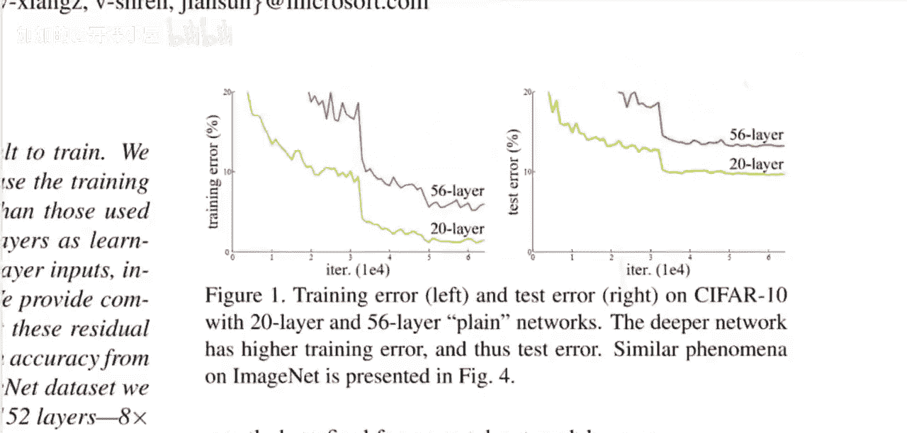

这并非过拟合问题。因为过拟合的典型表现是训练误差很低而测试误差很高。这里的“性能退化”现象表明，问题出在**优化难度**上，而非模型容量过大。

当时的网络架构（如VGGNet）遵循一个设计范式：通过堆叠卷积层，在逐步降低图像空间分辨率的同时，增加通道数（滤波器数量）。其背后的假设是，底层网络学习边缘等局部特征，其位置信息很重要；而高层网络学习更抽象的组合特征（如“车轮”、“车身”），其精确位置变得相对次要。

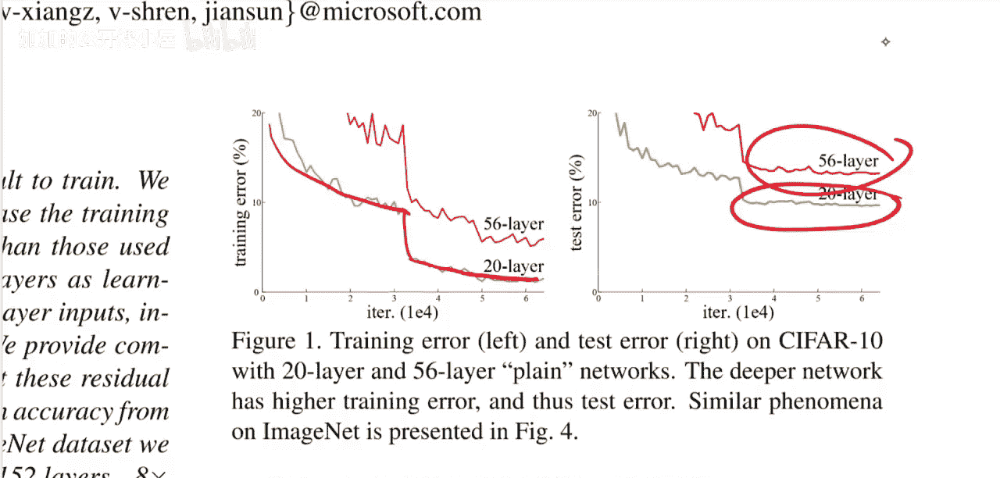
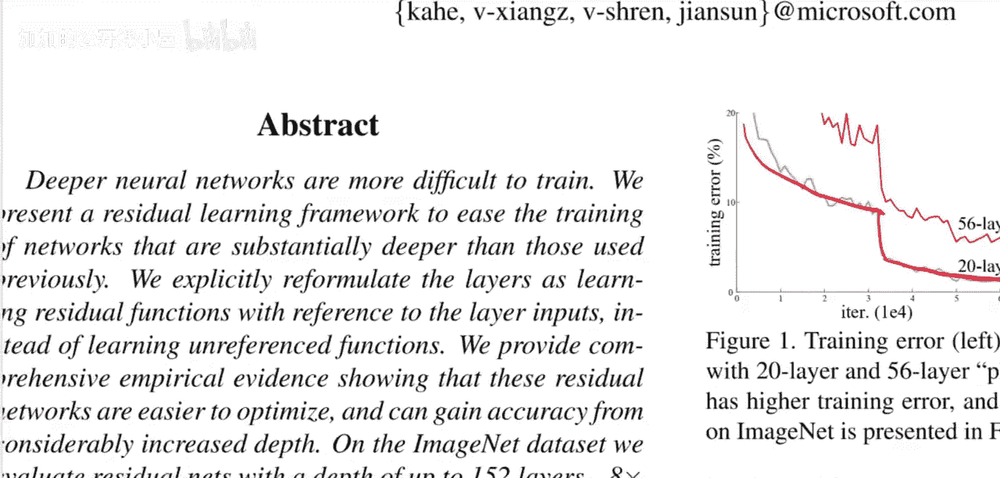


那么，为什么简单地堆叠更多这样的层（例如，将一组卷积层复制一份）会导致网络性能变差呢？

## 核心洞察：恒等映射的构建性存在 🧠

上一节我们明确了深度网络优化难的问题。本节中，我们来看看论文提出的一个关键逻辑推理。


论文提出了一个深刻的见解：对于一个较浅的网络及其对应的、层数更多的深层网络，**存在一个构建性的解**。


具体推理如下：
1.  假设我们有一个训练好的浅层网络。
2.  现在我们构建一个更深的网络，它是在浅层网络的基础上额外添加了一些层。
3.  如果这些额外添加的层能够被学习为**恒等映射**（Identity Mapping），即输出等于输入，那么整个深层网络的性能至少应该与浅层网络一样好。

这意味着，从理论上讲，深层网络不应该比浅层网络表现更差，因为它至少可以“退化”成浅层网络的样子。既然在实践中观察到了退化，那就说明问题在于**优化器很难让这些额外的层学会简单的恒等映射**。

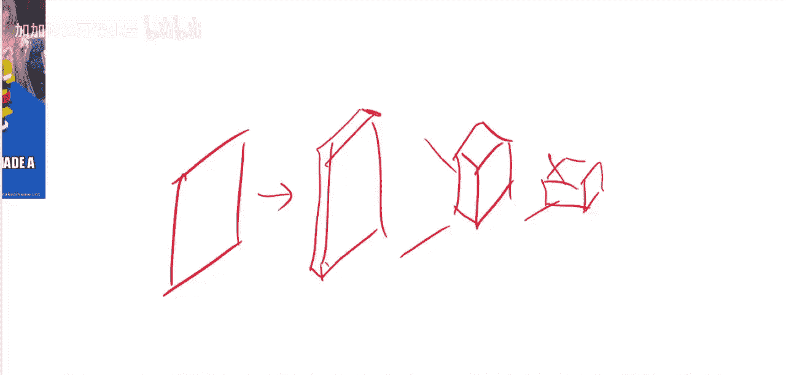


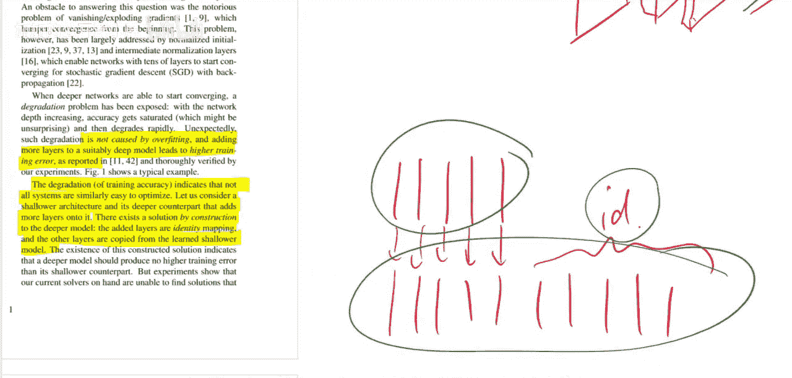

为什么学习恒等映射这么难？因为当时常用的权重初始化方法（如从均值为0的高斯分布中采样）和正则化技术（如L2权重衰减）都倾向于将权重推向零。对于网络来说，学习一个全零函数比学习一个精确的恒等映射要容易得多。一个3x3卷积核要学习成中心为1、周围为0的恒等滤波器，需要精确调整9个参数，这并非易事。

## 解决方案：残差学习与快捷连接 ⚙️

上一节我们分析了问题根源在于学习恒等映射的困难。本节中，我们来看看ResNet是如何通过改变网络结构来优雅地解决这个问题的。

既然让网络层直接学习恒等映射 `H(x) = x` 很困难，论文提出了一个巧妙的思路：**重新定义学习目标**。

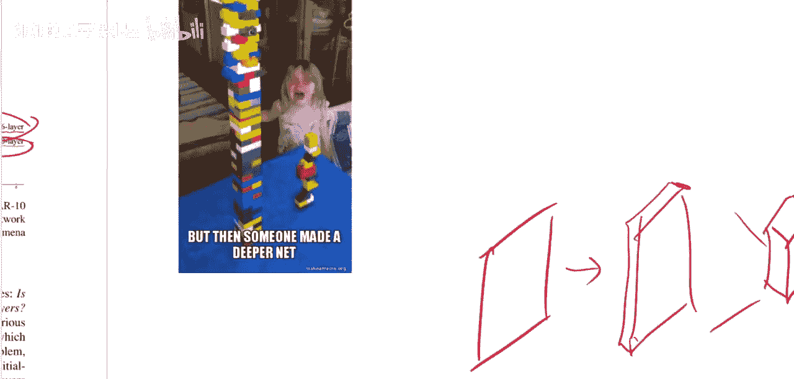

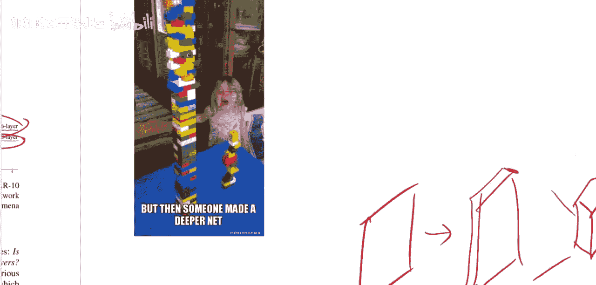

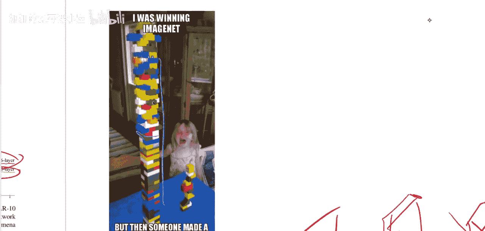

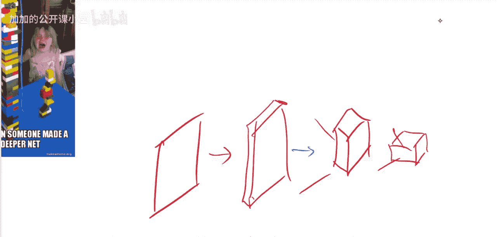

我们不要求堆叠的层直接拟合一个潜在的映射 `H(x)`，而是让它们拟合**残差函数** `F(x) = H(x) - x`。这样，原始的映射就被重构为 `H(x) = F(x) + x`。

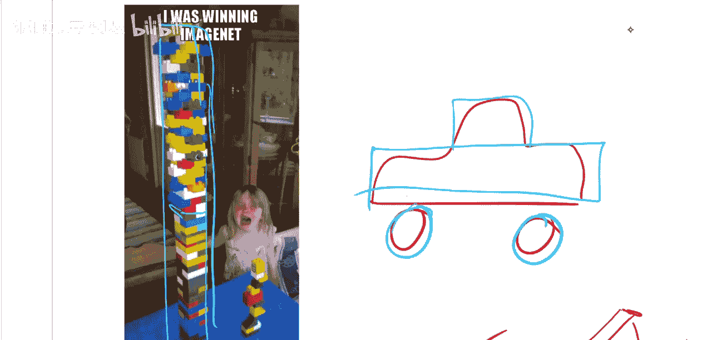

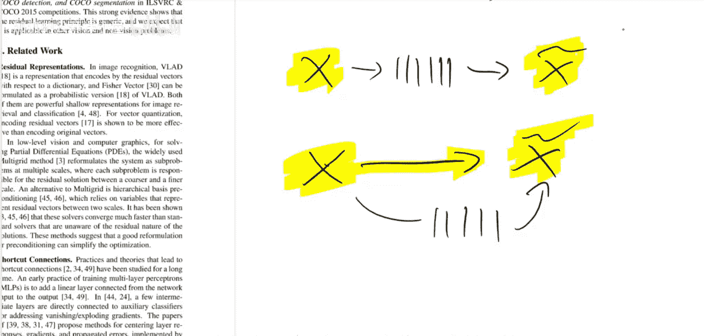

这个重构带来了一个巨大的优势：**将恒等映射设置为默认状态**。如果某一层或多层没有学到有用的特征（即 `F(x)` 趋近于0），那么输出 `H(x)` 就自然趋近于输入 `x`，这正是一个恒等映射。网络不再需要“费力”地让权重去学习恒等映射，而是默认就能实现它。网络只需要去学习相对于输入的“微小扰动” `F(x)` 即可。

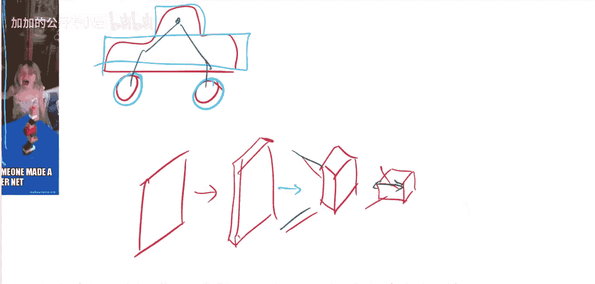

在实现上，这通过**快捷连接**（Shortcut Connection）或**跳跃连接**（Skip Connection）来完成。输入 `x` 直接绕过一层或多层网络，与这些层的输出 `F(x)` 进行逐元素相加。

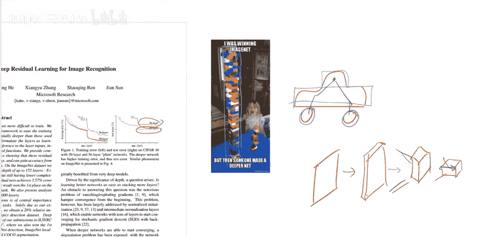

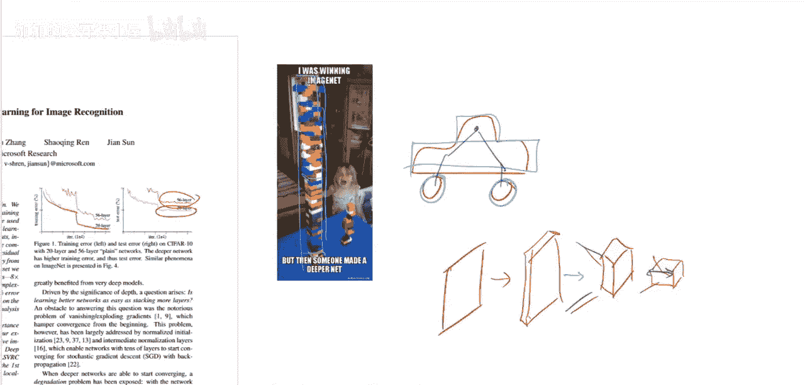

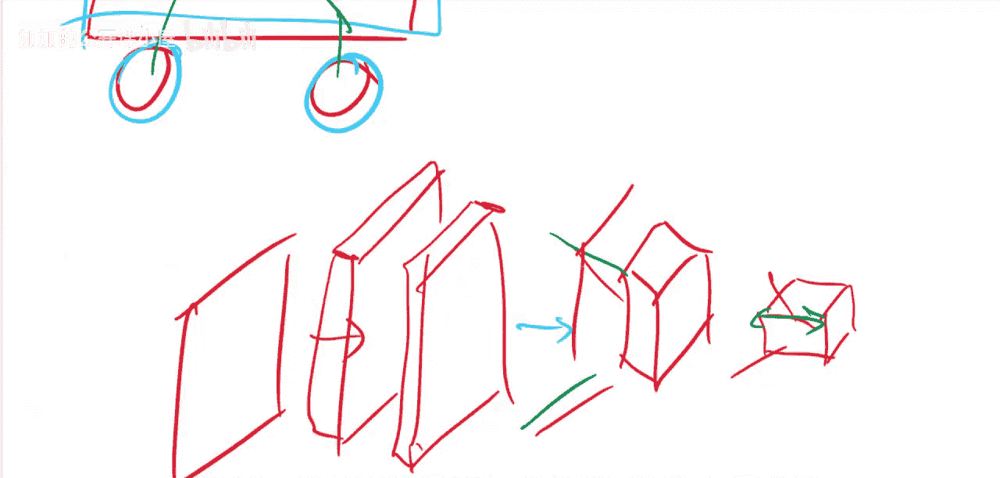

以下是残差块的核心公式和概念代码描述：

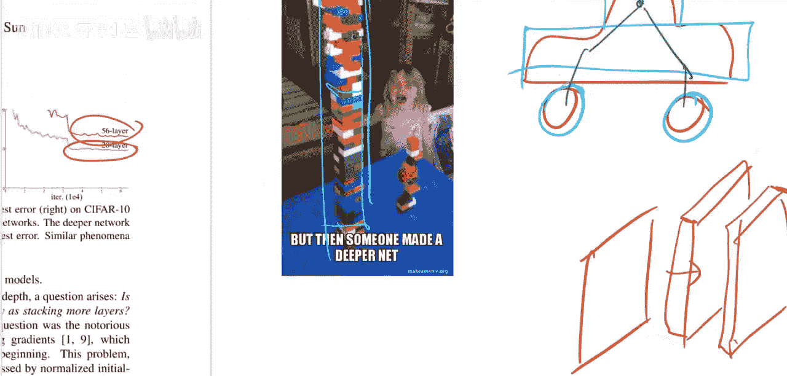

**公式定义：**
`y = F(x, {W_i}) + x`
其中：
*   `x` 和 `y` 是残差块的输入和输出向量。
*   `F(x, {W_i})` 代表需要学习的残差映射。例如，对于两层网络：`F = W_2 * σ(W_1 * x)`，其中 `σ` 代表ReLU激活函数。
*   `+ x` 操作代表快捷连接，它不引入额外参数或计算复杂度。

**概念代码（PyTorch风格）：**
```python
import torch.nn as nn
import torch.nn.functional as F

class ResidualBlock(nn.Module):
    def __init__(self, in_channels, out_channels, stride=1):
        super().__init__()
        self.conv1 = nn.Conv2d(in_channels, out_channels, kernel_size=3, stride=stride, padding=1)
        self.bn1 = nn.BatchNorm2d(out_channels)
        self.conv2 = nn.Conv2d(out_channels, out_channels, kernel_size=3, stride=1, padding=1)
        self.bn2 = nn.BatchNorm2d(out_channels)

        # 如果输入输出维度不一致（如经过下采样），快捷连接需要一个1x1卷积进行投影
        self.shortcut = nn.Sequential()
        if stride != 1 or in_channels != out_channels:
            self.shortcut = nn.Sequential(
                nn.Conv2d(in_channels, out_channels, kernel_size=1, stride=stride),
                nn.BatchNorm2d(out_channels)
            )

    def forward(self, x):
        identity = x # 保存输入用于快捷连接
        out = F.relu(self.bn1(self.conv1(x)))
        out = self.bn2(self.conv2(out))
        out += self.shortcut(identity) # 残差连接：F(x) + x
        out = F.relu(out)
        return out
```

这种设计带来了革命性的好处：它极大地缓解了深度网络中的梯度消失/爆炸问题，使得训练成百上千层的网络成为可能。当梯度通过快捷连接反向传播时，它可以直接、无损地流向更浅的层，确保了深层网络的可训练性。

## 网络架构与实验结果 📊


上一节我们介绍了残差块的核心设计。本节中，我们来看看基于该设计构建的完整ResNet架构及其惊人的实验结果。

论文基于VGGNet的设计哲学，构建了多个深度的ResNet（如34层、50层、101层、152层）。其核心是用**残差块**替换了原先的普通卷积层堆叠。

以下是ResNet-34与普通VGG风格网络的对比示意图。可以看到，ResNet通过大量的快捷连接（图中的曲线）构建了“高速公路”，让信息可以跨层流动。

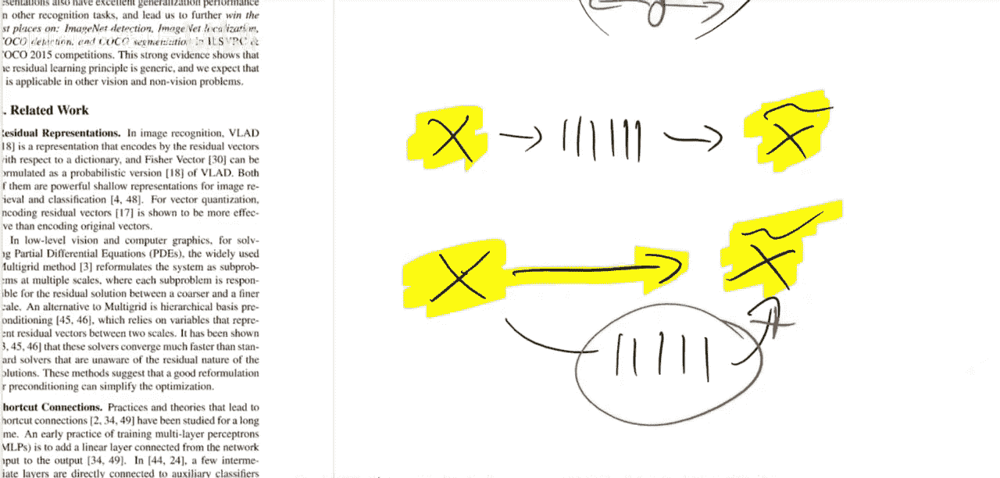

实验结果令人震撼：
*   **成功训练了极深的网络**：ResNet成功训练了高达152层的网络，这在此前是无法想象的。
*   **性能大幅提升**：在ImageNet数据集上，ResNet-152将top-5错误率降低到了惊人的**3.57%**，以巨大优势赢得了ILSVRC 2015分类任务冠军。
*   **解决了退化问题**：如下图所示，带有残差连接的深层网络（实线）其训练误差始终低于对应的浅层网络，并且随着深度增加持续下降，彻底解决了之前的性能退化问题。


*（网络梗图生动地反映了当时的情况：“我正在赢得ImageNet，然后有人搞出了一个更深的网络。”）*

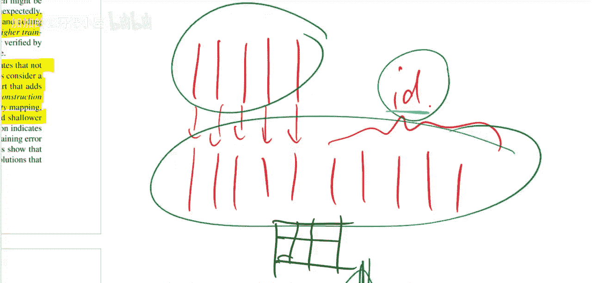

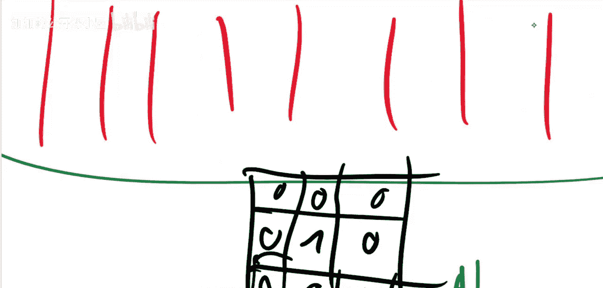

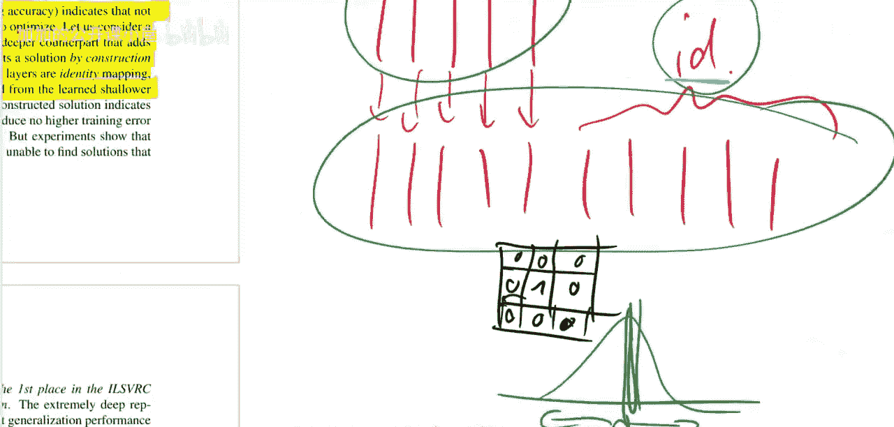

## 总结与影响 🌟

本节课中，我们一起学习了深度残差网络（ResNet）这一经典工作。我们从深度神经网络优化困难的背景出发，逐步分析了“性能退化”问题的本质并非过拟合，而是深层网络难以学习恒等映射。

ResNet的核心贡献在于提出了**残差学习**范式。通过引入**快捷连接**，将网络层的学习目标从完整的映射 `H(x)` 转变为残差 `F(x) = H(x) - x`。这一巧妙的设计将恒等映射设置为网络的默认行为，使得优化超深层网络变得可行。

这项工作的影响是深远且持久的：
1.  **开创了超深度网络时代**：使得训练数百甚至数千层的网络成为标准操作。
2.  **成为现代神经网络的基础模块**：残差连接的思想被广泛应用于计算机视觉、自然语言处理（如Transformer中的残差连接）、语音识别等几乎所有深度学习领域。
3.  **启发了更多网络架构创新**：如DenseNet、ResNeXt等都是在残差思想基础上的进一步发展。


ResNet不仅是一项技术突破，更展示了如何通过深刻的洞察和简洁优雅的结构设计，解决困扰整个领域的根本性问题。它当之无愧地成为深度学习发展史上最重要的论文之一。