# 068：一项大规模实证研究 📊

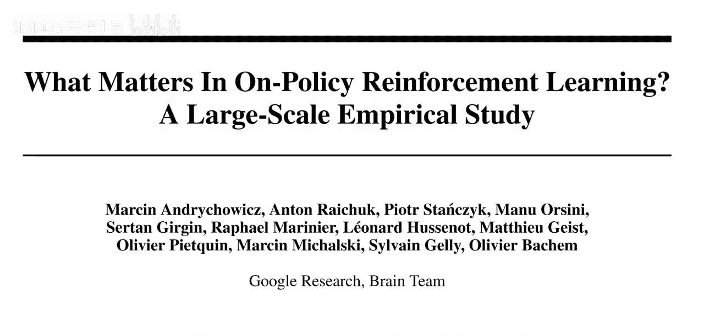

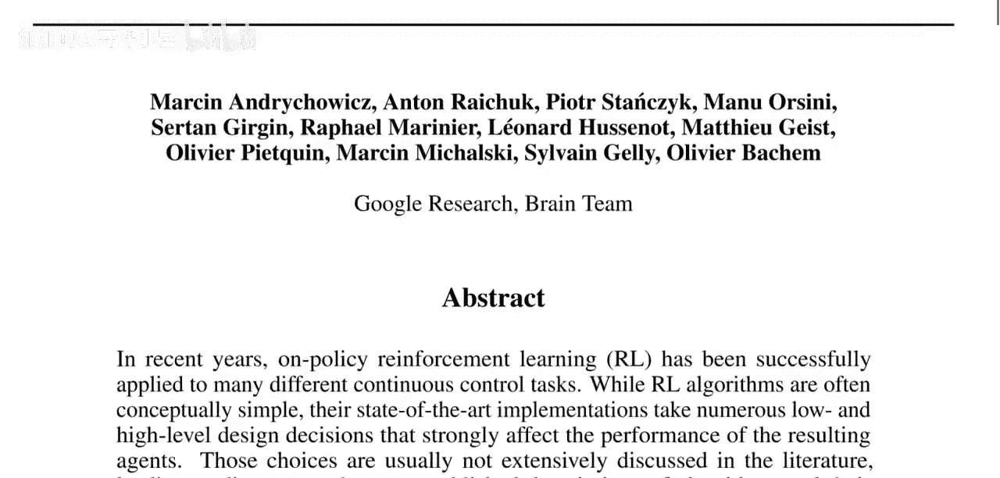

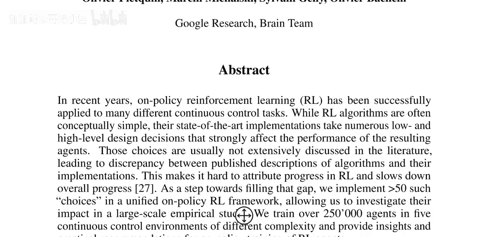

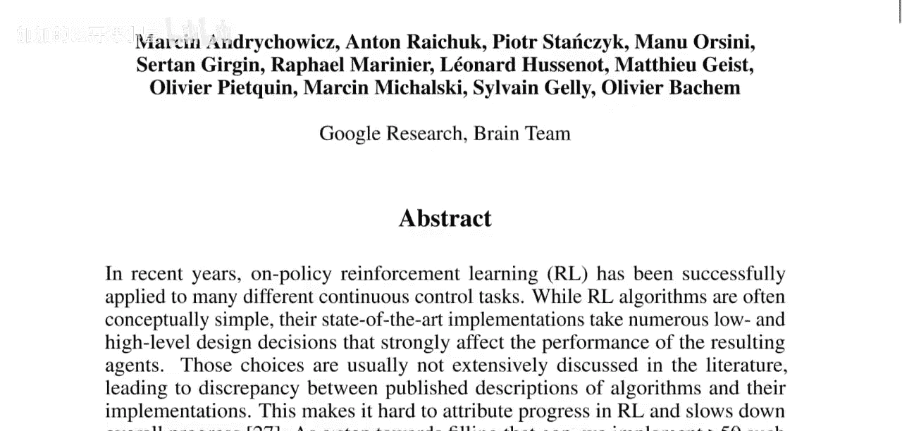

在本节课中，我们将解读一篇由Google Brain团队发表的论文《What Matters in On-Policy Reinforcement Learning? A Large-Scale Empirical Study》。这篇论文通过大规模实验，系统地研究了在连续控制任务中，各种算法设计选择对智能体性能的实际影响。我们将梳理其核心方法、关键发现以及对实践的启示。

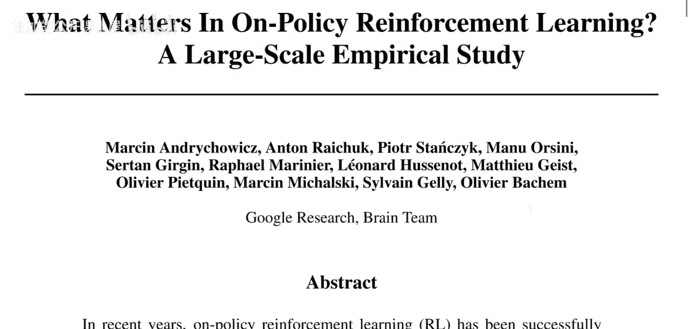

## 概述：论文的研究目标与方法 🎯

上一节我们介绍了论文的基本背景，本节中我们来看看其具体的研究目标与方法。

论文指出，虽然论策略强化学习算法在概念上通常很简单，但其最先进的实现涉及大量底层和高层的设计决策，这些决策会极大地影响最终智能体的性能。然而，这些选择在文献中往往没有被深入讨论，导致了算法描述与其实际实现之间存在差异。

为了填补这一空白，作者在一个统一的论策略强化学习框架中，实现了超过50种此类设计选择。这使得他们能够通过大规模实证研究来调查这些选择的影响。他们训练了超过25万个智能体，覆盖了五个不同复杂度的连续控制环境，旨在为论策略强化学习训练提供实用的见解和建议。

## 核心挑战与实验设计 ⚙️

了解了研究目标后，我们来看看研究面临的核心挑战以及作者如何设计实验来应对。

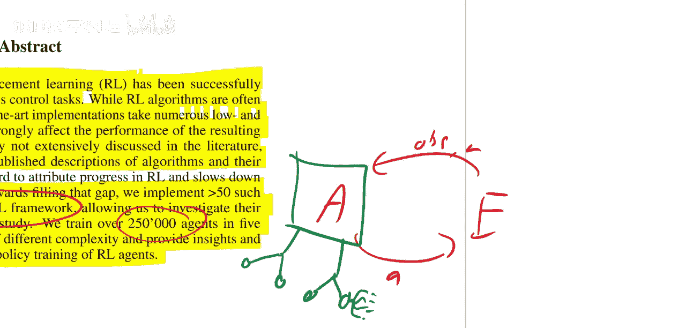

作者提到，研究这些选择的影响主要面临两大挑战：
1.  我们主要关注的是在**良好超参数**下的选择洞察。但如果所有选择都是随机采样的，性能会非常差，训练几乎无法取得进展。
2.  在如此高维度的选择空间中进行详尽的网格搜索在计算上是不可行的。

因此，他们采用了一种策略：从一个已知表现良好的基础配置开始，然后系统地、一次一个地扰动（改变）各个设计选择，以观察每个选择单独变化时对性能的影响。这种方法有助于在庞大的选择空间中，更高效地定位关键因素。

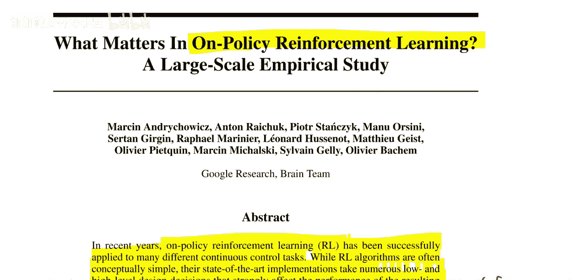

## 主要研究发现与讨论 💡

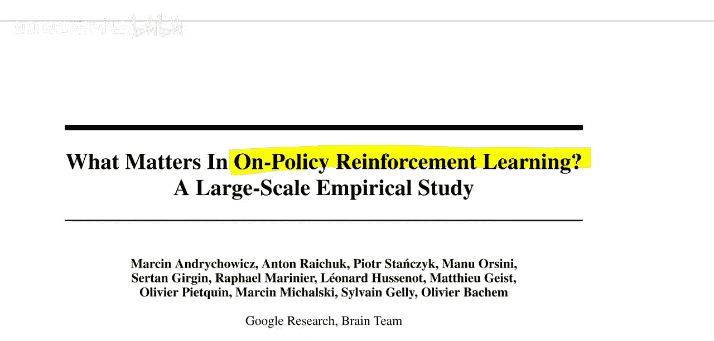

在介绍了实验方法后，本节我们将深入探讨论文中最引人注目的一些发现。

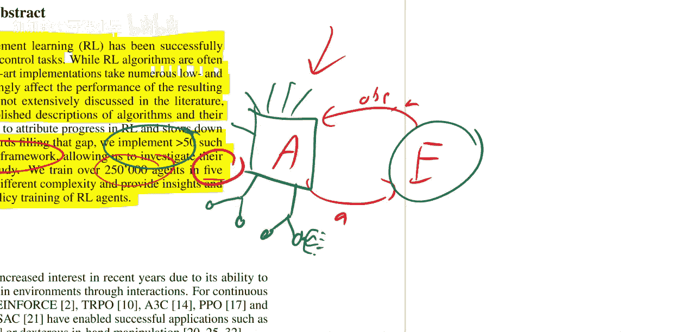

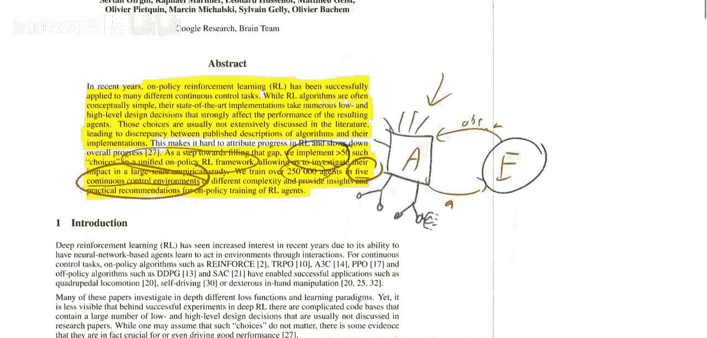

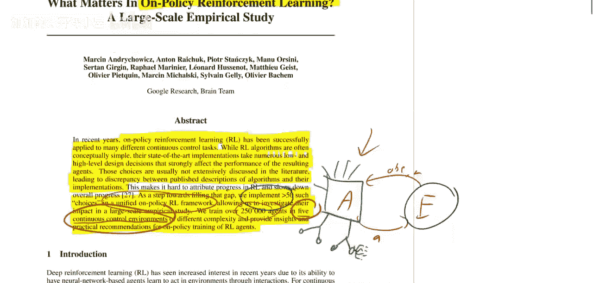

论文得出了一些令人惊讶的结论：
*   **最重要的因素**：策略网络的**初始化方案**对最终性能有极其显著的影响。这是许多人可能未曾充分认识到的。
*   **其他关键因素**：学习率和折扣因子等超参数也至关重要，不过强化学习领域的研究者可能对此已有共识。
*   **影响较小的因素**：令人意外的是，**大多数**其他设计选择（如网络的具体架构细节、某些正则化方法等）似乎对最终性能的影响并不像想象中那么大。当然，作者也指出，这可能存在其他解释，例如在所选的环境集合中，这些因素不敏感。

需要特别注意的是，论文的标题《论策略强化学习的关键因素》可能略有夸大。其研究严格基于**五个MuJoCo连续控制环境**，这些环境在观测和动力学方面彼此相似。因此，更准确的解读是，这些发现适用于这五个及与之非常类似的环境，其普适性仍需在更广泛的任务中得到验证。

## 总结与启示 📝

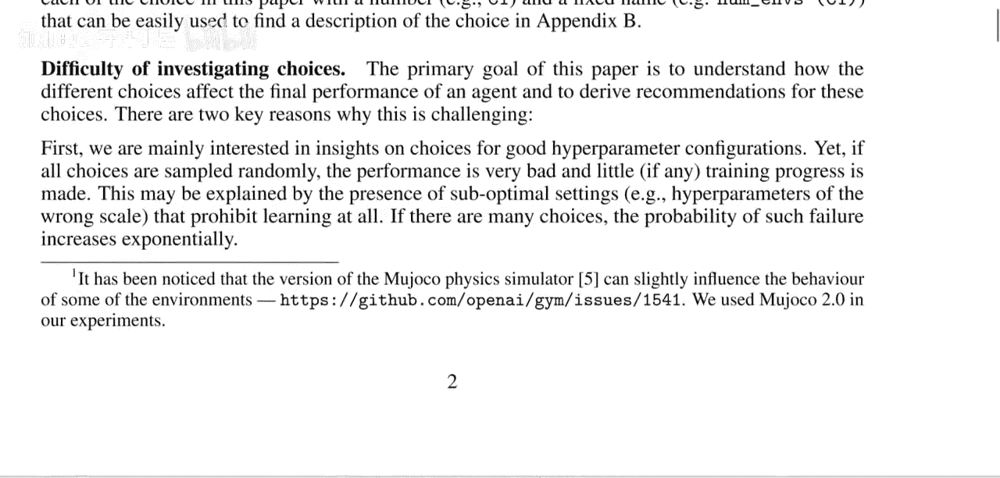

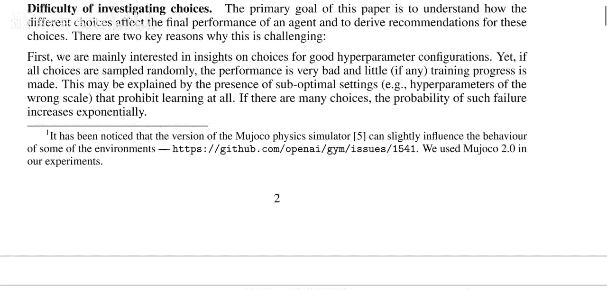

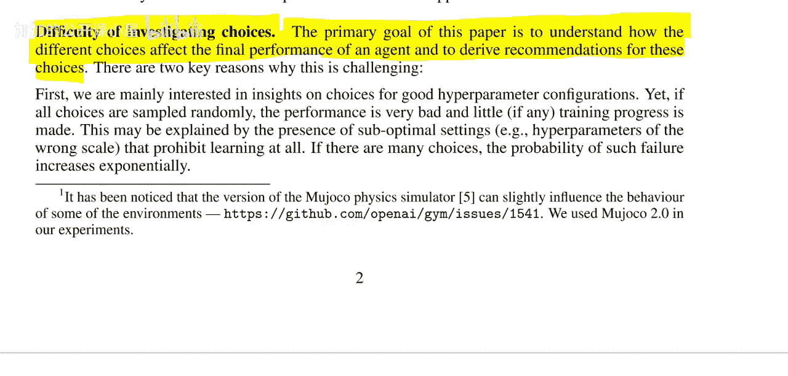

本节课我们一起学习了《What Matters in On-Policy Reinforcement Learning?》这篇论文的核心内容。

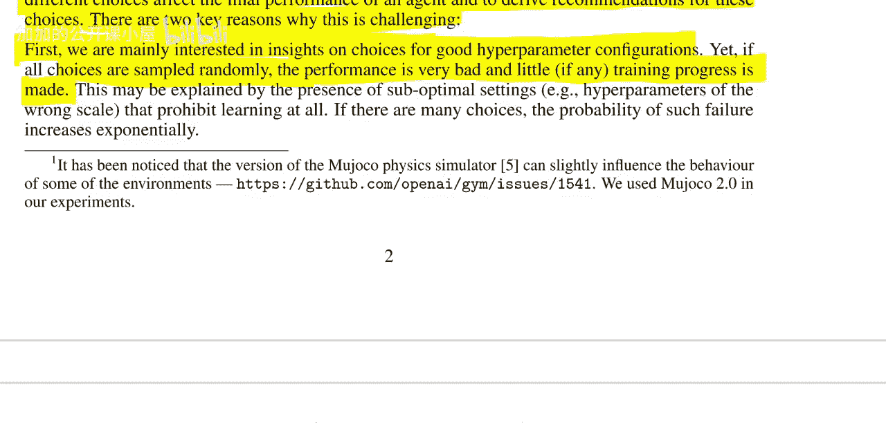

我们了解到，该研究通过构建一个高度可配置的统一框架，对超过50种设计选择进行了大规模实验分析。其核心启示在于：在连续控制任务中，**智能体的初始化策略、学习率等基础设置可能比许多复杂的算法修饰更为关键**。这提醒研究者和实践者，在追求算法创新时，不应忽视这些基础的、但影响深远的工程细节。同时，论文也展示了系统化实证研究对于厘清算法贡献、弥合理论与实现之间差距的重要价值。

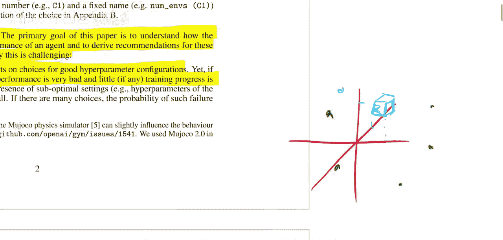

这项研究为强化学习的可复现性和扎实的算法评估提供了宝贵的范例。