# 069：你只需要霍普菲尔德网络（论文详解） 🧠

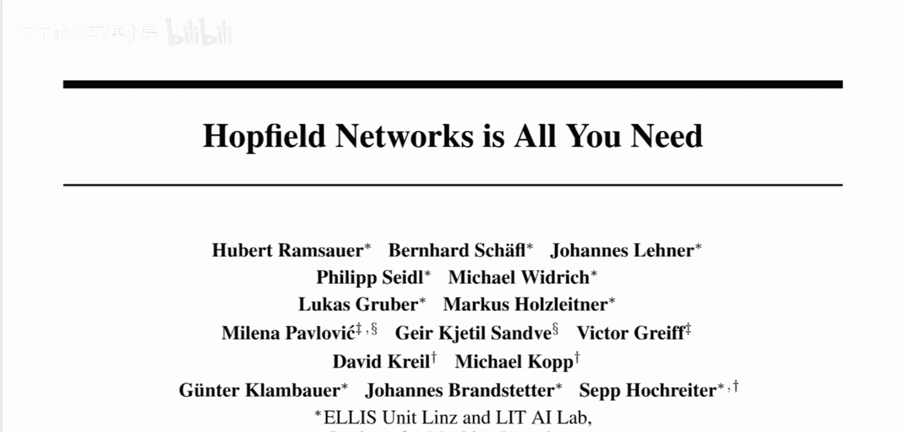

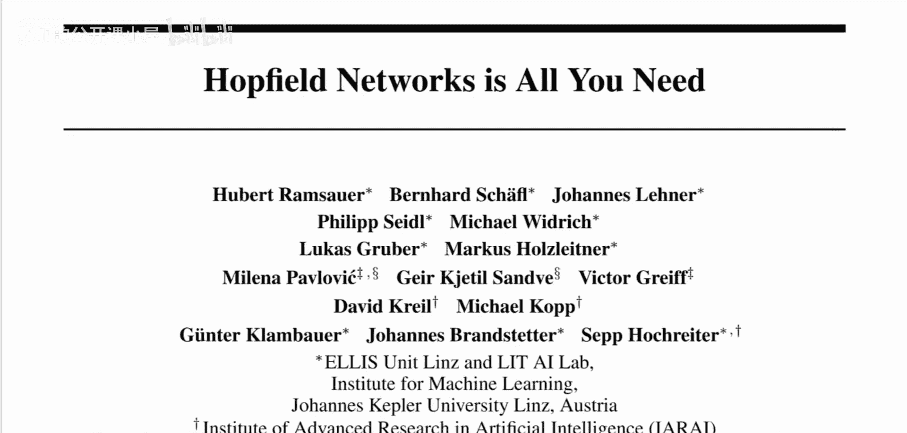

在本节课中，我们将学习一篇名为《Hopfield Network is All You Need》的论文。这篇论文由来自Lyz的Jones Kepler大学和奥斯陆大学的研究者共同完成。我们将探讨它如何将传统的霍普菲尔德网络推广到连续模式，并揭示其更新规则与现代Transformer中的注意力机制之间的等价关系。

## 概述

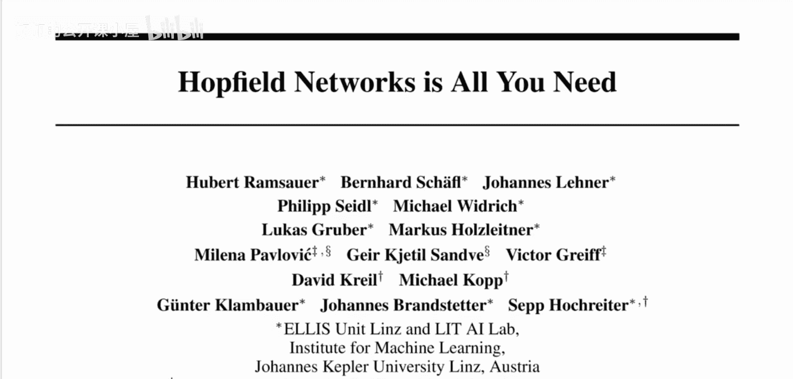

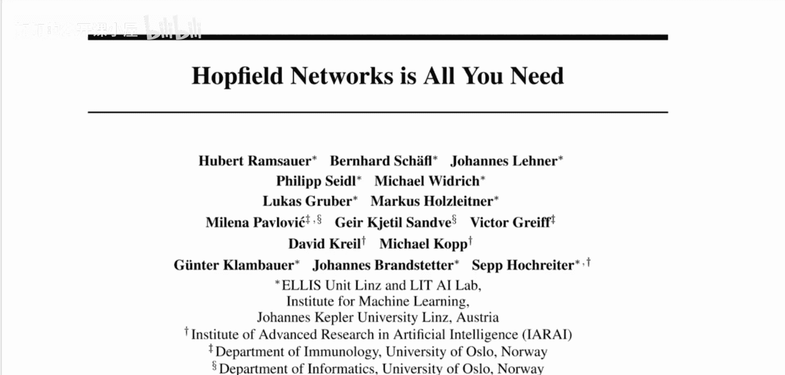

论文的核心是提出了一种新型的霍普菲尔德网络，它将现代霍普菲尔德网络从二值模式推广到连续模式。研究证明，这种新型霍普菲尔德网络的检索更新规则，等同于现代Transformer中使用的注意力机制，并且是注意力机制的一个更通用的表述。因此，它可以用于改进现代深度学习的多种任务。该研究还有一篇配套论文，将这种方法应用于免疫学研究，并在一个特别适合此类注意力的任务上取得了最先进的成果。

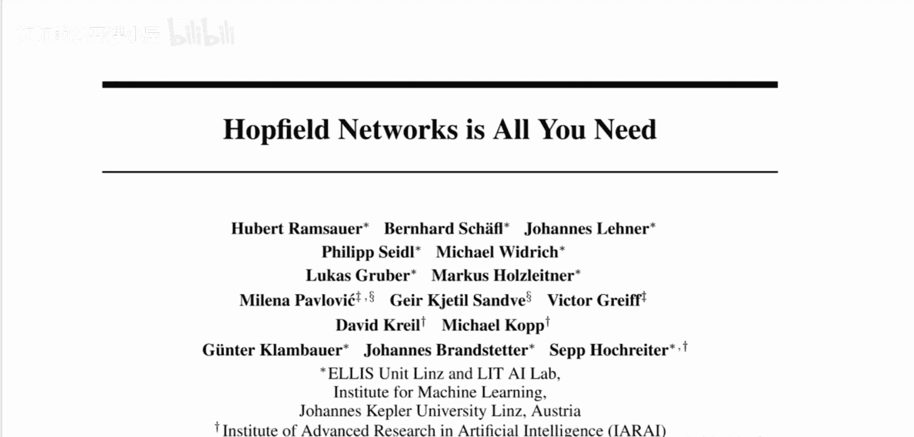

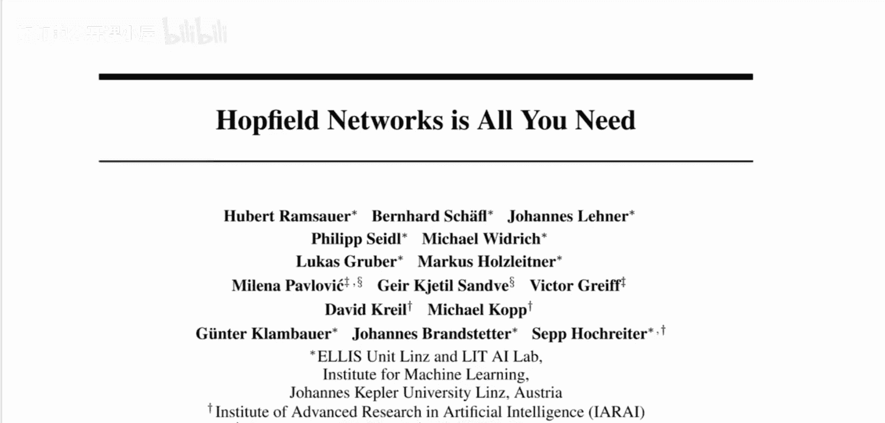

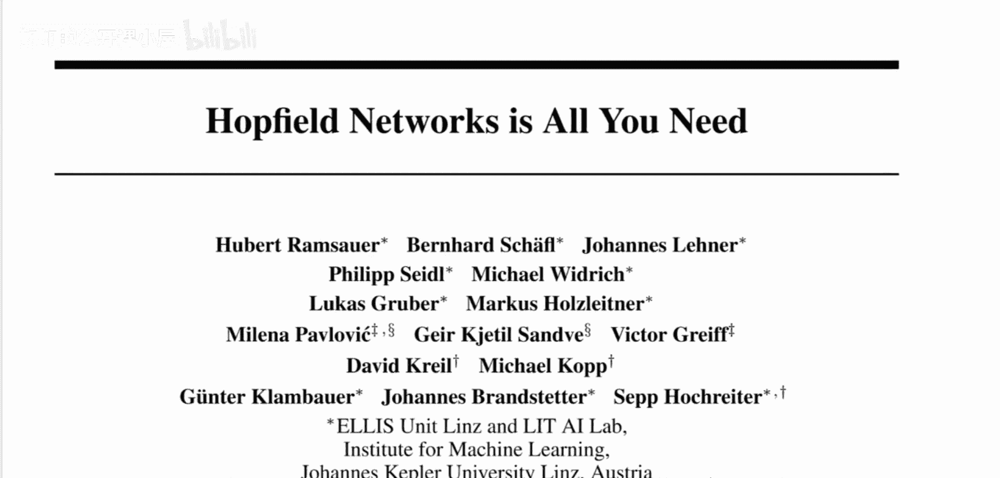

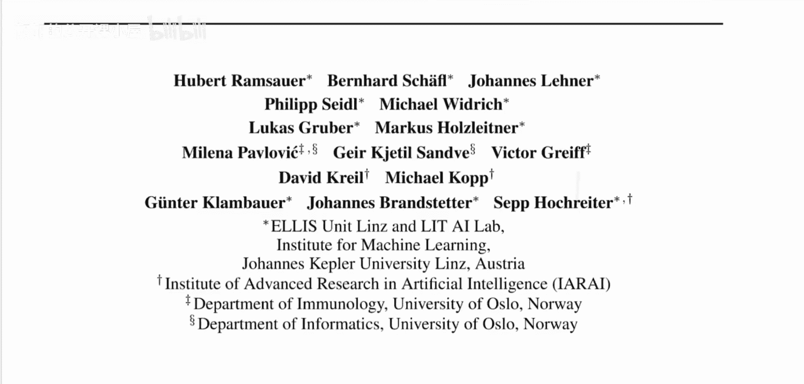

## 什么是霍普菲尔德网络？

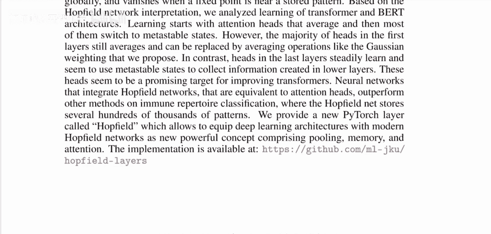

霍普菲尔德网络是一种相对早期的神经网络概念模型。

在霍普菲尔德网络中，目标可以被概念化为一个神经网络。例如，假设我们有五个神经元。目标是在这个神经网络中存储所谓的“模式”。在这个例子中，一个模式就是一个长度为5的二进制字符串，例如 `10100` 或 `11010`。我们会有一个模式列表，目标是通过某种方式调整网络权重，将这些模式存储在神经网络中。

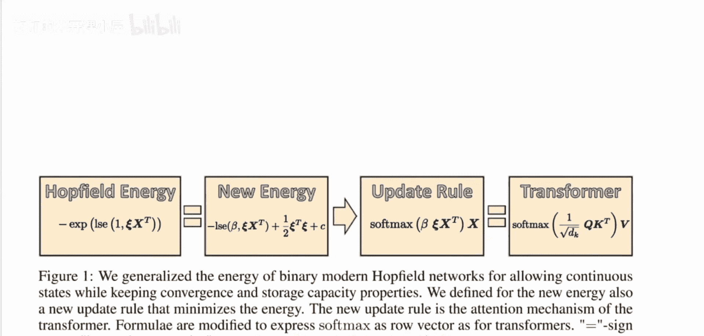

上一节我们介绍了霍普菲尔德网络的基本概念，本节中我们来看看模式存储和检索的具体含义。

### 模式的存储与检索

“存储”一个模式意味着什么？存储一个模式后，你将能够检索它。在这类传统的霍普菲尔德网络中，你通过提供一个“部分模式”来检索完整模式。例如，你可能输入一个以 `110` 开头的模式。网络内部存在一个“更新规则”，这个规则会根据网络权重，调整其他神经元的状态，使其与网络权重最兼容。如果网络权重调整正确，最终输出将是完整的存储模式（例如 `11010`）。如果最初输入的是 `101`，则希望检索出另一个不同的存储模式。

你可以看到这种网络的应用：前几位数字可以看作是数据库的“键”，后几位是与之存储的“值”。你只需提供前几位（不一定是三位）即可进行检索。这是一种对大脑工作原理的早期模拟设想，即“一起激活的神经元会连接在一起”。

关于存储容量，你可能会认为有5个神经元就能存储5个不同的模式。但研究表明，在现代霍普菲尔德网络中，采用适当的更新规则，可以在网络中存储**指数级数量**的模式（相对于模式的维度，即长度）。这有些令人惊讶。

而本篇论文则将这一特性推广到了**连续状态**。

## 从二值到连续模式

“连续状态”或“连续模式”意味着模式不再是二进制字符串，而是浮点数序列，例如 `[0.5, 1.3, ...]`。一个浮点数序列自然可以表示为一个向量。因此，我们的模式将是不同的存储向量。在高维空间中，只要数量不是太多，这些向量彼此之间可以很好地分离。

论文表明，适用于二进制字符串的现代霍普菲尔德网络的所有特性，在推广到这些向量模式后依然成立。这意味着你可以在向量维度上存储指数级数量的模式，这非常令人惊讶，因为直觉上可能认为每个维度存储一个向量后容量就会饱和，但事实并非如此。

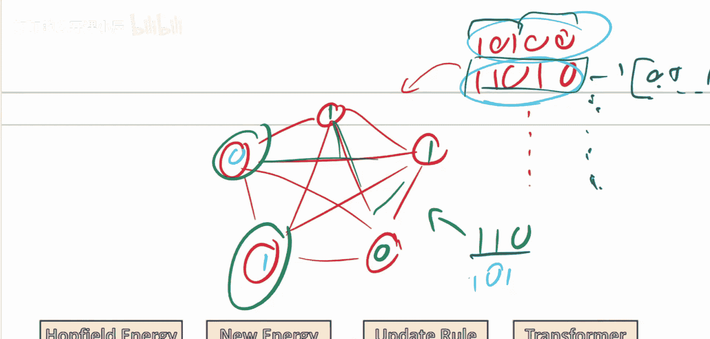

## 更新规则与能量函数

我们已经讨论了霍普菲尔德网络的更新规则，但尚未具体说明它是什么。更新规则的作用是：输入一个查询，网络进行一些内部操作，然后输出与查询匹配的模式。这个输入在论文中被称为“查询”。

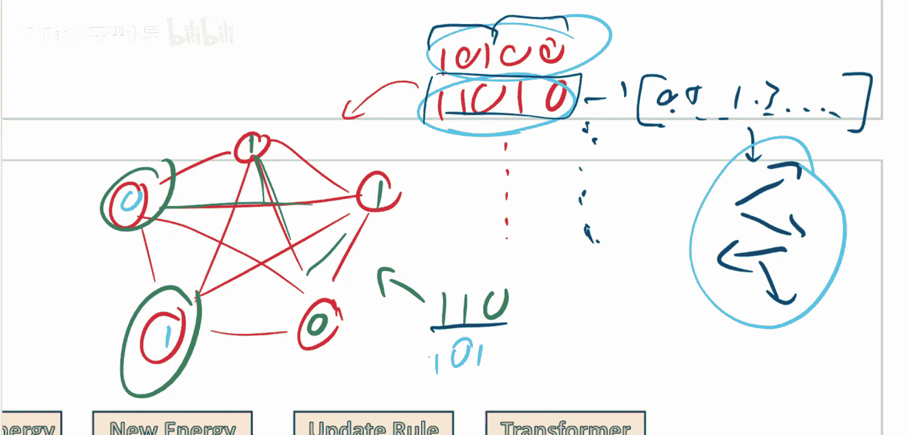

如果你不熟悉注意力机制，建议先观看关于“注意力就是一切”的视频，这将有助于理解本视频的内容。这里故意使用了与注意力机制术语重叠的词汇，以明确两者的联系。

更新规则的具体作用是**最小化一个称为“能量”的函数**。每种霍普菲尔德网络都关联着一个能量函数。对于二值字符串的现代霍普菲尔德网络，其能量函数如下所示：

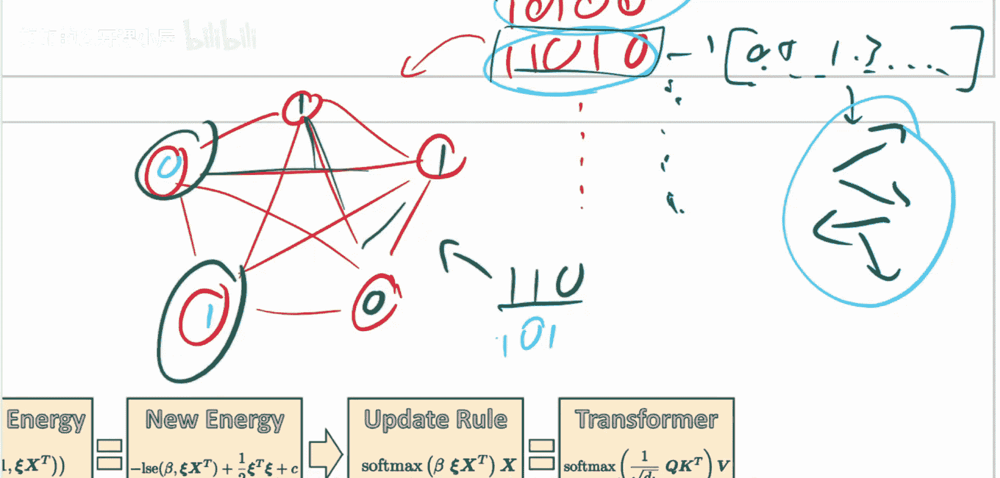

**能量函数公式：**
`E = -∑_i ∑_j w_ij * x_i * x_j + ∑_i θ_i * x_i`

其中，`x` 表示网络的状态（即存储的模式），`z` 表示你输入网络的查询。为了检索到你想要的模式，你需要最小化这个能量值。

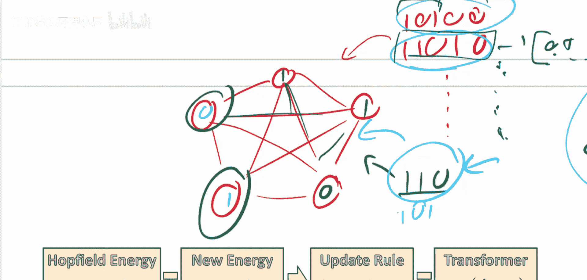

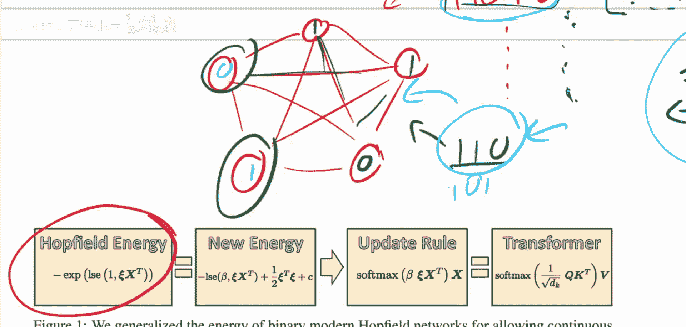

然而，我们通常不直接操作能量函数本身。你可以使用反向传播或梯度下降来降低能量，但通常，与能量函数相伴的是一个**更新函数**。更新函数就是我之前提到的“网络进行一些操作”的过程。网络所做的就是最小化其能量函数，而更新规则的设计正是为了最小化对应的能量函数。因此，能量函数更像是一个理论上的考量。

## 总结

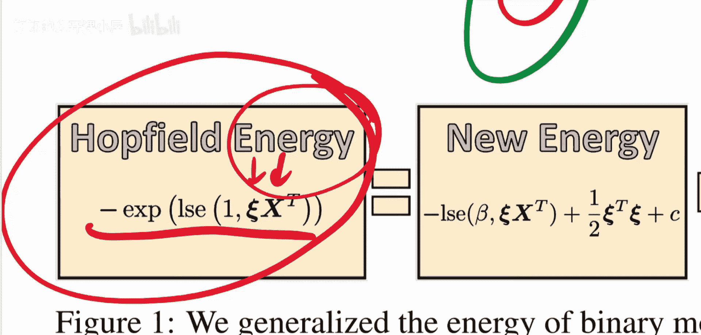

本节课我们一起学习了《Hopfield Network is All You Need》这篇论文的核心内容。我们了解到：
1.  论文提出了一种新型的、支持连续向量模式的霍普菲尔德网络。
2.  这种网络的检索更新规则在数学上等价于Transformer中的注意力机制，并且是更通用的形式。
3.  这种网络具有惊人的存储容量，能够存储指数级数量的模式。
4.  能量函数是理解网络动态的理论基础，而更新规则是实现能量最小化的具体算法。

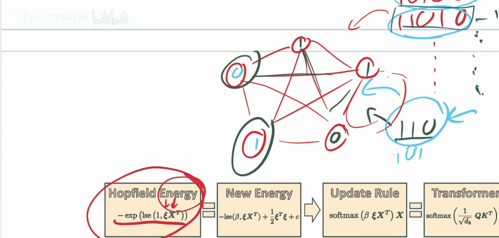

这项研究为理解注意力机制提供了新的视角，并展示了经典神经网络模型在现代深度学习中的潜在应用价值。