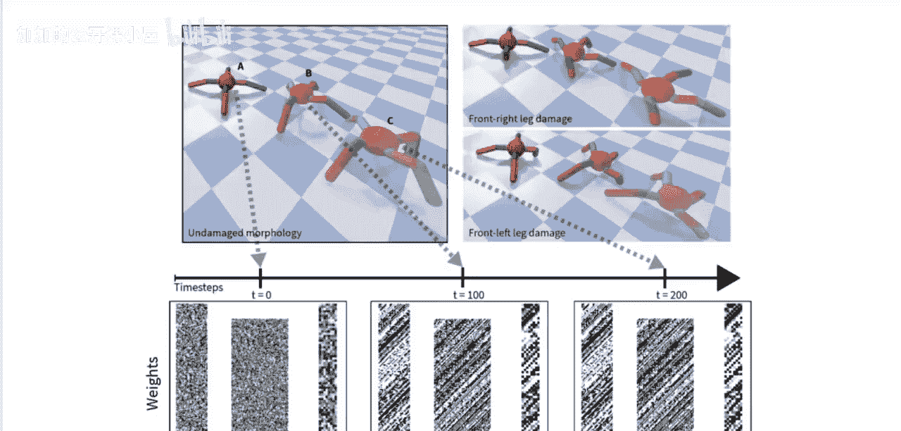
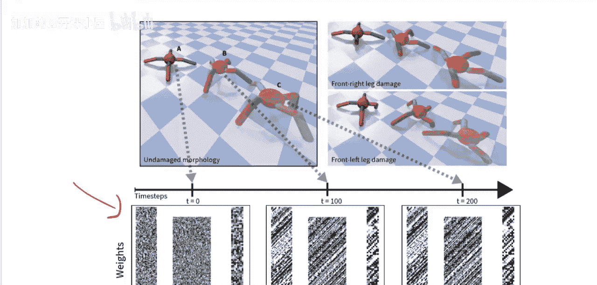
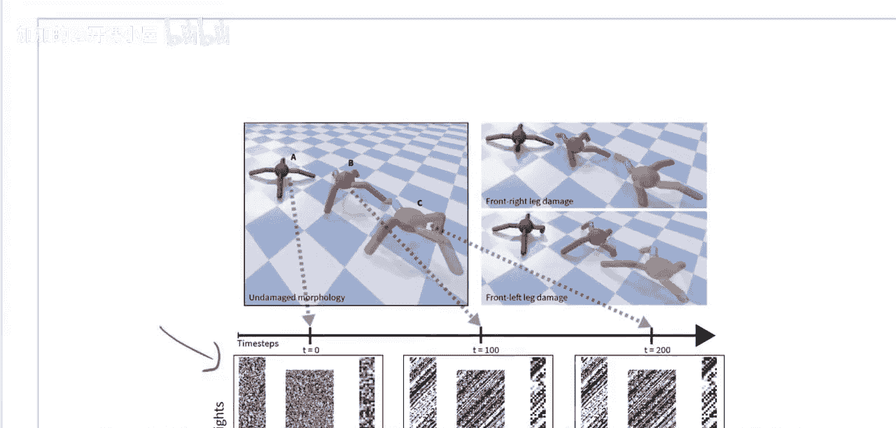
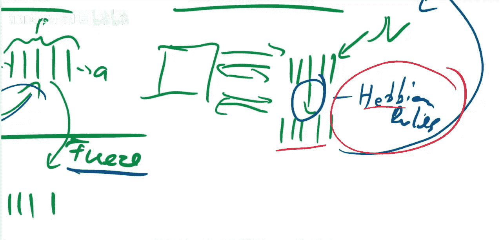
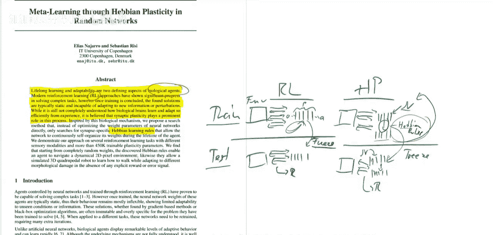
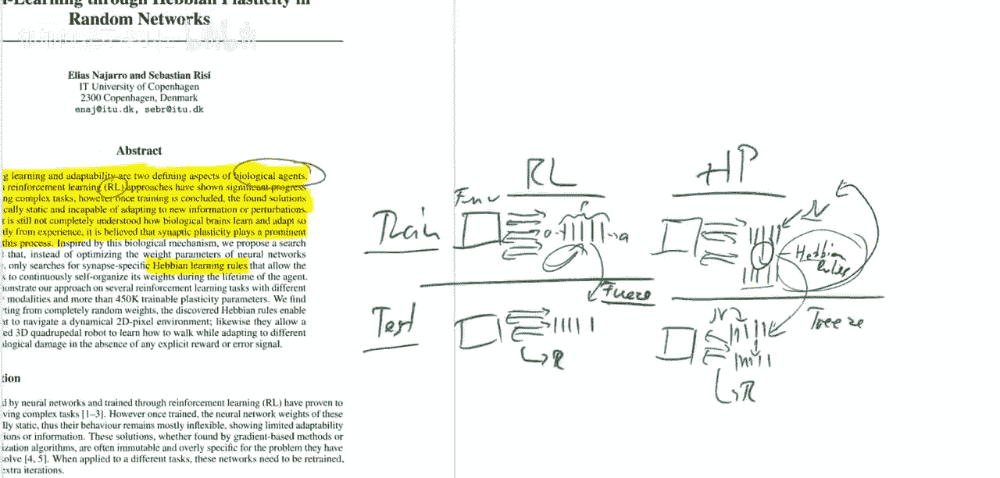
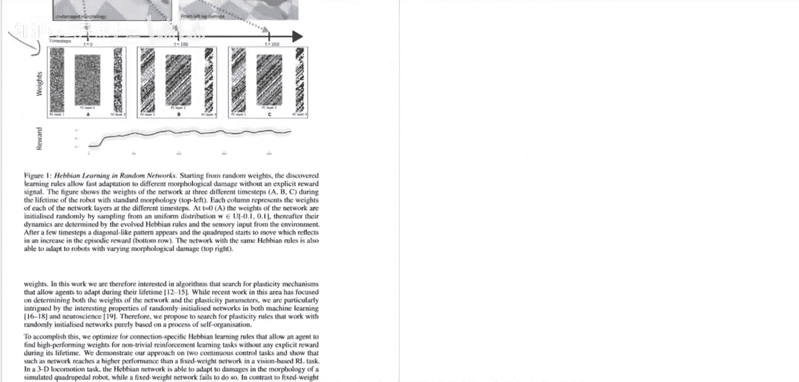
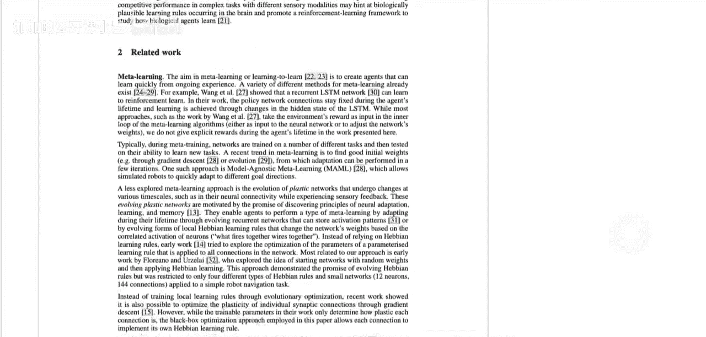
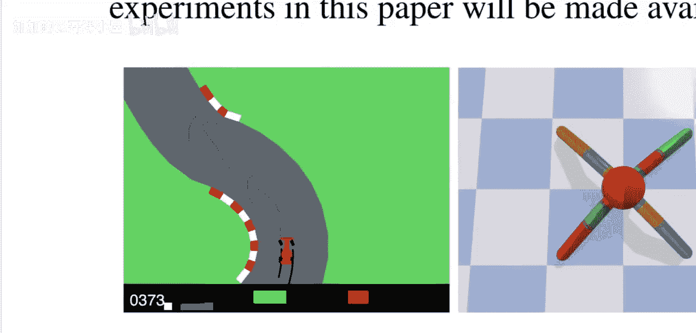

# 070：随机网络中的赫布可塑性元学习（论文解读）

在本节课中，我们将学习一篇名为《通过随机网络中的赫布可塑性进行元学习》的论文。我们将探讨一种不同于传统强化学习的方法，它通过在训练和测试期间动态调整网络权重，来实现更接近生物学习的自适应策略。我们将了解其核心概念、工作原理，并对比它与传统强化学习的区别。

## 问题定义与目标

首先，我们来看一个具体问题。如下图所示，有一个四足机器人。

目标是让它尽可能远地向前或向任何方向行走。通常，这是强化学习的领域。输入是四足机器人关节的传感器数据，输出是施加在每条腿上的力。我们需要学习一个策略来让它向前行走。强化学习通过试错，利用环境直接学习策略。

然而，这篇论文采用了一种不同的方法。它学习的是一个在训练期间能够自适应的策略。这意味着在每个训练回合开始时，策略网络会被随机初始化。这里的“策略”指的是一个策略神经网络，如下图所示。

在回合进行过程中，根据输入，这个网络会被改变和调整，以实现高性能。即使在测试时，网络也是随机开始，然后在回合中进行调整。这篇论文就是处理这个问题，试图实现一种更具生物学合理性的策略学习方式，使其能适应环境，并最终在此任务中取得良好性能。它还有一些很好的特性，例如能够处理腿部损伤等情况，我们稍后会详细讨论。

## 论文简介与背景

论文名为《Meta learning through Hebbian plasticity in random networks》，作者是Eliliaas Naharro和Sebastian Rei。我们将梳理论文内容，简要介绍其使用的进化方法，解释什么是赫布可塑性，以及它与经典强化学习的区别，最后分析其实验结果。

作者指出，终身学习和适应性是生物智能体的两个决定性特征。现代强化学习方法在解决复杂任务方面取得了显著进展。然而，一旦训练结束，找到的解决方案通常是静态的，无法适应新信息或扰动。他们在此对比了两种方法。强化学习在这些领域非常强大，但其目标是学习一个策略，然后该策略就固定下来，专门针对那个特定问题。

然而，生物智能体，如人类和动物，通常能够非常快速地适应。他们举了一些例子，比如动物出生后几乎立即知道如何行走。即使它受伤或有某种残疾，通常也能几乎立即行走。这意味着它能适应自己的身体，在飞行中重新配置自己，这正是我们要探索的。

作者再次强调，我们仍然不完全了解生物大脑如何如此高效地从经验中学习和适应。人们相信突触可塑性在这个过程中起着重要作用，这就是他们使用这些赫布学习规则来配置网络的原因。

## 核心概念对比：强化学习 vs. 赫布可塑性学习

现在，让我们对比一下这两种方法。

在强化学习中，你有一个策略网络。策略网络是一个将感官输入映射到动作的神经网络。观察值输入，动作输出。这就是你的策略网络。

在强化学习的训练期间，你有一个环境。你与环境进行这种来回交互的游戏，并尝试改进这个策略网络，以获得高奖励。

在测试期间，你冻结这个网络。然后你简单地玩游戏，看看它的表现如何。这会给你一些奖励，这就是你的测试奖励。这可以是泛化测试，也可以是不同的环境，但关键部分是在训练中学习，然后在测试中冻结。

在这篇论文描述的赫布可塑性世界中，做法有所不同。你仍然有你的环境，并玩游戏。但游戏是以回合进行的。在每个回合开始时，你使用某种分布（如正态分布）来初始化网络，然后你在回合中学习并适应网络以获得良好性能。这里的更新规则就是赫布规则。

你在回合中更新网络，然后在回合结束时，你重新初始化网络，开始一个新回合，并再次适应那个随机初始化的网络。所以，在这里真正学习的不是网络的权重。在训练期间学习的是这些规则，它们能将任何随机初始化的网络转化为高性能的网络。

你可能会反对说，我可以直接将最优权重硬编码到这些赫布规则中，让规则不关心输入，直接输出任何好的权重，最终这又会回到强化学习。但正如你在实验中将看到的，他们提供的视频也显示，网络确实会重新配置。首先，在开始时，它会将自己重新配置到一个良好状态。然后，随着回合的进行，它会根据输入持续地重新配置自己。这就是这些赫布规则的真正力量：在回合中，网络可以持续地重新配置自己以获得更高的奖励。所以，这不仅仅是从随机初始化到一个良好策略，它还能根据输入来调整该策略。

在赫布世界的测试时间，我们要做的是：我们冻结学习规则。但我们在每个回合仍然随机初始化我们的策略。然后我们在回合中改变它。最终这会给我们带来奖励。所以，在这里学习到的东西是不同的：在强化学习设置中，你直接学习权重；而在赫布可塑性设置中，你学习的是根据输入动态更新权重的规则。

## 赫布规则与元学习形式

这是一种元学习的形式。让我们看看这些赫布规则是什么。同样，你可以在训练期间看到这一点。这是一个回合。

它总是以这些随机网络开始。然后你可以看到，随着进程推进，结构出现了。在他们的另一个例子中，这一点尤其明显，比如这个核心例子。

在这个核心例子的视频中，你会看到有这样的曲线。想象你是一个司机，有一个左转弯过来，你会调整你的心理状态，比如，我不知道弯道那边有什么，我需要准备好刹车等等。然后有一段直路，你会想，我能看到一切，我可以专注于不同的事情。你可以重新配置你的状态以适应观察，这正是你在视频中看到的：权重在持续更新。

## 总结

本节课中，我们一起学习了一种基于赫布可塑性的元学习方法。我们了解到，与传统强化学习固定策略网络不同，该方法在每次任务开始时随机初始化网络，并通过学习到的赫布规则在任务过程中动态调整网络权重。这使得智能体能够像生物一样，在测试时快速适应环境变化，例如机器人腿部损伤。核心在于，训练的目标不是网络权重本身，而是能根据输入实时优化任何随机初始网络的更新规则。这为实现更具适应性和泛化能力的人工智能提供了一条新路径。