# 071：检索增强语言模型预训练（论文详解） 🧠

在本节课中，我们将学习一篇名为《REALM：检索增强语言模型预训练》的论文。这篇论文提出了一种新颖的预训练方法，旨在让机器像人类一样，通过检索外部知识库（如维基百科）来回答开放领域的问题。我们将探讨其核心思想、架构设计、独特的预训练方法以及取得的显著成果。

---

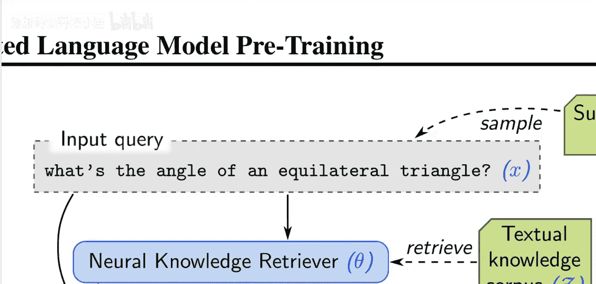

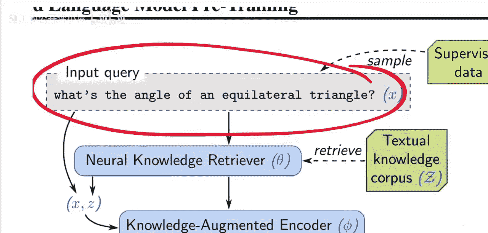

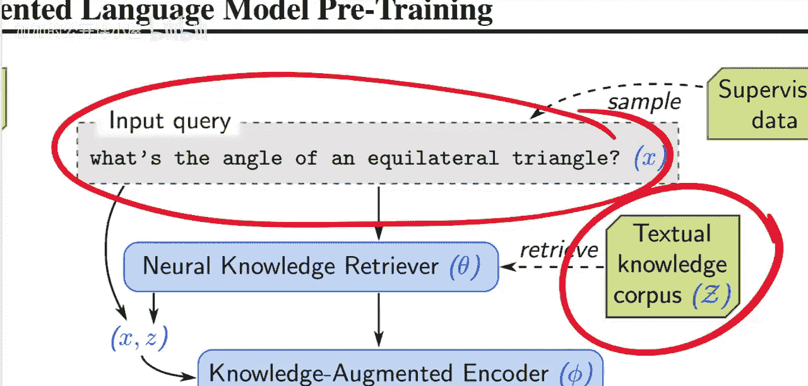

## 概述：从人类行为到机器实现 🤔

等边三角形的内角是多少度？如果你的高中数学知识有些模糊，不知道这个答案也情有可原。

当人们想知道这个问题的答案时，标准做法是打开搜索引擎（如谷歌），输入问题，找到一个包含答案的网站，然后阅读该网站并从中找到答案。

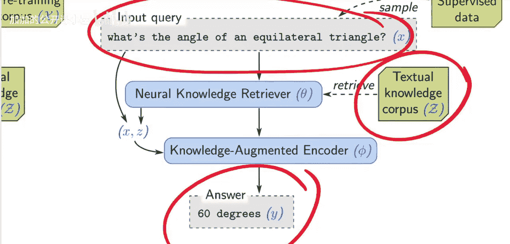

这篇论文的目标就是以机器的方式实现相同的过程。

机器会看到这个问题，能够从一个大型文本语料库中获取额外的文本知识，参考这些知识，最终得出答案（即60度）。

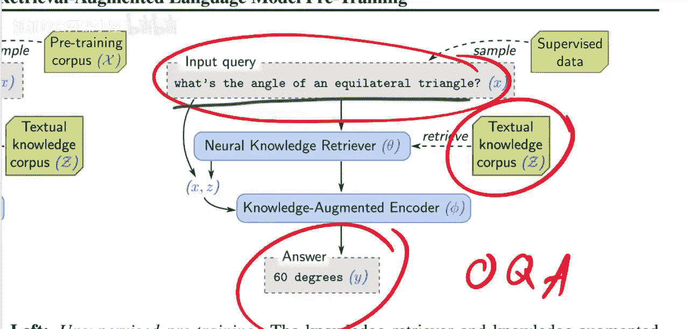

这类任务被称为**开放域问答**。它与之前常见的“问答”任务的区别在于：传统的问答任务通常会提供一个问题和**一个**相关文档，模型只需在该文档中寻找答案，更像是一种阅读理解或模式匹配。

而开放域问答则更接近人类理解的“问答”：你提出一个问题，机器可以像使用搜索引擎一样，带着问题去海量文档中检索、排序相关信息，并最终综合得出答案。这就是我们今天要探讨的内容。

---

## 论文背景与核心贡献 📄

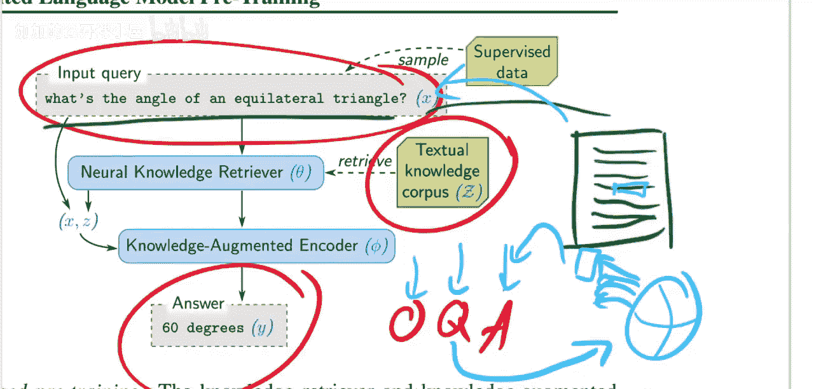

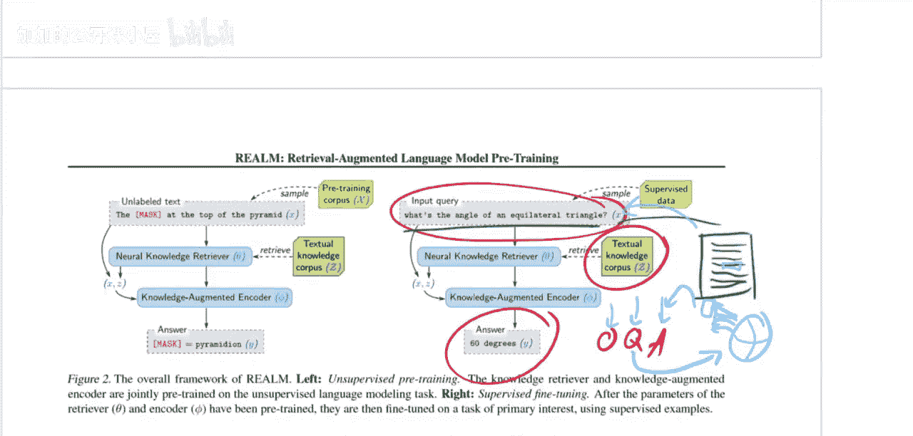

开放域问答领域已有大量研究，本文是其中最新的成果之一。论文全称为《REALM: Retrieval-Augmented Language Model Pre-training》，作者包括Kelvin Gu, Kenton Lee, Zora Tung等。

这篇论文首要贡献在于提出了一种新的**预训练方法**。论文中展示的整个系统架构（如通过内积搜索从维基百科等语料库中检索文档）在之前的论文中已有探索。本文的新颖之处在于如何为这类检索增强系统进行预训练。通过这种新的预训练方法，模型性能得到了显著提升，这非常令人印象深刻。

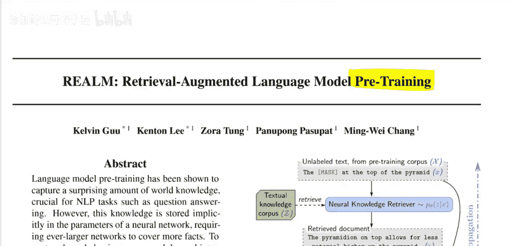

---

## 动机：模块化与可解释的知识存储 💡

摘要指出，语言模型预训练已被证明能够捕获大量对问答等任务至关重要的“世界知识”。

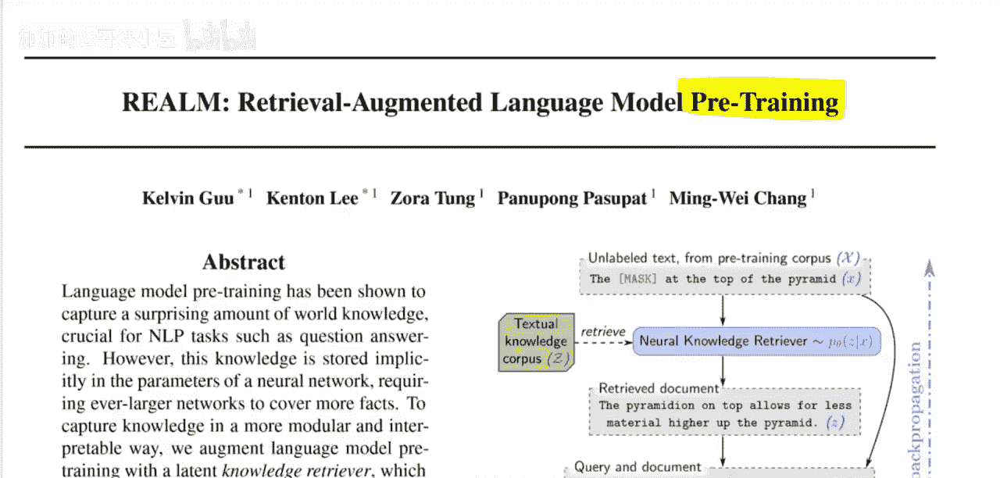

“世界知识”指的是像“等边三角形内角为60度”这类无法从问题本身推导，而必须从外部学习的事实性知识。

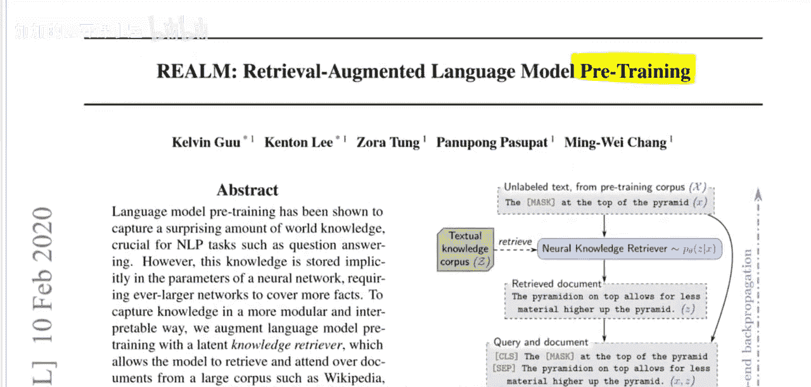

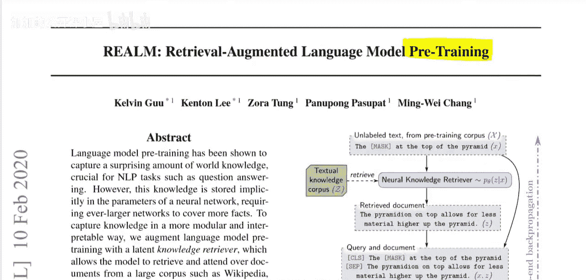

以GPT-3为例，它通过在海量语料库上进行语言建模，将所有世界知识“烘焙”进了模型的参数中。这意味着知识被隐式地、不透明地存储在神经网络的权重里，并且为了涵盖更多事实，需要越来越大的网络。

本文批评（或说论证反对）了这种方式。为了以更模块化、更可解释的方式捕获知识，作者提出在语言模型预训练中增加一个**潜在知识检索器**。这使得模型能够从一个大型语料库（如维基百科）中检索文档并关注其内容。

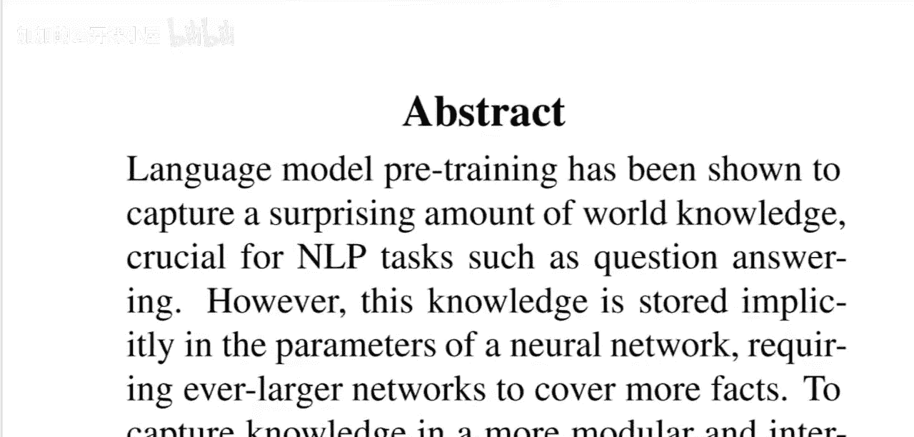

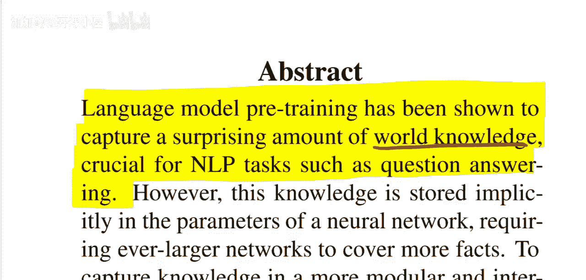

更重要的是，他们首次展示了如何以**无监督**的方式预训练这种知识检索模型，使用**掩码语言建模**作为学习信号，并通过考虑数百万文档的检索步骤进行反向传播。

---

## 核心思想：分离语言建模与世界知识 🔄

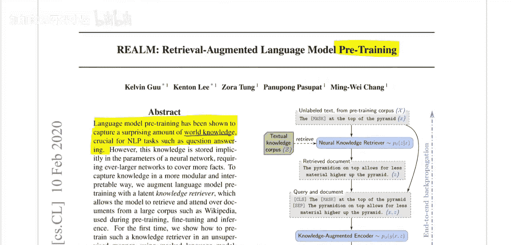

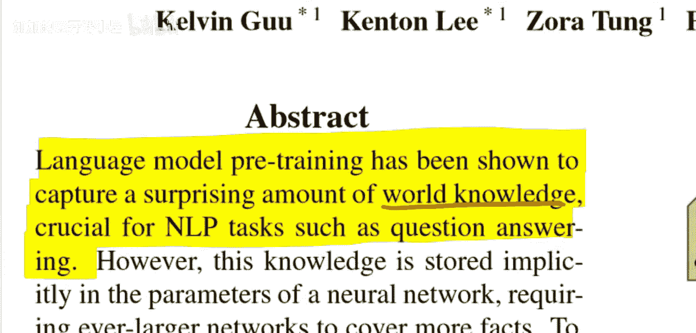

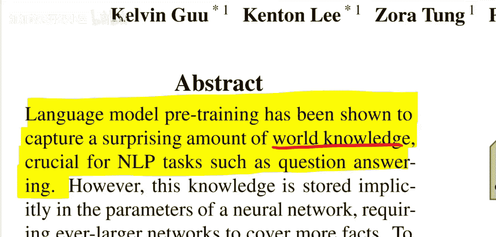

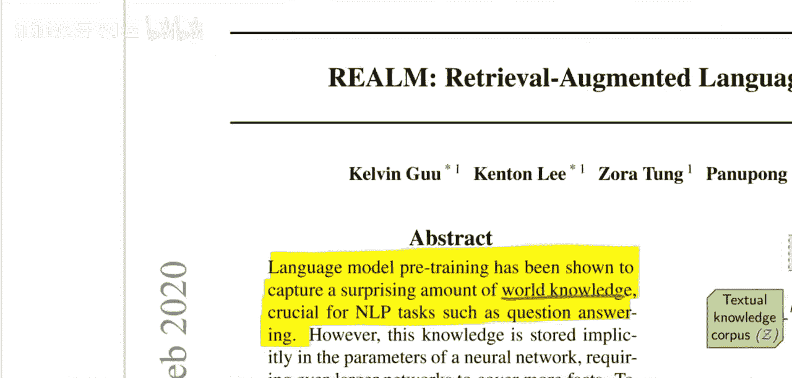

这里包含大量信息。核心思想是：在大型语料库中，存在两种知识——**语言知识**（语法、句法等）和**世界知识**（事实性信息）。

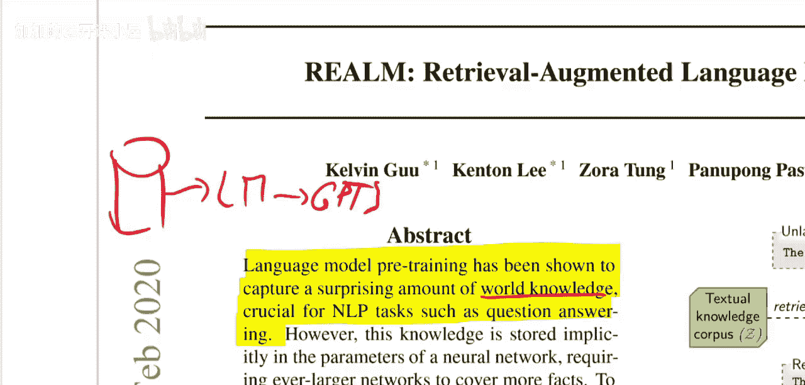

作者希望将这两者分离开。他们想要一个模型，能够主动去语料库中检索相关文档，然后利用这些文档中的信息来回答问题。

这与之前将世界知识与语言模型紧密结合的方式不同。新模型学会了“查找信息”，检索到的内容将直接影响其答案的生成。

---

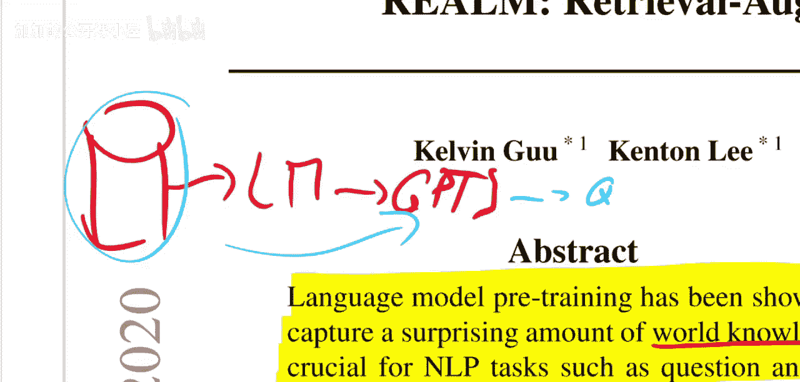

## 架构与预训练方法 🏗️

那么，具体如何实现呢？我们可以参考论文中的示意图。

模型的最终目标是进行开放域问答：输入一个查询，检索相关文档，然后结合信息生成答案。

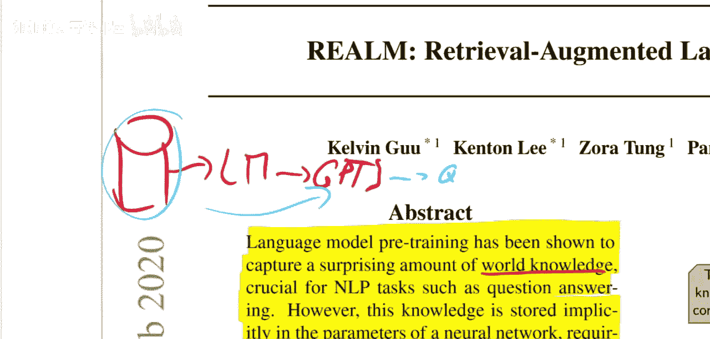

**检索过程**：
1.  首先，模型需要将查询（问题）编码成一个向量。这通常使用像BERT这样的模型来完成。BERT可以将一段文本转换为一个（或多个）向量，这里我们只需要一个代表整个查询的单一向量。
    *公式：`q_vector = Encoder_Query(query)`*
2.  同时，我们需要预先将语料库中的所有文档（例如，维基百科的段落）也编码成向量。假设语料库中有文档Z1, Z2, Z3...
    *公式：`doc_vector_i = Encoder_Doc(document_i)`*
3.  检索时，计算查询向量与所有文档向量的**内积**（相似度），并选取相似度最高的K个文档。
    *公式：`score_i = dot_product(q_vector, doc_vector_i)`*

**预训练的关键**：
论文的创新点在于预训练阶段。他们不使用标准的问答数据对，而是使用**掩码语言建模**作为代理任务。

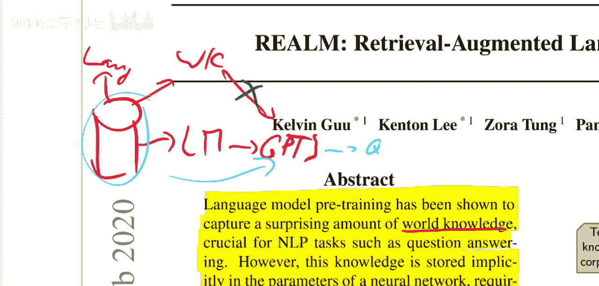

具体来说，他们会从文本中随机掩码掉一些词（例如，“等边三角形的内角是[MASK]度”），然后让模型去检索可能包含被掩码词信息的文档，并基于检索到的文档来预测被掩码的词。

在这个过程中，梯度会**反向传播通过整个检索步骤**。这意味着，不仅负责预测的“阅读器”模型会得到训练，负责生成查询和文档向量的“检索器”模型也会被优化，以学会检索对预测被掩码词最有用的文档。这是一种完全无监督的、端到端的训练方式。

---

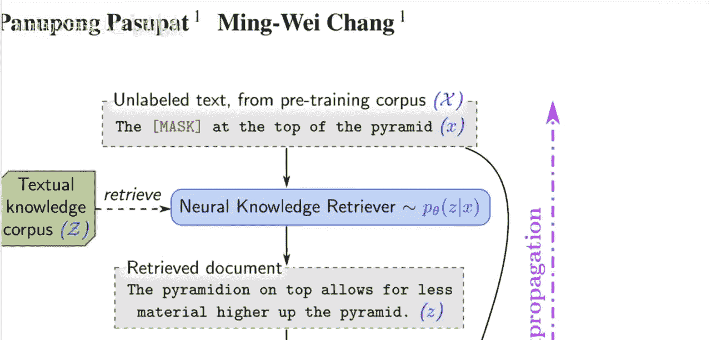

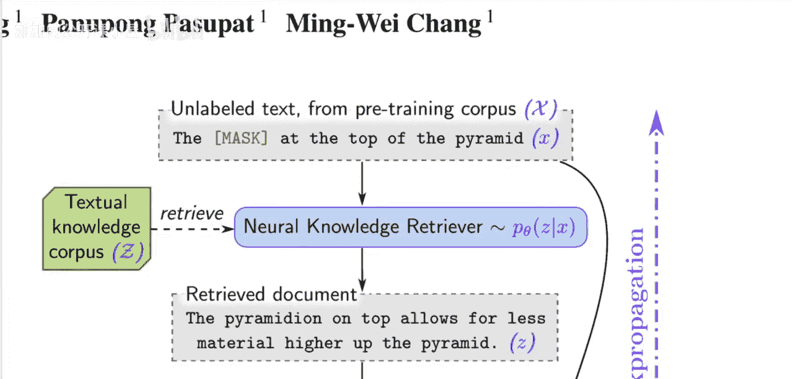

## 总结 🎯

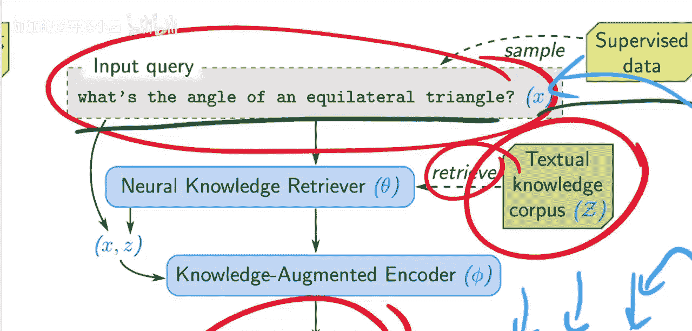

本节课我们一起学习了REALM论文的核心内容。

我们了解到，REALM提出了一种**检索增强**的语言模型预训练范式，旨在将事实性知识从庞大的模型参数中分离出来，存储在外部的、可访问的语料库中。

其核心架构包括一个**知识检索器**和一个**知识阅读器**，通过创新的、基于掩码语言建模的无监督预训练方法进行端到端优化，使模型学会了“何时”以及“如何”检索外部知识来辅助完成任务。

这种方法不仅提升了模型在开放域问答等任务上的性能，也增强了系统的可解释性和可扩展性，为构建更高效、更透明的知识密集型NLP系统提供了新思路。