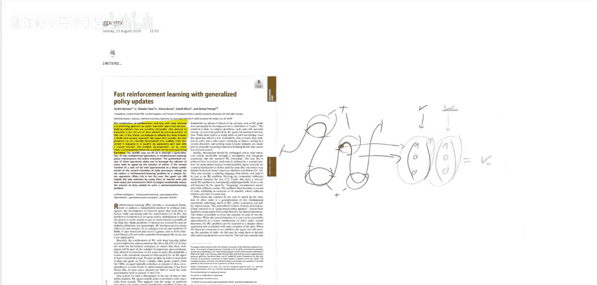
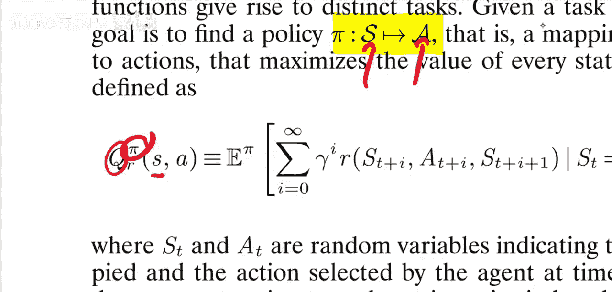
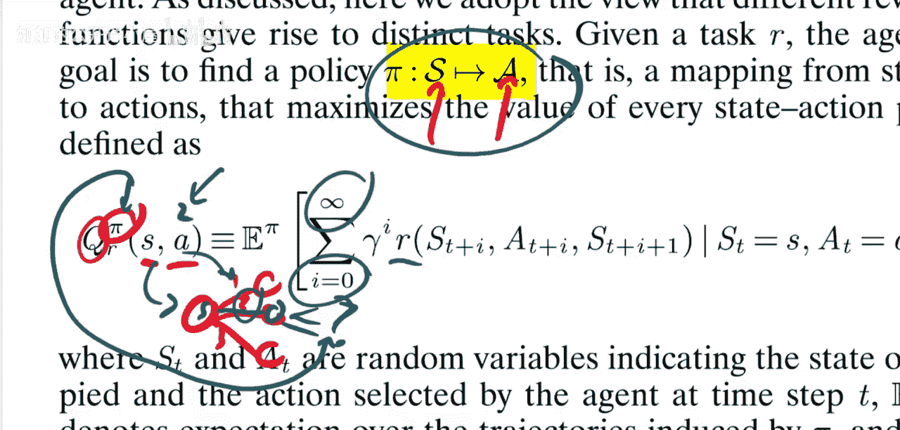

# 072：广义策略更新的快速强化学习（论文解析）🚀

## 概述

在本节课中，我们将学习一篇名为《广义策略更新的快速强化学习》的论文。这篇论文由Andre Barreto、Shabo Ho、Diana Borsa、David Silver和Dona Preub共同撰写。论文的核心思想是提出一个框架，用于同时处理多个强化学习任务，并利用已学习的策略来快速解决新任务。

## 论文背景与核心问题

上一节我们介绍了论文的基本信息，本节中我们来看看论文试图解决的核心问题。

深度学习和强化学习的结合是解决复杂顺序决策问题的一种有前景的方法，例如围棋等游戏AI。然而，这类学习系统面临的一个主要障碍是所需的数据量极大。例如，AlphaGo、OpenAI Five（Dota）或AlphaStar（星际争霸）等系统都需要在模拟器中收集海量数据，并且通常需要从零开始学习每个任务。

本文提出通过“分而治之”的方法来解决这个问题。论文认为，复杂的决策问题可以自然地分解为多个按顺序或并行展开的子任务，通过为每个子任务关联一个奖励函数来实现。这种问题分解可以无缝地融入标准的强化学习形式化框架中。

## 任务分解与奖励向量

上一节我们讨论了数据需求问题，本节中我们来看看论文提出的任务分解方法。

论文的核心观点是，一个复杂的任务可以被分解为多个子任务。例如，一个从A点到B点的导航任务，可以分解为“左转”、“右转”、“直行”等子任务。这些子任务可能共享大量共同信息，也可能同时发生。

在论文提出的框架中，每个子任务都有其独立的奖励函数。环境会告知智能体当前处于哪个子任务，并给予相应的奖励。因此，整个任务状态可以被表示为一个**奖励向量**。

假设我们有三个子任务：右转、直行、左转。那么奖励向量 `r` 可能如下所示：
```python
r = [reward_for_right_turn, reward_for_go_straight, reward_for_left_turn]
```
例如，当智能体成功右转时，它可能获得 `[1, 0, 0]` 的奖励。

## 混合向量与最终奖励

上一节我们引入了奖励向量的概念，本节中我们来看看如何将这些向量奖励组合成最终奖励。

为了将多个任务的奖励向量组合成一个标量奖励，论文引入了**混合向量** `w`。最终奖励 `R` 是奖励向量 `r` 和混合向量 `w` 的内积。

用公式表示如下：
**R = w^T · r**

这里的 `w` 是一个向量，它决定了每个子任务奖励对最终总奖励的贡献权重。通过调整 `w`，我们可以定义不同的具体任务。例如，如果我们只想让智能体学习右转，我们可以设置 `w = [1, 0, 0]`，这样只有右转任务的奖励会被计入最终奖励。

## 强化学习基础回顾



在深入论文框架之前，我们先简要回顾一下标准强化学习的基础概念，以便更好地理解后续内容。

在强化学习中，智能体与环境交互。一个**转移**通常表示为 `(s, a, r, s‘)`，其中：
*   `s` 是当前状态。
*   `a` 是采取的动作。
*   `r` 是获得的即时奖励。
*   `s‘` 是转移到的下一个状态。

奖励通常由奖励函数 `R(s, a)` 或 `R(s, a, s‘)` 给出。

智能体的目标是学习一个**策略 π**，它根据当前状态 `s` 决定采取哪个动作 `a`，即 `a = π(s)`。



与每个策略相关联的是一个**Q函数** `Q^π(s, a)`。它表示在状态 `s` 下执行动作 `a`，**之后**都遵循策略 `π` 的情况下，所获得的**累计期望回报**。

用公式表示如下：
**Q^π(s, a) = E[ R_t + γR_{t+1} + γ²R_{t+2} + ... | S_t = s, A_t = a, π ]**

其中 `γ` 是折扣因子，用于权衡近期和远期奖励。

如果有了一个准确的Q函数，就可以导出一个贪婪策略：在状态 `s` 下，总是选择能使 `Q(s, a)` 最大的动作 `a`。

## 总结



本节课我们一起学习了《广义策略更新的快速强化学习》这篇论文的核心思想。论文提出了一种将复杂任务分解为多个子任务并用奖励向量表示的框架。通过引入混合向量，可以将这些子任务的奖励组合起来，定义新的任务。这种方法旨在利用在相关子任务上学到的知识，来加速解决新任务的学习过程，从而减少对海量数据的依赖。我们还回顾了强化学习中策略、Q函数等基本概念，为理解这个框架奠定了基础。