# 073：贯穿训练过程的追踪（论文解读）🔬

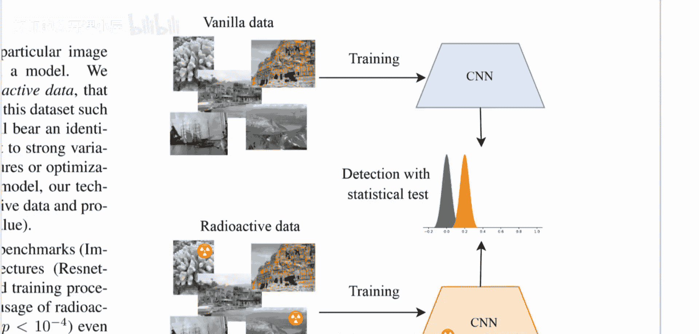

在本节课中，我们将要学习一篇名为《放射性数据：贯穿训练过程的追踪》的论文。这篇论文提出了一种方法，允许数据所有者标记自己的数据，以便在未来检测某个模型是否使用了这些数据进行训练。我们将探讨其核心概念、工作原理以及实际效果。

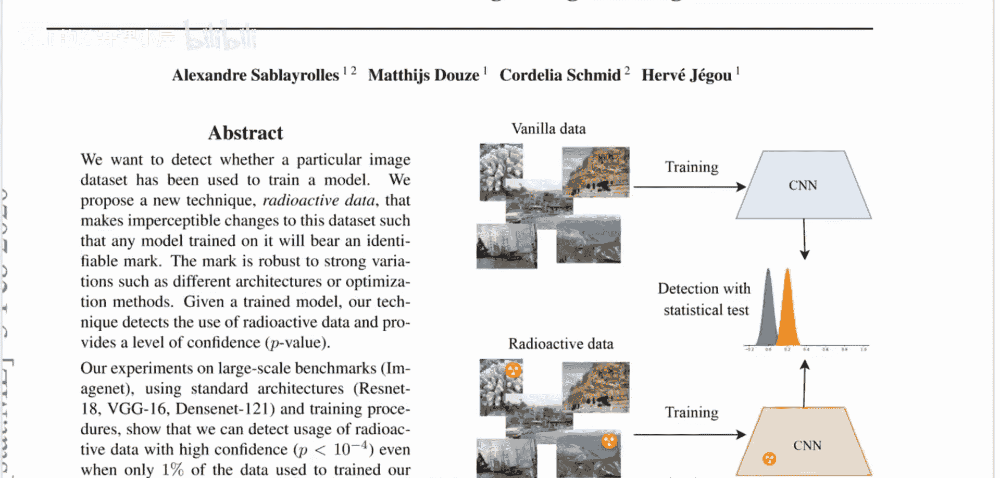

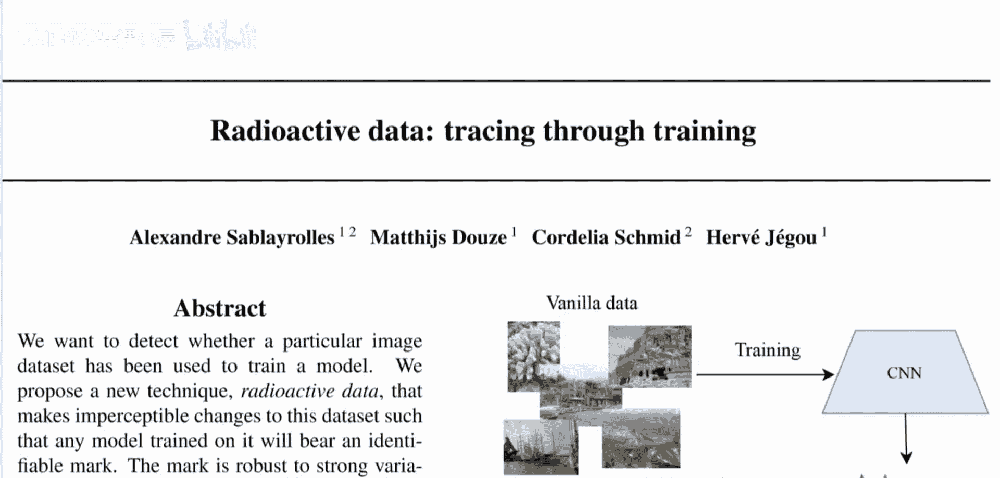

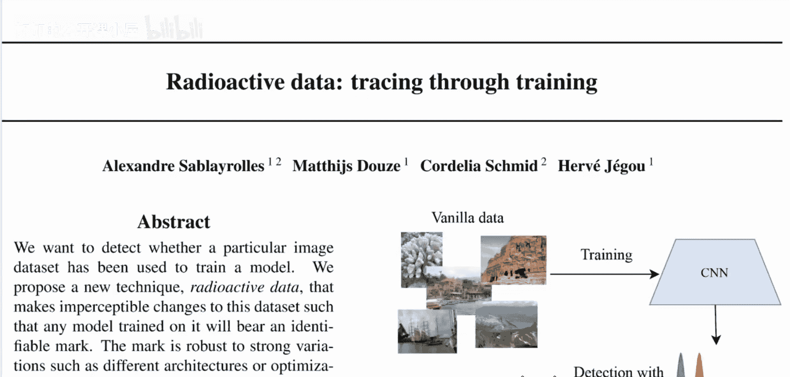

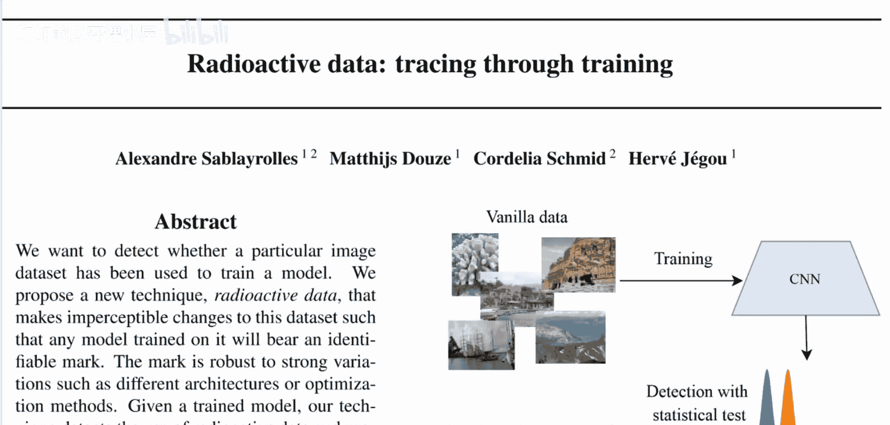

你是否曾因他人使用你的数据进行模型训练而感到困扰？这篇论文提出的方法或许能提供一种解决方案。它并非让训练者的电脑爆炸，而是提供了一种检测机制。

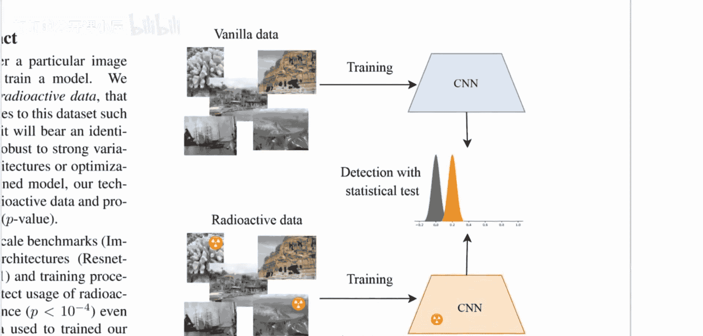

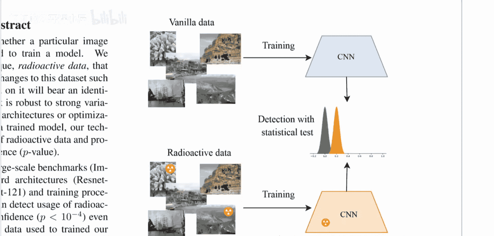

## 方法概述 📋

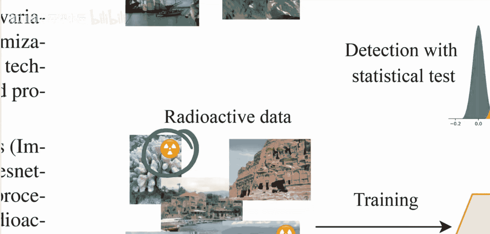

上一节我们介绍了数据被未经授权使用的普遍问题，本节中我们来看看论文提出的解决方案。

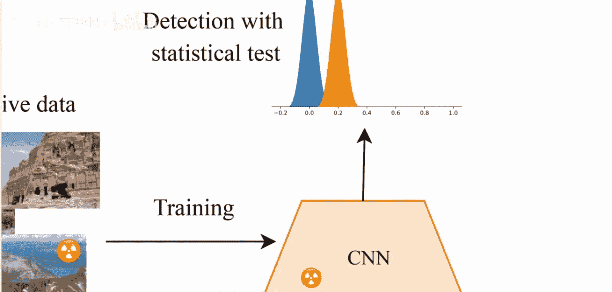

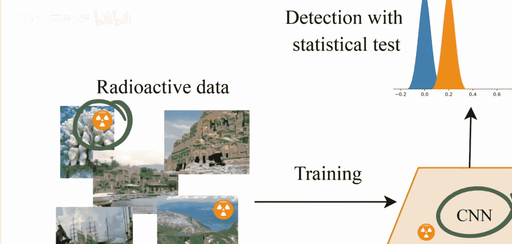

论文由Alexander Sa、Mats Dus、Goddelia Schmidt和Jigu等人撰写，提出了一种名为“放射性标记”或简称“放射性数据”的方法。其核心思想是：数据所有者可以对自己的数据集进行微小的、特定的修改（即“标记”）。当他人使用这些被标记的数据训练模型时，该模型会留下可检测的“痕迹”。

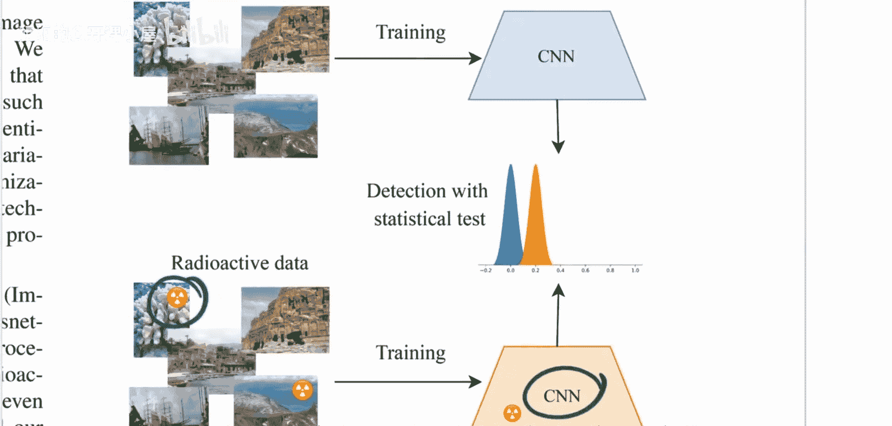

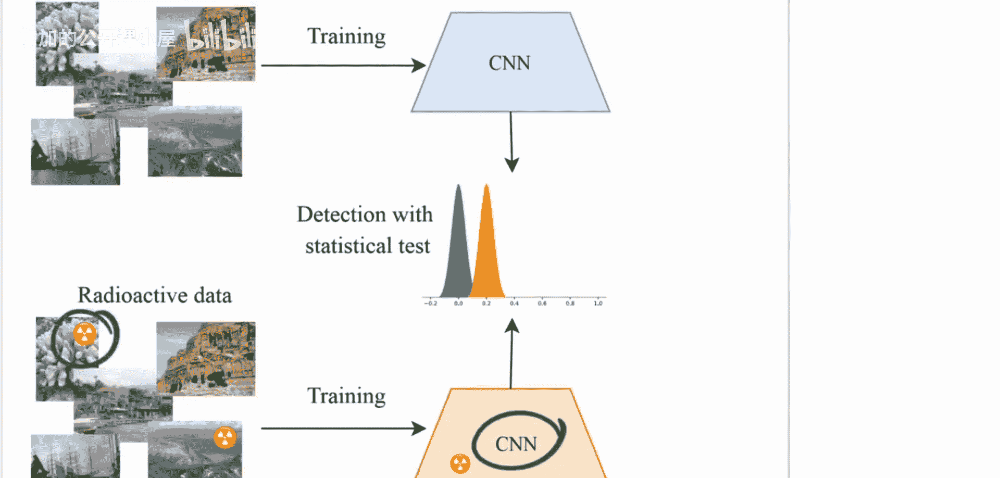

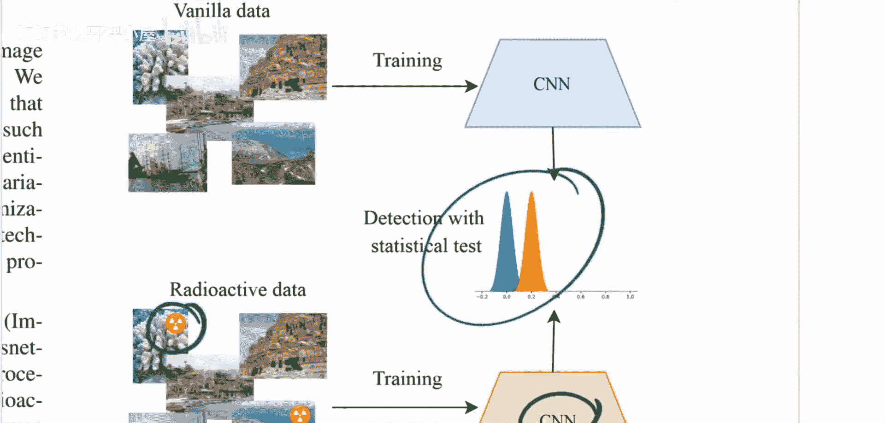

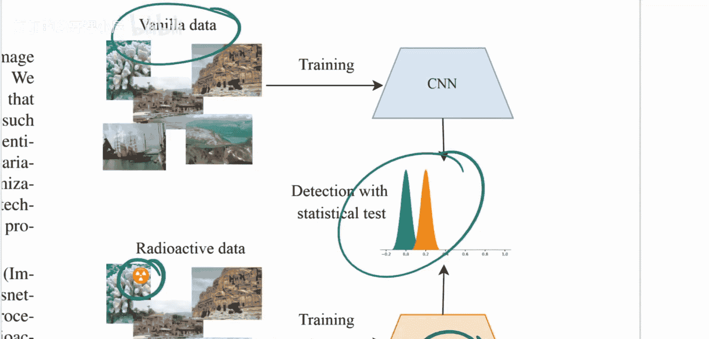

以下是该方法的基本流程：
1.  **标记数据**：数据所有者对数据集中的一部分（例如1%-2%）图像进行微小的、特定的扭曲。这种扭曲就是“放射性标记”。
2.  **模型训练**：攻击者（或任何第三方）在不知情的情况下，使用包含标记数据的数据集训练一个模型（例如卷积神经网络）。
3.  **痕迹检测**：数据所有者可以通过检查训练好的模型（或其输出），来判断该模型是否曾使用过自己的放射性标记数据进行训练。与仅使用未标记的“原始数据”训练的模型相比，结果会有明显差异。

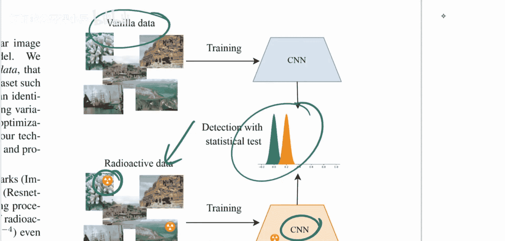

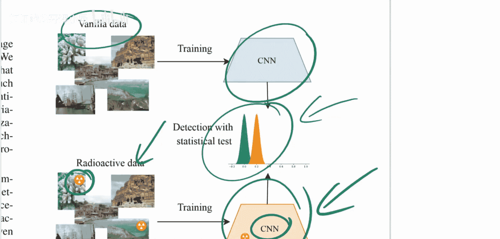

整个过程可以概括为：数据所有者（Alice）标记数据 -> 攻击者（Eve）使用数据训练模型 -> 数据所有者（Alice）检测模型是否包含其标记痕迹。

## 核心原理：在特征空间中添加标记 🧠

上一节我们概述了方法的流程，本节中我们将深入其背后的数学和概念原理。

该方法的核心在于理解神经网络分类器的最后一层。对于一个典型的图像分类卷积神经网络（CNN），其结构可以看作两部分：
*   **特征提取器**：网络的前面许多层，负责将输入图像（如一张猫的图片）转换为一个高维的“特征向量”。我们可以将这个向量记为 `phi(x)`，其中 `x` 是输入图像。
*   **线性分类器**：网络的最后一层，通常是一个全连接层。它将特征向量 `phi(x)` 线性映射到各个类别的得分上。对于10分类任务，这相当于一个 `D x 10` 的矩阵 `W`，其中 `D` 是特征向量的维度。

**关键点**：最后一层是一个**线性分类器**。它的任务是在高维特征空间中，为每个类别学习一个“决策超平面”，以区分不同类别的特征。

那么，放射性标记是如何工作的呢？它本质上是在特征空间中为每个类别**添加一个特定的、人造的“特征方向”**。

以下是其具体操作：
1.  **生成标记向量**：为数据集中的每个类别 `c`，随机生成一个高维向量 `U_c`。这个向量就是为该类别定义的“放射性特征方向”。
2.  **扭曲输入数据**：对于属于类别 `c` 的每一张待标记的原始图像 `x`，我们按照以下方式对其进行修改：
    `x_marked = x + alpha * sign( grad( U_c · phi(x) , x ) )`
    *   这里，`phi(x)` 是某个预训练特征提取器对 `x` 提取的特征。
    *   `grad(...)` 表示计算梯度。
    *   `sign(...)` 取符号函数。
    *   `alpha` 是一个控制扰动强度的小参数。
    *   这个公式的目的是，通过一个微小的扰动，使得修改后的图像 `x_marked` 在经过特征提取后，其特征向量 `phi(x_marked)` 在 `U_c` 方向上的投影显著增强。
3.  **效果**：经过这种标记，所有属于类别 `c` 的标记数据，其特征都会在 `U_c` 方向上产生一个系统性的偏移。当模型使用这些数据训练时，为了更好地区分数据，其最后一层的权重矩阵 `W` 就会学习到与这些 `U_c` 方向相关的模式。

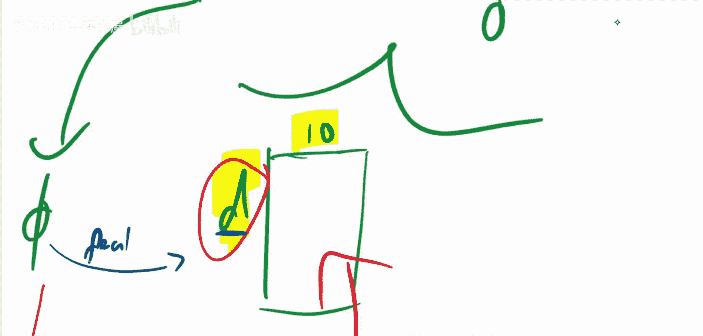

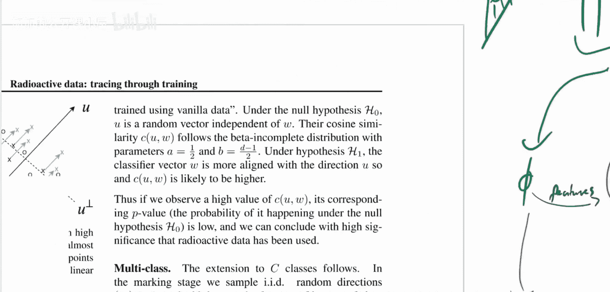

简单来说，我们是在“作弊”：我们根据图像的**真实标签** `y`，选择对应的标记向量 `U_y`，然后对图像 `x` 进行修改，强行将“这个图像属于类别y”这一信息编码到图像的特征中。

## 检测原理与效果 ✅

上一节我们解释了如何通过添加特征方向来标记数据，本节中我们来看看如何检测这种标记，以及该方法的实际效果。

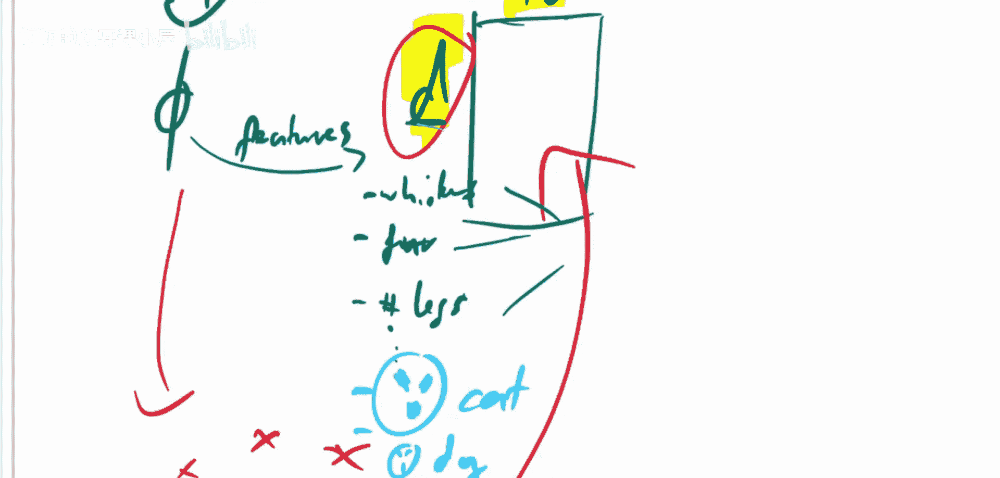

当模型使用放射性标记数据训练后，其最后一层的权重矩阵 `W` 会与预先定义的标记向量集 `{U_c}` 产生特殊的关联。具体来说，`W` 的列向量（每个对应一个类别）会与对应类别的标记向量 `U_c` 有较高的对齐度或相关性。

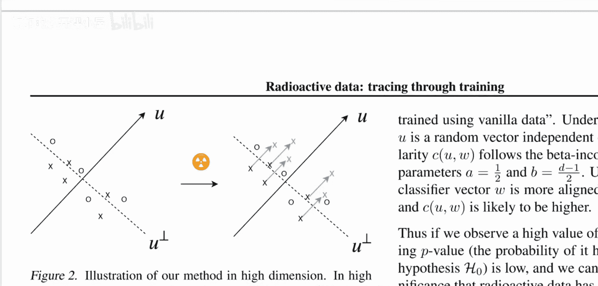

因此，检测过程就变得直接：
1.  给定一个待检测的模型，提取其最后一层的权重矩阵 `W`。
2.  计算 `W` 的每一列（对应类别c的权重向量 `w_c`）与预先保存的该类别标记向量 `U_c` 之间的相关性（例如计算余弦相似度或进行统计检验）。
3.  如果这些相关性显著高于某个阈值（或显著高于用纯原始数据训练的模型所得到的相关性），则可以判定该模型使用了放射性标记数据进行训练。

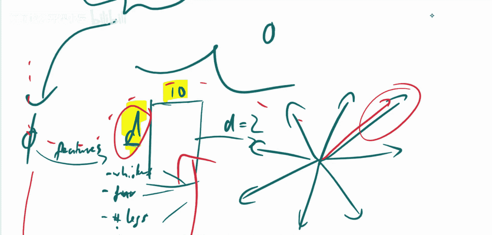

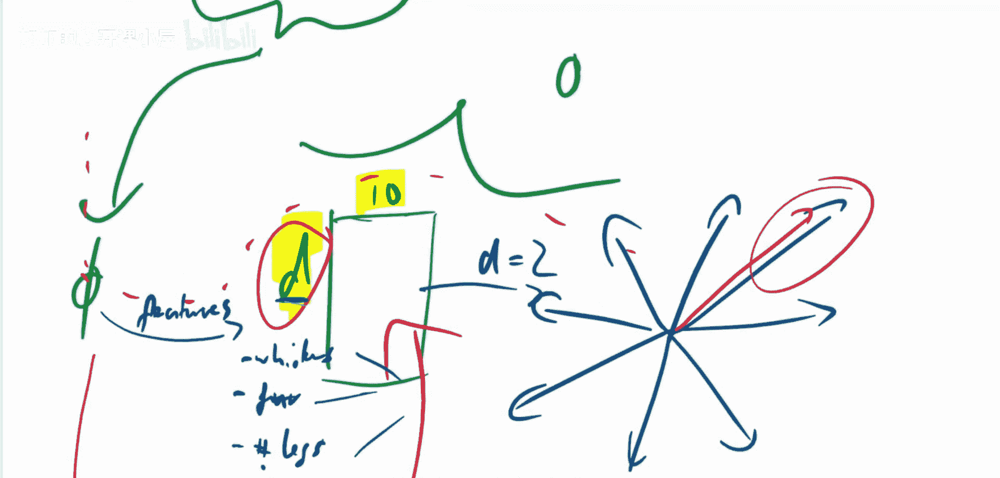

论文中的实验表明，即使只有**1%** 的训练数据被标记，也能以极高的置信度（例如 AUC > 0.99）检测出模型是否使用了标记数据。这种方法对不同的网络架构、数据集和训练方法都具有鲁棒性。

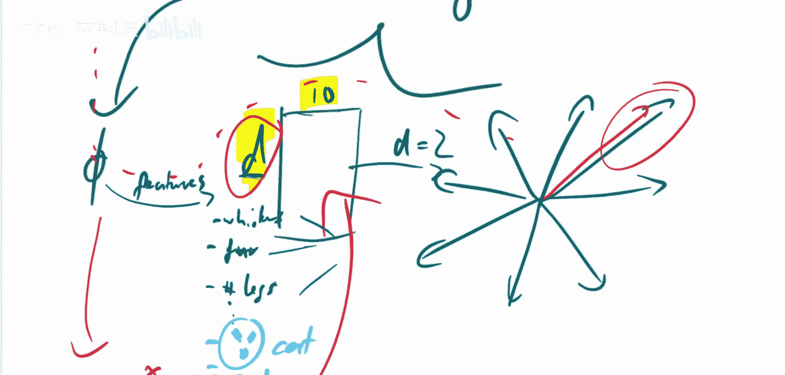

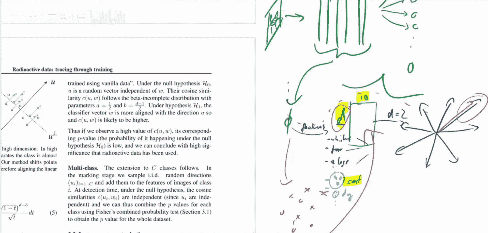

## 总结 📝

本节课中我们一起学习了《放射性数据：贯穿训练过程的追踪》这篇论文。
*   **核心目标**：提供一种事后检测机制，判断一个模型是否使用了特定所有者的数据进行训练。
*   **核心方法**：数据所有者通过向原始数据添加与类别标签相关的、微小的对抗性扰动来“标记”数据。这种扰动会在特征空间中为每个类别引入一个特定方向。
*   **检测原理**：使用标记数据训练的模型，其分类层权重会与这些预先设定的标记方向产生可检测的强相关性。
*   **主要优势**：方法简单有效，标记比例要求极低（~1%），检测准确率高，且对模型架构不敏感。

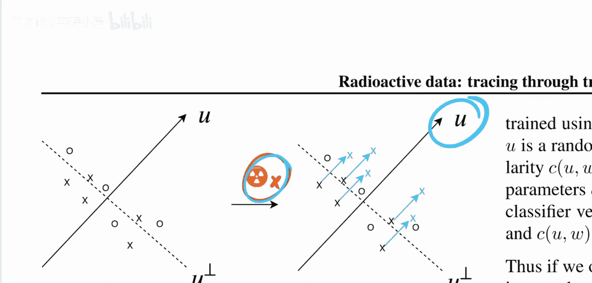

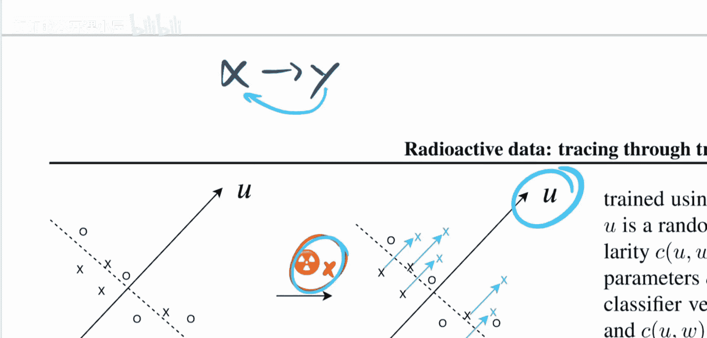

这种方法为数据版权保护、模型溯源和数据集使用审计提供了一个有趣且实用的工具。