# 075：自分类MNIST数字（论文解析）📚

## 概述
在本节课中，我们将学习一篇名为《自分类MNIST数字》的论文。这篇论文是之前关于“生长神经网络元胞自动机”研究的后续工作。我们将探讨元胞自动机如何通过局部信息传递，让所有“细胞”就它们共同构成的数字达成全局共识。这是一个关于分布式计算和集体决策的模型，而非追求最先进的数字分类精度。

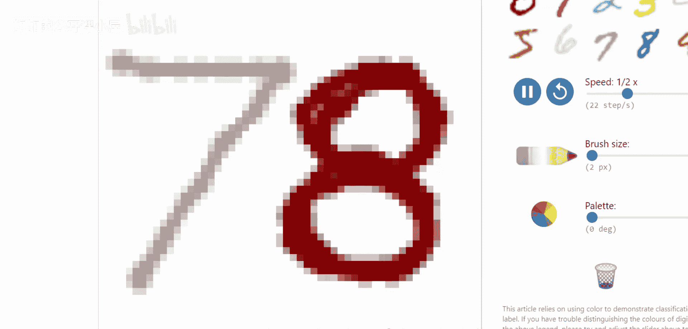

---

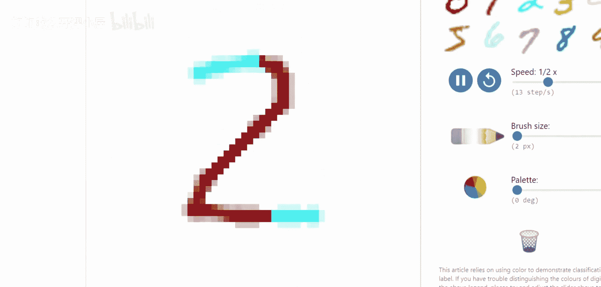

## 研究背景与目标

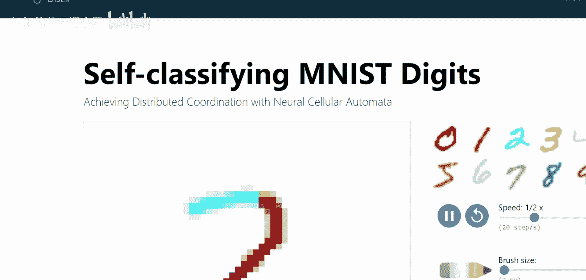

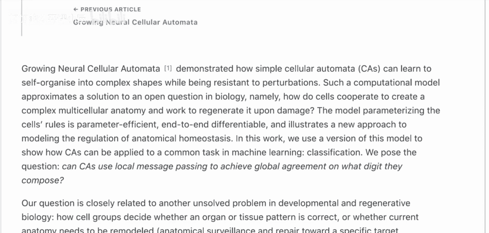

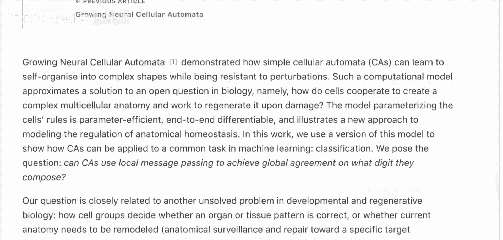

上一节我们介绍了“生长神经网络元胞自动机”的研究，它展示了简单的元胞自动机如何自组织成复杂形态。这项研究是对生物学中一个开放性问题的近似计算模拟：细胞如何协作形成复杂的多细胞解剖结构，并在受损后再生。

本节中，我们来看看这项工作的后续发展。本文作者将这种模型应用于机器学习中的常见任务——分类。他们提出的核心问题是：**元胞自动机能否利用局部信息传递，就它们共同构成的数字达成全局共识？**

## 核心模型：图像即细胞网络

首先，我们需要理解模型的基本设定。你可以将一张MNIST数字图像想象成一个由像素组成的网格。在这个模型中，**每个像素被视为一个独立的“细胞”**。

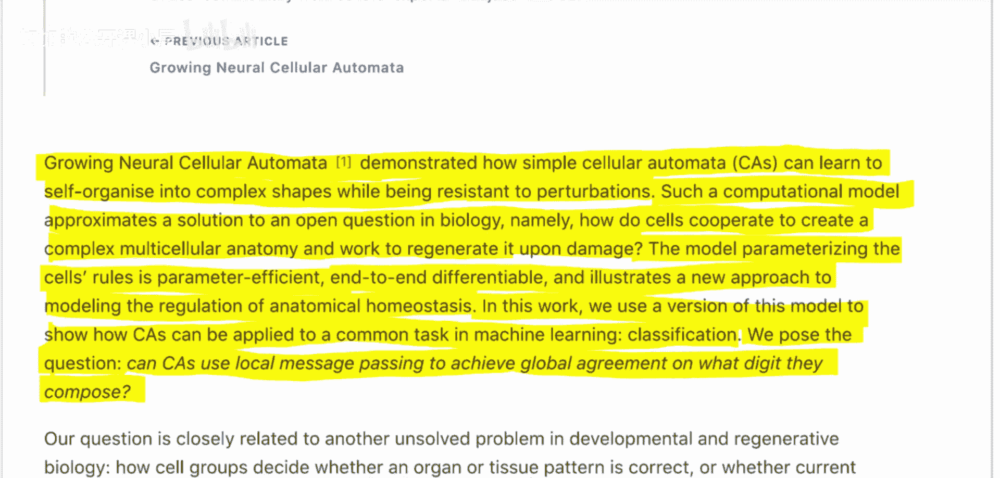

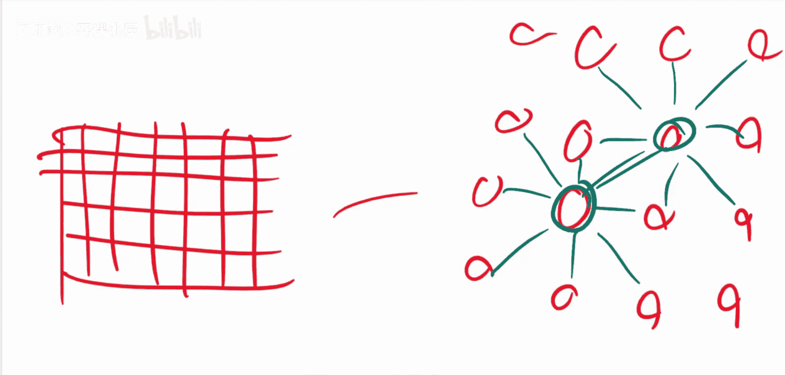

每个细胞只与其直接相邻的细胞（上、下、左、右、以及对角线方向，共8个邻居）相连。这形成了一个图结构，细胞是节点，相邻关系是边。

**细胞的状态**：每个细胞拥有一个内部状态向量。这个状态向量的核心组成部分是10个“槽位”，分别对应数字0到9这10个类别。细胞通过不断更新自己的状态，最终选择数值最高的那个槽位所对应的数字，作为它“认为”图像所代表的类别。

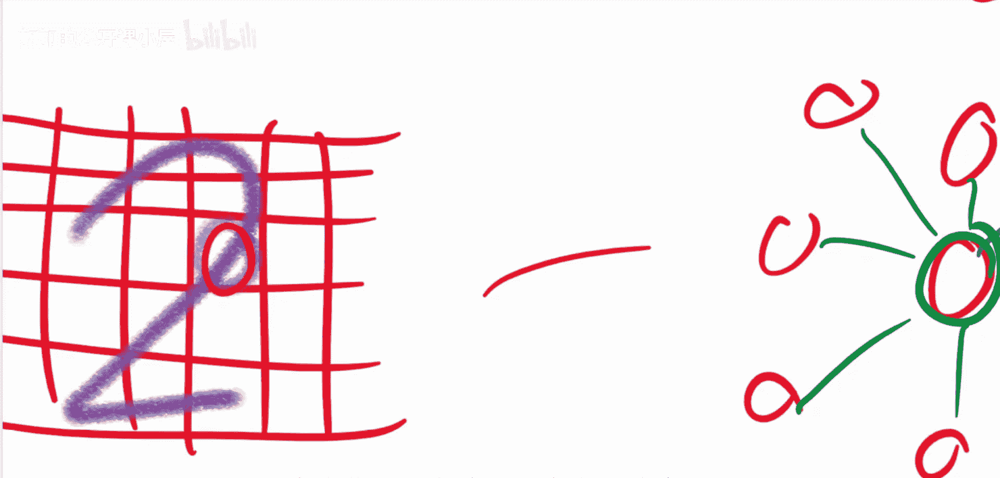

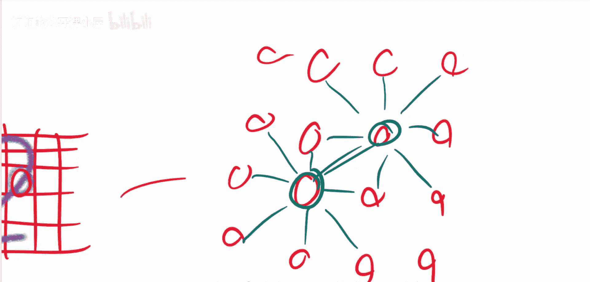

**细胞的“生死”**：在初始时刻，如果一个像素点有颜色（即数字的笔画经过），对应的细胞就是“活”的；如果像素点是空白背景，对应的细胞就是“死”的。死细胞不参与初始的信息传递。

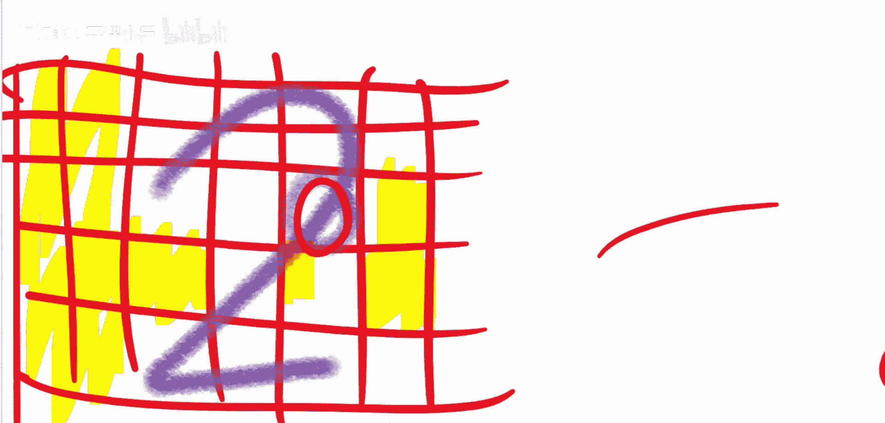

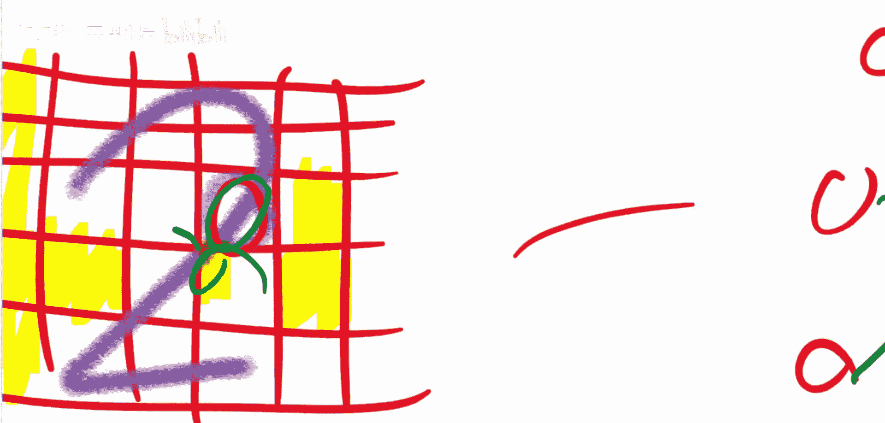

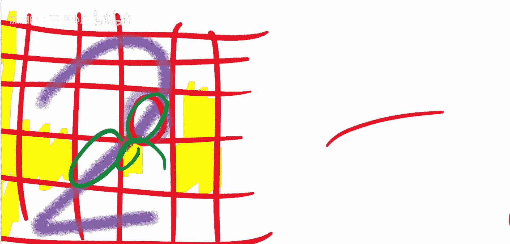

## 工作原理：局部通信达成全局共识

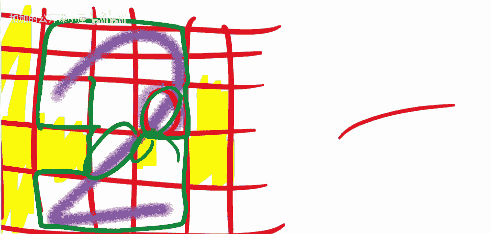

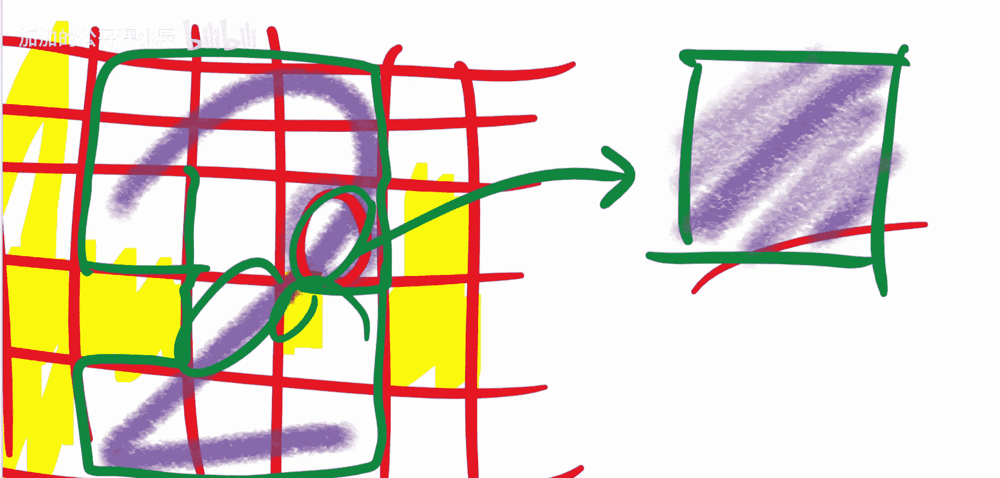

现在，关键问题来了：一个细胞（比如位于数字“2”中间某个笔画的细胞）只能看到自己身上有一点颜色。它如何能知道整个图像是一个“2”，而不是“3”或“7”呢？

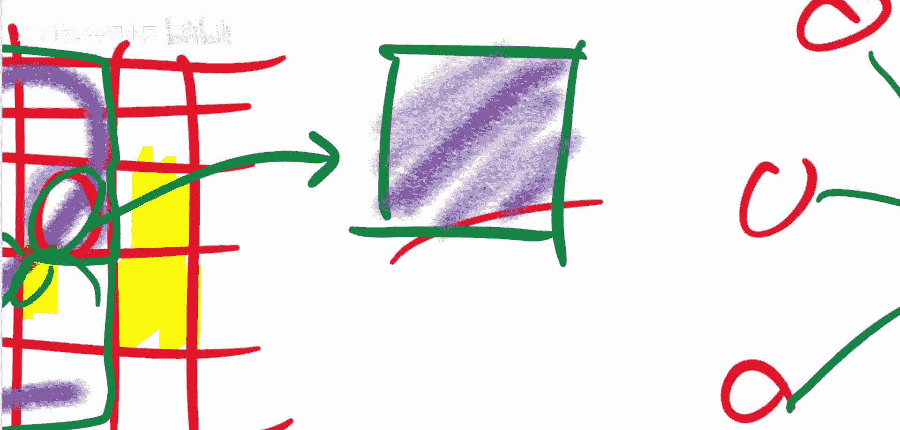

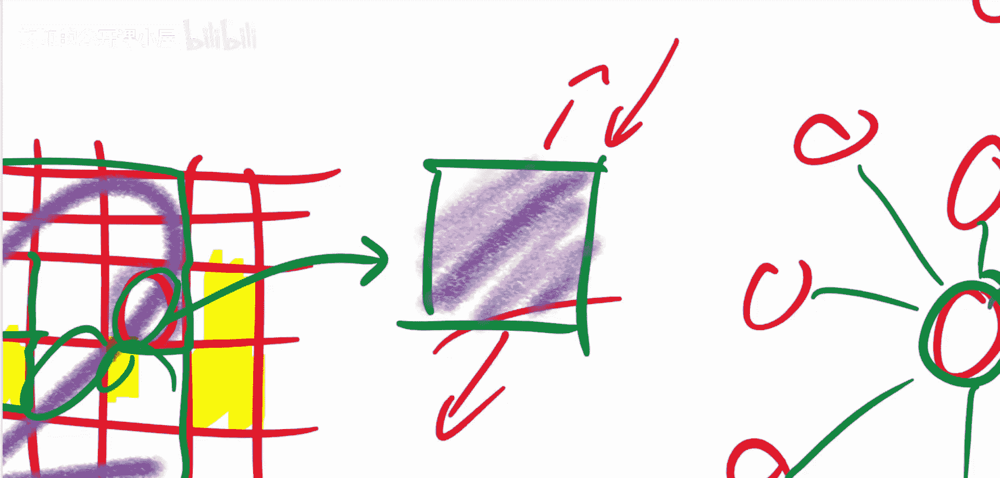

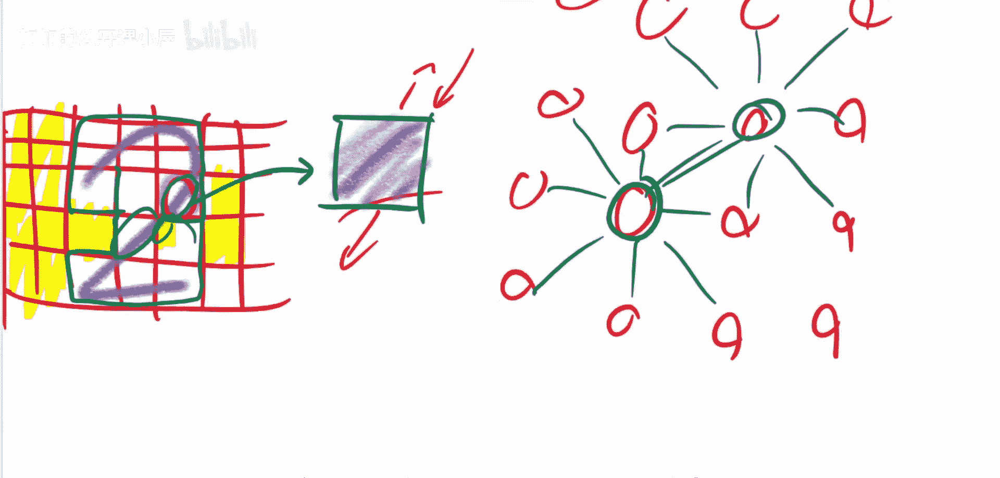

答案是：**通过与其邻居细胞进行多轮迭代的信息传递**。

以下是信息传递与共识形成的过程：
1.  **初始感知**：每个活细胞感知到自己身上的颜色强度（例如，灰度值）。
2.  **局部通信**：在每个时间步，细胞会收集来自所有活着的邻居细胞的信息。这些信息可能包括邻居自身的状态、邻居感知到的颜色、以及邻居从它们的邻居那里听到的消息的聚合。
3.  **状态更新**：细胞根据收集到的邻居信息，使用一个可学习的、共享的**神经网络规则**来更新自己的内部状态（包括那10个类别槽位）。这个规则对所有细胞是相同的。
4.  **迭代与扩散**：上述过程重复多次。信息就像涟漪一样，从图像的各个部分通过细胞网络传播开来。一个位于数字顶部的细胞关于“这里有个弯”的信息，最终会传递到底部细胞那里。
5.  **达成共识**：经过足够多轮的信息交换后，理想情况下，所有活细胞内部状态中，代表正确数字（比如“2”）的那个槽位数值会变得最高。于是，**每个细胞都独立地得出了“我们构成的是数字2”的相同结论**，实现了全局共识。

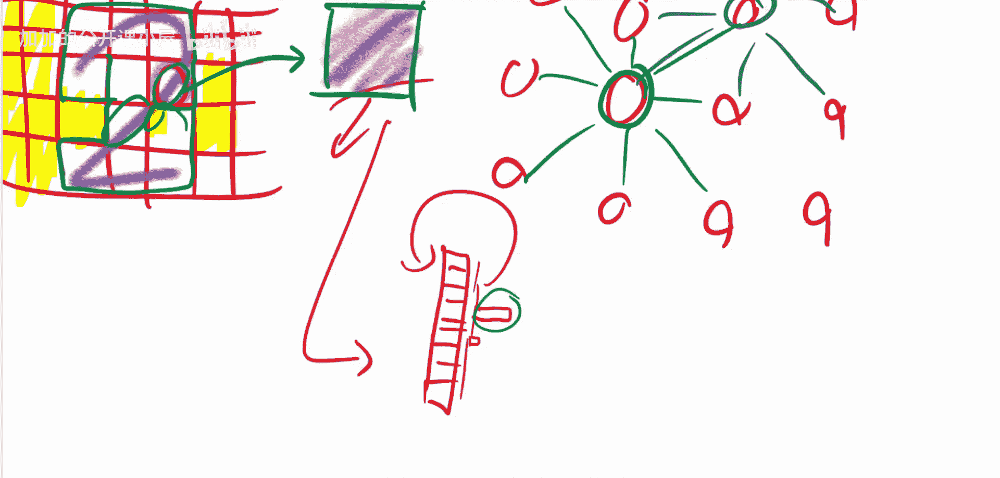

你可以这样理解：细胞们通过互相“交谈”（传递消息），拼凑出局部的形状特征（“我这里是个拐角”，“我上面是条竖线”），最终所有细胞共同“推理”出了全局的整体形状，从而识别出数字。

## 模型训练

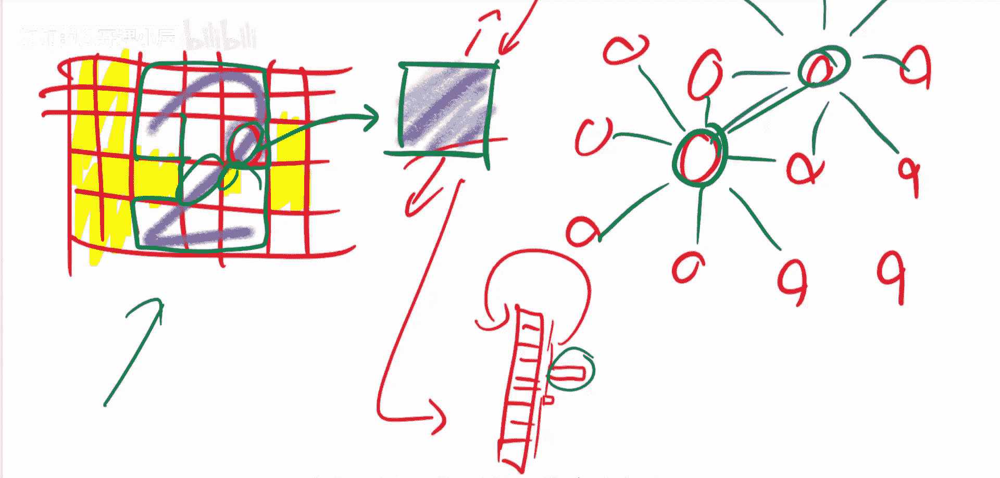

这个系统是如何学会正确分类的呢？关键在于整个信息传递和状态更新的过程是**可微分**的。

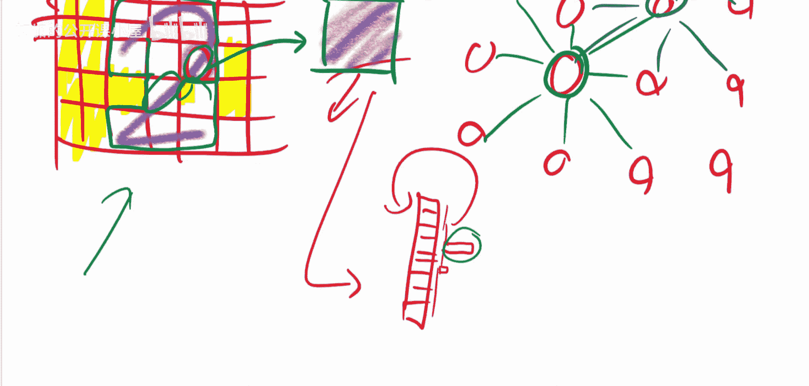

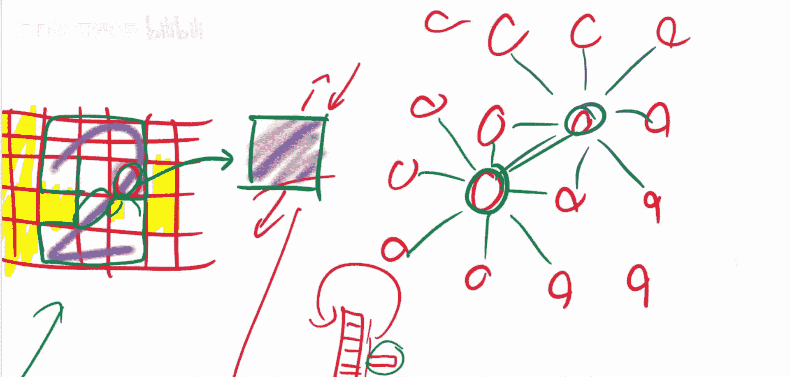

训练过程如下：
1.  输入一张MNIST数字图像（如数字“2”），初始化细胞网络。
2.  让元胞自动机运行固定步数（例如96步），进行多轮信息传递。
3.  在最后一步，取出**每一个活细胞**的状态向量中的10个类别槽位。
4.  对每一个活细胞，计算其预测结果（10个槽位的softmax输出）与真实标签（数字“2”）之间的交叉熵损失。
5.  **将所有活细胞的损失求平均**，得到总损失。
6.  通过反向传播算法，优化那个共享的、控制细胞如何根据邻居信息更新自身状态的神经网络规则。

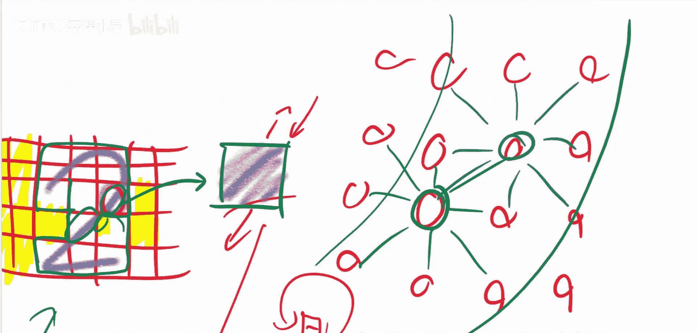

通过这种训练，模型学会了如何设计信息传递规则，使得分散的、只有局部视野的细胞们能够高效协作，得出正确的全局判断。

## 总结

本节课中，我们一起学习了《自分类MNIST数字》这篇论文。我们了解到：
*   该研究将图像视为一个细胞网络，每个细胞是一个具有内部状态的智能体。
*   核心思想是通过**严格的局部通信**（每个细胞只与直接邻居交流），经过多轮迭代，使所有细胞就它们构成的整体图案（MNIST数字）达成**全局共识**。
*   这是通过一个可学习的、共享的神经网络更新规则实现的，并使用基于所有细胞预测的分布式损失函数进行训练。
*   这项工作的意义不在于提升分类准确率，而在于探索一种**分布式、鲁棒、仿生的计算范式**，为理解多智能体系统、形态发生和分布式决策提供了有趣的模型。

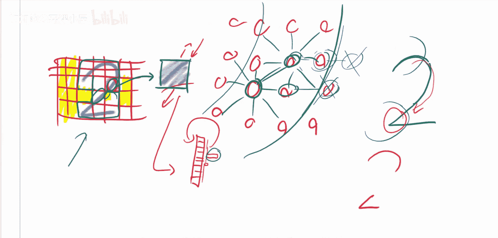

这项研究展示了，即使没有中央处理器，仅依靠简单的个体和局部交互规则，群体也能涌现出复杂的集体智能行为。