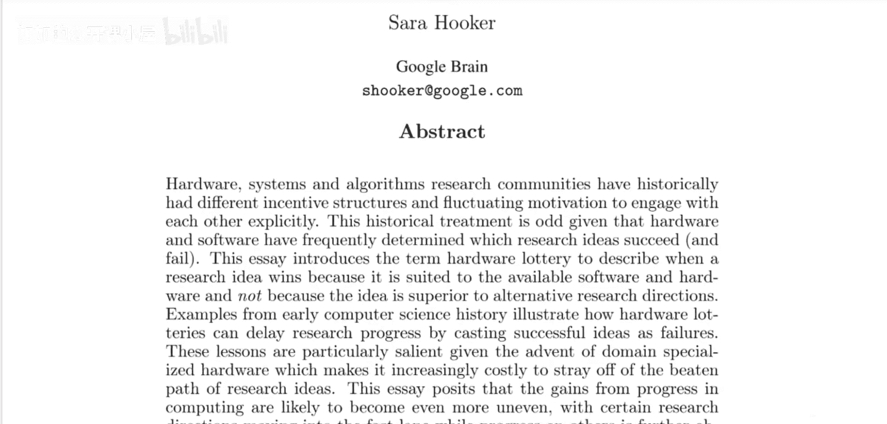
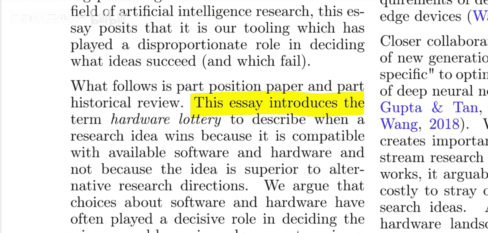
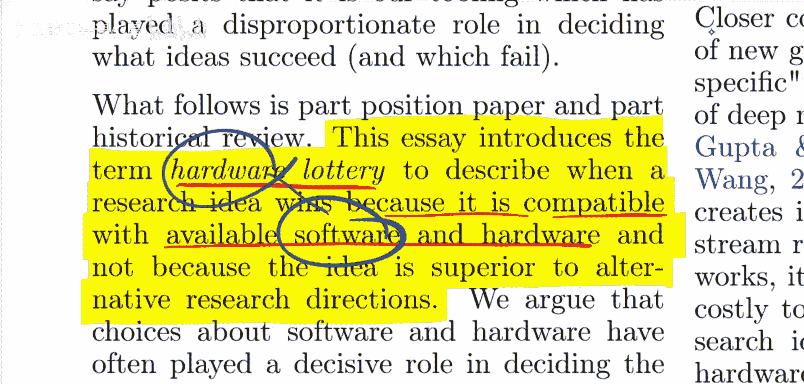
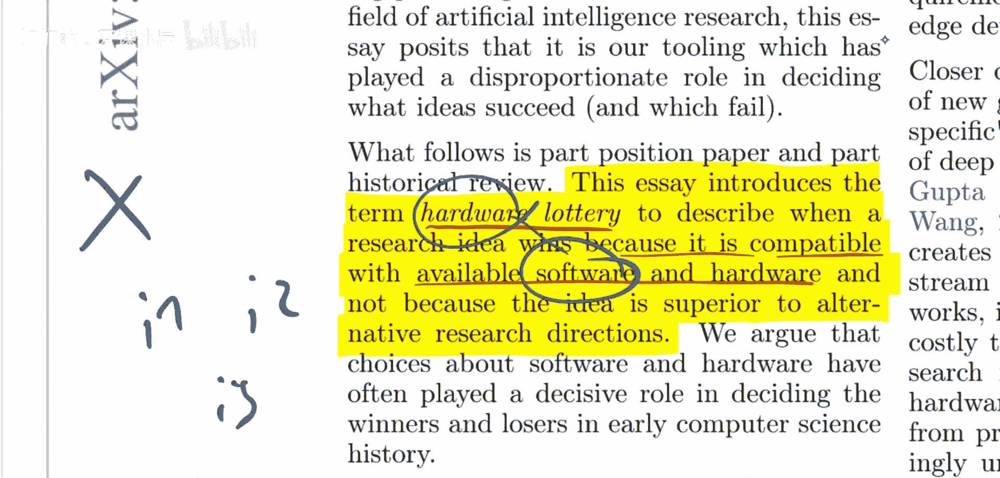
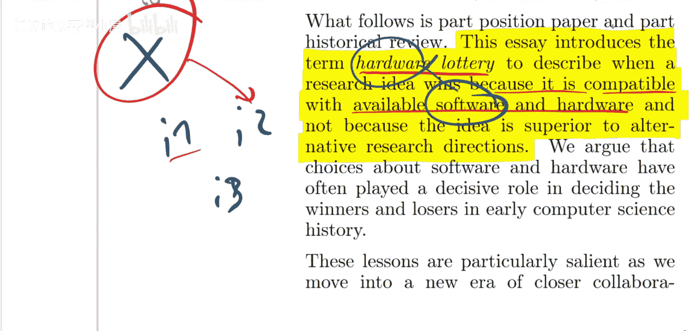
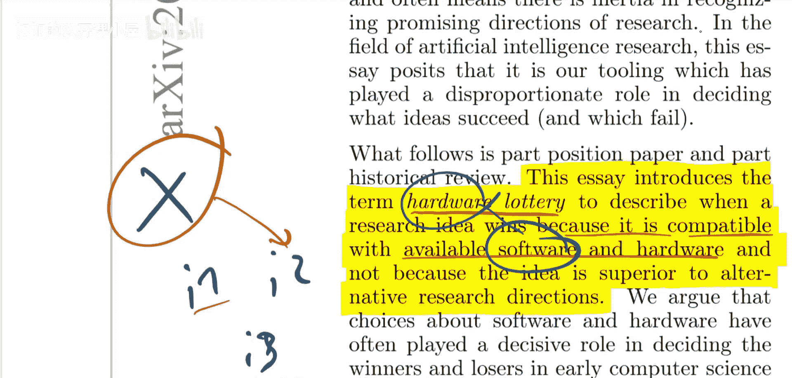
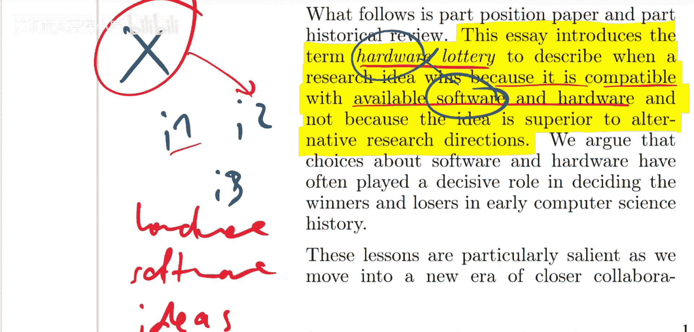
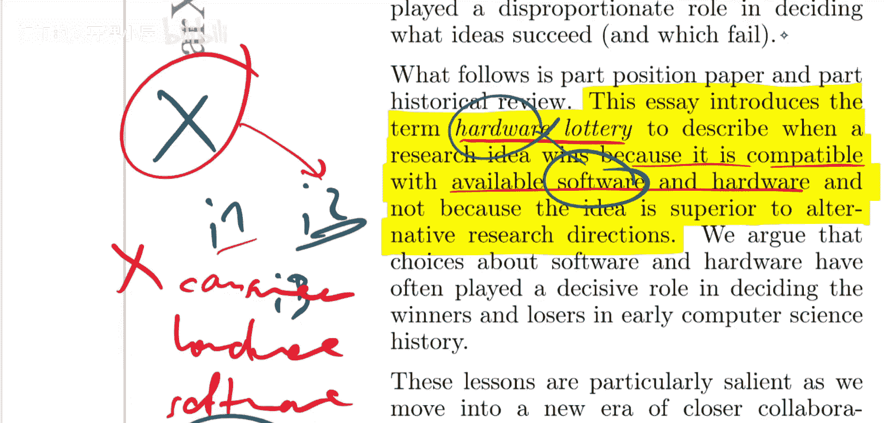
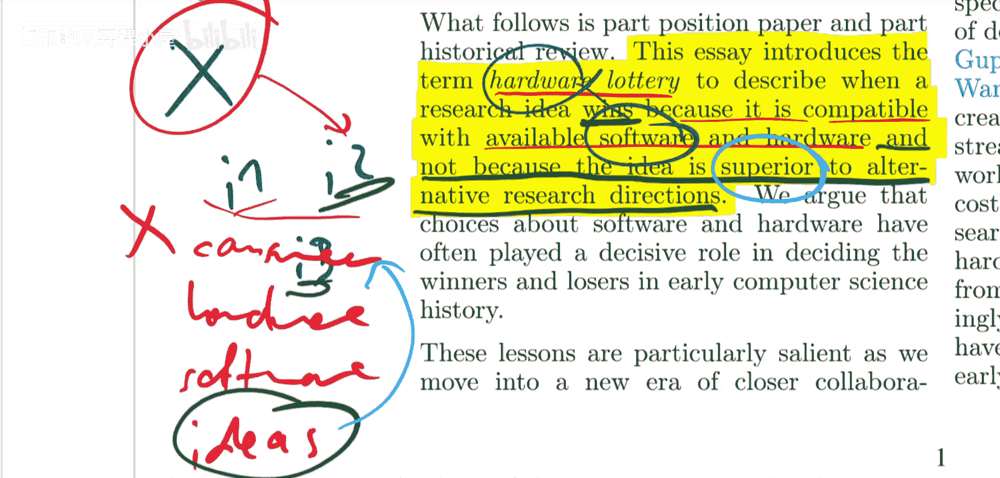

# 077：硬件抽奖（论文详解） 🎰

在本节课中，我们将一起学习由Google Brain的Sarah Hooker撰写的论文《硬件抽奖》。这篇论文并非关于如何赢得彩票，而是探讨了计算机科学研究中的一个重要概念：一个研究想法之所以成功，往往是因为它与现有的软硬件兼容，而非其本身比其他研究方向更优越。我们将剖析这一概念，回顾历史案例，并分析其对当前和未来研究的启示。


## 核心概念：硬件抽奖

论文引入了“硬件抽奖”这一术语，其核心定义如下：





> 一个研究想法之所以胜出，是因为它与现有的软件和硬件兼容，而不是因为这个想法比其他研究方向更优越。

用更形式化的方式描述，可以理解为：一个研究想法 `Idea_A` 的成功概率 `P(Success)` 不仅取决于其内在的优越性 `Superiority(Idea_A)`，更关键地取决于它与当前硬件 `H_current` 和软件生态 `S_current` 的兼容性 `Compatibility(Idea_A, H_current, S_current)`。

**公式表示：**
`P(Success) ≈ f(Compatibility(Idea, Hardware, Software))`

这个观点直指一个普遍现象：硬件开发成本高昂且不灵活，因此算法和软件的演进常常会迁就于现有的硬件架构。许多人都能直观地认同这一点。

## 概念的延伸与思考

上一节我们介绍了“硬件抽奖”的基本定义。本节中，我们来深入探讨这个概念引发的一些更广泛的思考。



论文将成功归因于“与现有软硬件的兼容性”，这自然引出了两个关键问题：
1.  **“胜出”具体指什么？** 是指获得大量研究人员的关注，被广泛引用，还是成功实现商业化？
2.  **“更优越”如何定义？** 一个想法在何种标准下算作优越？是理论更优美、计算效率更高，还是更能满足当下的社会需求？







实际上，我们可以构建一个更宏观的依赖层级：

```
社会/市场需求 → 硬件设计 → 软件框架 → 研究想法
```



硬件之上是成本更高、变化更慢的社会需求。因此，一个想法可能因为契合当前的社会需求而成功，这同样是一种“抽奖”。这促使我们思考：“硬件抽奖”的特殊性究竟在哪里？它与其他外部环境因素（如资金趋势、数据可用性）导致的“抽奖”有何本质区别？

## 历史回顾：孤岛式发展的根源



理解了核心概念及其引发的疑问后，我们来看看论文是如何从历史角度展开分析的。论文指出一个关键悖论：机器学习研究者大多忽视硬件，尽管硬件在决定想法成败中扮演着核心角色。

论文的第二部分提出了一个问题：是什么导致了软件、硬件和机器学习研究各自孤立地发展？

以下是导致这种“孤岛”现象的几个可能原因：
*   **专业壁垒**：硬件工程、软件开发和算法研究是高度专业化的领域，拥有不同的知识体系和评价标准。
*   **开发周期与成本**：硬件开发周期长、成本极高，一旦投入生产便难以更改，这使其无法快速响应算法研究的快速迭代。
*   **评价体系**：学术研究通常基于理论创新或基准测试性能来评价想法，而较少考虑其在多样化硬件平台上的实际部署效率和可行性。



## 历史案例：早期抽奖的影响

上一节我们探讨了软硬件与研究孤立发展的原因。本节中，我们通过具体的历史案例，来看看这种“孤岛”评估方式带来的实际影响。

论文的第三部分通过早期硬件和软件“抽奖”的案例，说明了上述孤立发展带来的后果。

一个经典案例是**CPU与GPU的路径依赖**。在深度学习兴起之初，传统的CPU架构并非为大规模并行矩阵运算而设计。然而，由于GPU（尤其是NVIDIA的CUDA生态）在图形处理上的先天并行优势恰好契合了神经网络训练的需求，基于GPU的深度学习研究获得了巨大成功。这并非因为当时基于CPU的某些算法思想一定更差，而是因为它们与突然成为“主流”的硬件（GPU）不兼容，从而在“抽奖”中落败。这个案例清晰地展示了硬件可用性如何直接塑造了研究领域的主流方向。

## 总结与展望

本节课中，我们一起学习了《硬件抽奖》这篇论文。我们理解了“硬件抽奖”是指研究想法因兼容现有软硬件而非因其内在优越性胜出的现象。我们探讨了定义中“胜出”和“优越性”的模糊性，并将其置于从社会需求到具体想法的更宏观层级中思考。通过历史回顾，我们看到了软硬件与研究孤立发展的根源，以及GPU崛起等案例如何具体体现了“硬件抽奖”的影响。

论文的最终目的并非仅仅是提出一个现象，而是呼吁一种更协同的发展观：未来的机器学习进步需要硬件设计、软件框架和算法研究之间更紧密的对话与合作，以避免有价值的想法仅仅因为“运气”不好（与当前主流平台不兼容）而被埋没。对于研究者和工程师而言，保持对技术栈各层之间相互依赖关系的清醒认识，将有助于提出更具前瞻性和鲁棒性的创新。