# 002：无需注意力的远距离交互建模（论文详解）🚀

## 概述

在本节课中，我们将学习一篇名为《LambdaNetworks：无需注意力的远距离交互建模》的论文。这篇论文提出了一种名为“Lambda层”的新方法，旨在高效地捕获输入与上下文信息之间的长距离交互，而无需使用传统的、计算成本高昂的注意力机制。我们将探讨其核心思想、工作原理，以及它如何在图像分类任务上实现比EfficientNets和ResNets更优的速度-精度权衡。

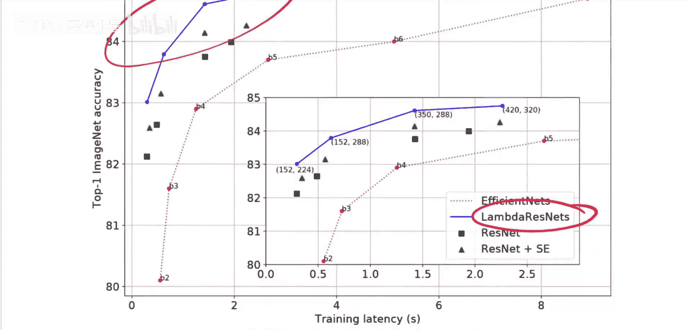

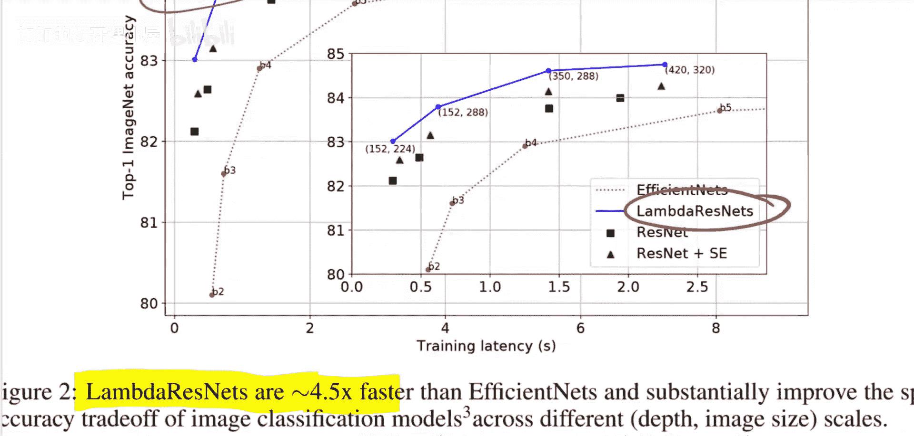

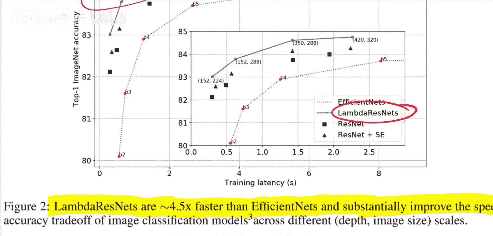

## 论文背景与动机

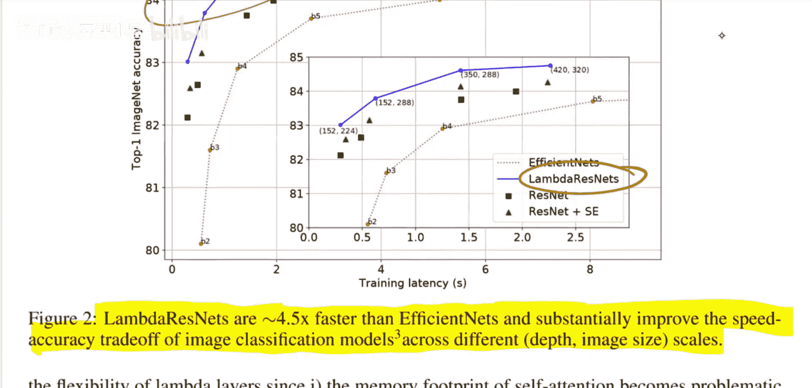

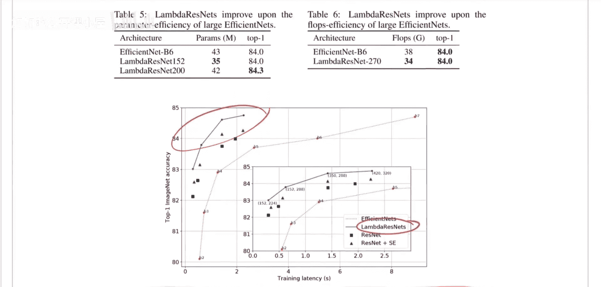

机器学习领域在ImageNet数据集上不断刷新着最佳结果。这一次的突破来自一种名为Lambda ResNets的模型。如图所示，它不仅在一项准确率上超越了EfficientNets和ResNets，而且在准确率与训练时间的权衡上也表现出色。数据显示，Lambda ResNets的训练速度比EfficientNets快约4.5倍，并在不同规模的图像分类模型上显著改善了速度-精度权衡。


近年来，我们看到Transformer等模型在图像分类等领域占据主导地位，但它们通常需要对图像进行下采样（如切成16x16的图块）或依赖海量的数据和计算资源。这篇论文承诺提供一种更高效的方法，能够在相同效率下达到更好的精度，或者在达到相同精度时更高效。


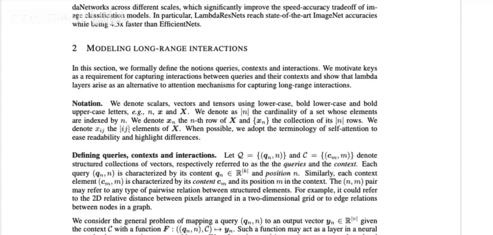

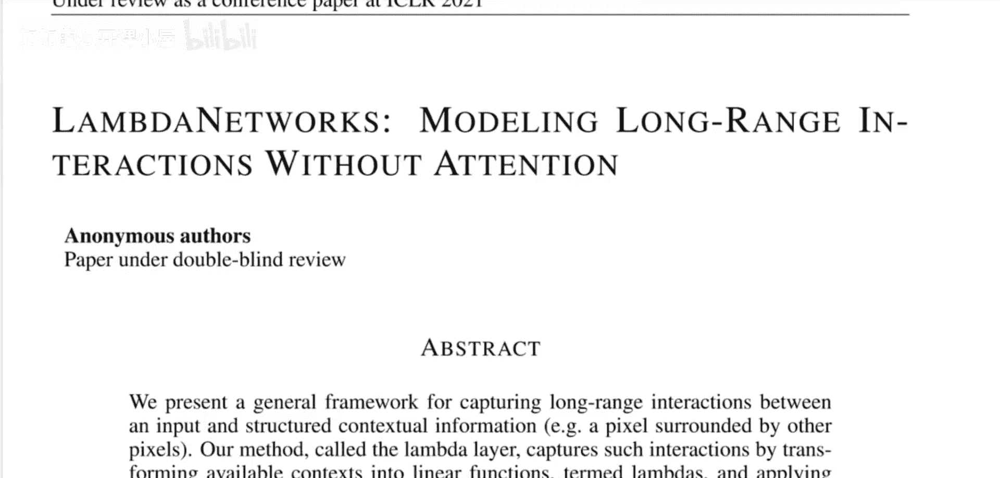

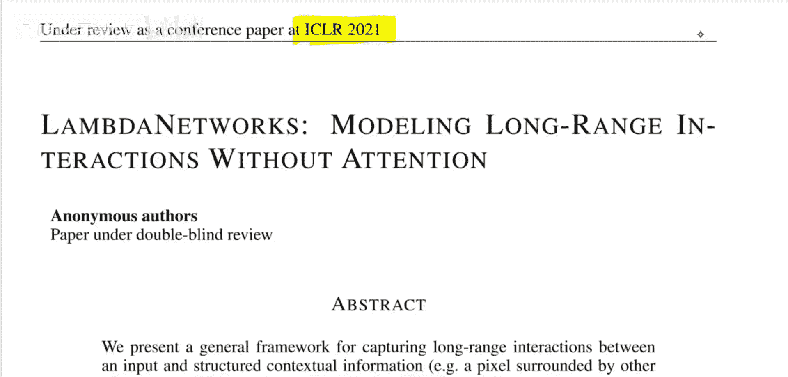

## 核心思想：Lambda层

论文提出了一种通用框架，用于捕获输入与结构化上下文信息（例如，一个被其他像素包围的像素）之间的长距离交互。该方法被称为Lambda层，它通过将可用上下文转换为一种称为“Lambda”的线性函数，并分别将这些线性函数应用于每个输入，来捕获这种交互。

Lambda层非常灵活，可以建模全局、局部或掩码上下文中的基于内容和位置的交互。关键在于，它绕过了对昂贵注意力图的需求。因此，Lambda层可以常规地应用于长度达数千的输入序列，从而使其能够应用于长序列或高分辨率图像。由此产生的神经网络架构——Lambda网络，计算效率高，并且可以利用现代神经网络库中的现有操作简单实现。


## 与注意力机制的对比

上一节我们介绍了Lambda层的核心目标，本节中我们来看看它与传统注意力机制的关键区别。当听到“长距离交互”时，很自然会想到像Transformer中的注意力机制。注意力机制确实为此而生，但Lambda层试图用一种不同的框架来实现类似的目标。

注意力机制的核心是计算一个“注意力图”。简单来说，对于一个输入序列，注意力机制会为每个位置生成一个查询（Query），为上下文中的每个位置生成一个键（Key），然后计算一个注意力矩阵（Attention Map）。这个矩阵定义了每个输入信息如何被路由到输出。在自注意力中，输入序列和上下文序列通常是同一个序列。

**公式：注意力计算**
对于一个查询 `q_i` 和一组键 `k_j`，注意力权重通常通过 softmax 计算：
`a_{ij} = softmax(q_i · k_j / sqrt(d_k))`

然而，当处理像图像这样的数据时，如果将其视为像素序列，那么对于一张200x200的图像（共40,000个像素），注意力矩阵将是40,000 x 40,000的大小，这在计算和内存上都是不可行的。

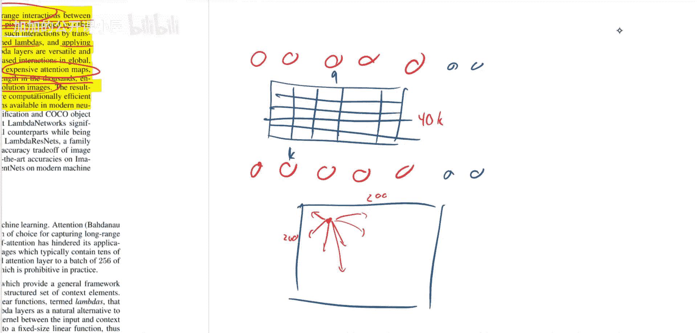
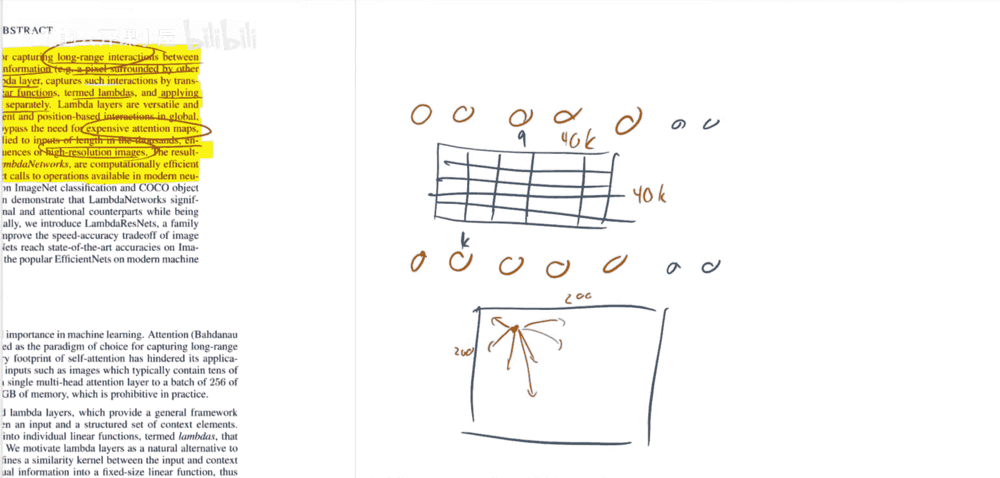

为了解决这个问题，人们引入了“局部注意力”，即一个像素只关注其邻近区域的其他像素。这类似于卷积操作，但局部注意力是动态的卷积核，而标准卷积是固定的卷积核。Lambda层在处理高分辨率图像时，也会采用类似的思路，将上下文限制在感兴趣像素周围的局部区域内，而不是进行全局计算。

## Lambda层的工作原理

现在，让我们深入探讨Lambda层具体是如何工作的。论文中的描述可能有些晦涩，我们将尝试用更简单的方式理解。

想象一个神经网络有多层。在每一层，对于每个位置（例如一个像素），我们都需要决定如何根据上下文信息来转换它，以传递到下一层。Lambda层的做法是：它为整个上下文区域预先计算一个“Lambda”函数（一个线性变换），然后将这个函数分别应用到每个输入位置上。

**核心概念简化**：
与其为每对输入-上下文位置动态计算一个注意力权重（`a_{ij}`），Lambda层先基于所有上下文信息汇总出一个通用的变换规则（Lambda矩阵），然后把这个规则应用到每个单独的输入上。这避免了计算庞大的成对注意力矩阵。

以下是Lambda层计算的一个高度简化的示意步骤：

1.  **上下文聚合**：从定义的上下文区域（可能是全局的，也可能是围绕目标像素的一个局部窗口）中提取特征。
2.  **生成Lambda**：将这些上下文特征通过一个函数转换成一个线性变换矩阵（即Lambda）。这个矩阵的维度是 `(输出特征维度, 输入特征维度)`。
3.  **应用Lambda**：对于每个目标输入位置，用其自身的特征向量乘以这个Lambda矩阵，得到该位置的输出。

**代码概念描述**：
```python
# 伪代码示意
# 假设 context_features 形状为 [context_length, feature_dim]
# 假设 input_features 形状为 [input_length, feature_dim]

# 步骤1 & 2: 从上下文生成Lambda矩阵
lambda_matrix = generate_lambda(context_features) # 形状 [output_dim, feature_dim]

# 步骤3: 将Lambda矩阵应用于每个输入
# 注意：这里所有输入共享同一个Lambda矩阵
output = input_features @ lambda_matrix.T # 矩阵乘法，形状 [input_length, output_dim]
```

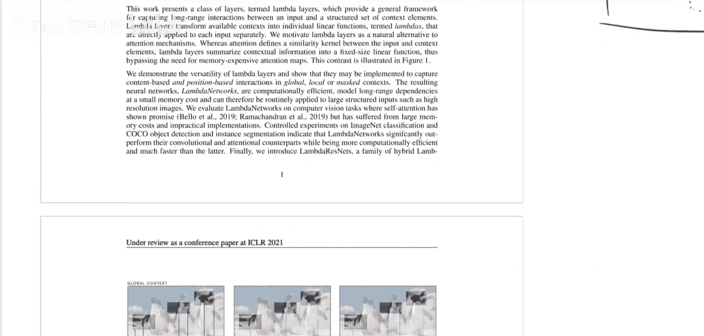
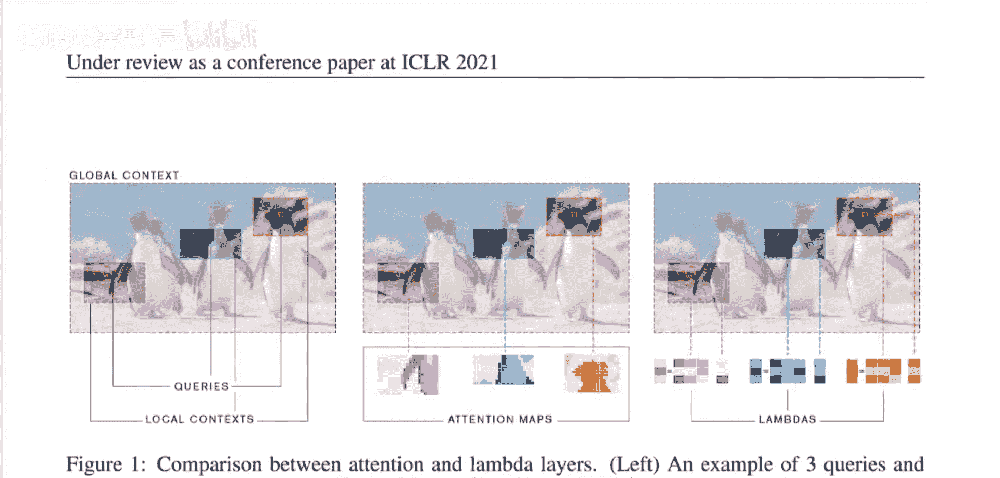
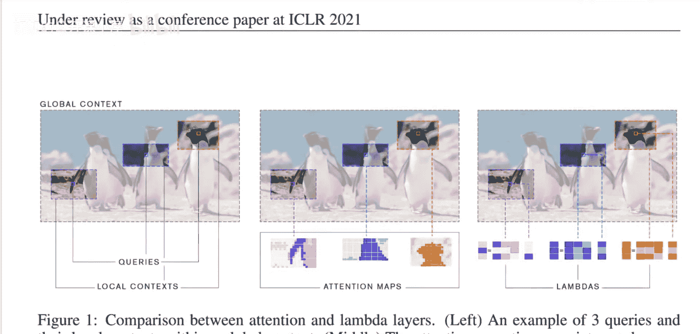
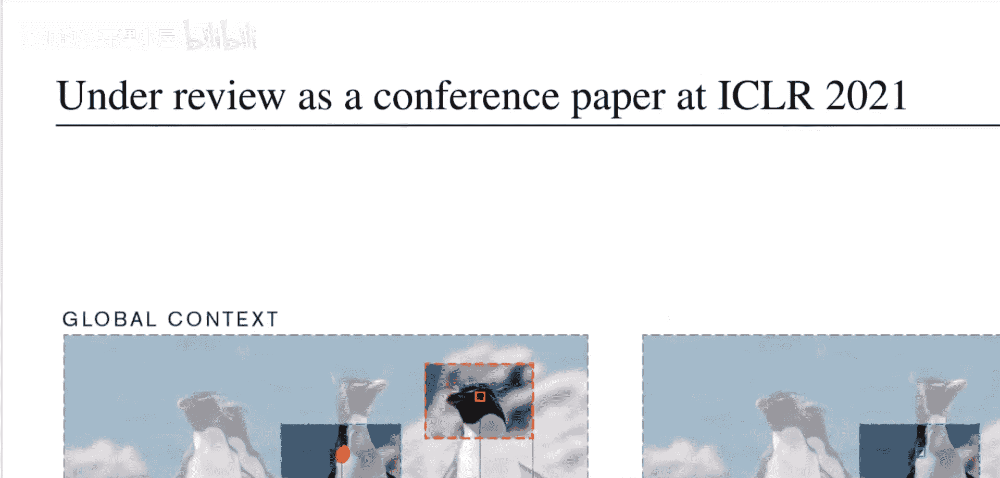


## 优势与权衡

通过上述机制，Lambda层实现了高效的长距离交互建模。它的主要优势在于：

*   **计算和内存效率高**：避免了计算 `O(n^2)` 复杂度的注意力图，尤其是在处理长序列或高分辨率图像时优势明显。
*   **易于实现**：可以很好地利用现有的深度学习库中的矩阵乘法等高效操作。

当然，这种效率提升也带来了权衡：


*   **表达能力限制**：与标准的注意力机制相比，Lambda层是一种更“参数化”或“静态”的交互方式。注意力机制为每对位置动态生成权重，非常灵活。而Lambda层为所有位置共享一个由上下文生成的变换，其动态性和细粒度程度可能不如注意力机制。可以理解为，注意力是“每个输入自己决定看哪里、看多少”，而Lambda层是“根据整体情况制定一个规则，然后所有输入都按这个规则办”。


## 总结


本节课中我们一起学习了LambdaNetworks这篇论文。我们了解到，为了克服传统注意力机制在处理长序列或高分辨率数据时的计算瓶颈，研究者提出了Lambda层。其核心思想是将上下文信息聚合并转换为一个线性函数（Lambda），然后将其应用于每个输入，从而避免了计算庞大的成对注意力矩阵。这种方法在图像分类任务上展示了卓越的速度-精度权衡，为高效建模长距离依赖提供了新的思路。虽然它在动态性上可能有所妥协，但其在计算效率上的显著优势使其在许多实际应用场景中极具吸引力。