# 003：重新思考注意力机制 🔍

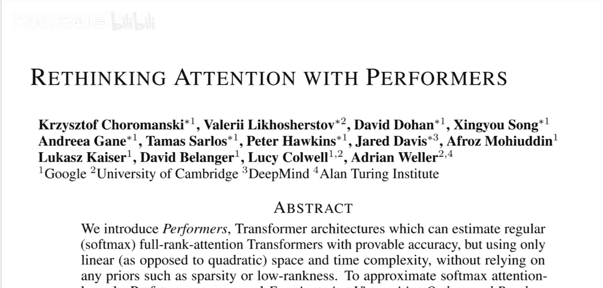

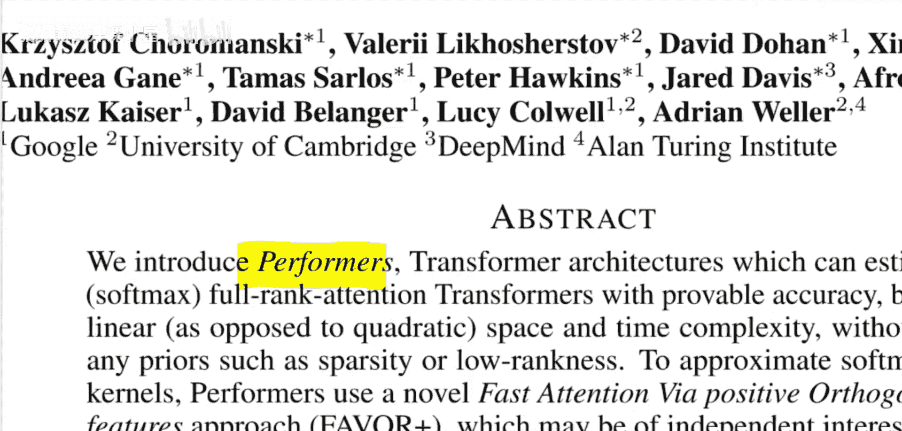

在本节课中，我们将学习一种名为“Performers”的新型模型。它旨在解决Transformer模型在处理长序列时遇到的计算瓶颈问题。我们将探讨其核心思想、工作原理以及它如何通过一种名为FAVOR+的技术来近似标准注意力机制，从而实现线性复杂度。

---

## 问题背景：Transformer的瓶颈

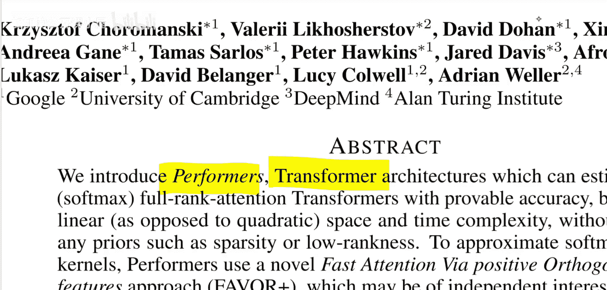

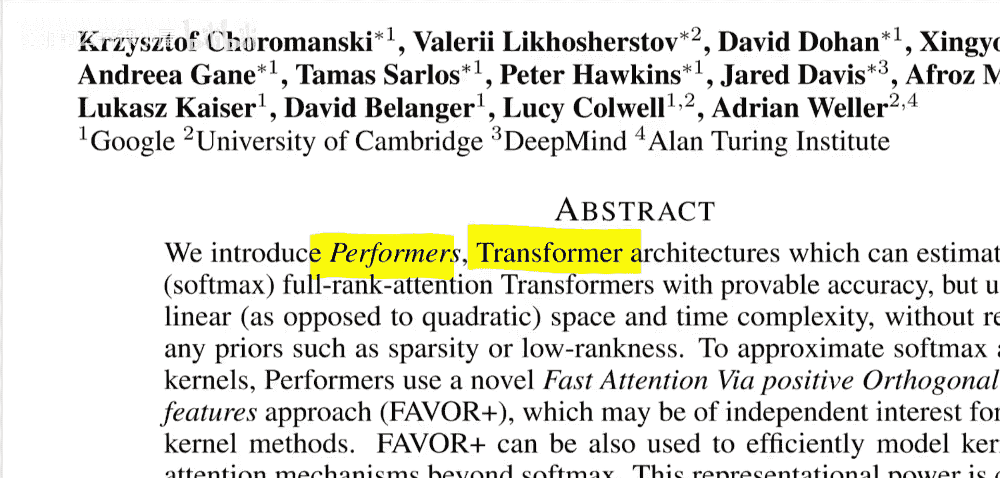

上一节我们介绍了Performers模型的目标。本节中，我们来看看它要解决的核心问题。

标准Transformer模型中的注意力机制存在一个根本性限制。其注意力矩阵 **A** 的计算需要 **O(L²)** 的时间和空间复杂度，其中 **L** 是输入序列的长度。这限制了模型能够处理的输入大小，无论是文本长度还是图像尺寸。

注意力机制的标准公式如下：

**Attention(Q, K, V) = D⁻¹AV**

其中：
*   **Q, K, V** 分别是查询（Query）、键（Key）和值（Value）矩阵。
*   **A = exp(QKᵀ/√d)** 是注意力矩阵（在应用Softmax之前）。
*   **D = diag(A 1ₗ)** 是一个对角矩阵，用于对 **A** 进行归一化（即执行Softmax操作）。

计算瓶颈在于矩阵 **A**。它的大小是 **L × L**，其计算需要先进行 **Q** 和 **Kᵀ** 的矩阵乘法（产生 **L × L** 的中间结果），然后再进行指数运算。

---

## Performers的解决方案：FAVOR+算法

了解了问题所在后，本节我们来看看Performers提出的解决方案。

Performers通过一种名为**FAVOR+**（Fast Attention Via positive Orthogonal Random features）的算法来规避二次复杂度问题。该算法的核心思想是：**将难以分解的注意力矩阵 **A**，通过数学技巧近似为两个更容易处理的矩阵的乘积**。

具体来说，FAVOR+利用了“随机特征映射”这一数学工具。其关键步骤是找到一个特征映射函数 **φ(·)**，使得对于任意的查询 **q** 和键 **k**，以下近似成立：

**exp(q·k) ≈ φ(q)·φ(k)ᵀ**

如果这个近似成立，那么原始的注意力计算就可以被重写和近似：

**Attention(Q, K, V) = D⁻¹AV ≈ D⁻¹ (φ(Q) φ(K)ᵀ) V = D⁻¹ φ(Q) (φ(K)ᵀ V)**

请注意计算顺序的变化：
*   **原始顺序**：先计算 **(QKᵀ)**（得到 **L×L** 矩阵），再乘以 **V**（**L×L** × **L×d**）。
*   **新顺序**：先计算 **(φ(K)ᵀ V)**（得到 **m×d** 矩阵，其中 **m** 是映射后的特征维度），再乘以 **φ(Q)**（**L×m** × **m×d**）。

当映射维度 **m** 远小于序列长度 **L** 时，新计算路径的复杂度就从 **O(L²)** 降为了 **O(Lmd)**，即线性于序列长度 **L**。

---

## Performers的优势与特性

在理解了FAVOR+如何工作之后，我们来总结一下Performers模型的主要优势。

以下是Performers相较于其他近似注意力方法的几个关键特点：

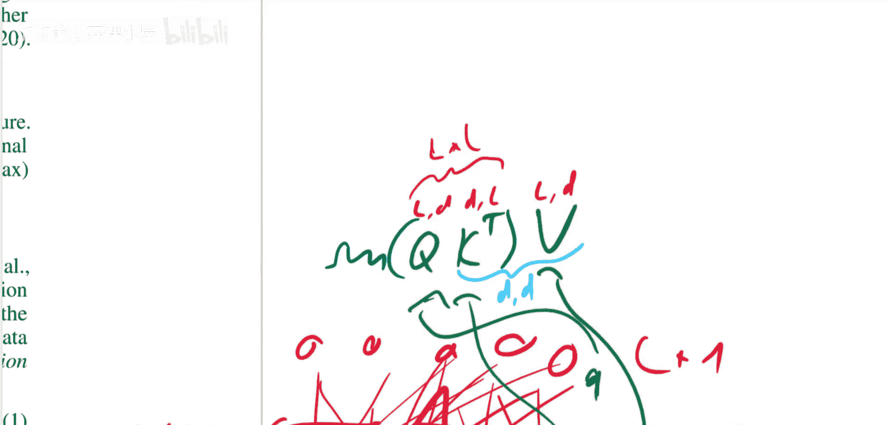

1.  **理论保证**：FAVOR+提供了对原始注意力矩阵的**无偏或近似无偏估计**，并具有**均匀收敛性**和**低估计方差**。这意味着随着随机特征数量 **m** 的增加，近似结果会可靠地接近真实值。
2.  **完全兼容性**：Performers与标准Transformer架构完全兼容。理论上，你可以将预训练好的Transformer权重加载到Performer框架中，只需进行少量微调即可使用。
3.  **通用性**：FAVOR+算法不仅限于近似Softmax注意力。论文中指出，它可以用于近似更广泛的核函数，这可能对可扩展的核方法领域具有独立价值。
4.  **突破潜力**：就像ReLU激活函数取代Sigmoid/Tanh一样，用更高效、更通用的近似（如FAVOR+）替换Transformer中固定的Softmax非线性操作，可能为模型设计带来新的突破。事实上，论文中已经展示了使用ReLU等非线性函数的变体。

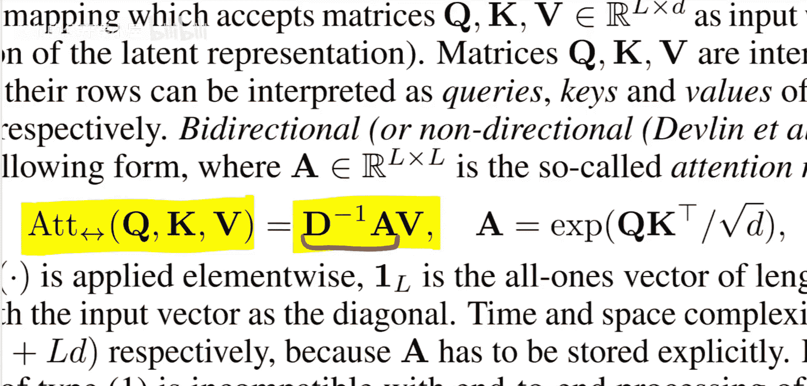

---

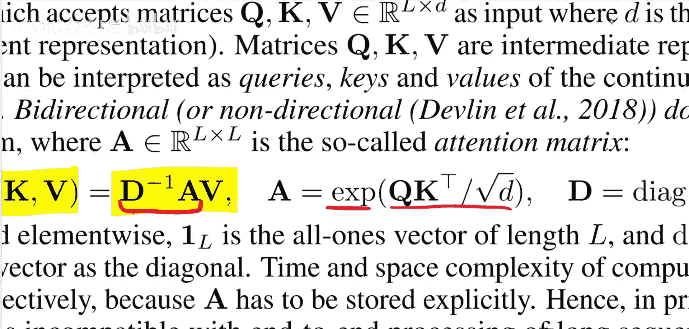

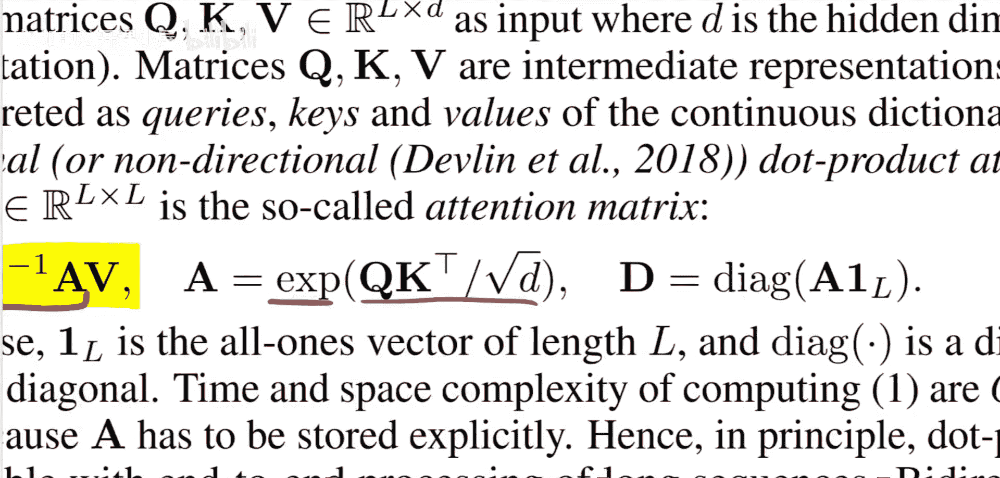

## 总结

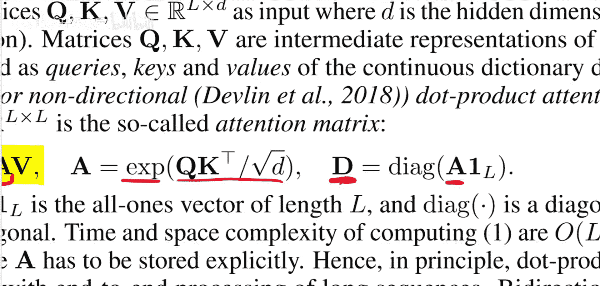

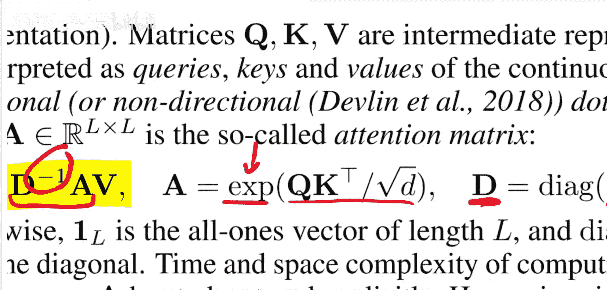

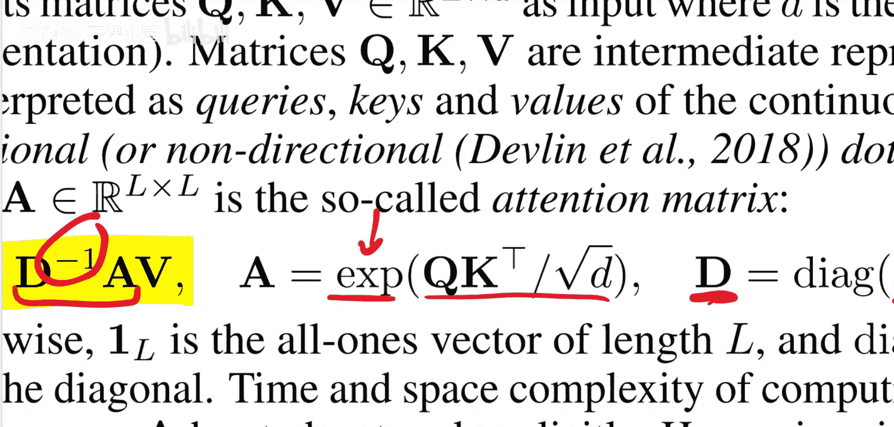

本节课中，我们一起学习了Performers模型。我们首先回顾了标准Transformer因二次方注意力矩阵而面临的计算瓶颈。然后，我们深入探讨了Performers的核心——FAVOR+算法，它通过随机特征映射将注意力矩阵巧妙地近似分解，从而将计算复杂度从 **O(L²)** 降低到 **O(L)**。最后，我们总结了Performers的理论优势、兼容性和未来潜力。Performers代表了一种重新思考注意力机制的重要方向，为处理超长序列打开了新的大门。