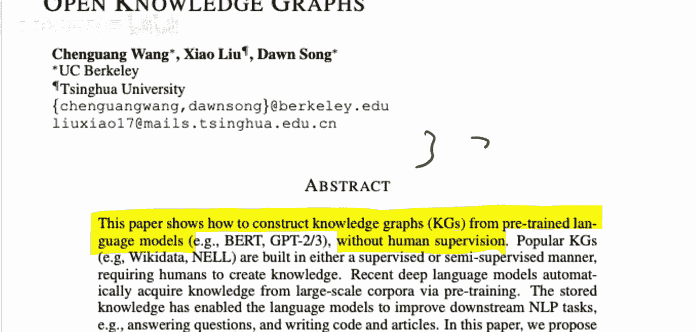
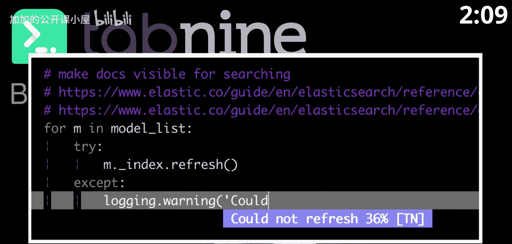
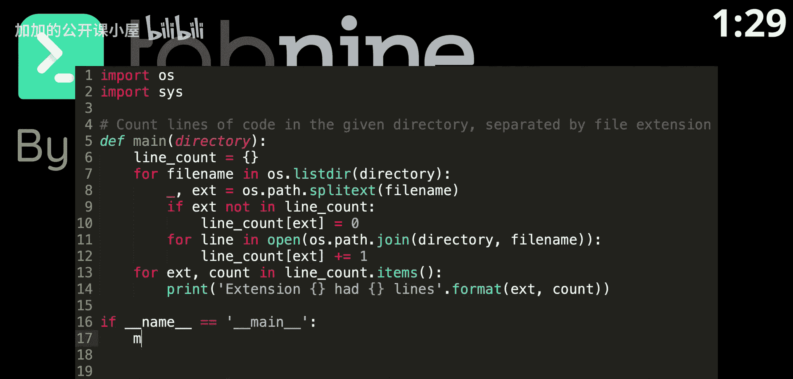
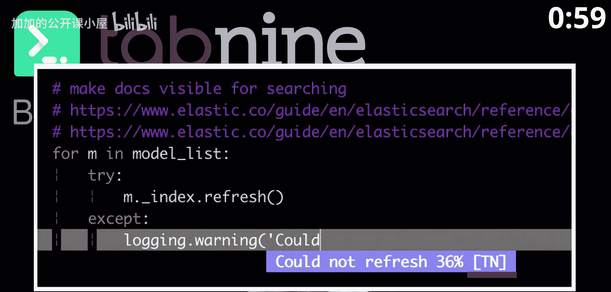
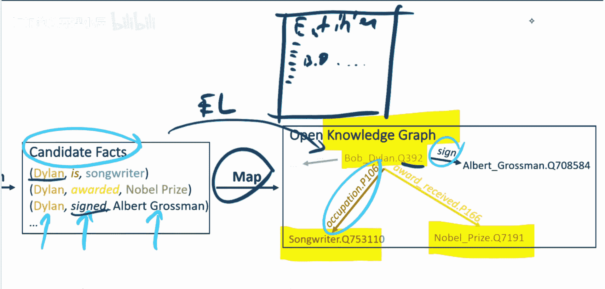

# 004：论文解读 🧠📚

在本节课中，我们将学习一篇名为《语言模型即开放知识图谱》的论文。这篇论文由程望、王晓、刘东和宋东共同撰写，其核心思想是提出一种方法，能够自动地从预训练语言模型和文本语料库中构建知识图谱，而无需任何人工监督或额外的模型训练。

## 概述

知识图谱是一种结构化的知识表示形式，通常由专家手动或半手动构建，过程涉及大量人力。本文提出了一种新颖的方法，仅使用一个预训练的语言模型和一个文本语料库，通过一次前向处理，就能自动提取并构建知识图谱。这种方法在标准的知识图谱构建基准测试中表现良好。

## 知识图谱构建的传统流程

上一节我们介绍了论文的核心目标。在深入其方法之前，我们先了解一下传统知识图谱构建的两个主要阶段。

任何构建知识图谱的系统，通常都会经历以下两个步骤：

1.  **候选三元组提取**：从文本中提取出由字符串表示的候选事实三元组（头实体、关系、尾实体）。例如，从句子“Bob Dylan is a songwriter”中，可以提取出 `(Bob Dylan, occupation, songwriter)`。
2.  **模式映射与实体链接**：将提取出的字符串三元组映射到预定义的模式（Schema）和具体的实体上。这通常需要人类专家定义实体和关系的列表。例如，将字符串“Dylan”链接到知识库中代表“Bob Dylan”的唯一实体ID（如Q392）。这个阶段涉及“实体链接”等标准任务。

## 论文提出的方法

了解了传统流程后，本节我们来看看这篇论文提出的自动化方法是如何工作的。

论文的核心在于，它绕过了传统的两阶段流程，直接利用预训练语言模型（如BERT）中蕴含的知识。其基本流程如下：

1.  **输入处理**：给定一个文本语料库（如维基百科文章）。
2.  **语言模型编码**：将文本输入预训练的语言模型，获取每个词语或短语的上下文表示（即嵌入向量）。
3.  **知识提取**：通过分析这些嵌入向量之间的相似性或关系，直接识别出实体和关系，形成知识图谱的三元组。

论文的关键创新点在于“无需训练”。整个知识图谱是通过对语料库进行一次前向传播（forward pass）构建的，没有针对知识图谱构建任务进行任何额外的模型训练。所有“知识”都来源于预训练语言模型本身。

## 对论文标题的讨论

在深入技术细节前，我们有必要对论文的标题进行一些探讨。近年来，机器学习论文标题中出现了一种趋势，即喜欢使用“X is all you need”或“X as Y”这类表述（例如著名的《Attention is All You Need》）。

虽然这类标题能吸引更多关注，但有时可能产生误导。本文标题《语言模型即开放知识图谱》容易让人理解为“语言模型等价于知识图谱”。然而，论文的实际内容（如摘要第一句所述）是展示如何“从预训练语言模型中构建知识图谱”，这是一种利用关系，而非等价关系。因此，读者在阅读时应注意区分标题的吸引力和论文的实际贡献。

## 总结

本节课我们一起学习了《语言模型即开放知识图谱》这篇论文。我们了解到：

*   论文提出了一种**无需训练**、**无需人工监督**的自动化知识图谱构建方法。
*   该方法的核心是直接利用**预训练语言模型**对文本语料库进行编码，并从中提取实体和关系来构建图谱。
*   尽管标题可能暗示一种等价关系，但论文实质是展示了语言模型作为强大工具来**近似构建**知识图谱的有效性。

这种方法为快速、低成本地构建大规模知识图谱提供了新的思路，特别是在标注数据稀缺的领域。