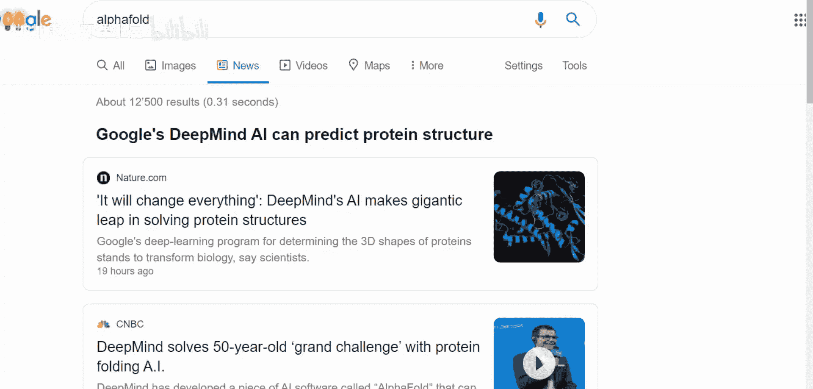
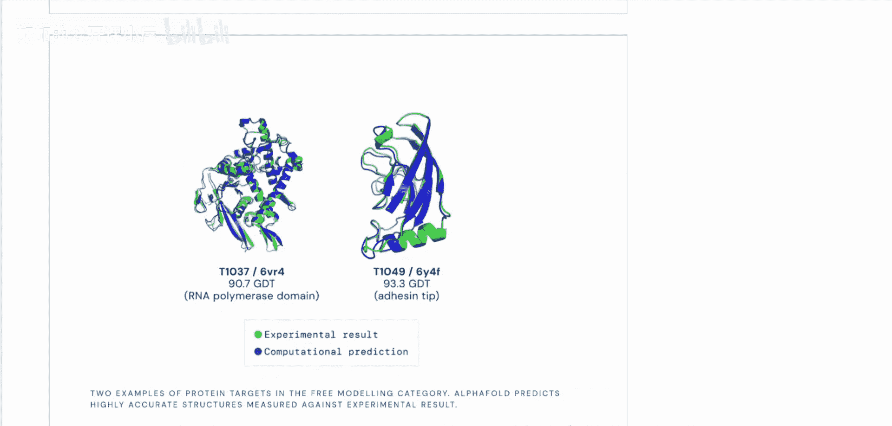
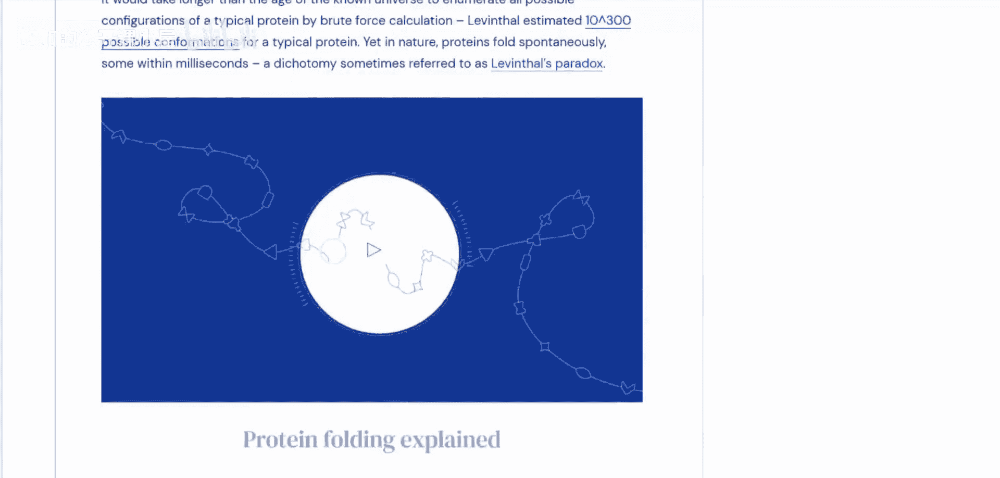

# 008：DeepMind AlphaFold 2全面解析

## 概述
在本节课中，我们将学习DeepMind的AlphaFold 2系统。该系统在蛋白质结构预测领域取得了革命性突破，解决了困扰生物学界长达50年的重大挑战。我们将从理解蛋白质折叠问题本身开始，回顾AlphaFold 1的核心思想，并基于现有信息探讨AlphaFold 2可能的技术飞跃。

## 什么是蛋白质折叠问题？🧬
上一节我们提到了AlphaFold 2的巨大成功，本节中我们来看看它要解决的核心问题——蛋白质折叠。




蛋白质是生命活动的主要执行者。它们由氨基酸链组成，而氨基酸共有21种。每个氨基酸都有一个共同的主体结构和一个独特的侧链（也称为残基）。蛋白质的功能很大程度上由其三维空间结构决定，而非单纯的氨基酸序列。这意味着，即使替换了某些氨基酸，只要新氨基酸的侧链化学性质相似，能维持蛋白质的整体三维形状，其功能就可能保持不变。

一旦氨基酸链在细胞中被合成出来，由于不同侧链的化学性质（如电荷、疏水性等）以及周围环境的影响，这条链会自发地进行折叠，形成一个特定的三维结构。这个折叠过程就是“蛋白质折叠问题”。准确预测给定氨基酸序列会折叠成何种三维结构，是计算生物学领域的核心挑战。

## 蛋白质结构预测竞赛与AlphaFold的突破🏆
理解了问题本身后，我们来看看衡量解决方案的标尺——蛋白质结构预测竞赛（CASP）。





每年都会举办一次蛋白质结构预测竞赛。在今年的竞赛结果中，各参赛团队的表现如下图所示。DeepMind的AlphaFold 2系统以绝对优势领先于所有其他团队，其预测精度达到了一个里程碑式的阈值。在这个领域，“问题被解决”意味着预测精度超过了某个关键数值，使得预测结果足够可靠，可供其他科学家直接采纳并作为后续研究的基础。

目前，关于AlphaFold 2的详细信息还不多，主要只有一篇博客文章和一些宣传视频，其学术论文尚未正式发表。因此，为了深入理解其技术原理，我们将首先剖析其前代系统——AlphaFold 1的论文。从性能提升曲线可以明显看出，AlphaFold 2带来了质的飞跃。普遍的猜测是，这种飞跃很可能源于**Transformer**和**注意力机制**的引入，并结合了其他一些改进，使得系统性能大幅提升。这再次证明了Transformer架构在整个AI领域的统治力。

## AlphaFold 1 技术核心解析🔧
在深入可能的变革之前，我们需要先了解它的基石。本节我们将解析AlphaFold 1系统的核心技术。

AlphaFold 1系统的核心是一个深度神经网络，它并不直接预测原子的三维坐标，而是预测蛋白质结构中每对氨基酸残基之间的距离分布，以及连接它们的化学键之间的夹角（二面角）。系统通过整合多种信息来做出预测：

以下是系统使用的关键信息：
*   **氨基酸序列**：蛋白质的基本蓝图。
*   **多序列比对（MSA）**：通过比对同源蛋白质序列，找出在进化中共同变化的残基对，这暗示它们在三维空间中是邻近的。
*   **物理化学约束**：例如，已知的蛋白质结构模板（如果存在）、原子间的空间位阻效应等。

神经网络会输出一个残基对的**距离概率分布矩阵**和一个**角度概率分布图**。随后，系统会使用这些预测出的分布作为约束条件，通过优化一个**评分函数**，来生成最终的三维结构模型。这个优化过程可以理解为寻找一个最符合所有预测出的距离和角度约束的三维构象。

**评分函数**可以简化为：
`Score(Structure) = Σ Penalty(Distance_ij, PredictedDistribution_ij)`
其中，`Distance_ij`是模型中残基i和j的实际距离，`Penalty`函数衡量该距离与网络预测分布之间的差异。通过梯度下降等方法最小化这个总分，即可得到预测结构。

## 对AlphaFold 2的技术推测🤔
基于AlphaFold 1的基础和已知的AI进展，我们可以对AlphaFold 2的飞跃进行一些合理的推测。

最重大的改变很可能来自于架构的革新。AlphaFold 1严重依赖卷积神经网络（CNN）来处理MSA信息和距离图。而Transformer的注意力机制，特别是其**自注意力**和**交叉注意力**机制，非常适合于捕捉蛋白质序列中长距离的、复杂的相互依赖关系。

以下是Transformer可能带来提升的几个方面：
*   **更好的长程依赖建模**：注意力机制能直接计算序列中任意两个位置的关系，不受CNN感受野的限制，这对于理解远距离残基间的相互作用至关重要。
*   **端到端结构预测**：AlphaFold 2有可能摒弃了AlphaFold 1中“预测分布-再优化”的两阶段流程，而是直接**从序列回归出原子的三维坐标**。这需要网络隐式地学习所有的物理和几何约束。
*   **更高效的信息整合**：通过注意力机制，系统可以更灵活、更强大地整合氨基酸序列信息、进化信息（MSA）和可能的模板信息。

一个高度简化的、用于端到端坐标回归的模型核心可能类似于：
```python
# 伪代码示意
class SimplifiedAlphaFold2(nn.Module):
    def __init__(self):
        self.embedding = EmbeddingLayer() # 嵌入序列和MSA信息
        self.transformer_blocks = nn.ModuleList([TransformerBlock() for _ in range(N)]) # 多层Transformer编码
        self.structure_module = StructureModule() # 从表征中直接预测原子坐标

    def forward(self, sequence, msa):
        x = self.embedding(sequence, msa)
        for block in self.transformer_blocks:
            x = block(x) # 通过注意力机制进行信息交换和整合
        coordinates = self.structure_module(x) # 输出最终3D坐标
        return coordinates
```

## 已知信息与未知领域🔍
目前，根据DeepMind发布的博客和视频，我们确认AlphaFold 2的性能是革命性的，并且其预测结果已经具备极高的实用价值，可供生物学家直接使用。然而，许多关键细节仍然未知。

以下是尚待论文揭晓的核心未知点：
*   **网络架构细节**：是否完全基于Transformer？注意力机制具体如何应用？
*   **训练数据与策略**：使用了哪些额外的数据或技巧？
*   **是否端到端**：是否真的实现了从序列到坐标的直接映射？
*   **计算需求**：训练和推理所需的算力规模。


## 总结
本节课中，我们一起学习了DeepMind AlphaFold 2的突破性成就。我们从蛋白质折叠的基本概念入手，了解了其对于生命科学的意义。接着，我们回顾了AlphaFold 1的技术框架，它通过预测距离分布来间接推导结构。最后，基于当前AI发展趋势，我们推测AlphaFold 2的巨大飞跃很可能源于Transformer架构的引入，使其能够更直接、更精确地预测蛋白质的三维结构。尽管具体技术细节尚未完全公开，但AlphaFold 2无疑标志着计算生物学和AI交叉领域的一个历史性时刻，其影响将深远地推动基础科学和药物研发的发展。