# 010：从大型语言模型中提取训练数据（论文详解）🔍

在本节课中，我们将学习一篇关于从大型语言模型中提取训练数据的论文。这篇论文探讨了仅通过访问训练好的模型（黑盒访问），就能提取出原始训练数据片段的可能性，这涉及到模型记忆与隐私安全的重要问题。

## 论文背景与核心问题

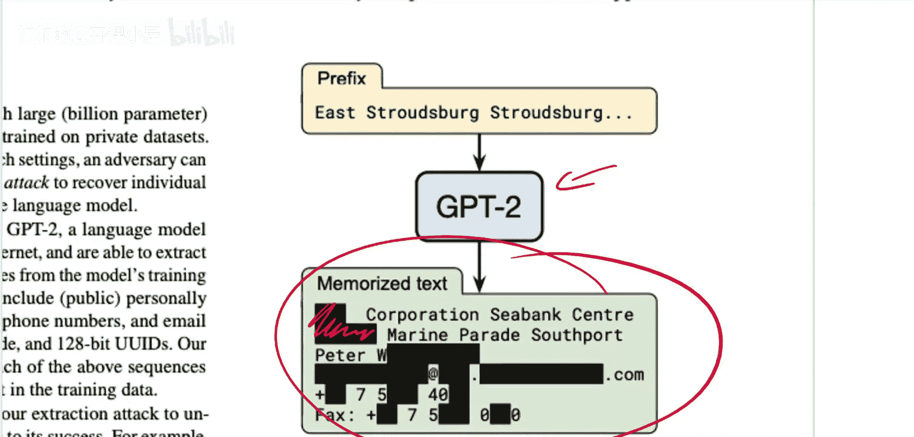

上一节我们介绍了课程主题，本节中我们来看看论文的具体背景。作者指出，发布经过大规模私有数据集训练的大型（数十亿参数）语言模型已成为常见做法。

这篇论文证明，在此类场景下，攻击者可以通过查询语言模型来执行训练数据提取攻击，从而恢复单个训练样本。这意味着，如果模型使用内部或私有数据（如用户数据）进行训练，就需要担心模型可能会再次输出这些数据，导致信息泄露。

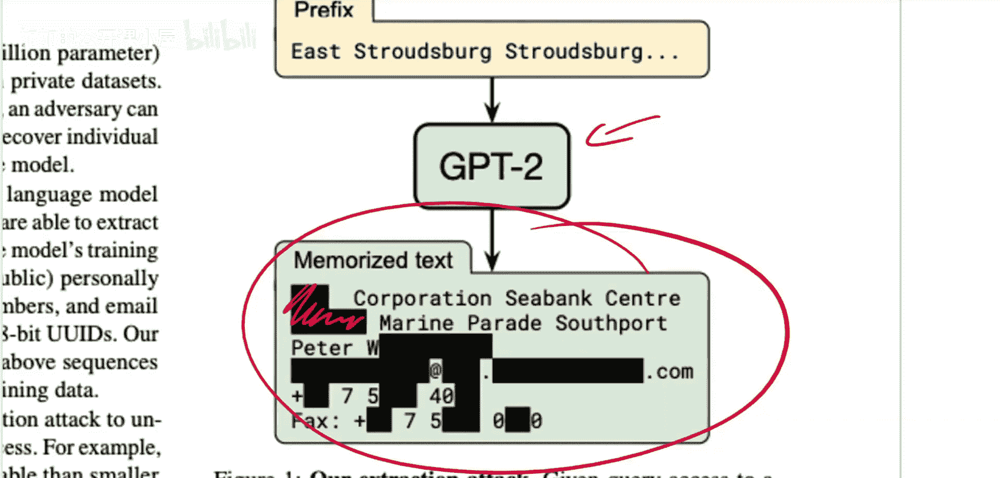

## 语言模型与记忆风险

在深入攻击方法前，我们先理解什么是大型语言模型及其潜在风险。语言模型是一种给定一段文本后，预测下一个词（或词的概率分布）的模型。

例如，输入“一只猫坐在”，模型会给出下一个词是“垫子”、“地毯”或“旁边”等的概率分布。GPT-3就是这类大型语言模型之一。由于模型规模巨大，它们需要海量的训练数据，这些数据通常是从互联网上抓取的，无法完全由人工审核。

问题在于，如果训练数据中包含某些敏感或私密信息，并且模型“记住”了这些只出现极少次数的数据，那么当模型输出这些精确数据时，就构成了隐私泄露风险。真正的风险在于模型记忆那些在训练集中**仅出现一次**的独特数据，而不是那些出现多次的公共知识。

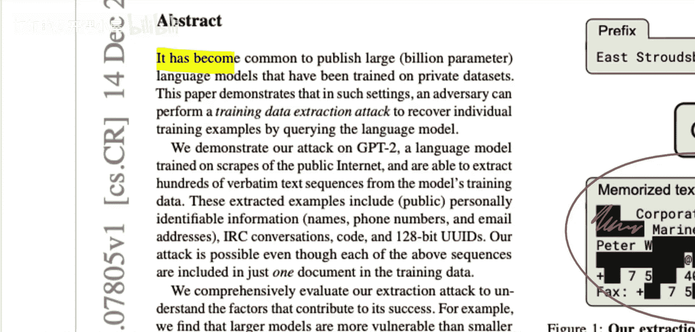

以下是论文中展示的一个成功提取的例子：
*   他们能够查询GPT-2模型，使其输出包含个人可识别信息（如姓名、电话号码）的文本片段。
*   这些被提取的示例包括：个人可识别信息、IRC聊天记录、代码片段和128位UUID等。
*   关键点在于，即使上述每个序列在训练数据中仅出现在**一个文档**里，攻击仍然能够成功。这种对“独有”数据的记忆才是危险的。

## 攻击方法与技术细节

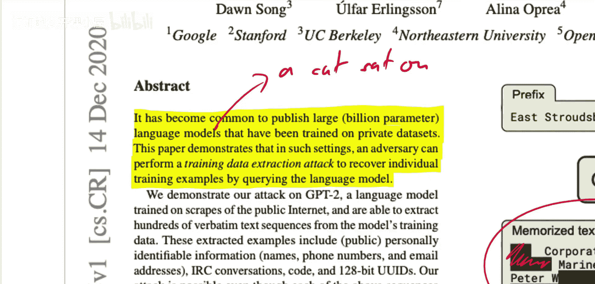

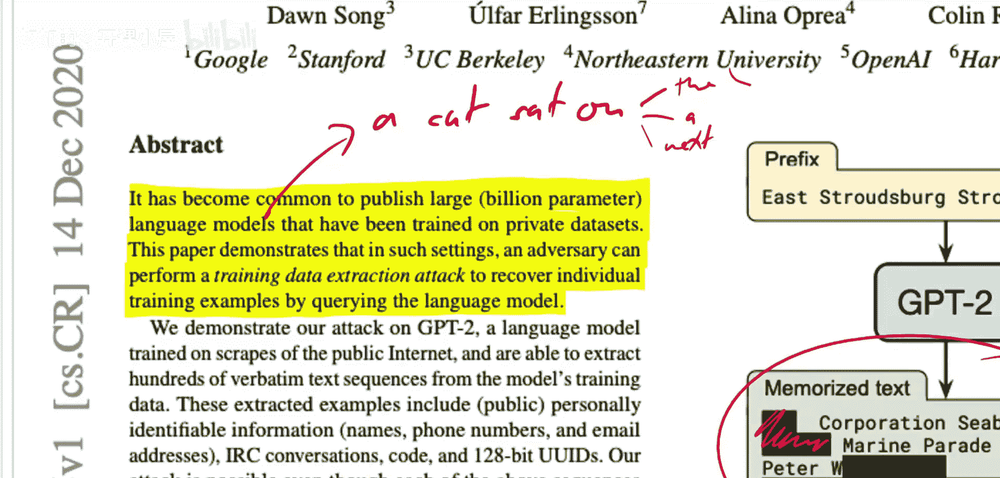

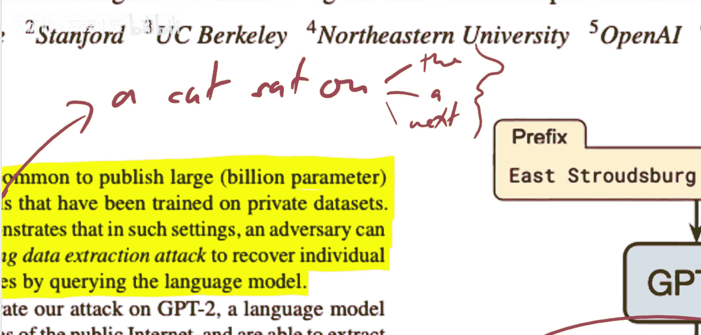

了解了风险所在后，我们来看看论文提出的具体攻击方法。作者设计了一种相当巧妙的攻击技术。

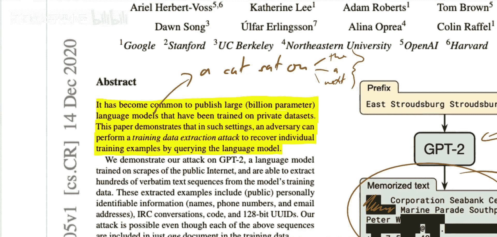

其核心思想是：通过让模型重复生成文本，并观察其输出，来探测和提取被记忆的训练数据。攻击者不需要知道模型的内部结构（权重），只需要能够向模型提供输入（提示词）并获得输出（黑盒访问）。

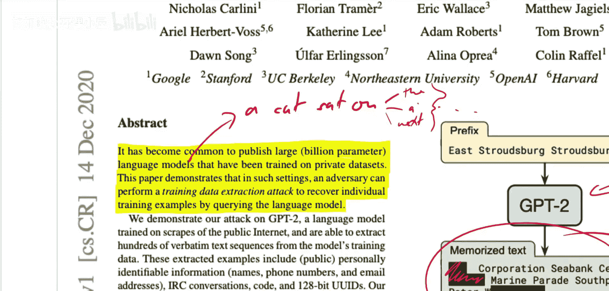

一个简单的理解方式是：如果某个数据序列被模型深刻记忆，那么当给出一个合适的提示（可能是该序列的前几个词）时，模型会以很高的概率输出后续的、独特的词序列。攻击者通过设计大量的、多样化的提示词来“试探”模型，并筛选那些输出概率异常高、且内容独特的生成结果，这些结果就很有可能是从训练数据中直接记忆而来的。

## 实验结果与发现

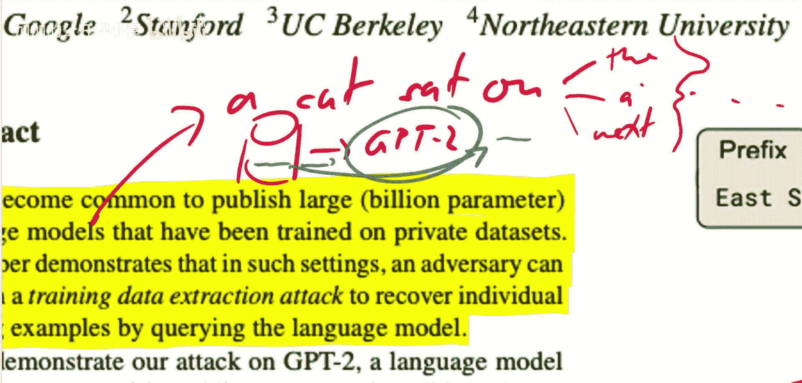

现在，我们来看看作者将这种方法应用于GPT-2模型后得到的结果。

论文表明，他们能够从GPT-2中提取出数百个逐字逐句的文本序列。这些结果在一定程度上验证了大型语言模型确实会记忆其训练数据中的罕见片段。

然而，也需要客观看待这些发现。论文中用作示例的提取结果（如公司地址和电话号码），实际上可以通过搜索引擎在公共互联网上找到。这引出了一个重要讨论：从公开数据训练的模型中提取出公开信息，其实际的安全威胁有多大？论文的警示意义可能大于其即刻的现实危害，它更多地揭示了模型的一种行为特性。

## 论文意义与启示

最后，我们来总结一下这篇论文的价值和启示。

尽管论文的表述可能略显惊悚，但其揭示的问题确实有效。它强化了一个关于大语言模型如何工作的假设：它们不仅仅学习泛化模式，也会记忆特定的、罕见的细节。

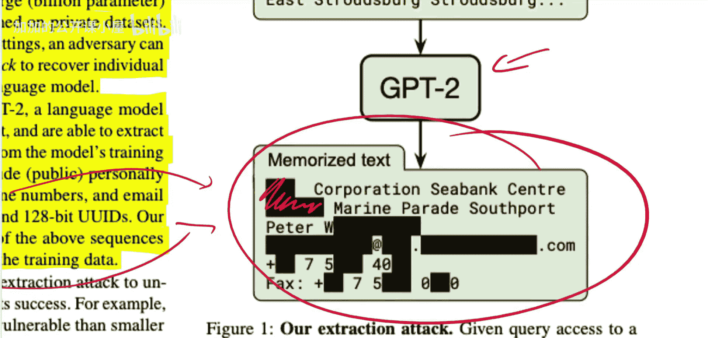

本节课中我们一起学习了：
1.  **问题定义**：大型语言模型存在记忆并泄露其训练数据中罕见、独特片段的风险。
2.  **攻击原理**：通过黑盒查询，利用模型对记忆内容的高置信度输出特性，可以提取这些数据。
3.  **实证结果**：在GPT-2上的实验成功提取了包含个人信息的文本，证明了攻击的可行性。
4.  **核心启示**：这项研究提醒我们，在利用敏感数据训练大模型时，必须认真考虑数据隐私和模型记忆带来的潜在泄露风险。未来的模型训练可能需要融入差分隐私等技术来缓解此类问题。

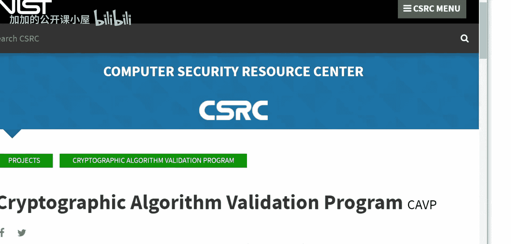

这项研究不仅关乎安全，也帮助我们更深入地理解语言模型的内在机制。