# 011：从文本生成图像（博客文章解读） 🎨

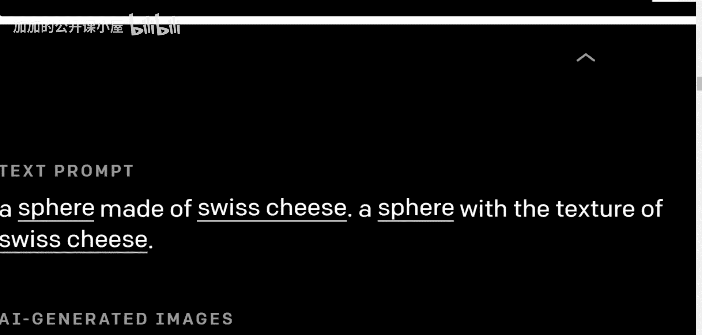

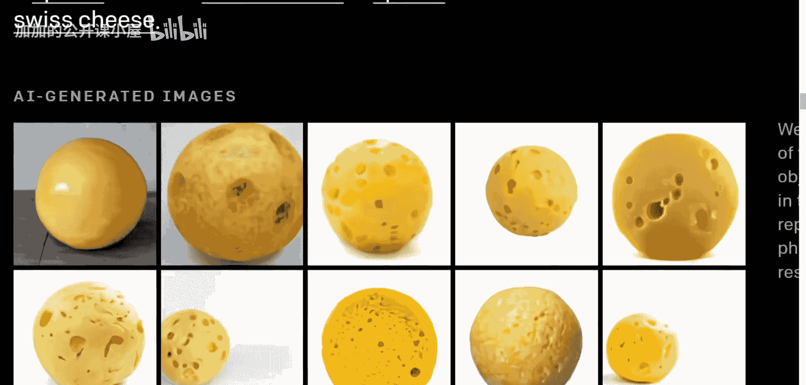

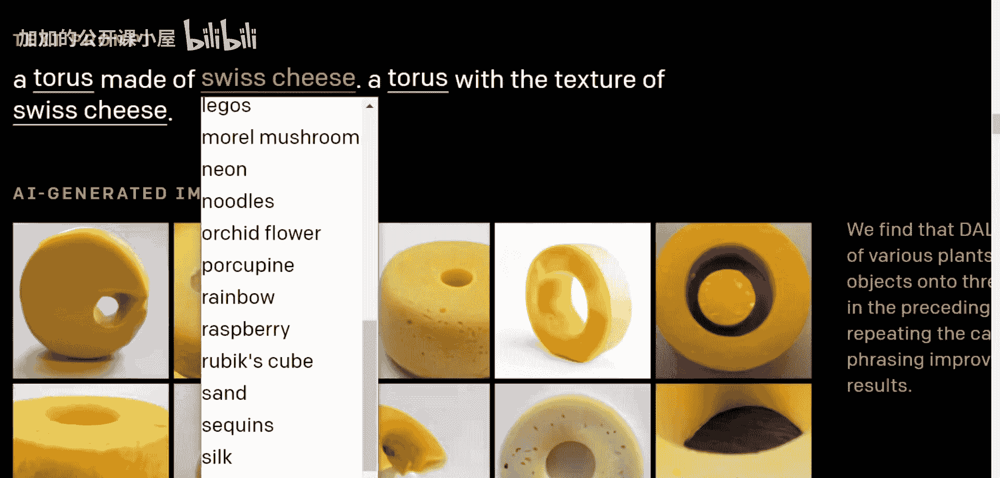

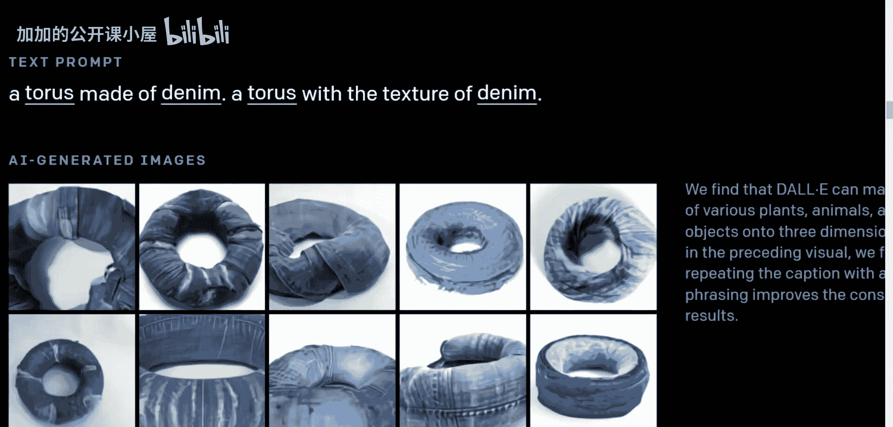

在本节课中，我们将一起学习OpenAI发布的DALL·E模型。这是一个能够根据文本描述生成对应图像的人工智能模型。我们将探讨它的能力、工作原理，并基于现有信息推测其背后的技术架构。

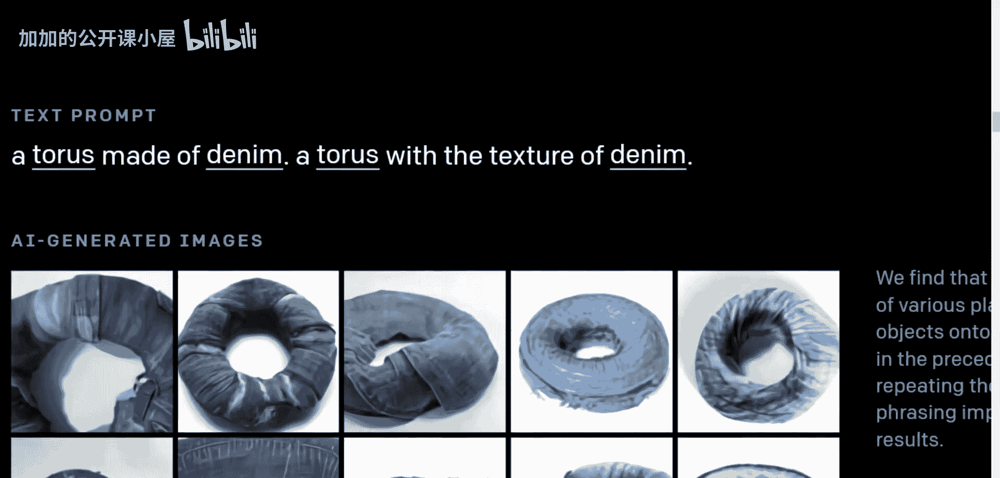

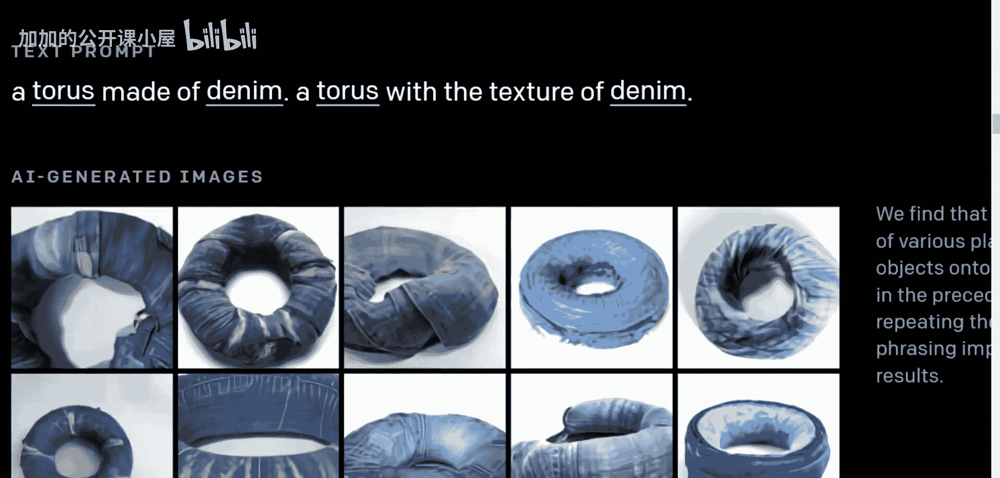

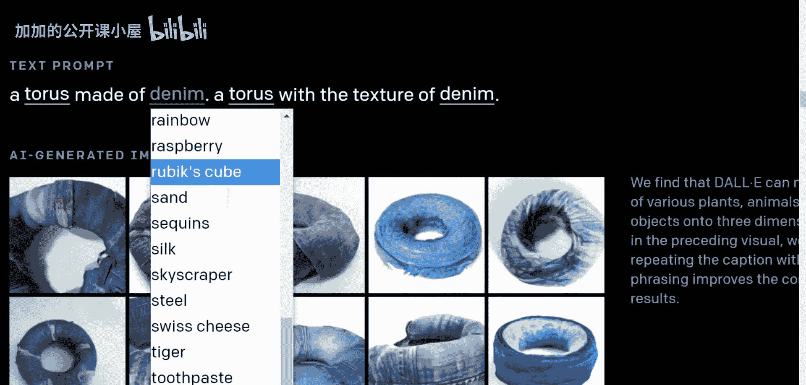

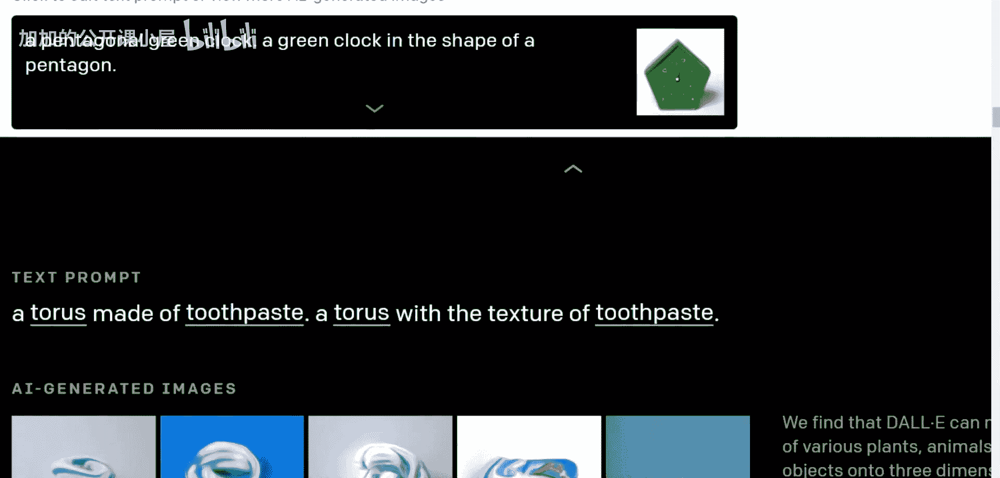

## 概述

DALL·E是一个由OpenAI开发的模型，它能够接收一段文本输入，并生成与该文本描述相匹配的图像。该模型展示了在连接文本与图像理解方面的强大能力。

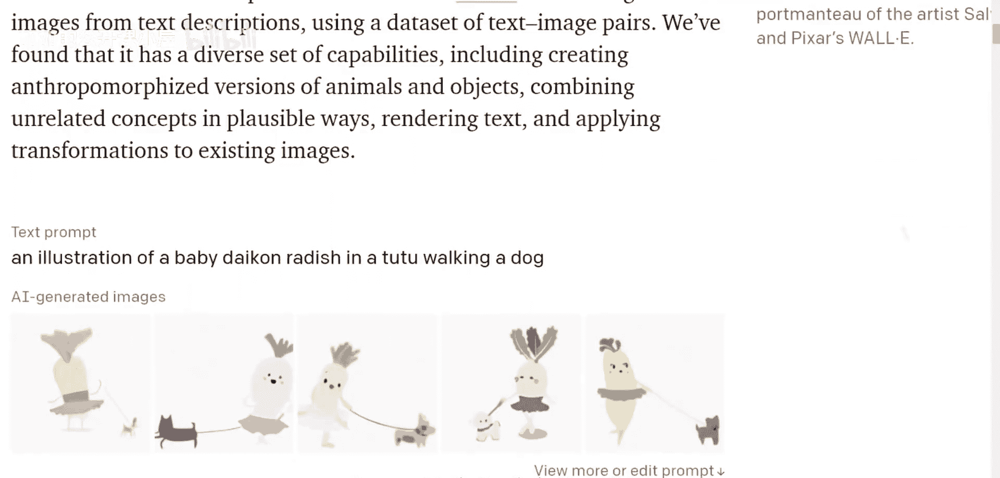

## 模型能力展示

以下是DALL·E模型根据不同文本描述生成的一些图像示例。

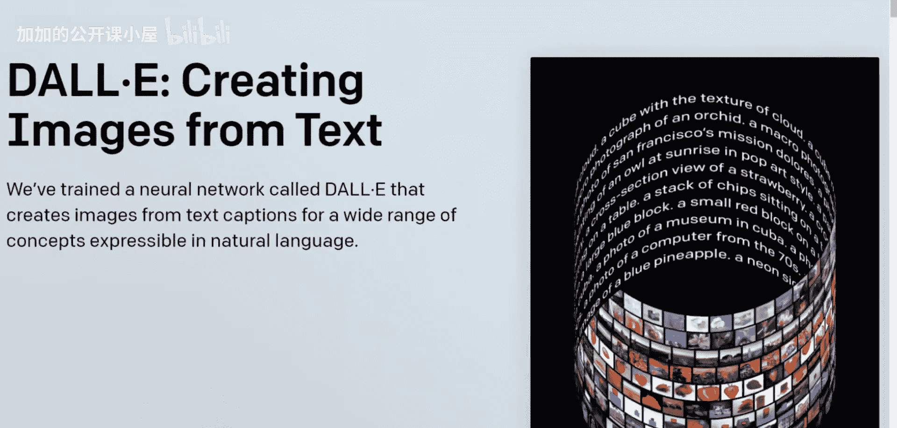

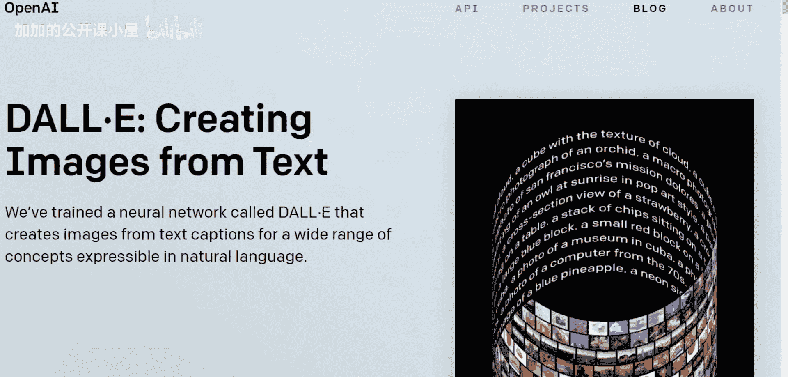

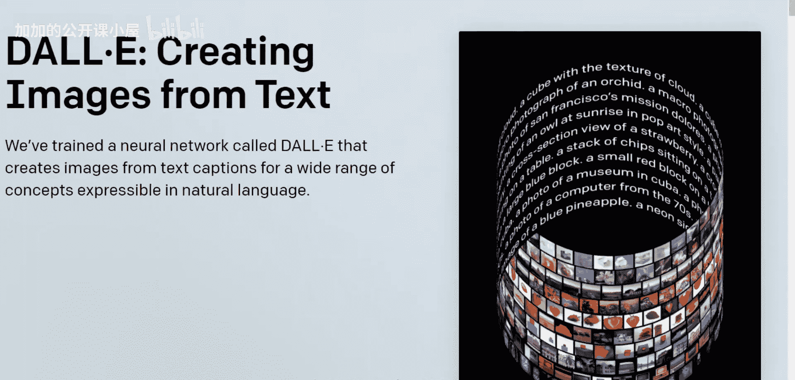

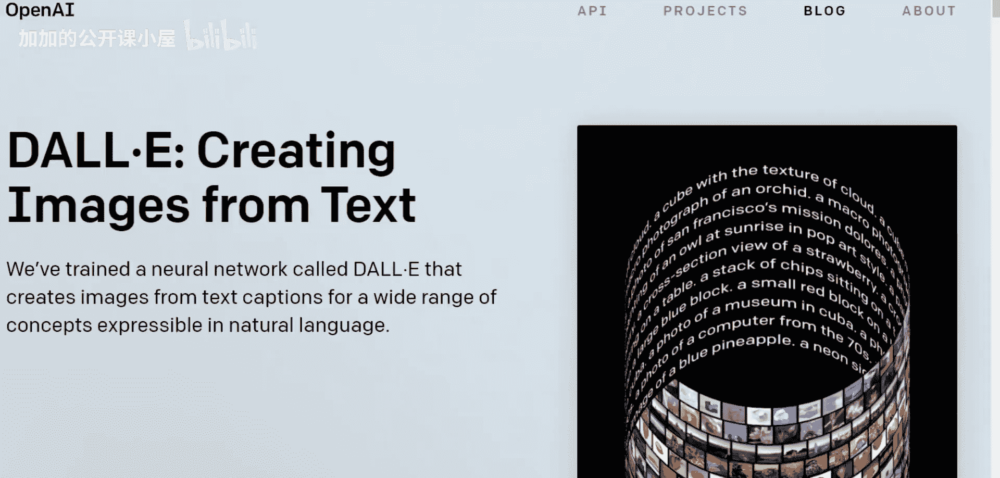

*   **“一个由瑞士奶酪制成的球体”与“一个具有瑞士奶酪纹理的球体”**：模型能够区分“由...制成”和“具有...纹理”这两个概念的细微差别。
*   **“一个由牛仔布制成的圆环面”**：模型可以组合不相关的概念（如几何形状与材质），生成合理的图像。
*   **“一个由牙膏制成的圆环面”**：同样展示了组合不相关概念的能力。
*   **“一个穿着芭蕾舞裙的婴儿萝卜在遛狗的插图”**：模型能够生成符合复杂、拟人化描述的插图。
*   **“一个鳄梨形状的扶手椅”**：模型可以将物体（扶手椅）与另一种物体的形状（鳄梨）相结合。
*   **“一个写有‘OpenAI’字样的店面”**：模型具备渲染文本并将其融入图像场景的能力。

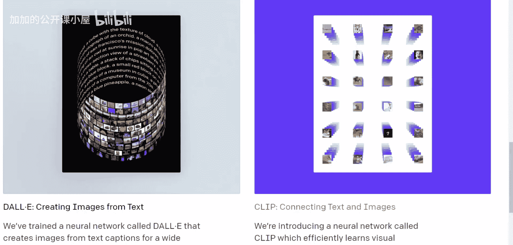

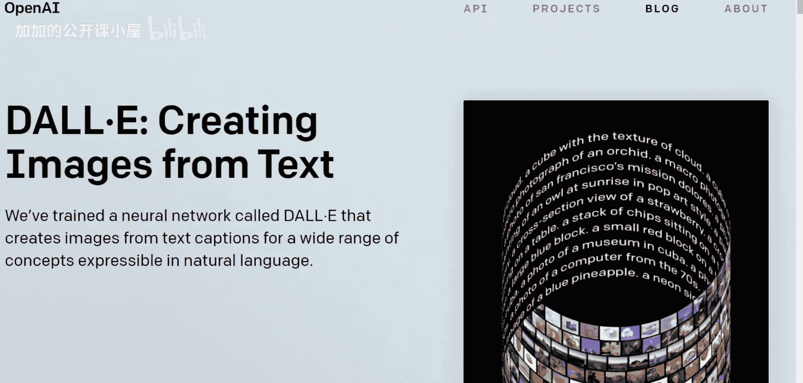

这些图像并非经过Photoshop处理或由人类创作，而是由DALL·E模型直接生成。令人惊叹的不仅是图像质量，更是同一个模型能够处理如此多样化任务的能力。

## 技术背景推测

上一节我们看到了DALL·E令人印象深刻的能力，本节中我们来看看它可能的技术原理。根据OpenAI的博客文章，DALL·E是一个拥有120亿参数的Transformer语言模型。它接收文本和图像作为包含最多1280个标记的单一数据流，并通过最大似然估计进行训练，以自回归的方式逐个生成所有标记。

目前OpenAI仅发布了博客文章，论文尚未公开。因此，我们基于现有信息进行合理推测。DALL·E很可能借鉴了**VQ-VAE**和**GPT-3**的思想。

*   **GPT-3**：这是一个强大的文本生成模型，擅长理解和生成连贯的文本序列。其核心思想是：给定一段文本的开头，模型可以预测并生成后续的标记。
*   **VQ-VAE**：这是一种图像生成模型，可以将图像压缩为一系列离散的标记（可以理解为“视觉词汇”），然后再从这些标记重建图像。

我的假设是，DALL·E将这两种思想结合了起来。它可能使用类似VQ-VAE的技术，将图像编码为一系列离散的视觉标记。然后，它将文本标记和这些视觉标记拼接成一个长的序列。最后，它使用一个类似GPT-3的巨大Transformer模型，以自回归的方式学习预测这个混合序列中的下一个标记（无论是文本还是视觉标记）。

**一个简化的类比**：想象一种结合了文字和象形符号的“语言”。例如，序列 `[“猫”， “坐”， “在”， 垫子象形符号]`。一个训练好的Transformer模型在看到`[“猫”， “坐”， “在”]`后，能够预测出下一个元素应该是代表“垫子”的象形符号。DALL·E的工作方式可能与此类似，但它学习的是文本描述与对应图像视觉标记序列之间的关联。

这种训练方式使得DALL·E不仅可以从头生成图像，还能根据文本提示，以一致的方式修改现有图像的某个区域。

## 总结

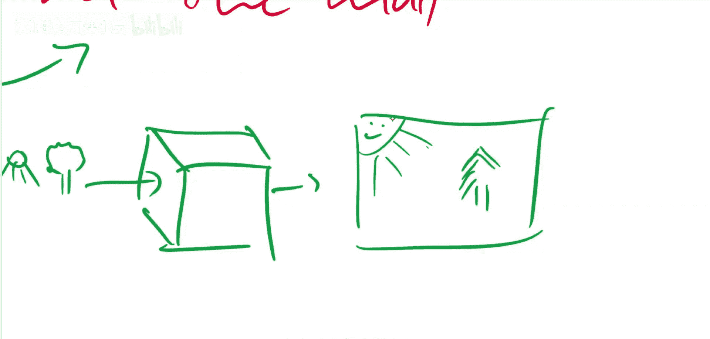

本节课中我们一起学习了OpenAI的DALL·E模型。我们看到了它如何根据文本描述生成高质量、多样化的图像，并推测其核心技术可能是将**GPT-3**的Transformer架构与**VQ-VAE**的图像离散化表示相结合。该模型标志着文本与图像多模态理解的重要进展。我们期待其正式论文发布后，能获得更准确的技术细节。