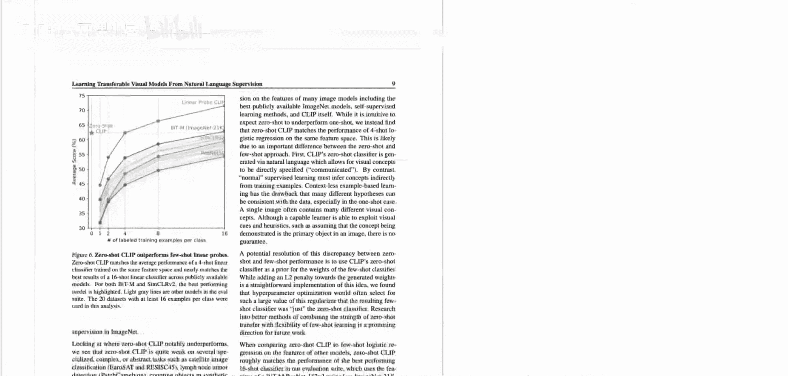
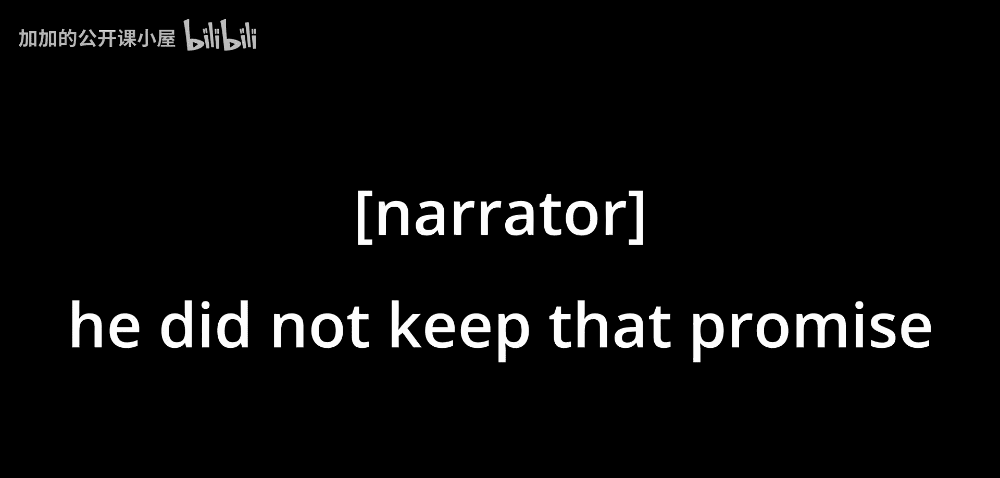
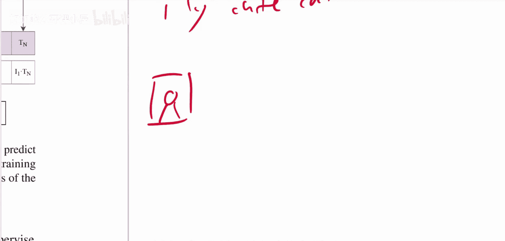

# 012：连接文本与图像的桥梁

在本节课中，我们将学习OpenAI提出的CLIP模型。该模型通过自然语言监督学习，旨在建立图像与文本之间的强大联系，并实现出色的零样本图像分类能力。我们将探讨其核心思想、工作原理以及为何它比传统的图像描述生成方法更有效。

## 模型动机与核心思想

上一节我们提到了CLIP的目标是连接图像与文本。本节中我们来看看其背后的核心动机。

传统的图像分类模型需要大量人工标注的数据，且类别固定。例如，ImageNet有1000个预定义类别。然而，互联网上存在海量的“图像-文本”对数据（如社交媒体配文）。CLIP的动机是利用这些无需人工标注的配对数据，训练一个模型来理解图像内容与文本描述之间的关系。

如果模型能够根据图像预测其对应的文本描述，那么模型内部的中间表示很可能就包含了图像内容的有效语义信息。这种表示可以迁移到其他视觉任务中。

## 从预测文本到对比学习

然而，直接预测完整的图像描述（如“我的可爱猫咪”）被证明效果有限。OpenAI的研究人员尝试了两种方法：

以下是两种文本预测方法的对比：
*   **自回归语言模型预测**：使用Transformer逐词生成完整的图像描述。
*   **词袋预测**：仅预测描述中出现的单词集合，忽略词序。

实验表明，词袋预测方法比生成完整句子表现更好，但性能提升仍有瓶颈。论文最终提出的**对比学习**方法带来了显著的性能飞跃。

## CLIP的工作原理

那么，CLIP具体是如何工作的呢？其核心是一个对比学习目标。

模型同时处理一个批次的图像和文本。它分别对图像和文本进行编码，得到特征向量。训练的目标不是让模型生成文本，而是学习判断**哪个文本描述与哪张图像是匹配的**。

具体流程如下：
1.  图像编码器（如ResNet或Vision Transformer）将图像 `I` 编码为特征向量。
2.  文本编码器（如Transformer）将文本描述 `T` 编码为特征向量。
3.  计算一个批次内所有图像特征和文本特征之间的余弦相似度，形成一个相似度矩阵。
4.  训练目标是**最大化配对图像-文本的相似度**，同时**最小化非配对对的相似度**。这可以看作是一个大规模的“多分类”任务。

其损失函数可以简化为一个对称的交叉熵损失，同时针对图像到文本和文本到图像两个方向进行优化。

## 零样本分类能力

CLIP最引人注目的能力是零样本分类。这意味着模型无需在特定分类数据集（如ImageNet）上进行训练，就能直接进行分类。

其实现方式非常巧妙：我们将分类任务重新定义为图文匹配任务。例如，对于一张狗的图像，传统的分类器会在“猫”、“狗”、“车”等固定标签中选择。而CLIP的做法是，将每个类别名称（如“狗”）转化为一个描述性文本提示，例如“一张**狗**的照片”。然后，CLIP计算该图像与所有候选文本提示（“一张**猫**的照片”、“一张**狗**的照片”、“一张**车**的照片”）的相似度，并选择相似度最高的文本所对应的类别作为预测结果。这正是视频开头展示的那些“奇怪”标签（如“a photo of guacamole, a type of food”）的来源。

因此，**同一个CLIP模型**，无需任何微调，就能在多个分布迥异的图像分类数据集上实现零样本推理，如上文提到的卫星图像分类、车型识别等。

## 总结

本节课中我们一起学习了OpenAI的CLIP模型。其核心是通过对比学习目标，在海量互联网“图像-文本”对上训练，使模型学会将匹配的图像和文本在特征空间中对齐。这种方法避免了传统分类模型对固定标签的依赖，并赋予了模型强大的零样本迁移能力。CLIP为多模态理解开辟了新路径，其学到的通用视觉-语言表示可以作为许多下游任务的基础。