# 014：一个去中心化的AI开放市场与网络（白皮书解读）📚

## 概述

在本节课中，我们将要学习SingularityNET。这是一个被宣传为“全球AI市场”的平台。具体来说，我们将解读其2019年发布的**白皮书2.0版本**。SingularityNET不仅是一个市场，也是一个基金会组织。它融合了区块链、人工智能、符号计算和图论等多种前沿技术。本教程将解析其核心概念、运作方式，并探讨其愿景与潜在挑战。

## 系统高层概览

上一节我们介绍了SingularityNET的基本定位，本节中我们来看看它的高层设计。

该系统本质上是一个基于区块链的**AI服务市场**。在这个市场中，无论是人类还是其他AI，都可以调用网络中的AI服务，并为该服务支付费用。其目标是构建一个由API调用API再调用API所形成的网络，最终发展成为一个不仅是市场，其本身就是一个**全球性的人工智能体**。这一切由SingularityNET基金会支持，该基金会既负责平台开发，也进行相关研究。

## 白皮书特点与解读方法

由于我们解读的是一份白皮书，而非通常的研究论文，因此需要注意几点。首先，文档篇幅较长，我们将跳过大部分内容。其次，白皮书通常包含市场宣传成分，其论述层次并不固定，时而深入技术细节，时而又回到宏观概念，并可能引用大量未加解释的术语以增强说服力。无论如何，我们将梳理其核心部分：市场形态、运作机制、优势、核心组件（如API和评级系统）、治理模式，以及其造福人类的终极目标。

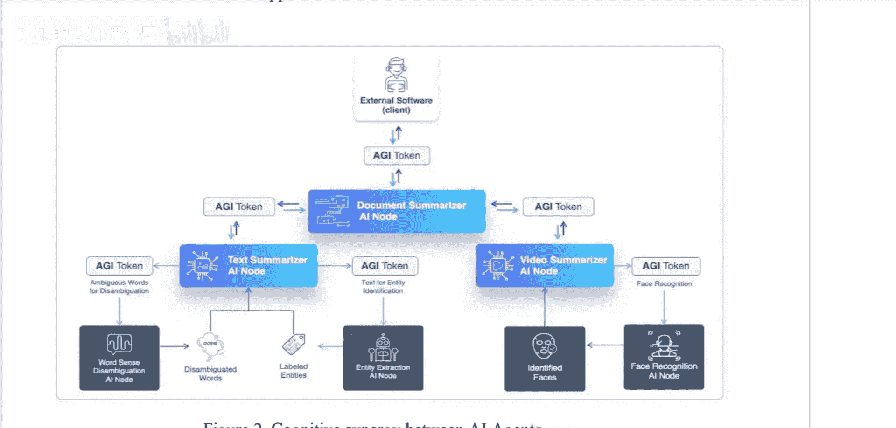

## 核心理念：AI市场的必要性

那么，当前的现状是什么？SingularityNET又意欲何为呢？让我们通过一个例子来理解。

假设你是一个外部软件（或者说一个人），你的目标是**总结一份文档**。该系统的设想是：你可以将文档交给一个“文档总结器”。

然而，这份文档可能是一篇包含文字和视频的《纽约时报》文章。文档总结器接收到后，会发现其中既有文本也有视频。为了总结整份文档，它需要分别总结文本和视频。因此，它会将文本发送给一个专精于**文本总结**的节点，将视频发送给一个专精于**视频总结**的节点。

视频总结器随后可能调用人脸识别器或查询数据库来识别视频中的人物或内容，也可能调用物体检测等服务。文本总结器则可能调用词义消歧器、实体提取器等工具来理解文档内容。

每一个节点都可以调用网络中的其他节点。在最底层，是诸如人脸识别、实体提取这样的**AI基础能力**。这些基础能力并非直接供终端用户调用，而是供更高层、负责聚合这些能力的节点所使用。

## 与传统软件库的对比

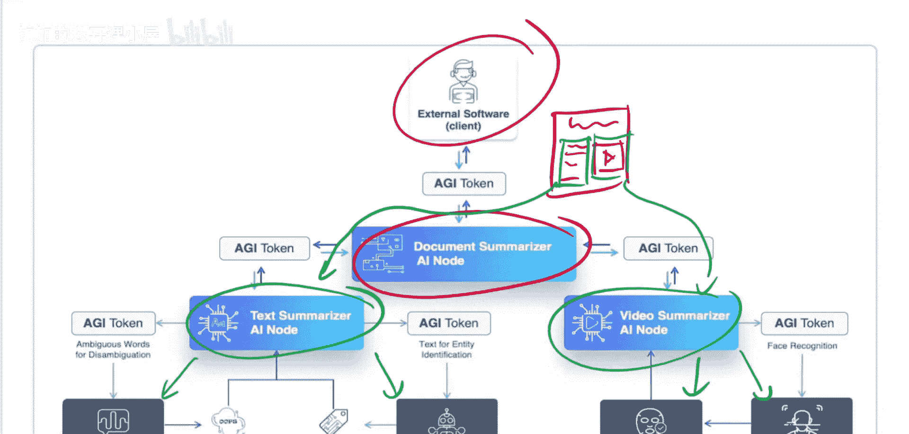

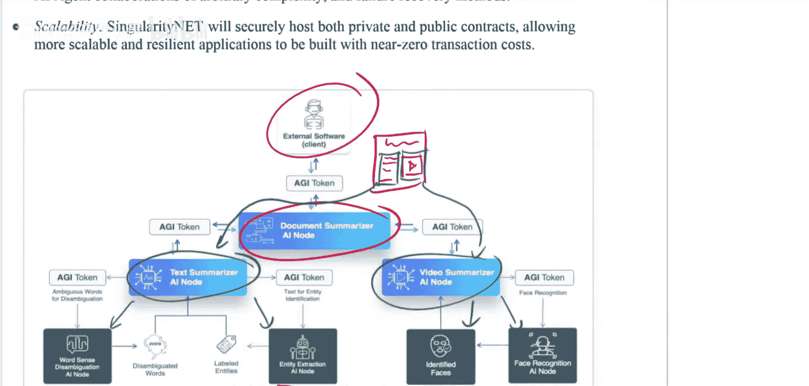

如果你是一名软件开发人员，看到这里可能会联想到软件库。你会想，这些底层功能（如实体提取）可能对应着Hugging Face上的模型，而那些文本处理工具可能对应着spaCy库。在传统软件开发中，如果你需要完成某个子任务，通常可以直接调用一个现成的库。

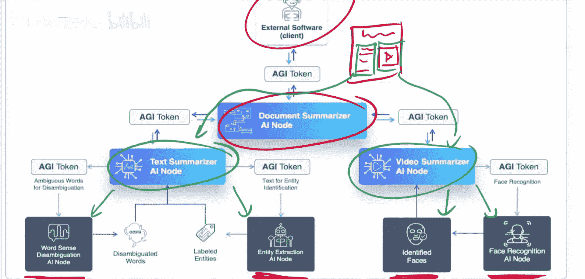

那么，SingularityNET的观点是：或许你并不想直接调用一个固定的库。或许你还不知道哪个是最好的选择。因此，他们提出了**市场**的概念。

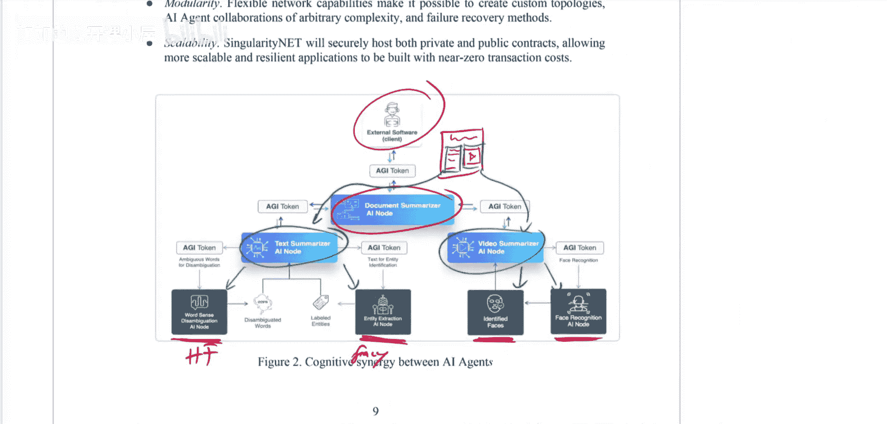

为什么AI比常规程序更需要一个市场？对于常规程序，我们通常不需要市场，直接调用库即可。为什么这对AI不够好？这里我们尝试为该系统构建一个合理的论证。

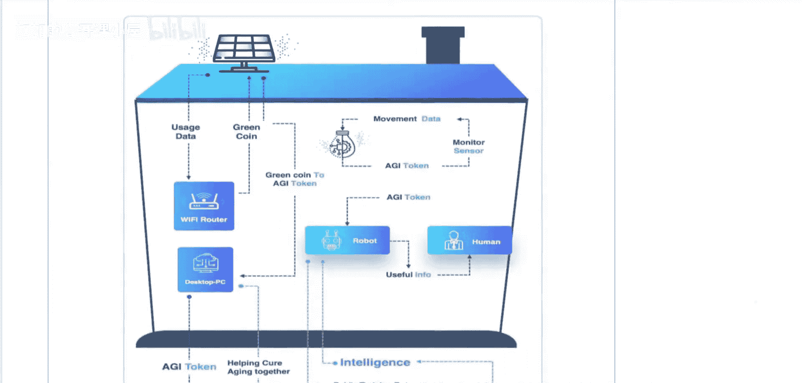

假设你是那个文本总结器节点，需要进行实体提取。你可能面临很多选择：实体提取器A、实体提取器B……等等。每当一篇新论文发布，出现一个新的实体提取器F时，你需要去Github上找到代码（代码可能还无法直接运行），将其集成到你的系统中，用你的数据集进行测试，然后判断它是否比之前的更好、是否值得采用等等。

在传统软件世界，一个库完成某项功能，其表现通常是确定的。然而，在机器学习领域，一个模型的准确率可能是90%，这已经不错了，但随后可能出现准确率达95%的新模型。你自然会希望切换到更好、更符合你需求、在你的测试集上表现更优的模型。这就是为**AI市场**存在价值所做的论证。

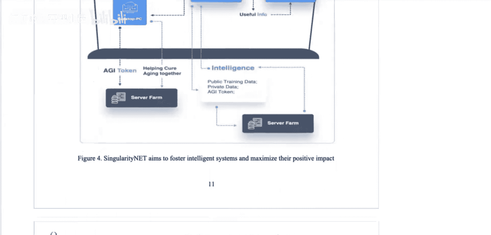

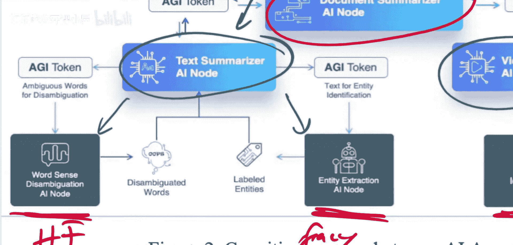

## SingularityNET的愿景

SingularityNET的愿景如下：假设我是一名研究员，我提出了一个新的实体提取器。我发表了论文，可能还有一些代码。我可以将我的模型接入SingularityNET网络，并在此进行宣传，比如称为“实体提取器X”。

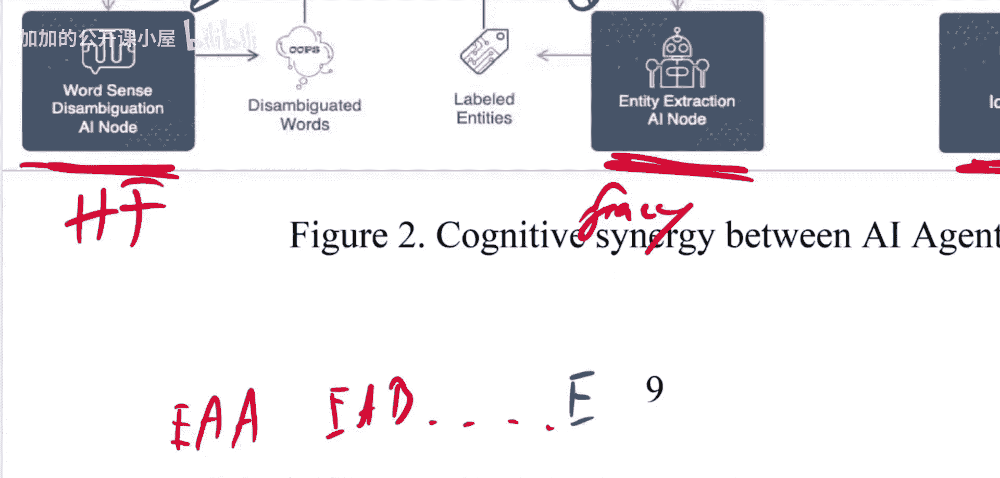

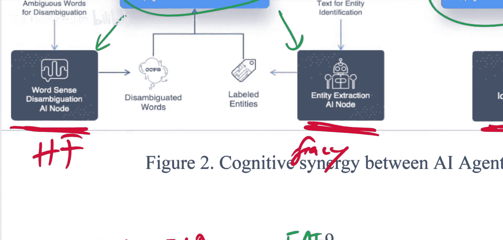

之后，网络中所有其他需要实体提取的节点（不仅是文本总结器，还有很多其他节点）都可以以一种自动化的方式，用它们拥有的测试数据集来评估我的服务。如果我的服务对它们而言比竞争对手更好，或者更便宜，它们就会切换来使用我的代码。

作为研究员，我因此可以获得报酬，因为每次有节点调用我的服务，它们都会为分析其数据而向我支付费用。

这就是**AI市场**背后的核心理念。

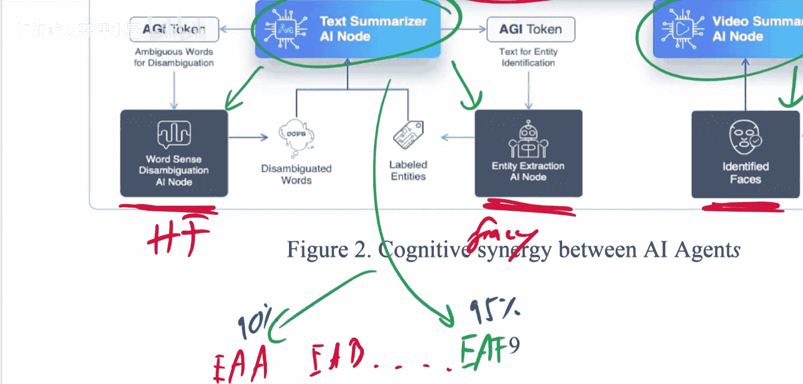

## 市场整体架构

那么，整个AI市场的架构大致如下图所示。其中包含许多组件，我们将逐一解析。它混合了概念性和技术性的描述。但归根结底，其参与者包括：

*   **消费者**：可以是人类。
*   **AI服务提供者**：提供各种AI能力的节点。
*   **市场与区块链层**：处理交易、支付和合约。
*   **治理与评级系统**：由社区管理网络，并通过评级系统评估服务质量。

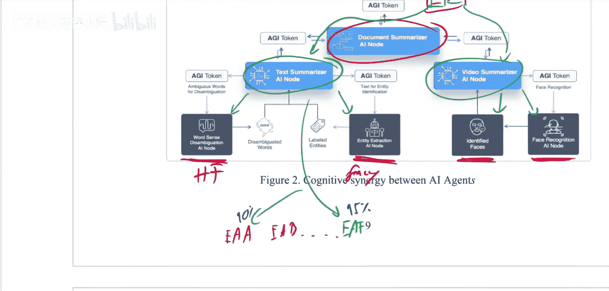

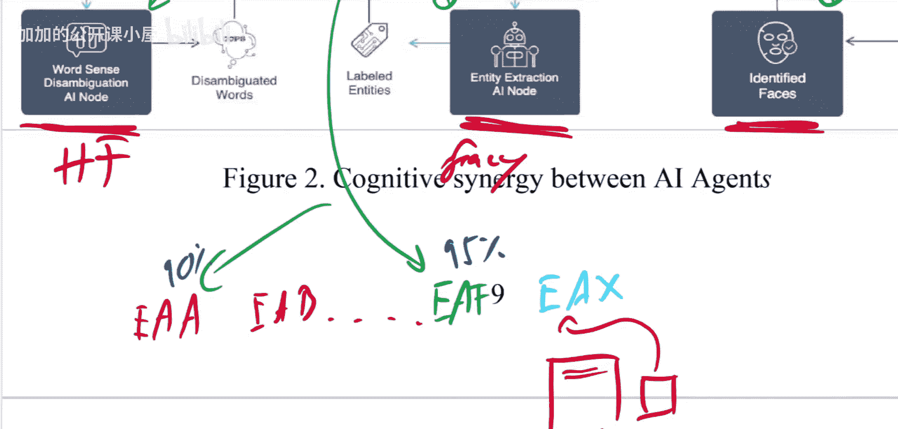

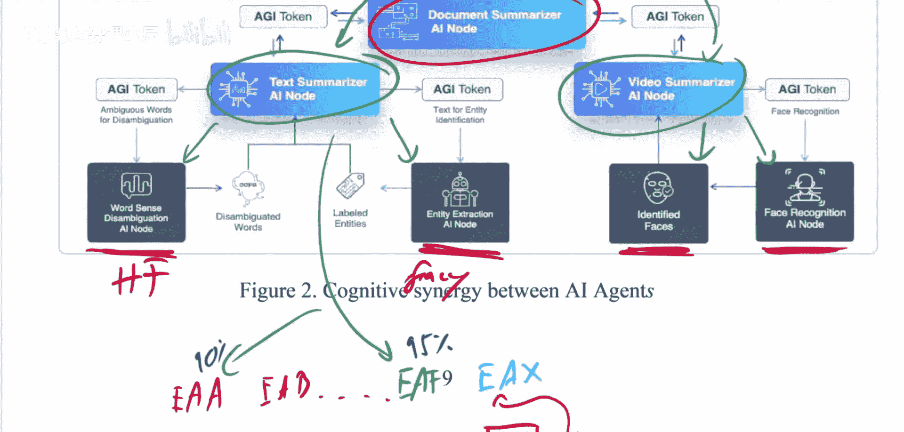

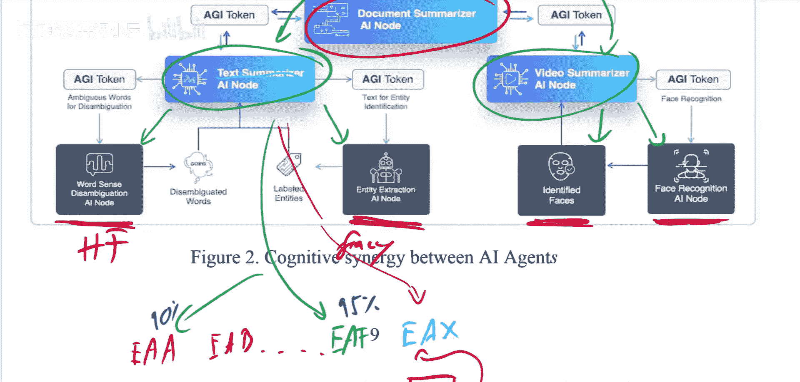

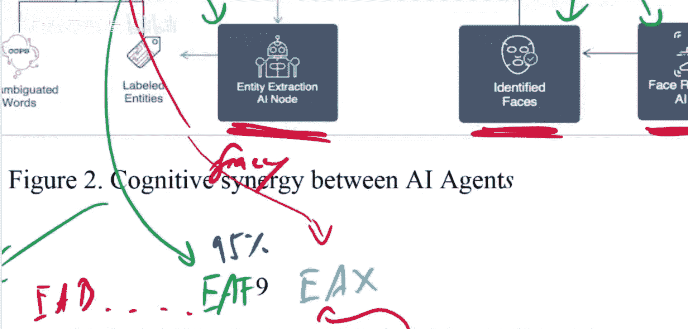

以下是该生态系统的关键组成部分列表：

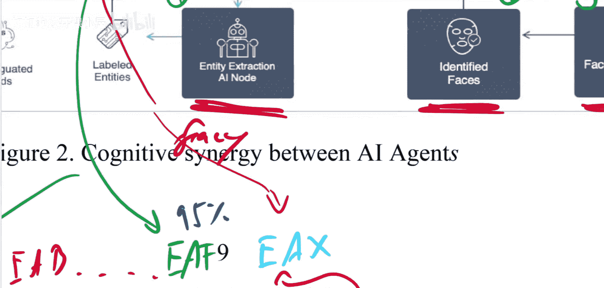

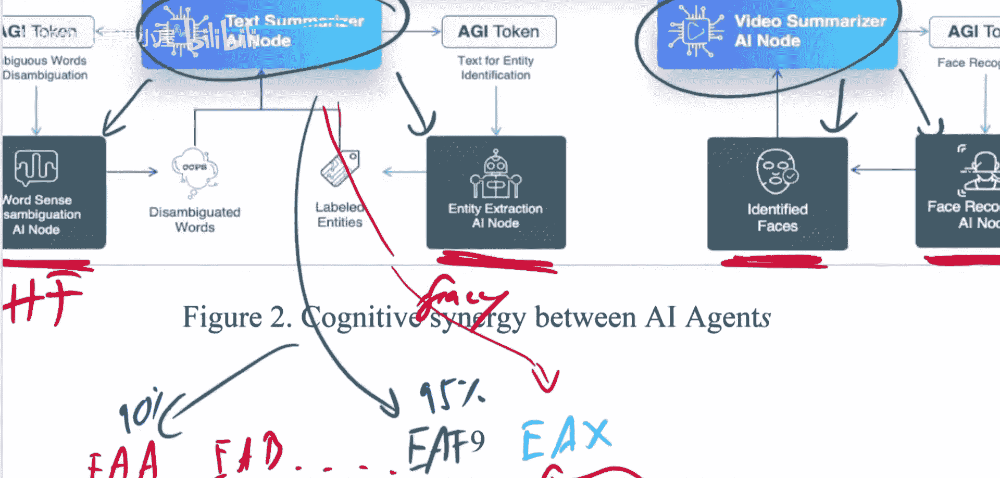

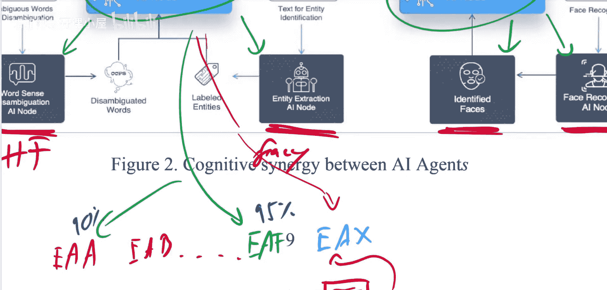

*   **去中心化网络**：AI服务分布在多个节点上，而非由单一实体控制。
*   **代币经济**：使用原生代币（如AGIX）进行服务支付和激励。
*   **智能合约**：自动执行服务调用、支付和协议。
*   **社区治理**：通过代币持有者投票等方式决定网络发展方向。
*   **评级与信誉系统**：帮助消费者选择高质量、可靠的服务提供者。

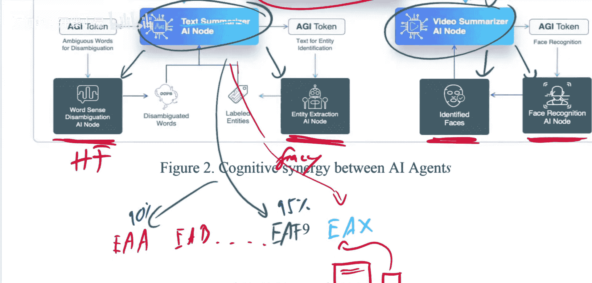

## 总结

本节课中我们一起学习了SingularityNET白皮书的核心内容。我们了解到它旨在构建一个**去中心化的全球AI服务市场**，通过区块链技术实现AI服务之间的价值交换与自动化协作。其核心论点是：相较于传统静态软件库，一个动态、竞争性的市场更能适应AI模型快速迭代和性能差异化的特点，从而促进创新和效率。尽管该愿景宏大且融合了众多流行概念，但其实际落地效果与面临的挑战（如技术复杂性、市场接受度、治理效率等）仍需持续观察。