# 015：用反馈记忆解决Transformer的若干局限性（技术解析）

在本节课中，我们将要学习一篇名为《反馈式Transformer》的论文。这篇论文由Facebook AI Research的Angela Fan、Thibaut Lavril、Ari Holtzman和Sumit Chopra共同撰写。我们将探讨它如何通过引入“反馈记忆”机制，来解决传统Transformer模型在解码时存在的一些局限性。

## 概述

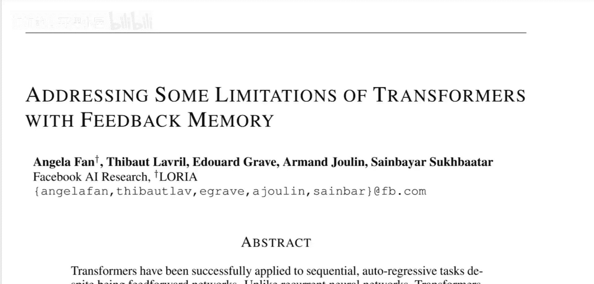

传统Transformer模型，特别是那些使用因果掩码进行训练的解码器，存在一个核心问题：它们无法充分利用所有已计算的信息。为了能够并行训练，模型牺牲了利用这些信息的能力。反馈式Transformer通过引入反馈记忆，让模型能够考虑所有可用的信息。虽然新模型无法像旧模型那样快速并行训练，但它可以用更少的层数（即更浅的网络）构建，并且拥有更长的记忆能力。这对于需要多步推理或处理较长序列的任务尤其有帮助，例如强化学习和其他序列任务。

## 传统序列模型回顾

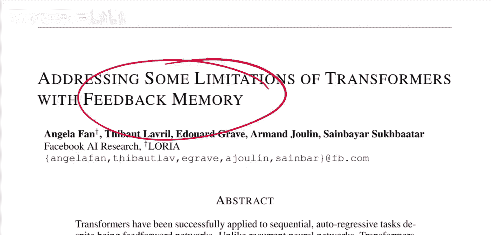

上一节我们介绍了论文要解决的问题，本节中我们来看看背景知识。为了理解反馈式Transformer的创新之处，我们需要先回顾两种传统的序列建模方法：循环神经网络和Transformer。

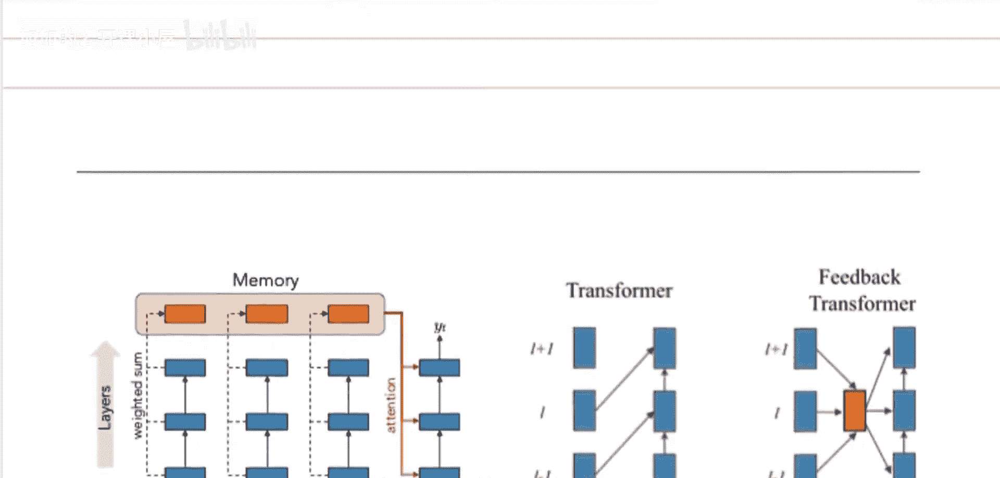

### 循环神经网络

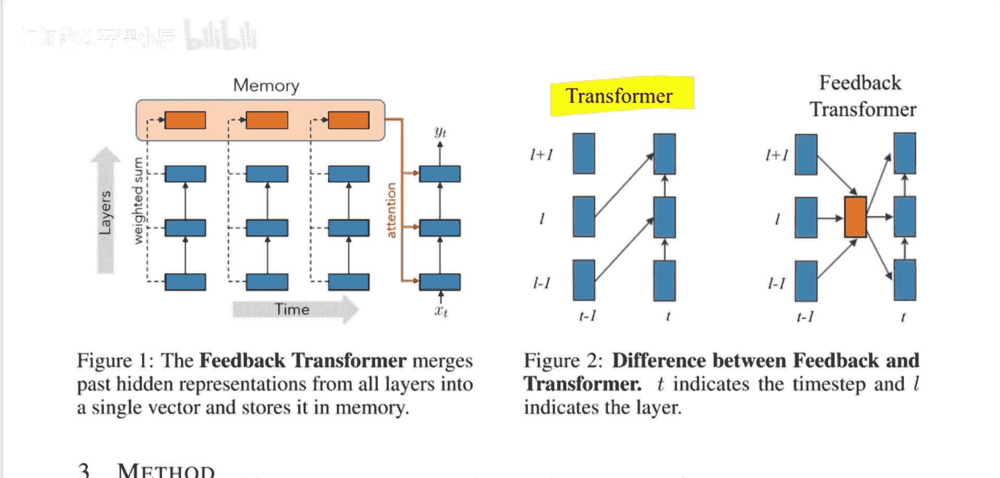

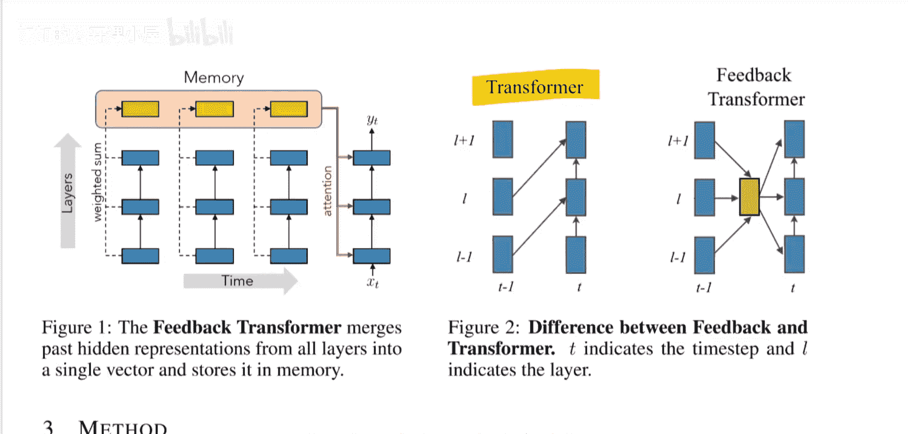

循环神经网络是处理序列数据的早期方法。它们的工作原理是逐步处理输入，并维护一个隐藏状态来传递信息。

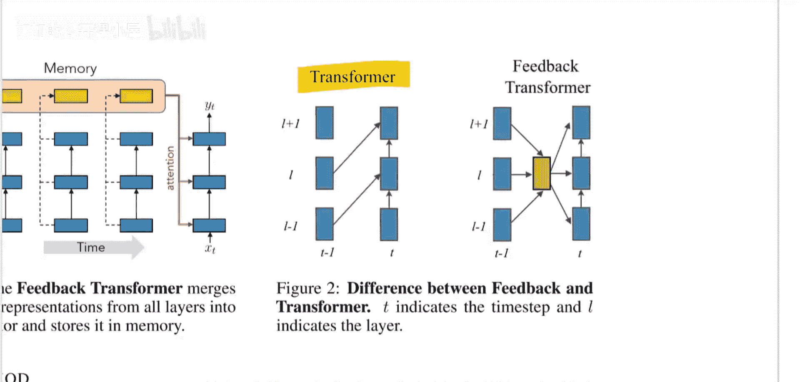

以下是RNN的基本工作原理：
1.  模型接收一个输入（例如一个词）。
2.  该输入与上一个时间步的隐藏状态结合，通过一个神经网络层，生成当前时间步的隐藏状态。
3.  这个新的隐藏状态被传递到下一个时间步，并与下一个输入结合。
4.  最终，最后一个隐藏状态用于预测序列的下一个元素（例如下一个词）。

数据流动可以表示为：`hidden_state_t = f(input_t, hidden_state_{t-1})`

多层RNN会堆叠多个这样的层，形成类似网格的结构，信息在层间和时间步间流动。虽然连接紧密，但信息若要在序列中相距较远的两个位置（例如句子开头的“Frank”和后面的“他”）之间传递，需要经过许多计算步骤，这可能导致信息丢失或难以捕捉长期依赖。

### Transformer模型

Transformer采用了一种不同的方式来处理序列。它通过自注意力机制，让序列中任意位置的信息都能在单层内直接交互。

以下是Transformer的核心机制：
1.  在每一层，模型为序列中的每个位置计算一个表示。
2.  每个位置的表示是通过聚合**同一层内**所有其他位置的表示（经过加权计算）而得到的。
3.  通过堆叠多层，高层的表示可以间接地融合来自序列所有位置的信息。

信息聚合可以表示为：`representation_i^l = Attention(representation_1^{l-1}, ..., representation_n^{l-1})`

这种方式使得任意两个位置的信息融合只需要一层计算，而非像RNN那样需要多个时间步。这使得Transformer在处理需要复杂、全局交互的任务时更加强大，例如理解一段代码并预测其输出。

## 传统Transformer的局限性

上一节我们回顾了RNN和Transformer的基本原理，本节中我们来看看论文指出的传统Transformer（特指解码器）的具体问题。

虽然Transformer在信息融合上很高效，但为了能够并行训练（这是其巨大优势），它采用了一种“因果掩码”策略。这意味着在预测第`t`个位置时，模型只能看到第`1`到`t-1`个位置的信息。更重要的是，**每一层都只能看到其正下方前一层的对应位置及之前的信息**。

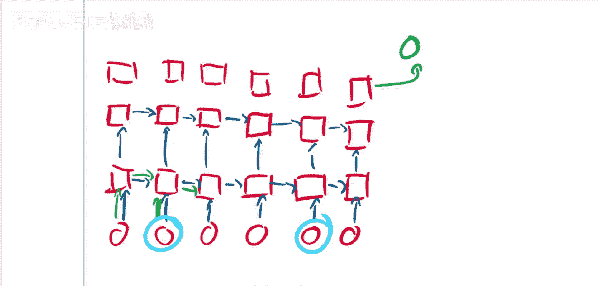

这导致了一个关键限制：模型在计算高层表示时，无法利用同一时间步内、低层已为后续位置计算出的信息。例如，在预测序列中靠后的位置时，模型底层的网络已经为更靠后的位置完成了部分计算，但这些信息由于因果掩码的限制，无法被当前预测所用。模型为了训练速度，牺牲了这部分理论上可用的信息。

## 反馈式Transformer的解决方案

上一节我们明确了问题所在，本节中我们来看看反馈式Transformer是如何通过“反馈记忆”来解决这个问题的。

反馈式Transformer的核心思想是打破层与层之间严格的前向传递限制，允许信息从低层“反馈”到高层，甚至跨越时间步。

以下是反馈式Transformer的关键设计：
1.  **反馈记忆**：模型维护一个额外的记忆模块，用于存储所有层在所有已处理时间步上计算出的表示。
2.  **全局信息访问**：在计算某一层在某一时间步的表示时，模型不仅关注其正下方前一层的表示，还可以通过注意力机制，访问**记忆模块中存储的所有历史表示**（包括所有层和所有更早时间步）。
3.  **信息流**：这样，信息流就变成了一个网络。低层为后续位置计算的信息，可以通过记忆模块被高层在预测较早位置时使用。

这个过程可以概念化为：`representation_i^l = Attention( [memory_bank], representation_i^{l-1} )`，其中`memory_bank`包含了所有历史状态。

## 优势与影响

上一节我们介绍了反馈记忆机制，本节中我们来看看这种设计带来的好处。

引入反馈记忆后，模型获得了以下优势：
1.  **更强的表达能力**：模型能够利用所有已计算的信息，理论上可以进行更复杂的推理。这在需要多步逻辑判断的任务（如代码执行、数学推理）上表现尤为突出。
2.  **更浅的网络结构**：由于每一层都能直接访问丰富的原始和历史信息，模型无需堆叠很多层来融合信息。论文中展示，一个浅层的反馈式Transformer可以达到甚至超越更深层传统Transformer的性能。
3.  **更长的有效记忆**：信息可以通过记忆模块长期保存并被随时调用，缓解了传统模型因固定上下文窗口或信息逐层传递而导致的记忆衰减问题。

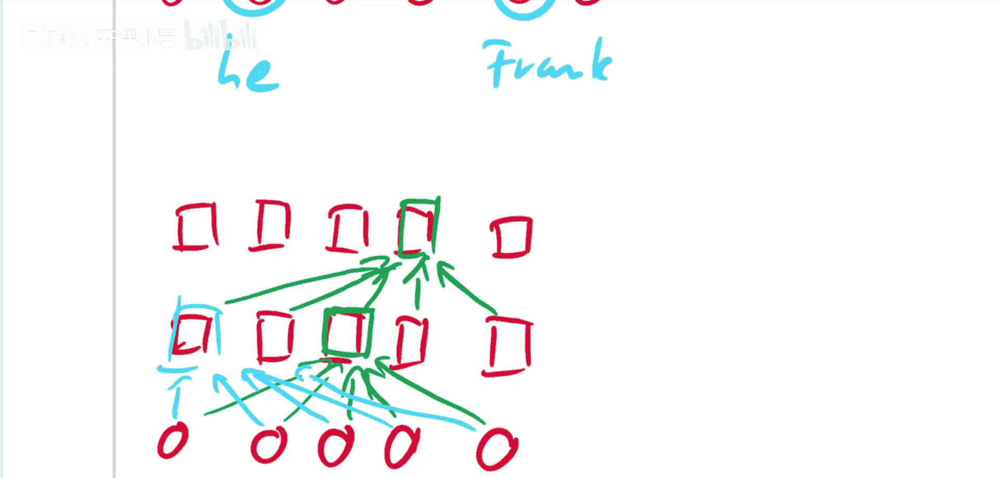

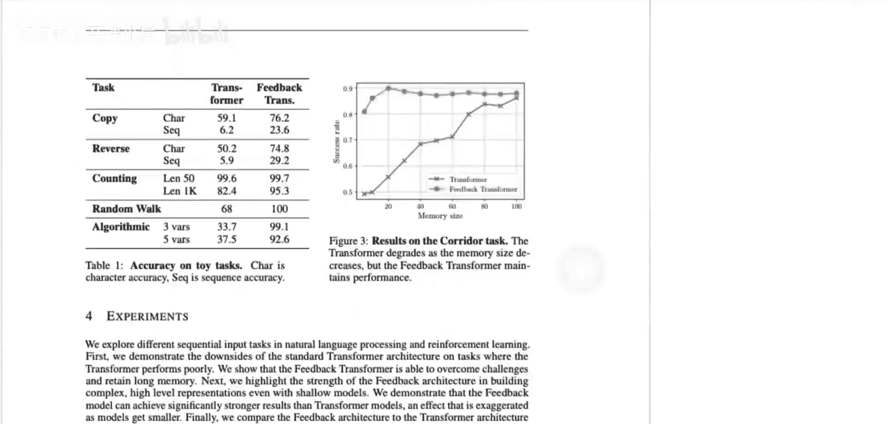

当然，这种设计的代价是**无法进行完全并行化的训练**，因为当前时间步的计算依赖于之前所有时间步的记忆更新，这增加了训练的时间复杂度。

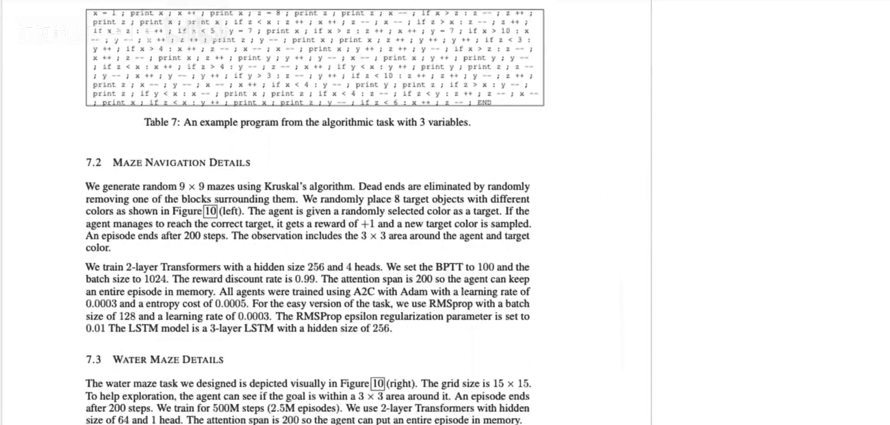

## 总结

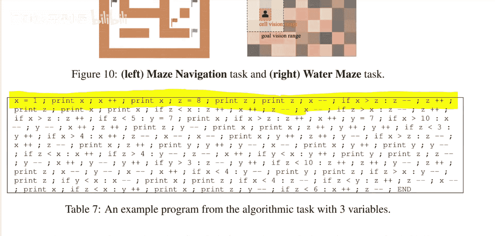

本节课中我们一起学习了反馈式Transformer这篇论文。我们首先回顾了RNN和传统Transformer处理序列的方式及其优缺点。然后，我们指出了传统解码器Transformer为了并行训练而牺牲信息利用率的局限性。接着，我们深入探讨了反馈式Transformer的核心创新——反馈记忆机制，它通过一个全局可访问的记忆模块，让模型能够充分利用所有已计算的历史信息。最后，我们总结了这种设计带来的优势，包括更强的推理能力、更浅的网络结构和更长的记忆，同时也指出了其在训练效率上的折衷。反馈式Transformer为改进Transformer架构提供了一种有趣的新思路，特别是在需要复杂、长程依赖推理的任务上。