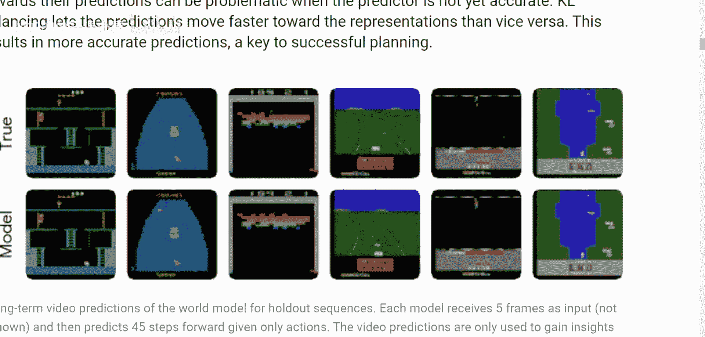
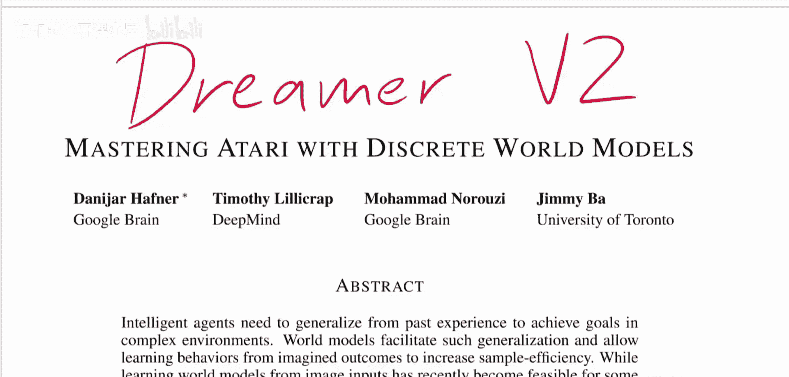
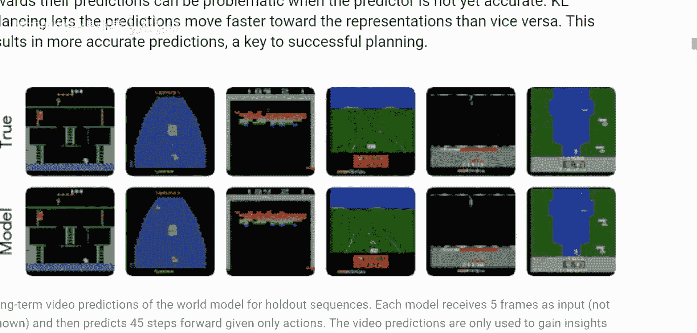
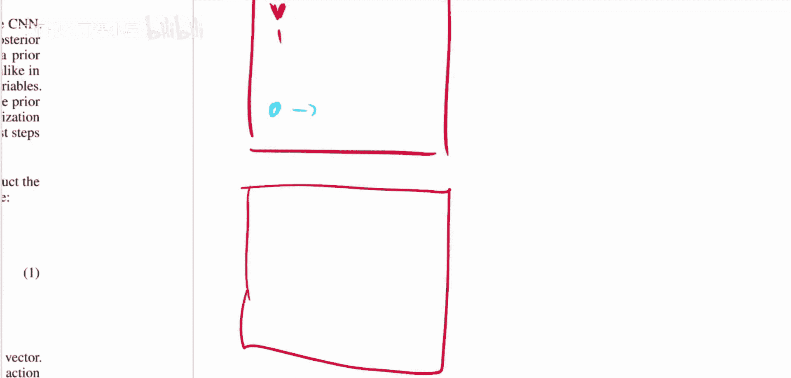

# 020：通过离散世界模型掌握Atari游戏

在本节课中，我们将要学习一篇名为《Mastering Atari with Discrete World Models》的论文，它介绍了Dreamer v2算法。该算法通过一种新颖的“世界模型”，在Atari游戏上实现了高效的强化学习，并超越了当时许多先进的模型。

## 概述：什么是世界模型？

上一节我们介绍了论文的背景和目标，本节中我们来看看世界模型的核心概念。世界模型是一种能够预测环境未来状态的模型。在强化学习中，智能体与环境交互，接收观察（如图像），执行动作，并获得奖励。世界模型的目标是学习这种交互的动态规律，即给定当前观察和动作，预测下一个观察和奖励。

通过拥有一个准确的世界模型，智能体可以在“想象”中模拟游戏过程，而不是必须进行实际、耗时的游戏试错，从而极大地提高学习效率。

## 模型基础与模型无关强化学习

在深入Dreamer v2之前，我们需要理解两种主要的强化学习范式：**模型基础**和**模型无关**。

*   **模型无关强化学习**：智能体直接在与环境的交互中学习最优策略。它不显式地对环境动态建模，而是通过试错来调整其行为。常见的算法如DQN、Rainbow就属于此类。其过程可以概括为：观察状态 -> 选择动作 -> 获得奖励 -> 更新策略。
*   **模型基础强化学习**：智能体首先学习一个描述环境如何变化的世界模型。然后，它利用这个模型进行规划或策略学习，而无需或减少与真实环境的交互。Dreamer系列算法就属于此类。

两者的核心区别在于是否显式地构建并利用了对环境动态的预测模型。

## Dreamer v2 算法框架

了解了基本概念后，我们来看Dreamer v2是如何工作的。它的流程清晰，分为两个主要阶段：

以下是Dreamer v2的两个核心步骤：

1.  **学习世界模型**：利用历史交互数据（观察、动作、奖励）训练一个世界模型。这个模型能够根据过去的帧和动作，预测未来的游戏帧和奖励。
2.  **在世界模型中进行强化学习**：冻结世界模型的参数，将其作为一个模拟环境。智能体（Actor）在这个模拟环境中通过Actor-Critic方法进行训练，学习如何最大化累积奖励。

这两个步骤可以循环进行：用学到的策略收集新数据，用新数据改进世界模型，再用改进的世界模型训练更好的策略。

## 核心创新：离散潜在状态

Dreamer v2相比前代及其他模型基础方法的关键创新，在于其世界模型中**潜在状态的表示形式**。

*   许多先前的工作（如Dreamer V1）将潜在状态建模为连续的**高斯随机变量**。
*   Dreamer v2则将其建模为**分类随机变量**。这意味着潜在空间被离散化为多个类别，潜在状态由这些类别上的概率分布表示。

用公式描述，潜在状态 `z_t` 服从一个分类分布：
`z_t ~ Categorical(probabilities)`

论文发现，这种离散化表示特别适合像Atari这样具有复杂视觉观察和离散动作空间的环境，能带来更稳定、更准确的世界模型。

## 实验结果与意义

那么，Dreamer v2的效果如何呢？根据论文中的实验结果，在Atari基准测试中，Dreamer v2的表现令人印象深刻。

以下是其在部分游戏上的关键结果：

*   它超越了当时许多先进的**模型无关**算法，如Rainbow、IQN。
*   它成为了当时**单GPU**上性能最强的智能体。
*   它显著提升了**模型基础**方法在Atari上的性能，证明了其离散世界模型的有效性。

这些结果表明，通过精心设计的世界模型，模型基础方法可以在挑战性的视觉输入任务上达到甚至超越模型无关方法的性能。

## 总结

本节课中我们一起学习了Dreamer v2这篇论文。我们了解了**模型基础**与**模型无关**强化学习的区别，掌握了Dreamer v2**两阶段学习**的框架：先学习一个能预测未来的世界模型，再在该模型中进行高效的策略优化。其核心创新在于使用了**离散的潜在状态**表示，这为处理像Atari这样的复杂视觉环境提供了新的有效途径。最终，Dreamer v2在Atari游戏上取得了卓越的成绩，展示了世界模型在强化学习中的强大潜力。