# 022：线性变换器实为快速权重记忆系统 🧠

在本节课中，我们将学习一篇名为《线性变换器实为快速权重记忆系统》的论文。该论文由Imanol Schuhl、Kazuki Irie和Yoshua Bengio撰写。我们将探讨线性变换器与快速权重记忆系统之间的联系，分析其记忆存储能力，并介绍论文提出的新更新机制。

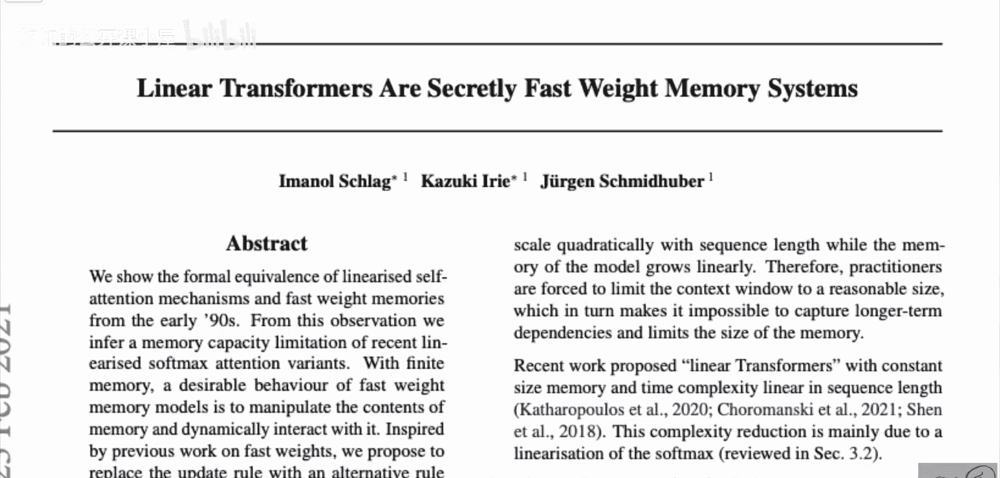

## 快速权重系统简介

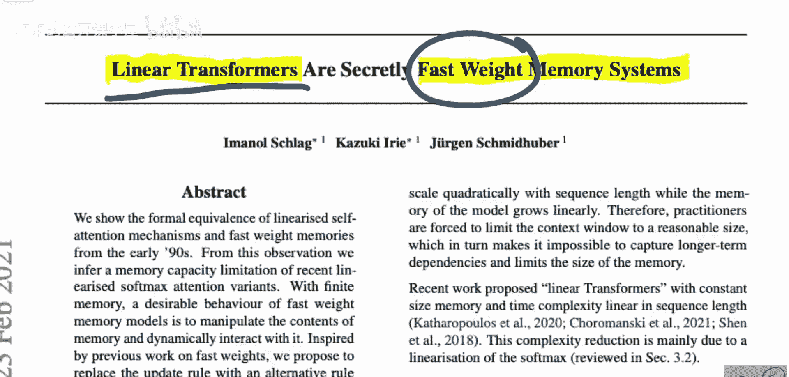

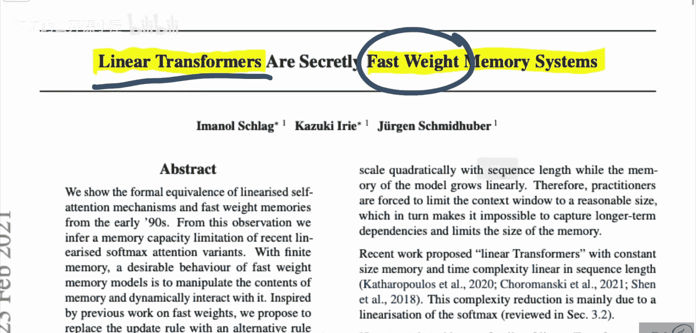

上一节我们介绍了论文的核心目标。本节中，我们来看看什么是快速权重系统。

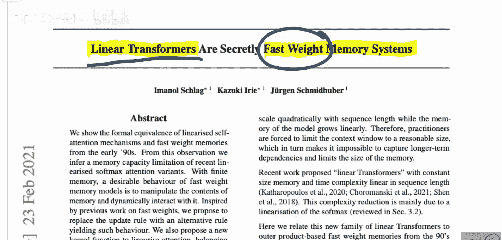

快速权重系统是指一个神经网络（或机制）为另一个神经网络生成权重的架构。生成权重的网络被称为“慢速网络”，其权重是静态的、缓慢学习的。而被赋予权重的网络被称为“快速网络”，其权重由慢速网络动态生成，因此是“快速”且依赖于上下文的。简而言之，慢速网络学习如何“编程”其快速网络。

以下是快速权重系统的一个具体示例，它基于外积更新机制：

```python
# 概念性伪代码：外积快速权重更新
# W_fast 是快速权重矩阵
# a_i, b_i 是由输入 x_i 通过线性变换得到的向量
for i in range(sequence_length):
    a_i = linear_a(x_i)  # 生成向量a
    b_i = linear_b(x_i)  # 生成向量b
    W_fast += outer_product(a_i, b_i)  # 通过外积累加更新权重
    y_i = W_fast @ x_i  # 使用当前快速权重计算输出
```

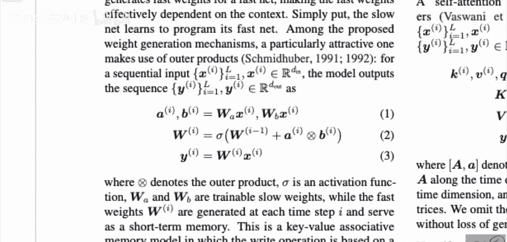

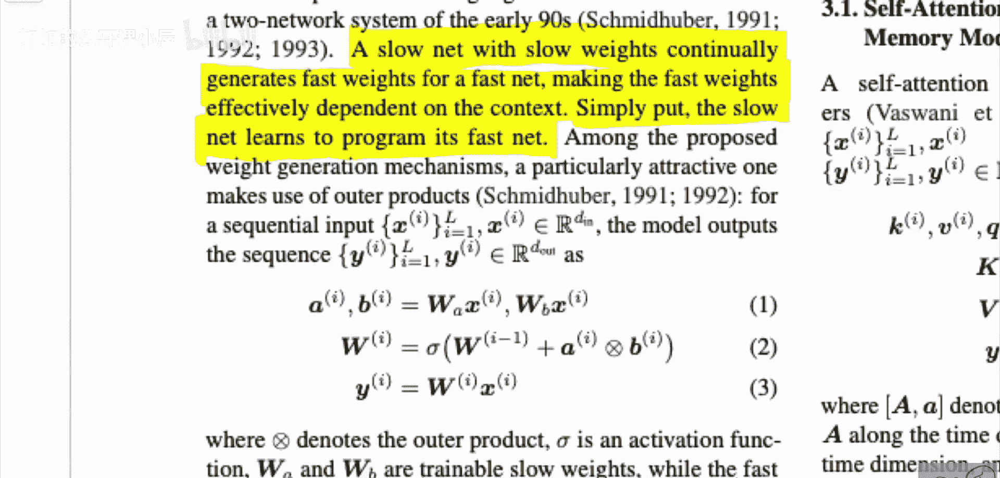

## 自回归设置与序列处理

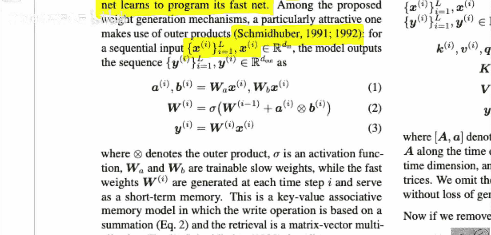

理解了快速权重的基本概念后，我们来看看它在序列处理中是如何应用的。

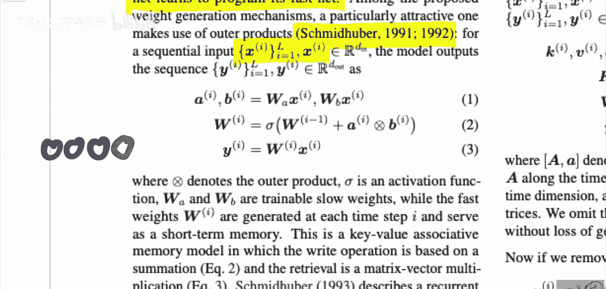

论文主要关注自回归设置。在这种设置下，模型接收一个输入序列，并逐步预测序列的下一个元素。例如，在语言建模中，模型根据已生成的词来预测下一个词。在每一步，模型都将上一步的输出作为新的输入，纳入上下文。

在快速权重系统的框架下，模型的输出是通过将当前输入与一个动态的快速权重矩阵相乘得到的。这个快速权重矩阵充当了“隐藏状态”的角色，它通过递归更新的方式，累积了所有过去输入的信息。

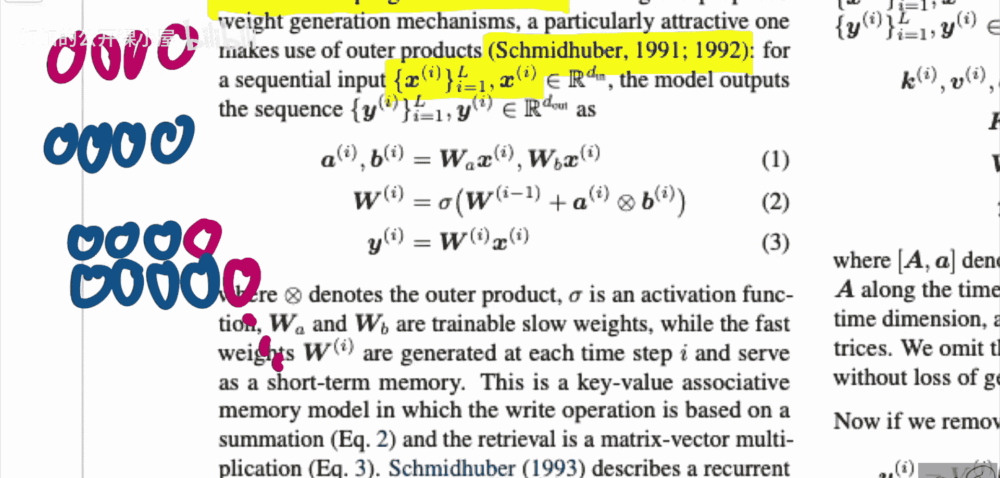

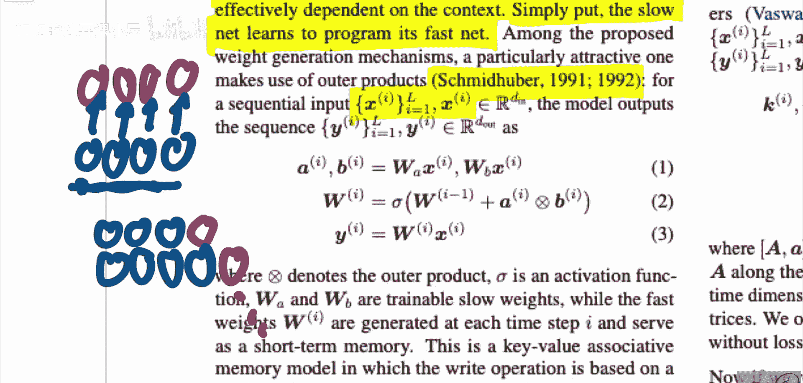

## 构建分布式表示数据库

上一节我们看到了快速权重如何存储上下文。本节中，我们深入探讨其背后的核心思想：如何将键值对存储为矩阵。

这种方法源于连接符号世界与神经网络世界的尝试。假设我们想构建一个使用分布式表示（即向量）的数据库。我们将键和值都表示为向量。

以下是构建和查询此类数据库的方法：

1.  **存储（写入）**：要将一个键值对 `(key_i, value_i)` 存入数据库，我们计算这两个向量的外积，并将其加到一个总权重矩阵 `W` 上。
    **公式**：`W += key_i ⊗ value_i`
2.  **查询（读取）**：当用一个查询向量 `query`（例如 `key_j`）查询数据库时，我们计算该查询与权重矩阵的乘积。
    **公式**：`output = W · query`

神奇之处在于，如果 `query` 与某个存储的 `key_i` 足够相似，那么输出 `output` 就会近似于对应的 `value_i`。这是因为外积和矩阵乘法的数学特性使得权重矩阵 `W` 能够近似实现基于相似性的检索。

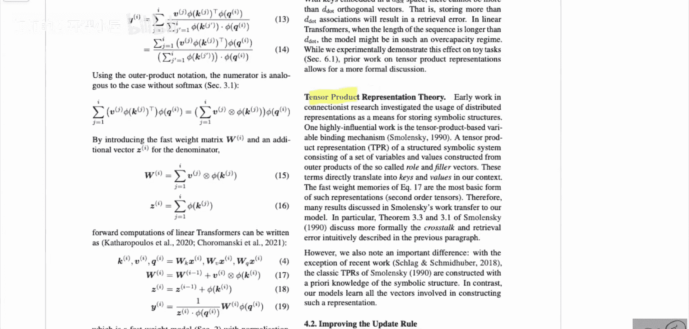

## 论文核心联系与新方法

现在，我们可以将上述概念与线性变换器联系起来。

论文的核心观点是：**自回归的线性化变换器（如Performer）在数学形式上等价于一个具有特定更新规则的快速权重记忆系统**。在标准Transformer中，注意力机制显式地计算所有历史键和值的加权和。而在线性变换器中，这种操作可以通过维护一个累积的快速权重矩阵来实现，从而避免了计算二次复杂度的注意力矩阵。

基于这种联系，论文进一步分析了这种机制的记忆容量，并提出了一种新的快速权重更新机制，旨在更稳定、更有效地存储和检索长程依赖信息。

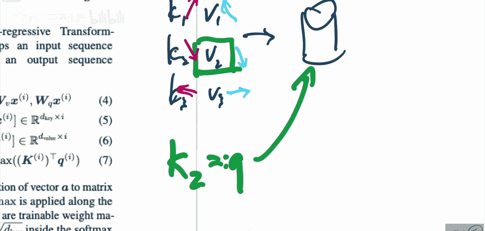

## 实验与总结

论文通过实验验证了新提出的线性化注意力机制的有效性，特别是在处理长序列任务时的性能。

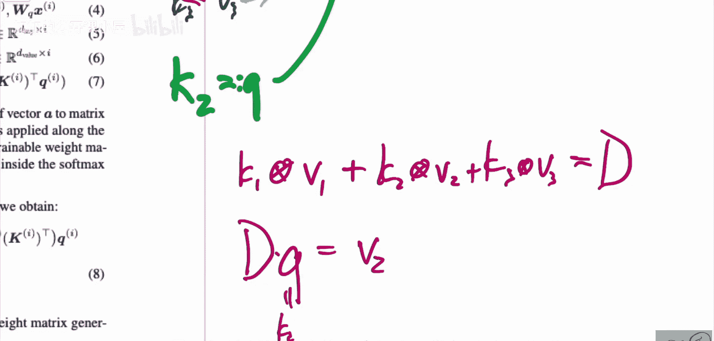

本节课中，我们一起学习了《线性变换器实为快速权重记忆系统》这篇论文。我们探讨了快速权重系统的概念，理解了其如何通过外积更新在矩阵中存储信息，并建立了其与线性变换器之间的深刻联系。这种视角不仅帮助我们理解线性变换器的工作原理，也为设计更高效、记忆能力更强的序列模型提供了新的思路。