# 023：如何在神经网络中表示部分-整体层次结构（杰弗里·辛顿论文解读）🎯

## 概述
在本节课中，我们将学习杰弗里·辛顿提出的一种名为GLOM的新颖构想。该构想旨在解决神经网络如何用固定架构解析图像，并为每张图像动态生成不同的部分-整体层次结构（解析树）的问题。请注意，这是一篇“构想论文”，并非描述一个已实现的系统，而是提出了一个可能的研究方向。

---

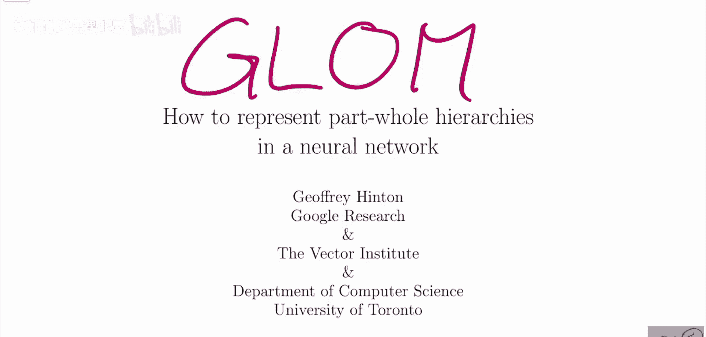

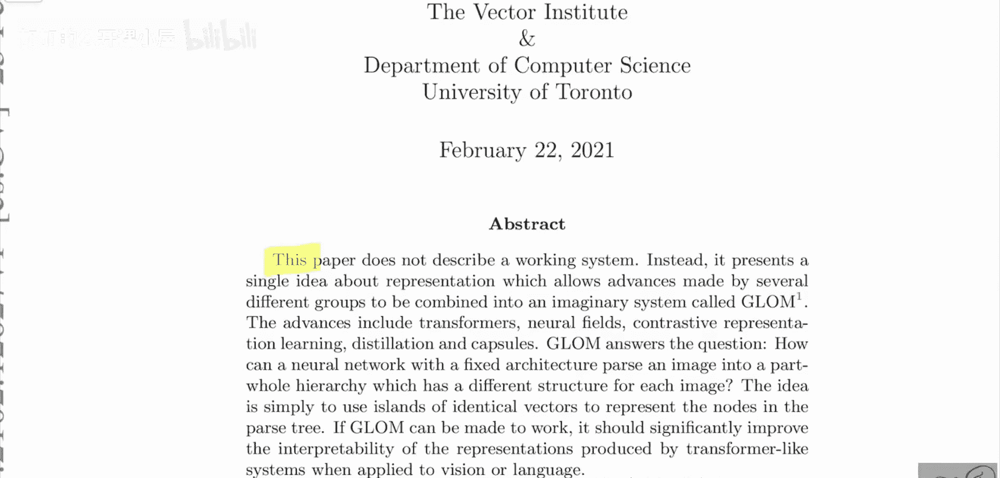

## 论文背景与动机

上一节我们概述了GLOM的目标。本节中，我们来看看这篇论文独特的性质及其倡导的科研文化。

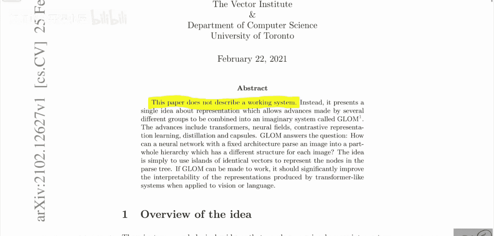

这篇论文开篇即声明，它并不描述一个可运行的系统。因此，这是一篇“构想论文”。杰弗里·辛顿提出了他关于如何解决或推进人工智能领域视觉问题的建议。他公开表示，这些只是构想，欢迎大家去验证、反驳或尝试。这种“构想论文”的形式在社区中已不常见，因为当前大家往往只追求“最先进”的成果。辛顿此举非常酷，他鼓励更多人进行此类思考。

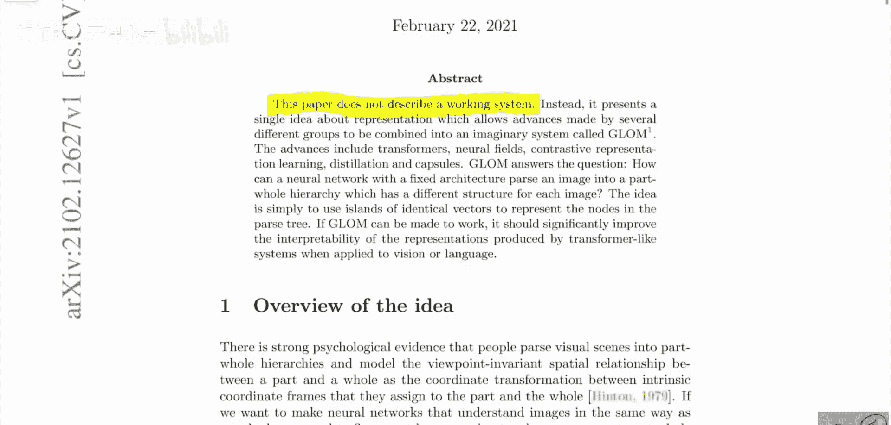

当然，辛顿在很大程度上是凭借其声誉才让这篇论文获得关注。但无论如何，任何人都可以将自己的想法写成论文发布在arXiv上，或撰写博客、制作视频。每个人都有表达观点的权利。

---

## GLOM的核心构想

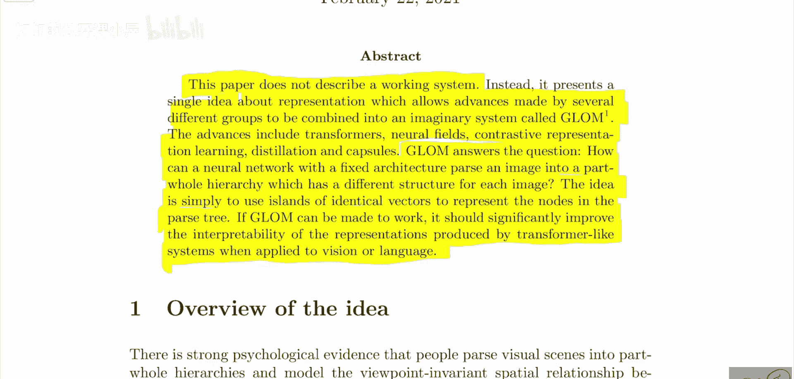

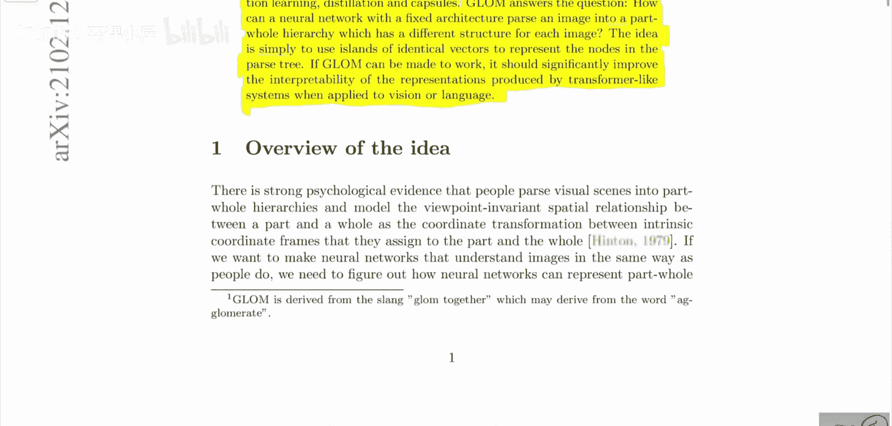

上一节我们了解了论文的背景。本节中，我们深入探讨GLOM系统本身及其要解决的问题。

GLOM一词源于“agglomeration”（聚合）。该系统提出了一个关于表征的单一构想，旨在将来自多个不同研究小组的进展结合到一个名为GLOM的设想系统中。这些进展包括：
*   变换器（Transformers）
*   神经场（Neural Fields）
*   对比表征学习（Contrastive Representation Learning）
*   蒸馏（Distillation）
*   胶囊网络（Capsules）

GLOM旨在回答一个问题：**一个具有固定架构的神经网络，如何能将图像解析成一个部分-整体层次结构（解析树），并且这个结构能随不同图像而变化？**

其核心构想很简单：**使用相同向量的“岛屿”来表示解析树中的节点。** 如果GLOM能够实现，它将显著提高类似变换器的系统在处理视觉或语言任务时所产生的表征的可解释性。

---

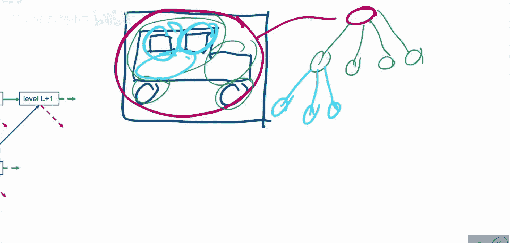

## 解析树与动态结构的挑战

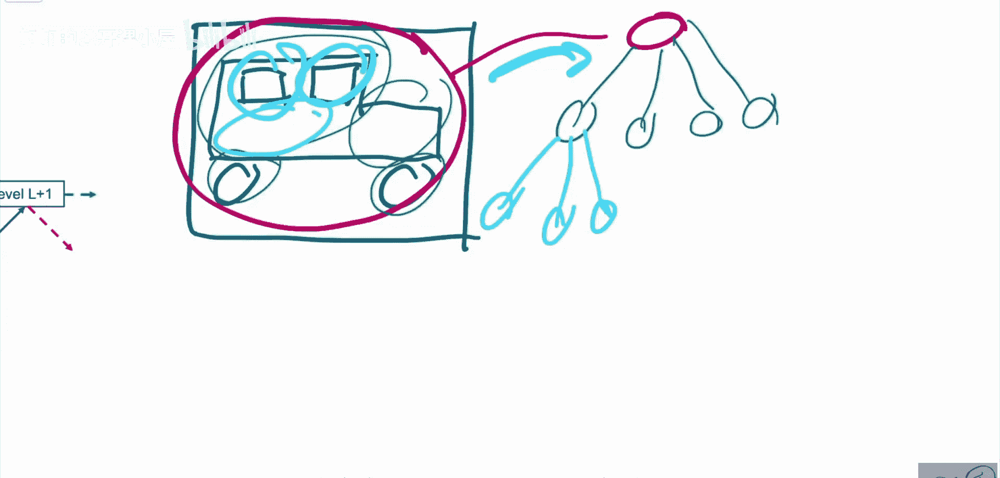

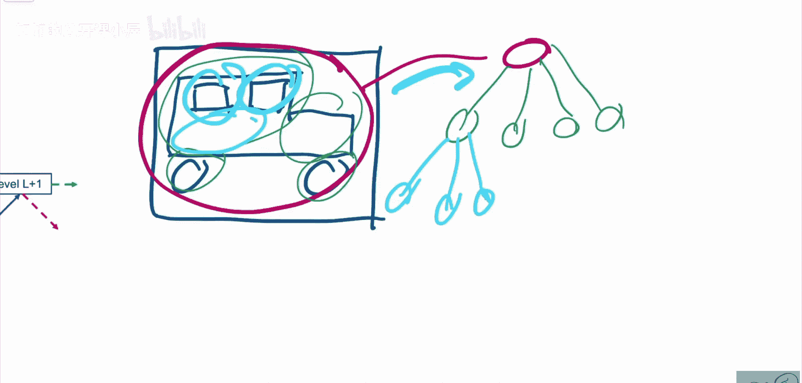

上一节我们介绍了GLOM的核心目标。本节中，我们来看看它试图建模的“解析树”具体是什么，以及为什么这是一个挑战。

辛顿从非常“以对象为中心”的视角看待视觉。假设有一张汽车的图片，其解析树可能如下所示：
*   顶层节点代表整个“汽车”。
*   汽车包含不同的部件，如“驾驶舱”、“发动机”和“车轮”，这些是它的子节点。
*   “驾驶舱”本身可能又包含“车窗”和“车门”等子部件。

我们希望观察一张图像，并在其上方创建这样的解析树。这属于“老式人工智能”的范畴，即试图用符号表征及符号间的关系来理解世界。

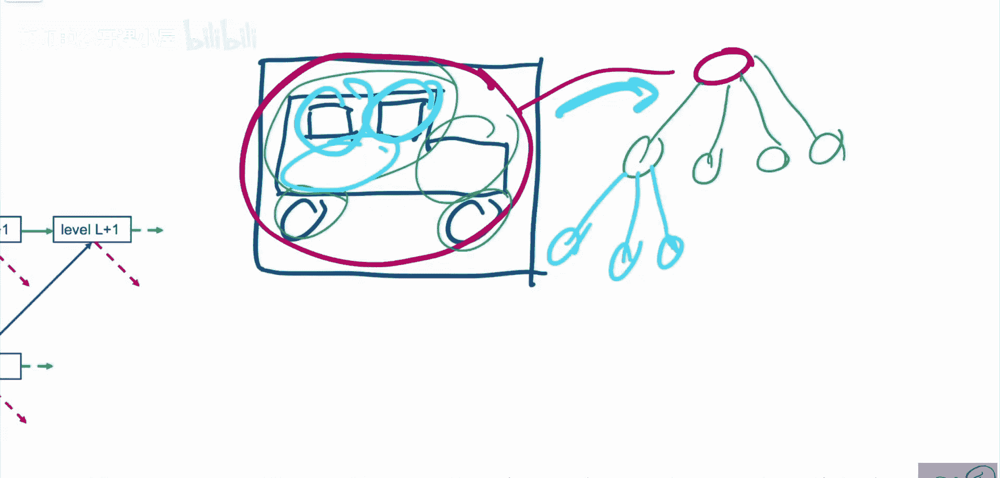

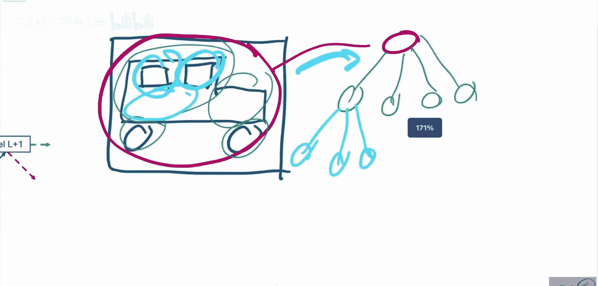

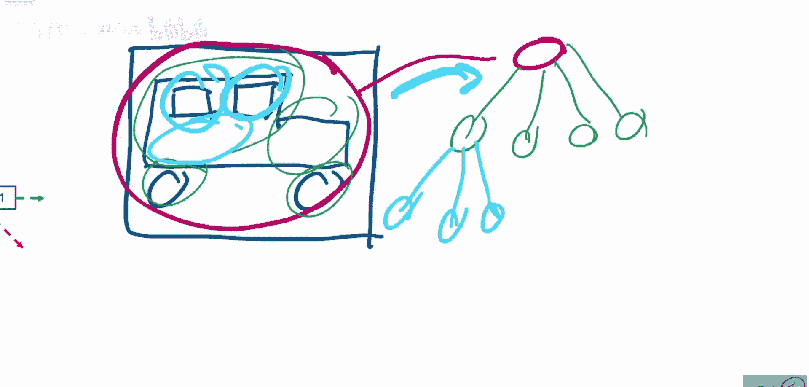

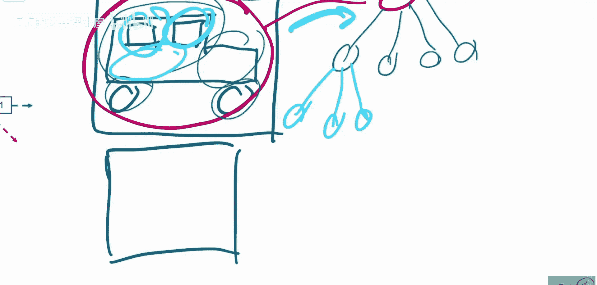

然而，辛顿指出，直接用神经网络实现这一点很困难，因为神经网络是连续的。此外，我们的大脑在处理不同输入时，其连接结构并不会每次都重新配置（尽管具有神经可塑性）。因此，我们需要一个系统：当输入一张图像时，它能给出一种解析树结构；当输入另一张图像时，它能给出另一种解析树结构（例如，图像中有两个对象，或者某个节点只有一个子节点）。**解析树的结构需要每次都不同。**

---

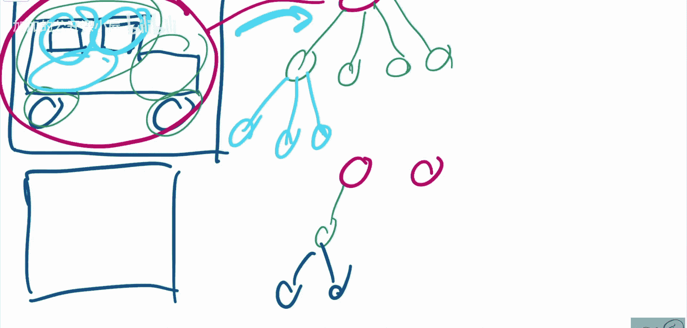

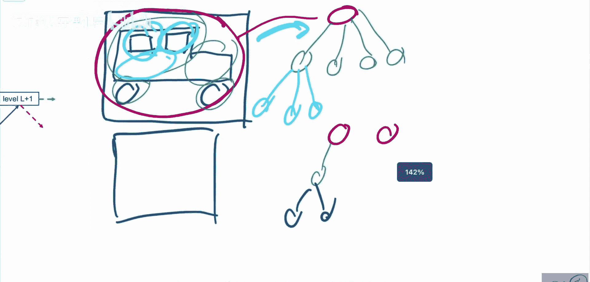

## 从胶囊网络到GLOM的演进

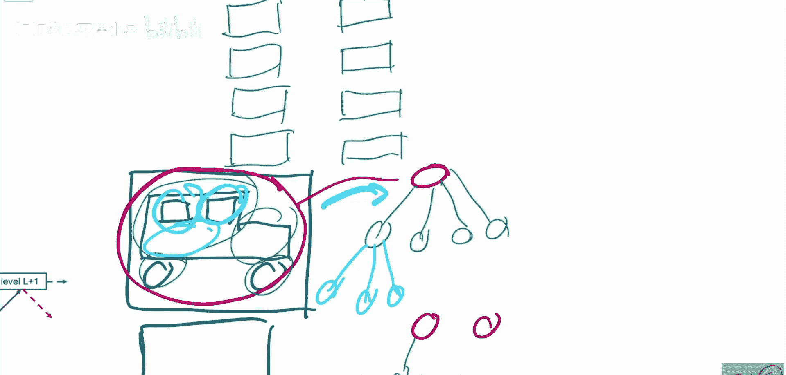

上一节我们提到了动态解析树的挑战。本节中，我们回顾一下辛顿之前提出的胶囊网络如何部分解决这个问题，以及GLOM的新思路有何不同。

胶囊网络曾试图解决这个问题。其构想是：
*   网络中有多层胶囊。
*   底层胶囊识别最细小的部件（例如“车轮胶囊”、“车窗胶囊”）。
*   当图像中存在对应物体时，相应的胶囊会被激活。
*   高层胶囊（如“驾驶舱胶囊”、“发动机胶囊”）由底层胶囊激活。
*   最终，所有这些胶囊共同激活顶层的“汽车胶囊”。

这样，解析树是动态生成的，每次的“路由”连接都可能不同。然而，这种方法需要为图像中每一个可能出现的部件都设置一个胶囊，这是不可行的，并且路由机制也非常繁琐。

因此，GLOM提出了一种新方法。

---

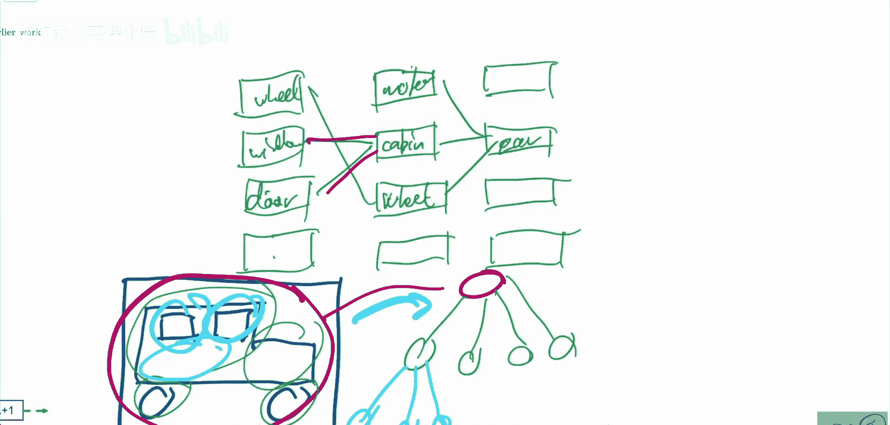

## GLOM的架构详解

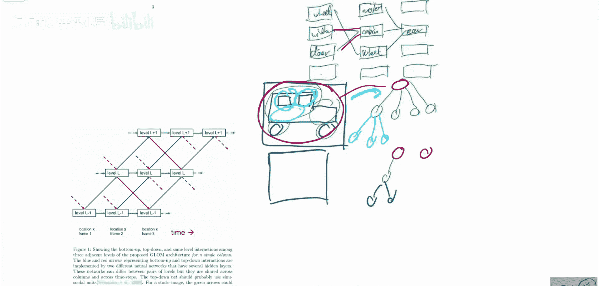

上一节我们回顾了胶囊网络的局限性。本节中，我们详细解析GLOM设想的架构。

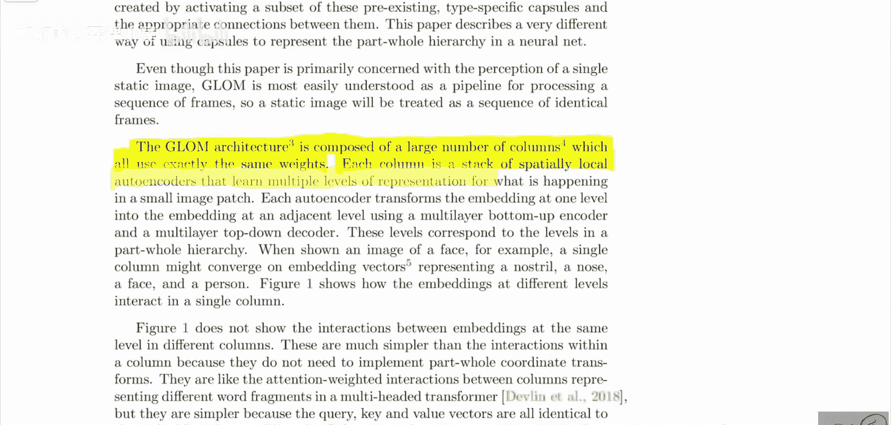

GLOM架构由大量**列**组成，这些列全部使用完全相同的权重。每一列都是一堆空间局部的自编码器，它们学习一个小图像块在多个层次上的表征。

我们可以这样想象：
*   底部是我们的图像，它被划分为多个**位置**（像素或小图像块）。
*   在每个位置的上方，都有一个垂直的“列”。
*   每个列被分成多个**层级**（辛顿建议大约5层）。
*   列的每一层都试图以不同的“分辨率”来表征其下方图像位置的内容。
*   例如，最底层可能感知到“这是车轮的一部分”，而更高层则可能整合信息，表征“这是一个车轮”乃至“这是一辆汽车”。

其关键思想在于，**解析树中的每个节点（如“汽车”、“车轮”）并非由某个特定的、预先分配的神经元或胶囊表示，而是由跨多个空间位置、在某一特定层级上拥有相似或相同激活向量的神经元集群来表征。** 这些“相同向量的岛屿”就构成了解析树的节点。

---

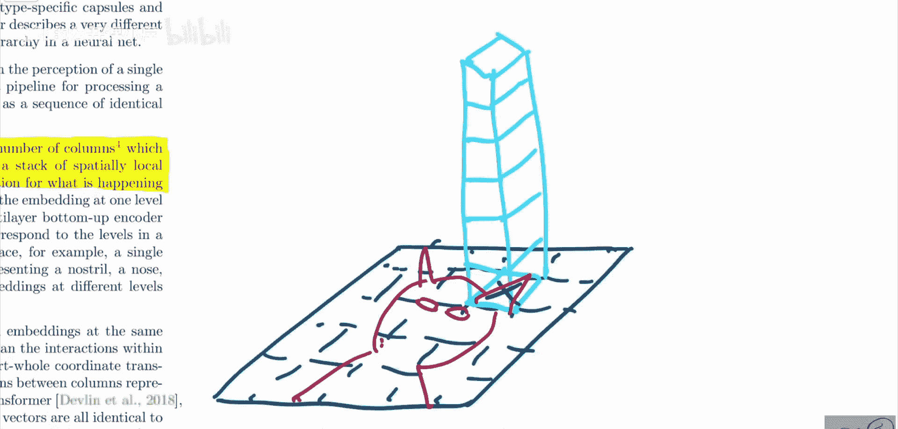

## 总结
本节课中，我们一起学习了杰弗里·辛顿的GLOM构想。我们了解到这是一篇旨在激发讨论的“构想论文”，其核心目标是让固定架构的神经网络能为每张输入图像动态形成不同的部分-整体层次结构。GLOM通过结合变换器、对比学习等多种技术，设想用“相同向量的岛屿”来表征解析树中的节点，以此替代之前胶囊网络中繁琐的预设胶囊和路由机制。虽然GLOM尚未实现，但它为神经网络的可解释性和结构感知表征提供了一个重要的思考方向。