# 025：智能的暗物质（FAIR博文解读）

## 概述

在本节课中，我们将学习由Yann LeCun和Ishan Misra撰写的Facebook AI研究（FAIR）博文，探讨自我监督学习的概念、重要性及其在人工智能发展中的核心作用。我们将了解为何作者将自我监督学习视为“智能的暗物质”，并解析其与监督学习、无监督学习的区别，以及当前的主要方法和发展方向。

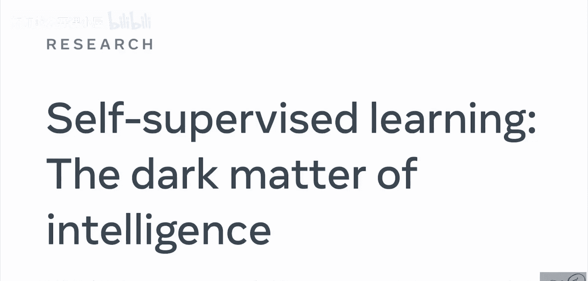

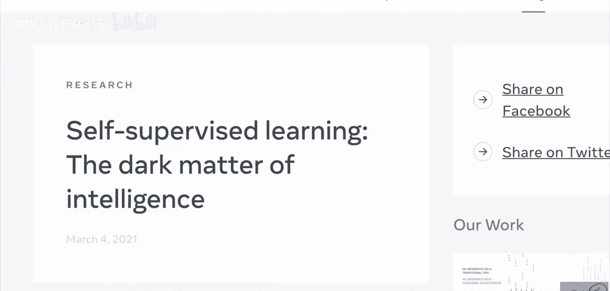

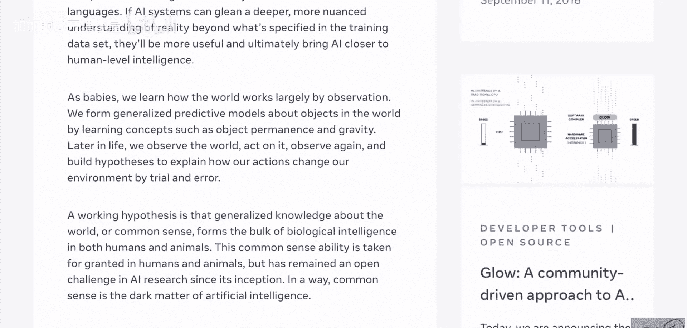

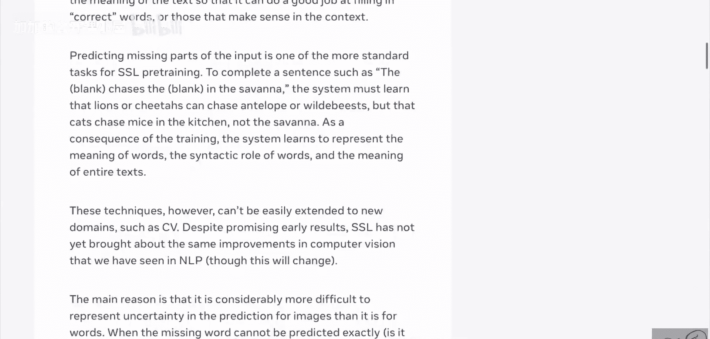

---

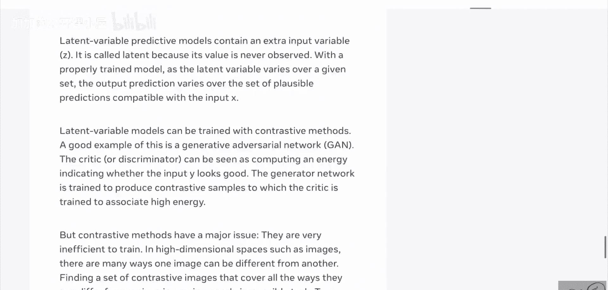

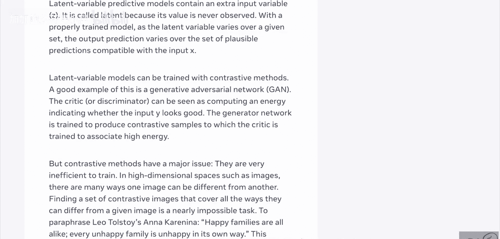

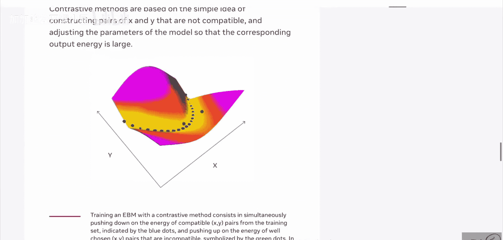

## 监督学习的局限性与挑战

上一节我们介绍了课程概述，本节中我们来看看作者对当前主流人工智能范式的分析。

博文指出，近年来，人工智能领域在使用大量精细标注数据训练AI系统方面取得了巨大进展。监督学习在训练执行特定任务的专家模型方面拥有良好的记录。然而，这种范式存在两个主要瓶颈。

以下是监督学习面临的核心挑战：

1.  **数据标注成本高昂**：为了将机器学习能力推向更高水平，我们需要数量级更多的数据。为海量数据提供精细标注将非常昂贵。
2.  **模型泛化能力有限**：通过监督学习训练的模型可能在特定任务上表现极好，但难以成为能执行多任务、无需大量标注数据即可获取新技能的通用智能模型。

作者以儿童学习识别奶牛为例进行说明：只需看到几张奶牛的图画，儿童最终就能识别出任何看到的奶牛。相比之下，基于监督学习训练的AI系统需要大量奶牛图像样本，并且可能仍然无法在奶牛处于特殊情境（例如躺在海滩上）时正确分类。其根本原因在于，人类依赖先前获取的关于世界如何运作的知识（即常识），而当前的AI系统缺乏这种背景知识。

---

## 常识：智能的暗物质

上一节我们讨论了监督学习的局限性，本节中我们将探讨作者提出的核心概念——常识。

作者认为，这种关于世界如何运作的常识构成了人类和动物生物智能的主体。在人工智能研究中，常识一直是一个悬而未决的挑战，它被视为“人工智能的暗物质”。人类从婴儿时期起，主要通过观察来学习世界如何运作，形成关于世界的预测模型，习得客体永久性、重力等概念。这种通过经验建立的对世界的理解，使得人类能够用极少的额外样本学习新任务。

因此，博文的核心主张是：**自我监督学习是构建此类背景知识、在AI系统中近似实现常识的最有前途的方法之一。**

---

## 什么是自我监督学习？

上一节我们明确了常识的重要性，本节中我们来具体看看什么是自我监督学习。

作者首先澄清了“无监督学习”这个术语可能带来的误解，指出学习从来不是真正“无监督”的。而自我监督学习特指**从数据本身生成标签**进行学习的方法。

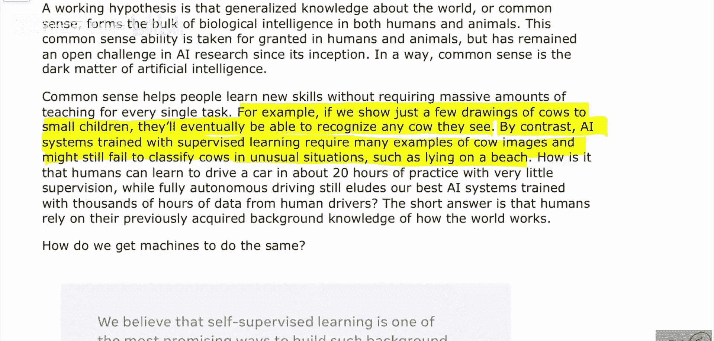

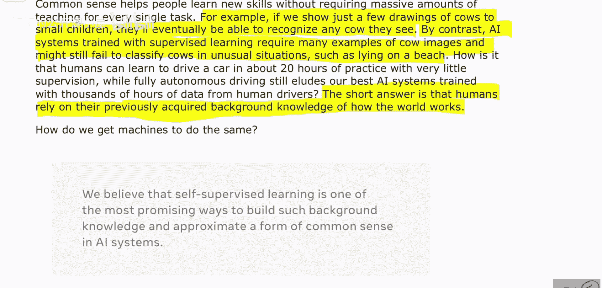

以下是自我监督学习的一个经典示例（以BERT为例）：

假设我们有一个句子：“This is a cat.” 在自我监督学习中，我们需要仅利用这个文本自身来构造输入样本 `X` 和对应的标签 `y`。BERT采用的一种方法是**掩码语言建模**：

*   **原始句子**: `This is a cat.`
*   **构造的输入 `X`**: `This is __ cat.` （将单词“a”掩码）
*   **对应的标签 `y`**: `a`

此时，机器学习系统的任务是：给定被部分破坏的输入 `X`，预测出被掩码的原始内容 `y`。为了完成这个任务，系统必须学习语言的语法、语义和上下文规律。BERT会进行更复杂的操作（如替换标记等），但其核心思想是让系统学会从损坏的输入中恢复出原始、完整的输出，从而学习到数据的内在结构和知识。

---

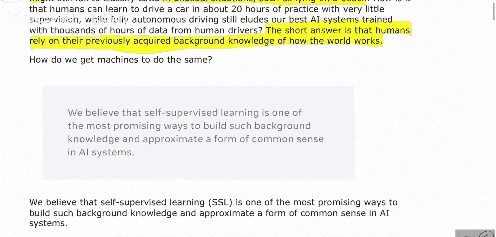

## 自我监督学习的主要方法

上一节我们通过例子理解了自我监督学习的基本思想，本节中我们来看看实现它的几种主要技术路径。

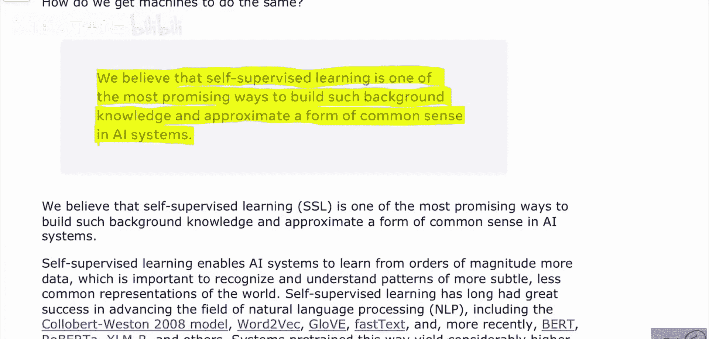

博文简要概述了几种主流的自我监督学习方法：

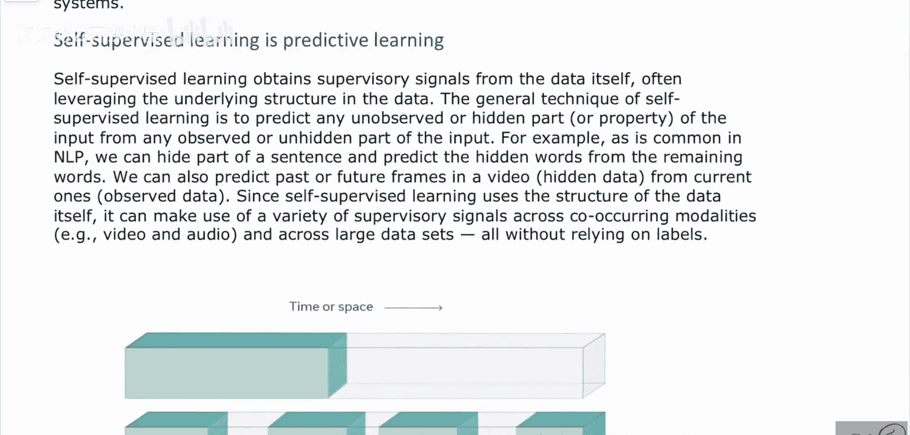

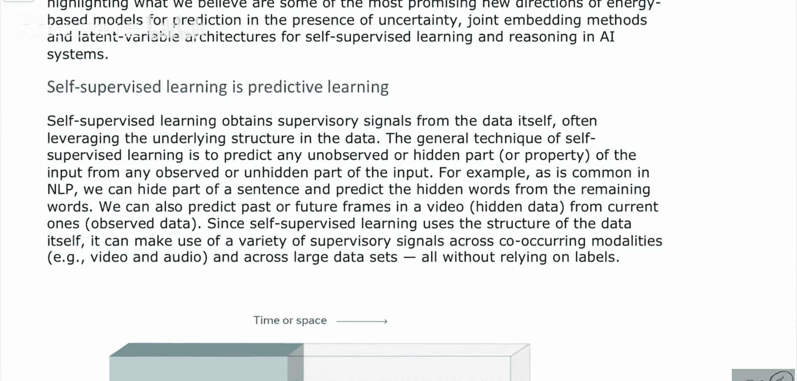

1.  **对比学习**：这种方法的核心是学习一个表示空间，使得相似的样本（正样本对）在空间中彼此靠近，而不相似的样本（负样本对）彼此远离。其目标可以简化为最小化以下形式的损失函数：
    `L = -log(exp(sim(z_i, z_j)/τ) / Σ_k exp(sim(z_i, z_k)/τ))`
    其中，`z_i` 和 `z_j` 是正样本对的表示，`sim` 是相似度函数（如余弦相似度），`τ` 是温度参数，分母对所有样本（包括负样本）求和。

2.  **基于能量的模型**：这类模型学习一个能量函数 `E(x, y)`，该函数为合理的（输入，输出）对分配低能量，为不合理的对分配高能量。训练目标是使数据分布中的样本能量低于其他配置的能量。

3.  **生成对抗网络**：GANs包含一个生成器 `G` 和一个判别器 `D`。生成器试图生成足以欺骗判别器的假数据，而判别器则试图区分真实数据和生成数据。其训练过程可以看作一个极小极大博弈：
    `min_G max_D V(D, G) = E_{x~p_data}[log D(x)] + E_{z~p_z}[log(1 - D(G(z)))]`

---

## 未来方向与总结

上一节我们介绍了当前自我监督学习的主要技术，在本节最后，我们来看看作者对未来的展望并总结全文。

博文在最后提出了高层次的发展建议。作者认为，最主要的推进方向是**构建非对比性训练的隐变量预测模型**。这意味着我们需要开发能够预测数据中隐藏结构或未来状态的模型，而不依赖于显式的正负样本对比。

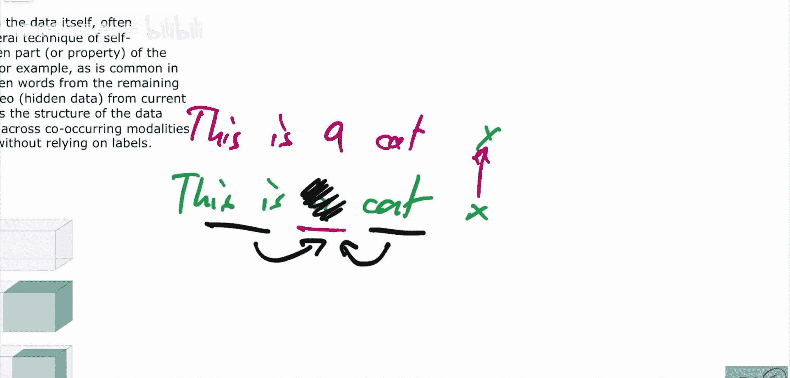

**本节课总结**：
本节课我们一起学习了FAIR关于自我监督学习的博文解读。我们了解到，监督学习虽然成功，但在数据标注成本和模型泛化能力上存在局限。作者将人类赖以快速学习的“常识”比喻为“智能的暗物质”，并指出自我监督学习是让AI系统获取这种背景知识的关键路径。我们学习了自我监督学习的基本原理（从数据自身生成标签），并通过BERT的例子加深了理解。最后，我们概览了对比学习、基于能量的模型和GANs等主要方法，并了解到未来研究的一个重要方向是发展非对比的隐变量预测模型。通过自我监督学习，我们有望构建出更通用、更高效、更接近人类学习方式的智能系统。