# 026：论文详解

在本节课中，我们将学习一篇名为《预训练Transformer：通用计算引擎》的研究论文。该论文探讨了在自然语言上预训练的Transformer模型，是否能够通过极少的微调，就将其能力泛化到语言之外的、完全不同的任务领域。

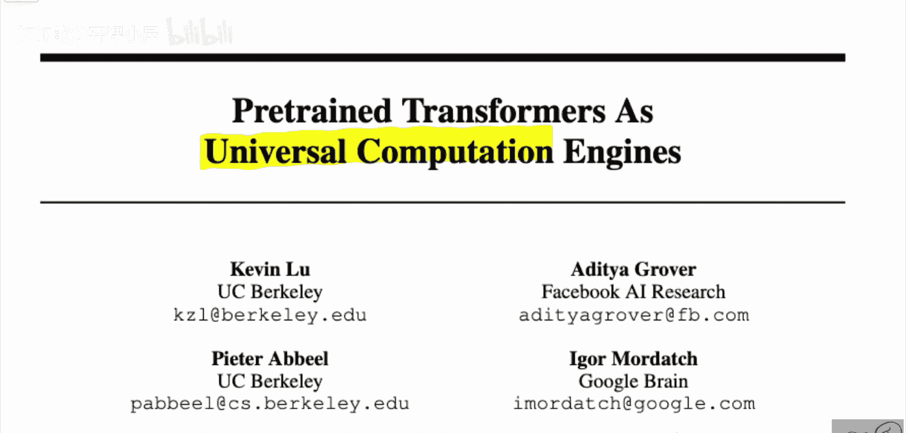

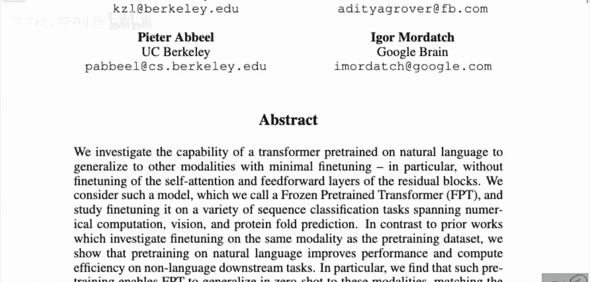

---

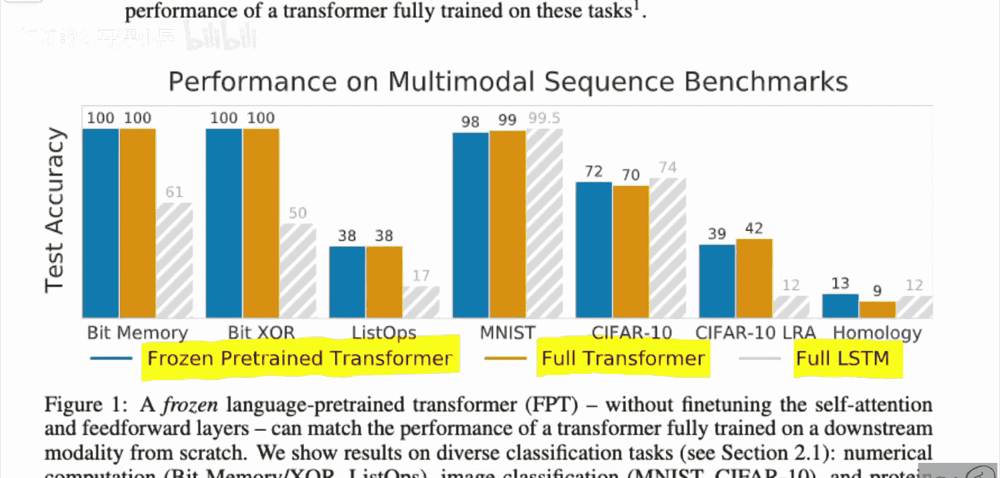

## 论文核心论点

论文的核心论点是：在语言建模任务上预训练的Transformer模型，本质上在进行一种“通用计算”。作者通过实验证明，将这些模型迁移到全新的领域（如计算机视觉、逻辑运算任务）时，即使**冻结**模型中几乎所有的参数（特别是自注意力层和前馈层），仅微调极少量参数，其性能也能与在这些新任务上**从头开始训练**的Transformer模型相媲美，甚至更优。

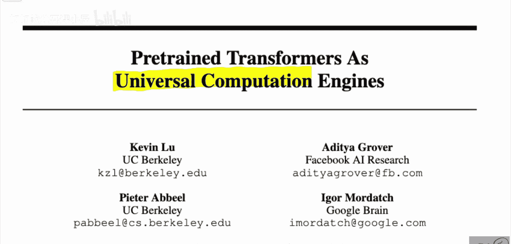

上一节我们介绍了论文的核心主张，本节中我们来看看作者是如何设计实验来验证这一点的。

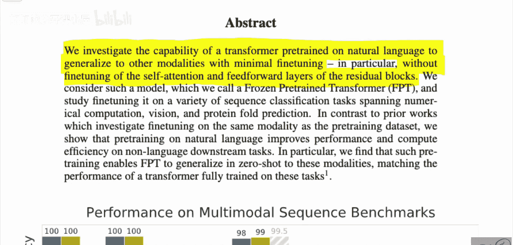

## 实验设计与任务

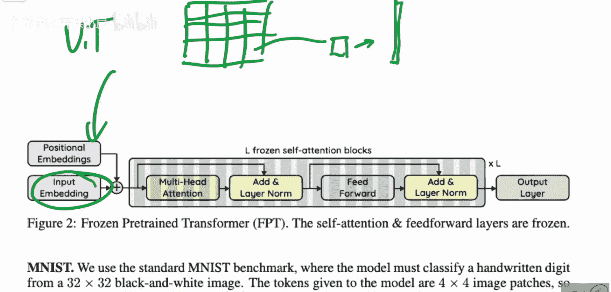

作者将预训练好的语言模型（参数大部分被冻结）应用于以下几个非语言任务，以测试其通用计算能力：

以下是实验涉及的具体任务列表：
*   **Bit Memory（位记忆任务）**：模型先看到5个长度为1000的二进制字符串序列，然后看到一个被部分掩码（每个位有0.5概率被遮盖）的字符串，模型需要识别出这个字符串是之前5个中的哪一个，并完整地重建它。
*   **Bit XOR（位异或任务）**：模型接收两个长度为5的二进制字符串，需要计算它们的逐元素异或（XOR）结果。这是一个对神经网络具有长期挑战性的任务。
*   **ListOps（列表运算任务）**：模型需要处理如 `[MAX 2 3 [MIN 5 6 ] 1 ]` 这样的序列，并计算出最终结果，类似于一个计算器。
*   **计算机视觉任务**：
    *   **MNIST / CIFAR-10**：经典的图像分类任务。模型将图像分割成块（patch），每个块展平为一个向量输入序列。
    *   **CIFAR-10 (LRA版本)**：来自Long Range Arena基准测试。与上一种方式不同，这里将图像的**每一个像素**都作为一个独立的输入元素，这导致序列长度极长，且丢失了局部空间信息，任务难度更大。
*   **Remote Homology Detection（远程同源检测）**：一个蛋白质折叠相关的生物信息学任务。

在了解了实验任务后，我们接下来看看模型的具体设置。

## 模型设置与微调策略

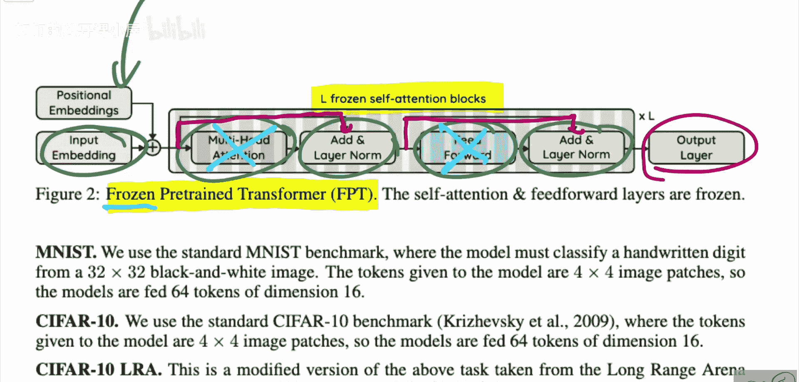

作者使用的模型架构是标准的Transformer。一个Transformer块主要由以下部分组成：
`输入嵌入 + 位置编码 -> [自注意力层 -> 层归一化 -> 前馈层 -> 层归一化] x L层 -> 输出层`

在微调新任务时，作者的策略非常关键：
*   **冻结部分**：**冻结**所有Transformer块中的**自注意力层（Multi-Head Attention）** 和**前馈层（Feed-Forward）** 的参数。这些部分占据了模型99%以上的参数量。
*   **可训练部分**：仅微调**输入嵌入层（Input Embeddings）**、**位置编码（Positional Embeddings）**、**输出层（Output Layer）** 以及各**层归一化（LayerNorm）** 层的参数。这些只占总参数的约0.1%。

这意味着，模型从语言预训练中学到的“计算核心”被完全保留，我们只是为新的任务学习如何将输入“映射”到这个计算引擎，以及如何解释它的输出。

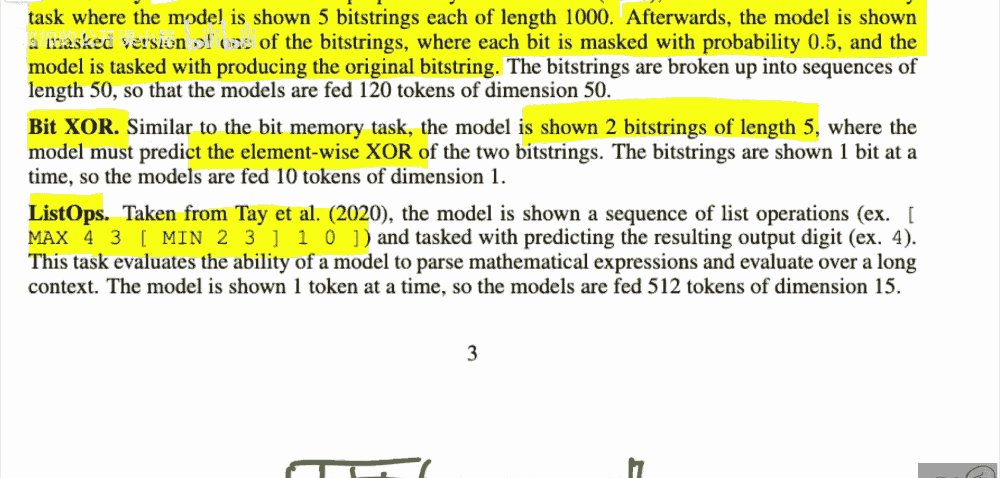

## 主要实验结果

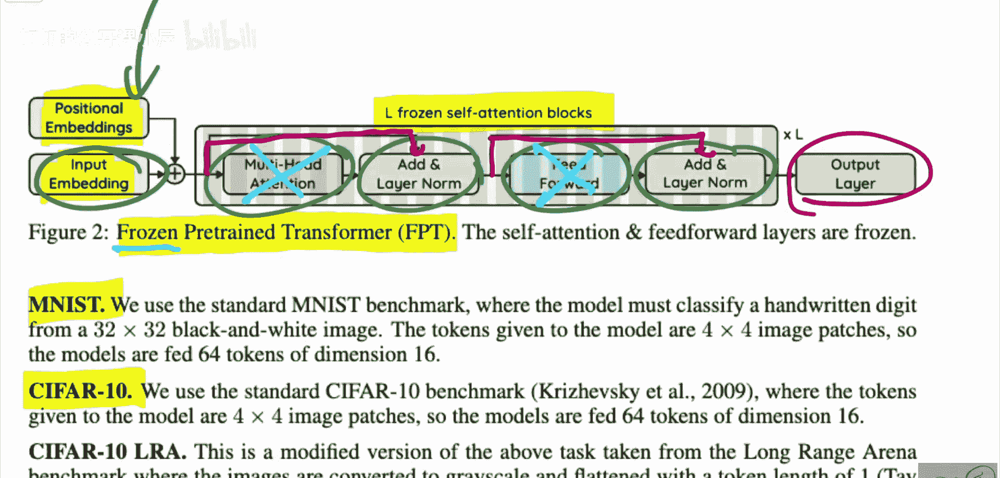

实验结果表明，这种“冻结核心，微调接口”的策略取得了惊人的效果：

以下是关键实验结果：
*   **在Bit Memory和Bit XOR任务上**，冻结的预训练Transformer与从头训练的完整Transformer都能达到接近100%的准确率，而同样从头训练的LSTM模型则无法有效解决这些任务。这突显了Transformer全局注意力机制在处理此类需要记忆和比较长序列任务时的优势。
*   **在ListOps任务上**，所有模型（冻结Transformer、完整Transformer、LSTM）的表现都很差，但冻结模型与完整模型的表现**同样差**。这说明任务本身的难度是主要瓶颈，而非模型是否被冻结。
*   **在MNIST、CIFAR-10等计算机视觉任务上**，冻结的预训练Transformer的性能与从头训练的完整Transformer**不相上下，有时甚至更优**。这一现象尤为有趣，它表明语言预训练可能让模型获得了某种强大的、可迁移的底层计算能力。

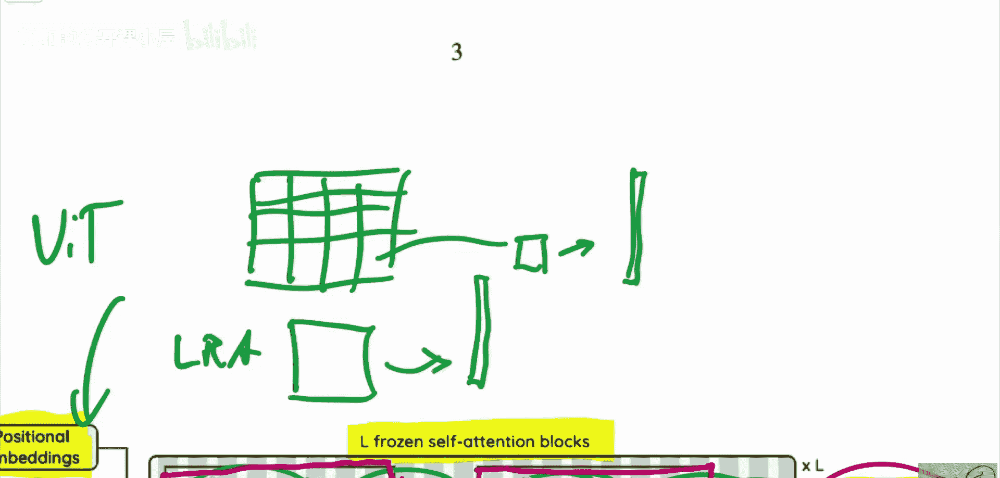

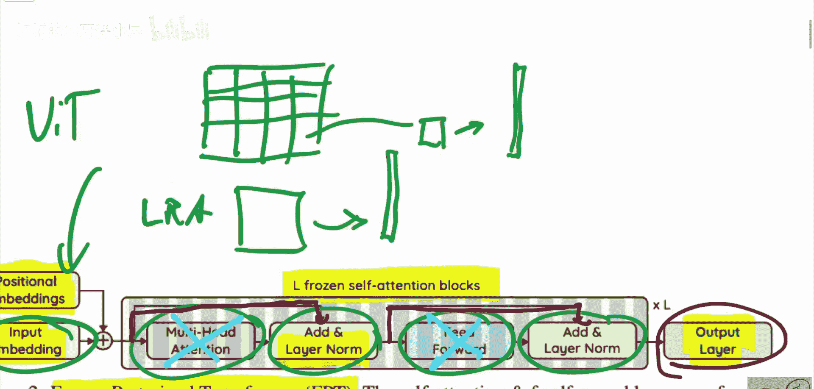

基于这些结果，论文自然引出了一个核心问题：为什么会出现这种现象？

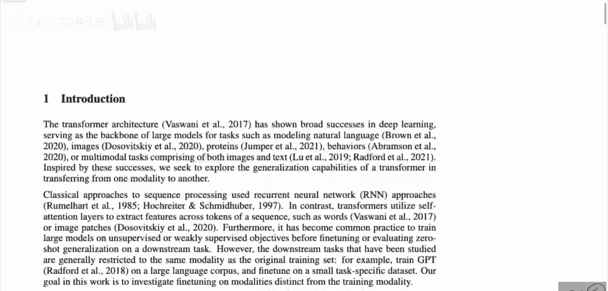

## 分析与讨论

作者通过一系列消融实验来探究原因。他们提出了两种可能的解释：

以下是两种主要的可能性：
1.  **语言预训练具有特殊性**：自然语言数据及其建模任务（预测下一个词）本身非常复杂和丰富，迫使模型学习到一种通用的、类似于“图灵完备”的计算模式。这种模式可以被轻易地重新用于其他领域。
2.  **Transformer架构本身具有强泛化性**：也许Transformer架构（尤其是其自注意力机制）本身就具有极强的适应性和表达能力。即使权重是随机初始化的，仅通过微调输入/输出层，也能快速适应新任务。语言预训练只是提供了一组比较好的初始权重。

论文的论据更倾向于支持第一种观点，即**语言预训练本身起到了关键的“ priming ”（预备）作用**，让Transformer模型提前成为了一个强大的“通用计算引擎”。而第二种观点中“随机初始化”的对照实验表现通常更差，这间接支持了预训练的重要性。

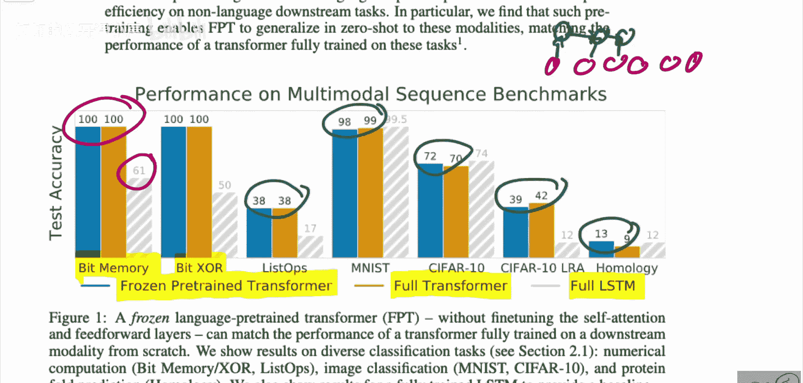

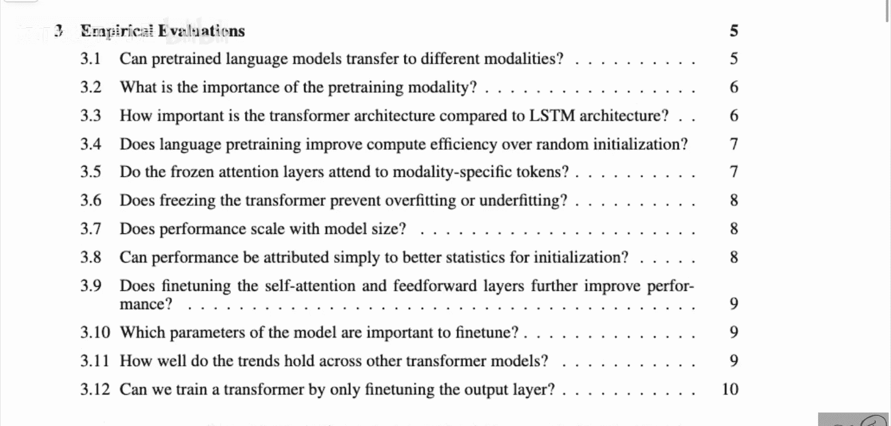

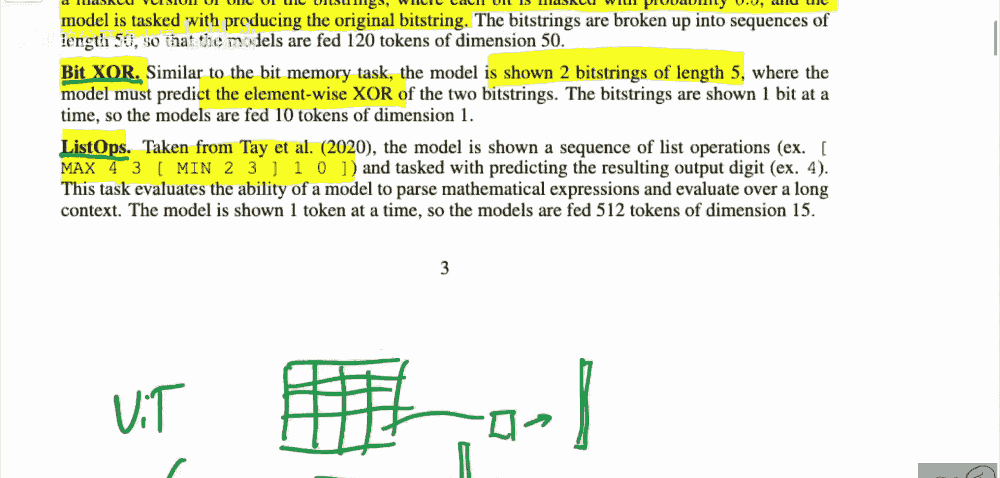

---

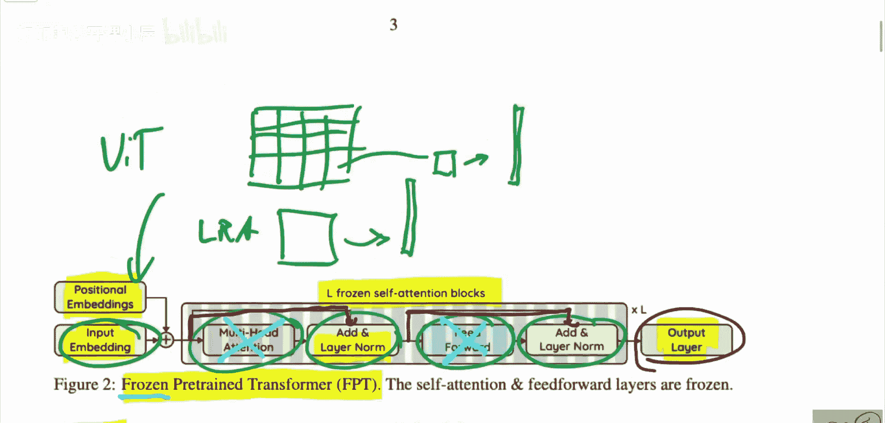

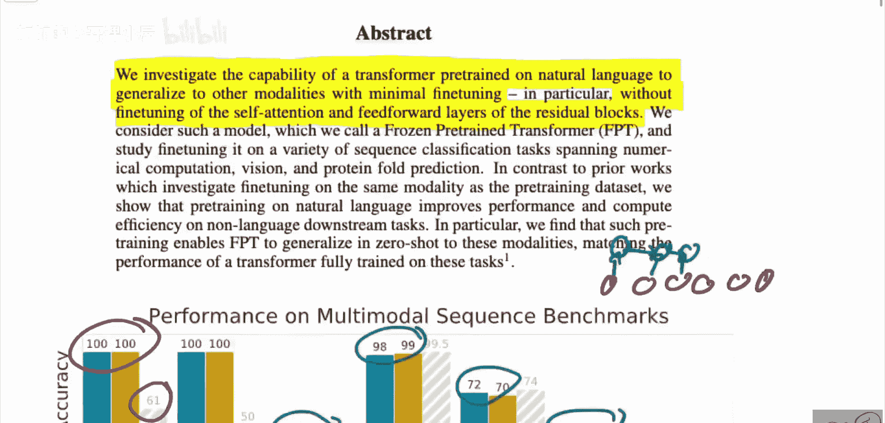

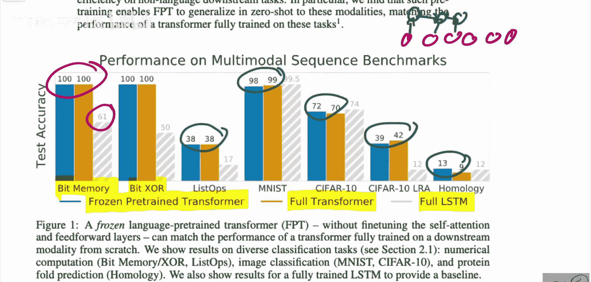

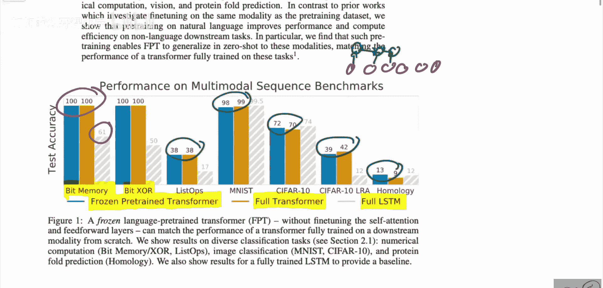

本节课中我们一起学习了《预训练Transformer：通用计算引擎》这篇论文。我们了解到，在大量文本上预训练的Transformer模型，其内部可能已经形成了强大的通用计算能力。通过冻结其核心的注意力与前馈层，仅微调少量“接口”参数，就能使其在图像分类、逻辑运算等截然不同的任务上表现优异。这一发现不仅挑战了我们对“领域特定模型”的传统认知，也为构建更加通用和高效的人工智能模型提供了新的思路。