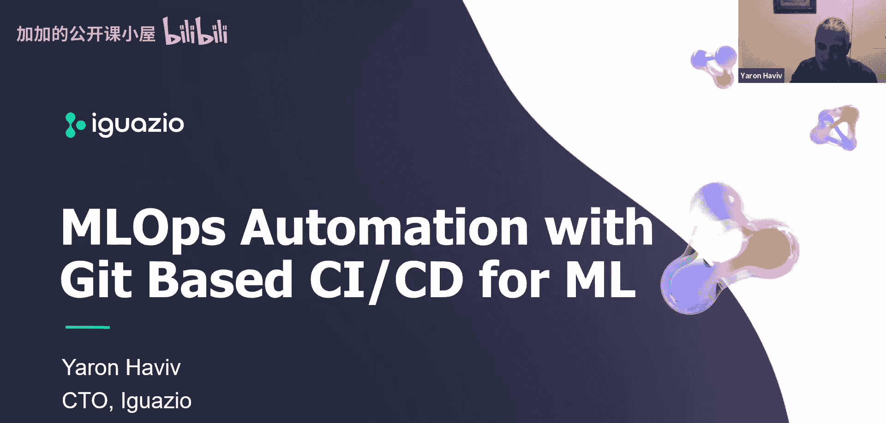
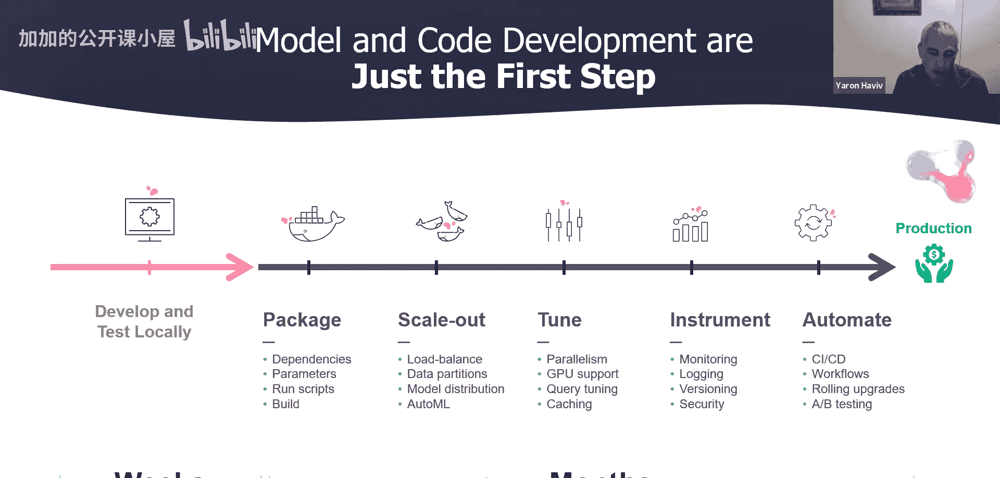
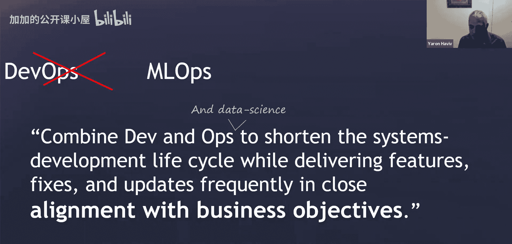
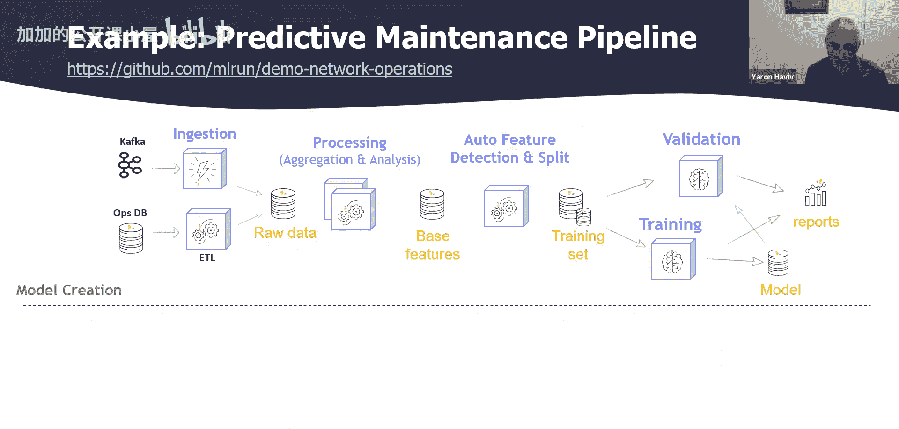

# 027：基于 Git 的 CI/CD 应用

## 概述

在本节课中，我们将探讨如何将 DevOps 的敏捷性和自动化实践引入机器学习领域，即 MLOps。我们将重点关注一个核心挑战：如何将数据科学家在笔记本中开发的实验性代码，转化为可在生产环境中稳定、可扩展运行的自动化流水线。课程将介绍基于 Git 的 CI/CD 如何成为解决这一挑战的关键，并利用云原生工具（如 Kubernetes）来实现 MLOps 的自动化。

---

欢迎参加今天的 CNCF 网络研讨会。本次研讨会的主题是“基于 Git 的 CI/CD 在 MLOps 自动化中的应用”。我是主持人 Christty Tan。我们欢迎今天的演讲者 Yron，他是 Iwaio 公司的联合创始人兼 CTO。

在开始之前，有几项注意事项。研讨会期间，参会者无法发言。您可以在屏幕底部的问答框中提交问题，我们将在最后环节尽可能多地解答。这是 CNCF 的官方研讨会，需遵守 CNCF 行为准则。请尊重所有参会者和演讲者。请注意，录制内容和幻灯片将在今天晚些时候发布到 CNCF 的研讨会页面。

现在，有请 Yron 开始今天的演讲。

谢谢，大家好。我是 Yron，Iwaio 的联合创始人兼 CEO。Iwaio 是 CNCF 的早期成员。我们今天要讨论的是机器学习的 CI/CD 和 DevOps：其独特之处是什么，以及如何将 DevOps 和 MLOps 的敏捷性带入您的机器学习项目，并利用 Kubernetes 等 CNCF 工具。

现在开始演示，幻灯片稍后会提供。您也可以通过 LinkedIn 或 CNCF Slack 联系我。

---

### 问题：从研究到生产的鸿沟

在深入解决方案之前，我们先谈谈当前面临的问题。机器学习领域的一个主要问题是，当您完成了小规模的研究和开发（例如在笔记本中进行数据提取、探索性数据分析、模型训练和评估），并准备投入生产时，生产环境的实现通常需要**重新实现**。

生产实现使用不同的框架，为大规模设计，需要持续运行、可观测，并具备生产环境的所有特征。如右图所示，我们需要从真实生产数据源（包括流数据）获取数据，处理大规模数据集（需要分布式分析，而非在笔记本中），运行自动化训练，以及部署和监控模型。模型服务还需要与训练数据一致但处理更快的实时数据。

人们构建这些解决方案时，有时会使用 Hadoop、Spark 和流处理技术，有时会利用 Kubernetes，有时甚至需要将代码从 Python 重写为 Java，以使代码更健壮、更安全。

这一转变的主要挑战在于，数据科学家编写的代码通常不具备可操作性。数据科学家关注的是数学、统计、算法和神经网络，而非代码的健壮性、可部署性或可扩展性。通常，一个笔记本包含了数据准备、训练、图表绘制和推理等所有步骤。为了在生产中运行，我们必须将其转化为一系列能在集群上实时或批量运行的微服务。

这就是我们在思考如何将数据科学流水线操作化或自动化之前，需要解决的核心挑战。

### 产品化步骤与挑战

接下来，我们看看将任何产物（无论是工程、数据科学还是传统软件）产品化的各个步骤。在处理数据时，挑战更大，尤其是在数据化和性能方面。

以下是产品化机器学习代码的关键步骤：

1.  **容器化**：首先需要将代码打包到 Docker 容器中，并配置脚本和命令行。这对数据科学家来说可能并不简单，通常需要他人协助完成。
2.  **扩展性**：处理数据时的扩展不仅涉及负载均衡或服务网格，还可能需要对数据和模型进行分区，或运行自动机器学习及超参数调优。
3.  **性能优化**：为研究编写的代码通常不具备低延迟或高吞吐量。需要工程师考虑引入缓存、GPU、并行化、异步处理等优化手段。
4.  **可观测性与治理**：这超越了传统的微服务和云原生架构。我们不仅需要监控容器，还需要监控和记录数据本身、数据版本，并应用数据访问安全策略。由于机器学习可能涉及法律责任（如预测错误导致损失或性别偏见），流水线中的代码、数据、模型和算法等所有内容都必须进行版本控制。
5.  **自动化**：我们需要像其他云架构一样，应用 CI/CD、自动化工作流、滚动升级、金丝雀发布和 A/B 测试。

当前的主要挑战是，将一个原型投入生产运行可能需要数周，但将整个流程产品化对于许多组织而言需要 **12 到 18 个月**。因此，核心挑战在于如何实现自动化，并打破开发者、数据科学家和数据工程师之间的隔阂，让他们在一个生态系统中协同工作。

---

### 什么是 MLOps？

我们了解 DevOps，其本质是结合开发与运营，共同思考如何加速业务，或以可操作化的方式更快地部署软件。

**MLOps 本质上是相似的，只是它扩展了大量数据和机器学习实践的维度**，包括数据工程、模型构建、责任归属以及这些方面的可观测性。

---

### 用例分析：预测性维护流水线

让我们考虑一个简单的用例：预测性维护流水线。即使在这个流水线中，我们也包含了许多不同的步骤。

1.  **数据接入**：第一步是引入数据。数据可能以不同形式到来，例如流数据或来自各种数据库。
2.  **ETL 处理**：我们需要运行一些 ETL（提取、转换、加载）过程，将所有数据整合，通常存入文件系统的文件中。
3.  **数据处理**：随后需要运行一些处理和分析，以合并不同的数据集、进行反规范化、连接和聚合，形成我们通常所说的**特征向量**或批处理特征向量。

---

## 总结

本节课我们一起探讨了 MLOps 自动化的核心挑战与入门概念。我们了解到，将机器学习模型从研究环境迁移到生产环境面临代码重写、扩展性、性能优化、可观测性和自动化等多重挑战。MLOps 借鉴了 DevOps 的理念，旨在通过自动化 CI/CD 流水线、加强协作和利用云原生工具（如 Kubernetes），来缩短产品化周期，提高机器学习项目的效率和可靠性。在接下来的课程中，我们将深入探讨基于 Git 的 CI/CD 具体如何应用于 MLOps 流水线，以实现这些目标。