# 028：通过迭代注意力实现通用感知（Google DeepMind研究论文解析）

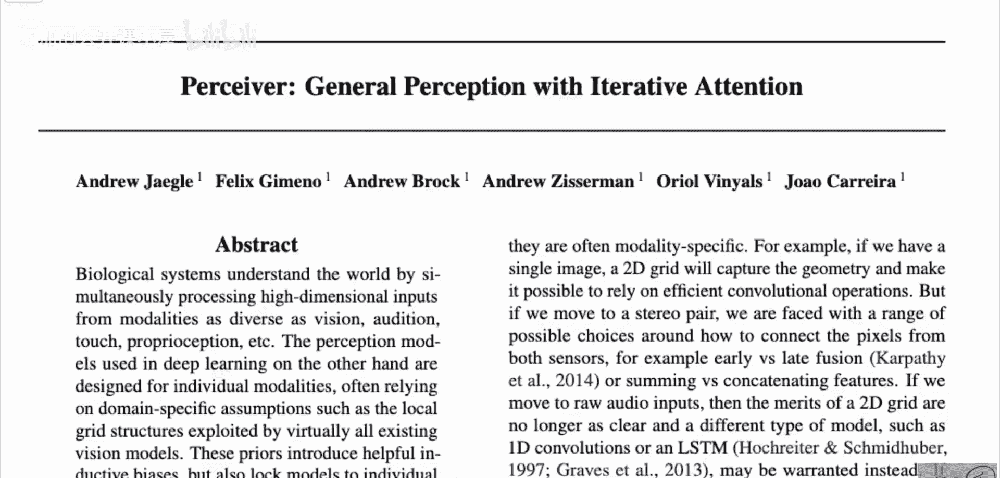

在本节课中，我们将要学习由DeepMind团队提出的“感知者”模型。该模型旨在解决Transformer架构在处理高维数据（如图像、音频、点云）时面临的计算和内存瓶颈问题，并尝试构建一个适用于多种数据模态的通用感知架构。

## 模型动机与目标

上一节我们介绍了课程背景，本节中我们来看看论文提出的核心问题。

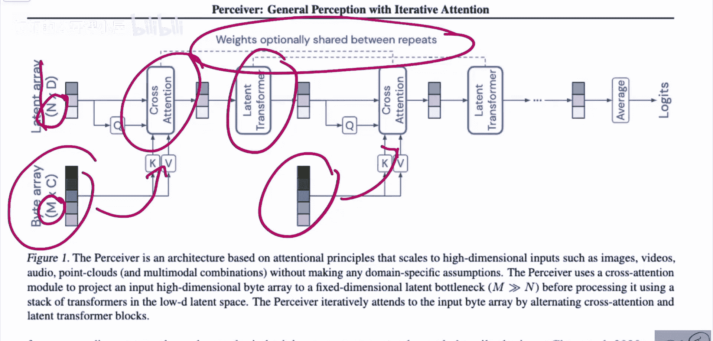

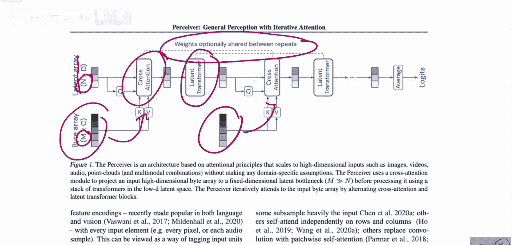

当前深度学习中的感知模型通常为单一模态设计，并依赖于特定的领域假设。例如，绝大多数视觉模型都利用了图像的局部网格结构。卷积神经网络通过滑动滤波器显式地捕捉像素间的局部关系，而视觉Transformer（ViT）则将图像分割为块进行处理。这些方法虽然有效，但也将模型限制在了特定的数据模态中。

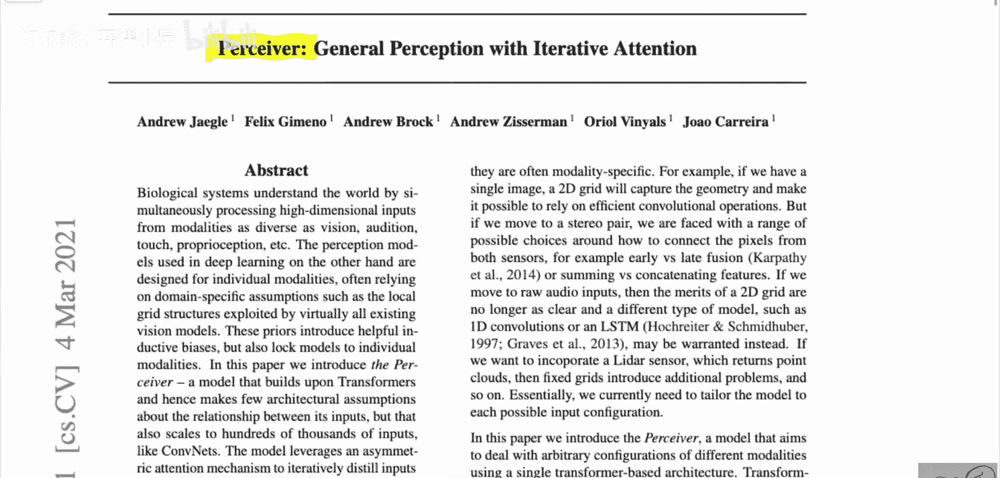

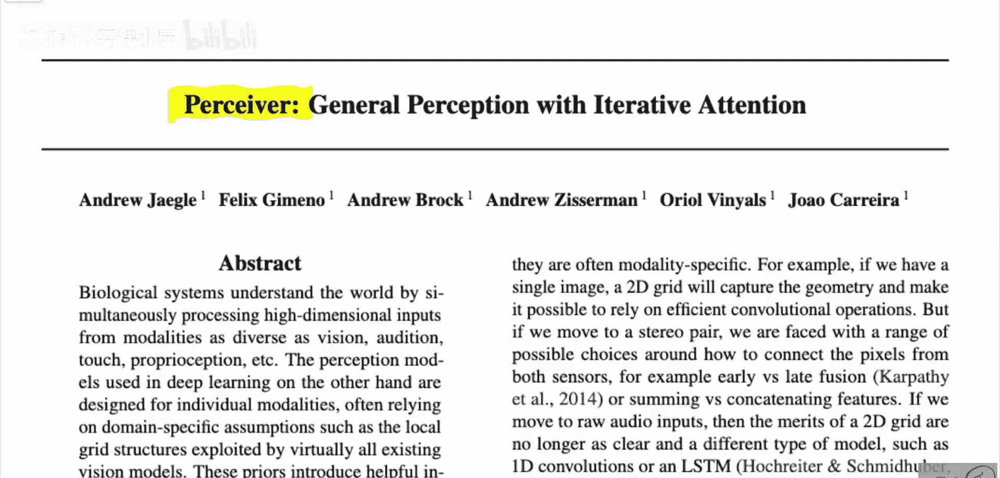

感知者模型的目标是构建一个基于Transformer、对输入数据关系做最少架构假设的模型，同时能够像卷积网络一样扩展到数十万的输入规模。

## Transformer的计算瓶颈

在深入感知者架构之前，我们需要理解标准Transformer面临的核心挑战。

标准Transformer由多层自注意力机制堆叠而成。在自注意力层中，模型需要计算输入序列中每个元素与其他所有元素之间的关联权重。对于一个长度为 **M** 的序列，这会产生 **O(M²)** 的计算和内存复杂度。在自然语言处理中，序列长度通常在千级别，尚可接受。但在计算机视觉中，例如一张224x224的图像，其像素数 **M** 可达约5万，此时 **M²** 的复杂度将超出当前计算机的内存极限。

## 感知者架构的核心思想

上一节我们了解了标准Transformer的瓶颈，本节中我们来看看感知者如何巧妙地解决这个问题。

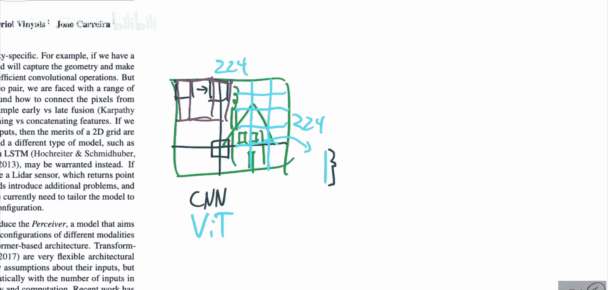

感知者模型的核心创新在于**交替使用潜在自注意力与交叉注意力机制**。数据仅通过交叉注意力机制进入Transformer，这使得模型可以使用一个远小于数据数组规模的潜在数组进行计算，从而部分解决了Transformer的二次方内存与计算瓶颈。

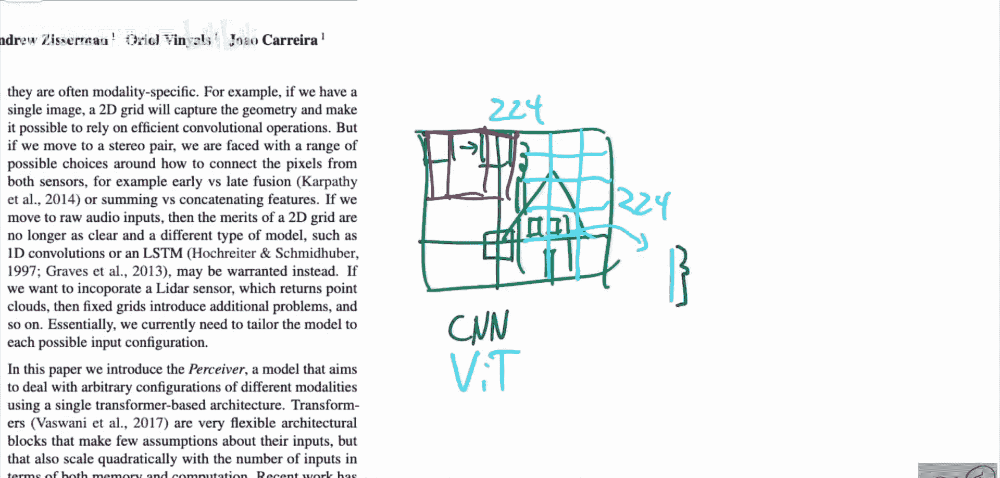

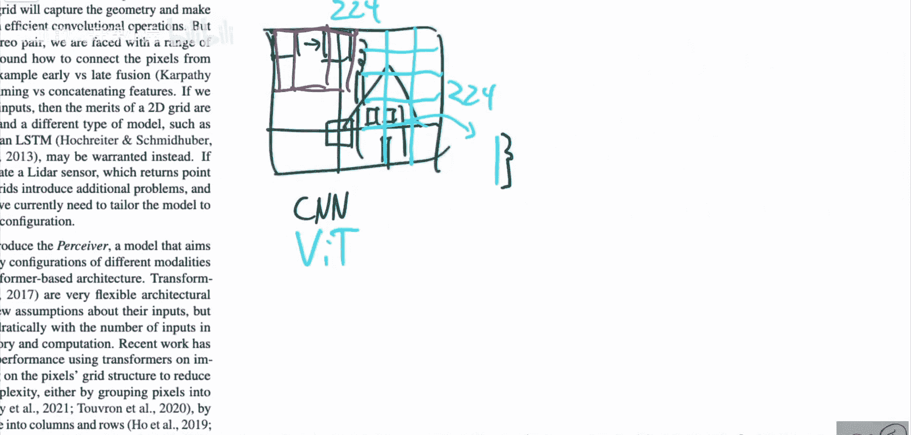

模型的工作原理如下：
1.  图像或其他模态的数据通过一个堆叠结构多次输入。
2.  权重可以在不同步骤间共享，这使得模型本质上成为一个循环神经网络。
3.  该模型适用于任何模态（图像、视频、音频、点云），且几乎无需更改输入处理方式。

以下是感知者架构的关键组件示意图：

## 从编码器-解码器到交叉注意力

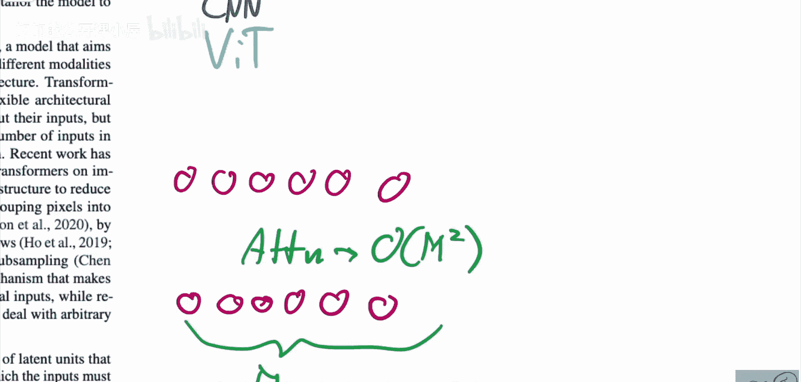

为了理解感知者的设计，我们可以回顾原始Transformer的编码器-解码器结构。

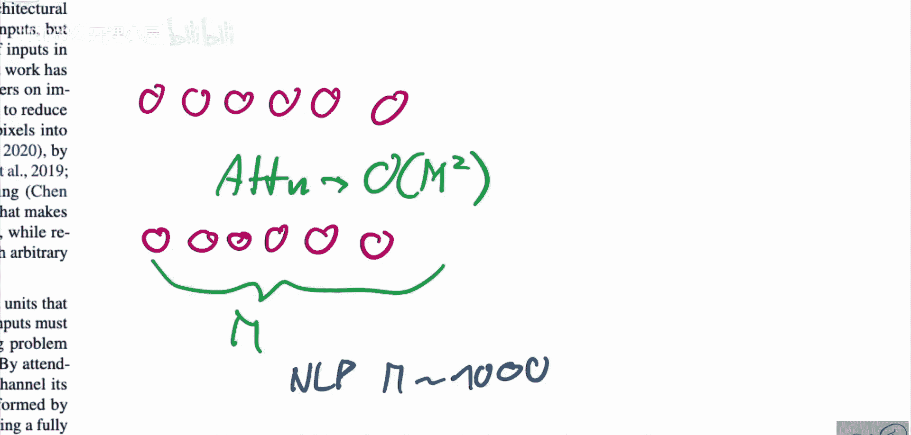

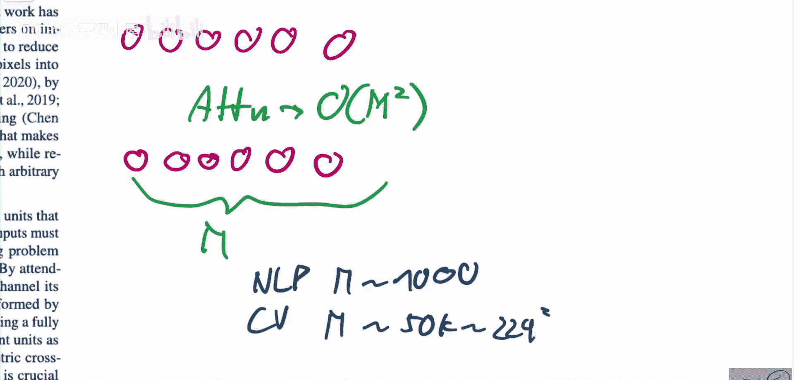

最初的Transformer用于机器翻译等序列到序列的任务，明确区分了输入序列（如源语言句子）和输出序列（如目标语言句子）。解码器在生成目标序列时，需要进行两种注意力计算：
*   **自注意力**：关注目标序列自身已生成的部分。
*   **交叉注意力**：关注完整的源语言输入序列。

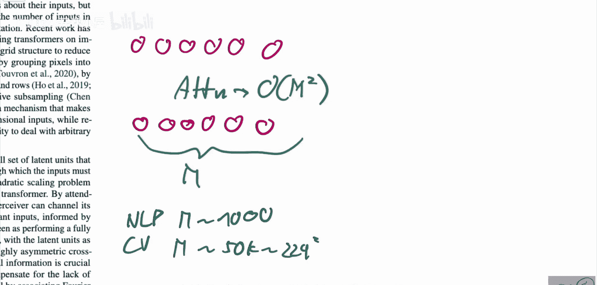

关键点在于，信息流主要是单向的：从源序列（通过交叉注意力）流向目标序列。源序列自身并不需要关注目标序列。感知者模型借鉴了这种**交叉注意力**的思想，将其作为从高维输入数据中提取信息到小型潜在数组的主要通道。

## 模型工作流程

现在，让我们具体看看感知者模型是如何工作的。

模型维护一个固定长度的**潜在数组**（Latent Array），其长度 **N** 远小于输入数据的维度 **M**。处理过程是一个迭代循环：
1.  **交叉注意力阶段**：潜在数组作为“查询”（Query），输入数据作为“键”（Key）和“值”（Value），通过交叉注意力机制从输入数据中抽取信息，更新潜在数组。
    *   公式表示：`Latent_Array = CrossAttention(Latent_Array, Input_Data)`
2.  **潜在自注意力阶段**：更新后的潜在数组进行自注意力运算，使其内部元素之间进行信息交互。
    *   公式表示：`Latent_Array = SelfAttention(Latent_Array)`
3.  上述两个阶段可以重复多次（迭代），并且权重可以共享，形成类似RNN的结构。

通过这种方式，高维的输入数据（**M** 很大）被压缩到一个固定大小的、可管理的潜在空间（**N** 较小）中进行复杂的变换运算，从而规避了直接对原始数据做全局自注意力带来的 **O(M²)** 开销。

## 总结

本节课中我们一起学习了DeepMind的感知者模型。该模型通过交替使用**交叉注意力**和**潜在自注意力**，构建了一个能够处理极高维度输入数据的Transformer变体。其核心优势在于：
*   **解决计算瓶颈**：利用小型潜在数组，避免了标准Transformer的二次方复杂度。
*   **模态通用性**：同一架构无需大量修改即可处理图像、视频、音频、点云等多种数据。
*   **减少归纳偏置**：相比卷积网络或ViT，对输入数据的结构假设更少。

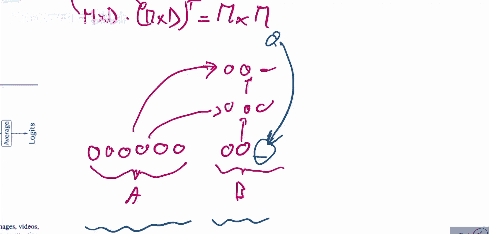

感知者模型是迈向构建更深度、更通用的多模态感知模型的重要一步。