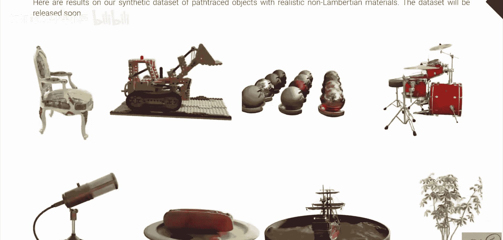
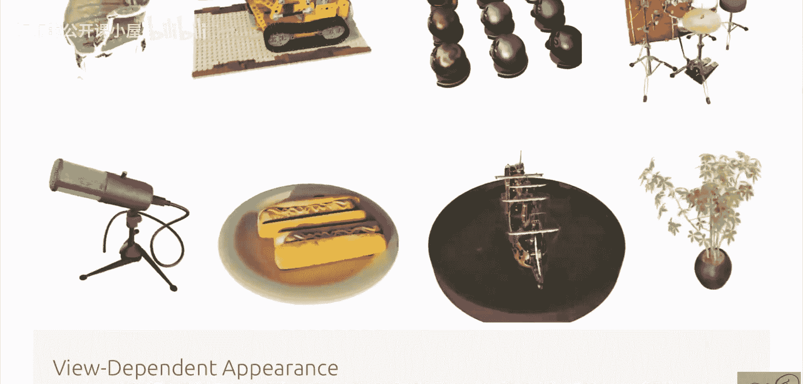
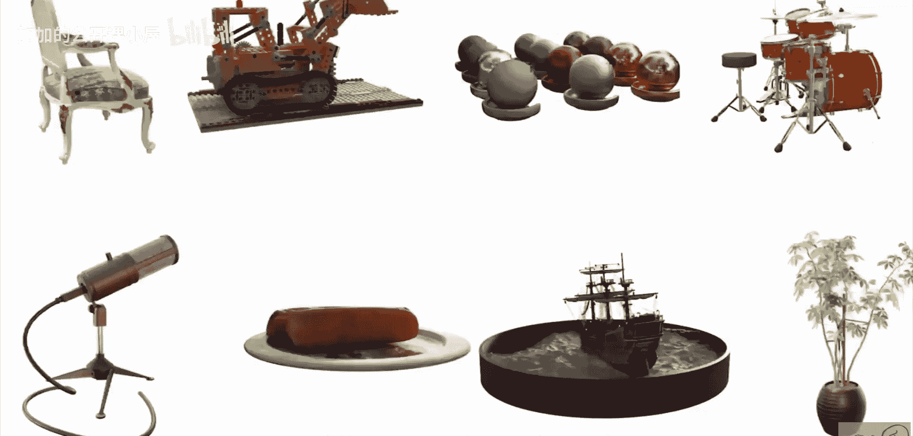
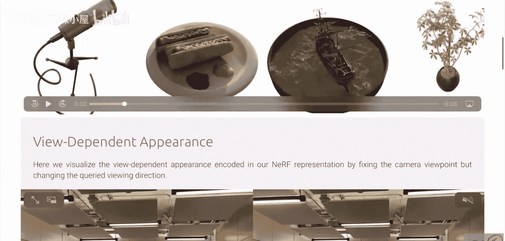
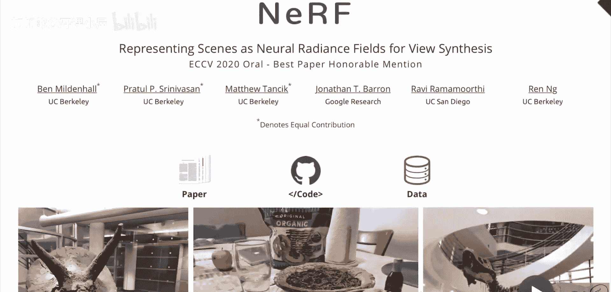
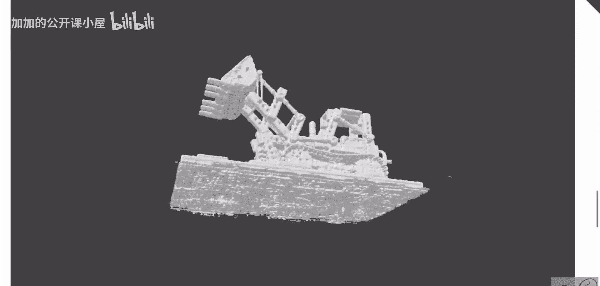
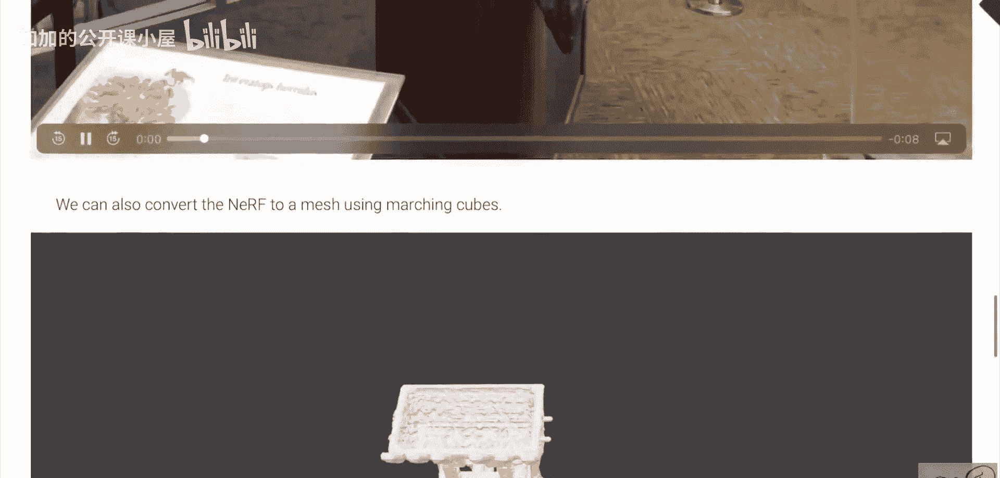
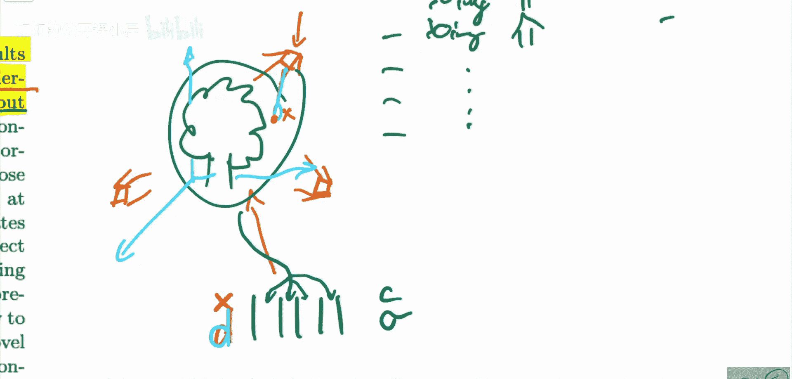

# 030：将场景表示为神经辐射场以进行视图合成

在本节课中，我们将学习一篇名为“NeRF：将场景表示为神经辐射场以进行视图合成”的经典论文。这篇论文提出了一种新颖的方法，能够仅从少量输入图片中，合成出场景在任何视角下的新视图。我们将深入探讨其核心思想、工作原理以及为何这种方法在计算机视觉和图形学领域引起了巨大反响。

## 任务概述：视图合成

上一节我们介绍了本课程的目标，本节中我们来看看论文要解决的具体任务：**视图合成**。

想象一下，你获得了一个物体（例如一艘船或一套架子鼓）从不同角度拍摄的一组照片。你的任务是构建一个系统，能够根据这些有限的输入图片，生成该物体从**任意**其他视角观看时的图像。这并非一项简单的任务，因为物体表面可能存在高光、透明或复杂的几何结构，这些特性仅在特定视角下才可见。

这项技术不仅适用于合成数据，更能处理真实世界的复杂场景。如下图所示，系统能够根据输入视图，渲染出逼真的新视角图像，甚至能模拟在不同光照方向下的效果，这极大地增强了渲染的真实感。

## 核心方法：为单个场景“过度拟合”一个神经网络

传统的深度学习方法通常需要一个庞大的数据集来训练一个通用模型。然而，NeRF采用了一种截然不同的思路：**为每一个特定的场景，单独训练一个神经网络**。

这意味着，如果你想渲染一棵树，就用这棵树的多视角图片去训练一个神经网络；如果你想渲染一间屋子，就为这间屋子重新训练另一个神经网络。这个神经网络的**权重**，最终就编码了这个场景的全部信息。

那么，这个神经网络的输入和输出是什么呢？

以下是其工作原理的核心描述：

*   **输入**：一个空间位置坐标 **x = (x, y, z)** 和一个观察方向 **d = (θ, φ)**（通常用两个角度表示）。
*   **输出**：该位置点的**颜色 c = (r, g, b)** 和**体积密度 σ**。密度σ表示该点是否有实物存在（例如，σ=0表示空气，σ值高表示物体表面）。

用公式化的语言描述，神经网络 **F** 学习了一个从5D坐标（位置+方向）到4D输出（颜色+密度）的映射：
`(c, σ) = F(x, d)`

## 神经辐射场的工作原理

理解了输入输出后，我们来看看如何利用这个神经网络来合成一张新图片。

1.  **确定相机和光线**：当需要从某个新视角渲染图像时，首先确定相机的位置和朝向。从相机出发，向图像平面的每个像素发射一条光线。
2.  **沿光线采样**：沿着每条光线，在3D空间中采样一系列点。
3.  **查询神经网络**：对于每个采样点，将其3D坐标 **x** 和该光线（即观察）的方向 **d** 输入神经网络 **F**，得到该点的颜色 **c** 和密度 **σ**。
4.  **体渲染**：根据经典体渲染原理，将所有采样点的颜色和密度进行累积积分，最终计算出这条光线对应像素的颜色。高密度的点对最终颜色的贡献更大。
5.  **生成图像**：对图像中所有像素重复此过程，即可合成完整的新视图。

这种方法的关键优势在于，它将**观察方向 d** 作为输入之一。这使得模型能够捕捉到视角依赖的外观效果，如镜面高光，从而实现极其逼真的渲染。

## 方法优势与产出

通过优化这样一个神经辐射场，NeRF不仅能完成视图合成，还能自动产生许多有价值的副产品：

*   **深度图**：在体渲染过程中，可以自然地估算出每个像素的深度信息，这对于复杂的场景尤其难得。
*   **三维网格**：通过提取等值面，可以将神经辐射场转换为传统的三维网格模型，便于在其他图形应用中使用。

*   **连贯的新视图**：由于场景被表示为一个连续的5D函数，因此可以在已知输入视角之间平滑地插值，生成任意中间视角的图像，创造出流畅的“环绕”观看体验。

## 总结

本节课我们一起学习了NeRF这篇开创性论文。其核心贡献在于提出用**神经辐射场**这一连续5D函数来表示场景。通过为单个场景“过度拟合”一个多层感知机，输入空间位置和观察方向，输出颜色和密度，再结合体渲染技术，实现了从稀疏输入视图合成高质量新视图的目标。这种方法不仅效果惊艳，还自动衍生出深度图、网格等丰富输出，为后续的神经渲染研究奠定了坚实基础。