# 031：为什么人工智能比我们想象中更难

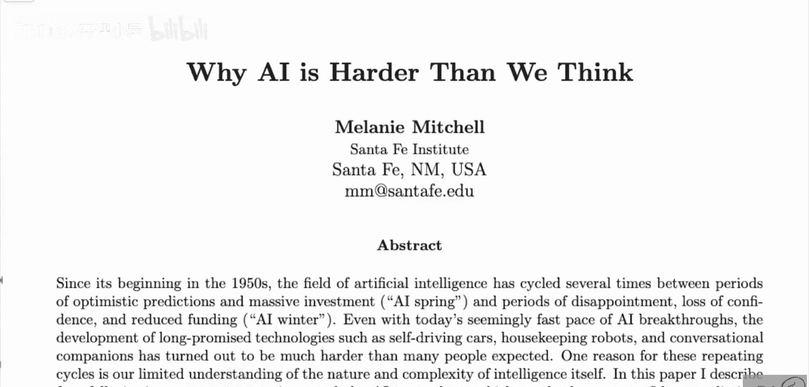

在本节课中，我们将解读梅拉妮·米切尔（Melanie Mitchell）的论文《为什么人工智能比我们想象中更难》。这篇论文探讨了人工智能发展史上反复出现的“AI之春”与“AI之冬”现象，并分析了导致人们做出过度自信预测的四个常见谬误。我们将跟随论文的思路，理解为何实现通用人工智能的挑战远超预期。

## 论文概述与背景

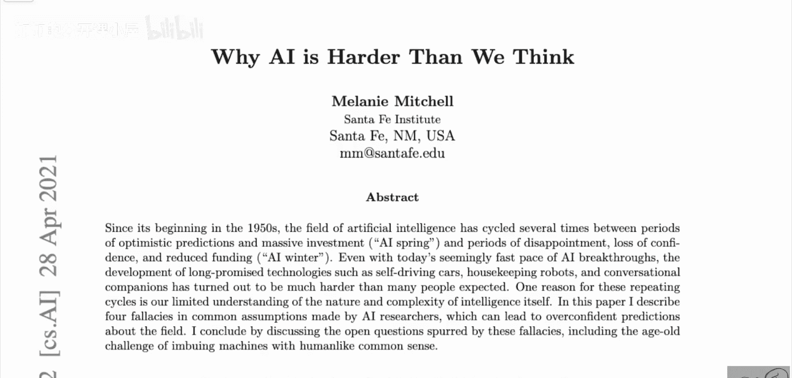

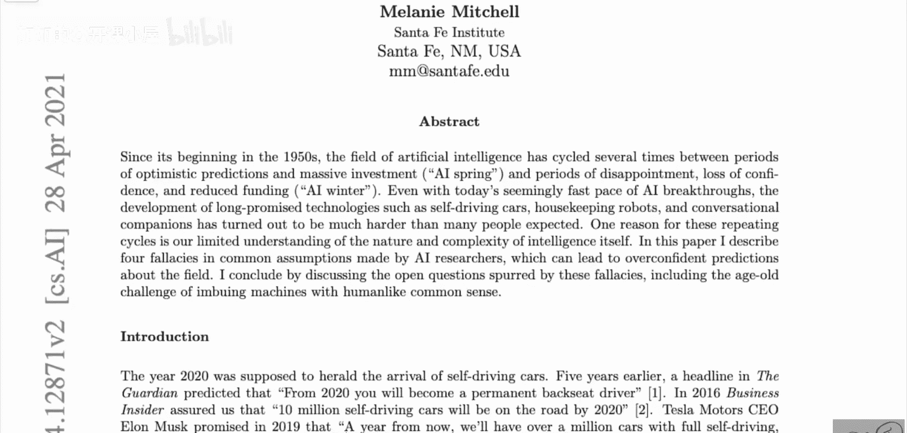

上一节我们介绍了论文的主题，本节中我们来看看其核心论点。自20世纪50年代人工智能领域诞生以来，其发展历程呈现出明显的周期性波动。

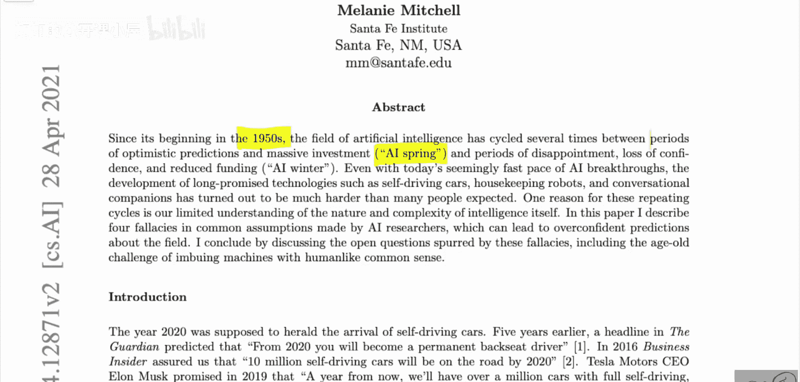

这些周期被称为“AI之春”和“AI之冬”。“AI之春”指的是乐观预测涌现、投资大幅增加的时期。而“AI之冬”则指代失望情绪蔓延、信心丧失和资金减少的时期。

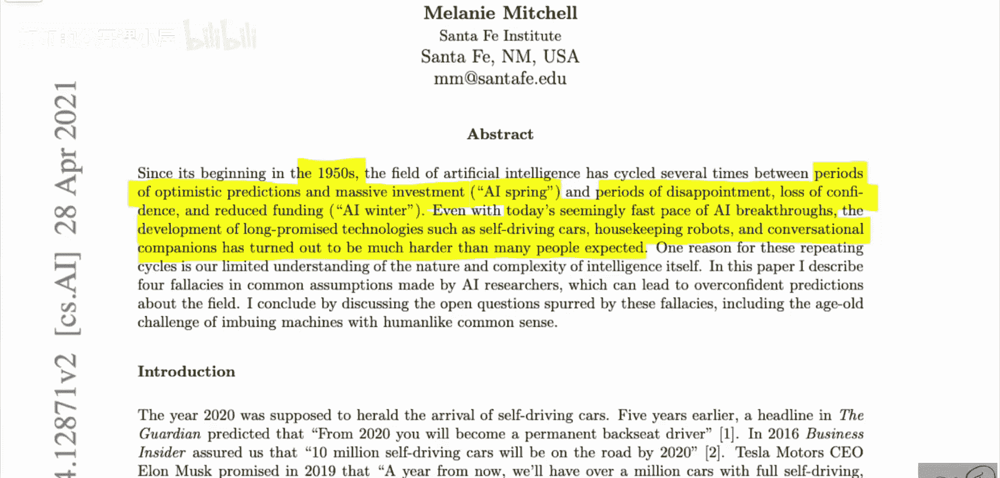

论文指出，即使在今天人工智能取得诸多突破的背景下，开发诸如自动驾驶汽车、家政机器人和对话伴侣等长期技术，其难度也远超许多人的预期。一个关键原因在于，我们对智能本身的性质和复杂性的理解仍然有限。

## 历史周期与过度自信的预测

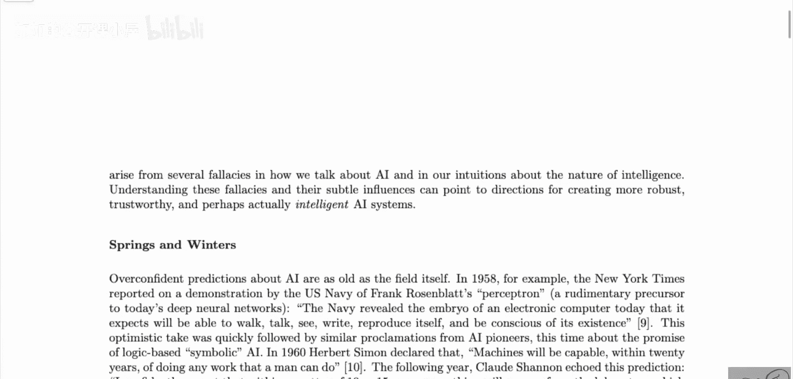

了解了论文的核心论点后，我们回顾一下人工智能的历史。如果你对人工智能历史稍有了解，就会知道这种“春”与“冬”的循环。这种现象从一开始就存在。

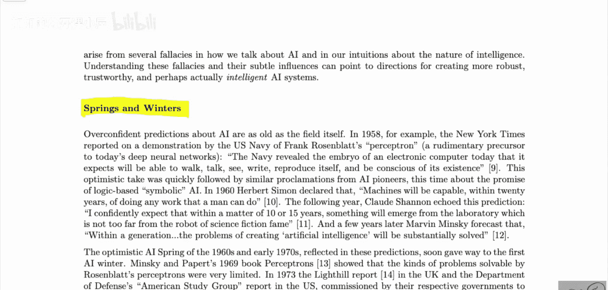

例如，当感知机被发明时，人们认为即将实现许多非常酷的事情。克劳德·香农曾预测：“我满怀信心地期待，在未来10到15年内，实验室里将会诞生出与科幻小说中著名的机器人相差不远的东西。”马文·明斯基则预言：“在一代人的时间内，创造人工智能的问题将基本得到解决。”

这是由于他们看到了在极短时间内取得的真实良好进展，并简单地外推了这种进展。然而，事实并非如此。当然，在这些承诺未能实现后，随之而来的是热情的衰退，即一个“冬季”。随后在20世纪80年代，更多人工智能系统出现，热情再次高涨，而后再次失望。接着在20世纪90年代和21世纪初，机器学习被引入。顺便一提，20世纪80年代是专家系统的时代。

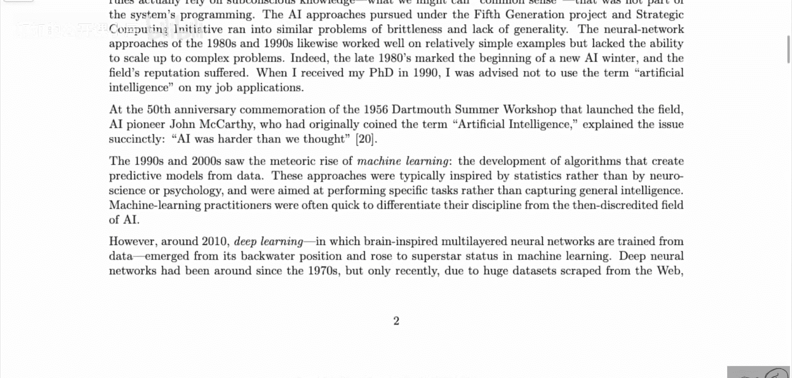

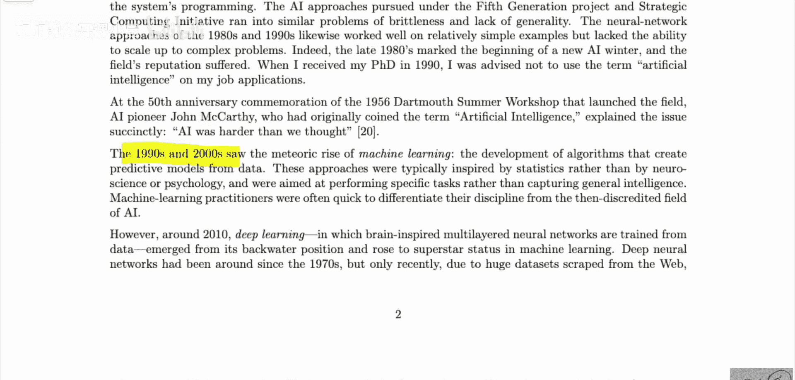

最初人们开发了感知机，并认为那是最好的方法。随后是专家系统，人们认为只要制定这些规则并拥有规则求解器和规则搜索算法，就能构建人工智能，但这并未实现。在当前范式下，我们处于机器学习范式，人们开发机器学习算法，并认为这就是正确的前进方向。

## 当前范式的乐观与挑战

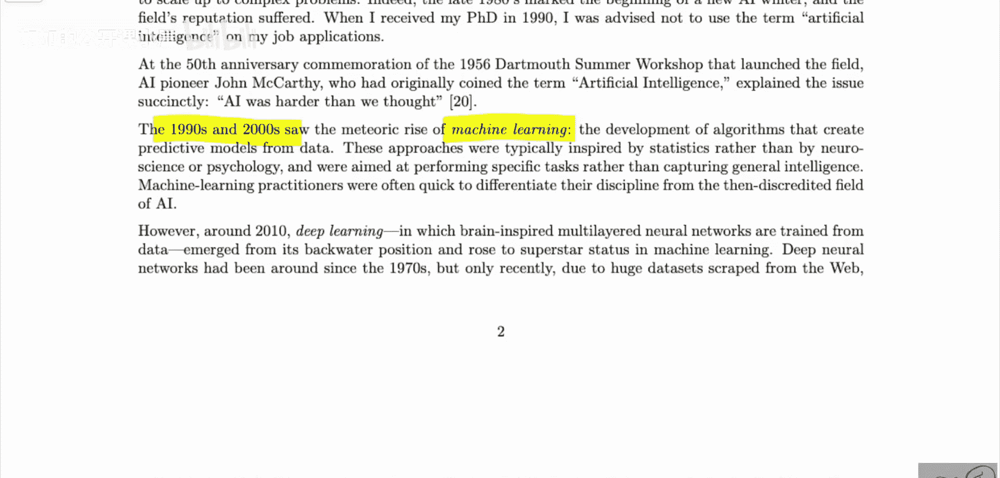

回顾了历史周期后，我们聚焦于当前。论文在此指出，这一次我们可能也处于一个过度自信的时期。

然而，大约在2000年左右，深度学习——即受大脑启发的多层神经网络通过数据进行训练——从其边缘地位崛起，成为机器学习领域的超级明星。深度学习自20世纪70年代就已存在，但最近借助大数据集和大规模计算，我们能够将其扩展到大量未解决的挑战并攻克它们。

因此，我们可以进行语音识别、机器翻译、聊天机器人、图像识别、游戏对弈、蛋白质折叠等许多任务。人们通常称之为“人工智能”。本质上，这是机器学习，而如今机器学习和人工智能几乎是同义词。但我们不应忘记，人工智能与机器学习是不同的。只是如今许多人相信，可以利用机器学习来实现人工智能。

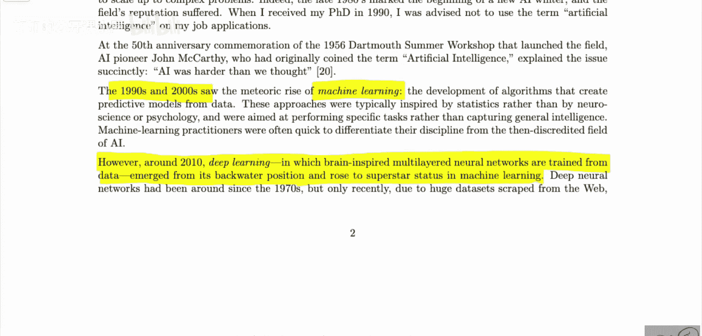

随之而来的是新一轮对所谓通用、真正或人类级别人工智能前景的乐观情绪。论文列举了一些科技公司高管的言论，例如谷歌DeepMind联合创始人预测人类级别AI将在21世纪20年代中期实现。马克·扎克伯格曾宣称，其未来五到十年的目标之一是在所有主要人类感官——视觉、听觉、语言和一般认知方面基本达到超越人类的水平。

尽管如此乐观，但不久后，深度学习智能表象上的裂痕就开始显现。论文作者称其为“智能的表象”，而非智能本身。事实证明，与过去所有人工智能系统一样，深度学习在面对与训练数据不同的情况时，可能表现出脆弱性和不可预测的错误。

## 深度学习的局限性与四个常见谬误

上一节我们讨论了当前范式的挑战，本节中我们来看看论文总结的四个导致过度自信的常见谬误。论文指出这些系统容易受到“捷径学习”的影响。捷径学习是指学习训练数据中的统计关联，使机器能够产生正确答案，但有时是基于错误的原因。需要补充的是，这是在测试数据集上的正确答案。

这在很大程度上源于这些数据集是如何生成的。例如，有一篇著名的论文试图通过面部肖像检测犯罪倾向。他们构建数据集时，罪犯的照片来自面部照片，而非罪犯的照片则来自领英等平台。模型可能只学会了识别谁穿着得体、谁面带微笑，而与实际的犯罪倾向无关。捷径学习本质上是指，由于构建数据集的方式，模型可能学会在你的测试集上给出正确答案，因为测试集以相同方式构建，但它并未真正学会你想要它学习的真实概念。

这当然存在。然而，这感觉更像是一个数据集问题，而非深度学习本身的问题。顺便一提，人类也会这样做。换句话说，这些机制没有学会我们试图教授的概念，而是学会了在训练集上获得正确答案的捷径，而这样的捷径不会带来良好的泛化能力。

如果你想想人类，人类也一直在做类似的事情。当然，这些网络是脆弱的。它们有时会学习错误的攻击方式。它们当然也容易受到对抗性扰动的影响。但这更像是一种批评。它只是意味着网络看待世界的方式与我们略有不同。你可以利用这种微小差异让它们做出奇怪的事情。但你需要真正针对这一点，这并非自发发生的。

以下是论文中概述的四个常见谬误：

1.  **狭义性谬误**：将某个狭窄领域的能力（如下棋）等同于广义的智能。
2.  **拟人化谬误**：将机器的行为解释为具有类似人类的意图或理解。
3.  **外推谬误**：假设当前技术进步的线性速率将无限期持续。
4.  **还原论谬误**：认为智能可以完全通过计算或信息处理来理解，而忽略其具体实现和具身性。

## 总结与展望

本节课中，我们一起学习了梅拉妮·米切尔的论文《为什么人工智能比我们想象中更难》。我们回顾了人工智能发展中的周期性“春”与“冬”，分析了导致过度乐观预测的历史案例，并探讨了当前以深度学习为主导的范式所面临的挑战，如脆弱性和捷径学习。最后，我们了解了论文提出的四个常见认知谬误，它们常常使研究者对人工智能的难度估计不足。

这篇论文提醒我们，尽管人工智能取得了显著进展，但通往通用人工智能的道路依然漫长且复杂，需要我们对智能的本质保持谦逊和持续探索。