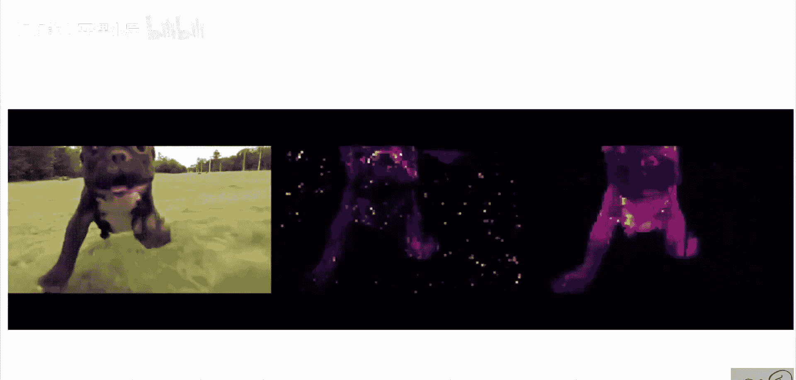
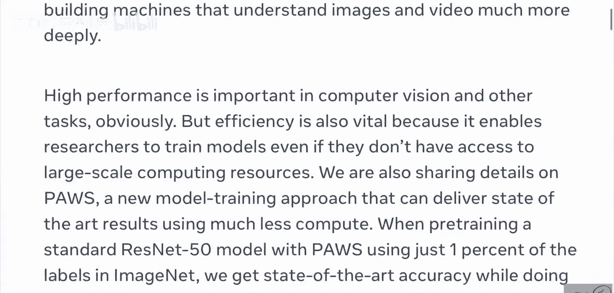
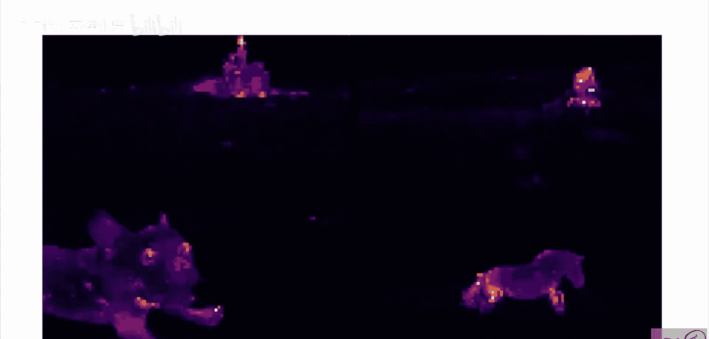
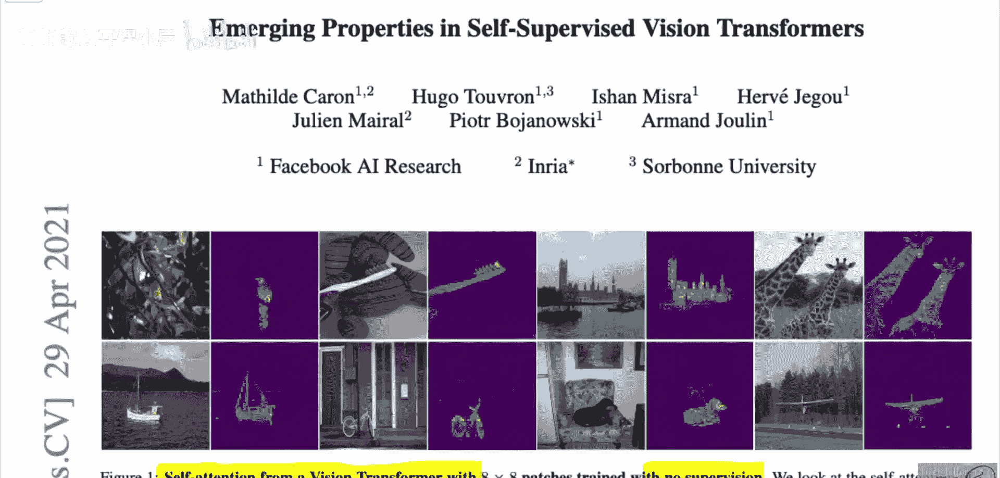
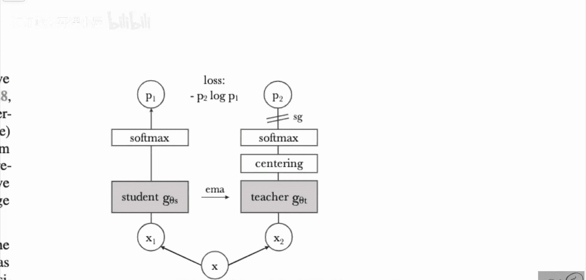

# 032：自监督视觉Transformer中的新兴特性（Facebook AI研究解析）🎯

## 概述
在本节课中，我们将要学习一篇由Facebook AI Research发表的论文《Emerging Properties in Self-Supervised Vision Transformers》。这篇论文介绍了一种名为DINO（self-**Di**stillation with **N**o labels）的自监督学习方法，用于训练视觉Transformer模型。该方法无需任何人工标注，就能让模型学习到极具表现力的视觉特征，甚至能自动关注图像中的关键物体。







## 核心发现与动机
上一节我们概述了DINO的研究目标，本节中我们来看看其令人印象深刻的发现。

研究人员发现，使用DINO方法无监督预训练的视觉Transformer，其内部的自注意力图能够清晰地聚焦于图像中的语义主体，例如动物、车辆等，而模型从未接受过物体识别或图像分割任务的训练。


更令人惊讶的是，模型展现出了跟踪被遮挡物体的能力。例如，船只在海浪后方移动，马匹在草丛后方移动，这些都在注意力图中得到了清晰的反映。


## DINO能力的进一步展示
除了注意力可视化，DINO学习到的特征表示本身也具有强大的实用性。

以下是DINO特征的一些应用表现：
*   **图像分类**：在ImageNet数据集上，使用DINO预训练的ViT-Base模型提取特征，然后仅在其上训练一个简单的线性分类器，就能达到80.1%的Top-1准确率。
*   **图像检索**：在特征空间中，属于同一类别的图像会自然地聚集在一起。不仅如此，语义相似的类别（如不同品种的狗）也会在特征空间中被放置在相近的位置。
*   **K近邻分类**：甚至可以直接在DINO特征空间中进行K近邻搜索，实现零样本分类。
*   **图像分割**：无需额外操作，模型最后一层的自注意力图本身就提供了接近分割图的效果，这与需要特殊可视化技术的CNN模型不同。




## 视觉Transformer基础回顾
在深入DINO方法之前，我们需要简要回顾一下视觉Transformer的基础知识，因为这是DINO架构的基石。

视觉Transformer是将自然语言处理中成功的Transformer架构应用于图像的一种方法。其核心思想非常简单：
1.  **图像分块**：将输入图像分割成固定大小的图像块（例如16x16像素）。
2.  **序列化**：将这些图像块展平成一个序列。
3.  **线性投影**：通过一个全连接层将每个图像块映射为一个向量，称为“补丁嵌入”。
4.  **添加[CLS]令牌**：在序列开头添加一个特殊的可学习令牌，称为[CLS]令牌。这个令牌不与任何图像位置绑定，用于聚合整个图像的全局信息。
5.  **Transformer编码**：将整个序列（补丁嵌入 + [CLS]令牌）输入标准的Transformer编码器进行处理。
6.  **输出**：Transformer编码器输出一个对应长度的序列。通常，我们取 **[CLS]令牌对应的最终输出向量** 作为整个图像的表示，用于下游任务。

用伪代码可以简要描述这个过程：
```python
# 假设输入图像 image 的尺寸为 (H, W, C)
patches = split_image_into_patches(image) # 形状: (N, P_h, P_w, C)
patch_embeddings = linear_projection(patches) # 形状: (N, D)
cls_token = learnable_cls_token # 形状: (1, D)
sequence = concatenate([cls_token, patch_embeddings], dim=0) # 形状: (N+1, D)
output_sequence = transformer_encoder(sequence) # 形状: (N+1, D)
image_representation = output_sequence[0] # 取出[CLS]令牌对应的输出
```

## DINO方法详解
了解了视觉Transformer的基础后，我们现在可以深入探讨DINO的具体方法了。DINO的核心是一种“自蒸馏”框架。

以下是DINO训练框架的关键组件图示与说明：



DINO同时维护两个网络：一个学生网络和一个教师网络。它们的架构完全相同（都是视觉Transformer），但参数更新方式不同。
*   **学生网络**：通过梯度下降直接更新参数。
*   **教师网络**：其参数是学生网络参数的指数移动平均。这意味着教师网络的参数更新更平滑，可以看作是学生网络参数在过去一段时间内的“集合”。

训练过程如下：
1.  对同一张输入图像生成两个不同的随机增强视图（例如裁剪、颜色抖动等）。
2.  将其中一个增强视图输入学生网络，另一个输入教师网络。
3.  两个网络都输出一个在[CLS]令牌上应用softmax函数得到的概率分布。
4.  训练目标是**最小化学生网络输出与教师网络输出之间的交叉熵损失**。这促使学生网络去模仿教师网络的预测。

为了防止模型退化到平凡的解决方案（例如所有输出都相同，即“模式坍塌”），DINO引入了两个关键技巧：
*   **锐化**：对教师网络的softmax输出使用一个较低的温度参数，使其分布更“尖锐”（概率更集中），这鼓励学生网络学习更确定的特征。
*   **中心化**：对教师网络的输出进行中心化处理（减去一个滑动平均的均值），这有助于避免一个维度主导输出，进一步防止坍塌。

值得注意的是，DINO**不需要负样本对**，这与许多对比学习方法（如SimCLR, MoCo）不同。它完全依靠上述的自蒸馏机制以及锐化、中心化操作来学习有效的特征表示。


## 总结
本节课中我们一起学习了DINO这一创新的自监督视觉Transformer训练方法。我们了解到，通过精心设计的自蒸馏框架，结合动量教师、锐化和中心化技术，DINO能够在完全无标签的情况下，让视觉Transformer学习到高度语义化的特征表示。这些特征不仅在线性评估、图像检索等任务上表现出色，其内部的自注意力机制还能自动定位图像中的主要物体，展现了自监督学习在计算机视觉领域的巨大潜力。