# 033：颠覆卷积的固有特性，在视觉识别中的应用

在本节课中，我们将学习一篇名为《内卷：颠覆卷积的固有特性，在视觉识别中的应用》的研究论文。这篇论文由香港科技大学、字节跳动AI实验室和北京大学的研究人员共同完成。我们将探讨他们如何提出一种名为“内卷”的新算子，旨在替代卷积神经网络中的传统卷积操作，并分析其设计原理、优势及实验结果。

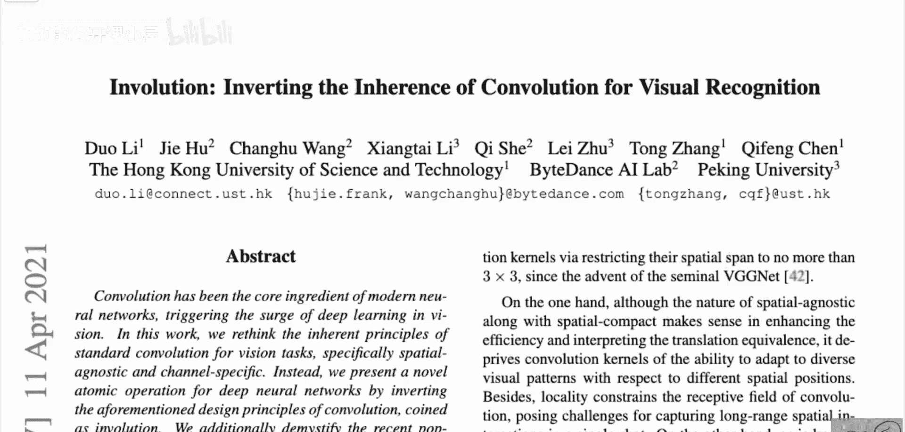

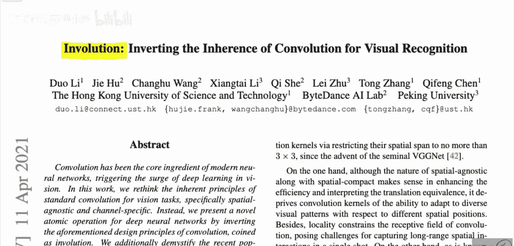

## 概述

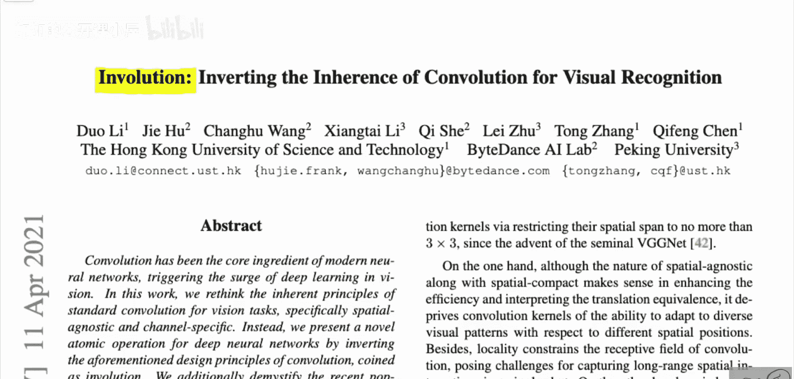

卷积操作是现代神经网络的核心组成部分，推动了深度学习在视觉领域的蓬勃发展。然而，本文的研究人员重新思考了标准卷积在视觉任务中的固有设计原则，并提出了一种新的原子操作——内卷。内卷的本质介于卷积和自注意力操作之间。通过巧妙的权重共享方案，内卷能够在保持参数量和计算成本相对较低的同时，实现与CNN和自注意力网络相媲美的优异性能。

## 卷积的固有特性

上一节我们介绍了论文的总体目标。本节中，我们来看看论文对传统卷积操作固有特性的分析。

研究人员指出，标准卷积具有两个核心设计原则：**空间无关性** 和 **通道特定性**。

*   **空间无关性**：卷积核在输入图像的所有空间位置上执行相同的计算。这意味着无论特征出现在图像的哪个位置，网络都使用相同的权重进行处理。这是卷积神经网络**平移不变性**的基础，也是一种权重共享形式，使得网络无需为图像不同位置的相同模式重复学习参数。
*   **通道特定性**：每个输出通道都对应一个独立的卷积核。这意味着网络为生成不同的特征图（例如，检测边缘、角点或特定物体）使用了不同的权重集合。

为了更清晰地理解通道特定性，我们需要深入多通道表示。

假设我们有一个多通道的特征图，可以将其视为一个三维张量。其中，每个空间位置（像素）对应一个向量，向量的维度等于通道数。每个通道的数值可以捕捉该位置特征的某个特定方面（例如，颜色、纹理、是否存在某种形状）。

一个卷积层的权重实际上是一个四维张量，其维度为：`[核高度， 核宽度， 输入通道数， 输出通道数]`。

以下是卷积操作过程的简化描述：

1.  对于每一个输出通道，都有一个独立的卷积核（即一个三维张量：`[核高度， 核宽度， 输入通道数]`）。
2.  将这个核覆盖在输入特征图的某个局部区域上。
3.  执行逐元素相乘，并对所有结果求和，最终得到一个标量值。这个值就是输出特征图在该空间位置、该输出通道上的数值。
4.  对每个输出通道重复此过程，最终为每个空间位置生成一个多维向量，构成新的特征图。

因此，卷积是“通道特定”的，因为每个输出特征图都由自己专属的卷积核生成，旨在提取不同类型的特征。

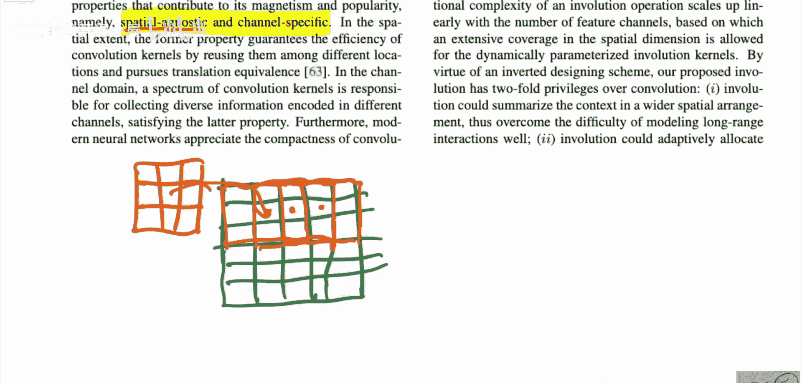

## 内卷的设计思想

理解了卷积的特性后，本节我们来看看内卷如何“颠覆”这些原则。

内卷的核心思想是**反转**卷积的设计原则，使其变为：**空间特定性** 和 **通道无关性**。

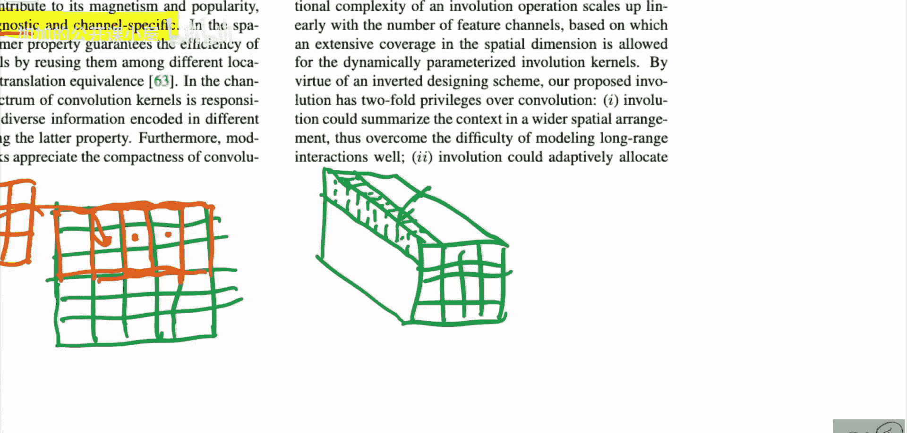

*   **空间特定性**：内卷核的权重不是固定不变的，而是根据输入特征图每个空间位置的内容**动态生成**的。这意味着在不同位置，内卷核可以有不同的值，从而能更灵活地适应局部上下文信息。
*   **通道无关性**：同一个内卷核被所有通道共享。这意味着对于给定的空间位置，所有输入通道都使用相同的权重集合进行聚合，然后再通过后续的变换（如1x1卷积）来混合通道信息。

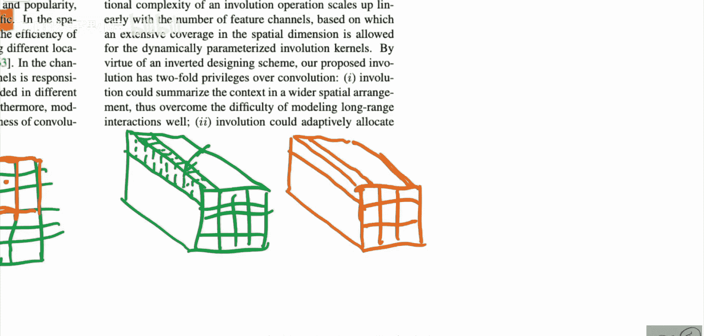

内卷操作可以概括为以下步骤：

1.  **核生成**：根据输入特征图当前位置 `(i, j)` 的特征向量，通过一个函数 `φ`（通常是一个小型神经网络，如两个全连接层）动态生成一个 `K x K` 的内卷核 `H_{i,j}`。其中 `K` 是核大小。
    *   公式示意：`H_{i,j} = φ(X_{i,j})`，其中 `X_{i,j}` 是位置 `(i, j)` 的特征向量。
2.  **特征聚合**：将这个动态生成的内卷核 `H_{i,j}` 作用于以 `(i, j)` 为中心的 `K x K` 邻域内的所有位置。但请注意，由于是通道无关的，这个核会同时应用于所有输入通道的对应邻域。
    *   操作示意：对于邻域内的每个偏移位置 `(Δi, Δj)`，输出 `Y_{i,j}` 是所有输入通道在 `(i+Δi, j+Δj)` 处的值，分别与核 `H_{i,j}` 在 `(Δi, Δj)` 处的权重相乘后的结果。
    *   简化理解：可以看作是为每个位置学习了一个自适应的空间聚合模式。

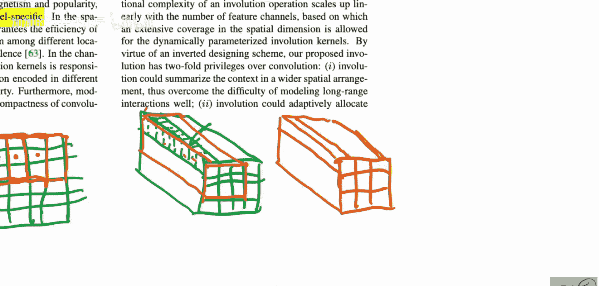

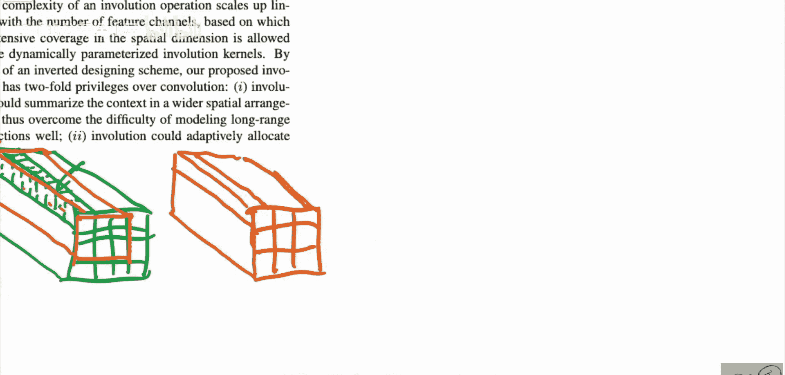

## 内卷与自注意力的联系

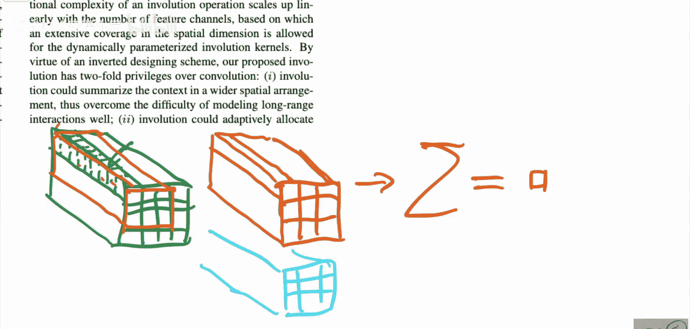

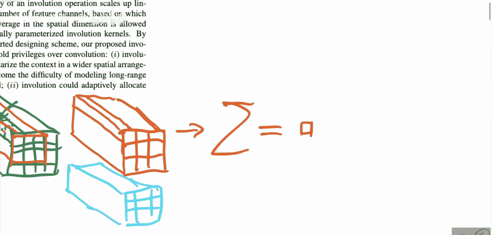

上一节我们介绍了内卷的基本操作。本节中，我们探讨内卷与另一种流行机制——自注意力的关系。

论文指出，自注意力机制可以被视为内卷家族的一个**过度简化的特例**。在自注意力中：
*   “核”的大小等于整个特征图的大小（全局感受野）。
*   “核”的权重（即注意力权重）由查询-键的点积计算得出，这同样是一种基于输入内容动态生成权重的方式。
*   它通常也是通道无关的（在视觉Transformer中，注意力通常在每个通道内独立计算或轻微混合）。

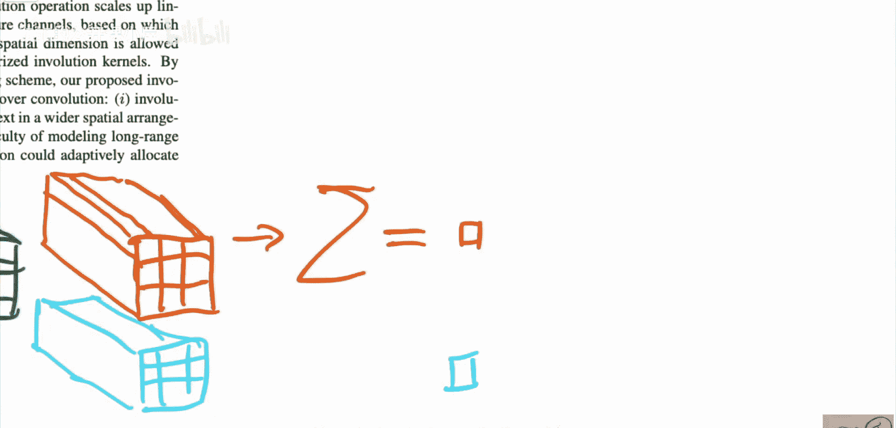

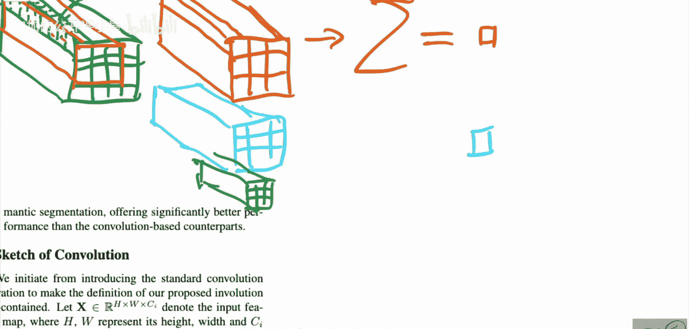

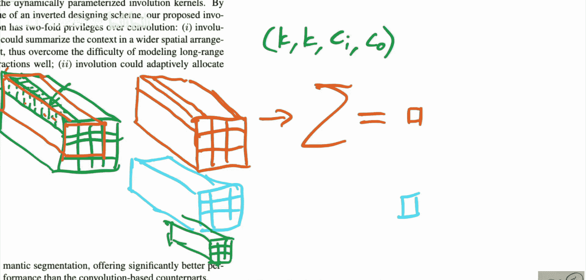

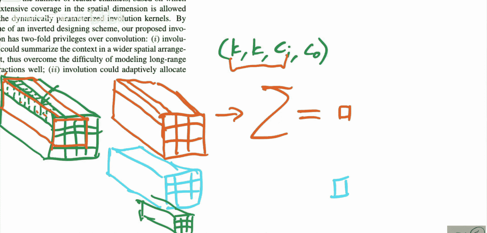

因此，内卷提供了一个更通用的框架，其中卷积（固定核、局部）和自注意力（动态核、全局）都可以被视为其在不同设计选择下的具体实例。内卷通过限制核大小为局部邻域，在灵活性和计算效率之间取得了平衡。

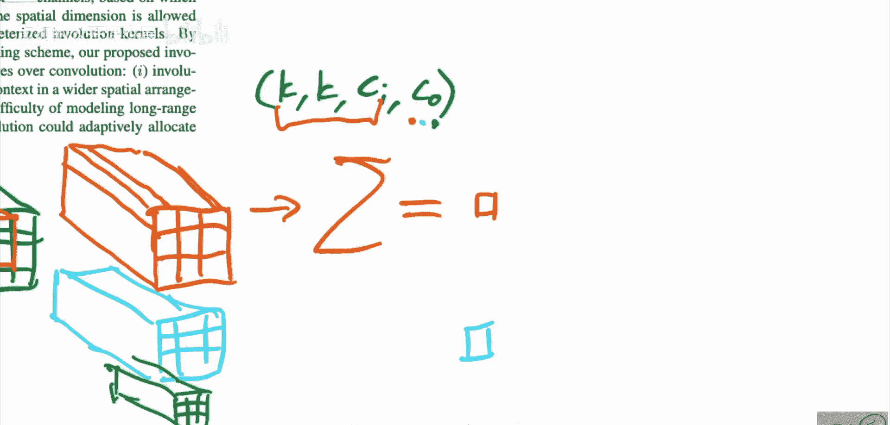

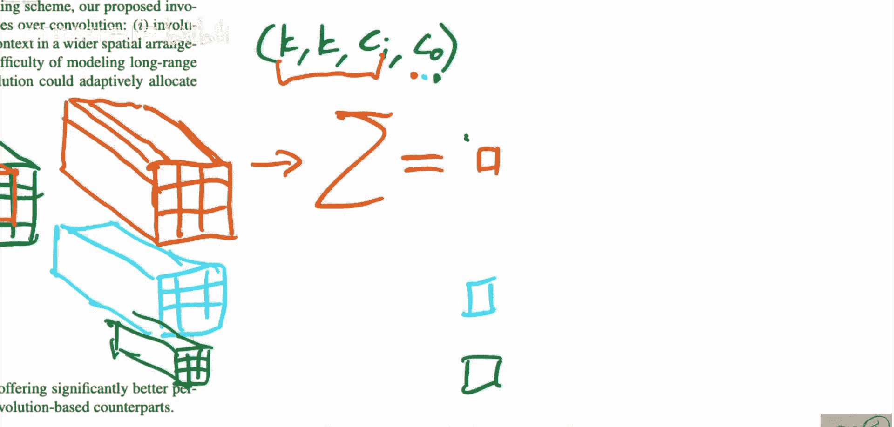

## 实验与优势

理论设计需要实验验证。以下是论文中展示的内卷的一些关键优势：

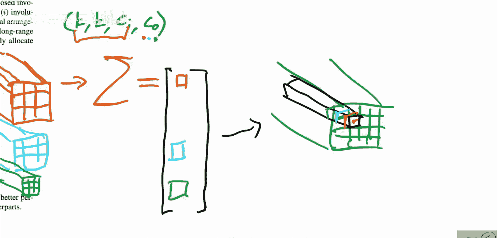

*   **性能提升**：在ImageNet分类、COCO目标检测和实例分割等标准视觉任务上，将现有CNN架构（如ResNet）中的卷积块替换为内卷块，能够一致地提高模型精度。
*   **参数与计算效率**：由于内卷核是动态生成且通道共享的，它所需的参数量远少于传统卷积（后者需要为每个输出通道存储一个独立的静态核）。这带来了更高的参数效率。
*   **缓解模型退化**：在非常深的网络中，内卷展现出比卷积更弱的性能退化现象，表明其可能具有更好的优化特性。

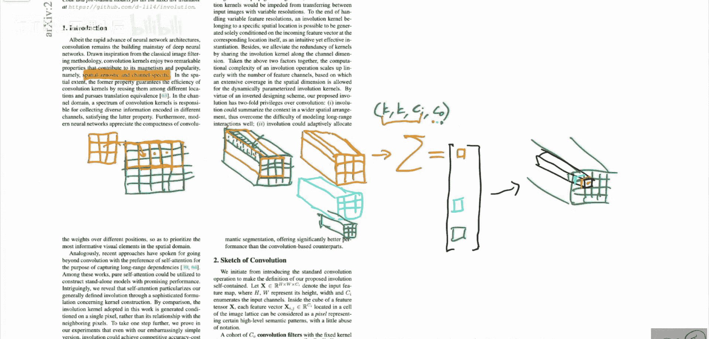

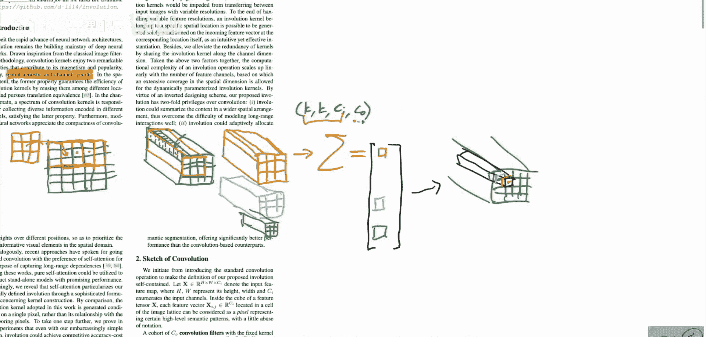

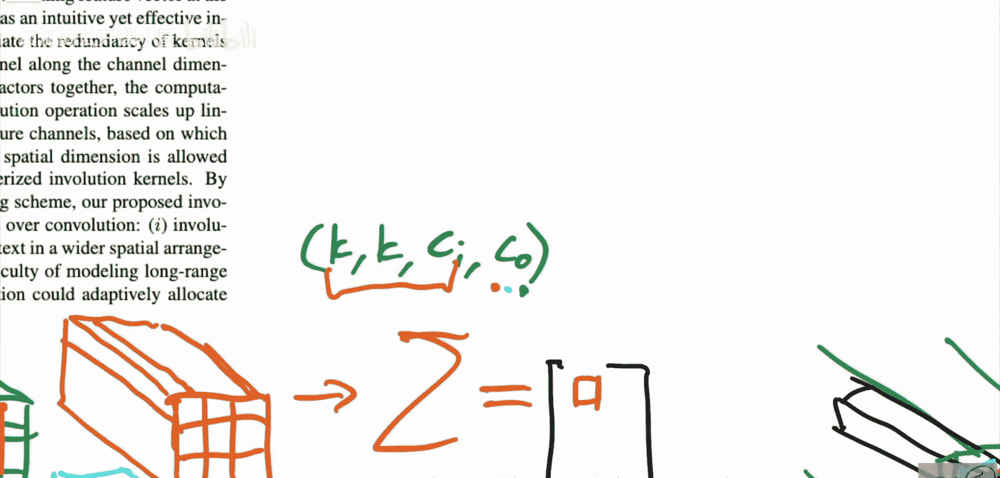

## 总结

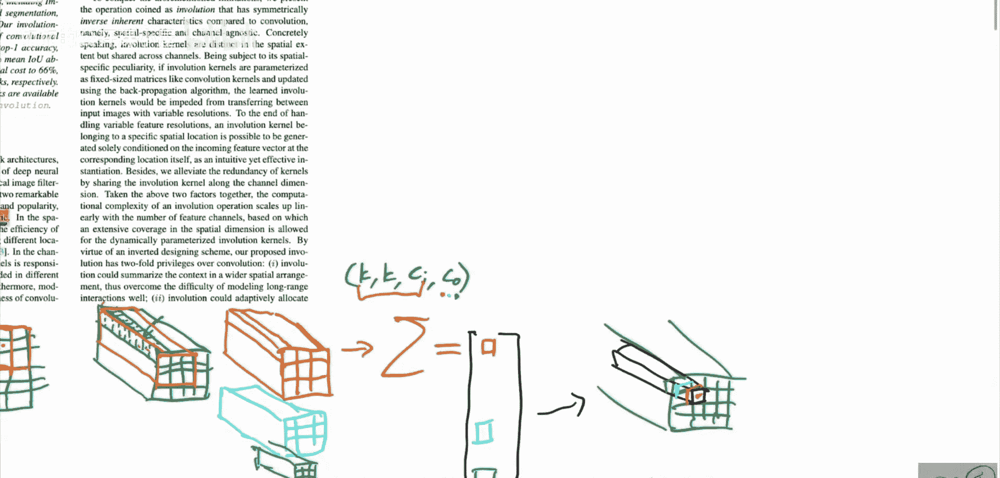

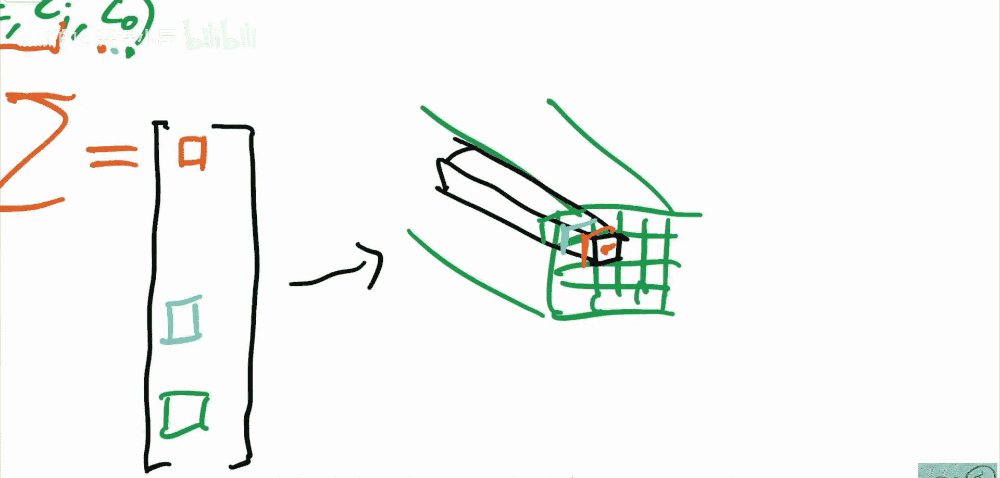

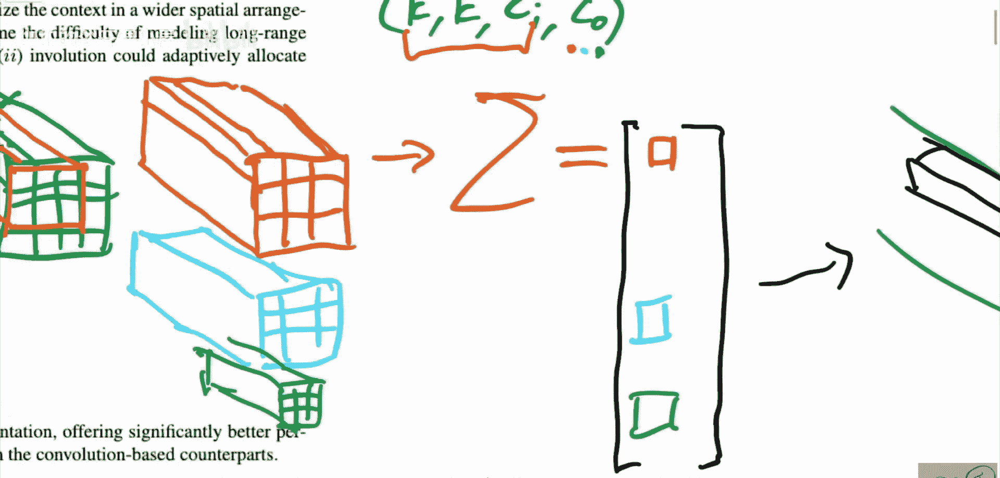

本节课中，我们一起学习了《内卷：颠覆卷积的固有特性，在视觉识别中的应用》这篇论文。我们首先回顾了传统卷积**空间无关、通道特定**的固有特性。接着，我们深入探讨了内卷算子如何通过反转这些原则，变为**空间特定、通道无关**，从而动态生成适应局部上下文的卷积核。我们还看到了内卷如何作为一个通用框架，将自注意力机制涵盖其中。最后，通过论文的实验结果，我们了解到内卷在提升模型性能、增加参数效率方面的潜力。这种设计为视觉模型架构提供了介于经典卷积与全局自注意力之间的一种新颖且高效的选择。