# 035：记忆并非生而平等——通过过期机制学习遗忘》教程

## 概述

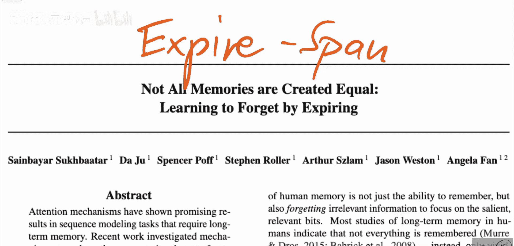

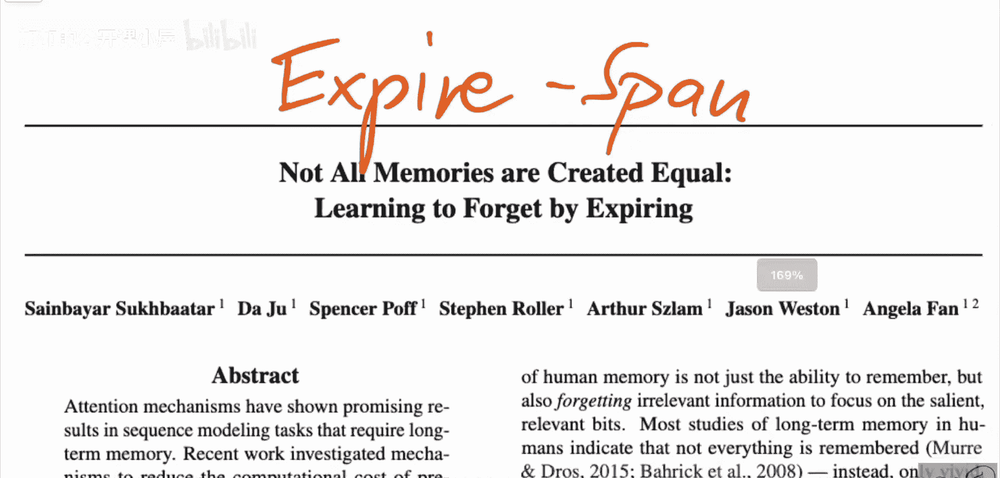

在本节课中，我们将学习一篇名为《过期跨度：记忆并非生而平等——通过过期机制学习遗忘》的论文。该论文由Facebook AI Research和Laurier的研究人员提出，核心思想是对Transformer的自回归注意力机制进行改进，使其能够处理更长的上下文序列。其核心方法是让模型学会“遗忘”——即决定哪些过去的记忆值得保留，以及保留多久，从而在保持性能的同时，显著提升计算效率。

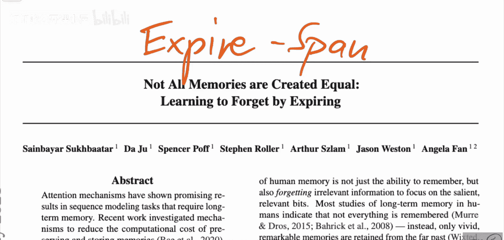

## 核心问题：传统注意力机制的瓶颈

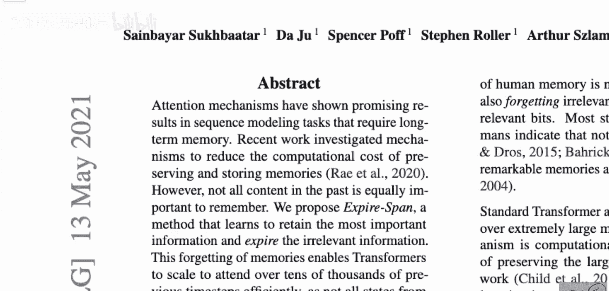

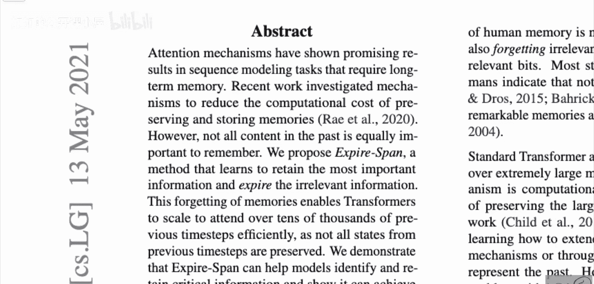

上一节我们介绍了论文的总体目标。本节中我们来看看它要解决的核心问题。

在标准的自回归Transformer解码器中，为了预测序列中的下一个词元，模型需要关注之前所有词元的信息。这导致了计算复杂度和内存需求随着序列长度 `n` 呈 `O(n²)` 增长。当处理非常长的序列时，这会成为一个巨大的瓶颈。

然而，并非所有过去的词元都同等重要。例如，在句子“The cat sat on the mat.”中，预测最后一个词“mat”时，动词“sat”和介词“on”可能比第一个冠词“The”更重要。理想情况下，模型应该学会记住重要的信息，而忘记不重要的信息。

## 解决方案：过期跨度机制

上一节我们指出了传统注意力机制在处理长序列时的效率问题。本节中我们来看看论文提出的“过期跨度”解决方案。


过期跨度机制的核心是为序列中每个位置生成的隐藏状态 `H_t` 额外预测一个值：**过期时长 `E_t`**。这个 `E_t` 表示该隐藏状态在未来的多少个时间步内是“有效”的，可以被后续的词元关注。一旦超过了这个时长，该记忆就会被丢弃，后续的词元将无法再访问它。

以下是该机制的关键步骤：


1.  **生成隐藏状态与过期时长**：对于序列中的每个时间步 `t`，模型像往常一样生成隐藏状态 `H_t`，并额外通过一个线性层预测一个标量 `E_t`。
    ```python
    # 伪代码示意
    H_t = TransformerLayer(previous_states)  # 标准隐藏状态
    E_t = torch.nn.Linear(H_t.dim, 1)(H_t)   # 预测过期时长
    ```
2.  **管理记忆缓冲区**：模型维护一个“记忆缓冲区”，其中存储着所有尚未过期的 `(H_i, E_i)` 对。
3.  **执行注意力计算**：当计算当前时间步 `t` 的注意力时，模型只关注记忆缓冲区中那些尚未过期的隐藏状态 `H_i`。
4.  **更新与清理**：每个时间步结束后，所有记忆的剩余有效期 `E_i` 减1。任何 `E_i <= 0` 的记忆将从缓冲区中被移除。

## 过期跨度 vs. 局部注意力

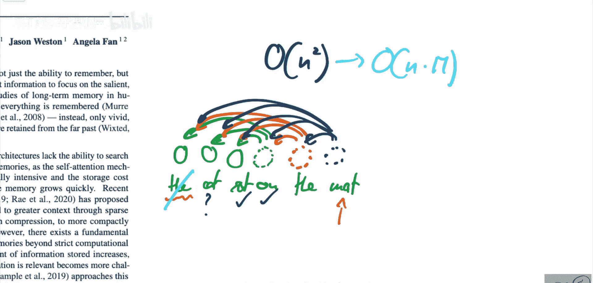

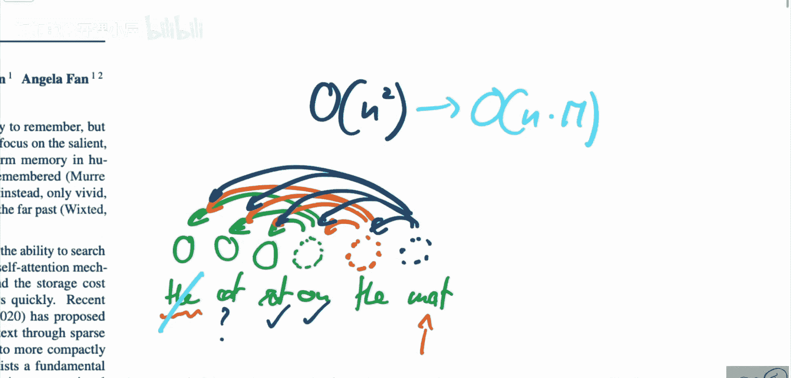

上一节我们介绍了过期跨度的基本工作原理。本节中我们将其与另一种常见的优化方法——局部注意力进行对比，以突出其优势。

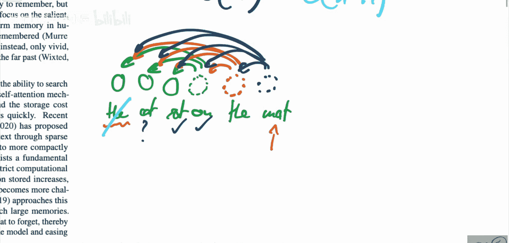

局部注意力为注意力计算设置了一个固定的窗口大小 `L`。在预测当前词元时，模型只能关注其前 `L` 个词元。

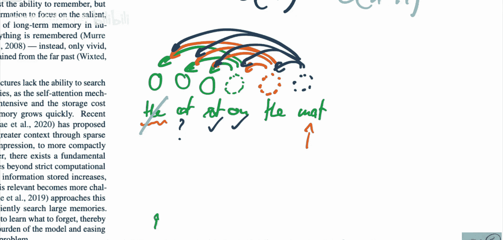

*   **局部注意力**：采用**固定窗口**。无论信息重要与否，一旦超出窗口范围就会被强制遗忘。
*   **过期跨度**：采用**动态、自适应的记忆寿命**。重要的信息可以被赋予很长的有效期（甚至接近无限），从而在很远的未来仍能被记起；而不重要的信息则被赋予很短的有效期，迅速被遗忘。

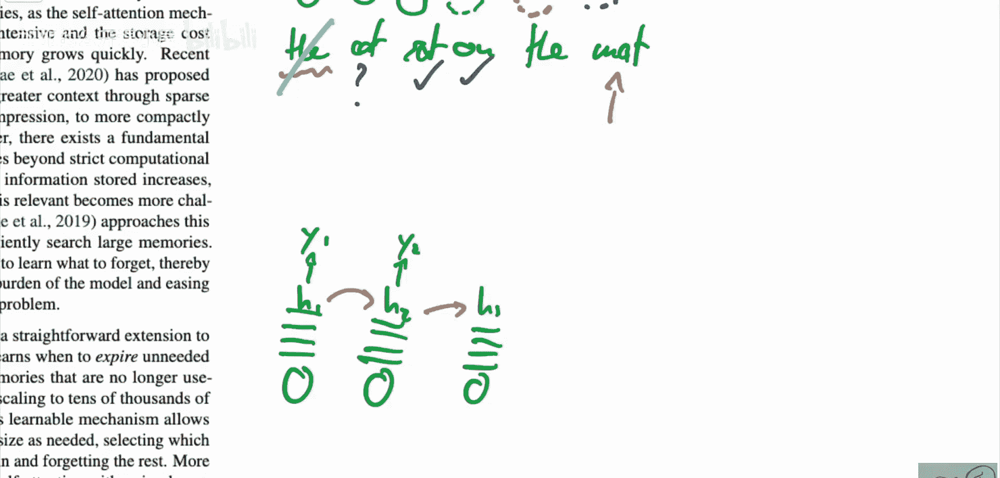

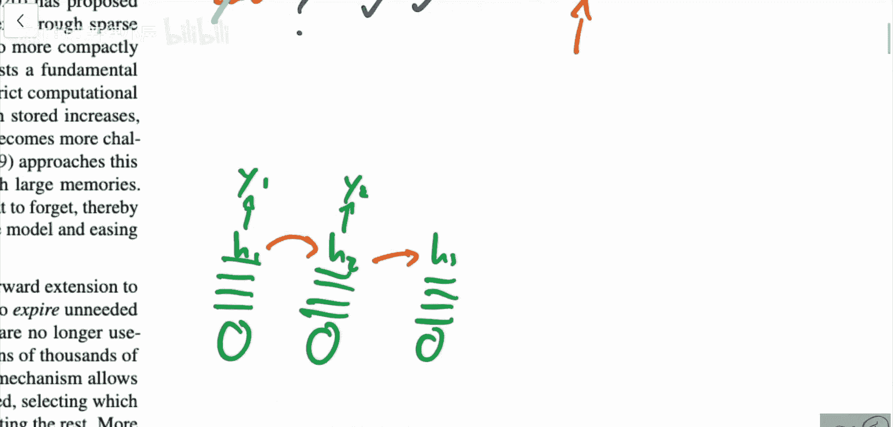

因此，过期跨度机制比固定窗口更灵活、更智能。它允许模型根据内容的重要性，动态地决定记忆的保留时长，从而在长程依赖任务中可能表现更好。

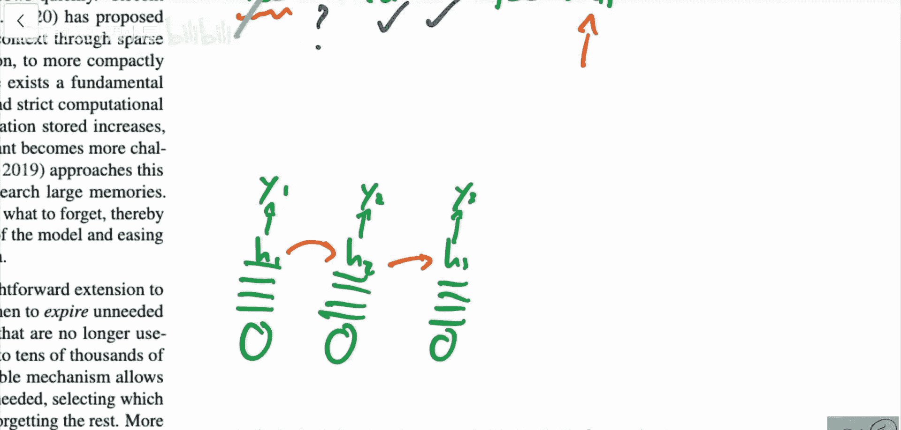

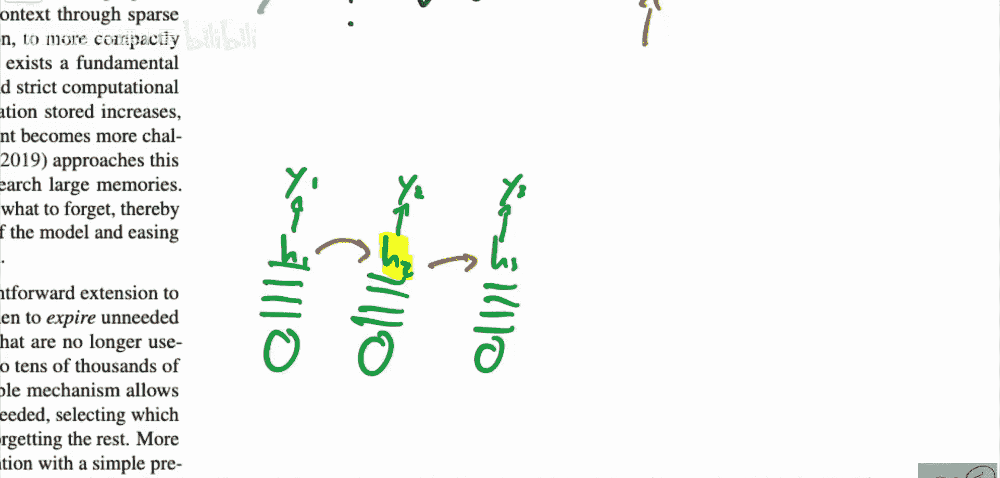

## 机制详解与图示

上一节我们对比了不同方法。本节中我们结合论文中的图示，更具体地理解过期跨度的运作流程。

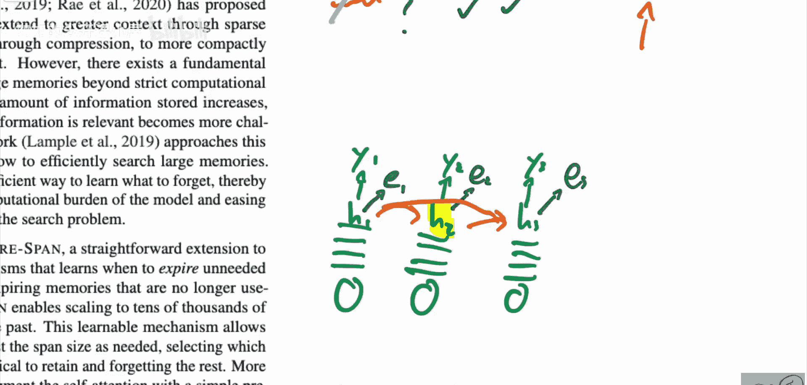

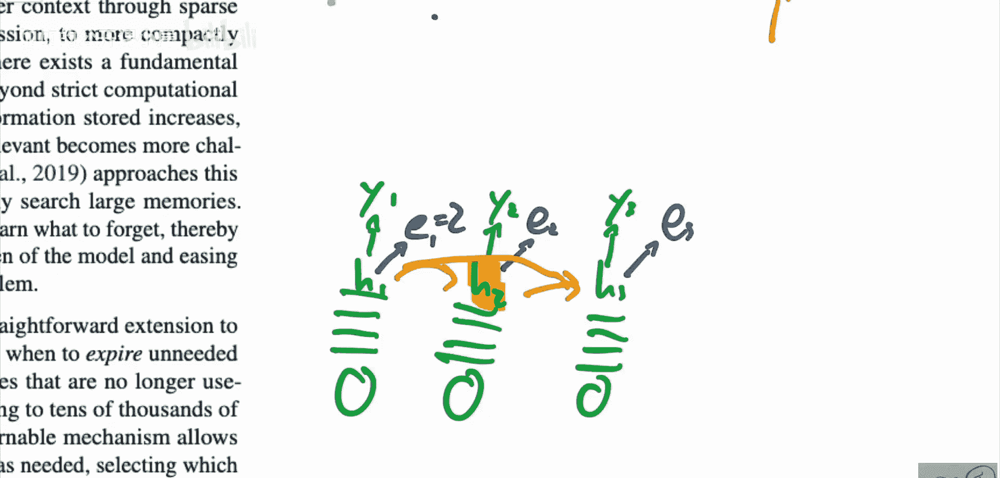

假设我们有一个序列，正在处理第4个时间步（对应隐藏状态 `H_4`）。

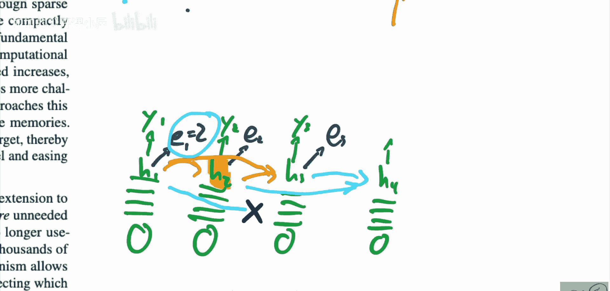

1.  **记忆状态**：此时记忆缓冲区中存有 `H_1`, `H_2`, `H_3` 及其各自的剩余有效期。
2.  **检查有效期**：假设 `H_1` 的初始过期时长 `E_1` 被预测为2。那么，在生成 `H_3` 时它有效，但在生成 `H_4` 时，其剩余有效期已耗尽（`E_1` 已减至0）。
3.  **执行注意力**：`H_4` 在计算注意力时，只能关注未过期的 `H_2` 和 `H_3`。`H_1` 已被从缓冲区中丢弃。
4.  **预测与更新**：基于 `H_2` 和 `H_3` 的信息生成 `H_4` 和 `y_4`。同时，为 `H_4` 预测一个新的过期时长 `E_4`。最后，将所有缓冲区中记忆的剩余有效期减1。

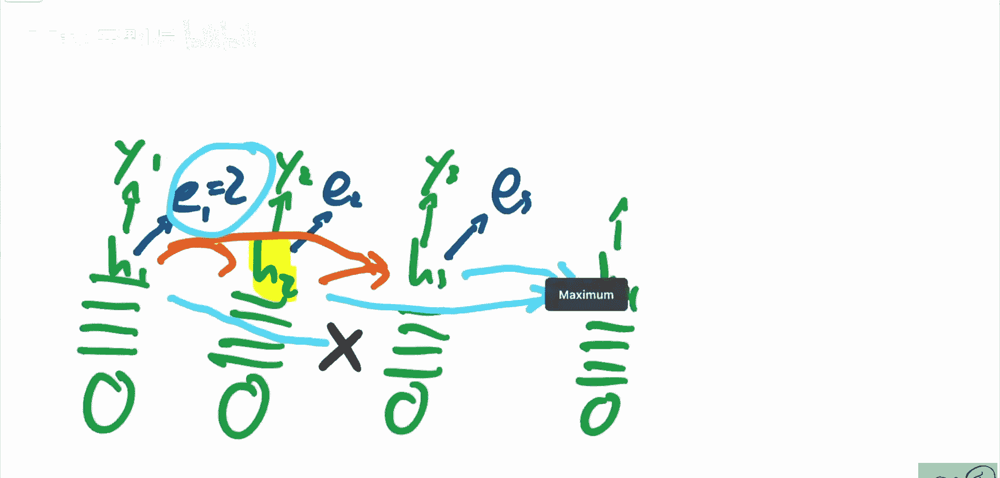

这个过程在每一个时间步重复进行。模型通过训练学习如何为每个隐藏状态分配合适的 `E_t`，以优化最终的任务表现（如语言建模的准确性）。

## 总结

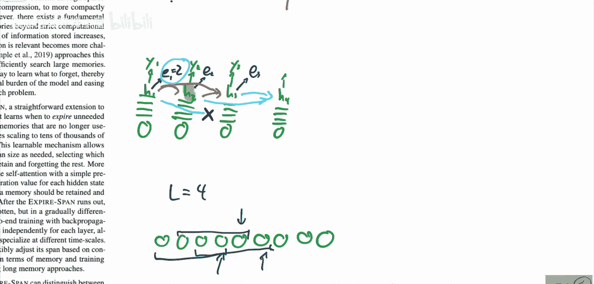

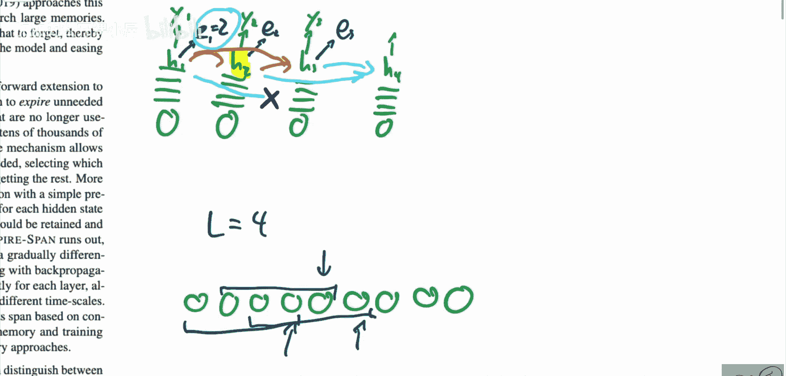

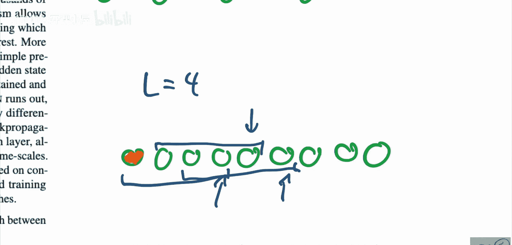

本节课中我们一起学习了《过期跨度》这篇论文。我们了解到，为了克服Transformer模型在处理长序列时的 `O(n²)` 计算瓶颈，研究者们提出了一种让模型学会“选择性遗忘”的机制。

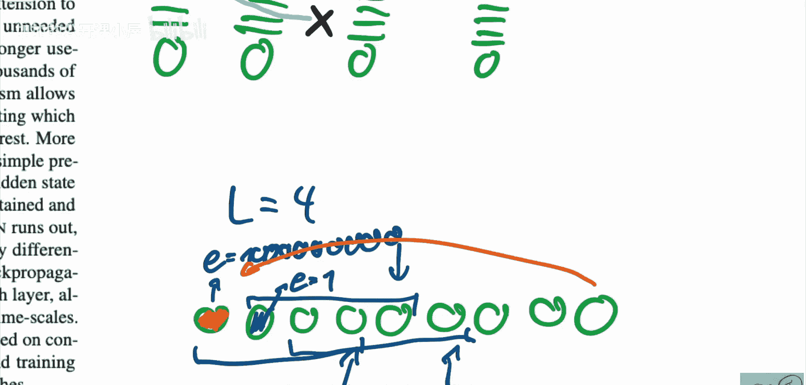

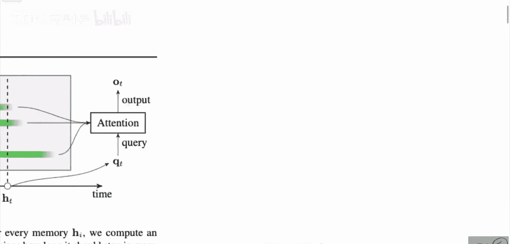

该机制的核心是**为每个记忆（隐藏状态）预测一个过期时长 `E_t`**。通过这种方式，模型可以动态地保留重要的信息以供长期使用，同时丢弃不相关的信息以节省计算资源。这与固定窗口的局部注意力相比，提供了更灵活、更高效的长序列处理能力。这种方法在需要长期记忆特定信息的任务中展现出了潜力。