# 036：循环独立机制的快速与慢速学习 🧠

在本节课中，我们将学习一篇名为《循环独立机制的快速与慢速学习》的论文。这篇论文在先前提出的“循环独立机制”基础上，提出了一种新的更新方法，旨在通过在不同时间尺度上学习不同子系统的参数，来提升智能体在多任务环境中的泛化能力。

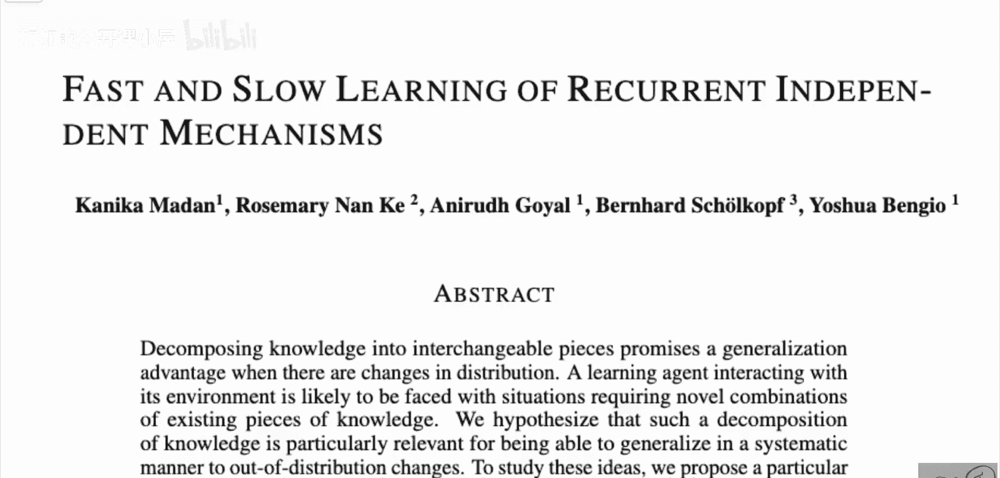

## 概述与背景

上一节我们介绍了课程的基本信息，本节中我们来看看这篇论文的核心动机。

论文摘要指出，将知识分解为可互换的模块，有望在数据分布发生变化时带来泛化优势。一个与环境交互的学习智能体，很可能会遇到需要将现有知识模块进行新颖组合的新情况。

论文的核心假设是：在一个包含多种子任务、且环境本身会发生变化的环境中，重新组合已有的知识模块会很有帮助。论文中一个关键实验环境是网格世界。

## 网格世界环境示例

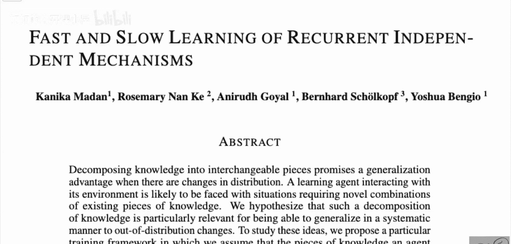

为了理解论文解决的问题，我们需要先了解其使用的典型环境。以下是网格世界环境的一个简单描述：

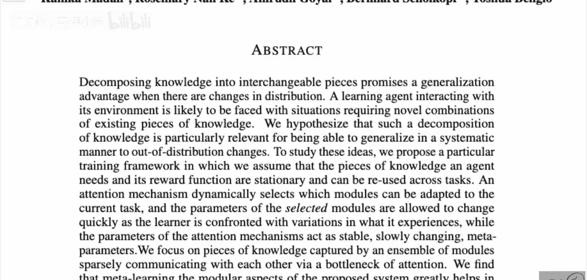

*   环境是一个网格，智能体占据其中一个单元格。
*   环境中存在不同的物体，例如钥匙、门或橘子。
*   智能体在每个回合会收到一个文本指令，例如“拿到钥匙”或“去吃橘子”。
*   智能体的目标是根据指令与环境交互并获得奖励。
*   环境可以变化，例如物体位置改变、网格大小改变或指令内容改变。

这些不同的任务共享一些底层结构（如网格、物体类型），但每个回合的具体目标可能不同。如果使用一个单一的大型神经网络作为智能体，并通过奖励来更新所有网络参数，就会面临一个经典问题：灾难性遗忘。

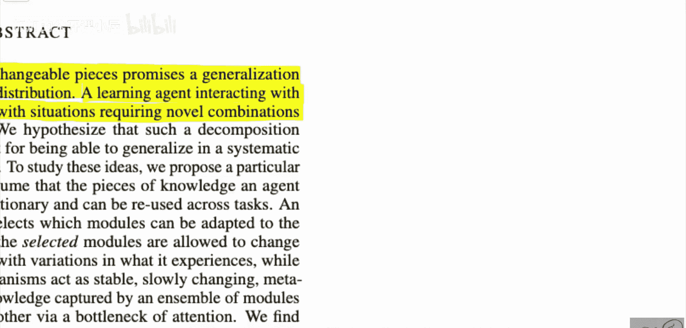

## 灾难性遗忘问题

上一节我们描述了多任务环境，本节中我们来看看传统方法面临的核心挑战。

当智能体学习第一个任务（如“找钥匙”）时，它会更新所有网络参数以优化该任务。当任务切换到第二个任务（如“找橘子”）时，网络为了适应新任务，会再次更新所有参数。这可能导致网络完全忘记如何执行第一个任务，这种现象被称为**灾难性遗忘**。

## 循环独立机制简介

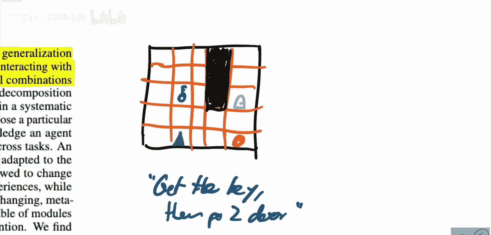

为了解决灾难性遗忘并实现知识复用，先前的研究提出了**循环独立机制**。其核心思想是：

不将智能体实现为一个单一的大网络，而是将其实现为一组专门化的子模块集合。每个子模块专注于处理特定的子技能或子任务（例如“识别钥匙”、“移动到某处”）。

在每个时间步，一个基于注意力的高层模块会评估当前情境，并选择激活与当前任务相关的子模块子集。只有这些被激活的子模块会参与计算并接收学习信号（梯度更新），其他不相关的模块则保持固定。

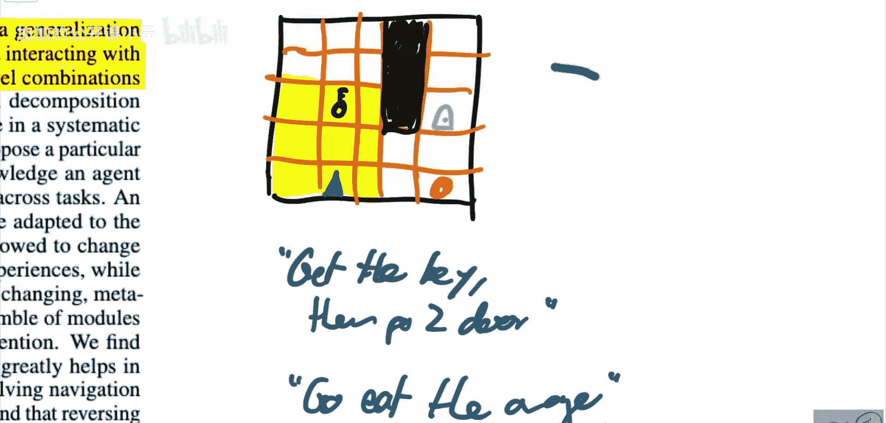

这类似于人脑的工作方式：面对不同任务时，我们调用不同的技能组合，而非每次都用整个大脑解决所有问题。

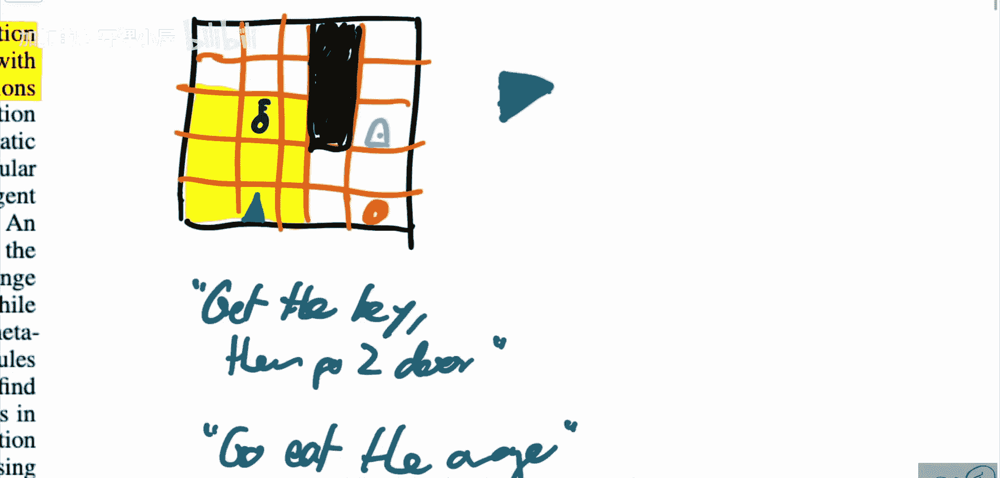

## 快速与慢速学习更新

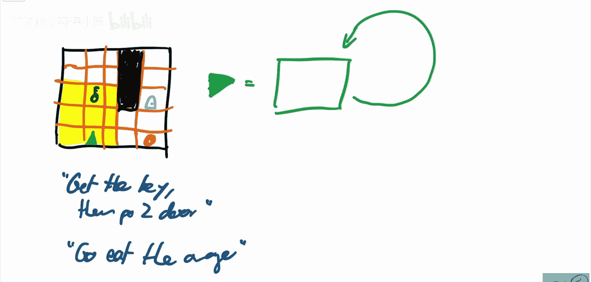

上一节我们介绍了RIM的基本架构，本节中我们来看看本篇论文提出的核心改进。

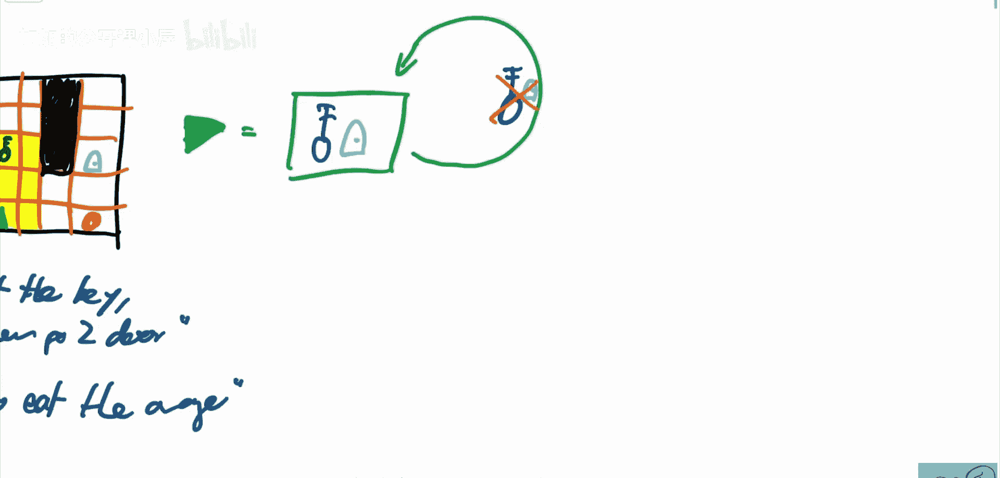

本篇论文在RIM的基础上，提出了一个关键改进：**对不同层次的参数使用不同的学习时间尺度**。

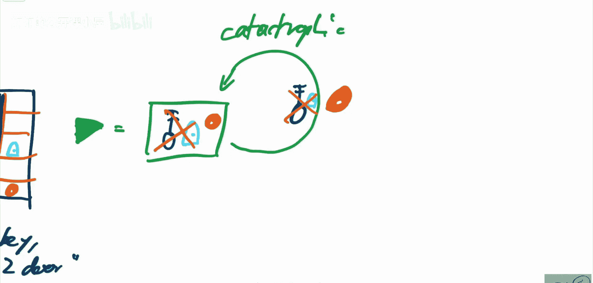

具体来说：
*   **底层子模块参数**：这些参数对应具体的技能（如“移动”、“识别”），它们需要快速适应特定任务的细节。因此，它们以**较快**的时间尺度进行学习（即学习率较高，更新更频繁）。
*   **高层协调模块参数**：这些参数负责选择和组织子模块（即注意力机制），它们需要学习跨任务的通用组合策略。因此，它们以**较慢**的时间尺度进行学习（即学习率较低，更新更平缓）。

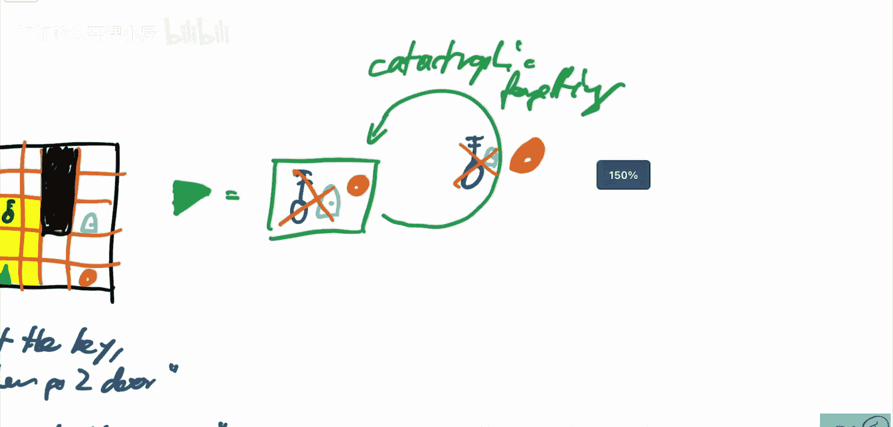

这种**解耦学习**策略的目标是：让高层模块能够学习到稳健的、可泛化的任务组合规律，从而在面对全新任务时，能通过快速调整底层模块来有效应对，而无需改变高层的组合逻辑。

## 方法总结与评价

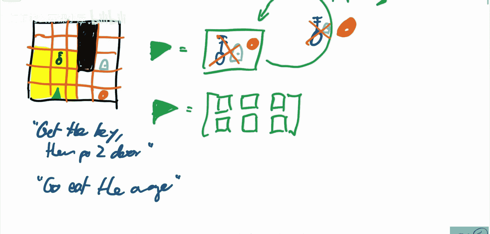

在本节课中，我们一起学习了《循环独立机制的快速与慢速学习》这篇论文。

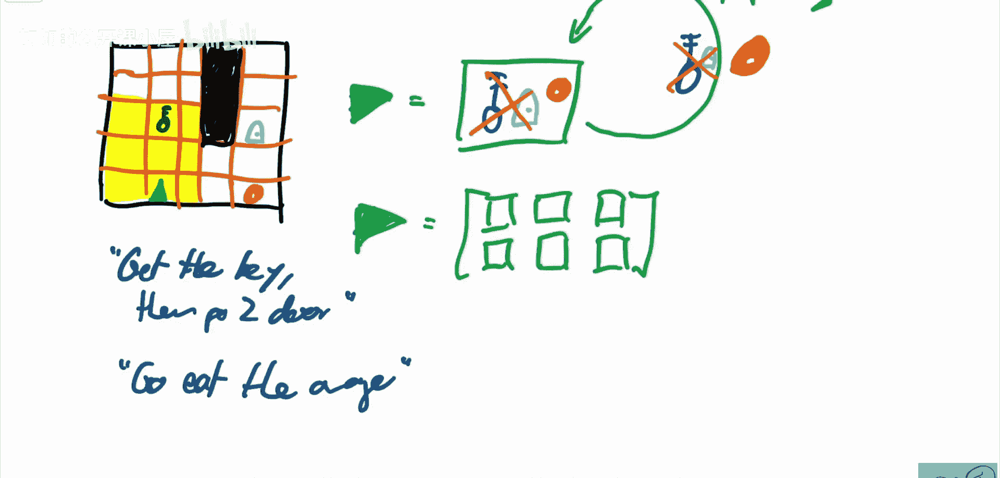

我们首先了解了其旨在解决的多任务环境中的灾难性遗忘问题。然后，回顾了**循环独立机制**如何通过模块化和选择性激活来缓解该问题。最后，重点讲解了本篇论文的核心贡献——**对高层和底层参数采用快慢不同的学习速率**，以促进更好的泛化能力。

论文通过实验表明，这种改进方法在具有多任务、多目标结构的环境中能带来性能提升，并能较好地泛化到未见过的任务。

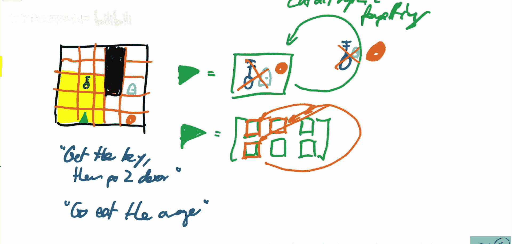

需要指出的是，论文作者将其方法称为“元学习”，但这一点可能存在争议。此外，尽管想法直观，但论文对于该方法为何有效以及其适用边界的分析深度可能尚有不足。不过，它确实为构建更灵活、更健壮的多任务学习智能体提供了一个有趣的方向。